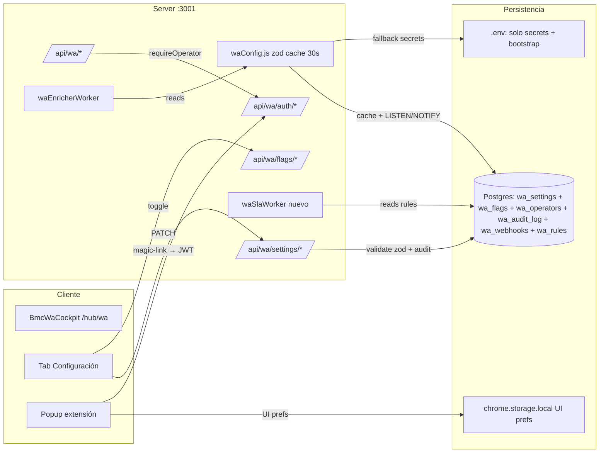

# WA Module Pro Settings — Plan de Implementación

Aprendido de **Missive / Front / Intercom** (top management systems) y de los **patterns 2026** (zod-as-source-of-truth, feature flags vs config separados, magic-link → short-JWT + refresh): la app sale con la profundidad de un Missive pero con la simplicidad de un MVP — 3 roles, <30 flags, una sola tabla de settings, dos tablas de soporte (`wa_operators`, `wa_audit_log`).

## Tres principios de diseño (no negociables)

1. **Feature flags ≠ runtime config ≠ secrets**. Cada uno vive en su lugar y se edita distinto. Mezclarlos es el error #1 que vimos en proyectos similares.
2. **Zod schema = single source of truth**. Tipos TypeScript, validación API, validación DB, defaults, docs auto-generadas: todo derivado del mismo archivo. Un cambio = un archivo.
3. **SLA-first, no manual-first**. Los managers líderes (Missive, Front) automatizan: "unreplied >X horas → alerta", "unassigned >Y → reasignar". Lo que hoy hacemos con `wa_followups` manual debería ser **reglas declarativas** que el sistema aplica solo.

## Arquitectura

**Precedencia**: `wa_settings.value` (tenant) → `wa_operators.overrides` (per operator, opcional) → `process.env` (solo secrets+bootstrap) → default del schema zod.

## Separación crítica: 3 tipos de configuración

| Tipo | Vive en | Editable por | Cambio gatilla | Ejemplos |
|------|---------|--------------|----------------|----------|
| **Secrets** | `.env` solamente | DevOps (vos) | Redeploy | `WA_JWT_SECRET`, `DATABASE_URL`, `WHATSAPP_ACCESS_TOKEN`, `ANTHROPIC_API_KEY` |
| **Feature flags** | `wa_flags` (PG) | Owner/Admin desde UI | Inmediato (cache 30s) | `enricher.enabled`, `webhooks.enabled`, `autoQuote.enabled` |
| **Runtime config** | `wa_settings` (PG) | Owner/Admin desde UI | Inmediato (cache 30s) | Intervalos, modelos AI, prompts, SLA hours, rate limits |

Esto elimina el "todo es env" que tenemos hoy y respeta el principio Sachith 2026: **flags = switches rápidos, config = valores estables, secrets = nunca tocar**.

## Fase A — Base persistente (server)

### A1. Migraciones nuevas en [wa-package/migrations/](wa-package/migrations/)

- **`010_wa_settings.sql`**: `wa_settings (key text, scope text, scope_id text, value jsonb, updated_at, updated_by, primary key (key, scope, scope_id))`. `scope` ∈ `{tenant, operator}`. `scope_id = 'tenant'` o `operator_id`.
- **`011_wa_flags.sql`**: `wa_flags (key text pk, enabled bool, rollout_percent int default 100, owner text, expires_at, description, updated_at, updated_by)`. Best practice 2026: cada flag tiene **owner + expiración + cleanup plan**.
- **`012_wa_operators.sql`**: `wa_operators (operator_id pk, email unique, name, role text check (role in ('owner','admin','member')), status, created_at, last_login_at, last_active_at, refresh_token_hash, refresh_expires_at, jwt_revoked_at, overrides jsonb, business_hours jsonb)`. Roles canónicos Missive: **Owner** (1 solo), **Admin** (configura), **Member** (opera).
- **`013_wa_audit_log.sql`**: `wa_audit_log (id, occurred_at, operator_id, action, target, before jsonb, after jsonb, ip text, user_agent text)`. Antes/después en cambios de settings = compliance-ready.
- **`014_wa_webhooks.sql`**: `wa_webhooks (id, event, url, secret, headers jsonb, enabled, retry_policy jsonb, last_status, last_error, created_at)`. Eventos: `message.in`, `message.out`, `quote.created`, `followup.due`, `sla.breach`, `operator.invited`.
- **`015_wa_rules.sql`**: `wa_rules (id, name, enabled, priority int, when_conditions jsonb, then_actions jsonb, created_at, updated_at)` — **Missive-style routing rules**. Reemplaza el `owner_op` manual con: "si chat tiene phone matching X → assign Carlos", "si contiene 'urgente' → label hot + alert".
- **`016_wa_sla.sql`**: `wa_sla_breaches (id, chat_id, kind, breached_at, resolved_at)` para tracking de breaches detectados por `slaWorker`. Métricas para dashboard.

### A2. Config loader [server/lib/waConfig.js](server/lib/waConfig.js) (nuevo) — el corazón

- **Schema único** en [server/lib/waConfigSchema.js](server/lib/waConfigSchema.js) usando **zod**: define settings + flags + tipos + defaults + docs en un solo archivo. Patrón 2026: `z.object({...}).describe(...)` → tipos TS + validación API + docs auto-generadas (zod-to-openapi).
- API: `getConfig({ operatorId? })` devuelve objeto tipado completo. `getFlag(key)` para flags. `setSetting(key, value, { operatorId, scope, actor })` valida con zod y escribe + audit + `NOTIFY wa_config_changed`.
- Cache: LRU 30s con invalidación inmediata via `LISTEN wa_config_changed` Postgres (latency real <50ms cluster-wide).
- **Healthcheck**: si zod falla al validar lo que está en DB (drift), loguear warning y usar default — **no crashea el server**, jamás. Best practice flexkit.net 2026.

### A3. Auth híbrida [server/lib/waOperatorAuth.js](server/lib/waOperatorAuth.js) (nuevo) — pattern Auth.js v5

Crítico: NO usar JWT 30d como tenía el plan v1 (riesgo XSS, no revocable). Patrón 2026:

- **Magic link inicial**: `POST /api/wa/auth/request-magic-link {email}` → token 32 bytes, hash en DB, expira 15min, mail via SMTP existente (`magazine:daily:send`).
- **Verify → emite par de tokens**:
  - **Access JWT** corto (15min, claims `sub, email, role, iat, exp`). HS256 con `WA_JWT_SECRET`.
  - **Refresh token** (random 32 bytes, hash en DB en `wa_operators.refresh_token_hash`, TTL 30 días). HttpOnly cookie + same-site=strict.
- `POST /api/wa/auth/refresh` → valida refresh, **rotación obligatoria** (emite nuevo refresh, invalida el anterior, detecta reuse → revoca todos los tokens del operador).
- `POST /api/wa/auth/logout` → revoca refresh.
- `requireWaOperator` middleware: lee Bearer JWT, valida firma + exp, attach `req.operator = {id, email, role}`. Si vence en <2min, sugiere refresh.
- **Tenant check** (multi-tenant 2026): JWT incluye `tenant_id`, middleware valida que tenant del JWT == tenant del recurso accedido (anti-IDOR cross-tenant).
- Backward compat: `requireWaAuth` viejo (token compartido) queda **solo** para `/ingest` (extensión sin login) y health checks. Toda ruta de gestión usa `requireWaOperator`.

### A4. Modificación [server/index.js](server/index.js)

- Reemplazar líneas ~976–978 (arranque enricher) por: `await primeWaSettings()` antes de `startWaEnricherWorker`.
- Hacer que `waEnricherEnabled`, `waEnricherIntervalMs`, `waEnricherBatchSize` sean leídos vía `getSetting()` y no `config.*` directo (ver §B1).

## Fase B — Reemplazar hardcoded por configurable

### B1. Enricher [server/lib/waEnricherWorker.js](server/lib/waEnricherWorker.js) y [server/lib/waEnricher.js](server/lib/waEnricher.js)

- Leer en cada tick desde `getSetting`: `enricher.intervalMs`, `enricher.batchSize`, `enricher.maxHistoryMsgs` (hoy 12), `enricher.maxOptions` (hoy 3).
- AI **per-task** (clave del plan): nuevas keys `ai.classify.{provider,model,temperature,maxTokens}`, `ai.suggestions.{...}`, `ai.quoteParse.{...}`, `ai.followupText.{...}`. `agentCore.js` recibe override opcional `{ overrideProvider, overrideModel, overrideTemperature, overrideMaxTokens }` por llamada.
- Reglas auto-quote desde [server/lib/waQuoteParams.js](server/lib/waQuoteParams.js): `quote.minM2`, `quote.defaultWallHeightM` (hoy hardcoded 3), `quote.requireFamilyOrThickness` (boolean).

### B2. Follow-ups [server/lib/waEnricherWorker.js:144-153](server/lib/waEnricherWorker.js)

- Nueva key `followups.defaultHours` (hoy hardcoded 24). Permitir múltiples reglas: `followups.rules: [{kind, hours, message_template}]`.
- Crear nuevo worker [server/lib/waFollowupsWorker.js](server/lib/waFollowupsWorker.js) que cada N segundos consume `wa_followups WHERE due_at <= now() AND status='pending'` y dispara: webhook saliente (§B4), notification SSE al cockpit, opcional auto-mensaje Cloud API.

### B3. Outbound [server/routes/wa.js:88-100](server/routes/wa.js)

- Rate limit hoy `WA_OUTBOUND_RATE_LIMIT` global → key `outbound.ratePerMinPerChat`. Agregar `outbound.ratePerMinPerOperator` y `outbound.dailyCapPerChat` (anti-spam).
- Wire `chosen_by` en `POST /wa/suggestions/:id/chosen` (hoy bug: la columna existe pero no se escribe — [server/routes/wa.js:375-382](server/routes/wa.js)).
- Toda acción outbound escribe fila en `wa_audit_log` con operator_id del JWT.

### B4. Webhooks salientes [server/lib/waWebhooks.js](server/lib/waWebhooks.js) (nuevo)

- En `/wa/ingest`, después de insertar mensajes: emit `message.in` event → para cada webhook con ese evento + `enabled=true`, POST async (fire-and-forget) con HMAC SHA256 firmado con `wa_webhooks.secret`.
- Header `X-WA-Signature: sha256=<hex>`.
- Mismo patrón en quote.created y followup.due.

### B5. Extensión [calculadora-bmc-wa-extension/src/entrypoints/background.ts](../calculadora-bmc-wa-extension/src/entrypoints/background.ts)

- Hardcoded `RETRY_DELAYS_MS`, `LIVE_TICKLE_DEBOUNCE_MS`, `HEARTBEAT_INTERVAL_S`, batch sizes 50/200 → leer al startup desde `GET /api/wa/settings/extension` (devuelve solo las claves de extensión, no las del server).
- Magic link login en popup: input email → POST `/api/wa/auth/request-magic-link` → mensaje "revisa tu mail" → al hacer click en link de mail, redirige a popup con `?token=...` → guarda JWT en `chrome.storage.local`.
- Reemplazar `apiAuthToken` (token compartido) por `operatorJwt` en `WaCockpitConfig`.

## Fase C — Schema canónico (zod, single source of truth)

[server/lib/waConfigSchema.js](server/lib/waConfigSchema.js) — un solo archivo define TODO. Best practice 2026: ≤30 flags activos, cada uno con owner + expiración para evitar deuda técnica.

### Feature flags (≤8, todos pueden tener kill-switch desde UI)

`enricher.enabled`, `autoQuote.enabled`, `webhooks.enabled`, `slaTracking.enabled`, `routingRules.enabled`, `cloudApiOutbound.enabled`, `extensionLiveSync.enabled`, `auditLogVisible.enabled`.

### Runtime config (~22 keys agrupadas en namespaces semánticos)

**`enricher`** (3): `intervalMs`, `batchSize`, `maxHistoryMsgs`.

**`ai`** (4 tareas × 4 props = 16) — **per-task customizable**: `ai.classify.{provider, model, temperature, maxTokens}`, `ai.suggestions.*`, `ai.quoteParse.*`, `ai.followupText.*`. Cada provider/model viene de una enum derivada de la `PROVIDER_CHAIN` actual (no inventar modelos que no existen).

**`quote`** (3): `minM2`, `defaultWallHeightM`, `requireFamilyOrThickness`.

**`sla`** (Missive-pattern, 4): `unrepliedAlertHours`, `unassignedAlertHours`, `businessHours` (objeto: `{tz, days: {mon: [9,18], ...}}`), `breachAction` (enum: `notify | reassign | webhook`).

**`outbound`** (3): `ratePerMinPerChat`, `ratePerMinPerOperator`, `dailyCapPerChat`.

**`data`** (2): `ttlDays`, `purgeEnabled`.

**`consent`** (2): `requiredForCloudApi`, `defaultSource`.

**`extension`** (3): `heartbeatSeconds`, `batchSizeLive`, `batchSizeHistorical`.

**`prompts`** (4 overrides opcionales, default = current hardcoded en [server/lib/chatPrompts.js:367-400](server/lib/chatPrompts.js)): `classifyOverride`, `suggestionsOverride`, `cockpitInstruction`, `followupTemplate`.

### Reglas de routing y SLA (no son settings, son tablas)

- `wa_rules`: filas tipo `{when: {phone_matches: '+598...'}, then: {assign: 'carlos', label: 'maldonado'}}`. Editor en UI con preview "este chat haría match → mostrar resultado".
- `wa_sla_breaches`: poblada por `slaWorker` cada 60s. Detecta `(now - last_msg_in_at) > sla.unrepliedAlertHours` → emite breach + webhook + dashboard counter.

## Fase D — UI: pestaña "Configuración" (Missive-style accordion)

### D1. [src/components/BmcWaSettingsPanel.jsx](src/components/BmcWaSettingsPanel.jsx)

En [src/components/BmcWaCockpit.jsx](src/components/BmcWaCockpit.jsx) agregar tabs `Configuración` y habilitar `Follow-ups` (hoy `enabled: false`). Sidebar izquierdo navegable + main pane (patrón Missive/Front).

**Secciones (orden: lo que más se toca arriba)**:

1. **Flags** — toggles con kill-switch grande para cada flag, badge owner + expiración. Permite "pausar todo el módulo" en 1 click (incidentes).
2. **General** — enricher intervalos, TTL, consent default. Defaults visibles a la derecha.
3. **AI por tarea** — 4 cards (Classify / Suggestions / QuoteParse / FollowupText), dropdown provider+model + sliders. Botón **"Probar con mensaje sample"** dispara `/api/wa/settings/test-ai` y muestra output side-by-side. Cost preview ($/1k requests estimado).
4. **Auto-cotización** — m² mínimo, altura default, toggle requerir familia.
5. **SLA y Business Hours** (nuevo, Missive-style) — `unrepliedAlertHours`, `unassignedAlertHours`, editor de `businessHours` (calendario por día con timezone selector), `breachAction` dropdown.
6. **Routing rules** (nuevo, Missive-style) — lista priorizada drag-drop. Cada regla: condition builder visual (phone, contains, intent, time) + actions (assign, label, alert). Preview "esta regla aplicaría a 12 chats existentes".
7. **Follow-ups** — array editable de reglas `[{kind, hours, template}]`.
8. **Outbound** — rate limits, daily cap.
9. **Operadores** — tabla CRUD: invitar (envía magic link), revocar sesión, role (Owner/Admin/Member), `last_active_at`, business_hours per operador.
10. **Webhooks** — endpoints + secret + eventos + retry policy + último status + botón "Test webhook" + ejemplo de payload.
11. **Prompts** — textareas con preview default-vs-custom, botón "Reset to default", warning si guardás vacío.
12. **Audit log** — últimas 100 acciones, filtros (operador, acción, fecha), diff visual antes/después.
13. **Export/Import** — JSON download/upload con dry-run preview, útil para mover config entre dev/prod.

### D2. Endpoints UI [server/routes/wa.js](server/routes/wa.js)

Toda ruta de gestión usa `requireWaOperator` (JWT). Solo `Owner+Admin` pueden mutar settings; `Member` puede leer.

- `GET /api/wa/config` — devuelve TODO (settings + flags + source: `db|env|default`). Tipado por zod.
- `PATCH /api/wa/settings` — body `{key, value, scope?: 'tenant'|'operator'}`. Zod-valida, audit_log automático.
- `PATCH /api/wa/flags/:key` — toggle rápido + rollout_percent + expires_at.
- `POST /api/wa/settings/test-ai` — `{task, sampleMessage}` → corre AI con override actual y devuelve output + tokens + ms.
- `POST /api/wa/config/export` / `POST /api/wa/config/import` — JSON, con dry-run previewer.
- `GET /api/wa/operators` / `POST /invite` / `DELETE /:id/sessions` (revoke refresh token) / `PATCH /:id/role`.
- `GET /api/wa/rules` / `POST` / `PATCH /:id` / `DELETE /:id` / `POST /:id/preview` (cuántos chats existentes haría match).
- `GET /api/wa/sla/breaches` — listado para dashboard.
- `GET /api/wa/webhooks` / `POST` / `PATCH /:id` / `POST /:id/test`.
- `GET /api/wa/audit-log?operator_id=&action=&since=&limit=`.

## Fase E — Operacional + observabilidad

### E1. CLI de admin [scripts/wa-admin.mjs](scripts/wa-admin.mjs) (nuevo)

Bootstrap inicial sin UI + emergency tools:

- `wa-admin operator add --email matias@... --role owner` — crea primer Owner sin magic link (bootstrap).
- `wa-admin operator revoke --id carlos` — invalida todos los refresh tokens del operador.
- `wa-admin config get <key>` / `set <key> <value>` / `dump` / `import config.json --dry-run`.
- `wa-admin flags toggle <key>` — útil en incidentes para pausar enricher sin abrir UI.
- `wa-admin webhook test --id <id>`.
- `wa-admin sla check` — dispara slaWorker manualmente, muestra breaches.
- `npm run wa:admin -- ...` en [package.json](package.json).

### E2. Worker SLA [server/lib/waSlaWorker.js](server/lib/waSlaWorker.js) (nuevo)

Cada 60s (configurable): query `wa_conversations` para detectar chats que cruzaron umbrales de `sla.unrepliedAlertHours` o `sla.unassignedAlertHours` durante business hours. Si breach nuevo: insert en `wa_sla_breaches`, dispara webhook `sla.breach`, emite SSE al cockpit. Si breach se resuelve (alguien respondió): update `resolved_at`. Métricas para dashboard de Métricas existente.

### E3. Métricas en `/api/wa/metrics`

Extender el endpoint actual con: `sla_breach_count_24h`, `avg_first_response_minutes`, `unresponded_24h`, `routing_rule_hits` (cuántas veces aplicó cada regla), `flag_changes_24h`. Permite que `bmc-judge` evalúe salud operacional.

### E4. Observabilidad / dashboard de operación

Sub-tab dentro de `Configuración` → `Estado del módulo`:

- Flags activos con owner + expiración próxima.
- Health de cada provider AI (último error, latencia P50/P95).
- Heartbeat de operadores activos (de `wa_heartbeats` + `last_active_at`).
- Webhooks: success rate 24h, último error.
- Audit log resumido por tipo de acción.

### E5. Tests

- [tests/wa-config.test.js](tests/wa-config.test.js) — zod schema validation, precedencia operator→tenant→env→default, cache + invalidation via NOTIFY, drift recovery (DB tiene valor inválido → no crashea).
- [tests/wa-operator-auth.test.js](tests/wa-operator-auth.test.js) — magic link expira 15min, JWT 15min, refresh rotation, refresh reuse detection (revoca todo), cross-tenant block.
- [tests/wa-rules.test.js](tests/wa-rules.test.js) — rule matching priority, preview correctness.
- [tests/wa-sla.test.js](tests/wa-sla.test.js) — breach detection respeta business hours, no doble breach.
- [tests/wa-webhooks.test.js](tests/wa-webhooks.test.js) — HMAC sign, retry exponencial, dead letter después de N intentos.
- Agregar a `npm test` y `npm run gate:local`.

### E6. Docs y cross-sync

- [docs/wa-cockpit/README.md](docs/wa-cockpit/README.md) — sección "Configuración persistente" + diagrama.
- Nueva [docs/wa-cockpit/CONFIG-REFERENCE.md](docs/wa-cockpit/CONFIG-REFERENCE.md) **auto-generada** desde el zod schema (`zod-to-openapi` + script). Cero drift entre código y docs.
- Nueva [docs/wa-cockpit/OPERATOR-GUIDE.md](docs/wa-cockpit/OPERATOR-GUIDE.md) — guía para Owners/Admins (cómo invitar, configurar SLA, crear regla, leer audit log).
- [docs/team/PROJECT-STATE.md](docs/team/PROJECT-STATE.md) actualizado al cierre de cada fase.
- [AGENTS.md](AGENTS.md) con nuevos comandos `wa:admin:*`.

## Orden de ejecución (low-risk → high-value)

1. **Fase C primero** (schema zod canónico) — define contrato antes de cambiar nada. 1-2h, todo testeable offline.
2. **Fase A** (migraciones + config loader + auth híbrida) — fundación, no rompe nada existente porque usa fallback a `.env`.
3. **Fase B1** (enricher lee desde config loader) — feature flag `enricher.enabled` permite revertir en 1 click.
4. **Fase B2-B4** (SLA worker, follow-ups, outbound configurable, webhooks).
5. **Fase E1+E2** (CLI + SLA worker) en paralelo — útiles antes de que la UI esté lista.
6. **Fase D** (UI completa). Cada sección es deployable independiente.
7. **Fase B5** (extensión migrada a JWT) — al final, cuando UI ya emite tokens.
8. **Fase E5/E6** (tests + docs auto-generadas).

## Lo que NO está en este plan (intencional, mantener simplicidad)

- **Multi-tenant pleno** (varias empresas en el mismo deploy) — el schema lo deja preparado (`scope_id`), pero el rollout es single-tenant. Migrar a multi cuando haya el segundo cliente.
- **Rotación automática de `WA_JWT_SECRET`** — manual via env por ahora.
- **Permisos granulares per-acción** — Owner/Admin/Member alcanza para 90% de los casos. Si necesitamos "puede ver pero no responder", se agrega después.
- **Custom domains / subdomain-per-tenant** — innecesario hoy.
- **A/B testing de prompts AI** — los flags `rollout_percent` lo permiten pero no se construye UI específica todavía.
- **Audit log search full-text avanzado** — Postgres `tsvector` queda para v2 si hay >10k filas.

## Por qué este plan es "trending top management" sin overkill

| Tendencia 2026 | Cómo lo refleja el plan | Cómo evita complejidad |
|----------------|------------------------|------------------------|
| Zod single source of truth (flexkit, dev.to) | Un archivo `waConfigSchema.js` deriva tipos + validación + docs | No usar 5 librerías, solo zod |
| Feature flags vs config separados (Sachith 2026) | Tablas distintas, UI distinta | <8 flags totales, no 50 |
| Magic link → short JWT + refresh (Auth.js v5) | 15min access + 30d refresh + rotación | No re-implementar OAuth full, solo lo necesario |
| Missive role model (Owner/Admin/Member) | Enum simple en DB | 3 roles, no 12 permisos granulares |
| Routing rules declarativas (Missive Rules) | Tabla `wa_rules` con condition/action JSON | Editor visual, no DSL custom |
| SLA tracking automático (Front, Missive) | `slaWorker` cada 60s + business_hours | Una sola tabla `wa_sla_breaches`, no event sourcing |
| Audit log compliance-ready | `wa_audit_log` con before/after | Una tabla, no append-only blockchain |
| Webhooks salientes con HMAC + retries | Tabla `wa_webhooks` + `waWebhooks.js` | Fire-and-forget + dead letter, no Kafka |
| Config export/import dry-run | JSON con preview | No git-ops complejo |
