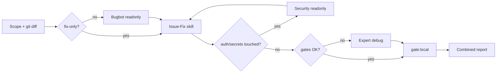

# Issue and Fix — Pipeline Reference

## Flow (mode `full`)



## Slash / chat invocations

```text
/issue-and-fix
issue and fix uncommitted
revisar y arreglar — fix-only
issue and fix security mode
```

## Skills invoked (paths)

| Skill | Path |
|-------|------|
| Orchestrator (this) | `.cursor/skills/issue-and-fix/SKILL.md` |
| Issue + fix body | `.cursor/skills/bmc-issue-fix-reviewer/SKILL.md` |
| Bugbot launcher | `~/.cursor/skills-cursor/review-bugbot/SKILL.md` |
| Security launcher | `~/.cursor/skills-cursor/review-security/SKILL.md` |
| Lint/test loop | `.cursor/skills/expert-debug-autonomous/SKILL.md` |
| Agent def | `.cursor/agents/bmc-issue-fix-reviewer.md` |

## Subagent Task types

| subagent_type | readonly | Fixes? |
|---------------|----------|--------|
| `bugbot` | true | No |
| `security-review` | true | No |
| Parent agent + skills | — | Yes |

No existe subagent `issue-fix`; la corrección la hace el agente padre vía `bmc-issue-fix-reviewer`.
