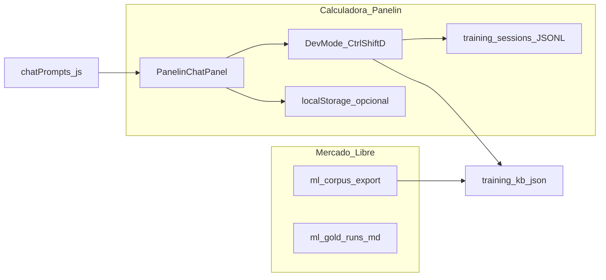

# Panelin-Gym — entorno y entrenamiento operativo Panelin

Skill **canónica** para pasar de intención (“entrenar el agente”) a **pasos concretos** en este repo: qué levantar, qué archivos leer, qué API llamar y qué **no** esperar del sistema (límites de historial). Complementa la skill **Mercado Libre** ([`bmc-mercadolibre-api`](../bmc-mercadolibre-api/SKILL.md)) y el hub [`ML-TRAINING-SYSTEM.md`](../../../docs/team/panelsim/knowledge/ML-TRAINING-SYSTEM.md).

**No es** un blueprint de SFT/DPO/LoRA sobre modelos open-weights: el producto Panelin hoy mejora por **prompts**, **KB de ejemplos**, **corpus ML**, **simulación** y **revisiones humanas**, sobre la API y la UI existentes.

---

## Cuándo usar

- “Panelin-Gym”, “gimnasio”, “entrenar el chat”, “observabilidad de conversaciones”, “sumar conocimiento”, “cambiar cómo responde”, “exportar corpus ML”, “gold runs”, “auditoría ML”.
- Preparar una sesión de trabajo en Cursor: stack local, token dev, checklist de privacidad.

**No usar** para afirmar OAuth ML o datos de compradores sin haber corrido `ml:verify` / export y leído artefactos reales.

---

## Fase A — Preparar entorno

1. Raíz del repo `Calculadora-BMC`.
2. `npm run env:ensure` si falta `.env`.
3. Definir **`API_AUTH_TOKEN`** en `.env` (mismo valor en servidor y en el campo token del modo dev en el navegador). Sin esto, las rutas `/api/agent/*` responden **503/401** según [`server/routes/agentTraining.js`](../../../server/routes/agentTraining.js).
4. Levantar API: `npm run start:api` (típicamente `http://127.0.0.1:3001`). Para UI: `npm run dev:full` o `./run_full_stack.sh` (Vite `:5173`). Antes de duplicar procesos, ver regla de workspace autostart.
5. Comprobar `GET /health` en la base de la API.

**Mercado Libre (corpus, sim-batch, audit, pending):** API en marcha + OAuth válido; `npm run ml:verify`. Detalle en [`bmc-mercadolibre-api/SKILL.md`](../bmc-mercadolibre-api/SKILL.md).

**Rate limit chat:** en modo desarrollador el endpoint de chat tiene tope más alto que público, pero existe; si aparece error de demasiadas consultas, espaciar pruebas ([`server/routes/agentChat.js`](../../../server/routes/agentChat.js)).

---

## Fase B — Dos fuentes de “conversaciones”

| Origen | Qué mirás | Límite importante |
|--------|-----------|-------------------|
| Chat calculadora | UI + modo dev + opcional `localStorage` (`panelin-chat-history`, solo si `persistHistory: true` en `useChat`) | Por defecto **no** se persiste historial completo entre recargas; ver [`src/hooks/useChat.js`](../../../src/hooks/useChat.js). |
| Telemetría dev servidor | `data/training-sessions/SESSION-*.jsonl` | Tras cada turno en **devMode**, se registra `chat_turn` con pregunta **truncada** (~500 chars), `kbMatches`, `calcValidation` — **no** es transcript completo del asistente ([`server/routes/agentChat.js`](../../../server/routes/agentChat.js)). |
| ML | `npm run ml:corpus-export`, informes, gold runs | JSON puede incluir datos de terceros; **no** commitear exports; ver [`ML-TRAINING-SYSTEM.md`](../../../docs/team/panelsim/knowledge/ML-TRAINING-SYSTEM.md). |

---

## Fase C — KB, prompts y UI dev

**Persistencia KB:** [`data/training-kb.json`](../../../data/training-kb.json) vía [`server/lib/trainingKB.js`](../../../server/lib/trainingKB.js).

**Edición:**

- **UI:** en la app, activar **Ctrl/Cmd+Shift+D**, ingresar token, usar drawer [`PanelinDevPanel`](../../../src/components/PanelinDevPanel.jsx) (Train / KB / Prompt).
- **HTTP:** mismos endpoints que la tabla en [`reference.md`](./reference.md).
- **Import masivo:** `npm run panelin:train:import -- --file ruta.json` ([`scripts/panelin-training-import.mjs`](../../../scripts/panelin-training-import.mjs)).

**Secciones de system prompt editables por API:** `IDENTITY`, `CATALOG`, `WORKFLOW`, `ACTIONS_DOC` en [`server/lib/chatPrompts.js`](../../../server/lib/chatPrompts.js) (`GET/POST /api/agent/dev-config`). Preview: `POST /api/agent/prompt-preview`.

**Resumen de eventos jsonl:** `npm run training:report` ([`scripts/training-report.mjs`](../../../scripts/training-report.mjs)).

---

## Fase D — Canal Mercado Libre (entrenamiento documentado)

1. Leer hub [`ML-TRAINING-SYSTEM.md`](../../../docs/team/panelsim/knowledge/ML-TRAINING-SYSTEM.md) y KB operativo [`ML-RESPUESTAS-KB-BMC.md`](../../../docs/team/panelsim/knowledge/ML-RESPUESTAS-KB-BMC.md).
2. Comandos npm (alineados con [`AGENTS.md`](../../../AGENTS.md)):
   - `npm run ml:corpus-export` — corpus completo (salida por defecto bajo `docs/team/panelsim/reports/ml-corpus/exports/`; **gitignored** según documentación).
   - `npm run ml:sim-batch -- --offset 0 --size 10 --mode blind|gold`
   - `npm run ml:ai-audit` (opcional `--dry-run`)
   - `npm run ml:pending-workup` (opcional `--json`)
3. Gold runs y ejemplos: [`docs/team/panelsim/reports/ml-gold-runs/`](../../../docs/team/panelsim/reports/ml-gold-runs/).

---

## Fase E — Mejores prácticas (operativo, no SFT)

- **Versionado de política:** tras cambios fuertes de MATRIZ/precios/logística, actualizar KB Markdown + re-exportar corpus si entrenás o auditás con datos viejos.
- **Ejemplos negativos:** usar campo `badAnswer` en entradas KB cuando el modelo o un humano identifiquen respuestas típicamente incorrectas.
- **Regresión ligera:** mantener una lista corta de casos (checklist manual o script futuro): “no inventar precios”, “pedir X si falta Y”, coherencia con catálogo en prompt.
- **Roles:** acordar quién puede editar `CATALOG` vs solo añadir pares Q/A al KB.
- **Privacidad:** no subir corpus ni JSONL con datos de clientes a repos públicos.

---

## Relación con “pipelines académicos” (SFT/DPO/MCP)

Si en el futuro se fine-tunea un modelo propio, los **datos** que este repo ya produce (corpus ML, entradas KB, trazas dev) pueden alimentar SFT/DPO **externamente**; el despliegue actual sigue siendo **API + herramientas** (calculadora, Sheets, ML). **MCP** ya existe en el repo para proxy HTTP (`npm run mcp:panelin`); no sustituye el flujo KB/prompt anterior.

---

## Referencias

- Tabla de comandos: [`reference.md`](./reference.md)
- API entrenamiento: [`server/routes/agentTraining.js`](../../../server/routes/agentTraining.js)
- Chat SSE: [`server/routes/agentChat.js`](../../../server/routes/agentChat.js)
