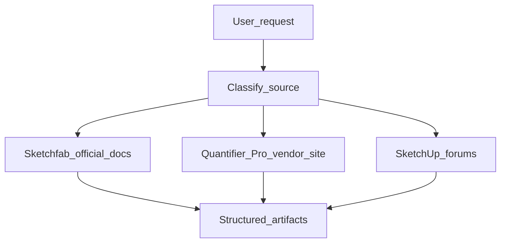

# SketchUp / Sketchfab — documentación y arquitectura (reverse engineering)

Guía para **clasificar la fuente**, ir a **documentación oficial** primero y producir **artefactos estructurados** sin inventar contratos ni mezclar foros con APIs.

## Cuándo usar este skill

- Preguntas sobre **Sketchfab** (login, subida, metadatos, descarga, embed, límites, [3D Configurators](https://sketchfab.com/3d-configurators)).
- **Quantifier Pro** (cantidades, costos, reportes, integración con otros productos mind.sight.studios).
- **Foros de SketchUp** (Ruby API, extensiones, flujos de trabajo, troubleshooting).
- Pedidos de **“reverse engineering”** de docs, **mapas de arquitectura** o **integración** sin código fuente del vendor.

## Tres capas (obligatorio: clasificar antes de extraer)

| Capa | Fuentes típicas | Qué se documenta | Qué no se asume |
|------|-----------------|------------------|-----------------|
| **A — APIs documentadas** | [Sketchfab Developers](https://sketchfab.com/developers); programa [3D Configurators](https://sketchfab.com/3d-configurators) | OAuth2, Data API, Download API, Viewer API, oEmbed; **configuradores = apps propias** que consumen el Viewer API (front-end JS), no un repo “configurator engine” | Endpoints o campos no citados en la doc actual; no confundir demos de marca con API pública de “reglas de precio” genéricas |
| **B — Producto / plugin** | [Quantifier Pro](https://mindsightstudios.com/quantifier-pro/), Help Desk del vendor | Módulos funcionales, entradas/salidas (p. ej. HTML/CSV), integraciones **declaradas** | API REST pública, automatización no descrita |
| **C — Foros** | [SketchUp Community Forums](https://forums.sketchup.com) | Hilos, citas, patrones útiles | Que un post sustituya Terms of Use o API reference |

## Flujo de trabajo (orden fijo)

1. **Clasificar** la petición como A, B y/o C (puede haber más de una).
2. **Fuente oficial primero:** [sketchfab.com/developers](https://sketchfab.com/developers) / [3d-configurators](https://sketchfab.com/3d-configurators) (mensaje de producto + enlace a API) / sitio del plugin / docs Trimble cuando el tema sea API Ruby o SketchUp platform.
3. **Rellenar plantillas** de esta skill (sección siguiente).
4. **Marcar incertidumbres:** rate limits, scopes OAuth, versiones de SketchUp, cambios recientes en la doc — y **qué falta verificar** (p. ej. llamada HTTP concreta, permiso de app).

## Plantillas de salida (copiar y completar)

### API Surface Map (capa A — Sketchfab)

```markdown
## API Surface Map — Sketchfab

- **Consulta / fuente:** <URL> · **Fecha consulta:** YYYY-MM-DD
- **Auth:** OAuth2 / token / scopes (según doc)
- **Superficies:** Data API · Download API · Viewer API · oEmbed · (otras si figuran)
- **Recursos y operaciones:** (listar según doc, no inventar paths)
- **Paginación / cursor / filtros:** …
- **Formatos:** JSON, glTF, USDZ, etc. (solo si la doc lo indica)
- **Errores / códigos comunes:** …
- **Límites / políticas:** rate, almacenamiento, uso embed — citar sección
- **Enlaces canónicos:** ver [reference.md](reference.md)
- **Si el tema es “3D Configurator”:** anotar que Sketchfab describe el flujo **modelos → subida → desarrollo con Viewer API** y partners de contenido/desarrollo; la **lógica de opciones y precios** del demo (Yamaha, Audi, etc.) es **aplicación custom**, no un SDK descargable del configurador comercial.
```

### Nota de arquitectura — 3D Configurators (Sketchfab, capa A)

Usar cuando el usuario mezcle “configurador Sketchfab” con “código listo para integrar”:

```markdown
## 3D Configurators — nota de arquitectura (Sketchfab)

- **Fuente marketing / producto:** https://sketchfab.com/3d-configurators · **Fecha consulta:** YYYY-MM-DD
- **Qué afirma Sketchfab:** configuradores web; personalización; en “Get Started” — modelos (u optimización), subida a Sketchfab, **desarrollo con Viewer API** (recursos front-end JS).
- **Qué documentar en API Surface Map:** solo **Viewer API** + **Data/Download** según necesidad; enlazar [Viewer API](https://sketchfab.com/developers/viewer) desde developers.
- **Qué no se asume:** repositorio público con la lógica completa de los demos de marca; motor de pricing/reglas del cliente sin leer su código o doc propia.
```

### Plugin / Product Architecture (capa B — Quantifier Pro)

```markdown
## Plugin / Product Architecture — Quantifier Pro

- **Consulta / fuente:** <URL> · **Fecha consulta:** YYYY-MM-DD
- **Plataforma:** SketchUp (Windows/Mac), versiones mínimas si la doc lo dice
- **Módulos funcionales:** área, volumen, longitud, peso, costos, reportes…
- **Entradas del modelo:** capas, materiales, reglas de costo, objeto seleccionado…
- **Salidas:** HTML, CSV, Excel (notar si algo es solo Windows según vendor)
- **Integraciones declaradas:** p. ej. Profile Builder (solo si aparece en fuente oficial)
- **Supuestos NO verificados:** (listar explícitamente)
- **Límites de automatización:** extensión Ruby en SketchUp; sin API HTTP pública salvo que el vendor documente lo contrario
```

### Forum Evidence Pack (capa C)

```markdown
## Forum Evidence Pack — SketchUp Community

- **Pregunta operativa:** …
- **Hilos citados:** URL + autor + fecha del post
- **Respuesta oficial vs usuario:** (marcar cada cita)
- **Conclusión provisional:** …
- **Riesgos:** desactualización, ambigüedad, conflicto con docs Trimble/Sketchfab
- **Siguiente verificación recomendada:** doc oficial / experimento local / soporte vendor
```

## Alcance legal y ético (breve)

- Respetar **Terms of Use** y **API Agreement** de Sketchfab publicados en [developers](https://sketchfab.com/developers) y políticas del foro de SketchUp.
- No promover **scraping masivo**, elusión de autenticación ni uso fuera de lo permitido.
- Al resumir documentación externa: **citar URL y fecha de consulta** en el entregable.

## Anti‑patrones

- Inventar endpoints, parámetros o códigos de error.
- Tratar un **post de foro** como contrato de API o como sustituto de la referencia oficial.
- Asumir que **Quantifier Pro** (u otro plugin comercial) expone una **API web pública** sin evidencia en documentación del vendor.
- Asumir que **[3D Configurators](https://sketchfab.com/3d-configurators)** entregan un **paquete de código** reutilizable igual al de los demos de marca: la doc oficial indica **apps custom** sobre el **Viewer API** y desarrollo/recursos front-end.
- Mezclar en un solo bloque “lo que dice la API” y “lo que cree un usuario en el foro” sin etiquetar la confianza.

## Diagrama conceptual



## Recursos adicionales

- Mapa por subsistema Sketchfab y enlaces: [reference.md](reference.md)
