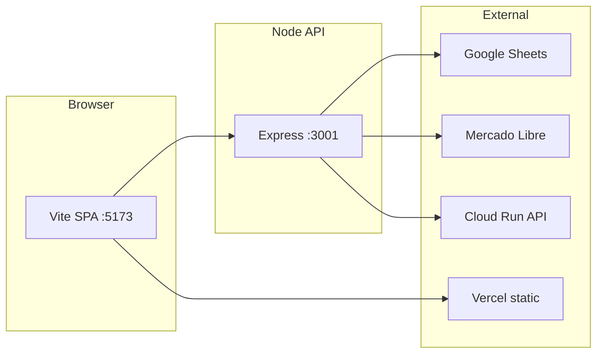

# Calculadora BMC / Panelin

**Production quotation calculator and operations stack for BMC Uruguay (METALOG SAS)** — insulation sandwich panels (roof, wall, cold room), with a React (Vite) client, Express API, Google Sheets–backed dashboard flows, Mercado Libre OAuth, CRM/AI helpers, and Cloud Run + Vercel deployment targets.

[](https://github.com/matiasportugau-ui/Calculadora-BMC/actions/workflows/ci.yml)


| | |
|---|---|
| **Package** | `calculadora-bmc` **v3.1.5** |
| **Private** | Yes — proprietary |
| **Module system** | ES modules (`"type": "module"`) |
| **Public app (front)** | [calculadora-bmc.vercel.app](https://calculadora-bmc.vercel.app) |
| **API (reference)** | Google Cloud Run service `panelin-calc` (see deploy docs in `docs/procedimientos/`) |

---

## Table of contents

1. [What this repository is](#1-what-this-repository-is)
2. [High-level architecture](#2-high-level-architecture)
3. [Repository map](#3-repository-map)
4. [Quick start](#4-quick-start)
5. [Environment variables](#5-environment-variables)
6. [NPM scripts (cheat sheet)](#6-npm-scripts-cheat-sheet)
7. [Calculator domain (product)](#7-calculator-domain-product)
8. [Backend API surface (orientation)](#8-backend-api-surface-orientation)
9. [Testing, quality gates, and CI](#9-testing-quality-gates-and-ci)
10. [Deployment](#10-deployment)
11. [Conventions](#11-conventions)
12. [Documentation index](#12-documentation-index)
13. [AI and automation](#13-ai-and-automation)
14. [Company](#14-company)
15. [License](#15-license)

---

## 1. What this repository is

- **Primary app:** Browser-based **quote builder** for panel quantities, BOM groups, USD list pricing, PDF/WhatsApp export, and (in full stack) **Finanzas** views fed by Google Sheets.
- **Backend:** **Express 5** on **Node 20** — calculator routes, Mercado Libre OAuth and resources, BMC dashboard JSON APIs, optional Shopify/webhooks, AI/chat routes where configured.
- **Data & ops:** Google Sheets integration (CRM/Admin spreadsheets), optional **PostgreSQL** for Transportista features, optional GCS for token storage — all via env-driven configuration.
- **Operator language:** Spanish UI copy and much internal documentation; **list prices and money amounts are in USD** unless a feature states otherwise.

---

## 2. High-level architecture



- **Frontend:** `src/` — React 18, Vite 7, main calculator component `src/components/PanelinCalculadoraV3.jsx`; shared logic in `src/utils/`, catalog and pricing in `src/data/constants.js` (and related data/version files).
- **Backend:** `server/index.js` mounts `/calc`, `/api/*`, `/auth/ml/*`, `/capabilities`, static/finanzas as applicable; route modules under `server/routes/`.
- **Production split:** Static UI on **Vercel**; API on **Google Cloud Run** (see `docs/procedimientos/` checklists).

---

## 3. Repository map

| Path | Role |
|------|------|
| `src/` | React app (Vite) — UI, calculators, roof plan viewer features, chat panels where present |
| `server/` | Express app — `index.js`, `config.js`, `routes/*`, `agentCapabilitiesManifest.js`, integrations |
| `tests/` | Offline tests (`validation.js`, `roofVisualQuoteConsistency.js`) + optional API/chat tests |
| `scripts/` | Automation: smoke prod, contracts, MATRIZ/panelsim, knowledge antenna, migrations, etc. |
| `docs/` | Technical docs, team runbooks, Sheets hub, procedures |
| `.cursor/` | Cursor rules, skills, agent definitions — **read alongside `AGENTS.md`** |
| `AGENTS.md` | **Canonical command and convention index for AI coding agents** |
| `CLAUDE.md` | Short project identity and commands for Claude Code |
| `.env.example` | Template for required optional secrets (never commit `.env`) |

---

## 4. Quick start

**Requirements:** Node.js **20+**, npm.

```bash
git clone https://github.com/matiasportugau-ui/Calculadora-BMC.git
cd Calculadora-BMC
npm install
npm run env:ensure          # creates .env from .env.example if missing
npm run dev                 # Vite only → http://localhost:5173
```

**Full stack (API + Vite):**

```bash
npm run dev:full            # API :3001 + Vite :5173
# or: ./run_full_stack.sh
```

**Health check (with API running):**

```bash
curl -s http://localhost:3001/health
```

**Pre-commit quality gate (after `src/` edits):**

```bash
npm run gate:local          # lint + test
# stricter:
npm run gate:local:full     # lint + test + build
```

---

## 5. Environment variables

Copy **`.env.example`** → **`.env`** (`npm run env:ensure`). Do not commit secrets.

| Variable (examples) | Purpose |
|---------------------|---------|
| `BMC_SHEET_ID` | Google Spreadsheet ID for dashboard/Admin flows |
| `GOOGLE_APPLICATION_CREDENTIALS` | Path to service account JSON |
| `BMC_MATRIZ_SHEET_ID` / MATRIZ-related | Price matrix / calculator CSV pipeline (see skills and deploy docs) |
| `ML_CLIENT_ID`, `ML_CLIENT_SECRET`, `TOKEN_ENCRYPTION_KEY` | Mercado Libre OAuth and token encryption |
| `ML_REDIRECT_URI_DEV` | HTTPS callback (e.g. ngrok) for local OAuth |
| `PUBLIC_BASE_URL` | Canonical public API base for callbacks and smoke tests |
| `API_AUTH_TOKEN` / `API_KEY` | Protect sensitive HTTP routes (cockpit, drafts, etc.) |
| `DATABASE_URL` | PostgreSQL for Transportista (`npm run transportista:migrate`) |
| `OPENAI_API_KEY` / model provider keys | AI suggest-response, chat, audits — only where features are enabled |

Full matrices live in **`.env.example`** and deployment procedure docs.

---

## 6. NPM scripts (cheat sheet)

Grouped for humans and **AI agents** (use `AGENTS.md` for the exhaustive list).

| Area | Commands |
|------|----------|
| **Dev** | `dev`, `start:api`, `dev:full`, `dev:api` (watch), `dev:full-stack` |
| **Build** | `build`, `preview` (`prebuild` runs disk precheck + version data) |
| **Quality** | `lint`, `test`, `gate:local`, `gate:local:full`, `test:contracts` (needs API on :3001), `test:api`, `pre-deploy` |
| **Production checks** | `smoke:prod`, `capabilities:snapshot` |
| **Mercado Libre** | `ml:verify`, `ml:cloud-run`, corpus/export/audit scripts |
| **Team / program** | `project:compass`, `program:status`, `followup`, `channels:automated` |
| **Sheets / MATRIZ** | `panelsim:env`, `matriz:pull-csv`, `matriz:reconcile`, etc. |

---

## 7. Calculator domain (product)

### Scenarios

| Scenario | Roof | Facade | Corners |
|----------|:----:|:------:|:-------:|
| Solo techo | Yes | — | — |
| Solo fachada | — | Yes | Yes |
| Techo + fachada | Yes | Yes | Yes |
| Cámara frigorífica | — | Yes | Yes |

### Catalog (summary)

- **Roof families:** ISODEC EPS/PIR, ISOROOF 3G / FOIL / PLUS (usable widths, lengths, thicknesses, and fixation logic in `src/data/`).
- **Wall families:** ISOPANEL EPS, ISOWALL PIR.

### Pricing rules (orientation)

- Core list data and design tokens live in **`src/data/constants.js`** (sections for tokens, `LISTA_ACTIVA`, panels, fixation, sealants, profiles, scenarios).
- Business rules: use **`p()`** / **`pIVA()`** for list resolution; **IVA applied once** at totals via **`calcTotalesSinIVA()`** in `src/utils/calculations.js` — see `docs/PRICING-ENGINE.md`.
- **MATRIZ / BROMYROS sync:** operational updates flow through documented API and skills (e.g. `.cursor/skills/actualizar-precios-calculadora/SKILL.md`), not ad-hoc hardcoding.

### Outputs

- BOM grouped by category, **PDF** print HTML, **WhatsApp** text — see `src/utils/helpers.js`.

---

## 8. Backend API surface (orientation)

**Not OpenAPI-complete in this README** — treat `server/routes/*.js` and `GET /capabilities` as sources of truth.

| Area | Examples |
|------|----------|
| Health / meta | `GET /health`, `GET /capabilities` |
| Calculator | Routes mounted from `server/routes/calc.js` under `/calc/*` |
| Dashboard BMC | `server/routes/bmcDashboard.js` — `/api/*` (Sheets-backed JSON; **503** when Sheets unavailable per project rules) |
| Mercado Libre | `/auth/ml/*`, `/ml/*` |
| Chat / AI | `server/routes/agentChat.js` and related (SSE, feature-flagged by env) |
| CRM cockpit (auth) | `/api/crm/cockpit/*` — requires `Authorization: Bearer` or `X-Api-Key` matching `API_AUTH_TOKEN` |
| Follow-ups | `/api/followups` (see `AGENTS.md`) |

Contract validation: `npm run test:contracts` with API running.

---

## 9. Testing, quality gates, and CI

- **Offline unit tests:** `npm test` runs `tests/validation.js` and `tests/roofVisualQuoteConsistency.js` (hundreds of assertions; exit code 0 = all passed).
- **Lint:** ESLint on `src/` via `npm run lint`.
- **Contract tests:** `npm run test:contracts` against local API.
- **CI:** `.github/workflows/ci.yml` — install, tests, lint, build (and additional jobs as defined in repo).

Recommended before merging changes touching **`src/`:** `npm run gate:local:full`.

---

## 10. Deployment

| Target | Notes |
|--------|------|
| **Vercel** | Static SPA; `vercel.json` sets Vite build output `dist/` and SPA rewrites. Install may use `npm install --ignore-scripts` in platform config — see file. |
| **Cloud Run** | Node API; sync env from `.env` per `docs/ML-OAUTH-SETUP.md` and `docs/procedimientos/CHECKLIST-DEPLOY-PANELIN-CALC-BMC.md`. |
| **Docker** | `Dockerfile` at repo root (and `Dockerfile.bmc-dashboard` for the standalone dashboard server) — see `docs/DEPLOYMENT.md`. |

**Smoke production API:** `npm run smoke:prod` (public health, capabilities, MATRIZ CSV route — critical for pricing pipeline).

---

## 11. Conventions

- **Modules:** ES modules only (`import`/`export`).
- **Secrets:** Never in source; use `.env` / Secret Manager in production.
- **Sheet IDs:** Never hardcode; use `config` / `process.env`.
- **API errors:** Documented semantics for Sheets (e.g. 503 vs empty 200) — see `AGENTS.md`.
- **Logging:** `pino` / `pino-http` on server; avoid raw `console.log` in production paths.
- **Frontend calculation style:** Quantities use `Math.ceil` where applicable; pricing through `p()`; align with `CONTRIBUTING.md`.

---

## 12. Documentation index

| Doc | Content |
|-----|---------|
| [`AGENTS.md`](AGENTS.md) | **Start here for AI agents** — commands, structure, rules |
| [`docs/ARCHITECTURE.md`](docs/ARCHITECTURE.md) | Deep architecture |
| [`docs/PRICING-ENGINE.md`](docs/PRICING-ENGINE.md) | Pricing engine |
| [`docs/CALC-TECHO.md`](docs/CALC-TECHO.md) / [`docs/CALC-PARED.md`](docs/CALC-PARED.md) | Roof / wall engines |
| [`docs/DEPLOYMENT.md`](docs/DEPLOYMENT.md) | Deployment options |
| [`docs/ML-OAUTH-SETUP.md`](docs/ML-OAUTH-SETUP.md) | Mercado Libre + Cloud Run env |
| [`docs/bmc-dashboard-modernization/`](docs/bmc-dashboard-modernization/) | Dashboard modernization, interface map |
| [`docs/google-sheets-module/README.md`](docs/google-sheets-module/README.md) | Sheets hub |
| [`docs/team/PROJECT-STATE.md`](docs/team/PROJECT-STATE.md) | Live project state (team process) |
| [`CONTRIBUTING.md`](CONTRIBUTING.md) | Contributor rules for calculator code |

---

## 13. AI and automation

This repo is **optimized for human + AI collaboration**:

- **`AGENTS.md`** — command matrix, loops (lint → test → contracts), CRM/cockpit auth notes.
- **`.cursor/rules/`** and **`.cursor/skills/`** — workspace automation (deploy smoke, MATRIZ, disk recovery, panel chat, etc.).
- **`GET /capabilities`** + `server/agentCapabilitiesManifest.js` — discoverable tool/action surface for agents.
- **MCP:** `npm run mcp:panelin` exposes a stdio MCP proxy to the HTTP API (requires API running).

For coordinated multi-agent workflows and PROJECT-STATE updates, see `docs/team/PROJECT-TEAM-FULL-COVERAGE.md` and related team docs.

---

## 14. Company

| Field | Value |
|-------|--------|
| Legal name | METALOG SAS |
| Brand | BMC Uruguay |
| RUT | 120403430012 |
| Location | Maldonado, Uruguay |
| Web | [bmcuruguay.com.uy](https://bmcuruguay.com.uy) |

---

## 15. License

**UNLICENSED** — proprietary. All rights reserved by BMC Uruguay / METALOG SAS.  
Do not redistribute or reuse without permission.

---

*README generated for discoverability by developers and AI tooling. For day-to-day technical detail and exact command coverage, prefer [`AGENTS.md`](AGENTS.md) and the `docs/` tree.*
