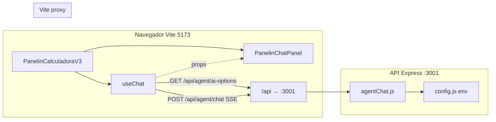

# Integración de IA en la Calculadora BMC (Panelin)

Documento consolidado (sesión de trabajo y código vigente en el repo) para **chat del agente Panelin**, **proveedores múltiples** (Claude, OpenAI, Grok, Gemini) y **descubrimiento de modelos** sin exponer secretos.

**Última revisión:** 2026-04-15

---

## 1. Alcance

| Área | Descripción |
|------|-------------|
| **Chat calculadora** | Streaming SSE desde la API Node (`POST /api/agent/chat`), estado y opciones de IA en el hook `useChat`. |
| **Selector en cabecera** | Lista desplegable junto al **video circular del agente** y al botón **Panelin** en `PanelinCalculadoraV3.jsx`. |
| **Otro uso de IA** | CRM sugiere respuestas con proveedor configurable (`POST /api/crm/suggest-response`, comentado en `.env.example`); no es el mismo flujo que el chat del agente. |
| **Descubrimiento** | `GET /api/agent/ai-options` no está hoy en `GET /capabilities` / `agentCapabilitiesManifest.js`; rutas canónicas del agente están documentadas aquí y en `server/routes/agentChat.js`. |

---

## 2. Arquitectura (resumen)

- En **desarrollo**, `getCalcApiBase()` devuelve base vacía en el navegador para que las peticiones vayan a **mismo origen** (`/api/...`) y Vite reenvíe a `http://localhost:3001` (`vite.config.js`: `server.proxy`).
- En **producción** (Vercel + Cloud Run), suele definirse `VITE_API_URL` apuntando al host público de la API.

Archivos clave:

- `server/routes/agentChat.js` — rutas `/api/agent/chat`, `/api/agent/ai-options`, allowlist de modelos, cadena de proveedores.
- `server/config.js` — lectura de API keys y modelos por defecto.
- `src/hooks/useChat.js` — fetch de opciones, persistencia de selección, envío SSE.
- `src/components/PanelinCalculadoraV3.jsx` — UI `panelinHeaderAiSelect` (video + `<select>` + botón chat).
- `src/components/PanelinChatPanel.jsx` — drawer del chat; recibe `{...chat}` (props del hook) además de handlers explícitos.
- `src/utils/calcApiBase.js` — resolución de base URL.
- `src/utils/panelinAgentVideoSrc.js` — URL del MP4 del avatar (`public/video/panelin-lista-loop.mp4` vía `BASE_URL`).

---

## 3. Variables de entorno (API)

Definidas en `server/config.js` y documentadas en `.env.example` (sección “AI providers”):

| Variable | Uso |
|----------|-----|
| `ANTHROPIC_API_KEY` | Claude (Anthropic). |
| `OPENAI_API_KEY` | OpenAI. |
| `OPENAI_CHAT_MODEL` | Modelo por defecto OpenAI para chat (ej. `gpt-4o-mini`). |
| `ANTHROPIC_CHAT_MODEL` | Modelo por defecto Claude (opcional; hay default en código). |
| `GEMINI_API_KEY` | Google Gemini. |
| `GEMINI_CHAT_MODEL` | Modelo por defecto Gemini. |
| `GROK_API_KEY` | xAI Grok. |
| `GROK_CHAT_MODEL` | Modelo por defecto Grok. |

Solo los proveedores con **key no vacía** aparecen en `GET /api/agent/ai-options`.

---

## 4. API: `GET /api/agent/ai-options`

**Propósito:** listar qué motores puede usar el servidor y qué modelos están permitidos (allowlist), **sin devolver secretos**.

Respuesta típica (forma lógica):

- `ok: true`
- `autoOrder`: array de ids de proveedor con key, en el orden de fallback usado por el servidor para modo automático (p. ej. claude → grok → gemini → openai según implementación en `agentChat.js`).
- `providers`: array de `{ id, label, defaultModel, models: [{ id, label }] }` solo para proveedores con API key.

Los ids de proveedor expuestos al cliente son: `claude`, `openai`, `grok`, `gemini`.

---

## 5. API: `POST /api/agent/chat`

- **Content-Type:** `application/json`
- **Respuesta:** `text/event-stream` (SSE) con eventos JSON en líneas `data: {...}` (tipos como `text`, `action`, `done`, `error`, y en modo dev otros metadatos).

**Cuerpo JSON relevante:**

| Campo | Descripción |
|-------|-------------|
| `messages` | Historial `{ role, content }[]`. |
| `calcState` | Estado de la calculadora para contexto y herramientas. |
| `devMode` | Modo desarrollador (requiere auth de API si está configurado). |
| `aiProvider` | `"auto"` o uno de `claude` \| `openai` \| `grok` \| `gemini`. |
| `aiModel` | Opcional; si se envía, debe estar en la allowlist del servidor para ese proveedor; si no, el servidor normaliza al default seguro. |

**Seguridad y límites (servidor):**

- Origen del navegador validado contra lista blanca / previews Vercel (`isChatOriginAllowed` en `agentChat.js`).
- Rate limiting distinto para uso público vs `devMode`.

---

## 6. Frontend: hook `useChat`

- Al montar, hace `fetch(\`${getCalcApiBase()}/api/agent/ai-options\`)` y guarda resultado en `aiOptions` / `aiOptionsError`.
- **Persistencia:** `localStorage` clave `panelin-chat-ai-selection-v1` — objeto `{ aiProvider, aiModel }`.
- **API pública del hook:** incluye `setAiPick(pick)` donde `pick` es:
  - `"auto"` — modo automático (fallback en servidor).
  - `"claude|"`, `"openai|"`, … — proveedor fijo con **modelo default del servidor** (`aiModel` vacío en storage).
  - `"claude|claude-3-5-sonnet-20241022"` — proveedor + modelo concreto (debe existir en la lista devuelta por `ai-options`).
- Al enviar mensajes, el cuerpo del POST incluye `aiProvider` y, si corresponde, `aiModel` (solo cuando no es `auto` y hay modelo elegido).

---

## 7. Frontend: selector junto al avatar

En `PanelinCalculadoraV3.jsx`, el bloque de cabecera incluye (orden):

1. `<video>` con `PANELIN_AGENT_VIDEO_SRC` (avatar animado).
2. **`panelinHeaderAiSelect`** — un `<select>` con:
   - Opción “Automático (fallback)” o “Cargando motores…” mientras llega `ai-options`.
   - Por cada proveedor con key: `<optgroup>` con “Predeterminado (…)” y el resto de modelos de la allowlist.
3. Botón **Panelin** que abre/cierra el drawer (`PanelinChatPanel`).

El drawer recibe `{...chat}` para que cualquier prop adicional del hook siga disponible sin duplicar cada campo en JSX.

---

## 8. Cómo levantarlo en local

1. API: `npm run start:api` (puerto **3001** por defecto).
2. Frontend: `npm run dev` (Vite **5173** con proxy `/api` y `/calc` → 3001).
3. Definir en `.env` al menos una API key de IA para ver opciones distintas de “solo automático”.

Si el desplegable muestra comportamiento raro, comprobar en red del navegador que **`/api/agent/ai-options`** responde 200 (si falla, suele ser API caída o `VITE_API_URL` mal configurado en builds que no usan proxy).

---

## 9. Historial de la sesión (transcript)

Resumen del hilo [186091c0-9cca-45e0-b61c-6e06530ea27a](file:///Users/matias/.cursor/projects/Users-matias-Panelin-calc-loca-Calculadora-BMC/agent-transcripts/186091c0-9cca-45e0-b61c-6e06530ea27a/186091c0-9cca-45e0-b61c-6e06530ea27a.jsonl):

1. **Objetivo inicial:** permitir cambiar **modelo y proveedor** (Claude, OpenAI, Gemini, Grok) según keys disponibles.
2. **Backend:** rutas `ai-options` + cuerpo `aiProvider` / `aiModel` en `agentChat.js`; defaults en `config.js`; comentarios en `.env.example`.
3. **Iteración UX:** modo “simple” solo proveedor vs **selector completo** con todos los modelos por proveedor.
4. **Ubicación:** selector **al lado del video del agente** en la barra superior de la calculadora; asset centralizado en `panelinAgentVideoSrc.js`.
5. **Dev experience:** `getCalcApiBase()` en modo dev + navegador usa base vacía para **aprovechar el proxy de Vite** y evitar CORS/origen incorrecto al llamar `:3001` desde `:5173`.

---

## 10. Referencias cruzadas

- Panelin-Gym / chat operativo: `docs/team/panelsim/` y skill `.cursor/skills/panelin-gym/SKILL.md`.
- Contrato API (cuando se amplíe descubrimiento): `npm run test:contracts` con API en 3001; considerar añadir `/api/agent/ai-options` al manifest si los agentes externos deben descubrirlo solo vía `GET /capabilities`.
- Despliegue: `.cursor/skills/bmc-calculadora-deploy-from-cursor/SKILL.md`, variables `VITE_API_URL` / `PUBLIC_BASE_URL` en documentación de Vercel y Cloud Run.
