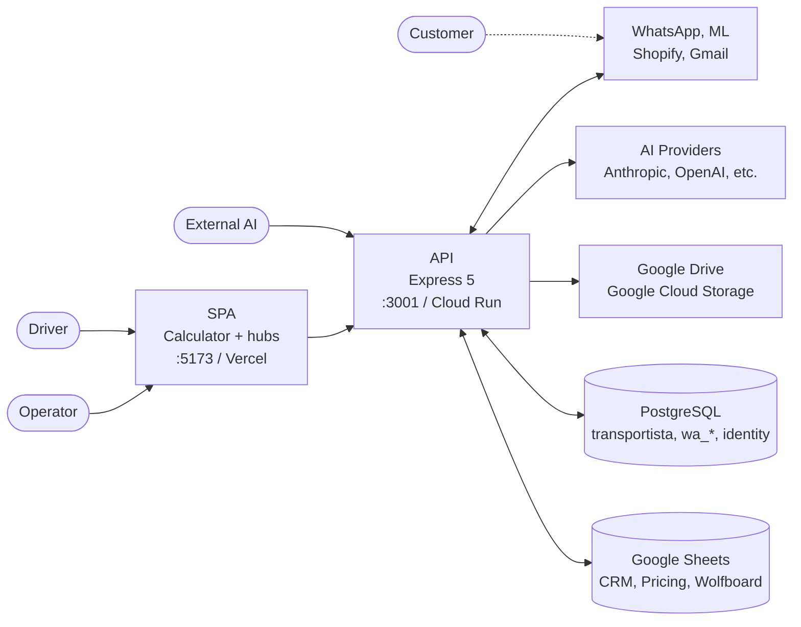

# 🏗 Calculadora BMC — Architecture Overview

**For deeper technical details, see [`docs/team/ARCHITECTURE.md`](./team/ARCHITECTURE.md) (C4 model, actor flows, service inventory) and [`docs/PRICING-ENGINE.md`](./PRICING-ENGINE.md) (pricing math).**

---

## System at a Glance

Calculadora BMC is a **full-stack quotation calculator** for insulation panels (BMC Uruguay / METALOG SAS). It comprises:

- **Frontend:** React 18 + Vite 7 SPA (:5173 dev, Vercel production)
  - **Canonical calculator:** `PanelinCalculadoraV3_backup.jsx` (7,042 LOC)
  - **Hub modules:** `/hub/wa` (WhatsApp cockpit), `/hub/ml` (operativo), `/hub/canales` (unified), `/hub/admin` (quotes v2), `/hub/agent-admin` (training), `/hub/plan-import` (floor plans), `/hub/traktime` (time tracking)
- **API:** Express 5 + Node.js 24.x (:3001 dev, Cloud Run `panelin-calc` production)
  - 28 route files (`/calc/*`, `/api/*`, `/auth/*`, `/webhooks/*`)
  - 97 lib modules (calc loopback, embeddings/RAG, Sheets/Drive, ML/WA/Shopify, quote registry, identity, KB training, workers)
- **Data:** PostgreSQL (3 pools: transportista, wa_\*, identity), pgvector RAG, Google Sheets (CRM, pricing, Wolfboard), Google Drive/GCS (quote PDFs)
- **Integrations:** Anthropic Claude (primary), OpenAI (fallback + voice), Grok, Gemini, Vercel AI Gateway, WhatsApp Cloud API, MercadoLibre, Shopify, Google OAuth 2.0

---

## Runtime Topology

---

## Frontend (SPA)

### Canonical Calculator

**File:** `src/components/PanelinCalculadoraV3_backup.jsx` (7,042 LOC)

The calculator is the main entry point (`/` and `/calculadora`). It handles:

- **Roof & wall geometry:** `roofPlanGeometry.js`, `roofLateralAnnexLayout.js` — 2D layout math
- **Calculation engine:** `calculations.js` (61 KB) — techo/pared/scenarios; all prices via `p(item)` helper
- **Quote export:** `quotationViews.js` (78 KB) — HTML/PDF generation; `googleDrive.js` (21 KB) — Drive/OAuth save/load
- **3D visualization:** three.js + @react-three/fiber/drei
- **Panelin chat UI:** `PanelinChatPanel`, `PanelinVoicePanel`, `PanelinDevPanel`
- **Configuration:** pricing editor, roof plan upload, quote preview

### Hub Routes (Lazy-Loaded)

| Route | Component | Purpose |
|-------|-----------|---------|
| `/hub/wa` | `BmcWaCockpit.jsx` | WhatsApp conversation cockpit; enricher, SLA, routing |
| `/hub/ml` | `BmcMlOperativoModule.jsx` | MercadoLibre operativo (Q&A, auto-answer, analytics) |
| `/hub/canales` | `BmcCanalesUnificadosModule.jsx` | Unified channel queue (cockpit-token auth) |
| `/hub/admin` | `AdminCotizacionesModule.jsx` v2 | Quote management (feature-flagged `VITE_FEATURE_ADMIN_COT_V2`) |
| `/hub/cotizaciones` | alias to `/hub/admin` | Backward compat |
| `/hub/agent-admin` | `AgentAdminModule.jsx` | Training KB, dev config, system prompts |
| `/hub/plan-import` | `BmcPlanImportModule.jsx` | Floor plan upload & dimensioning |
| `/hub/traktime` | `TraKtiMeModule.jsx` | Time tracking + invoicing |

### State & Data

- **State management:** React Context (`BmcAuthProvider.jsx`) for auth only; all other state via `useState` and `useMemo`
- **No Redux/Zustand/Recoil**
- **Data layer:** `src/data/constants.js` (35 KB, panel specs + pricing), `kingspanKB.js`, `matrizPreciosMapping.js`, etc.
- **Utilities:** `src/utils/` — helpers, PDF/WhatsApp export, Google Drive, calc loopback, etc.

### Code Splitting

Three lazy chunks:
- `vendor-three` (870 KB) — three.js, @react-three/fiber/drei
- `vendor-pdf` (975 KB) — html2pdf.js
- `vendor-react` — react, react-dom, react-router-dom

---

## API (Express 5 on Cloud Run)

### Route Groups

**Calculation & GPT Actions:**
- `/calc/*` — quotation API (techo, pared, presupuesto libre, OpenAPI spec); client Sheets sync opt-in

**Agent & Chat:**
- `/api/agent/chat` — POST SSE streaming; multi-provider fallback (Anthropic → Grok → Gemini → OpenAI); suggestions + tool execution
- `/api/agent/training/*` — KB editor, prompt sections (IDENTITY, CATALOG, WORKFLOW), scoring config
- `/api/agent/conversations/{id}` — usage analytics, conversation replay
- `/api/agent/voice/*` — OpenAI Realtime ephemeral tokens, Whisper transcription
- `/api/agent/feedback` — user thumbs-up/down signals
- `/api/internal/panelin/*` — RBAC tool discovery & invocation (internal agents only)

**Sheets-backed CRM & Dashboards (503/200-empty/never 500 error semantics):**
- `/api/cotizaciones` — quote list
- `/api/proximas-entregas` — upcoming deliveries
- `/api/coordinacion-logistica` — logistics coordination
- `/api/audit` — audit log
- `/api/pagos-pendientes` — pending payments
- `/api/metas-ventas` — sales targets

**Specialized Surfaces:**
- `/api/wa/*` — WhatsApp cockpit CRUD (conversations, messages, routing, SLA, templates)
- `/api/transportista/*` — fleet tracking (trips, stops, evidence, driver tokens)
- `/api/traktime/*` — time entries, invoices, Sheets mirror
- `/api/wolfboard/*` — Admin 2.0 sync, dual-write Lead → Sheet
- `/api/ml/*` — MercadoLibre price lookup & ETL
- `/api/pdf/generate` — server-side Playwright PDF generation
- `/api/plan/interpret` — floor plan analysis + metrics extraction
- `/api/research/answer` — RAG + multi-turn research loop

**Authentication & Identity:**
- `/auth/google/callback`, `/auth/refresh`, `/auth/logout` — Google OIDC + JWT + refresh rotation
- `/auth/mfa/*` — TOTP setup & verification
- `/auth/me` — user profile + module grants

**Webhooks (HMAC-verified):**
- `POST /webhooks/ml` — MercadoLibre Q&A, orders, auto-answer
- `POST /webhooks/whatsapp` — inbound messages, delivery status
- `POST /webhooks/shopify` — questions, products, draft orders

---

## Data Layer

### Databases

**PostgreSQL** (`DATABASE_URL` → 3 independent pools):

1. **transportista schema** — trips, stops, events, driver sessions, outbox (fleet tracking)
2. **wa_\* schemas** — conversations, messages, suggestions, quotes, followups, consent, operators, SLA, webhooks, rules, audit log
3. **identity schema** — users, sessions, MFA, role grants, refresh tokens

**pgvector RAG** (optional, `RAG_ENABLED=true`):
- `quote_embeddings` table — embeddings (1536 dims, cosine distance), content hash, metadata
- Lazy-init: rag.js queries on first RAG request; returns empty if DB unavailable
- Provider: OpenAI text-embedding-3-small; fallback stub embedding (hash-based)

### Google Sheets (Service Account JSON)

All sheet IDs and credentials via `server/config.js`:

- **BMC_SHEET_ID** — main CRM sheet (Master_Cotizaciones, CRM_Operativo, Form responses)
- **WOLFB_ADMIN, PAGOS, CALENDARIO, VENTAS, STOCK, MATRIZ** — specialized tabs
- Error semantics: `503` (Sheets unavailable), `200` + empty payload (no data), never `500`

### Storage

- **Google Drive** — quote HTML archives (via OAuth service account)
- **Google Cloud Storage (GCS)** — quote PDFs, KB events log (JSONL), encrypted ML token store

---

## Core Flows

### A Quotation: From Operator to PDF

1. **Operator opens calculator** → `PanelinCalculadoraV3_backup.jsx` mounts
2. **State updates** (geometry, materials, options) → `useState` triggers
3. **useMemo recalcs** → calls `calcTechoCompleto` or `calcParedCompleto`
4. **Calc engine resolves prices** → `p(item)` reads `LISTA_ACTIVA` (venta/web)
5. **BOM grouping** → `bomToGroups()` organizes items; `applyOverrides()` applies edits
6. **Optional Panelin chat** → operator asks AI questions over SSE (POST `/api/agent/chat`)
   - Server calls agent tools via loopback HTTP to `/calc/quote` on same port
   - Returns `verifiedQuote` event → client renders `TrustBlock` (visual confirmation)
7. **Export** → PDF (Vite dev: client-side html2pdf; prod: server-side Playwright via `/api/pdf/generate`) or WhatsApp text

### AI Agent Suggestion Loop (via Panelin Chat)

1. Operator sends message → POST `/api/agent/chat` with conversation history
2. API selects provider (Anthropic → Grok → Gemini → OpenAI)
3. Agent builds system prompt (config + catalog + training KB)
4. If message requests calc: tool execution → loopback to `/calc/*` on :3001
5. Tool result → LLM generation → suggestions organized by group (UI, calc, training, etc.)
6. SSE stream with incremental text chunks, actions (setTecho, setPared), suggestions
7. Operator can provide feedback (thumbs-up/down) → POST `/api/agent/feedback`

### WhatsApp Cockpit to Quote

1. Inbound message webhook (verified HMAC) → POST `/webhooks/whatsapp`
2. WA enricher worker: sentiment, predictive suggestions
3. Operator views in `/hub/wa` cockpit; routes to team member
4. Operator taps "Generate quote" → calls `/calc/cotizar` with conversation context
5. Quote HTML → `/api/pdf/generate` → PDF signed URL in GCS
6. Message sent back via Cloud API with PDF link

---

## Where Things Live

| Concern | Location |
|---------|----------|
| **Pricing, panel specs** | `src/data/constants.js` (35 KB) |
| **Calc engine (techo/pared)** | `src/utils/calculations.js` (61 KB) |
| **Helpers, PDF/WhatsApp export** | `src/utils/helpers.js` (43 KB) |
| **Google Drive OAuth, save/load** | `src/utils/googleDrive.js` (21 KB) |
| **Roof 2D/3D geometry** | `src/utils/roofPlanGeometry.js`, `roofLateralAnnexLayout.js` |
| **Quote HTML/PDF generation** | `src/utils/quotationViews.js` (78 KB) |
| **Sheets-backed dashboards** | `server/routes/bmcDashboard.js` |
| **Agent chat (SSE)** | `server/routes/agentChat.js` (600+ LOC) |
| **Agent tools catalog** | `server/lib/agentTools.js` |
| **Training KB (prompt sections)** | `server/lib/trainingKB.js` (KB editor, approval workflow) |
| **Embeddings & RAG** | `server/lib/embeddings.js`, `rag.js` |
| **Postgres pools** | `server/lib/{waDb,transportistaDb,traktimeDb}.js` |
| **Calc loopback client** | `server/lib/calcLoopbackClient.js` |
| **WhatsApp routing, SLA, enricher** | `server/lib/wa{Config,RoutingRules,SlaWorker,EnricherWorker}.js` |
| **ML signature & auto-answer** | `server/lib/ml{Signature,AutoAnswer,AAnswerText}.js` |
| **Quote storage & registry** | `server/lib/{quoteRegistry,quoteStore}.js` |
| **Identity & auth** | `server/lib/identityAuth.js`, `mfaTotp.js` |

---

## Operational

### Deployment

- **Frontend:** Vercel (auto-deploy on push to main, Vite → dist/, CSP/HSTS headers in `vercel.json`)
- **API:** Cloud Run `panelin-calc` (`us-central1`, Node.js 24.x, Sheets credentials from Secret Manager)
- **CI:** GitHub Actions (`.github/workflows/ci.yml`)
  - Lint, tests, build on all pushes
  - Smoke, env-drift, knowledge-antenna, voice_health, channels_pipeline on main only

### Background Workers (started on API listen)

| Worker | Purpose |
|--------|---------|
| **transportista outbox** | Batch sync fleet trips to third-party logistics |
| **traktime mirror** | Nightly Sheets sync of time entries |
| **WA enricher** | Inbound message sentiment & predictive suggestions |
| **WA SLA** | Response time metrics (Missive-style) |
| **WA followups** | Auto-escalate inactive conversations |

Graceful shutdown: 8s timeout, cleanup all workers on SIGTERM.

### Logging

Pino logger in `server/index.js` (level via `LOG_LEVEL` env). Pinohttp middleware auto-injects `req.log` with UUID requestId.

---

## Agent Ecosystem

Twelve Claude agents (see [CLAUDE.md](../CLAUDE.md) table):
`bmc-orchestrator`, `bmc-calc-specialist`, `bmc-panelin-chat`, `bmc-panelin-mcp`, `bmc-api-contract`, `bmc-security`, `bmc-deployment`, `bmc-fiscal`, `bmc-docs-sync`, `bmc-judge`, `bmc-sheets-mapping`, `calculo-especialist`.

---

## Key Conventions

- **Sheets error semantics:** `503` (Sheets unavailable), `200` + empty (no data), never `500` for Sheets failures
- **ES modules only** — no `require()`
- **Pricing:** All prices without IVA in calc engine; 22% IVA applied once at total via `calcTotalesSinIVA()`
- **Price resolution:** Always use `p(item)` helper; never access `.venta` or `.web` directly
- **Quantities:** `Math.ceil` (never round down); prices `toFixed(2)`
- **No hardcoded sheet IDs or tokens** — all come from `config.*` or `process.env.*`
- **Commit messages:** concise, English, with `type:` prefix (feat, fix, refactor, docs)

---

## Improvement Backlog (Prioritized)

### P0 — Stale top-level architecture doc [bootstrap]

**Why:** Resolved by this rewrite. New contributors were being misled by the previous v3-monolith-era content. ✅ Done once merged.

### P0 — Single-file 7042-LOC calculator

**Why:** `PanelinCalculadoraV3_backup.jsx` is canonical but the `_backup` suffix is misleading, and the file is past the point where any single contributor holds it in their head. Risk: high change cost, merge conflicts, untestable seams.

**Recommendation:** Rename to drop `_backup`, then extract pure regions (BOM grouping, scenario gating, override table) behind named hooks/components without touching the calc engine.

### P0 — Two `ARCHITECTURE.md` files in two locations

**Why:** Even after this rewrite, `docs/team/ARCHITECTURE.md` remains canonical for depth. Without explicit pointers, they drift and readers get confused which to trust.

**Recommendation:** Add a header to both files ("this file vs that file") and consider a CI lint that fails if both mention the same data shape (e.g., actor definitions).

### P1 — No state-management library; hub modules > 50 KB each

**Why:** `AgentAdminModule.jsx` (96 KB), `BmcMlOperativoModule.jsx` (51 KB), `BmcWaCockpit.jsx` (49 KB), `useAdminCotizaciones.js` (22 KB). At this size, useState/Context produces render storms and prop-drilling; hard to reason about state flow.

**Recommendation:** Evaluate Zustand for hub-local stores (still avoids global Redux footprint).

### P1 — Embedding cache has no TTL

**Why:** `server/lib/embeddings.js` keeps in-memory `_embeddingCache` for process lifetime. On Cloud Run with multi-hour idle this is fine; on long-lived dev API or future sticky hosts, it leaks memory.

**Recommendation:** Implement LRU cache with max size & TTL.

### P1 — SSE keepalive only at 15s

**Why:** `agentChat.js` heartbeats every 15s. Verify Cloud Run idle timeout and Vercel proxy timeout are both > 15s or document the constraint.

**Recommendation:** Increase to 30s or configure infra to match.

### P1 — Webhook signature verification is per-route

**Why:** ML, WA, and Shopify each have their own `verify*Signature` lib. Reduces chance a future webhook skips HMAC.

**Recommendation:** Consolidate behind a single express-style middleware that picks the verifier by route prefix.

### P1 — Test suite is 62 standalone Node scripts

**Why:** Works today, but no parallelism, isolation, or coverage report. `npm test` is sequential and CI can't report code coverage.

**Recommendation:** Adopt `node --test` runner (or vitest) without rewriting assertions.

### P2 — Background workers share process with API

**Why:** Transportista outbox, TraKtiMe mirror, WA enricher/SLA all start in HTTP server listen callback. Request spike pauses workers; SLA worker distorts the metric it produces.

**Recommendation:** Consider splitting at least the SLA worker into a separate Cloud Run job (or Cloud Scheduler invocation) when scale demands it.

### P2 — `INTERNAL_SUPERADMIN_EMAILS` seeded at migration only

**Why:** `server/config.js` notes this is never re-checked at runtime. Trapdoor during incident response if Postgres grants diverge from config.

**Recommendation:** Add a runtime guard that warns (not enforces) if configured list diverges from DB on first request.

### P2 — Frontend chunks > 1 MB

**Why:** `vendor-pdf` (975 KB), `vendor-three` (870 KB) — both lazy, so not first-paint blocking, but mobile users on WA hub eat 3 MB cold-cache.

**Recommendation:** Defer three.js to roof-preview surface only; audit html2pdf (could be server-side via existing `/api/pdf/generate`).

### P2 — 190+ scripts in `scripts/`; poor discoverability

**Why:** Useful helpers, but README doesn't index them; new team members don't know they exist.

**Recommendation:** Add a `scripts/README.md` (or expand `AGENTS.md`) with one-line descriptions grouped by purpose (smoke, deploy, ETL, dev, CI).
