```mermaid
graph TD
    BMC[Calculadora BMC API]

    subgraph AI[AI Providers]
        OAI[OpenAI<br/>chat + Realtime voice]
        ANT[Anthropic<br/>Claude opus + haiku]
        GEM[Google Gemini]
        GRK[xAI Grok]
    end

    subgraph GC[Google Cloud]
        DRV[Google Drive<br/>quote HTML mirror]
        GCS[Cloud Storage<br/>quotes + ML tokens + evidencias]
        SHT[Google Sheets<br/>CRM + MATRIZ + Wolfboard + Pagos + Calendario + Ventas + Stock]
    end

    subgraph CM[Commerce]
        ML[MercadoLibre<br/>OAuth + Q&A]
        SHP[Shopify<br/>OAuth + webhook]
    end

    subgraph MSG[Messaging]
        WA[WhatsApp Cloud API<br/>outbound + webhook]
        EM[SMTP Gmail<br/>magazine daily]
        IMAP[IMAP via panelsim<br/>repo hermano]
    end

    subgraph DB[Data]
        PG[Postgres<br/>Modo Transportista]
    end

    BMC --> OAI
    BMC --> ANT
    BMC --> GEM
    BMC --> GRK
    BMC --> DRV
    BMC --> GCS
    BMC --> SHT
    BMC --> ML
    BMC -.optional.-> SHP
    BMC --> WA
    BMC -.cron.-> EM
    BMC -.script.-> IMAP
    BMC -.optional.-> PG
```

# External Connections — Calculadora BMC

> Single-source map of every external service the Calculadora-BMC API talks to,
> grouped by category, with code entry points, config vars, and the status of
> recent integrity fixes. Generated 2026-04-29 after the env/API/connections sweep.

---

## Visual map

```
                        ┌─────────────────────────────────────────┐
                        │       Calculadora BMC (panelin-calc)    │
                        │  Express :3001 / Cloud Run us-central1  │
                        └────────────────┬────────────────────────┘
                                         │
   ┌──────────────────┬──────────────────┼──────────────────┬──────────────────┐
   │                  │                  │                  │                  │
   ▼                  ▼                  ▼                  ▼                  ▼
┌────────┐       ┌─────────┐       ┌──────────┐      ┌────────────┐    ┌──────────┐
│  AI    │       │ Google  │       │ Commerce │      │ Messaging  │    │   Data   │
│        │       │ Cloud   │       │          │      │            │    │          │
├────────┤       ├─────────┤       ├──────────┤      ├────────────┤    ├──────────┤
│ OpenAI │       │ Drive   │       │ Mercado- │      │ WhatsApp   │    │ Postgres │
│ Claude │       │ GCS     │       │  Libre   │      │ (Cloud API)│    │  (pg)    │
│ Gemini │       │ Sheets  │       │ Shopify  │      │ Email      │    │          │
│ Grok   │       │ ADC     │       │          │      │ (SMTP/IMAP)│    │          │
└────────┘       └─────────┘       └──────────┘      └────────────┘    └──────────┘
```



---

## Catalog by category

### 1) AI providers

The Panelin chat (`POST /api/agent/chat`), voice mode (`POST /api/agent/voice/session`), and CRM suggest-response (`POST /api/crm/suggest-response`) all multiplex over four LLM providers. Provider routing lives in `server/lib/aiCompletion.js` with a fallback chain when one fails.

| Service | Used for | Config var(s) | Entry point | Status |
|--------|---------|---------------|-------------|--------|
| **OpenAI** | Chat (`gpt-4o-mini`), Realtime voice (`gpt-4o-realtime-preview`) | `OPENAI_API_KEY`, `OPENAI_CHAT_MODEL`, `OPENAI_REALTIME_MODEL` | `server/lib/aiCompletion.js`, `server/routes/agentVoice.js:152` | ✅ AbortSignal.timeout(15s) on session-mint, persistent error log via `voiceErrorLog.js` |
| **Anthropic** | Chat (`claude-opus-4-7`), extraction (`claude-haiku-4-5-20251001`) | `ANTHROPIC_API_KEY`, `ANTHROPIC_CHAT_MODEL` | `server/lib/aiCompletion.js`, `server/routes/superAgent.js`, `server/routes/wolfboard.js` | ✅ default drift resolved (config = .env.example = `claude-opus-4-7`) |
| **Google Gemini** | Chat (`gemini-2.0-flash`) fallback | `GEMINI_API_KEY`, `GEMINI_CHAT_MODEL` | `server/lib/aiCompletion.js` | sync'd to Cloud Run |
| **xAI Grok** | Chat (`grok-3-mini`) fallback | `GROK_API_KEY`, `GROK_CHAT_MODEL` | `server/lib/aiCompletion.js` | sync'd to Cloud Run |

**Failure mode:** if the chosen provider's key is missing or fetch fails, `aiCompletion.js` rotates to the next provider in the chain. If all fail, the route returns 503. The agent-tool loop in `agentChat.js` uses `disconnectController` for stream cancellation; non-streaming SDK calls do **not** yet have per-call timeouts (DEFERRED — see Known gaps).

### 2) Google Cloud

Three Google services share Application Default Credentials (ADC) via `GOOGLE_APPLICATION_CREDENTIALS` pointing at a service-account JSON. The cache helper `server/lib/googleAuthCache.js` (new in this sweep) shares one auth client per scope across all routes.

| Service | Used for | Config var(s) | Entry point | Status |
|--------|---------|---------------|-------------|--------|
| **Google Drive** | Quote HTML mirror (allUsers reader) | `DRIVE_QUOTE_FOLDER_ID`, `GOOGLE_APPLICATION_CREDENTIALS` | `server/lib/driveUpload.js` | ✅ module-cached client, cache-on-failure-reset, wired into 3 quote-save routes via `Promise.allSettled` |
| **Cloud Storage** | Quote PDF persistence + ML token store + transportista evidence | `GCS_QUOTES_BUCKET` (default `bmc-cotizaciones`), `ML_TOKEN_GCS_BUCKET`, `TRANSPORTISTA_GCS_BUCKET` | `server/lib/gcsUpload.js`, `server/tokenStore.js` | sync'd to Cloud Run (was missing) |
| **Google Sheets** | CRM_Operativo, MATRIZ, Wolfboard Admin, Pagos, Calendario, Ventas, Stock | `BMC_SHEET_ID`, `BMC_PAGOS_SHEET_ID`, `BMC_CALENDARIO_SHEET_ID`, `BMC_VENTAS_SHEET_ID`, `BMC_STOCK_SHEET_ID`, `BMC_MATRIZ_SHEET_ID`, `WOLFB_*` | 14 sites in `server/routes/bmcDashboard.js` + `wolfboard.js` + `index.js` | ✅ 14 sites refactored to share `getGoogleAuthClient(scope)` (was: new GoogleAuth + getClient per request) |

**Failure mode:** missing ADC → 503 from any Sheets/Drive/GCS route. Drive failure no longer blocks GCS upload (parallel `Promise.allSettled`). 3 admin-path sites with explicit `keyFile:` were intentionally left out of the cache refactor.

### 3) Commerce platforms

| Service | Used for | Config var(s) | Entry point | Status |
|--------|---------|---------------|-------------|--------|
| **MercadoLibre** | OAuth + Questions API (`/ml/*`) + answer publication | `ML_CLIENT_ID`, `ML_CLIENT_SECRET`, `ML_TOKEN_GCS_BUCKET`, `ML_TOKEN_GCS_OBJECT`, `ML_USE_PROD_REDIRECT`, `ML_REDIRECT_URI_*`, `TOKEN_ENCRYPTION_KEY` | `server/index.js` `/auth/ml/*`, `server/routes/bmcDashboard.js` `/ml/*`, `server/mercadoLibreClient.js` | OAuth working (cm-1 verification doc at `docs/team/ML-CM1-VERIFICATION-CHECKLIST.md`); refresh-token race in `mercadoLibreClient.js:165` is DEFERRED |
| **Shopify** | OAuth + product/order webhook (replacement for ML in roadmap) | `SHOPIFY_CLIENT_ID`, `SHOPIFY_CLIENT_SECRET` (GSM), `SHOPIFY_WEBHOOK_SECRET` (GSM), `SHOPIFY_SCOPES`, `SHOPIFY_QUESTIONS_SHEET_TAB` | `server/routes/shopify.js` | ✅ now sync'd to Cloud Run (was completely absent) |

**Failure mode:** ML token expired/missing → `/auth/ml/status` returns 404; pending questions cannot be answered. Shopify is opt-in; missing creds disable the flow but don't crash.

### 4) Messaging

| Service | Used for | Config var(s) | Entry point | Status |
|--------|---------|---------------|-------------|--------|
| **WhatsApp Cloud API (Meta)** | Outbound text replies + inbound webhook (`/webhooks/whatsapp`) | `WHATSAPP_VERIFY_TOKEN`, `WHATSAPP_ACCESS_TOKEN`, `WHATSAPP_PHONE_NUMBER_ID`, `WHATSAPP_APP_SECRET` (GSM, NOT in sync script) | `server/lib/whatsappOutbound.js`, `server/lib/whatsappSignature.js` | ✅ AbortSignal.timeout(15s) on Graph API fetch |
| **SMTP / Gmail** | `npm run magazine:daily:send` cron digest | `SMTP_HOST`, `SMTP_PORT`, `SMTP_SECURE`, `SMTP_USER`, `SMTP_PASS`, `MAG_DAILY_*` | `scripts/magazine-daily-digest.mjs` | script-only, runs via cron not Cloud Run |
| **IMAP (panelsim)** | Email ingest from sibling repo `conexion-cuentas-email-agentes-bmc` | `BMC_EMAIL_INBOX_REPO`, `BMC_EMAIL_SNAPSHOT_PATH` | `scripts/email-snapshot-ingest.mjs`, `server/lib/emailSnapshotIngest.js` | indirect — actual IMAP creds live in the sibling repo |

**Failure mode:** WhatsApp Graph API hang now bounded to 15s (was unbounded). Webhook signature is permissive when `WHATSAPP_APP_SECRET` is empty in production — DEFERRED for hardening.

### 5) Data

| Service | Used for | Config var(s) | Entry point | Status |
|--------|---------|---------------|-------------|--------|
| **PostgreSQL** | Modo Transportista — viajes, eventos, sesiones de conductor, outbox WhatsApp | `DATABASE_URL` (GSM) | `server/lib/transportistaDb.js` | ✅ pg pool tuned (`connectionTimeoutMillis: 5000`, `idleTimeoutMillis: 30000`, `pool.on("error")`); now in sync script |

**Failure mode:** missing `DATABASE_URL` → `getTransportistaPool()` returns null → Modo Transportista routes 503. Transient connection failures now bounded to 5s instead of hanging.

---

## Group-level concerns

| Concern | Status |
|--------|--------|
| Credential plumbing (`.env.example` ↔ `config.js` ↔ sync script) | ✅ aligned 2026-04-29 (14 vars added to sync, 1 default drift resolved) |
| GoogleAuth client construction overhead | ✅ cached at module level, mirrored from `driveUpload.js` pattern |
| External fetch timeouts | ✅ WhatsApp + OpenAI Realtime (15s); 🟡 AI SDK non-streaming paths still unbounded |
| Auth gate on mutating routes | 🟡 followups + PATCH stock now gated; 6 sheets-mutating routes still open (cotizaciones/pagos/ventas/marcar-entregado) |
| Error response shape (`{ ok, error }`) | ✅ pdf.js + WA send-approved aligned; 500-paths now log via `req.log.error` |
| Voice error visibility | ✅ ring buffer in `voiceErrorLog.js` + Admin UI panel |
| Webhook signature verification | 🟡 WA permissive when `WHATSAPP_APP_SECRET` empty in prod |
| ML refresh-token race | 🟡 `mercadoLibreClient.js:165` carries stale refresh_token through retry |

✅ = fixed in this sweep · 🟡 = known gap, deferred · 🔴 = not started

---

## Operational runbooks

- `docs/procedimientos/CLOUD-RUN-SECRETS-SYNC.md` — `run_ml_cloud_run_setup.sh` scope, smoke tests, troubleshooting.
- `docs/procedimientos/CHECKLIST-DEPLOY-PANELIN-CALC-BMC.md` — full deploy steps incl. secrets sync.
- `docs/procedimientos/PROCEDIMIENTO-CALCULADORA-Y-API-CLOUD-RUN-COMPLETO.md` — first-time bootstrap.
- `docs/team/ML-CM1-VERIFICATION-CHECKLIST.md` — manual ML answer cycle.
- `docs/ML-OAUTH-SETUP.md` — ML OAuth dev flow.
- `docs/team/WHATSAPP-META-E2E.md` — WhatsApp end-to-end checklist.
- `docs/procedimientos/WHATSAPP-HMAC-GAP.md` — WhatsApp signature TODO.

---

## Known gaps (deferred from this sweep)

| Area | File:line | Gap | Severity |
|------|-----------|-----|----------|
| Auth gates | `bmcDashboard.js:1992-2060` | 6 mutating routes still open (cotizaciones/pagos/ventas/marcar-entregado) | MED — needs per-caller verification |
| AI SDK timeouts | `agentCore.js:92-129`, `aiCompletion.js:42-85`, `agentChat.js:599-720` non-streaming | No per-call timeout on SDK constructors | MED |
| ML token refresh | `mercadoLibreClient.js:165-178` | Stale `refresh_token` carried through retry | MED |
| WA signature | `whatsappSignature.js:9` | Returns `ok` when `appSecret` missing in production | LOW |
| ML/Wolfboard defaults | `config.js:18, 51` | Tenant-specific IDs default to committed literals | LOW |
| Sheets tab cache | `bmcDashboard.js:283` | TTL only, no invalidation on writes | LOW |
| GoogleAuth caching | `mlAutoAnswer.js:31`, `ml-crm-sync.js:153`, `shopify.js:265,516`, `wolfboard.js:167` | 5 lower-traffic sites still construct GoogleAuth per call | LOW |

---

## Verifying integration health

```bash
# 1. Health
curl -s "https://panelin-calc-<PROJECT>.us-central1.run.app/health" | jq

# 2. ML token presence
curl -s "https://panelin-calc-<PROJECT>.us-central1.run.app/auth/ml/status" | jq

# 3. AI providers configured (admin bearer required)
curl -sH "Authorization: Bearer $API_AUTH_TOKEN" \
  "https://panelin-calc-<PROJECT>.us-central1.run.app/api/agent/ai-options" | jq

# 4. Voice/OpenAI Realtime — empty errors[] is healthy, populated means recent failures
curl -sH "Authorization: Bearer $API_AUTH_TOKEN" \
  "https://panelin-calc-<PROJECT>.us-central1.run.app/api/agent/voice/errors" | jq

# 5. Drive + GCS — quote with both URLs
curl -sX POST -H "Content-Type: application/json" \
  "https://panelin-calc-<PROJECT>.us-central1.run.app/api/calc/cotizar/pdf" \
  -d '{...}' | jq '.pdf_url, .drive_url'
```

If any of the above return errors, see the matching runbook above.
