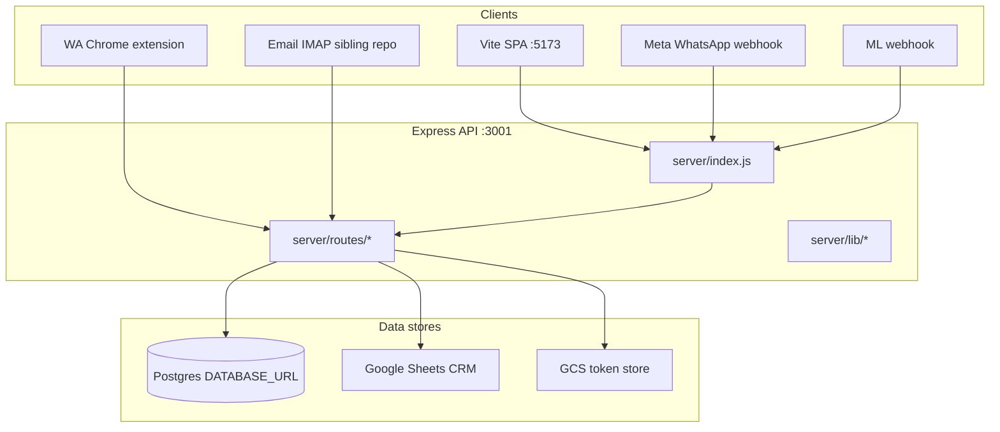

# Phase 1 — Current System Map

**Audit:** EXPORT_SEAL::OMNI_HUB_DISCOVERY_MASTER_V1  
**Date:** 2026-06-22  
**Repo SHA:** `d04a7f4`  
**Role:** Senior Software Architect — Discovery only  
**Cross-links:** [02-channel-map](02-channel-map.md) · [03-api-map](03-api-map.md) · [04-database-map](04-database-map.md)

---

## Classification legend

| Status | Meaning |
|--------|---------|
| **IMPLEMENTED** | Runtime code + routes/migrations/UI present and wired |
| **PARTIAL** | Some layers exist; gaps in webhook, UI, DB, or outbound |
| **DOCUMENTED_ONLY** | Design/docs/SQL only; no runtime wiring |
| **NOT_FOUND** | No evidence in repository |

---

## System topology

---

## Modules and domains

### Calculator (quotation engine)

| Item | Status |
|------|--------|
| Frontend SPA | **IMPLEMENTED** |
| Calc API `/calc/*` | **IMPLEMENTED** |
| PDF generation | **IMPLEMENTED** |

**Evidence:**

- File: `src/components/PanelinCalculadoraV3_backup.jsx`  
  Path: `/Users/matias/calculadora-bmc/src/components/PanelinCalculadoraV3_backup.jsx`  
  Lines: 1–10  
  Description: Canonical calculator component (re-exported by `PanelinCalculadoraV3.jsx`).

- File: `server/routes/calc.js`  
  Path: `/Users/matias/calculadora-bmc/server/routes/calc.js`  
  Lines: 437–451  
  Description: `POST /calc/cotizar`, `POST /calc/cotizar/presupuesto-libre` — core quote endpoints.

- File: `src/App.jsx`  
  Path: `/Users/matias/calculadora-bmc/src/App.jsx`  
  Lines: 372–387  
  Description: Routes `/` and `/calculadora` mount calculator.

---

### Hub / operational modules

| Module | Route(s) | Status |
|--------|----------|--------|
| Wolfboard hub landing | `/hub` | **IMPLEMENTED** |
| MercadoLibre operativo | `/hub/ml` | **IMPLEMENTED** |
| ML Manager | `/hub/ml-manager` | **PARTIAL** |
| WhatsApp Cockpit | `/hub/wa` | **IMPLEMENTED** |
| Canales unificados | `/hub/canales` | **IMPLEMENTED** |
| Google Tasks | `/hub/tareas` | **IMPLEMENTED** |
| Clientes 360 | `/hub/clientes` | **PARTIAL** |
| Proyecto status | `/hub/proyecto` | **IMPLEMENTED** |
| Admin / users / analytics | `/hub/admin/*` | **IMPLEMENTED** |
| Cotizaciones admin | `/hub/cotizaciones` | **IMPLEMENTED** |
| TraKtiMe | `/hub/traktime/*` | **IMPLEMENTED** |
| Agent admin (dev) | `/hub/agent-admin` | **IMPLEMENTED** |
| Marketing intel | `/hub/marketing` | **IMPLEMENTED** |
| Omni Hub workspace | `/hub/omni` | **NOT_FOUND** |

**Evidence:**

- File: `src/App.jsx`  
  Path: `/Users/matias/calculadora-bmc/src/App.jsx`  
  Lines: 178–360  
  Description: All `/hub/*` route definitions with `RequireGrant` wrappers.

- File: `server/routes/wolfboard.js`  
  Path: `/Users/matias/calculadora-bmc/server/routes/wolfboard.js`  
  Lines: 356–755  
  Description: Wolfboard API (`/api/wolfboard/*`).

---

### CRM / Sheets dashboard

| Item | Status |
|------|--------|
| Read/write CRM via Sheets | **IMPLEMENTED** |
| CRM cockpit (ML/WA queues) | **IMPLEMENTED** |
| Unified omnichannel queue (Sheets-backed) | **IMPLEMENTED** |

**Evidence:**

- File: `server/routes/bmcDashboard.js`  
  Path: `/Users/matias/calculadora-bmc/server/routes/bmcDashboard.js`  
  Lines: 1522–3519  
  Description: 50+ `/api/*` routes for finanzas, stock, CRM, cockpit.

- File: `docs/google-sheets-module/README.md`  
  Path: `/Users/matias/calculadora-bmc/docs/google-sheets-module/README.md`  
  Lines: 1–20  
  Description: Canonical Sheets mapping hub.

---

### Channel modules

| Channel | Status | Primary evidence |
|---------|--------|------------------|
| WhatsApp | **IMPLEMENTED** | `server/routes/wa.js`, webhook in `server/index.js` |
| MercadoLibre | **IMPLEMENTED** | ML proxy + webhook in `server/index.js`, `server/ml-crm-sync.js` |
| Email | **PARTIAL** | Ingest API only; external IMAP repo |
| Instagram | **PARTIAL** | `surface.js` + queue filter only |
| Facebook | **PARTIAL** | Same as Instagram |
| Shopify | **PARTIAL** | OAuth + webhook; admin Q&A routes |

See [02-channel-map.md](02-channel-map.md) for full channel audit.

---

### Omni Hub / OmniCRM

| Item | Status |
|------|--------|
| Architecture doc | **DOCUMENTED_ONLY** |
| SQL schema (`omni_*`) | **DOCUMENTED_ONLY** |
| Runtime migrations | **NOT_FOUND** |
| `/api/omni/*` routes | **NOT_FOUND** |
| Omni normalizer | **NOT_FOUND** |

**Evidence:**

- File: `docs/team/OMNI-HUB-ARCHITECTURE.md`  
  Path: `/Users/matias/calculadora-bmc/docs/team/OMNI-HUB-ARCHITECTURE.md`  
  Lines: 1–6  
  Description: "Design frozen. Implementation roadmap in ML-MANAGER-ROADMAP.md."

- File: `docs/team/omni-hub-schema.sql`  
  Path: `/Users/matias/calculadora-bmc/docs/team/omni-hub-schema.sql`  
  Lines: 23–255  
  Description: DDL for `omni_contacts`, `omni_conversations`, `omni_messages`, `omni_deals`, `omni_audit_log`.

- Grep `omni_` under `server/` and `src/`  
  Path: `/Users/matias/calculadora-bmc`  
  Lines: N/A  
  Description: **NOT_FOUND** — no runtime references.

---

### Identity / RBAC

| Item | Status |
|------|--------|
| Google OAuth login | **IMPLEMENTED** |
| JWT access/refresh | **IMPLEMENTED** |
| Module grants (RBAC) | **IMPLEMENTED** |
| MFA TOTP | **IMPLEMENTED** |

**Evidence:**

- File: `supabase/migrations/20260601000001_identity_init.sql`  
  Path: `/Users/matias/calculadora-bmc/supabase/migrations/20260601000001_identity_init.sql`  
  Lines: 33–116  
  Description: `identity.users`, `identity.module_grants`, `identity.role_grants`.

- File: `server/lib/identityAuth.js`  
  Path: `/Users/matias/calculadora-bmc/server/lib/identityAuth.js`  
  Lines: 1–17  
  Description: JWT issue/verify module.

- File: `server/middleware/requireGrant.js`  
  Path: `/Users/matias/calculadora-bmc/server/middleware/requireGrant.js`  
  Lines: 30–39  
  Description: Module-scoped grant middleware.

---

### TraKtiMe (time tracking)

| Item | Status |
|------|--------|
| API `/api/traktime/*` | **IMPLEMENTED** |
| Postgres `tk_*` tables | **IMPLEMENTED** |
| Nightly Sheets mirror worker | **IMPLEMENTED** |

**Evidence:**

- File: `server/routes/traktime.js`  
  Path: `/Users/matias/calculadora-bmc/server/routes/traktime.js`  
  Lines: 58–1335  
  Description: 33 traktime endpoints.

- File: `server/index.js`  
  Path: `/Users/matias/calculadora-bmc/server/index.js`  
  Lines: 1176–1181  
  Description: `startTraktimeMirrorWorker` on boot.

---

### Transportista (logistics)

| Item | Status |
|------|--------|
| Trip FSM API | **IMPLEMENTED** |
| Driver session auth | **IMPLEMENTED** |
| Outbox notification worker | **IMPLEMENTED** |

**Evidence:**

- File: `server/routes/transportista.js`  
  Path: `/Users/matias/calculadora-bmc/server/routes/transportista.js`  
  Lines: 77–641  
  Description: 14 transportista/driver endpoints.

- File: `server/index.js`  
  Path: `/Users/matias/calculadora-bmc/server/index.js`  
  Lines: 1173–1175  
  Description: `startTransportistaOutboxWorker` on boot.

---

### Market intelligence

| Item | Status |
|------|--------|
| ETL pipeline | **IMPLEMENTED** |
| Marketing dashboard API | **IMPLEMENTED** |
| node-cron scheduler | **IMPLEMENTED** |

**Evidence:**

- File: `server/routes/marketing.js`  
  Path: `/Users/matias/calculadora-bmc/server/routes/marketing.js`  
  Lines: 26–173  
  Description: `/api/marketing/*` routes.

- File: `server/lib/marketIntel/scheduler.js`  
  Path: `/Users/matias/calculadora-bmc/server/lib/marketIntel/scheduler.js`  
  Lines: 14–17  
  Description: Daily cron `0 3 * * *` UTC.

---

### Panelin AI

| Item | Status |
|------|--------|
| agentCore shared brain | **IMPLEMENTED** |
| agentChat SSE | **IMPLEMENTED** |
| Training KB / dev mode | **IMPLEMENTED** |
| RAG (pgvector) | **PARTIAL** (flag off by default) |

**Evidence:**

- File: `server/lib/agentCore.js`  
  Path: `/Users/matias/calculadora-bmc/server/lib/agentCore.js`  
  Lines: 1–12  
  Description: Shared brain for chat, CRM, WA.

- File: `server/routes/agentChat.js`  
  Path: `/Users/matias/calculadora-bmc/server/routes/agentChat.js`  
  Lines: 451+  
  Description: `POST /api/agent/chat` SSE endpoint.

See [06-ai-map.md](06-ai-map.md).

---

### PDF pipeline

| Item | Status |
|------|--------|
| Server-side Chromium PDF | **IMPLEMENTED** |
| Client html2pdf fallback | **IMPLEMENTED** |

**Evidence:**

- File: `server/routes/pdf.js`  
  Path: `/Users/matias/calculadora-bmc/server/routes/pdf.js`  
  Lines: 32–156  
  Description: `POST /api/pdf/generate`, `GET /api/pdf/metrics`.

- File: `src/utils/pdfGenerator.js`  
  Path: `/Users/matias/calculadora-bmc/src/utils/pdfGenerator.js`  
  Lines: 1–20  
  Description: Tries server PDF first, falls back to html2pdf.

---

## Services

| Service | Port / host | Status |
|---------|-------------|--------|
| Express API | `:3001` | **IMPLEMENTED** |
| Vite dev SPA | `:5173` | **IMPLEMENTED** |
| Cloud Run API | `panelin-calc` (us-central1) | **IMPLEMENTED** |
| Vercel frontend | `calculadora-bmc.vercel.app` | **IMPLEMENTED** |
| Postgres | `DATABASE_URL` | **IMPLEMENTED** |
| Google Sheets | Service account JSON | **IMPLEMENTED** |
| Meta Graph (WA) | Webhook + Cloud API outbound | **IMPLEMENTED** |
| MercadoLibre OAuth | Token store (GCS/file) | **IMPLEMENTED** |
| Supabase-hosted Postgres | Same `DATABASE_URL` pool | **IMPLEMENTED** |
| omni-crm-sync connector | Separate Cloud Run (planned) | **DOCUMENTED_ONLY** |

**Evidence:**

- File: `package.json`  
  Path: `/Users/matias/calculadora-bmc/package.json`  
  Lines: `"start:api"`, `"dev"`  
  Description: API on 3001, Vite on 5173.

- File: `server/config.js`  
  Path: `/Users/matias/calculadora-bmc/server/config.js`  
  Lines: 122–124  
  Description: `WHATSAPP_ACCESS_TOKEN`, `WHATSAPP_PHONE_NUMBER_ID`.

- File: `vercel.json`  
  Path: `/Users/matias/calculadora-bmc/vercel.json`  
  Lines: 6–18  
  Description: API proxy to Cloud Run; no cron block.

---

## Integrations

| Integration | Entry | Status |
|-------------|-------|--------|
| Google Sheets CRM | `server/routes/bmcDashboard.js` | **IMPLEMENTED** |
| Google Drive (quotes) | `server/routes/quoteDriveArchive.js` | **IMPLEMENTED** |
| Google Tasks OAuth | `server/routes/tasksOAuth.js` | **IMPLEMENTED** |
| WhatsApp Cloud API | `server/index.js` webhook | **IMPLEMENTED** |
| MercadoLibre API | `server/mercadoLibreClient.js` | **IMPLEMENTED** |
| Shopify Admin | `server/routes/shopify.js` | **PARTIAL** |
| OpenAI / Anthropic / Gemini / Grok | `server/lib/aiProviderConfig.js` | **IMPLEMENTED** |
| Email IMAP (external) | `scripts/email-snapshot-ingest.mjs` | **PARTIAL** |
| Meta IG/FB Graph | — | **NOT_FOUND** |

---

## Jobs, workers, cron

### In-process workers (API boot)

| Worker | File | Status |
|--------|------|--------|
| Transportista outbox | `server/lib/transportistaOutboxWorker.js` | **IMPLEMENTED** |
| TraKtiMe Sheets mirror | `server/lib/traktimeMirrorWorker.js` | **IMPLEMENTED** |
| WA enricher | `server/lib/waEnricherWorker.js` | **IMPLEMENTED** (flag/env gated) |
| WA SLA | `server/lib/waSlaWorker.js` | **IMPLEMENTED** |
| WA followups | `server/lib/waFollowupsWorker.js` | **IMPLEMENTED** |
| Orphan session close | `server/jobs/closeOrphanSessions.js` | **IMPLEMENTED** |
| WA conversation cache cleanup | `server/index.js` | **IMPLEMENTED** |
| Market intel ETL | `server/lib/marketIntel/scheduler.js` | **IMPLEMENTED** |

**Evidence:**

- File: `server/index.js`  
  Path: `/Users/matias/calculadora-bmc/server/index.js`  
  Lines: 1162–1223  
  Description: All workers started in `app.listen` callback.

---

### GitHub Actions scheduled jobs

| Workflow | Schedule | Status |
|----------|----------|--------|
| `smoke-prod-scheduled.yml` | `0 8,20 * * *` | **IMPLEMENTED** |
| `knowledge-antenna-scheduled.yml` | `20 10 * * *` | **IMPLEMENTED** |
| `matriz-sync.yml` | `0 2 * * *` | **IMPLEMENTED** |
| `catalog-diff.yml` | `0 9 * * *` | **IMPLEMENTED** |
| `product-docs.yml` | `0 6 * * *` | **IMPLEMENTED** |
| `gemini-scheduled-triage.yml` | `0 * * * *` | **IMPLEMENTED** |
| `email-ingest-scheduled.yml` | cron commented | **PARTIAL** |

**Evidence:**

- File: `.github/workflows/smoke-prod-scheduled.yml`  
  Path: `/Users/matias/calculadora-bmc/.github/workflows/smoke-prod-scheduled.yml`  
  Lines: 1–15  
  Description: Scheduled prod smoke.

- File: `.github/workflows/email-ingest-scheduled.yml`  
  Path: `/Users/matias/calculadora-bmc/.github/workflows/email-ingest-scheduled.yml`  
  Lines: N/A (cron disabled)  
  Description: Manual `workflow_dispatch` only — **PARTIAL**.

---

### Vercel cron

| Item | Status |
|------|--------|
| `vercel.json` cron block | **NOT_FOUND** |

**Evidence:**

- File: `vercel.json`  
  Path: `/Users/matias/calculadora-bmc/vercel.json`  
  Lines: 1–60  
  Description: Rewrites, headers, API proxy only — no `crons` key.

---

## Channel adapters

| Adapter | Entry point | Status |
|---------|-------------|--------|
| WA Cloud API webhook | `GET/POST /webhooks/whatsapp` | **IMPLEMENTED** |
| WA Chrome extension ingest | `POST /api/wa/ingest` | **IMPLEMENTED** |
| ML notifications webhook | `POST /webhooks/ml` | **IMPLEMENTED** |
| Email HTTP bridge | `POST /api/crm/ingest-email` | **PARTIAL** |
| Shopify webhook | `POST /webhooks/shopify` | **IMPLEMENTED** |
| Meta IG/FB webhook | — | **NOT_FOUND** |
| Omni normalizer / unified ingest | — | **NOT_FOUND** |
| `server/routes/webhooks.js` (stub) | NOT mounted | **NOT_FOUND** (live handlers in index.js) |

**Evidence:**

- File: `server/index.js`  
  Path: `/Users/matias/calculadora-bmc/server/index.js`  
  Lines: 533–603, 641–962  
  Description: Live ML and WA webhook handlers.

- File: `server/routes/webhooks.js`  
  Path: `/Users/matias/calculadora-bmc/server/routes/webhooks.js`  
  Lines: 1–97  
  Description: Duplicate stub; not imported in `index.js`.

---

## Route mount summary

| Mount prefix | Module | Line (index.js) |
|--------------|--------|-----------------|
| `/calc` | calc.js | 964 |
| `/api/team-assist` | teamAssist.js | 966 |
| `/api` | auth, agent*, followups, transportista, wa, dashboard, … | 967–1051 |
| `/api/agent` | superAgent.js | 1019 |
| `/api/internal/panelin` | panelinInternal.js | 1024 |
| `/api/internal/presup` | presupOrchestrator.js | 1025 |
| `/api/panelin` | panelin.js (+ requireServiceOrUser) | 1031 |
| `/api/wolfboard` | wolfboard.js | 1033 |
| `/api/marketing` | marketing.js | 1036 |
| `/api/pdf` | pdf.js | 1039 |
| `/api/tasks` | tasks.js | 1056 |
| `/auth/tasks` | tasksOAuth.js | 1059 |
| `/sync` | tasksSync.js | 1061 |
| `/` | legacyQuote.js | 1128 |

Full route inventory: [03-api-map.md](03-api-map.md).
