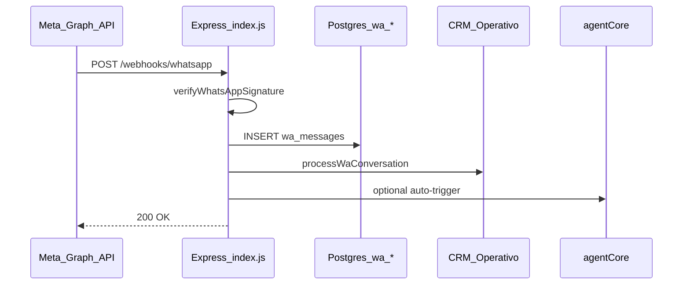
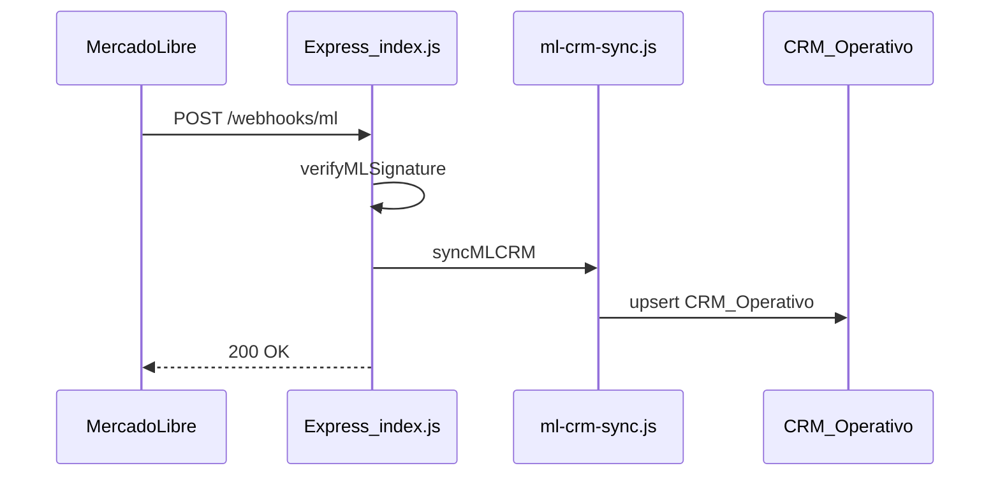

# Phase 2 — Channel Map

**Audit:** EXPORT_SEAL::OMNI_HUB_DISCOVERY_MASTER_V1  
**Date:** 2026-06-22  
**Repo SHA:** `d04a7f4`  
**Cross-links:** [01-current-system-map](01-current-system-map.md) · [03-api-map](03-api-map.md) · [04-database-map](04-database-map.md)

---

## Summary

| Channel | Status | Inbound | Outbound | Dedicated UI |
|---------|--------|---------|----------|--------------|
| WhatsApp | **IMPLEMENTED** | Meta webhook + extension ingest | Cloud API + CRM send-approved | `/hub/wa` |
| MercadoLibre | **IMPLEMENTED** | Webhook + OAuth pull | ML Answers API + CRM send-approved | `/hub/ml`, `/hub/ml-manager` |
| Email | **PARTIAL** | External IMAP → HTTP ingest | AI draft only (no SMTP) | **NOT_FOUND** |
| Instagram | **PARTIAL** | Manual CRM rows only | **NOT_FOUND** | Filter in `/hub/canales` |
| Facebook | **PARTIAL** | Manual CRM rows only | **NOT_FOUND** | Filter in `/hub/canales` |

---

## WhatsApp — IMPLEMENTED

### Entry points

| Method | Path | Handler location | Status |
|--------|------|------------------|--------|
| GET | `/webhooks/whatsapp` | `server/index.js` | **IMPLEMENTED** |
| POST | `/webhooks/whatsapp` | `server/index.js` | **IMPLEMENTED** |
| POST | `/api/wa/ingest` | `server/routes/wa.js` | **IMPLEMENTED** |
| GET/POST | `/api/wa/*` (37 routes) | `server/routes/wa.js` | **IMPLEMENTED** |

**Evidence:**

- File: `server/index.js`  
  Path: `/Users/matias/calculadora-bmc/server/index.js`  
  Lines: 641–650, 812–962  
  Description: Meta verify token (GET) and inbound message handler (POST) with Postgres mirror.

- File: `server/routes/wa.js`  
  Path: `/Users/matias/calculadora-bmc/server/routes/wa.js`  
  Lines: 534, 660, 1045  
  Description: Extension batch ingest, conversations list, outbound send.

### Webhook

**Evidence:**

- File: `server/lib/whatsappSignature.js`  
  Path: `/Users/matias/calculadora-bmc/server/lib/whatsappSignature.js`  
  Lines: 8–26  
  Description: HMAC SHA256 validation of `x-hub-signature-256`.

### Auth

| Mechanism | Env var | Status |
|-----------|---------|--------|
| Webhook verify token | `WHATSAPP_VERIFY_TOKEN` | **IMPLEMENTED** |
| HMAC signature | `WHATSAPP_APP_SECRET` | **IMPLEMENTED** |
| Cloud API send | `WHATSAPP_ACCESS_TOKEN`, `WHATSAPP_PHONE_NUMBER_ID` | **IMPLEMENTED** |
| Cockpit machine auth | `API_AUTH_TOKEN` | **IMPLEMENTED** |
| Operator magic link JWT | `WA_AUTH_*` | **IMPLEMENTED** |

### Service layer

| File | Purpose | Status |
|------|---------|--------|
| `server/routes/wa.js` | Main WA router | **IMPLEMENTED** |
| `server/lib/waDb.js` | Postgres queries | **IMPLEMENTED** |
| `server/lib/waEnricher.js` | Intent classify + AI enrich | **IMPLEMENTED** |
| `server/lib/whatsappOutbound.js` | Cloud API send | **IMPLEMENTED** |

### Storage / database

18 migrations under `wa-package/migrations/` — **IMPLEMENTED**

**Evidence:**

- File: `wa-package/migrations/000_wa_conversations.sql`  
  Path: `/Users/matias/calculadora-bmc/wa-package/migrations/000_wa_conversations.sql`  
  Lines: 6–21  
  Description: `wa_conversations` table with `lead_sheet_row`.

### Google Sheets usage

- CRM via `processWaConversation` — **IMPLEMENTED**
- `GET /api/crm/cockpit/wa-queue` — **IMPLEMENTED**

### Frontend

| Route | Component | Status |
|-------|-----------|--------|
| `/hub/wa` | `BmcWaModuleWithTabs.jsx` | **IMPLEMENTED** |
| `/hub/wa-inbox` | — | **NOT_FOUND** |

---

## MercadoLibre — IMPLEMENTED

### Entry points

OAuth, `/ml/*` proxy, `POST /webhooks/ml`, CRM sync — **IMPLEMENTED**

**Evidence:**

- File: `server/index.js`  
  Path: `/Users/matias/calculadora-bmc/server/index.js`  
  Lines: 291–627  
  Description: Full ML surface inline in index.

### Webhook flow

### Auth

OAuth PKCE + HMAC webhook — **IMPLEMENTED** (`server/mercadoLibreClient.js`, `server/lib/mlSignature.js`)

### Storage

Token store only; no ML Postgres channel tables — **PARTIAL** (Sheets is primary queue)

### Frontend

`/hub/ml` **IMPLEMENTED**; `/hub/ml-manager` **PARTIAL**

---

## Email — PARTIAL

### Entry points

| Method | Path | Status |
|--------|------|--------|
| POST | `/api/crm/parse-email` | **IMPLEMENTED** |
| POST | `/api/crm/ingest-email` | **IMPLEMENTED** |
| POST | `/api/email/draft-outbound` | **IMPLEMENTED** |

**Evidence:**

- File: `server/routes/bmcDashboard.js`  
  Path: `/Users/matias/calculadora-bmc/server/routes/bmcDashboard.js`  
  Lines: 2528–2926  
  Description: Email CRM endpoints.

### Webhook

In-repo IMAP receiver — **NOT_FOUND** (external sibling repo + `email-snapshot-ingest.mjs`)

### Frontend

`/hub/email` — **NOT_FOUND**

---

## Instagram — PARTIAL

Classification via `surface.js` and unified queue filter only.

**Evidence:**

- File: `server/lib/surface.js`  
  Path: `/Users/matias/calculadora-bmc/server/lib/surface.js`  
  Lines: 18, 74  
  Description: INSTAGRAM surface and origen regex.

Meta Graph webhook — **NOT_FOUND**

---

## Facebook — PARTIAL

Same as Instagram; `send-approved` rejects non-ML/WA origen.

**Evidence:**

- File: `server/routes/bmcDashboard.js`  
  Path: `/Users/matias/calculadora-bmc/server/routes/bmcDashboard.js`  
  Lines: 3253–3256  
  Description: Outbound send limited to ML and WA.

---

## Cross-channel (Sheets-backed)

| Endpoint | Status |
|----------|--------|
| `GET /api/crm/cockpit/unified-queue` | **IMPLEMENTED** |
| `POST /api/crm/cockpit/sync-all` | **IMPLEMENTED** (IG/FB skipped) |

Planned `omni_*` ingest — **DOCUMENTED_ONLY** ([OMNI-HUB-ARCHITECTURE.md](../team/OMNI-HUB-ARCHITECTURE.md))
