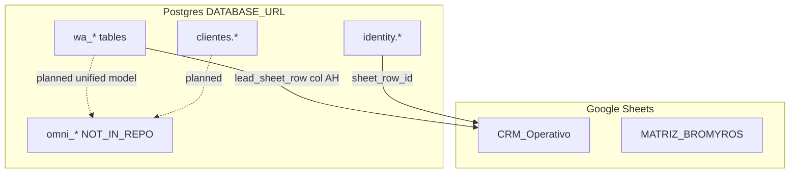

# Phase 4 — Database Inventory

**Audit:** EXPORT_SEAL::OMNI_HUB_DISCOVERY_MASTER_V1  
**Date:** 2026-06-22  
**Repo SHA:** `d04a7f4`  
**Cross-links:** [02-channel-map](02-channel-map.md) · [08-omni-gap-analysis](08-omni-gap-analysis.md)

---

## Store summary

| Store | Status | Connection |
|-------|--------|------------|
| Postgres (`DATABASE_URL`) | **IMPLEMENTED** | Shared pool: WA, identity, transportista, traktime, RAG, market intel |
| Supabase migrations | **IMPLEMENTED** | Same Postgres; schemas applied via `supabase/migrations/` |
| SQLite | **PARTIAL** | Submodule `shop-chat-agent/prisma/` only |
| Google Sheets | **IMPLEMENTED** | Logical CRM schema; no SQL DDL |

---

## Special focus: `omni_*` tables

| Entity | DDL | Runtime code | Status |
|--------|-----|--------------|--------|
| `omni_contacts` | `docs/team/omni-hub-schema.sql` L23–61 | NOT_FOUND in `server/` | **DOCUMENTED_ONLY** |
| `omni_conversations` | same L72–103 | NOT_FOUND | **DOCUMENTED_ONLY** |
| `omni_messages` | same L116–162 | NOT_FOUND | **DOCUMENTED_ONLY** |
| `omni_deals` | same L174–211 | NOT_FOUND | **DOCUMENTED_ONLY** |
| `omni_audit_log` | same L225–255 | NOT_FOUND | **DOCUMENTED_ONLY** |

**Evidence:**

- File: `docs/team/omni-hub-schema.sql`  
  Path: `/Users/matias/calculadora-bmc/docs/team/omni-hub-schema.sql`  
  Lines: 23–255  
  Description: Canonical DDL for all five omni tables + views.

- Grep `omni_` under `server/` and `src/`  
  Description: **NOT_FOUND** — no runtime references.

- `server/migrations/omni/`  
  Description: **NOT_FOUND**

- `npm run omni:migrate` in `package.json`  
  Description: **NOT_FOUND**

### `omni_contacts` (documented columns)

| Column | Purpose |
|--------|---------|
| `id` UUID PK | Distributed ID |
| `integration_uuid` UNIQUE | Canonical cross-system ID |
| `ml_user_id` UNIQUE sparse | MercadoLibre user |
| `wa_phone` UNIQUE sparse | E.164 WhatsApp |
| `chrome_ext_contact_id` UNIQUE sparse | omnicrm-sync extension |
| `name`, `email`, `phone`, `avatar_url` | Contact attributes |
| `properties` JSONB | Channel-specific metadata |
| `created_at`, `updated_at` | Timestamps |

### `omni_conversations`

| Column | Purpose |
|--------|---------|
| `contact_id` → omni_contacts | Parent contact |
| `channel` | ml, wa, instagram, facebook, email |
| `channel_conversation_id` | External thread ID |
| `subject`, `status`, `priority`, `tags[]` | Thread metadata |

### `omni_messages`

| Column | Purpose |
|--------|---------|
| `conversation_id` → omni_conversations | Parent thread |
| `sender`, `sender_id`, `body` | Message content |
| `body_ai_category` | AI classification |
| `attachments`, `metadata` JSONB | Extensibility |
| `read_at`, `created_at` | Lifecycle |

### `omni_deals`

| Column | Purpose |
|--------|---------|
| `contact_id` | Pipeline owner |
| `title`, `value_usd`, `stage` | Deal fields |
| `source_channel`, `source_conversation_id` | Provenance |
| `owner_agent_id`, `expected_close_date`, `closed_at` | Ownership |

### `omni_audit_log`

| Column | Purpose |
|--------|---------|
| `entity_type`, `entity_id` | contacts/conversations/messages/deals |
| `operation`, `old_values`, `new_values` | Change capture |
| `changed_by`, `change_reason` | Attribution |

---

## Cross-reference diagram

---

## Postgres: WA Cockpit (`wa-package/migrations/`)

**Migrate:** `npm run wa:migrate`  
**Status:** **IMPLEMENTED**

| Table | Key columns | Purpose | Code ref |
|-------|-------------|---------|----------|
| `wa_conversations` | `chat_id` PK, `phone`, `status`, `lead_sheet_row`, `meta` | Thread header | `server/routes/wa.js` |
| `wa_messages` | `msg_id`, `chat_id`, `direction`, `text`, `raw` | Message log | same |
| `wa_suggestions` | AI reply options | Suggestions queue | WA workers |
| `wa_quotes` | calc snapshot, `link`, `sheet_row` | Chat quotes | `waQuoteRunner` |
| `wa_followups` | scheduling | Follow-ups | `waFollowupsWorker` |
| `wa_settings` | scoped JSONB config | Runtime config | `waConfig.js` |
| `wa_flags` | feature flags | Toggles | `waConfig.js` |
| `wa_operators` | multi-operator auth | WA Pro | `wa-admin.mjs` |
| `wa_audit_log` | settings/outbound audit | Compliance | `wa.js` L383 |
| `wa_webhooks` | outbound webhooks | Integrations | `waWebhooks.js` |
| `wa_rules` | automation rules | Routing | `waRoutingRules.js` |
| `wa_sla_breaches` | SLA tracking | SLA worker | `waSlaWorker.js` |
| `wa_heartbeats` | extension liveness | Chrome ext | `wa.js` L1243 |
| `bmc_quote_counter` | `year`, `seq` | Global quote numbering | `quoteCounterDb.js` |

**Evidence:**

- File: `wa-package/migrations/000_wa_conversations.sql`  
  Path: `/Users/matias/calculadora-bmc/wa-package/migrations/000_wa_conversations.sql`  
  Lines: 6–21  
  Description: `wa_conversations` DDL.

---

## Postgres: Identity (`supabase/migrations/`)

**Status:** **IMPLEMENTED**

| Table | Purpose |
|-------|---------|
| `identity.users` | Auth users, Google sub, plan tier |
| `identity.sessions` | Refresh token rotation |
| `identity.modules` | Module catalog |
| `identity.role_grants` | Coarse roles |
| `identity.module_grants` | Fine-grained RBAC |
| `identity.quotes` | Per-user quote history JSONB |
| `identity.quote_events` | Quote lifecycle audit |
| `identity.audit_log` | Security/admin audit |
| `identity.message_threads` | Internal messaging |
| `identity.user_activity_log` | Activity historial |
| `identity.mfa_secrets` | TOTP 2FA |

**Evidence:**

- File: `supabase/migrations/20260601000001_identity_init.sql`  
  Path: `/Users/matias/calculadora-bmc/supabase/migrations/20260601000001_identity_init.sql`  
  Lines: 33–284  
  Description: Core identity schema.

---

## Postgres: Clientes 360 (`clientes.*`)

**Status:** **PARTIAL** (full migration; limited API routes)

| Table | Purpose |
|-------|---------|
| `clientes.customers` | Master customer record |
| `clientes.customer_identities` | External IDs per channel |
| `clientes.customer_events` | Partitioned timeline |
| `clientes.customer_quotes` | Link to identity.quotes |
| `clientes.customer_followups` | Follow-ups |
| `clientes.agent_jobs` | Internal job queue |

**Evidence:**

- File: `supabase/migrations/20260508000001_clientes_360_init.sql`  
  Path: `/Users/matias/calculadora-bmc/supabase/migrations/20260508000001_clientes_360_init.sql`  
  Lines: 37–264  
  Description: Clientes schema.

- File: `server/routes/clientes/customers.js`  
  Description: Only 2 routes — **PARTIAL** API coverage.

---

## Postgres: Transportista

**Migrate:** `npm run transportista:migrate`  
**Status:** **IMPLEMENTED**

| Table | Purpose |
|-------|---------|
| `trips` | Trip header, status FSM |
| `trip_events` | Append-only event sourcing |
| `driver_sessions` | Driver auth tokens |
| `outbox_notifications` | WhatsApp notification outbox |

---

## Postgres: TraKtiMe

**Migrate:** `npm run traktime:migrate`  
**Status:** **IMPLEMENTED**

| Table | Purpose |
|-------|---------|
| `tk_clients`, `tk_projects`, `tk_tasks` | Hierarchy |
| `tk_entries` | Time entries |
| `tk_invoices`, `tk_invoice_lines` | Billing |
| `tk_audit_log` | Audit trail |

---

## Postgres: Market Intel (`bmc_market_intel.*`)

**Migrate:** `npm run migrate:market-intel`  
**Status:** **IMPLEMENTED**

| Table | Purpose |
|-------|---------|
| `competitors`, `skus`, `price_history` | Price monitoring |
| `etl_runs`, `alerts` | Pipeline + alerts |
| `mystery_shopping_queue` | Mystery shopping |

---

## Postgres: RAG

| Table | Columns | Purpose | Status |
|-------|---------|---------|--------|
| `quote_embeddings` | `embedding vector(1536)`, `lead_id`, `metadata` | RAG retrieval | **IMPLEMENTED** |
| `bmc_schema_migrations` | migration tracking | Schema version | **IMPLEMENTED** |

**Evidence:**

- File: `migrations/0001_add_pgvector_and_quote_embeddings.sql`  
  Path: `/Users/matias/calculadora-bmc/migrations/0001_add_pgvector_and_quote_embeddings.sql`  
  Lines: 41–50  
  Description: pgvector table.

- File: `server/lib/rag.js`  
  Description: Query layer — flag `RAG_ENABLED` default false.

---

## Supabase references

| Item | Status |
|------|--------|
| `DATABASE_URL` → hosted Postgres | **IMPLEMENTED** |
| `SUPABASE_PGP_ENCRYPT_KEY` | **IMPLEMENTED** (`server/config.js` L147) |
| `@supabase/supabase-js` in frontend | **NOT_FOUND** |
| Backend uses `pg.Pool` | **IMPLEMENTED** |

---

## SQLite

| Location | Status |
|----------|--------|
| `shop-chat-agent/prisma/schema.prisma` | **IMPLEMENTED** (isolated submodule) |
| Main BMC `server/` or `src/` | **NOT_FOUND** |

Models: `Session`, `CustomerToken`, `Conversation`, `Message` — Shopify chat agent only.

---

## Google Sheets (logical entities)

**Status:** **IMPLEMENTED** — runtime in `bmcDashboard.js`; docs in `docs/google-sheets-module/`

| Workbook | Env var | Primary tab |
|----------|---------|-------------|
| BMC CRM | `BMC_SHEET_ID` | CRM_Operativo |
| Pagos | `BMC_PAGOS_SHEET_ID` | Pagos_Pendientes |
| Ventas | `BMC_VENTAS_SHEET_ID` | Multiple tabs |
| Stock | `BMC_STOCK_SHEET_ID` | Stock E-Commerce |
| MATRIZ | `BMC_MATRIZ_SHEET_ID` | MATRIZ BROMYROS |

### CRM_Operativo (channel-relevant columns)

| Column / field | Purpose |
|----------------|---------|
| ID, Fecha, Cliente | Row identity |
| Teléfono, Ubicación | Contact |
| Estado, Responsable | Pipeline |
| Consulta / Pedido | Message body |
| Monto estimado USD | Deal value |
| Col AH (quote link) | Quote URL bridge |

**Evidence:**

- File: `docs/google-sheets-module/planilla-inventory.md`  
  Path: `/Users/matias/calculadora-bmc/docs/google-sheets-module/planilla-inventory.md`  
  Lines: 54–66  
  Description: CRM_Operativo column contract.

### AUDIT_LOG (Sheets)

| Column | Purpose |
|--------|---------|
| TIMESTAMP, ACTION, ROW | Change tracking |
| OLD_VALUE, NEW_VALUE, REASON | Audit detail |
| USER, SHEET | Attribution |

---

## Migration package checklist

| Package | Path | npm script | Status |
|---------|------|------------|--------|
| RAG | `migrations/` | manual psql | IMPLEMENTED |
| Supabase | `supabase/migrations/` | manual/MCP | IMPLEMENTED |
| WA | `wa-package/migrations/` (18 files) | `wa:migrate` | IMPLEMENTED |
| Transportista | `transportista-cursor-package/migrations/` | `transportista:migrate` | IMPLEMENTED |
| TraKtiMe | `traktime-package/migrations/` | `traktime:migrate` | IMPLEMENTED |
| Market Intel | `server/migrations/market-intel/` | `migrate:market-intel` | IMPLEMENTED |
| Omni | `server/migrations/omni/` | — | **NOT_FOUND** |
