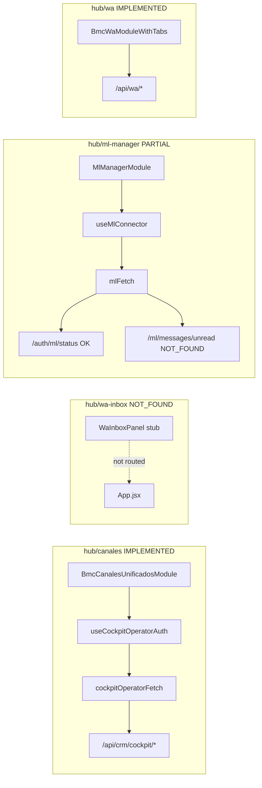

# Phase 5 — Frontend Inventory

**Audit:** EXPORT_SEAL::OMNI_HUB_DISCOVERY_MASTER_V1  
**Date:** 2026-06-22  
**Repo SHA:** `d04a7f4`  
**Cross-links:** [02-channel-map](02-channel-map.md) · [03-api-map](03-api-map.md)

---

## Hub route registry

| Route | Mounted | Component | RBAC | Status |
|-------|---------|-----------|------|--------|
| `/hub/canales` | Yes | `BmcCanalesUnificadosModule` | `canales:read` | **IMPLEMENTED** |
| `/hub/ml-manager` | Yes | `MlManagerModule` | `canales:read` | **PARTIAL** |
| `/hub/wa-inbox` | **No** | — | — | **NOT_FOUND** |
| `/hub/wa` (related) | Yes | `BmcWaModuleWithTabs` | `wa:read` | **IMPLEMENTED** |
| `/hub/ml` (related) | Yes | `BmcMlOperativoModule` | `canales:read` | **IMPLEMENTED** |

**Evidence:**

- File: `src/App.jsx`  
  Path: `/Users/matias/calculadora-bmc/src/App.jsx`  
  Lines: 188–234  
  Description: Hub route definitions; no `/hub/wa-inbox`.

---

## `/hub/canales` — IMPLEMENTED

### Components

| Component | Path | Role | Status |
|-----------|------|------|--------|
| `BmcCanalesUnificadosModule` | `src/components/BmcCanalesUnificadosModule.jsx` | Production unified CRM queue UI | **IMPLEMENTED** |
| `CockpitTokenPanel` | `src/components/CockpitTokenPanel.jsx` | API token override panel | **IMPLEMENTED** |
| `CanalesModule` (orphan) | `src/components/hub/canales/CanalesModule.jsx` | Tabbed scaffold (not routed) | **NOT_MOUNTED** |
| `WaInboxPanel` (stub) | `src/components/hub/canales/panels/WaInboxPanel.jsx` | Phase 2 placeholder | **DOCUMENTED_ONLY** |
| `MlManagerPanel` (stub) | `src/components/hub/canales/panels/MlManagerPanel.jsx` | Fake local data | **PARTIAL** |

**Evidence:**

- File: `src/components/BmcCanalesUnificadosModule.jsx`  
  Path: `/Users/matias/calculadora-bmc/src/components/BmcCanalesUnificadosModule.jsx`  
  Lines: 1–5  
  Description: Imports `useCockpitOperatorAuth`, `cockpitOperatorFetch`.

- File: `src/components/hub/canales/CanalesModule.jsx`  
  Description: Not imported in `App.jsx` — **NOT_MOUNTED**.

### Hooks

| Hook | File | Purpose | Status |
|------|------|---------|--------|
| `useCockpitOperatorAuth` | `src/hooks/useCockpitOperatorAuth.js` | JWT or API token for cockpit | **IMPLEMENTED** |

**Evidence:**

- File: `src/components/BmcCanalesUnificadosModule.jsx`  
  Lines: 4–5  
  Description: `useCockpitOperatorAuth({ module: "canales", minLevel: "write" })`.

### Services / utilities

| Utility | File | Purpose |
|---------|------|---------|
| `cockpitOperatorFetch` | `src/utils/cockpitOperatorFetch.js` | Authenticated fetch wrapper |

### APIs consumed

| Method | Endpoint | Purpose | Line ref |
|--------|----------|---------|----------|
| GET | `/api/crm/cockpit/unified-queue?channel=` | Multi-channel queue | ~L169 |
| POST | `/api/crm/cockpit/sync-all` | Sync ML + WA note | ~L200 |
| POST | `/api/crm/cockpit/quote-link` | Save quote URL col AH | ~L233 |
| POST | `/api/crm/cockpit/approval` | Approve for send | ~L248 |
| POST | `/api/crm/cockpit/send-approved` | Send ML/WA reply | ~L267 |

**Evidence:**

- File: `src/components/BmcCanalesUnificadosModule.jsx`  
  Description: All fetch calls via `cockpitOperatorFetch`.

### Backend auth

`requireCrmCockpitRead/Write` → JWT `canales:read/write` or `API_AUTH_TOKEN`

**Evidence:**

- File: `server/middleware/requireCrmCockpitAuth.js`  
  Path: `/Users/matias/calculadora-bmc/server/middleware/requireCrmCockpitAuth.js`  
  Lines: 14–23  
  Description: Dual auth for cockpit routes.

### Status: **IMPLEMENTED** (production unified queue)

---

## `/hub/wa-inbox` — NOT_FOUND

### Route

| Item | Status |
|------|--------|
| `<Route path="/hub/wa-inbox">` in App.jsx | **NOT_FOUND** |
| Documented in OMNI-HUB-ARCHITECTURE | **DOCUMENTED_ONLY** |

**Evidence:**

- File: `docs/team/OMNI-HUB-ARCHITECTURE.md`  
  Lines: 33–35  
  Description: Plans `/hub/wa-inbox` for Phase 2.

### Stub only (unmounted)

| Component | Status |
|-----------|--------|
| `WaInboxPanel.jsx` | **DOCUMENTED_ONLY** stub |

**Evidence:**

- File: `src/components/hub/canales/panels/WaInboxPanel.jsx`  
  Path: `/Users/matias/calculadora-bmc/src/components/hub/canales/panels/WaInboxPanel.jsx`  
  Lines: 1–6, 23  
  Description: "WA Inbox — Coming in Phase 2"; not routed.

### Functional WA alternative

| Route | Component | Status |
|-------|-----------|--------|
| `/hub/wa` | `BmcWaModuleWithTabs.jsx` | **IMPLEMENTED** |

**Evidence:**

- File: `src/App.jsx`  
  Lines: 212–221  
  Description: Live WA Cockpit route.

### Status: **NOT_FOUND** as route; live WA at `/hub/wa`

---

## `/hub/ml-manager` — PARTIAL

### Components

| Component | Path | Status |
|-----------|------|--------|
| `MlManagerModule` | `src/components/hub/ml/MlManagerModule.jsx` | **IMPLEMENTED** shell |
| `OverviewTab` | `src/components/hub/ml/tabs/OverviewTab.jsx` | **PARTIAL** |
| `ListingsTab` | `src/components/hub/ml/tabs/ListingsTab.jsx` | **PARTIAL** |
| `MessagesTab` | `src/components/hub/ml/tabs/MessagesTab.jsx` | **STUB** (mock UI) |
| `AdsTab`, `ShipmentsTab`, `AnalyticsTab` | `src/components/hub/ml/tabs/` | **PARTIAL** |

**Evidence:**

- File: `src/App.jsx`  
  Lines: 200–209  
  Description: Route mounts `MlManagerModule` with 6 tabs.

### Hooks

| Hook | File | API called | Backend exists? |
|------|------|------------|-----------------|
| `useConnectorStatus` | `useMlConnector.js` L8–14 | `GET /auth/ml/status` | **YES** |
| `useListings` | L17–23 | `GET /ml/listings` | **YES** |
| `useUnreadMessages` | L36–42 | `GET /ml/messages/unread` | **NOT_FOUND** |
| `useMessagePack` | L45–52 | `GET /ml/messages/packs/:id` | **NOT_FOUND** |
| `useCampaigns` | L55+ | `GET /ml/ads/campaigns` | **NOT_FOUND** |
| `useAdReports` | — | `GET /ml/ads/reports/summary` | **NOT_FOUND** |
| `useReputation` | — | `GET /ml/analytics/reputation` | **NOT_FOUND** |
| `useSales` | — | `GET /ml/analytics/sales` | **NOT_FOUND** |
| `useDailyBrief` | — | `GET /ai/daily-brief` | **NOT_FOUND** |

**Evidence:**

- File: `src/components/hub/ml/hooks/useMlConnector.js`  
  Path: `/Users/matias/calculadora-bmc/src/components/hub/ml/hooks/useMlConnector.js`  
  Lines: 8–60  
  Description: React Query hooks calling mlFetch paths.

### Services

| Service | File | Config |
|---------|------|--------|
| `mlFetch` | `src/components/hub/ml/utils/mlFetch.js` | `VITE_ML_CONNECTOR_URL` default `http://localhost:3001` |

**Evidence:**

- File: `src/components/hub/ml/utils/mlFetch.js`  
  Lines: 1–2  
  Description: Base URL and optional API key.

### Path mismatch

| Frontend | Server | Status |
|----------|--------|--------|
| `PATCH /ml/listings/:id/status` | `PATCH /ml/items/:id` | **MISMATCH** |

**Evidence:**

- File: `server/index.js` L386  
  Description: Server uses `/ml/items/:id` not `/ml/listings/:id/status`.

### Status: **PARTIAL** — shell + ~2 working APIs; MessagesTab mock

---

## Related frontend (not in scope but referenced)

| Route | Purpose | Status |
|-------|---------|--------|
| `/hub/wa` | Full WA Cockpit | **IMPLEMENTED** |
| `/hub/ml` | ML CRM operativo queue | **IMPLEMENTED** |
| `/` | Calculator | **IMPLEMENTED** |

---

## Frontend architecture diagram

