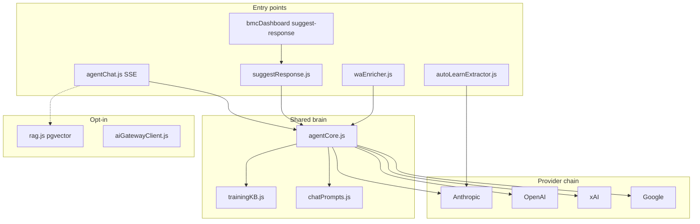

# Phase 6 — AI Inventory

**Audit:** EXPORT_SEAL::OMNI_HUB_DISCOVERY_MASTER_V1  
**Date:** 2026-06-22  
**Repo SHA:** `d04a7f4`  
**Cross-links:** [01-current-system-map](01-current-system-map.md) · [07-security-map](07-security-map.md)

---

## Architecture overview

---

## agentCore

| Field | Value |
|-------|-------|
| **File** | `server/lib/agentCore.js` |
| **Purpose** | Shared non-streaming brain for chat, CRM, WA |
| **Model** | Chain: Claude → OpenAI → Grok → Gemini via `getProviderChain()` |
| **Default models** | `claude-opus-4-7`, `gpt-4o-mini`, `grok-3-mini`, `gemini-2.0-flash` |
| **Input** | `{ messages[], channel, calcState?, taskKey?, provider? }` |
| **Output** | `{ text, provider, model?, latencyMs? }` |

**Evidence:**

- File: `server/lib/agentCore.js`  
  Path: `/Users/matias/calculadora-bmc/server/lib/agentCore.js`  
  Lines: 1–12, 96–113  
  Description: Module header and `callAgentOnce` signature.

**Prompt:** Built from `buildSystemPrompt()` + `buildChannelSection(channel)` + KB examples.

**Channel rules (embedded prompts):**

| Channel | Max length | Tone |
|---------|------------|------|
| `ml` | 350 chars | Professional, no markdown |
| `wa` | 800 chars | Friendly, light emoji |
| `chat` | Unlimited | Markdown + tools |

**Evidence:** `agentCore.js` L26–49 (`CHANNEL_RULES`)

---

## agentChat

| Field | Value |
|-------|-------|
| **File** | `server/routes/agentChat.js` |
| **Purpose** | SSE streaming chat + tool loop for Panelin UI |
| **Endpoint** | `POST /api/agent/chat` |
| **Model** | User-selectable via `aiProvider`/`aiModel`; same chain fallback |
| **Input** | POST `{ messages, calcState, devMode, surface, aiProvider, ... }` |
| **Output** | SSE events: `text`, `action`, `suggestions`, `done`, `error` |

**Evidence:**

- File: `server/routes/agentChat.js`  
  Path: `/Users/matias/calculadora-bmc/server/routes/agentChat.js`  
  Lines: 451+  
  Description: Main chat handler.

- File: `server/index.js`  
  Lines: 975  
  Description: `app.use("/api", agentChatRouter)`.

**Related endpoints:**

| Method | Path | Auth | Purpose |
|--------|------|------|---------|
| GET | `/api/agent/ai-options` | NONE | Provider/model list |
| GET | `/api/agent/tools-manifest` | NONE | Tool definitions |
| POST | `/api/agent/exec-tool` | Per-tool | Direct tool execution |

**Rate limits:** 10/min public, 30/min dev mode (`agentChat.js` L298–313)

---

## suggest-response

| Field | Value |
|-------|-------|
| **File** | `server/lib/suggestResponse.js` → `server/routes/bmcDashboard.js` |
| **Purpose** | CRM/ML/WA sales reply generation |
| **Endpoint** | `POST /api/crm/suggest-response` |
| **Model** | Via `agentCore` (flag `SUGGEST_RESPONSE_USE_AGENT_CORE=true` default) |
| **Input** | `{ consulta, origen, cliente, producto, observaciones, surface? }` |
| **Output** | `{ ok, respuesta, provider, model }` |

**Evidence:**

- File: `server/lib/suggestResponse.js`  
  Lines: 22–40  
  Description: `generateAiResponse` delegates to `callAgentOnce`.

- File: `server/routes/bmcDashboard.js`  
  Lines: 2311  
  Description: HTTP route registration.

**Prompt assembly:** User content from CRM fields; channel from `normalizeSurface(origen)`.

---

## Classifiers

### userIntentClassifier (regex — not LLM)

| Field | Value |
|-------|-------|
| **File** | `server/lib/userIntentClassifier.js` |
| **Purpose** | Authorize guarded agent tools from user text |
| **Model** | N/A (regex patterns) |
| **Input** | Last user message string |
| **Output** | `Set<toolName>` |

**Evidence:** Used in `agentChat.js` ~L660–663 — **IMPLEMENTED**

### waEnricher.classifyIntent (heuristic)

| Field | Value |
|-------|-------|
| **File** | `server/lib/waEnricher.js` |
| **Purpose** | Skip LLM on chatter; bucket WA intent |
| **Model** | Regex buckets |
| **Input** | Inbound WA text |
| **Output** | `cotizacion|consulta_tecnica|chatter|...` |

**Evidence:** `waEnricherWorker.js` — **IMPLEMENTED**

### classifyCrmChannel (CRM)

| Field | Value |
|-------|-------|
| **File** | `server/routes/bmcDashboard.js` |
| **Purpose** | Channel sniff for unified queue |
| **Input** | CRM row origen/observaciones |
| **Output** | Channel slug |

**Evidence:** ~L3372+ — **IMPLEMENTED**

---

## RAG

| Field | Value |
|-------|-------|
| **File** | `server/lib/rag.js`, `server/lib/embeddings.js` |
| **Purpose** | pgvector retrieval over historical quotes |
| **Model** | OpenAI `text-embedding-3-small` (or hash stub) |
| **Input** | Query string + k + threshold |
| **Output** | `[{ lead_id, similarity, metadata }]` |
| **Flag** | `RAG_ENABLED` default **false** |

**Evidence:**

- File: `server/config.js`  
  Lines: 246–250  
  Description: `RAG_ENABLED` default false.

- File: `server/routes/agentChat.js`  
  Lines: 692–718  
  Description: RAG injection when enabled — chat-only.

**Status:** **PARTIAL** (implemented, opt-in, not used in suggest-response)

---

## Provider configuration

| File | Purpose |
|------|---------|
| `server/lib/aiProviderConfig.js` | Canonical models, chain, cost estimates |
| `server/config.js` L96–111 | Env overrides (`ANTHROPIC_CHAT_MODEL`, etc.) |
| `server/lib/aiCompletion.js` | Shared 4-provider fallback chain |
| `server/lib/aiGatewayClient.js` | Optional Vercel AI Gateway wrapper |

**Default models (evidence):**

| Provider | Default | Fast default |
|----------|---------|--------------|
| Claude | `claude-opus-4-7` | Haiku-class |
| OpenAI | `gpt-4o-mini` | — |
| Grok | `grok-3-mini` | — |
| Gemini | `gemini-2.0-flash` | — |

**Evidence:**

- File: `server/lib/aiProviderConfig.js`  
  Lines: 40–46  
  Description: `DEFAULT_MODELS` object.

---

## OpenAI usage

| Surface | File | Model / API | Purpose |
|---------|------|-------------|---------|
| agentCore chain | `agentCore.js` | Chat models | Fallback provider |
| Embeddings | `embeddings.js` | `text-embedding-3-small` | RAG vectors |
| Whisper | `agentTranscribe.js` | Whisper | Voice transcription |
| Realtime | `agentVoice.js` | OpenAI Realtime | Voice sessions |
| teamAssist | `teamAssist.js` | OpenAI | Team assist chat |

---

## Claude (Anthropic) usage

| Surface | File | Purpose |
|---------|------|---------|
| agentCore primary | `agentCore.js` L157–168 | Main chat brain |
| agentChat tools | `agentChat.js` | Streaming + tool_use |
| autoLearn | `autoLearnExtractor.js` | KB pair extraction |

---

## Gemini usage

| Surface | File | Purpose |
|---------|------|---------|
| agentCore chain | `agentCore.js` L197–207 | Fallback provider |
| Legacy CRM paths | `bmcDashboard.js` | Legacy suggest path when agentCore off |

---

## Training KB

| Field | Value |
|-------|-------|
| **File** | `server/lib/trainingKB.js` |
| **Purpose** | Keyword-matched training examples |
| **Input** | User query text |
| **Output** | Relevant KB entries |
| **Admin** | `server/routes/agentTraining.js` (27 routes) |

**Status:** **IMPLEMENTED**

---

## Auto-learn

| Field | Value |
|-------|-------|
| **File** | `server/lib/autoLearnExtractor.js` |
| **Purpose** | Extract Q→A pairs from conversations for KB |
| **Model** | `getExtractorModel()` — Haiku-class |
| **Input** | Conversation turns |
| **Output** | JSON pairs pending approval |

**Routes:** `/api/agent/autolearn/*` in `agentTraining.js` — **IMPLEMENTED**

---

## AI inventory summary

| Component | Status |
|-----------|--------|
| agentCore | **IMPLEMENTED** |
| agentChat SSE | **IMPLEMENTED** |
| suggest-response | **IMPLEMENTED** |
| Classifiers (regex/heuristic) | **IMPLEMENTED** |
| RAG | **PARTIAL** (opt-in) |
| Training KB | **IMPLEMENTED** |
| Auto-learn | **IMPLEMENTED** |
| Central AI Orchestrator (omni) | **NOT_FOUND** |
