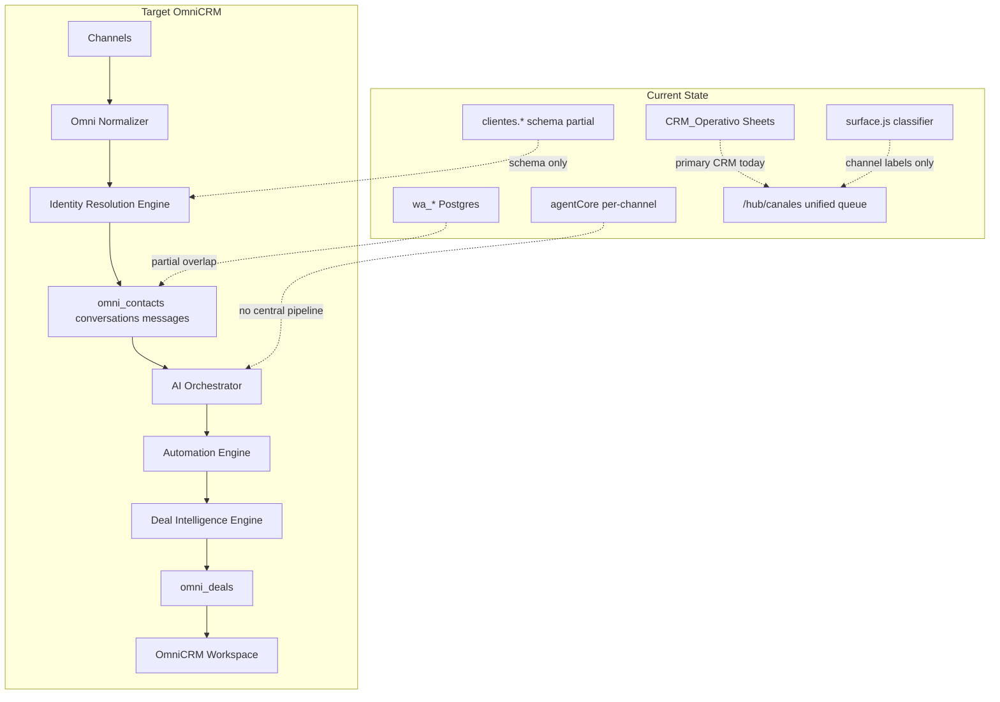

# Phase 8 — OmniCRM Gap Analysis

**Audit:** EXPORT_SEAL::OMNI_HUB_DISCOVERY_MASTER_V1  
**Date:** 2026-06-22  
**Repo SHA:** `d04a7f4`  
**Cross-links:** [01-current-system-map](01-current-system-map.md) · [04-database-map](04-database-map.md) · [09-scorecard](09-scorecard.md)

---

## Target architecture (reference)

```
Channels
  ↓
Omni Normalizer
  ↓
Identity Resolution Engine
  ↓
omni_contacts / omni_conversations / omni_messages
  ↓
AI Orchestrator
  ↓
Automation Engine
  ↓
Deal Intelligence Engine
  ↓
omni_deals
  ↓
OmniCRM Workspace
```

**Evidence (design doc):**

- File: `docs/team/OMNI-HUB-ARCHITECTURE.md`  
  Path: `/Users/matias/calculadora-bmc/docs/team/OMNI-HUB-ARCHITECTURE.md`  
  Lines: 9–36  
  Description: 4-layer topology: Capture → Backends → Aggregator → Frontend.

---

## Current vs target diagram



---

## Capability gap matrix

| Capability | Current State | Target State | Gap | Priority | Complexity | Risk |
|------------|---------------|--------------|-----|----------|------------|------|
| **Channels (capture)** | WA + ML **IMPLEMENTED**; Email **PARTIAL**; IG/FB filter-only | All 5 channels with live inbound | IG/FB webhooks missing; Email no IMAP in-repo | P1 | High | Human gate cm-0 for Meta |
| **Omni Normalizer** | **NOT_FOUND** — per-channel handlers (`index.js`, `wa.js`, `bmcDashboard.js`) | Single normalized event schema → omni_messages | Full normalizer service | P0 | High | Duplicate writes during migration |
| **Identity Resolution Engine** | **PARTIAL** — `clientes.*` migration exists; 2 API routes only | Cross-channel dedup on `integration_uuid`, ml_user_id, wa_phone | Engine + merge logic missing | P0 | High | Contact merge conflicts |
| **omni_contacts** | **DOCUMENTED_ONLY** (`omni-hub-schema.sql`) | Postgres runtime + sync from WA/ML/Sheets | Migration + backfill + dual-write | P0 | High | Data inconsistency window |
| **omni_conversations** | **DOCUMENTED_ONLY**; parallel `wa_conversations` **IMPLEMENTED** | Unified thread model per contact+channel | Schema deploy + WA adapter | P0 | High | wa_* vs omni_* overlap |
| **omni_messages** | **DOCUMENTED_ONLY**; parallel `wa_messages` **IMPLEMENTED** | Immutable message store all channels | Migration + ingest wiring | P0 | High | Message loss if cutover wrong |
| **omni_deals** | **NOT_FOUND**; deal data in Sheets `Monto estimado USD` + Estado | Structured pipeline in Postgres | Table + deal engine | P1 | Medium | Sheets remains source of truth conflict |
| **omni_audit_log** | **NOT_FOUND**; WA has `wa_audit_log`; Sheets has AUDIT_LOG tab | Unified audit across omni entities | Central audit table + triggers | P2 | Medium | Audit fragmentation |
| **AI Orchestrator** | **PARTIAL** — `agentCore` per channel (chat/ml/wa); no omni pipeline | Central orchestrator over omni_messages | No `/api/omni/ai/*`; RAG chat-only | P1 | Medium | Inconsistent AI across channels |
| **Automation Engine** | **PARTIAL** — `wa_rules`, CRM cockpit approval, ML auto-answer | Cross-channel rules on omni events | No `omni_rules` or unified triggers | P1 | Medium | Rule duplication |
| **Deal Intelligence Engine** | **PARTIAL** — Sheets columns + manual CRM stages | AI-driven stage/value on omni_deals | Engine **NOT_FOUND** | P1 | Medium | — |
| **OmniCRM Workspace** | **PARTIAL** — `/hub/canales` (Sheets queue); `/hub/wa-inbox` **NOT_FOUND** | Full omni UI with omni API | wa-inbox missing; no omni REST | P0 | High | UX fragmentation (3 UIs: wa, ml, canales) |
| **Unified ingest API** | **NOT_FOUND** (`/api/unified-crm-ingest` doc only) | Webhook receiver for extension + Meta | Endpoint not implemented | P0 | High | — |
| **Meta IG/FB** | **PARTIAL** — `surface.js` classification | Meta Graph webhooks + send | Full Meta integration | P2 | High | cm-0 human gate |
| **Observability (omni)** | **PARTIAL** — pino logs, WA metrics | End-to-end omni tracing | No omni-specific metrics | P2 | Low | — |

---

## Layer-by-layer analysis

### Layer 1: Channels

| Channel | Current | Target gap |
|---------|---------|------------|
| WhatsApp | Webhook + wa_* + `/hub/wa` | Map to omni normalizer instead of dual storage |
| MercadoLibre | Webhook + Sheets CRM | Same; no omni_contacts link |
| Email | HTTP ingest only | Needs first-class channel + optional in-repo IMAP |
| Instagram | CRM row tagging | Needs Meta webhook + omni_conversations |
| Facebook | CRM row tagging | Needs Messenger webhook + send path |

**Evidence:**

- File: `server/routes/bmcDashboard.js` L3535–3545  
  Description: `sync-all` explicitly skips IG/FB.

### Layer 2: Omni Normalizer

**Current:** **NOT_FOUND**

Each channel writes independently:
- WA → `wa_messages` + Sheets (`server/index.js` L912–950)
- ML → Sheets via `ml-crm-sync.js`
- Email → Sheets via ingest API

**Target:** Single normalized event → omni_messages

**Gap:** Entire normalizer layer absent.

### Layer 3: Identity Resolution

**Current:** **PARTIAL**

- `clientes.customers` + `clientes.customer_identities` schema exists
- Only `GET /api/clientes/customers` routes implemented
- WA uses `phone`/`chat_id`; ML uses ML user id in Sheets observaciones; no cross-link table

**Target:** `omni_contacts` with sparse unique indexes on channel IDs

**Gap:** Resolution engine and runtime tables missing.

### Layer 4: Data model (omni_*)

**Current:** **DOCUMENTED_ONLY**

**Evidence:**

- File: `docs/team/omni-hub-schema.sql`  
  Description: Full DDL exists.

- Runtime: **NOT_FOUND**

**Parallel implemented models creating migration risk:**

| Current table | Overlaps omni |
|---------------|---------------|
| `wa_conversations` | omni_conversations (channel=wa) |
| `wa_messages` | omni_messages |
| CRM_Operativo rows | omni_deals (implicit) |
| `clientes.customers` | omni_contacts |

### Layer 5: AI Orchestrator

**Current:** **PARTIAL**

- `agentCore.callAgentOnce` shared but invoked per-channel
- `suggest-response` for CRM; `waEnricher` for WA; `mlAutoAnswer` for ML
- No single orchestrator reading omni_messages queue

**Target:** AI Orchestrator over unified message stream

**Gap:** No omni-aware orchestration layer.

### Layer 6: Automation Engine

**Current:** **PARTIAL**

- `wa_rules` (Postgres) — WA only
- CRM cockpit approval workflow — Sheets only
- ML auto-mode — file-based `.ml-automode.json`

**Target:** Cross-channel automation on omni events

**Gap:** No unified rules engine.

### Layer 7: Deal Intelligence

**Current:** **PARTIAL**

- Sheets: `Monto estimado USD`, `Estado`, `Fecha próxima acción`
- No `omni_deals` table

**Target:** `omni_deals` with stage pipeline

**Gap:** Structured deal model and intelligence engine absent.

### Layer 8: OmniCRM Workspace

**Current:** **PARTIAL**

| UI | Data source | Status |
|----|-------------|--------|
| `/hub/canales` | Sheets unified-queue | **IMPLEMENTED** |
| `/hub/wa` | Postgres wa_* + API | **IMPLEMENTED** |
| `/hub/ml` | Sheets ml-queue | **IMPLEMENTED** |
| `/hub/ml-manager` | ML API (partial) | **PARTIAL** |
| `/hub/wa-inbox` | — | **NOT_FOUND** |
| `/hub/omni` | — | **NOT_FOUND** |

**Gap:** Three separate workspaces; no omni-native UI.

---

## Documentation vs code drift

| Documented | Runtime | Status |
|------------|---------|--------|
| `POST /api/unified-crm-ingest` | NOT_FOUND | **DOCUMENTED_ONLY** |
| `GET /api/omni/conversations` | NOT_FOUND | **DOCUMENTED_ONLY** |
| `POST /webhooks/meta` | NOT_FOUND | **DOCUMENTED_ONLY** |
| `npm run omni:migrate` | NOT_FOUND | **DOCUMENTED_ONLY** |
| `server/lib/omniDb.js` | NOT_FOUND | **DOCUMENTED_ONLY** |

**Evidence:**

- File: `docs/team/OMNI-HUB-ARCHITECTURE.md`  
  Lines: 25–28  
  Description: Planned routes not present in `server/routes/`.

---

## Risk summary

| Risk | Severity | Evidence |
|------|----------|----------|
| Dual-write period (wa_* + omni_*) | High | Both schemas would coexist during migration |
| Sheets vs Postgres CRM divergence | High | CRM_Operativo remains commercial truth today |
| Open AI endpoints (suggest-response) | Medium | `bmcDashboard.js` L2311 — no auth |
| Meta IG/FB blocked on human gate | High | No Meta app config in `server/config.js` |
| ML Manager UI calls missing APIs | Low | Frontend/backend contract drift |

---

## Gap priority rollup

| Priority | Count | Focus |
|----------|-------|-------|
| P0 | 7 | omni_* schema, normalizer, identity resolution, workspace |
| P1 | 5 | AI orchestrator, automation, deals, email channel |
| P2 | 3 | IG/FB, omni audit, observability |

**Note:** This document records gaps only. No implementation proposals.
