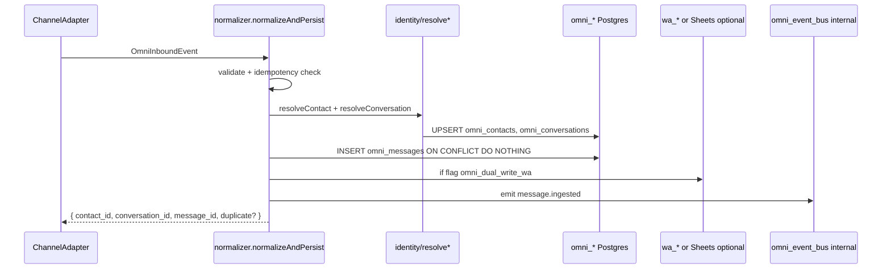
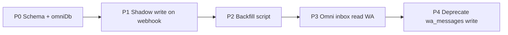
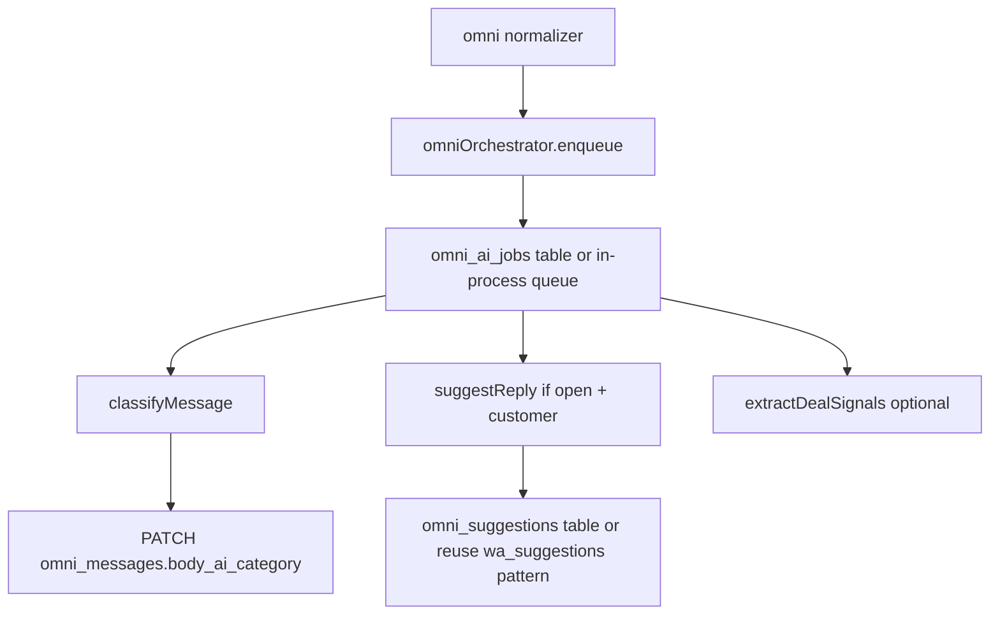

# Architecture Review — Omni Hub

**Date:** 2026-06-22  
**Basis:** [Discovery audit](README.md) (SHA `d04a7f4`) + [`omni-hub-schema.sql`](../team/omni-hub-schema.sql) + [`OMNI-HUB-ARCHITECTURE.md`](../team/OMNI-HUB-ARCHITECTURE.md)  
**Scope:** Design review only — no implementation in this document.

---

## 0. Executive summary

The repo today runs **three parallel models** for omnichannel:

| Model | Role today | Keep? |
|-------|------------|-------|
| `wa_*` Postgres | WA runtime (messages, suggestions, quotes) | Yes — WA-specific ops |
| `CRM_Operativo` Sheets | Commercial truth, ML/WA queues, col AH | Yes — short/medium term |
| `clientes.*` Postgres | 360 customer graph (schema only partially wired) | Bridge, not replace omni |

**Recommendation:** Introduce `omni_*` as the **operational inbox + message graph**, not as immediate replacement for Sheets commercial records or WA Pro features. Migrate in **shadow → backfill → read flip → write flip** phases with feature flags.

**Non-negotiables:**

1. **Idempotent ingest** — every channel event keyed by `(channel, channel_message_id)`.
2. **Dual-write window** — never cut over reads before backfill verification.
3. **Sheets stays authoritative for money** until `omni_deals` ↔ CRM row sync is proven.
4. **Reuse `agentCore`** — do not build a second AI stack (aligns with IP-3 in OMNI-HUB-ARCHITECTURE).

---

## 1. Omni Normalizer

### 1.1 Purpose

Single ingress contract that converts **any channel payload** into one canonical event, then persists via Identity Resolution → `omni_*`.

### 1.2 Canonical envelope

```typescript
// server/lib/omni/types.js — conceptual
type OmniInboundEvent = {
  source: "wa_webhook" | "wa_extension" | "ml_webhook" | "ml_sync" | "email_ingest" | "unified_crm_ingest" | "manual";
  channel: "wa" | "ml" | "email" | "instagram" | "facebook" | "omnicrm";
  idempotency_key: string;           // e.g. "wa:msg:wamid.xxx"
  occurred_at: string;               // ISO8601
  contact_hint: {
    wa_phone?: string;               // E.164
    ml_user_id?: number;
    email?: string;
    name?: string;
    chrome_ext_contact_id?: string;
  };
  conversation_hint: {
    channel_conversation_id: string; // chat_id | question_id | thread_id
    subject?: string;
  };
  message: {
    sender: "customer" | "agent" | "bot";
    sender_id?: string;
    body: string;
    attachments?: object[];
    metadata: object;              // raw channel fields
  };
  side_effects?: {
    crm_sheet_row?: number;          // if already linked
    wa_chat_id?: string;             // legacy bridge
  };
};
```

**Evidence for current fragmentation:**

- WA webhook: `server/index.js` L812–962 (inline Postgres + Sheets)
- ML webhook: `server/index.js` L533–603 → `syncMLCRM`
- Email: `bmcDashboard.js` L2626+ (Sheets only)
- No shared type — **NOT_FOUND** per [08-omni-gap-analysis](08-omni-gap-analysis.md)

### 1.3 Module layout

```
server/lib/omni/
  types.js              # OmniInboundEvent, enums
  normalizer.js         # normalizeAndPersist(event) — single entry
  adapters/
    waWebhook.js        # Meta POST body → event
    waExtension.js      # /api/wa/ingest batch → events[]
    mlWebhook.js          # ML notification → event (or trigger sync)
    mlCrmRow.js           # CRM_Operativo row → event (backfill)
    emailIngest.js        # ingest-email payload → event
    unifiedCrmIngest.js   # extension webhook → event
  identity/
    resolveContact.js     # contact_hint → omni_contacts.id
    resolveConversation.js
  omniDb.js               # SQL helpers
  outbox.js               # optional: omni_outbox for async workers
```

### 1.4 Processing pipeline



### 1.5 Idempotency

Add table (not in current schema — **extend DDL**):

```sql
CREATE TABLE omni_ingest_dedup (
  idempotency_key VARCHAR(512) PRIMARY KEY,
  message_id UUID REFERENCES omni_messages(id),
  created_at TIMESTAMPTZ NOT NULL DEFAULT now()
);
```

Map keys:

| Channel | Key pattern |
|---------|-------------|
| WA | `wa:msg:{msg_id}` |
| ML | `ml:question:{question_id}` or `ml:answer:{answer_id}` |
| Email | `email:{message_id_hash}` |

### 1.6 Integration points (replace gradually)

| Current handler | Adapter | Flag |
|-----------------|---------|------|
| `POST /webhooks/whatsapp` | `waWebhook.js` | `OMNI_WA_SHADOW_WRITE=1` |
| `POST /api/wa/ingest` | `waExtension.js` | same |
| `POST /webhooks/ml` | triggers `mlWebhook.js` + existing sync | `OMNI_ML_SHADOW_WRITE=1` |
| `POST /api/crm/ingest-email` | `emailIngest.js` | `OMNI_EMAIL_SHADOW_WRITE=1` |
| New | `POST /api/unified-crm-ingest` | HMAC + normalizer |

**Do not** remove inline handlers in PR-1; wrap with `if (config.omniXShadowWrite) await normalizeAndPersist(...)`.

---

## 2. `omni_contacts` design

### 2.1 Role

**Operational contact node** for inbox threading — one row per resolved person/business **in the omni graph**.

### 2.2 Relationship to `clientes.customers`

| Aspect | `omni_contacts` | `clientes.customers` |
|--------|-----------------|----------------------|
| Purpose | Inbox + cross-channel IDs | 360 view, scoring, automation |
| Schema | `public.omni_*` (proposed) | `clientes.*` (exists) |
| API | `/api/omni/contacts` | `/api/clientes/customers` (partial) |

**Recommendation — bridge, don't merge yet:**

```sql
ALTER TABLE omni_contacts ADD COLUMN clientes_customer_id UUID
  REFERENCES clientes.customers(id) ON DELETE SET NULL;
CREATE INDEX omni_contacts_clientes_customer_id
  ON omni_contacts(clientes_customer_id) WHERE clientes_customer_id IS NOT NULL;
```

Identity Resolution order:

1. Lookup sparse key: `wa_phone`, `ml_user_id`, `chrome_ext_contact_id`
2. Else lookup `clientes.customer_identities (channel, external_id)`
3. Else create `omni_contacts` + optional async job to create `clientes.customers`

### 2.3 `integration_uuid` strategy

Deterministic, human-debuggable:

| Channel | Pattern | Example |
|---------|---------|---------|
| WA | `wa:+59899123456` | E.164 normalized |
| ML | `ml:123456789` | ML buyer id |
| Email | `email:sha256(lower(email))` | Stable hash |
| Extension | `ext:{chrome_ext_contact_id}` | As-is |
| Fallback | `omni:uuid` | New contact |

**Rule:** `integration_uuid` is immutable; channel IDs populate sparse columns on merge.

### 2.4 Merge policy

When two keys collide (same phone, different ML id):

| Field | Winner |
|-------|--------|
| `name` | Non-empty; prefer most recent `updated_at` |
| `email` | Verified > unverified; provenance in `properties` |
| `ml_user_id` / `wa_phone` | Union onto survivor row |
| Loser row | Soft-delete: `merged_into_contact_id` (new column) + audit log |

Use `clientes.customer_field_provenance` pattern for conflict audit — already designed in `20260508000001_clientes_360_init.sql`.

### 2.5 Schema adjustments vs `omni-hub-schema.sql`

| Change | Reason |
|--------|--------|
| Add `email` channel to CHECK constraints | Email channel is PARTIAL today |
| Add `merged_into_contact_id UUID` | Non-destructive merges |
| Add `clientes_customer_id UUID` FK | Bridge to 360 |
| Relax `body ~ '\S'` on messages | Allow attachment-only messages |

---

## 3. `omni_conversations` design

### 3.1 Threading model

**One row = one native thread per contact per channel.**

| Channel | `channel_conversation_id` | `subject` |
|---------|---------------------------|-----------|
| WA | `chat_id` (Meta) | contact name or last preview |
| ML | `question_id` | item title / first line |
| Email | `thread_id` or `Message-ID` root | Subject line |
| IG/FB | `thread_id` (future) | — |

Unique constraint (already in schema):

```sql
UNIQUE (contact_id, channel, channel_conversation_id)
```

### 3.2 Status mapping

| Source | omni `status` |
|--------|---------------|
| `wa_conversations.status` | map: `new`→`open`, `closed`→`archived` |
| CRM Estado (Sheets) | map: Pendiente→`pending_response`, Cerrado→`resolved` |
| ML unanswered | `open` |
| ML answered | `resolved` |

Store raw status in `properties.legacy_status` during migration.

### 3.3 Tags and priority

- **Tags:** propagate from WA intent (`waEnricher.classifyIntent`), CRM observaciones, manual operator tags.
- **Priority:** default 1; 3 if `monto_estimado > 5000` or VIP tag (from Sheets o manual).

### 3.4 Links to legacy systems

```json
// omni_conversations.properties (JSONB)
{
  "legacy": {
    "wa_chat_id": "59899...@s.whatsapp.net",
    "crm_sheet_row": 142,
    "ml_item_id": "MLU123",
    "ml_question_id": 987654
  }
}
```

Enables `/hub/canales` to deep-link to `/hub/wa` or CRM row during transition.

### 3.5 Read models

Keep schema views; add API-facing DTO:

```
GET /api/omni/conversations?channel=&status=&q=&cursor=
→ { items: [{ id, contact, channel, subject, last_message, unread_count, legacy_links }] }
```

Unread count: `COUNT(omni_messages WHERE read_at IS NULL AND sender='customer')`.

---

## 4. Migration strategy: WA → Omni

### 4.1 What migrates vs what stays in `wa_*`

| Data | Target | Stays in wa_* |
|------|--------|---------------|
| Messages | `omni_messages` | Mirror optional during shadow |
| Conversations | `omni_conversations` | `wa_conversations` until flip |
| AI suggestions | — | **Yes** (`wa_suggestions`) |
| Quotes | — | **Yes** (`wa_quotes`, quote runner) |
| Operators, settings, SLA | — | **Yes** (WA Pro) |
| Consent, followups | — | **Yes** |

WA Cockpit remains the **WA operations console**; Omni becomes the **cross-channel inbox**.

### 4.2 Phases



| Phase | Behavior | Rollback |
|-------|----------|----------|
| **P0** | Migrations applied; no runtime | Drop schema |
| **P1** | Webhook writes `wa_*` + omni (flag) | Flag off |
| **P2** | `npm run omni:backfill-wa` from `wa_messages` | Delete omni rows by source tag |
| **P3** | `/hub/omni?channel=wa` reads omni | Feature flag per user |
| **P4** | Stop inserting `wa_messages` (read-only archive) | Re-enable dual write |

### 4.3 Backfill mapping

```javascript
// wa_messages → OmniInboundEvent (batch)
{
  source: "wa_backfill",
  channel: "wa",
  idempotency_key: `wa:msg:${row.msg_id}`,
  contact_hint: { wa_phone: normalizeE164(row.phone) },
  conversation_hint: { channel_conversation_id: row.chat_id },
  message: {
    sender: row.direction === "in" ? "customer" : "agent",
    body: row.text,
    metadata: { wa: { msg_id: row.msg_id, raw: row.raw } },
  },
}
```

### 4.4 Verification gates

Before P3:

- Row count: `wa_messages` ≈ `omni_messages` (channel=wa) ± duplicates
- Sample 50 chats: last message body matches
- `lead_sheet_row` preserved in `conversation.properties.legacy.crm_sheet_row`

---

## 5. Migration strategy: ML → Omni

### 5.1 Asymmetry vs WA

ML has **no Postgres message store** — primary queue is **Sheets CRM_Operativo** synced by `ml-crm-sync.js`.

Omni ML migration = **CRM rows + webhook events**, not `wa_messages`-style backfill.

### 5.2 Phases

| Phase | Action |
|-------|--------|
| **M1** | On `syncMLCRM` / webhook: emit `OmniInboundEvent` per new unanswered question |
| **M2** | Backfill from CRM_Operativo rows where origen contains ML / Q:NNN |
| **M3** | `GET /api/omni/conversations?channel=ml` replaces `GET /api/crm/cockpit/ml-queue` for new UI |
| **M4** | Keep Sheets write on sync (dual-write); omni is read-optimized layer |

### 5.3 ML event mapping

```javascript
{
  channel: "ml",
  idempotency_key: `ml:question:${questionId}`,
  contact_hint: { ml_user_id: buyerId, name: buyerNickname },
  conversation_hint: {
    channel_conversation_id: String(questionId),
    subject: itemTitle,
  },
  message: {
    sender: "customer",
    body: questionText,
    metadata: { ml: { question_id, item_id, status } },
  },
  side_effects: { crm_sheet_row: rowNum },
}
```

### 5.4 Outbound path

Keep existing send-approved → ML Answers API (`bmcDashboard.js` L3191–3228).

Add: on successful send, insert `omni_messages` sender=`agent` with metadata.ml.answer_id.

**Do not** move ML OAuth or token store — stays in `mercadoLibreClient.js`.

---

## 6. AI Orchestrator

### 6.1 Problem today

| Path | Trigger | Brain |
|------|---------|-------|
| Chat UI | `agentChat.js` | agentCore + tools |
| CRM suggest | `suggestResponse.js` | agentCore |
| WA enricher | `waEnricherWorker` | agentCore + heuristics |
| ML auto-answer | `mlAutoAnswer.js` | separate pipeline |

No shared queue or unified classification taxonomy across channels.

### 6.2 Target design

**Event-driven orchestrator** subscribed to `message.ingested`:



### 6.3 Job table (new)

```sql
CREATE TABLE omni_ai_jobs (
  id UUID PRIMARY KEY DEFAULT gen_random_uuid(),
  message_id UUID NOT NULL REFERENCES omni_messages(id),
  job_type VARCHAR(50) NOT NULL,  -- classify | suggest | extract_deal | embed
  status VARCHAR(20) NOT NULL DEFAULT 'pending',
  result JSONB,
  error TEXT,
  created_at TIMESTAMPTZ NOT NULL DEFAULT now(),
  completed_at TIMESTAMPTZ
);
CREATE INDEX omni_ai_jobs_status ON omni_ai_jobs(status) WHERE status = 'pending';
```

### 6.4 Reuse `agentCore`

| Job | agentCore usage |
|-----|-----------------|
| classify | `callAgentOnce` taskKey=`classify` or extend waEnricher taxonomy to omni |
| suggest | channel from conversation; same prompts as suggestResponse |
| extract_deal | structured JSON output → Deal Intelligence |

**Internal endpoint (IP-3):**

```
POST /api/internal/omni/ai/run
Authorization: Bearer API_AUTH_TOKEN
{ job_type, message_id, channel, context }
```

Connector / extension calls this — never duplicate Claude chain.

### 6.5 Classification taxonomy

Unify on schema enum + extend:

```
product | order | issue | inquiry | complaint | feedback | spam |
cotizacion | consulta_tecnica | objecion | follow_up | cierre | other
```

Map WA intents (`waEnricher.js` L12–17) → `body_ai_category` superset.

### 6.6 Worker

- Start as **in-process worker** (same pattern as `waEnricherWorker.js` in `server/index.js` L1209).
- Gate: `OMNI_AI_ORCHESTRATOR_ENABLED=1`.
- Rate limit per channel to control cost.

---

## 7. Automation Engine

### 7.1 Problem today

| System | Scope |
|--------|-------|
| `wa_rules` | WA only (`015_wa_rules.sql`) |
| CRM cockpit approval | Sheets rows |
| ML auto-mode | `.ml-automode.json` file |
| `clientes.automation_rules` | Schema exists, not wired to omni |

### 7.2 Target: `omni_automation_rules`

Generalize WA rules:

```sql
CREATE TABLE omni_automation_rules (
  id UUID PRIMARY KEY DEFAULT gen_random_uuid(),
  name TEXT NOT NULL,
  enabled BOOLEAN NOT NULL DEFAULT true,
  priority INT NOT NULL DEFAULT 100,
  trigger_event VARCHAR(50) NOT NULL,  -- message.ingested | conversation.status_changed | deal.stage_changed
  conditions JSONB NOT NULL,           -- { channel, body_ai_category, tags, priority_gte, ... }
  actions JSONB NOT NULL,              -- [{ type, params }]
  created_at TIMESTAMPTZ NOT NULL DEFAULT now(),
  updated_at TIMESTAMPTZ NOT NULL DEFAULT now()
);
```

### 7.3 Action types (v1)

| Action | Description |
|--------|-------------|
| `tag_conversation` | Add tags[] |
| `set_priority` | Set priority |
| `assign_owner` | Set owner_agent_id on conversation or deal |
| `enqueue_ai_job` | suggest / classify |
| `create_deal` | Insert omni_deals stage=lead |
| `sync_crm_row` | Update Sheets via existing bmcDashboard helpers |
| `webhook_outbound` | Reuse `waWebhooks.js` pattern |

### 7.4 Engine flow

```
on omni_event → load rules WHERE trigger match → sort by priority
→ evaluate conditions (JSON DSL, same spirit as waRoutingRules)
→ execute actions (sequential, idempotent action_id in omni_automation_runs)
```

Migrate existing `wa_rules` rows via one-time SQL insert into `omni_automation_rules` with `conditions.channel = 'wa'`.

---

## 8. Deal Intelligence Engine

### 8.1 Problem today

Deal state lives in **Sheets** (`Monto estimado USD`, `Estado`, `Fecha próxima acción`) — no Postgres deal graph.

### 8.2 Target

`omni_deals` as **operational pipeline** with optional Sheets sync.

### 8.3 Stage machine

```
lead → qualified → proposal → negotiation → closed_won | closed_lost
```

| Trigger | Transition |
|---------|------------|
| New cotización intent + monto | → qualified |
| Quote link saved (col AH) | → proposal |
| Agent marks sent | → negotiation |
| CRM Estado = Cerrado ganado | → closed_won |

### 8.4 Intelligence jobs

After `message.ingested` with category `cotizacion`:

1. Extract `value_usd`, `title`, `expected_close_date` via agentCore structured output
2. Upsert `omni_deals` linked to `source_conversation_id`
3. Async sync to CRM row (dual-write): PATCH monto/estado

### 8.5 Sheets bridge

```json
// omni_deals.properties
{ "crm": { "sheet_id": "...", "row": 142, "last_sync_at": "..." } }
```

**Rule:** Conflicts resolve **Sheets wins for money** until explicit flip flag `OMNI_DEALS_SHEETS_AUTHORITY=0`.

### 8.6 API

```
GET  /api/omni/deals?stage=&owner=
PATCH /api/omni/deals/:id  { stage, value_usd, owner_agent_id }
POST /api/omni/deals/:id/sync-crm  → write Sheets row
```

---

## 9. Omni Workspace (frontend)

### 9.1 Problem today

| Route | Data | UX issue |
|-------|------|----------|
| `/hub/canales` | Sheets unified-queue | No real-time; no thread view |
| `/hub/wa` | wa_* API | WA-only, deep WA Pro |
| `/hub/ml` | Sheets ml-queue | ML-only |
| `/hub/wa-inbox` | NOT_FOUND | Planned stub only |
| `/hub/ml-manager` | PARTIAL | Missing backend routes |

Three workspaces, no shared contact graph UI.

### 9.2 Target IA

**Option A (recommended):** Evolve `/hub/canales` → **Omni Workspace** in place (less route churn).

```
/hub/canales                    → Omni Home (inbox all channels)
/hub/canales/contacts/:id       → Contact 360 sidebar
/hub/canales/deals              → Pipeline kanban (Phase 4)
/hub/wa                         → WA Pro (settings, quotes, operators) — unchanged
/hub/ml-manager                 → ML ops dashboard — unchanged scope
```

**Option B:** New `/hub/omni/*` — cleaner but duplicates navigation.

### 9.3 Layout

```
┌─────────────────────────────────────────────────────────────┐
│ Channel filters: All | WA | ML | Email | IG | FB   [Search] │
├──────────────┬──────────────────────────────────────────────┤
│ Conversation │ Thread view                                  │
│ list         │ ├─ messages (omni_messages)                  │
│ (virtualized)│ ├─ AI suggestions panel                      │
│              │ ├─ deal card (omni_deals)                    │
│              │ └─ reply composer → channel outbound adapter │
├──────────────┴──────────────────────────────────────────────┤
│ Contact sidebar: omni_contacts + clientes link + CRM row    │
└─────────────────────────────────────────────────────────────┘
```

### 9.4 Tech stack

- Reuse `useCockpitOperatorAuth` + `RequireGrant module="canales"`.
- TanStack Query hooks: `useOmniConversations`, `useOmniMessages`, `useOmniDeal`.
- SSE: extend `panelin.js` pattern or `GET /api/omni/events` for `conversation.updated`.
- Real-time WA: optional fallback to existing `/api/wa/messages` until omni flip.

### 9.5 Migration UX

Feature flag `VITE_OMNI_INBOX=1`:

- `false` → current Sheets queue (zero regression)
- `true` → omni API for list/thread; keep "Open in CRM row" + "Open in WA Cockpit" links via `properties.legacy`

---

## 10. Roadmap — executable PRs

Each PR: **≤500 LOC**, one concern, `npm run gate:local` green, feature-flagged.

### Track A — Foundation (P0)

| PR | Title | Deliverables | Depends |
|----|-------|--------------|---------|
| **A1** | `feat(omni): postgres migrations package` | `server/migrations/omni/001_core.sql` from schema + dedup + bridge columns; `npm run omni:migrate`; `omniDb.js` pool + health | — |
| **A2** | `feat(omni): inbound event types + validator` | `server/lib/omni/types.js`, Zod schema, unit tests | A1 |
| **A3** | `feat(omni): identity resolution engine` | `resolveContact.js`, `resolveConversation.js`, merge + audit | A1, A2 |
| **A4** | `feat(omni): normalizer core` | `normalizer.js` idempotent persist; `GET /api/omni/health` | A3 |

### Track B — WA migration

| PR | Title | Deliverables | Depends |
|----|-------|--------------|---------|
| **B1** | `feat(omni): wa webhook adapter shadow write` | `adapters/waWebhook.js`; hook in `index.js`; flag `OMNI_WA_SHADOW_WRITE` | A4 |
| **B2** | `feat(omni): wa extension ingest adapter` | `adapters/waExtension.js`; hook in `wa.js` ingest | B1 |
| **B3** | `chore(omni): backfill wa_messages → omni` | `scripts/omni-backfill-wa.mjs` + dry-run; report JSON | B1 |
| **B4** | `test(omni): wa parity verification` | Offline test: count + sample hash compare | B3 |

### Track C — ML migration

| PR | Title | Deliverables | Depends |
|----|-------|--------------|---------|
| **C1** | `feat(omni): ml webhook + sync adapter` | Hook post-`syncMLCRM`; shadow flag | A4 |
| **C2** | `chore(omni): backfill CRM ML rows` | `scripts/omni-backfill-ml-crm.mjs` from Sheets | C1 |
| **C3** | `feat(omni): ml outbound message mirror` | On send-approved success → omni_messages agent row | C1 |

### Track D — Omni API

| PR | Title | Deliverables | Depends |
|----|-------|--------------|---------|
| **D1** | `feat(omni): conversations list API` | `GET /api/omni/conversations` + cursor pagination; requireGrant canales:read | A4 |
| **D2** | `feat(omni): messages + mark read API` | `GET /api/omni/conversations/:id/messages`, `PATCH .../read` | D1 |
| **D3** | `feat(omni): reply API` | `POST /api/omni/conversations/:id/reply` → dispatches to WA/ML adapter | D2, B1, C1 |
| **D4** | `feat(omni): unified-crm-ingest webhook` | `POST /api/unified-crm-ingest` HMAC; extension config doc | A4 |

### Track E — AI + Automation

| PR | Title | Deliverables | Depends |
|----|-------|--------------|---------|
| **E1** | `feat(omni): ai job queue + worker` | `omni_ai_jobs` table; worker; classify job | D2 |
| **E2** | `feat(omni): suggest job on ingest` | Reuse agentCore; store suggestions (new `omni_suggestions` or extend pattern) | E1 |
| **E3** | `feat(omni): automation rules engine v1` | `omni_automation_rules` + evaluator; migrate wa_rules | E1 |
| **E4** | `feat(omni): internal ai endpoint` | `POST /api/internal/omni/ai/run` for connector IP-3 | E1 |

### Track F — Deals

| PR | Title | Deliverables | Depends |
|----|-------|--------------|---------|
| **F1** | `feat(omni): deals CRUD API` | `GET/PATCH /api/omni/deals`; stage validation | A1 |
| **F2** | `feat(omni): deal extract job` | AI extract from cotización messages | E1, F1 |
| **F3** | `feat(omni): deals ↔ Sheets sync` | `sync-crm` action; dual-write monto/estado | F1 |

### Track G — Workspace UI

| PR | Title | Deliverables | Depends |
|----|-------|--------------|---------|
| **G1** | `feat(ui): omni conversation list panel` | Replace/ augment canales queue when `VITE_OMNI_INBOX=1` | D1 |
| **G2** | `feat(ui): omni thread view + reply` | Thread + composer wired to D2/D3 | G1 |
| **G3** | `feat(ui): contact sidebar + legacy links` | Contact card + links to /hub/wa + CRM row | G2 |
| **G4** | `feat(ui): deals pipeline kanban` | `/hub/canales/deals` optional tab | F1, G1 |

### Track H — Hardening

| PR | Title | Deliverables | Depends |
|----|-------|--------------|---------|
| **H1** | `fix(security): auth on suggest-response` | requireCrmCockpitRead minimum | — |
| **H2** | `feat(omni): audit log triggers` | DB triggers → `omni_audit_log` | A1 |
| **H3** | `feat(omni): metrics + smoke` | `/api/omni/metrics`; smoke script | D1 |

---

## 11. Suggested execution order (12 weeks)

| Week | PRs | Milestone |
|------|-----|-----------|
| 1 | A1–A4 | Schema live; normalizer accepts events in dev |
| 2 | B1–B2, H1 | WA shadow write in staging |
| 3 | B3–B4, D1 | Backfill verified; list API |
| 4 | C1–C2, D2 | ML in omni; messages API |
| 5 | E1–E2, G1 | AI classify + inbox list UI |
| 6 | D3, G2 | Reply flow end-to-end WA |
| 7 | C3, E3 | ML reply mirror; automation v1 |
| 8 | F1–F2 | Deals in Postgres |
| 9 | F3, G3 | Sheets deal sync; contact sidebar |
| 10 | D4, E4 | Extension ingest + internal AI |
| 11 | G4 | Kanban |
| 12 | H2–H3, B4 flip | Production read flip + observability |

---

## 12. Decisions required before A1

| # | Decision | Options | Recommendation |
|---|----------|---------|----------------|
| 1 | Schema namespace | `public.omni_*` vs `omni.*` schema | `public.omni_*` (match WA flat tables) |
| 2 | vs `clientes.*` | Merge / bridge / ignore | **Bridge** FK |
| 3 | WA messages cutover | Archive wa_messages vs forever dual | Archive after 30d parity |
| 4 | Sheets authority | Omni-first vs Sheets-first | **Sheets-first** for deals 90d |
| 5 | Workspace route | Evolve `/hub/canales` vs new `/hub/omni` | **Evolve canales** |
| 6 | Suggestions storage | New `omni_suggestions` vs reuse `wa_suggestions` | **omni_suggestions** (channel-agnostic) |

---

## 13. Risks and mitigations

| Risk | Mitigation |
|------|------------|
| Dual-write drift | Idempotency keys + nightly reconcile job |
| Contact merge errors | Soft-merge + manual review queue in admin |
| AI cost spike | Rate limits on orchestrator; skip classify for chatter |
| Sheets conflict | Sheets wins policy + audit |
| PR scope creep | Strict flags; no UI until D1 passes contracts |

---

## References

- [01-current-system-map.md](01-current-system-map.md)
- [04-database-map.md](04-database-map.md)
- [08-omni-gap-analysis.md](08-omni-gap-analysis.md)
- [09-scorecard.md](09-scorecard.md)
- [`docs/team/omni-hub-schema.sql`](../team/omni-hub-schema.sql)
- [`docs/team/OMNI-HUB-ARCHITECTURE.md`](../team/OMNI-HUB-ARCHITECTURE.md)
