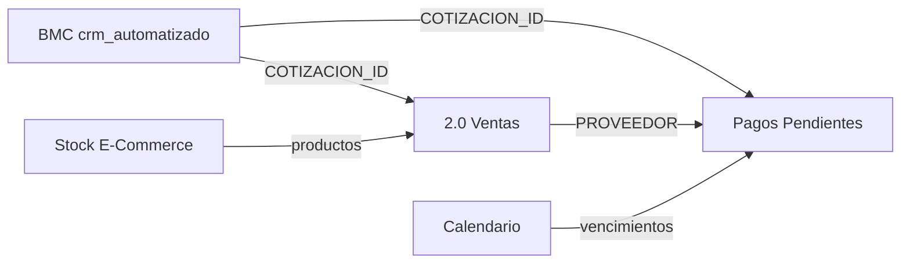

# Sheets Mapping — 5 Workbooks BMC

**Propósito:** Mapa detallado de las 5 hojas de cálculo BMC, columnas, relaciones y rutas API.

**Referencias:** [planilla-inventory.md](planilla-inventory.md), [DASHBOARD-INTERFACE-MAP.md](../bmc-dashboard-modernization/DASHBOARD-INTERFACE-MAP.md).

---

## 1. Inventario de workbooks

| ID | Workbook | Env var | Tab(s) principal(es) | Propósito |
|----|----------|---------|----------------------|-----------|
| `1N-4kyT_uSPSVnu5tMIc6VzFIaga8FHDDEDGcclafRWg` | BMC crm_automatizado | BMC_SHEET_ID | CRM_Operativo, Parametros, AUDIT_LOG | CRM cotizaciones, entregas |
| `1AzHhalsZKGis_oJ6J06zQeOb6uMQCsliR82VrSKUUsI` | Pagos Pendientes 2026 | BMC_PAGOS_SHEET_ID | (primera hoja) | Pagos a proveedores, saldos |
| `1KFNKWLQmBHj_v8BZJDzLklUtUPbNssbYEsWcmc0KPQA` | 2.0 - Ventas | BMC_VENTAS_SHEET_ID | Múltiples (BROMYROS, MONTFRIO, HM-RUBBER, etc.) | Ventas por proveedor |
| `1egtKJAGaATLmmsJkaa2LlCv3Ah4lmNoGMNm4l0rXJQw` | Stock E-Commerce | BMC_STOCK_SHEET_ID | (primera hoja) | Inventario, costos, Shopify |
| `1bvnbYq7MTJRpa6xEHE5m-5JcGNI9oCFke3lsJj99tdk` | Calendario de vencimientos | BMC_CALENDARIO_SHEET_ID | GASTOS, MARZO 2026, etc. | Vencimientos UTE, OSE, BPS, DGI |

---

## 2. Columnas y mapeo canónico

### 2.1 BMC crm_automatizado (CRM_Operativo)

| Columna origen | Campo canónico | Tipo |
|----------------|----------------|------|
| ID | COTIZACION_ID | string |
| Fecha | FECHA_CREACION | date |
| Cliente | CLIENTE_NOMBRE | string |
| Teléfono | TELEFONO | string |
| Ubicación / Dirección | DIRECCION | string |
| Fecha próxima acción | FECHA_ENTREGA | date |
| Estado | ESTADO | string |
| Responsable | ASIGNADO_A | string |
| Consulta / Pedido | NOTAS | string |
| Monto estimado USD | MONTO_ESTIMADO | number |

### 2.2 Pagos Pendientes 2026

| Columna origen | Campo canónico | Tipo |
|----------------|----------------|------|
| FECHA / PLAZO | FECHA_VENCIMIENTO | date |
| PROVEEDOR | PROVEEDOR | string |
| CLIENTE | CLIENTE_NOMBRE | string |
| ÓRDEN / Ped. Nro / N° Pedido | COTIZACION_ID | string |
| Saldo a Proveedor USD / Pago a Proveedor USD | MONTO | number |
| Venta U$S IVA inc. | MONTO (fallback) | number |
| ESTADO | ESTADO_PAGO | string |

Mapper: `mapPagos2026ToCanonical` en bmcDashboard.js.

### 2.3 2.0 - Ventas

| Columna origen | Campo canónico | Tipo |
|----------------|----------------|------|
| ID. Pedido | COTIZACION_ID | string |
| NOMBRE | CLIENTE_NOMBRE | string |
| FECHA ENTREGA | FECHA_ENTREGA | date |
| COSTO SIN IVA / MONTO SIN IVA | COSTO | number |
| GANANCIAS SIN IVA | GANANCIA | number |
| SALDOS | SALDO_CLIENTE | string |
| Pago a Proveedor | PAGO_PROVEEDOR | string |
| FACTURADO | FACTURADO | string |
| Nº FACTURA | NUM_FACTURA | string |
| (nombre tab) | PROVEEDOR | string |

Mapper: `mapVentas2026ToCanonical(row, proveedor)`.

### 2.4 Stock E-Commerce

| Columna origen | Campo canónico | Tipo |
|----------------|----------------|------|
| Codigo / Código | CODIGO | string |
| Producto | PRODUCTO | string |
| Costo m2 U$S + IVA | COSTO_USD | number |
| Margen % | MARGEN_PCT | number |
| Ganancia | GANANCIA | number |
| Venta + IVA / Venta Inm +IVA | VENTA_USD | number |
| Stock / STOCK | STOCK | number |
| Pedido RYC / Pedido 11/08 | PEDIDO_PENDIENTE | number |

Mapper: `mapStockEcommerceToCanonical(row)`.

### 2.5 Calendario de vencimientos

| Columna origen | Uso |
|----------------|-----|
| CONCEPTO | Fila de gasto |
| IMPORTE $ | Monto pesos |
| NO PAGO | Monto no pagado |
| IMPORTE U$S | Monto USD |

Lectura genérica; headerRowOffset: 1.

---

## 3. Relaciones entre workbooks

- **CRM** y **2.0 Ventas** comparten COTIZACION_ID / ID. Pedido.
- **Pagos Pendientes** referencia proveedores (BROMYROS, MONTFRIO, etc.) que también aparecen como tabs en **2.0 Ventas**.
- **Stock E-Commerce** alimenta disponibilidad para ventas.

---

## 4. Rutas API por workbook

| Workbook | Rutas API |
|----------|-----------|
| BMC crm_automatizado | GET /api/cotizaciones, /api/proximas-entregas, /api/coordinacion-logistica, /api/audit, /api/metas-ventas; POST /api/marcar-entregado |
| Pagos Pendientes 2026 | GET /api/kpi-financiero, /api/pagos-pendientes |
| 2.0 - Ventas | GET /api/ventas |
| Stock E-Commerce | GET /api/stock-ecommerce, /api/stock-kpi |
| Calendario vencimientos | GET /api/calendario-vencimientos |

---

## 5. Prerrequisitos

- Compartir los 5 workbooks con `bmc-dashboard-sheets@chatbot-bmc-live.iam.gserviceaccount.com` como Editor.
- Service account JSON en `GOOGLE_APPLICATION_CREDENTIALS`.

---

**Última actualización:** 2026-03-16
