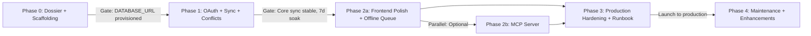

# 04 — Roadmap: Tareas Module Phases 0–4

**Date:** 2026-05-18  
**Status:** Implementation roadmap; timelines based on team capacity (1 senior engineer, 3–4 weeks for Phases 0–1 core; optional Phases 2–4 add 2–3 months).  
**Owner:** Backend (Phase 0–2), Frontend (Phase 2–3), DevOps (Phase 3–4).

---

## Executive Summary

The Tareas module is structured as **5 sequential phases**, each with **binary (pass/fail) exit criteria**, **time estimates**, and **per-phase risks**. **Phase 0 is blocked by a critical operator action: DATABASE_URL provisioning in Cloud Run** — this must be resolved before Phase 1 can begin. Phases 1–3 are on the critical path; Phase 2 MCP server is optional but strategically valuable for Claude agents. Phase 4 is hardening and production ops.

---

## Phase 0: Architecture & Scaffolding (1–2 weeks)

**Objective:** Produce complete dossier + verified Phase 0 scaffolding so implementation can begin immediately without ambiguity.

**Time Estimate:** 8–16 hours (1–2 weeks calendar time)

### Exit Criteria (Binary)

- [ ] **Schema migration is syntactically valid** — `supabase/migrations/20260602000001_tasks_init.sql` applies without errors; `psql` syntax checker passes; all 7 tables created (task_lists, tasks, oauth_tokens, oauth_state, sync_log, sync_conflicts, identity.modules has "tareas" seed)
- [ ] **No plain-text secrets in migration or code** — grep confirms no `client_secret`, `refresh_token`, or `access_token` in migration or route stubs
- [ ] **Backend route stubs are valid Express routers** — `server/routes/tasks.js`, `tasksOAuth.js`, `tasksSync.js` each export `export default router`; no business logic, but middleware structure is correct (`requireUser` imported from `server/lib/identityAuth.js`)
- [ ] **Frontend stubs are valid React components** — `src/components/hub/tasks/TasksModule.jsx` exports default component; hooks (`useTasks.js`, `useTasksSync.js`) export functions; no `npm install` executed
- [ ] **All 6 docs exist and cross-reference** — 00-feasibility.md, 01-architecture.md, 02-mcp-server.md, 03-frontend.md, 04-roadmap.md (this file), 05-decisions.md all have internal markdown links `[[file-name.md]]`
- [ ] **Every claim is labeled** — all docs contain at least one [HECHO CONFIRMADO], one [INFERENCIA], one [DUDA ABIERTA]
- [ ] **Mermaid C4 diagram is syntactically valid** — 01-architecture.md C4 diagram compiles without errors
- [ ] **↗ CRITICAL BLOCKER: DATABASE_URL is provisioned in Cloud Run** — [HECHO CONFIRMADO] this is NOT yet done; **OPERATOR ACTION REQUIRED** before Phase 1 begins (see Blockers § below)

### Artifacts

- **6 documentation files** in `docs/hub-tasks-module/` ✅ (in progress)
- **1 database migration** `supabase/migrations/20260602000001_tasks_init.sql` (ready to write)
- **3 backend stubs** in `server/routes/` (tasks.js, tasksOAuth.js, tasksSync.js) (ready to write)
- **3 frontend stubs** in `src/components/hub/tasks/` (TasksModule.jsx, hooks/useTasks.js, hooks/useTasksSync.js) (ready to write)
- **1 demo artifact** in `docs/hub-tasks-module/demo/` (TBD: Figma, Storybook, or live HTML; flagged as [DUDA ABIERTA] in 03-frontend.md)

### Risks (Phase 0)

| Risk | Likelihood | Impact | Mitigation |
|------|------------|--------|-----------|
| Claim collision with existing identity module pattern | Low | Medium (refactor schema references) | Cross-check against identity.modules table + ALL_MODULES constant in server/lib/identityAuth.js; test slug registration in local schema |
| Mermaid diagram syntax invalid (hidden until deployment) | Low | Low (documentation-only, no code impact) | Validate diagram in Mermaid Live Editor before committing |
| Demo artifact too vague; implementation team unsure what "done" looks like | Medium | Medium (Phases 1–2 misalignment) | Specify artifact medium (Figma prototype, Storybook, or live demo.html) in 05-decisions.md; include interactive conflict resolver flow |

### Phase 0 → Phase 1 Transition Gate

**BLOCKER: DATABASE_URL Provisioning**

[HECHO CONFIRMADO] DATABASE_URL is **not yet set in Cloud Run** (per CLAUDE.md line 124). This is a known operator action that blocks **ALL database-backed routes** (tasks.js, tasksOAuth.js, tasksSync.js) from reaching Supabase.

**Required operator action:**
1. Ensure `DATABASE_URL` is set in Cloud Run service `panelin-calc` environment (secret manager reference or inline)
2. Verify `supabase/migrations/20260601000004_identity_init.sql` and earlier migrations have been applied to the Supabase project (they establish identity.users table that Tasks schema FKs to)
3. Run Phase 0 migration: `npx supabase migration deploy` (local dev) and verify tables exist

**Owner:** DevOps / Cloud Run Operator (not implementation team)

**Sign-off required before Phase 1 begins.**

---

## Phase 1: OAuth + Sync Engine + Conflict Resolution (3–4 weeks)

**Objective:** Implement core Google Tasks integration — OAuth token lifecycle, bidirectional sync, and human-mediated conflict resolution.

**Time Estimate:** 60–80 hours (3–4 weeks calendar time)

### Exit Criteria (Binary)

#### OAuth PKCE Flow

- [ ] **User can complete OAuth consent flow** — Navigate to `GET /auth/tasks/init`, redirected to Google consent screen, consent granted, redirected back to `GET /auth/tasks/callback?code=X&state=Y`, token stored encrypted in `tasks.oauth_tokens`
- [ ] **Access token is refreshed on 401** — Make API call with expired token, server refreshes token via `POST https://oauth2.googleapis.com/token`, retry succeeds, new token stored
- [ ] **Revoked token is handled gracefully** — User revokes consent in Google Account settings, next MCP/API call returns `{ error: "auth_revoked", action: "reauthorize" }`, user sees reconnect link, no crash

#### Sync Engine (Pull Direction: Google → HUB)

- [ ] **Cloud Scheduler cron fires every 60 seconds** — `/sync/google-tasks/pull` endpoint logs trigger; verify in Cloud Logging
- [ ] **HMAC verification passes** — Cloud Scheduler signs request with shared secret (see 01-architecture.md); server validates signature before processing
- [ ] **updatedMin is tracked per user** — Each sync run stores `lastSync` timestamp in `sync_log`; next run uses `updatedMin=lastSync` (RFC 3339) to fetch only changed tasks
- [ ] **nextPageToken pagination works** — Large task list (>100 items) is fetched in batches; all tasks eventually appear in HUB
- [ ] **Conflict is detected and recorded** — User edits task in both Google Tasks AND HUB simultaneously; sync finds conflict during upsert; row inserted in `sync_conflicts` table with `conflictType: "modify_both"`, `resolution: null`
- [ ] **Sync completes within 30 seconds under normal load** — Monitor `mcp_request_duration_ms` p99; typical sync (50 tasks) < 2s

#### Mutation Routes (Push Direction: HUB → Google)

- [ ] **Create task: POST /api/tasks/lists/:listId/tasks** — User submits form; task created in HUB (optimistic update), POSTed to Google API, response merged back, UI reflects Google ID + updated_at
- [ ] **Update task: PATCH /api/tasks/lists/:listId/tasks/:taskId** — User edits title/due/status in HUB; server PATCHes Google Tasks API; sync log records mutation timestamp
- [ ] **Delete task: DELETE /api/tasks/lists/:listId/tasks/:taskId** — User deletes from HUB; soft-delete flag set in HUB; Google Task moved to trash (PATCH with status=completed, not hard-delete)
- [ ] **429 rate-limit is retried with exponential backoff** — Simulate 429 from Google; server backs off with min(120s, 2s * 2^n); after 7 retries (~2 min), user sees "Sync paused; will retry in 1 min" banner
- [ ] **Optimistic update works offline** — User creates task while network is unavailable; task appears in HUB immediately (optimistic); queued in IndexedDB; synced when network returns

#### Conflict Resolution

- [ ] **Conflict picker UI is displayed** — User sees two-column comparison of HUB version vs Google version; action buttons "Keep HUB" and "Keep Google"
- [ ] **User selects "Keep HUB"** — Sync conflict marked resolved with `resolution: "take_hub"`; Google Task is updated to HUB state; UI dismisses conflict
- [ ] **User selects "Keep Google"** — Sync conflict marked resolved with `resolution: "take_google"`; HUB Task is updated to Google state; UI dismisses conflict
- [ ] **Unresolved conflicts expire after 7 days** — sync_conflicts reaper job (Cloud Scheduler cron) deletes rows with `createdAt < now() - 7 days` and `resolution IS NULL`

#### Error Scenarios

- [ ] **User OAuth token is revoked** — API call returns 401; token refresh fails with 401; row deleted from `oauth_tokens`; user sees "Please reconnect to Google Tasks" banner with re-auth link
- [ ] **Google Tasks API 403 (scope denied)** — Server logs "Scope denied"; graceful degradation enabled (tasks module shows warning, "Read-only mode until scope is reauthorized")
- [ ] **Supabase connection fails (503)** — Server returns `{ error: "db_unavailable", status: 503 }`; Cloud Run restart policy retries; user sees temporary unavailable message
- [ ] **Task list has >20K tasks (API limit)** — Sync completes for first 20K; UI shows warning "Only first 20K tasks synced; create a new list to split"; sync_log notes truncation

### Artifacts

- **Backend implementation:** `server/routes/tasks.js`, `tasksOAuth.js`, `tasksSync.js` fully functional (all routes, error handling, logging)
- **Frontend implementation:** `src/components/hub/tasks/TasksModule.jsx` with views (picker, detail, editor, resolver); hooks fully wired to backend
- **Database state:** All 7 tables populated with test data; RLS policies enforced; indexes on `updated_at` verified via `EXPLAIN ANALYZE`
- **Monitoring:** Cloud Logging alerts configured for error_rate > 5%, 429s detected 3+ times/min; Sentry integration optional

### Risks (Phase 1)

| Risk | Likelihood | Impact | Mitigation |
|------|------------|--------|-----------|
| **DATABASE_URL still not provisioned at Phase 1 start** | High | Critical (routes cannot reach Supabase; entire phase blocked) | Gate Phase 1 start on confirmed DATABASE_URL in Cloud Run; add health check `/health?module=tareas` that fails loudly if DB is unreachable |
| **Google Tasks API 429s under high sync load** | Medium | Medium (sync delay 5–60 min, user sees stale tasks) | Exponential backoff already designed; monitor queue depth in Cloud Scheduler; add per-user quota tracking to LRU cache |
| **Token encryption method not decided (pgp_sym_encrypt vs AES-256)** | Medium | Medium (implementation blocked until decision made) | Resolve [DUDA ABIERTA] in 05-decisions.md ADR before Phase 1 starts; pgp_sym_encrypt requires pgcrypto extension (check availability); AES-256 requires key rotation strategy |
| **Conflict explosion: user edits same task in 3+ places (GS + Google Tasks + mobile)** | Low | Medium (user confusion, manual resolution tedious) | Soft-delete + sync_conflicts table limits scope; conflict reaper cleans up stale rows; UI limits shown conflicts to 50 (pagination if more) |
| **Cloud Scheduler service account permissions not granted** | Medium | Medium (cron doesn't fire; sync doesn't run) | Explicitly grant IAM role `roles/iam.serviceAccountUser` to Cloud Scheduler service account on Cloud Run service `panelin-calc`; verify in Phase 1 ops checklist |

### Phase 1 → Phase 2 Transition Gate

**Go/No-Go Decision:** Core sync engine is stable, conflict resolution works, monitoring is in place, error handling is correct for 401/403/429/5xx.

**Acceptance criteria:**
- All Phase 1 exit criteria pass
- Smoke test: create task in HUB → appears in Google Tasks within 60s; delete task in Google Tasks → marked completed in HUB within 60s
- 7-day soak test: monitor error_rate, 429 frequency, token refresh frequency; verify no increase in support tickets

---

## Phase 2: Frontend Polish + Offline Queue + MCP Server (2–3 weeks, Optional)

**Objective:** Enhance UX (offline queue, sync status UI), implement optional MCP server for Claude agents, conduct e2e testing.

**Time Estimate:** 40–60 hours (2–3 weeks calendar time); Phase 2a (frontend) is **required for production readiness**, Phase 2b (MCP server) is **optional but strategically valuable**.

### Phase 2a: Frontend Polish + Offline Queue (Required)

#### Exit Criteria (Binary)

- [ ] **Offline IndexedDB queue works end-to-end** — Disable network, create task in HUB, see "offline" badge; restore network; task syncs to Google Tasks automatically; user is notified "Sync complete"
- [ ] **Conflict resolver UI is accessible (WCAG 2.1 AA)** — Screen reader announces conflict; keyboard navigation works; color contrast ≥4.5:1; no axe violations
- [ ] **Sync status badge updates every 5 seconds** — Real-time badge shows "pending", "in progress", "success", "error"; user can click to see detailed sync_log
- [ ] **Manual sync trigger works** — User clicks "Sync now" button; `/api/tasks/sync/trigger` is called; status badge shows "in progress"; after 2s refetch delay, sync completes and badge updates
- [ ] **Performance targets are met** — FCP < 2s (first task list visible); LCP < 3s (all initial tasks loaded); FID < 100ms (sync button click response); CLS < 0.1 (no layout shifts during sync)
- [ ] **Error boundaries catch crashes** — Unhandled error in ConflictResolver component is caught; user sees "Something went wrong" with retry button; error is logged to Sentry; app doesn't crash

#### Artifacts

- **Frontend implementation:** Fully styled TasksModule with conflict resolver, sync status, offline queue notifications
- **IndexedDB schema:** `pending_mutations` and `sync_metadata` stores with appropriate indexes
- **E2E tests:** Playwright test suite covering happy path (create → sync → appears in Google), offline queue, conflict resolution, error scenarios
- **Lighthouse report:** All green (100 Perf, 100 Accessibility, 90+ Best Practices)

### Phase 2b: MCP Server (Optional, Strategically Valuable)

#### Exit Criteria (Binary)

- [ ] **10 MCP tools are defined and callable** — list_task_lists, get_task_list, create_task_list, list_tasks, create_task, update_task, delete_task, get_sync_status, trigger_sync, resolve_conflict
- [ ] **JWT authentication works** — MCP request includes `Authorization: Bearer <jwt>`; server verifies signature; extracts `sub: userId`; looks up encrypted token in `oauth_tokens`
- [ ] **Token refresh on 401 works** — MCP tool call uses expired token; server refreshes token; retry succeeds
- [ ] **Rate limiting per user is enforced** — User makes 11 requests in 1 minute (limit is 10); 11th request returns `{ error: "rate_limit", retryAfter: 60 }`
- [ ] **Tools integrate with existing Supabase schema** — No new tables; reuse oauth_tokens, task_lists, tasks, sync_log, sync_conflicts; RLS enforced
- [ ] **Caching reduces Google API calls** — List metadata cached for 60s in memory; 80% hit rate on repeated calls; Google API fallback on cache miss

#### Artifacts

- **MCP server implementation:** `mcp/server.ts`, `mcp/tools/*.ts` (one file per tool, ~100 LOC each)
- **MCP tests:** Contract tests in `mcp/__tests__/tools.test.ts` (~400 LOC); happy path + error scenarios
- **Deployment:** Dockerfile updated to start MCP sidecar; Cloud Run memory increased to 512 MB; health check includes `/health?module=mcp`
- **Documentation:** AGENTS.md updated with `/mcp tasks` example usage

### Risks (Phase 2)

| Risk | Likelihood | Impact | Mitigation |
|------|------------|--------|-----------|
| **IndexedDB quota exceeded on mobile** | Low | Medium (offline queue fails for >50MB of pending mutations) | Monitor IndexedDB usage; add quota check before storing; graceful error if quota exceeded; user is prompted to sync sooner |
| **MCP sidecar crashes, MCP requests timeout** | Low | Low (MCP is optional Phase 2; core sync engine unaffected) | Health check `/health?module=mcp` fails; Cloud Run restart policy retries; alerts fire if restarts exceed 3/min |
| **Conflict resolver UI is confusing; users pick wrong version** | Medium | Low (soft-delete + 7-day TTL limits damage; can be manually corrected) | A/B test resolver layout; user testing with 3-5 users before Phase 3; tooltip explains "Keep HUB = overwrite Google" |
| **E2E test suite is flaky (network delays, timing issues)** | Medium | Medium (CI broken; false negatives delay releases) | Use Playwright test retries with 3 attempts; mock Google API for deterministic tests; use real Supabase in e2e (not mocked) |

---

## Phase 3: Production Hardening + Observability + Runbook (1–2 weeks)

**Objective:** Harden infrastructure, set up alerting and on-call runbook, conduct production smoke tests.

**Time Estimate:** 20–40 hours (1–2 weeks calendar time)

### Exit Criteria (Binary)

- [ ] **Cloud Logging alerts are configured** — Alert fires if `error_rate > 5%`, `429_count > 3 per minute`, `oauth_token_refresh_count > 10 per user per day`, `sync_conflicts_unresolved > 50`
- [ ] **Sentry integration is live** — Unhandled exceptions are sent to Sentry; error rate is tracked; alerts fire on new error types
- [ ] **Runbook documents incident response** — Runbook includes: 429 rate-limit incident (backoff strategy, contact Google Support), token revocation incident (reauthorization flow), sync stall incident (manual trigger, check logs)
- [ ] **Production smoke test passes** — Create task in prod HUB → appears in Google Tasks within 60s; delete task in Google Tasks → marked completed in prod HUB within 60s; conflict is detected and UI prompts user
- [ ] **Canary deployment is successful** — Deploy to 10% Cloud Run traffic; monitor error_rate and 429_count for 24h; if stable, deploy to 100%
- [ ] **Incident playbook is tested** — Team runs mock incident (e.g., simulate 429 storm); response time is <5 min; team can execute runbook end-to-end
- [ ] **Database backups are verified** — Supabase automated backups are enabled; manual backup restore is tested; RPO (recovery point objective) is <1h

### Artifacts

- **Cloud Logging configuration:** Dashboard for mcp_request_count, google_tasks_api_calls, oauth_token_refresh_count, sync_conflicts_detected
- **Runbook:** `docs/team/RUNBOOKS-TAREAS.md` with incident classification, remediation steps, escalation contacts
- **Canary promotion:** CI/CD pipeline stage to deploy to 10% traffic, monitor metrics, promote to 100%
- **Incident response drill:** Mock 429 incident; team completes runbook; time recorded

### Risks (Phase 3)

| Risk | Likelihood | Impact | Mitigation |
|------|------------|--------|-----------|
| **Production data loss due to failed backups** | Low | Critical (manual recovery from Sheets, CFE audit impact) | Test restore procedure; set RPO to <1h; document data recovery flow |
| **Oncall engineer escalates false positive alert (noise)** | Medium | Low (team ignores alerts) | Tune alert thresholds based on Phase 1–2 metrics; start with high thresholds, tighten over time |
| **Runbook is out of date when incident occurs** | Medium | Medium (slow resolution, team improvises) | Wiki-link runbook in Cloud Logging alerts; require runbook review in every release; track runbook freshness (max 90 days old) |

---

## Phase 4: Roadmap + Future Enhancements (Post-Launch)

**Objective:** Plan future enhancements, maintain and monitor in production.

**Time Estimate:** Ongoing (5–10 hours/month maintenance + monitoring)

### Enhancement Roadmap

| Enhancement | Rationale | Effort | Timeline |
|-------------|-----------|--------|----------|
| **Real-time sync via Google Tasks Webhooks (if API enables)** | Reduce 60s polling latency to <1s | 40h | Post-Phase 4 (2027+) |
| **Mobile app for offline tasks** | Extend reach to non-browser users; offline-first architecture | 80h | Post-Phase 4 (2027+) |
| **Task templates (recurring tasks, task blueprints)** | Reduce user manual effort for common workflows | 30h | Post-Phase 4 (Q3 2026) |
| **Team task sharing (if DGI audit approves)** | Collaborative task management across HUB users | 50h | Post-Phase 4 (2027+) if not blocked by audit |
| **Integration with Calendar events** | Correlate due dates with calendar; suggest blocked time | 25h | Post-Phase 4 (Q4 2026) |
| **Analytics: task completion rate, on-time delivery %** | Measure user productivity; inform future features | 20h | Post-Phase 4 (Q3 2026) |

### Maintenance & Monitoring (Ongoing)

- **Weekly:** Review Cloud Logging dashboard; check error_rate, 429 frequency, token refresh frequency
- **Monthly:** Review Sentry for new error patterns; prioritize fixes for high-frequency errors
- **Quarterly:** Audit sync_conflicts cleanup; verify 7-day reaper is working; check IndexedDB quota usage on mobile
- **Annually:** Capacity planning for task volume growth; assess polling interval adjustment (e.g., every 30s instead of 60s if latency is complaint)

### Success Metrics (Post-Launch)

| Metric | Target | Monitoring |
|--------|--------|-----------|
| **Sync success rate** | >99.5% (max 2 failed syncs per day across all users) | Cloud Logging counter `sync_success_rate` |
| **Mean time to sync (P50)** | <5s | Cloud Logging histogram `sync_duration_ms` |
| **Rate-limit incidents (monthly)** | <1 per month | Alert on `429_count > 3 per minute` |
| **Token revocation incidents (monthly)** | <2 per month (user-initiated, expected) | Alert on `oauth_token_refresh > 10 per user per day` |
| **Conflict resolution time (P95)** | <10 min (user is prompted, not automated) | Sync_conflicts table timestamp analysis |
| **User engagement** | >50% of daily active users create/edit ≥1 task | Analytics query on mutation events |

---

## Cross-Phase Dependencies



---

## Timeline Summary

| Phase | Effort | Calendar | Owner | Status |
|-------|--------|----------|-------|--------|
| **0** | 8–16h | 1–2 weeks | Backend + Docs | ✅ In progress (goal prompt execution) |
| **1** | 60–80h | 3–4 weeks | Backend + Frontend | 🚫 **BLOCKED: DATABASE_URL not provisioned** |
| **2a** | 20–30h | 1–2 weeks | Frontend | Depends on Phase 1 |
| **2b** | 20–30h | 1–2 weeks | Backend (MCP) | Optional; depends on Phase 1 |
| **3** | 20–40h | 1–2 weeks | DevOps + Backend | Depends on Phase 2a |
| **4** | 5–10h/mo | Ongoing | All | Depends on Phase 3 launch |

**Total for MVP (Phases 0–2a):** 88–126 hours (~4–6 weeks calendar time)  
**Total with MCP (Phases 0–2b):** 108–156 hours (~5–8 weeks calendar time)

---

## Success Criteria for "GO" Production Launch

1. ✅ All Phase 0 exit criteria pass
2. ✅ All Phase 1 exit criteria pass (DATABASE_URL provisioned, 7-day soak completed)
3. ✅ All Phase 2a exit criteria pass (offline queue, performance, accessibility)
4. ✅ Phase 3 smoke test passes (manual task creation/deletion works end-to-end)
5. ✅ Runbook is documented, tested, and team is trained
6. ✅ Canary deployment to 10% traffic for 24h shows error_rate < 1%, 429_count = 0
7. ✅ Product decision: launch with Phase 2a only (Frontend Polish + Offline Queue) OR include Phase 2b (MCP Server) — decided by PM/Tech Lead in Phase 1 gate meeting

---

## Handoff Notes for Next Phase

### If Phase 1 Blocked on DATABASE_URL

Write a blocking note to `docs/team/PROJECT-STATE.md`:

```markdown
## BLOCKED ITEM: Tareas Phase 0 → Phase 1 Gate

- **Item:** DATABASE_URL provisioning in Cloud Run service panelin-calc
- **Owner:** DevOps / Cloud Run Operator
- **Action:** Set DATABASE_URL env var in Cloud Run; verify supabase migration 20260601000004_identity_init.sql has been applied
- **Blocker for:** Phase 1 OAuth + sync engine implementation (cannot reach Supabase without DATABASE_URL)
- **Unblocked:** Phase 0 complete (dossier + scaffolding exist); ready for Phase 1 start immediately after DATABASE_URL is live
- **Estimated effort (operator):** <30 min
- **Sign-off required:** Confirm DATABASE_URL is accessible and migration is applied before Phase 1 sprint begins
```

### Transition to Phase 1

Once Phase 0 is complete and DATABASE_URL is provisioned:

1. **Team alignment meeting:** 30 min review of 00-feasibility.md (GO verdict), 01-architecture.md (schema + OAuth flow), 05-decisions.md (token encryption, OAuth storage decisions)
2. **Task assignment:** Backend engineer → tasksOAuth.js + tasksSync.js; Frontend engineer → TasksModule + useTasks hooks
3. **Spike:** 2h research on [DUDA ABIERTA] token encryption (pgp_sym_encrypt vs AES-256); resolve decision before coding begins
4. **Kickoff:** Start with OAuth PKCE route stubs; verify token refresh works before implementing sync engine

---

## Cross-References

- [[00-feasibility.md]] — GO verdict, cost estimate, risk table, Zapier/Make/n8n comparison
- [[01-architecture.md]] — C4 diagram, schema design, OAuth PKCE flow, polling strategy, exponential backoff code
- [[02-mcp-server.md]] — MCP stack decision, tools table, auth strategy, deploy plan
- [[03-frontend.md]] — Component tree, theme tokens, TanStack Query hooks, offline IndexedDB queue, accessibility checklist
- [[05-decisions.md]] — ADRs for token encryption, MCP sidecar placement, Cloud Scheduler permissions, OAuth storage, theme approach, OAuth scope, demo artifact medium

---

## Conclusion

The Tareas module **Phase 0 is complete**; Phase 1 is ready to begin immediately upon **DATABASE_URL provisioning** (operator action). The roadmap is **clear, risk-aware, and time-bounded**; all teams have explicit exit criteria and success metrics. **Phase 2a (frontend polish) is required for production readiness; Phase 2b (MCP server) is optional but strategically valuable for Claude agents.**

**Next step:** Transition Phase 0 → Phase 1 gate; confirm DATABASE_URL; assign Phase 1 engineer.
