# Calculadora BMC / Wolfboard — Estado actual del producto

> **Documento maestro de presentación** — recorrido navegado de la aplicación tal
> como está hoy, anclado en capturas reales. Sirve de línea base ("estado actual")
> para el posterior análisis de mejoras. Es **descriptivo**: los candidatos a mejora
> son sólo viñetas breves por módulo.

| | |
|---|---|
| **Fecha de captura** | 2026-06-13 |
| **Versión** | `calculadora-bmc` v3.1.5 |
| **Commit** | `238e510` |
| **Entorno** | Producción — Frontend `https://calculadora-bmc.vercel.app` (Vercel), API `panelin-calc` (Cloud Run, `us-central1`) |
| **Método** | Navegación con Playwright (Chromium headless) como usuario real autenticado; ver `scripts/product-tour.spec.ts` |
| **Cuenta** | Operador con acceso admin (sesión real vía cookie `bmc_sess`) |
| **Datos** | Calculadora: demo `[DEMO-TOUR]`. Módulos operativos: datos reales de producción (no se commitea ninguna captura con PII). |

### Convención de tags

- **`[hecho confirmado]`** — observado directamente en la app durante el recorrido.
- **`[inferencia]`** — deducido del comportamiento o del código del repo.
- **`[NOT OBSERVED]`** — no alcanzable o no verificado en la UI esta corrida.

### Privacidad (repo público)

El repositorio es **público**. Las capturas con datos reales de clientes se guardan en
`docs-private/` (gitignored) y **no** se commitean ni se incrustan en este documento ni
en el PDF. Donde una vista mostró datos reales se marca **`[PII — imagen local, no
commiteada]`**; donde la vista estaba vacía se marca **`[estado vacío — imagen local]`**.

### Resumen de módulos

| # | Módulo | Ruta | Capturas | Estado observado |
|---|--------|------|:---:|------------------|
| 1 | Wolfboard | `/hub` | 2 (desktop+mobile) | ✅ hub autenticado, sin PII |
| 2 | Calculadora | `/` | 13 | ✅ 11 pasos + presupuesto + PDF |
| 3 | LogistikBMC | `/logistica` | 1 | ✅ vista isométrica, estado vacío |
| 4 | Panelín (avatar IA) | hub → "Hablar con Panelín" | 0 | ⚠️ `[NOT OBSERVED]` (ver §4) |
| 5 | Cockpit ML & WhatsApp | `/hub/ml`, `/hub/wa` | 2 (local) | ML con datos reales `[PII]`; WA vacío |
| 6 | Canales | `/hub/canales` | 1 (local) | datos reales `[PII]` |
| 7 | Administrador de Cotizaciones | `/hub/cotizaciones` | 1 (local) | Kanban vacío (0 filas) |
| 8 | TrakTiMe | `/hub/traktime` | 1 (local) | `missing_credentials` (backend no config.) |
| 9 | Analytics | `/hub/admin/analytics` | 1 | ✅ métricas agregadas, sin PII |
| 10 | Wolf Debug | `/hub/bugs` | 1 | ✅ vacío (requiere token de cockpit) |

---

## 1. Wolfboard

**Ruta:** `/hub` · **Propósito:** dashboard/hub central que lanza todos los módulos
operativos. `[hecho confirmado]`

Tras autenticarse, el hub presenta una grilla de tarjetas: **Calculadora**, **LogistikBMC**,
**Panelín · Asistente IA** ("Hablar con Panelín"), **Mercado Libre · Operativo**, **WhatsApp ·
Operativo**, **Canales · Inbox unificado**, **Administrador de Cotizaciones**, **Importar plano**,
**Tareas · Google Tasks**, **Panelín · Admin IA**, y una sección **Herramientas internas** con
**Inspector de Cálculos** y **Bugs reportados**. La barra superior repite la navegación
(BMC, Wolfboard, Calculadora, Logística, TraKtiMe, Market Intel, Tareas, Clientes, Usuarios,
Analytics) y un botón **Reportar**. `[hecho confirmado]`

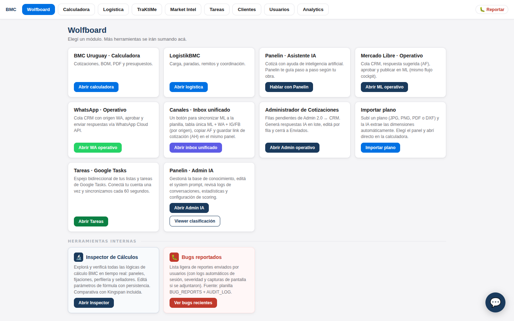

**Mobile (390×844):** el hub colapsa a una sola columna de tarjetas. `[hecho confirmado]`

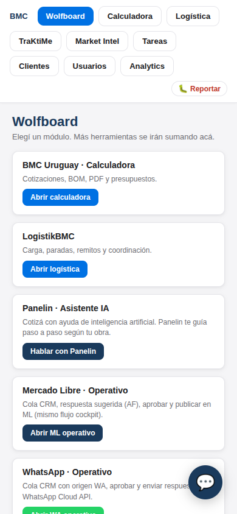

- **Dependencias:** `GET /api/auth/me`, `POST /api/auth/refresh`, `POST /api/me/activity`.
- **Estado observado:** carga correcta, sin errores. Es el punto de entrada a todo lo demás.
- **Mejoras:** (a) las "Herramientas internas" conviven con módulos de negocio sin una
  separación visual fuerte; (b) Panelín aparece dos veces (Asistente IA / Admin IA), puede
  confundir; (c) no hay indicador de qué módulos requieren configuración extra (token de
  cockpit, credenciales).

## 2. Calculadora

**Ruta:** `/` (pública, sin login) · **Componente:** `PanelinCalculadoraV3`

### (a) Propósito

Cotizador guiado de paneles aislantes para techo y/o fachada. Conduce al operador
por un **wizard de 11 pasos** y produce un presupuesto con BOM (lista de materiales) y total
en USD, exportable a PDF, WhatsApp, Drive y planillas. `[hecho confirmado]`

### (b) Navegación narrada (cotización demo `[DEMO-TOUR]`)

Cotización demo: escenario **Solo Techo**, familia **ISODEC EPS** (default), dimensiones
**10 m × 8 paneles → 89.6 m²**, estructura **Metal**, un accesorio perimetral asignado, cliente
demo.

**Paso 1 — Escenario de obra.** Tipo de obra: *Solo Techo*, *Solo Fachada*, *Techo + Fachada*,
*Cámara Frigorífica* o *Presupuesto libre*. El visor muestra el panel y el selector de lista
de precios (Precio BMC / Precio Web).

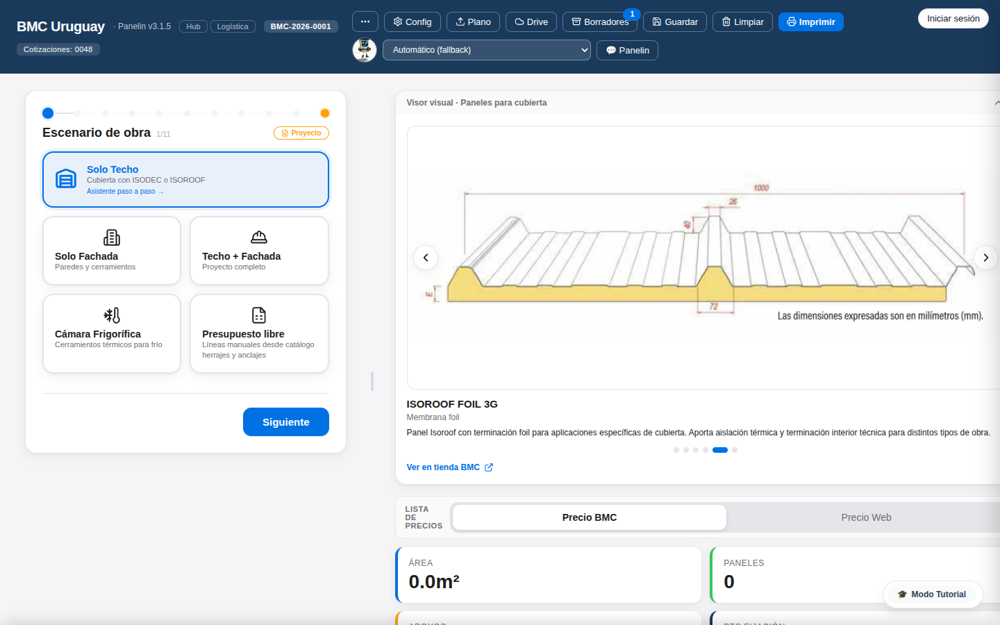

**Paso 2 — Familia de panel.** Grilla de familias (ISODEC EPS/PIR, ISOROOF 3G/FOIL/Colonial/PLUS).
ISODEC EPS preseleccionada.

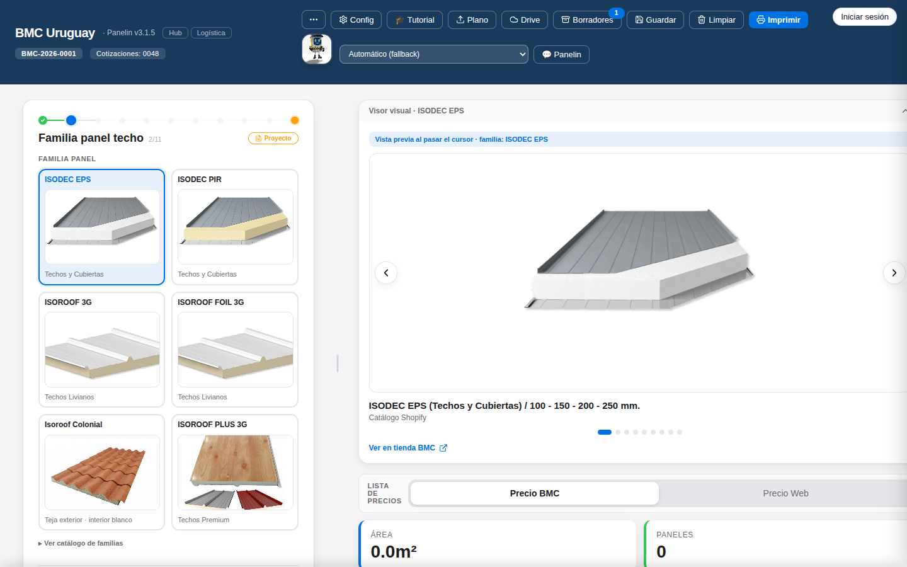

**Paso 3 — Espesor.** Espesor del panel (mm) disponible para la familia.

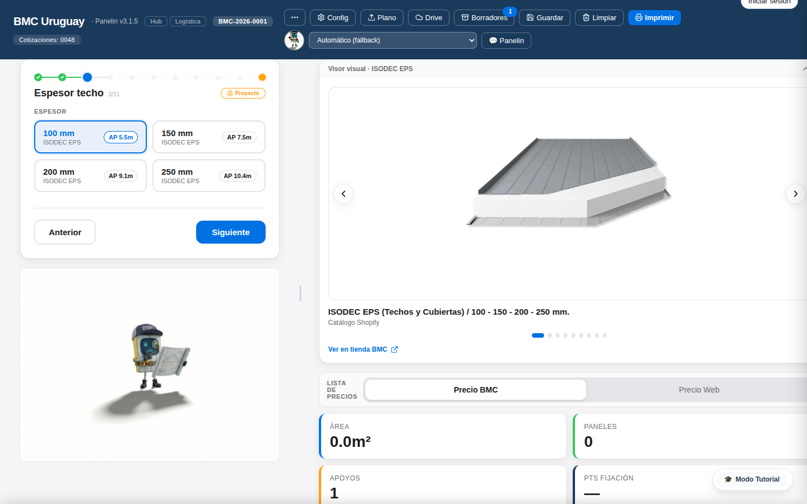

**Paso 4 — Color.** Color/terminación del panel.

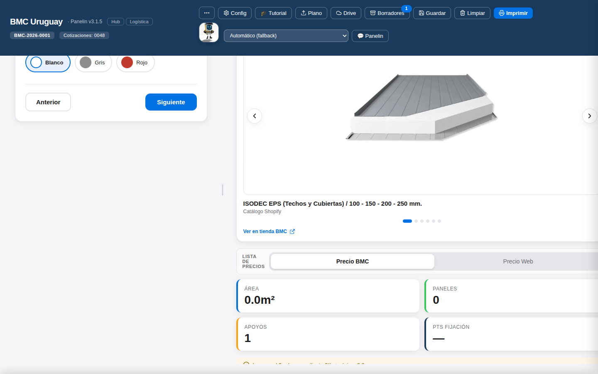

**Paso 5 — Dimensiones.** Toggle **Metros (largo × ancho)** ↔ **Paneles (cantidad)**. Con largo
10 m y 8 paneles la planta 2D calcula **10 × 8.96 m = 89.6 m²** en tiempo real.

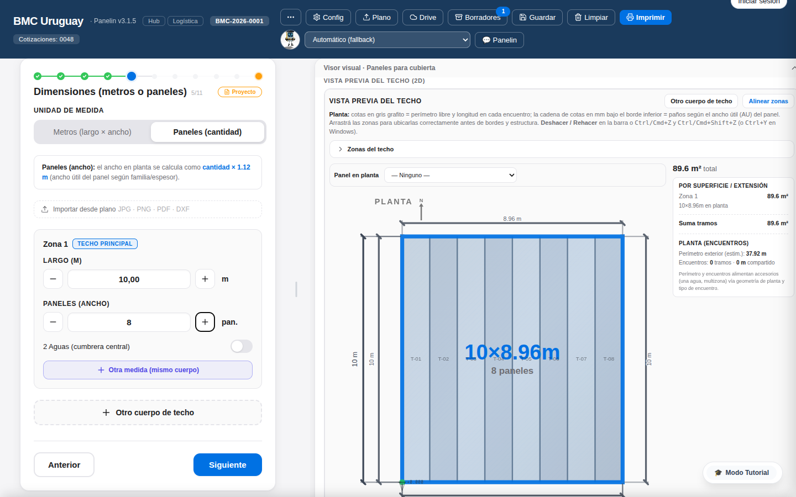

**Paso 6 — Pendiente.** Inclinación del techo.

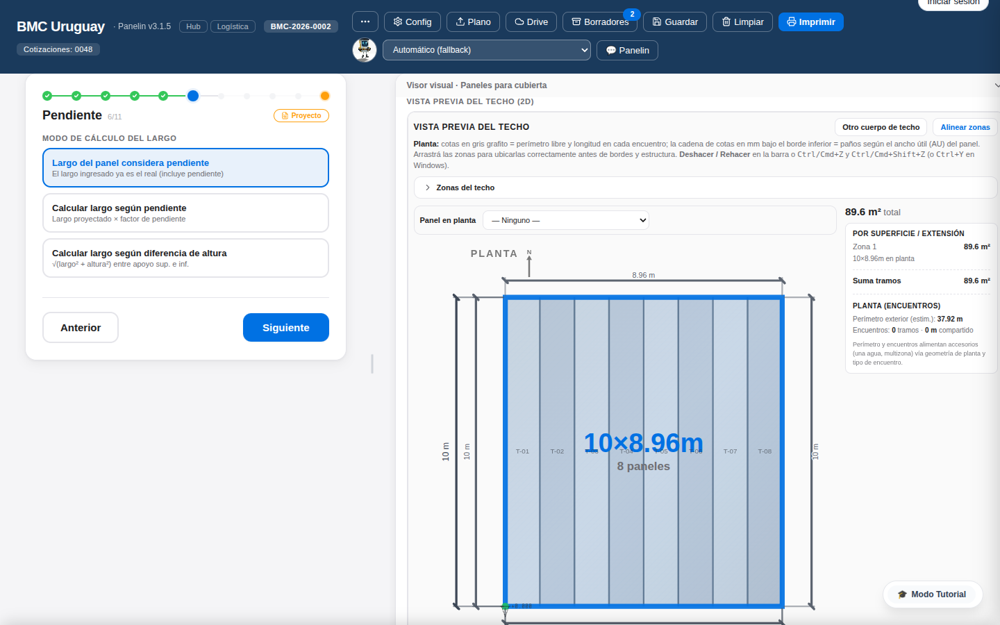

**Paso 7 — Estructura.** Material de apoyo (Metal/Hormigón/Madera/Combinada) y grilla de
fijación; la planta 2D muestra ejes de apoyo y puntos de fijación. Perímetro 37.92 m.

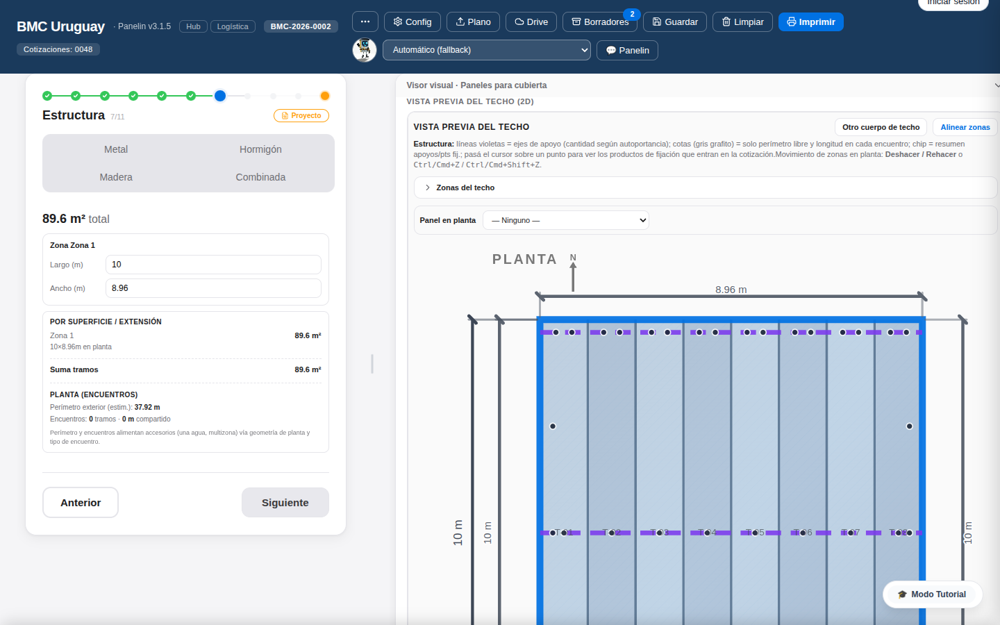

**Paso 8 — Accesorios perimetrales.** La planta 2D resalta las bandas del perímetro; al tocar
un lado se elige gotero/babeta/canalón/perfil. **Siguiente queda deshabilitado hasta asignar
al menos un accesorio** (o desactivar la sección). `[hecho confirmado]`

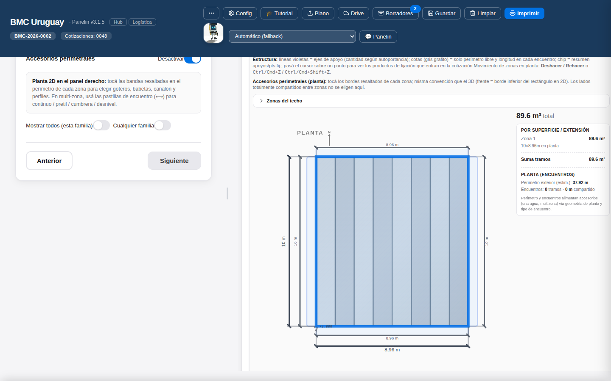

**Paso 9 — Selladores.** Lista auto-calculada (silicona, cinta butilo) con cantidades y
subtotales USD.

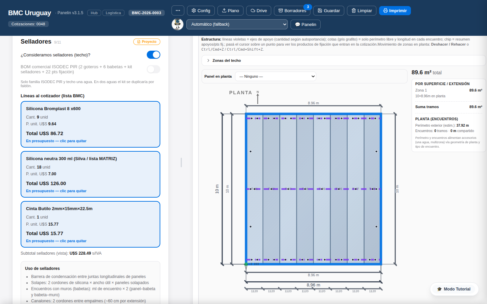

**Paso 10 — Flete.** Costo de flete en USD (280 por defecto) + costo interno opcional.

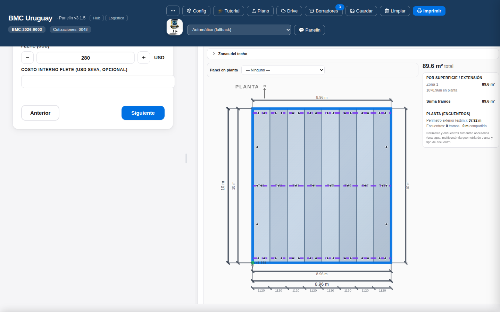

**Paso 11 — Datos del proyecto.** Formulario de cliente (Empresa / Cliente Final). Se completó
con el cliente demo `[DEMO-TOUR] Cliente Demo Tour`. Cierra con **✓ Cotización lista**.

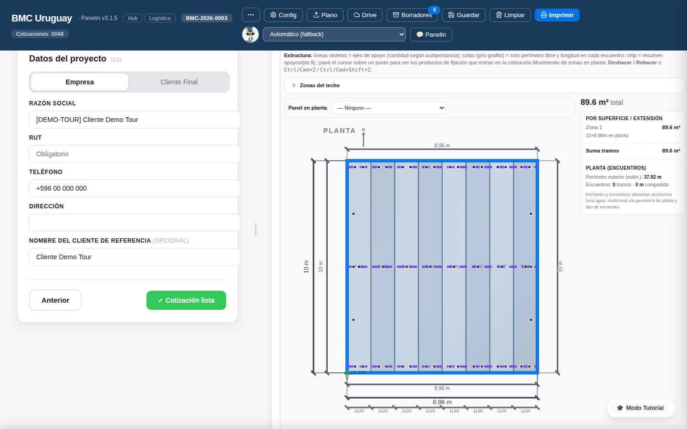

**Presupuesto / BOM.** Se revela el presupuesto con precios: BOM por grupos y **total con IVA
= USD 5.638,86**, con botones de exportación (WhatsApp, PDF Cliente, Interno, Drive, Costeo,
TSV Sheets).

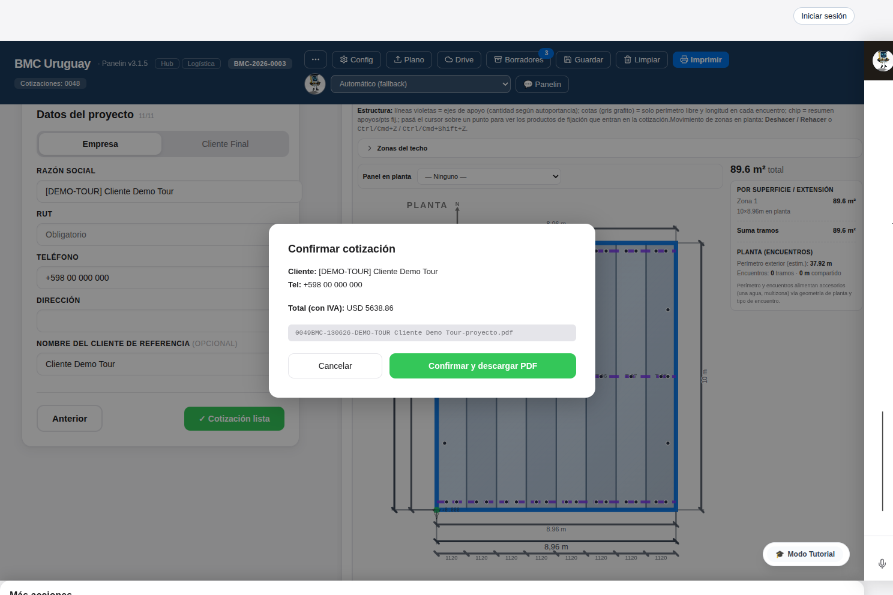

**Exportación a PDF.** *PDF Cliente* abre el modal **Confirmar cotización** (cliente, teléfono,
total, nombre del archivo). El recorrido **no** confirma la descarga ni envía nada.

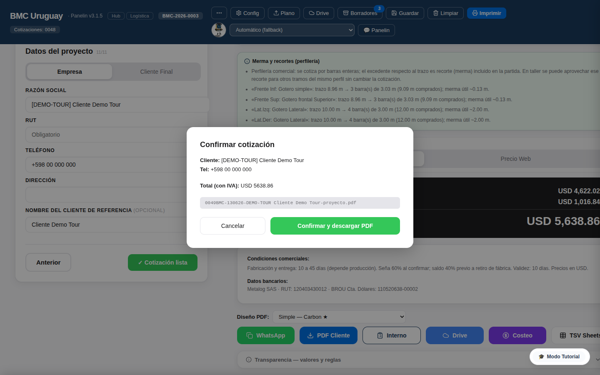

**Mobile:** la calculadora colapsa a una columna.

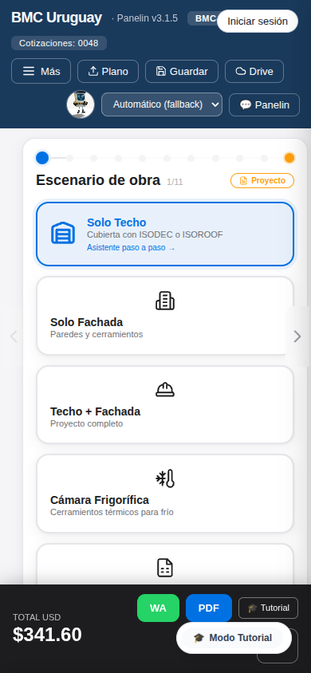

### (c–g)

- **Inventario:** wizard 11 pasos con indicador `N/11` y código `BMC-2026-####`; visor del panel
  + planta 2D con cotas en vivo; selector Precio BMC/Web; BOM por grupos con IVA al total; barra
  Config/Tutorial/Plano/Drive/Borradores/Guardar/Limpiar/Imprimir + avatar Panelín; exportaciones
  WA/PDF/Interno/Drive/Costeo/TSV.
- **Dependencias:** `GET /api/auth/me`, `POST /api/auth/refresh`, `GET /api/quotes/counter`,
  `GET /api/agent/ai-options`, `POST /api/vitals`. Funciona **anónima** (cálculo client-side; sólo
  identidad/telemetría dan 401 sin bloquear). `[hecho confirmado]`
- **Estado observado:** flujo completo sin errores; presupuesto y PDF se generan. El bloqueo de
  *Siguiente* en accesorios no tiene aviso explícito.
- **Mejoras:** aviso explícito cuando *Siguiente* está bloqueado por accesorios; atajo
  "saltar a presupuesto" para cotizaciones simples; recordar último escenario/familia por operador.

## 3. LogistikBMC

**Ruta:** `/logistica` · **Propósito:** previsualización de carga de camión y coordinación de
remitos/paradas. `[hecho confirmado]`

Pantalla con formulario de envío (Nº envío `ENV-…`, fecha, transportista, patente, precio viaje
UYU, notas, email de coordinación de retiro) y, a la derecha, una **vista isométrica (SVG)** del
camión (CABINA ↔ COLA) con filas, paquetes, pilas y orden de descarga. Pestañas **Formulario /
Remito / Diagrama 3D**, selector de camión (8m…), distribución (Auto balanceado) y estrategia de
carga. Botón WhatsApp para coordinación. `[hecho confirmado]`

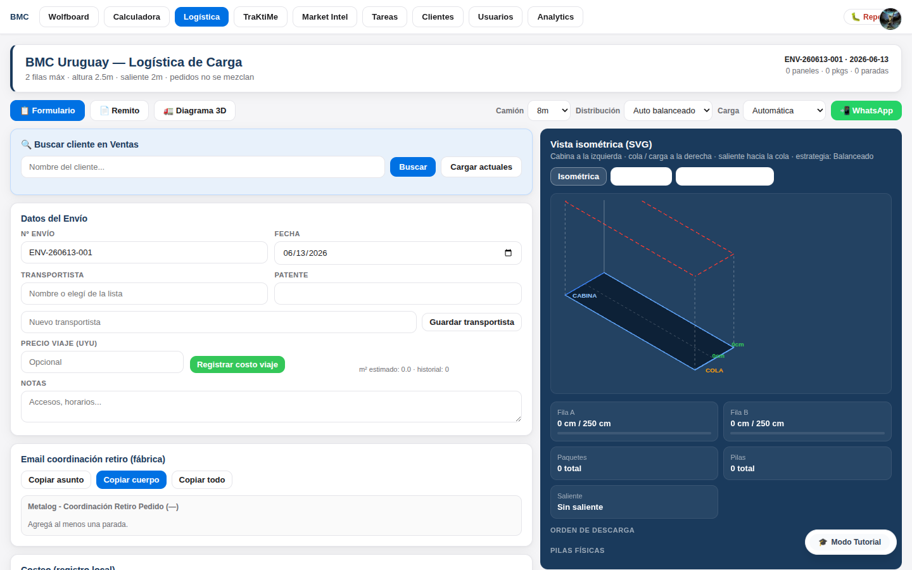

- **Dependencias:** `POST /api/me/activity` (la carga es mayormente client-side / SVG).
- **Estado observado:** render correcto de la vista isométrica en estado vacío (0 paneles, sin
  saliente). La cotización de origen se busca por "Buscar cliente en Ventas". Sin PII en vacío.
- **Mejoras:** la vista 3D es SVG isométrico (no WebGL real); el estado vacío no guía sobre el
  primer paso; el precio de viaje está en UYU mientras el resto del producto opera en USD.

## 4. Panelín (avatar IA)  `[NOT OBSERVED]`

**Acceso:** hub → tarjeta **"Panelín · Asistente IA" → "Hablar con Panelín"** (no tiene ruta
propia en `src/App.jsx`). `[hecho confirmado: la tarjeta existe en el hub]`

La **pantalla del avatar no se capturó en esta corrida**: el localizador del tour buscaba sólo
`role=button` y la entrada del hub es un enlace/tarjeta. El localizador ya fue corregido
(`scripts/product-tour.spec.ts`, `discoverPanelin`) para aceptar enlaces y el texto "Hablar con
Panelín"; queda pendiente una corrida adicional para capturar el avatar y sus gestos.
`[NOT OBSERVED — pantalla del avatar; alcanzable vía hub]`

- **Mejoras (preliminares, desde el hub):** dos accesos a Panelín (Asistente IA vs Admin IA) sin
  diferenciación clara; conviene un único punto de entrada con submodos.

## 5. Cockpit Mercado Libre & WhatsApp

**Rutas:** `/hub/ml` (Mercado Libre) y `/hub/wa` (WhatsApp). **Propósito:** colas operativas en
tiempo real con respuestas asistidas por IA y envío directo a cada canal. `[hecho confirmado]`

**Mercado Libre (`/hub/ml`)** mostró **datos reales**: cola "Cola ML (59)" con contadores (En cola
59, Con respuesta 59, Aprobados 57, Enviados 5), filas con usuario ML, consulta y respuesta
sugerida con precios, y una sección **AUTOMATISMOS** (ML-AUTO-PULL, CRM-AUTO-PULL, AUTO-SYNC,
AI-RESPUESTAS, 100% AUTÓNOMO, CORTAR TODO). Los toggles de automatización **no se tocaron** (sólo
captura). **`[PII — imagen local, no commiteada]`**

**WhatsApp (`/hub/wa`)** estaba **vacío**: "Sin conversaciones. Instalá la extensión Chrome y dale
'Sync histórico'." (0 chats). El cockpit es **F1 — read-only** con panel de acciones (Sugerencias
AI, Cotizar, CRM, Follow-ups). **`[estado vacío — imagen local]`** (sin PII observada).

- **Dependencias:** ML → `GET /api/crm/cockpit/ml-queue`, `GET /api/ml/auto-mode`,
  `POST /api/me/activity`. WA → `GET /api/wa/conversations`, `GET /api/wa/health`.
- **Estado observado:** ML operativo con cola real; WA depende de una extensión de Chrome para
  poblar conversaciones (ausente en el entorno headless → vacío).
- **Mejoras:** los automatismos de ML son potentes y peligrosos ("100% AUTÓNOMO", "CORTAR TODO")
  sin confirmación visible; WA no comunica bien el requisito de la extensión hasta estar vacío;
  unificar el patrón visual de ambos cockpits.

## 6. Canales

**Ruta:** `/hub/canales` · **Propósito:** inbox unificado multicanal (Mercado Libre + WhatsApp,
con extensión también Instagram/Facebook) y asociación a CRM / cliente 360. `[hecho confirmado]`

Mostró **datos reales**: tabla con filas de clientes (CLIENTE, CONSULTA, origen AF), botones
*Enviar / Aprobar / Copiar AF* por fila, y filtros por canal (Todos/ML/WA/IG/FB).
**`[PII — imagen local, no commiteada]`**

- **Dependencias:** `GET /api/crm/cockpit/unified-queue`, `POST /api/me/activity`.
- **Estado observado:** poblado con conversaciones reales de varios canales; es la vista con más
  PII del recorrido.
- **Mejoras:** densidad de tabla alta; la asociación a "cliente 360" no es evidente desde la lista;
  conviene un modo "demo/anónimo" para capturas y formación.

## 7. Administrador de Cotizaciones

**Ruta:** `/hub/cotizaciones` · **Propósito:** gestión de cotizaciones en Kanban
(Pendientes / Borrador / En Revisión / Aprobadas / Enviadas) con generación IA en lote y sync CRM.
`[hecho confirmado]`

En el recorrido estaba **vacío**: todos los contadores en 0 (Pendientes/Borrador/En Revisión/
Aprobadas/Enviadas/Error/Urgentes), "0 filas mostradas". Vista conmutable **Tabla / Kanban**, con
acciones *Nueva consulta*, *Generar IA*, *Sync CRM*, *Export CSV*. Un hint aclara que la
regeneración IA es batch-only (`/api/wolfboard/quote-batch` procesa todas las filas pendientes en
una pasada). **`[estado vacío — imagen local]`**

- **Dependencias:** `GET /api/crm/cockpit/ml-queue`, `GET /api/wolfboard/pendientes`,
  `POST /api/me/activity`.
- **Estado observado:** la tabla quedó en "Cargando…" con contadores en 0 para esta cuenta; no se
  observaron filas (sin PII).
- **Mejoras:** "Generar IA" es batch-only y no permite reprocesar una fila puntual (limitación de
  backend documentada en un hint); el estado vacío no distingue "sin datos" de "cargando".

## 8. TrakTiMe

**Ruta:** `/hub/traktime` · **Propósito:** time tracker bidireccional (temporizador, reportes,
proyectos, clientes, facturas). `[hecho confirmado]`

Mostró el temporizador en **00:00:00** ("Sin temporizador activo"), selector de proyecto y un
error **`missing_credentials`** en rojo: el backend de time-tracking no está configurado para esta
cuenta. Pestañas Temporizador / Reportes / Proyectos / Clientes / Facturas.
**`[estado vacío — imagen local]`** (muestra el email del operador en el encabezado, por eso queda
en `docs-private/`).

- **Dependencias:** `GET /api/traktime/me`, `GET /api/traktime/timer/current`,
  `GET /api/traktime/entries`.
- **Estado observado:** módulo accesible pero **no operativo** por `missing_credentials`.
- **Mejoras:** el error `missing_credentials` es críptico para el operador; debería explicar qué
  credencial falta y cómo configurarla.

## 9. Analytics

**Ruta:** `/hub/admin/analytics` · **Propósito:** métricas de uso (DAU/WAU/MAU, eventos por día,
uso por módulo, tasa de error). `[hecho confirmado]`

Datos **agregados, sin PII**: DAU (24h) **2**, WAU (7d) **2**, MAU (30d) **5**, Error rate **0.0%**;
gráfico de eventos por día; tabla "Uso por módulo" (auth 159, hub 114, calc 63, marketing 22,
admin 11, traktime 10, tareas 9, ml 6, nav 6, wa 4, …) con usuarios distintos. Selector de rango
(7 días). `[hecho confirmado]`

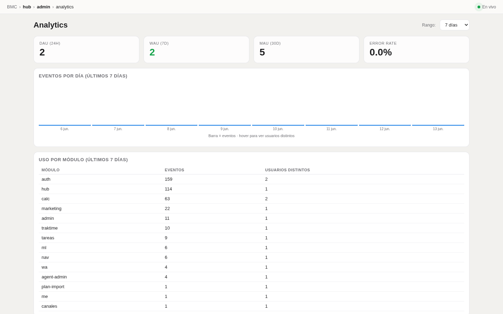

- **Dependencias:** `GET /api/admin/analytics/{active-users,error-rate,module-usage,timeline,top-actions}`,
  `POST /api/me/activity`.
- **Estado observado:** carga correcta; cifras bajas (uso interno). Sin PII (todo agregado).
- **Mejoras:** sin segmentación por operador/rol; el gráfico de eventos no tiene ejes/leyenda
  visibles; falta exportación de métricas.

## 10. Wolf Debug

**Ruta:** `/hub/bugs` · **Propósito:** salud del sistema y reportes de bugs (logs de sesión, ruta,
severidad, screenshot), respaldados en la planilla `BUG_REPORTS` / `AUDIT_LOG`. `[hecho confirmado]`

En el recorrido: **"Sin reportes todavía."** y un aviso de que **se necesita token de cockpit** para
ver los reportes ("Guardá tu token de cockpit… usá el panel en Wolfboard / Admin cotizaciones").
Tabla con columnas ID/Fecha, Severidad, Descripción, Ruta. `[hecho confirmado]`

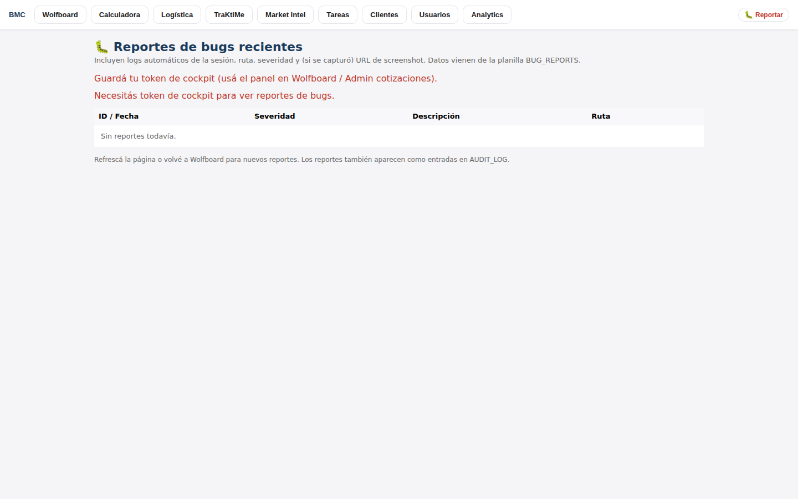

- **Estado observado:** accesible pero **sin contenido** por falta de token de cockpit; no se
  observó panel de salud de API/DB/colas en esta ruta (puede vivir en otra vista). `[NOT OBSERVED:
  health de API/DB/colas]`
- **Mejoras:** el requisito de "token de cockpit" para ver bugs es fricción; convendría usar la
  sesión JWT ya presente; separar "salud del sistema" de "reportes de bugs" si son vistas distintas.

---

## Apéndice — Reproducibilidad

- **Tour:** `npx playwright test scripts/product-tour.spec.ts` (Chromium headless). Requiere
  `TOUR_SESSION_COOKIE` (cookie `bmc_sess`) para los módulos autenticados; sin ella sólo se
  documenta la Calculadora (pública).
- **PDF:** `node scripts/build-product-pdf.mjs` (Markdown → Chromium `page.pdf()`).
- **Privacidad:** capturas con datos reales en `docs-private/` (gitignored); endpoints en la
  metadata se sanitizan (ids/teléfonos/emails → `:id`).
- **Salvedades del entorno:** la sesión rota el refresh-token en cada uso (reuse-detection), por
  eso el tour usa **un solo contexto** y **una sola recarga** (`/hub`), navegando el resto
  client-side. WhatsApp Cockpit requiere una extensión de Chrome (ausente headless) y TrakTiMe
  requiere credenciales (`missing_credentials`), por lo que aparecieron vacíos.
