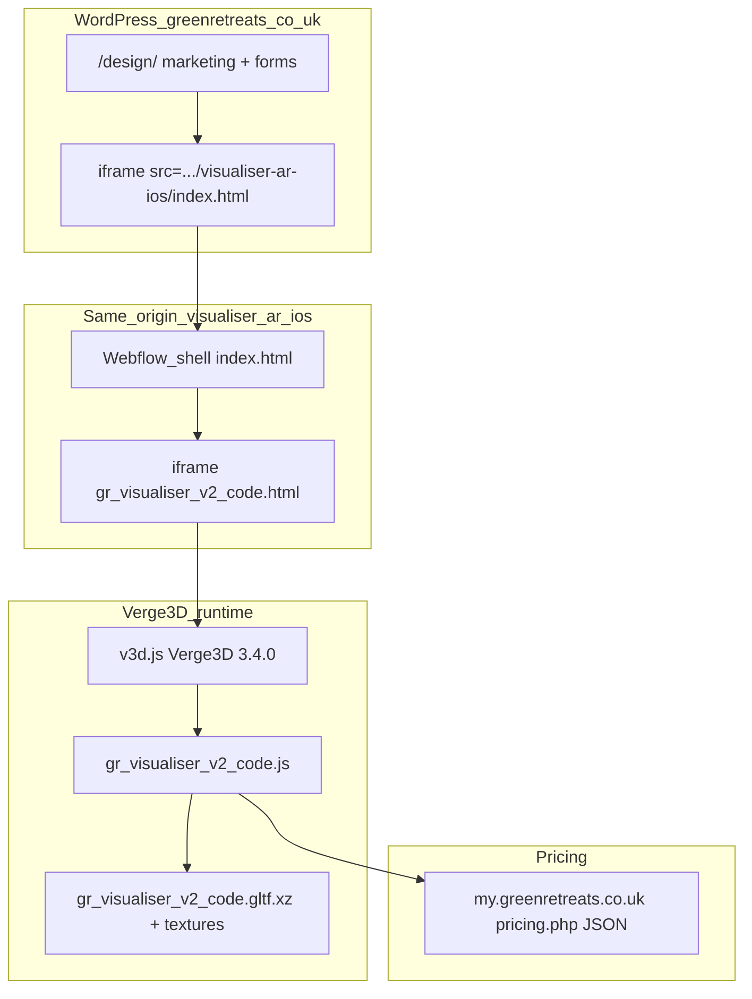

# Green Retreats “Visualiser V2” — architecture reference

This document summarizes the **logic and architecture** of the Green Retreats 3D garden-room configurator, based on the mirrored assets under [mirror/](mirror/) and public URLs. Use it to **study and contrast** with [calculadora-bmc.vercel.app](https://calculadora-bmc.vercel.app) (this repository).

---

## 1. Layer diagram



- **WordPress** wraps the Webflow export in an iframe (`visualiser-ar-ios/index.html`).
- **Webflow shell** holds all 2D UI (building, dimensions, finishes, door, price, AR buttons).
- **Inner iframe** (`gr_visualiser_v2_code.html`) hosts **Verge3D** only: `#v3d-container`, scripts `v3d.js` + `gr_visualiser_v2_code.js`.

---

## 2. Static triage (engine, assets, pricing)

### 2.1 3D engine

| Item | Evidence |
| --- | --- |
| Product | **Verge3D** (Soft8Soft), built on **Three.js** |
| Version | `gr_visualiser_v2_code.html`: `<meta name="generator" content="Verge3D 3.4.0">` |
| Entry | `new v3d.App(CONTAINER_ID, null, preloader)` in `gr_visualiser_v2_code.js` |
| Preloader | `v3d.SimplePreloader`; `onUpdate` sets `.v3d-simple-preloader-bar` width and `%` text inside the iframe only |

The shell’s `#preloader_div` / `#percentage` (in `index.html`) are **not** updated in the first lines of the app JS; initial load UX may be Webflow/CSS or code farther in the bundle. The **authoritative** load progress for the 3D scene is the Verge3D preloader bar inside the inner iframe.

### 2.2 Scene and compression

- Primary load URL in code: **`./gr_visualiser_v2_code.gltf.xz`** (XZ-compressed glTF).
- The mirror also includes uncompressed `gr_visualiser_v2_code.gltf` + `gr_visualiser_v2_code.bin` for inspection with glTF viewers.

### 2.3 Textures and materials

Material swaps reference **relative JPGs** next to the HTML (e.g. `Redwood_D.jpg`, `Cedar_N.jpg`, `Composite_*`, fascia tile atlases). Naming encodes **type + maps** (`_D` diffuse, `_N` normal, `_V_Tile` variants).

### 2.4 Pricing source

- `gr_visualiser_v2_code.html` includes:

  ```html
  <script type="text/javascript" src="https://my.greenretreats.co.uk/configurator/configurator-api/pricing.php"></script>
  ```

- Inline stub defines:

  ```js
  configuratorPricing = (json) => { window.priceData = json; }
  ```

- The PHP endpoint returns a **JSON object** (see `mirror/pricing.json.sample`): version, `base.reference` grids keyed by depth/width (`d2000`/`w3000` style), model keys (`g1`–`g5`, `x1`, ranges), offsets, `panel`, `fascia`, `decking`, `cladding`, `internalFinish`, etc.
- **999999** appears as “not available” for invalid size combinations.

---

## 3. Parent ↔ iframe contract

### 3.1 Same-origin DOM bridge (primary)

The inner app runs in an iframe **same origin** as `index.html` (`greenretreats.co.uk`). The generated code uses **`window.parent.document`** to read and wire the Webflow UI — **not** `postMessage` for the main control flow.

Examples from the start of `gr_visualiser_v2_code.js`:

- Hides shell regions until ready: `.left_panel`, `.summary-wrapper`.
- Later (throughout the file): `getElementById('width_slider')`, `getElementById('model_tgo1')`, click handlers on `#model_pinnacle`, `#cladding_*`, door controls, `#price_number`, `#sq_m`, AR buttons, etc.

**Implication**: the “API” is effectively **stable DOM ids and classes** on the parent shell, tightly coupled to Verge3D app code.

### 3.2 `postMessage` to WordPress (grandparent)

At least one path calls:

```js
window.parent.parent.postMessage(JSON.stringify(data), '*');
```

with a payload including `buildingData` (see around the `SaveBuilding`-related flow in `gr_visualiser_v2_code.js`). That targets the **top** window (WordPress page embedding the Webflow shell), e.g. for save/share or analytics — not the immediate Webflow parent alone.

### 3.3 AR (iOS / USDZ)

The app references `window.parent.parent.document.getElementById('usdz-link-ios')` and `EnterARModeUSDZ('Scene')` (Verge3D AR export). The exact markup for `usdz-link-ios` lives on the **WordPress** page or outer template; the mirrored Webflow `index.html` uses `#usdz-link` / `#ar-mode-usdz` — naming differs between deployments; treat AR as **environment-specific**.

### 3.4 Bridge summary table

| Mechanism | Direction | Purpose |
| --- | --- | --- |
| `window.parent.document.*` | Inner iframe → Webflow shell | Read sliders, attach clicks, update `#price_number`, `#summary_text`, show/hide panels |
| `window.parent.parent.postMessage` | Inner iframe → WordPress top | Serialized building / save payload |
| `pricing.php` | Network → iframe | Fill `window.priceData` for client-side price calculation |
| Verge3D preloader | Inside iframe | Scene load % in `.v3d-simple-preloader-bar` |

---

## 4. Configuration model (product)

Conceptual state (not exhaustive):

- **Range / building**: `g1`…`g5` map to nodes like `#model_tgo1` … `#model_tgo4`, `#model_pinnacle`; pricing picks `base.reference[index]` via model metadata in JSON (`g4.index`, etc.).
- **Footprint**: width / depth sliders (`#width_slider`, `#depth_slider`) — ranges defined in HTML `min`/`max`.
- **Finish**: cladding, decking, trim (fascia / hood), internal floor and walls.
- **Door**: height tabs (`<2.3m`, `2.8m`, `3.8m`) and style ids (`door_sliding23`, …); “move door” arrows.
- **Options**: full-height window strip (`#fhwindow_*`), side screen, garden environment, reset camera.

**Outputs**: formatted **price** and **area**, **summary** panel text, **email/save** (Gravity Forms on WP + internal save URL params in JS), **AR** export.

---

## 5. Glossary (UI ids ↔ product)

| Shell id (examples) | Meaning |
| --- | --- |
| `model_tgo1` … `model_tgo4`, `model_pinnacle` | Building lines (labels g1–g5 in UI copy) |
| `width_slider`, `depth_slider` | Footprint |
| `cladding_*`, `deck_*`, `fascia_*`, `hood_*` | Exterior finishes |
| `floor_*`, `wall_*` | Interior |
| `door_*` | Door type / width class |
| `price_number`, `sq_m` | Total price and size |
| `email_design`, `ar-mode`, `ar-mode-usdz` | Save / AR |

---

## 6. Contrast with Calculadora BMC (this repo)

| Dimension | Green Retreats visualiser | Calculadora BMC |
| --- | --- | --- |
| **Problem domain** | B2C **fixed catalog** garden rooms; marketing + quote | Panel **takeoff** and quote for construction; Uruguay operations |
| **UI stack** | Webflow shell + Verge3D iframe | **Vite + React** SPA ([`package.json`](../../../package.json)) |
| **Authoritative geometry** | **3D** scene (glTF) drives perception; sliders map to priced SKUs | **2D SVG planta** as engineering source of truth — [`src/components/RoofPreview.jsx`](../../../src/components/RoofPreview.jsx) — panel grid, encounters, cotas |
| **3D** | Full Verge3D product | Optional **reference** 3D: [`src/components/RoofPanelRealisticScene.jsx`](../../../src/components/RoofPanelRealisticScene.jsx) (`@react-three/fiber`, Three.js), parallel to 2D |
| **Pricing** | Server JSON (`pricing.php`) + large in-memory tables | [`src/utils/calculations.js`](../../../src/utils/calculations.js), [`src/data/constants.js`](../../../src/data/constants.js), MATRIZ/API; tests e.g. [`tests/validation.js`](../../../tests/validation.js) |
| **Coupling** | Strong: minified JS ↔ specific DOM ids | Component state + hooks (`useRoofPreviewPlanLayout`, etc.), typed utilities |
| **Bridge pattern** | `window.parent.document` + rare `postMessage` to WP | React props/state, API routes on Node (`server/`), no nested same-origin configurator iframe |

**Study takeaway**: Green Retreats optimizes for **guided product configuration** and **visual selling** (one scene, many material swaps, server-driven price tables). BMC optimizes for **accurate 2D quantities and encounters** feeding BOM, with 3D as an auxiliary view. Reusable ideas: **progressive loading** (compressed glTF), **explicit option ids**, **central price payload** — adapted to BMC’s React/data model, not by copying Verge3D bundles.

---

## 7. Performance notes

- Scene shipped as **`.gltf.xz`** to reduce download size.
- `v3d.js` is large (~1.4 MB); typical for a full Verge3D build.
- Textures are separate JPGs loaded as needed by material logic in `gr_visualiser_v2_code.js`.

---

## 8. References

- Verge3D: [https://www.soft8soft.com/](https://www.soft8soft.com/)
- Live embed: `https://www.greenretreats.co.uk/design/`
- Mirror notes: [README.md](./README.md)
