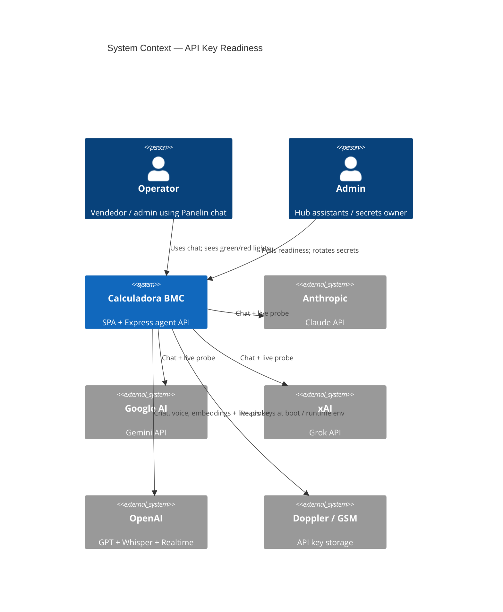
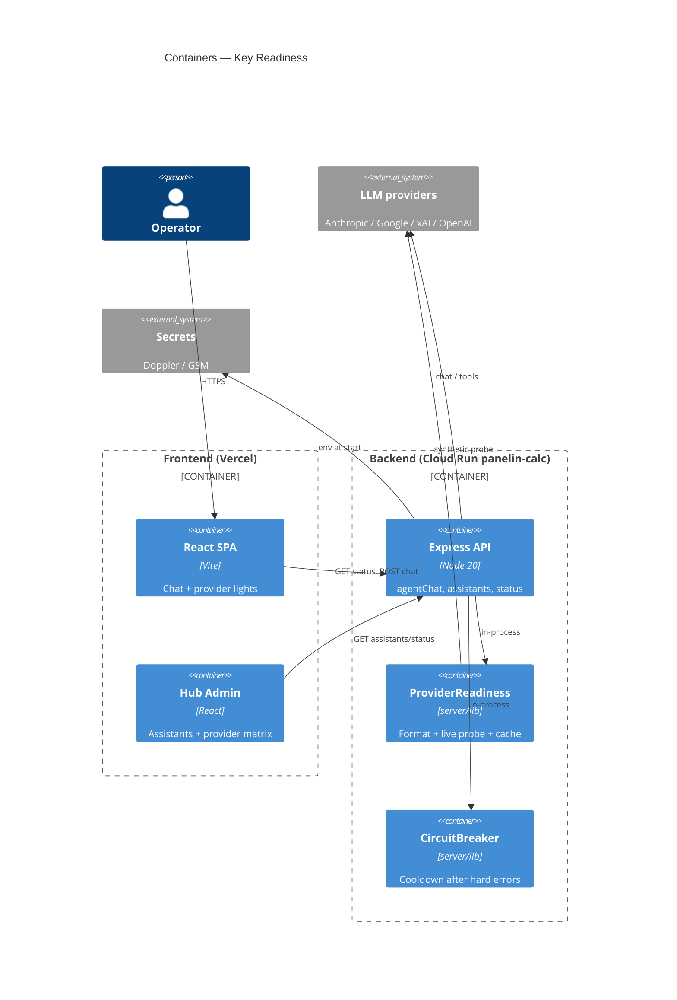
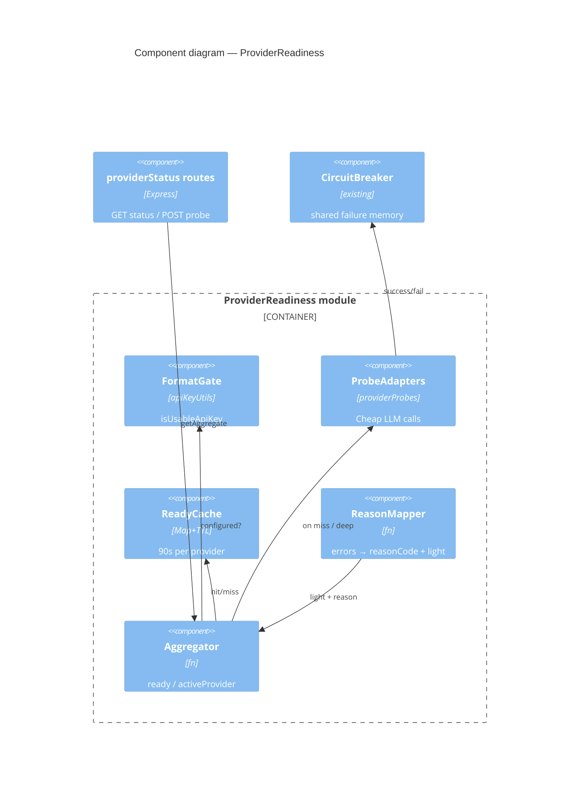
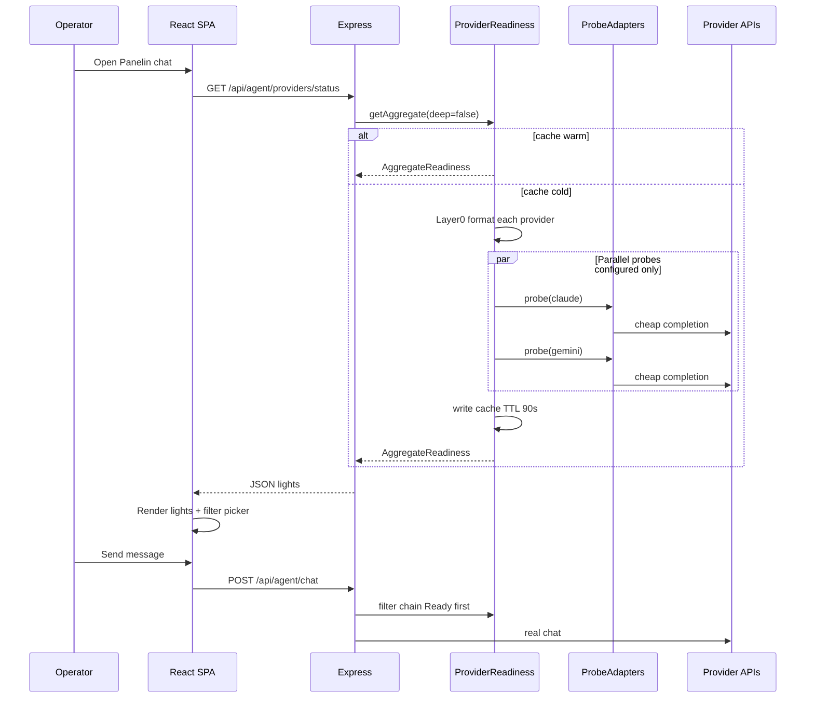
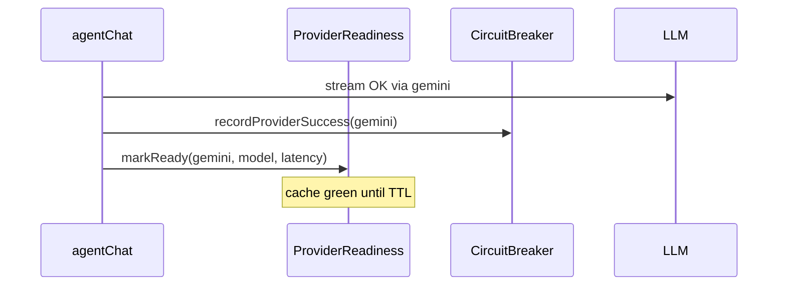

# System Design Document: API Key Readiness & Live Provider Lights

**Evidence tags used throughout:** **[CONFIRMED]** = exists in repo today · **[PROPOSED]** = design not yet implemented · **[INFERRED]** = reasonable from code/docs without direct citation.

---

## 1. Introduction & Goals

### 1.1 Problem Statement

Panelin routes chat, CRM suggestions, voice, and embeddings through a multi-provider LLM chain (Claude → Grok → Gemini → OpenAI → OpenRouter) **[CONFIRMED]** `DEFAULT_PROVIDER_ORDER` in `server/lib/aiProviderConfig.js`. As of 2026-07-24 the stack rejects placeholders via `isUsableApiKey` and central `getApiKey` **[CONFIRMED]**, and `assistantHealth` enriches status with circuit-breaker cooldowns **[CONFIRMED]** `server/lib/assistantHealth.js`. It still does **not** perform an intentional synthetic live probe — comments state live ping is “intentionally NOT done” on every poll **[CONFIRMED]** `server/lib/assistantHealth.js:10–12`.

Incident evidence (2026-07-24 session): Doppler keys all passed `isUsableApiKey`, yet Claude returned credit-balance-too-low, OpenAI insufficient_quota, Grok incorrect key, Gemini `ACCESS_TOKEN_TYPE_UNSUPPORTED`. After rotating to a Generative Language key, `POST /api/agent/chat` returned non-empty content **[CONFIRMED]** session smoke logs.

### 1.2 Goals

| # | Goal | Priority | Success metric |
|---|------|----------|----------------|
| G1 | Truthful readiness: Ready = format-usable **and** live probe OK (or fresh traffic success) | P0 | No green→401 within TTL for probed providers |
| G2 | Green / red / amber lights per provider + aggregate AI ready | P0 | Chat header + admin panel show light + reason |
| G3 | Live check without burning money | P0 | Cheap models, ≤8 max tokens, rate-limited, TTL ≥60s |
| G4 | Single source of truth for chat, ai-options, assistants status | P0 | One readiness module; no duplicate probe logic |
| G5 | Clear not-ready UX (Spanish `reasonCode` + message) | P1 | Operators see human reason, not raw 401 first |

### 1.3 Non-goals

- Admin UI to paste API keys (secrets stay Doppler / GSM).
- Auto-purchase of Anthropic/OpenAI credits.
- All-providers green as release gate (one Ready provider is enough).
- Replacing failover chain / circuit breaker (compose with them).

### 1.4 Stakeholders

| Role | Interest |
|------|----------|
| Operators / vendedores | Instantly see if Panelin can answer |
| Admin (Matias) | Diagnose dead key vs billing |
| Backend / agents | Correct chain without guessing |
| On-call / smoke | Assert Ready or honest Not ready |

---

## 2. Context & Scope (C4 Level 1)

### 2.1 System context



### 2.2 External interfaces

| Interface | Direction | Protocol | Auth | Tag |
|-----------|-----------|----------|------|-----|
| `GET /api/agent/ai-options` | ← client | HTTPS JSON | Public / same as today (no secrets) | **[CONFIRMED]** `agentChat.js:157–158` |
| `GET /api/assistants/status` | ← admin | HTTPS JSON | `requireServiceOrUser({ role: "admin" })` | **[CONFIRMED]** `assistantsStatus.js:45–50` |
| `POST /api/agent/chat` | ← client | SSE | service token or identity JWT | **[CONFIRMED]** `agentChat.js` + `index.js:1048` |
| `GET /api/agent/providers/status` | ← client | HTTPS JSON | public (rate-limited; no secrets) | **[CONFIRMED]** `providerStatus.js` |
| `POST /api/agent/providers/probe` | ← admin | HTTPS JSON | admin (`role: "admin"`) | **[CONFIRMED]** |
| Anthropic / Google / xAI / OpenAI | → out | HTTPS | env API keys | **[CONFIRMED]** |
| Doppler `bmc-backend/prd`, GSM project secrets | → in | env mount | operator tokens | **[CONFIRMED]** deploy practice |

### 2.3 Scope boundary

**In scope:** readiness layers, probe design, status API, lights UI, composition with existing config/health.  
**Out of scope:** full Panelin agent tools, RAG, multi-agent orchestration redesign.

---

## 3. Constraints

| Type | Constraint | Tag |
|------|------------|-----|
| Stack | React 18 + Vite SPA, Express 5, Postgres | **[CONFIRMED]** AGENTS.md |
| Secrets local | Doppler project `bmc-backend` config `prd` | **[CONFIRMED]** `npm run smoke:prod:auth` |
| Secrets prod | GCP Secret Manager → Cloud Run env | **[CONFIRMED]** EXTERNAL-CONNECTIONS.md |
| Cost | Probes use `FAST_DEFAULT_MODELS`, max_tokens ≤ 8 | **[PROPOSED]** policy |
| Latency | Warm status p95 &lt; 150 ms; cold multi-probe &lt; 8 s | **[PROPOSED]** SLO |
| Security | Never return full keys; prefix ≤ 6–8 chars | **[PROPOSED]** API contract |
| Process | Cloud Run multi-instance; per-process cache OK | **[CONFIRMED]** pattern matches circuit breaker |
| Reuse | Must use `isUsableApiKey`, `getApiKey`, `providerCircuitBreaker` | **[CONFIRMED]** shipped |

---

## 4. Solution Strategy

### 4.1 Architecture style

**Extend modular monolith** (Express + React). No new microservice.

### 4.2 Layered readiness

```
Layer 0  Format gate     isUsableApiKey / getApiKey          [CONFIRMED]
Layer 1  Runtime memory  circuit breaker / cooldowns         [CONFIRMED]
Layer 2  Live probe      cheapest synthetic call + cache     [PROPOSED]
Layer 3  Status model    Ready | Degraded | NotReady         [PROPOSED]
Layer 4  API + UI lights GET …/providers/status + lights     [PROPOSED]
```

### 4.3 Key technology choices

| Choice | Why |
|--------|-----|
| In-process cache TTL 90s (`PROVIDER_READY_TTL_MS`) | Cheap; matches assistantHealth cache style |
| Same circuit breaker module | One mental model for “why Gemini first” |
| Fail-open chat if no Ready but format-available | Business quoting must not brick on probe outage |
| Green ⇔ live OK only | Operators equate green with “can chat” |

### 4.4 AI integration strategy

LLM used only for **tiny synthetic probes** and existing chat. No RAG, no new agent runtime. Traffic success refreshes Ready for free.

### 4.5 Key trade-offs

| Accept | Reject |
|--------|--------|
| Multi-instance cache drift | Shared Redis readiness (P2 later) |
| Fail-open residual 401 rare path | Hard-brick all chat if probes fail |
| Gray “unknown” until first probe | Fake green on key presence |

---

## 5. Container View (C4 Level 2)



### 5.1 Mount & auth wire points **[CONFIRMED]**

| Surface | Mount | Auth |
|---------|-------|------|
| Agent chat + ai-options | `app.use("/api", agentChatRouter)` `server/index.js:1048` | route-local + chat gates |
| Assistants status | `app.use("/api", createAssistantsStatusRouter())` `server/index.js:1014` | `requireServiceOrUser({ role: "admin" })` |
| Provider status router **[PROPOSED]** | `app.use("/api", createProviderStatusRouter())` next to assistants | status: chat-class auth; probe: admin |
| Middleware | `server/middleware/requireServiceOrUser.js` | dual JWT + `API_AUTH_TOKEN` |

### 5.2 Frontend wire points **[CONFIRMED / PROPOSED]**

| Hook / UI | Today | After design |
|-----------|-------|--------------|
| `useChat.js:225` | `apiGet("/api/agent/ai-options")` | also poll readiness or embed readiness in ai-options **[PROPOSED]** |
| Provider select state | `aiProvider` / `aiModel` in `useChat` | disable options where `state === not_ready` **[PROPOSED]** |
| Lights component | none | `src/components/ai/ProviderStatusLights.jsx` **[PROPOSED]** |
| StatusDot precedent | `AdminIngresoModule.jsx` green/red/amber | reuse colors **[CONFIRMED]** |

---

## 6. AI Architecture — Component View

### 6.1 Scope of AI in this subsystem

**N/A for RAG / multi-agent / vector store** in this SDD.  
**Evidence:** readiness only adds synthetic probes and UI lights; existing agent tools/RAG stay outside (`server/lib/agentTools.js`, `server/lib/rag.js` not modified by design).

### 6.2 Readiness AI components **[PROPOSED]**

| Component | Path | Responsibility |
|-----------|------|----------------|
| ApiKeyFormat | `server/lib/apiKeyUtils.js` | Pure format gate **[CONFIRMED]** |
| ProviderConfig | `server/lib/aiProviderConfig.js` | Keys, models, chain **[CONFIRMED]** |
| CircuitBreaker | `server/lib/providerCircuitBreaker.js` | Cooldown memory **[CONFIRMED]** |
| ProbeAdapters | `server/lib/providerProbes.js` | One cheap generation per provider **[PROPOSED]** |
| ProviderReadiness | `server/lib/providerReadiness.js` | Status model + cache + aggregate **[PROPOSED]** |
| Status routes | `server/routes/providerStatus.js` | HTTP **[PROPOSED]** |
| AssistantHealth | `server/lib/assistantHealth.js` | Compose readiness; stop key-only “live” **[PROPOSED]** edit |

### 6.3 C4 Component (L3) **[PROPOSED]**



### 6.4 Probe model strategy

| Decision | Choice |
|----------|--------|
| Models | `FAST_DEFAULT_MODELS` only (haiku / flash / mini) |
| Parallelism | `Promise.allSettled` for configured providers |
| Cache TTL | 90s (`PROVIDER_READY_TTL_MS`) |
| Fail policy | Prefer Ready chain; if empty → format-available + CB + SSE warning |
| Traffic feedback | Successful chat turn refreshes Ready for that provider |

### 6.5 Probe contracts

| Provider | Method | Model | Max tokens | Success |
|----------|--------|-------|------------|---------|
| claude | Messages API | FAST haiku | 8 | 200 + non-empty text |
| gemini | generateContent | gemini-2.5-flash / lite | 8 | 200 + candidates content |
| openai | chat.completions | gpt-4o-mini | 8 | 200 + message content |
| grok | OpenAI-compat xAI | grok-3-mini | 8 | same |
| openrouter | OpenAI-compat | configured default | 8 | only if fallback enabled |

**Prompt:** `"Reply with exactly: OK"`.

| Signal | reasonCode | light |
|--------|------------|-------|
| no key | `missing_key` | red |
| placeholder | `placeholder_key` | red |
| 401/403 / ACCESS_TOKEN_TYPE_UNSUPPORTED | `auth_failed` | red |
| credits / insufficient_quota | `billing` | red |
| Incorrect API key | `invalid_key` | red |
| 429 | `rate_limited` | amber |
| timeout / 5xx | `timeout` | amber→red if repeated |
| 200 empty | `sdk_error` | red |
| OK | `ok` | green |

### 6.6 Cost (probes)

| Est. cost / probe | Worst case / hour / instance @ 90s TTL |
|-------------------|----------------------------------------|
| ~$0.00001–0.0001 | ~40 probes / provider |

---

## 7. Data Flow

### 7.1 Primary flow — operator opens chat (cold)



### 7.2 Chat success refreshes Ready **[PROPOSED]**



### 7.3 Layered decision (per provider)

```
isUsableApiKey? ──no──► not_ready (missing/placeholder)
       │ yes
In hard CB? ──yes──► not_ready or amber (429 soft)
       │ no
Cache hit? ──yes──► return cached light
       │ no / deep=1
Live probe ──ok──► ready
       └──fail──► map reasonCode + light
```

### 7.4 Status model

```ts
type Light = "green" | "amber" | "red" | "gray";
type ReadyState = "ready" | "degraded" | "not_ready" | "unknown" | "checking";

interface ProviderReadiness {
  id: "claude" | "openai" | "grok" | "gemini" | "openrouter";
  light: Light;
  state: ReadyState;
  reasonCode: string;
  reason: string; // Spanish, no secrets
  configured: boolean;
  live: boolean | null;
  modelProbed: string | null;
  latencyMs: number | null;
  checkedAt: string | null;
  keyMeta: { length: number; prefix: string };
}

interface AggregateReadiness {
  ready: boolean; // ≥1 ready
  light: Light;
  activeProvider: string | null;
  providers: ProviderReadiness[];
  generatedAt: string;
}
```

| State | Light |
|-------|-------|
| ready | green |
| degraded | amber |
| not_ready | red |
| unknown | gray |
| checking | amber pulse |

### 7.5 API contracts **[PROPOSED]**

**`GET /api/agent/providers/status`** — query: `deep=1`, `provider=gemini`.  
**`POST /api/agent/providers/probe`** — admin; body `{ "providers": ["gemini"] }`; rate limit 6 / 15 min.

**Extend `GET /api/agent/ai-options`** with:

```json
"readiness": { "ready": true, "light": "green", "activeProvider": "gemini" }
```

### 7.6 Picker policy (`AI_OPTIONS_REQUIRE_LIVE`)

| Env | Default | Picker shows |
|-----|---------|--------------|
| production | `AI_OPTIONS_REQUIRE_LIVE=1` | `ready` + `degraded` (amber selectable with warning); hide `not_ready` |
| development | `0` allowed | all `configured` + gray unknown; never green without live |
| openrouter | only if `OPENROUTER_FALLBACK_ENABLED` and configured | same light rules; last in autoOrder |

**Auto:** first green in `DEFAULT_PROVIDER_ORDER`; if none, first amber; if none, format-available fail-open with SSE info.

### 7.7 Spanish operator messages (runbook)

| reasonCode | Message |
|------------|---------|
| `missing_key` | No hay API key configurada para este proveedor. |
| `placeholder_key` | La key parece un placeholder de `.env.example`. Reemplazala en Doppler/GSM. |
| `billing` | Cuenta sin créditos o sin cuota. Revisá billing del proveedor. |
| `auth_failed` | Key rechazada (401/403). Rotá la key (Gemini: Generative Language / AI Studio válida). |
| `invalid_key` | El proveedor reporta key incorrecta. Regenerá la key. |
| `rate_limited` | Límite temporal (429). Esperá o subí cuota. |
| `ok` | Listo. |

---

## 8. Deployment View

### 8.1 Environments

| Env | SPA | API | Secrets |
|-----|-----|-----|---------|
| Local | Vite `:5173` | Express `:3001` via `doppler run --project bmc-backend --config prd` | Doppler `bmc-backend/prd` |
| Production SPA | Vercel project calculadora-bmc | calls Cloud Run public URL | `bmc-frontend/prd` mirror |
| Production API | — | Cloud Run service **`panelin-calc`** region `us-central1` | GSM → env |

**Prod API base (example):** `https://panelin-calc-q74zutv7dq-uc.a.run.app` **[CONFIRMED]** `scripts/smoke-prod-api.mjs:23`, `package.json` test:ml-auto:prod.

### 8.2 Run commands **[CONFIRMED]**

```bash
# Local full stack
cd ~/calculadora-bmc
doppler run --project bmc-backend --config prd -- npm run dev   # or dev:full / start:api

# Prod smoke (uses Doppler for auth token)
npm run smoke:prod:auth
```

### 8.3 Secrets (names only — never values)

| Name | Used by readiness/chat | Where |
|------|------------------------|-------|
| `ANTHROPIC_API_KEY` | claude | Doppler + GSM |
| `GEMINI_API_KEY` | gemini | Doppler + GSM |
| `OPENAI_API_KEY` | openai (+ voice/embeddings) | Doppler + GSM |
| `GROK_API_KEY` / `XAI_API_KEY` | grok | Doppler + GSM |
| `OPENROUTER_API_KEY` | openrouter (optional) | env |
| `OPENROUTER_FALLBACK_ENABLED` | include openrouter | env |
| `API_AUTH_TOKEN` | service auth for smoke/status | Doppler + GSM |
| `PROVIDER_READY_TTL_MS` | cache TTL **[PROPOSED]** | optional env |
| `AI_OPTIONS_REQUIRE_LIVE` | picker filter **[PROPOSED]** | optional env (prod default 1) |

### 8.4 CI / gates (related)

| Gate | Role |
|------|------|
| `tests/apiKeyUtils.test.js` | format gate **[CONFIRMED]** |
| `tests/aiProviderConfigKeys.test.js` | availability **[CONFIRMED]** |
| `tests/providerReadiness.test.js` | readiness unit **[PROPOSED]** |
| `smoke:prod` / `smoke:prod:auth` | can assert readiness light later **[PROPOSED]** extend |

### 8.5 Cloud Run note

GSM secret version updates may require new revision or secret refresh depending on mount mode. Local Doppler is authoritative for dev verification.

---

## 9. Crosscutting Concepts

### 9.1 Security

- Never log or return full keys; `keyMeta.prefix` ≤ 6–8.
- Force probe: admin only; rate-limited.
- No client-supplied keys for probes.
- Spanish reasons must not echo raw provider payloads with secrets.

### 9.2 Reliability

- Probe timeout 8s (`AbortSignal`).
- Fail-open chat if probe layer down but format keys exist.
- Per-instance cache; multi-instance eventual consistency.
- Optional boot background eager probe (non-blocking listen).

### 9.3 Performance

| Scenario | Target |
|----------|--------|
| Warm GET status | p95 &lt; 100 ms |
| Cold 4-provider probe | p95 &lt; 8 s |
| Token budget / probe | &lt; 50 tokens |

### 9.4 Observability

```json
{
  "event": "provider_probe",
  "provider": "gemini",
  "ok": true,
  "reasonCode": "ok",
  "latency_ms": 380,
  "model": "gemini-2.5-flash"
}
```

Optional metrics: `provider_probe_total{provider,result}`, `provider_ready` gauge.

### 9.5 Cost optimization

TTL + cheap models + admin force-probe cap (6/15 min) + traffic-success free refresh.

### 9.6 Sustainability

Cheap models + long TTL + fail-open (avoid thrashing failed providers) reduce wasted tokens and operator rework.

---

## 10. Architecture Decisions (ADRs)

### ADR-001: Three-layer readiness (format → circuit → live)

**Status:** Accepted  
**Context:** Format-only greens lied (401/billing). Live-on-every-poll is expensive.  
**Decision:** Layer0 format + Layer1 breaker + Layer2 cached live probe.  
**Consequences:**  
+ Truthful lights · + Bounded cost · − Shared module complexity  
**Alternatives considered:**  
- Format-only (status quo) — rejected; false greens.  
- Live probe every poll no cache — rejected; cost/rate limits.  
- Third-party health SaaS — rejected; overkill for BMC.

### ADR-002: Fail-open chat if no Ready but format-available

**Status:** Accepted  
**Context:** Probe outage must not stop quoting.  
**Decision:** Prefer Ready chain; else format-available + CB + SSE “estado de IA no verificado”.  
**Consequences:**  
+ Continuity · − Rare residual 401  
**Alternatives considered:**  
- Fail-closed (block chat if no Ready) — rejected for business risk.  
- Always require deep probe before each message — rejected; latency/cost.

### ADR-003: Green means live OK, not key present

**Status:** Accepted  
**Context:** Operators equate green with “can chat”.  
**Decision:** Green ⇔ `state === "ready"`. Configured unprobed = gray.  
**Consequences:**  
+ Honest UX · − First open may show gray/checking  
**Alternatives considered:**  
- Green = configured — rejected (incident root cause).  
- Green = configured and not in cooldown only — rejected; still misses dead keys until traffic.

### ADR-004: Reuse circuit breaker as shared memory

**Status:** Accepted  
**Context:** Chat already records hard failures.  
**Decision:** Probes write success/fail into same breaker; assistantHealth consumes readiness.  
**Consequences:** One model for “why Gemini first”.  
**Alternatives considered:**  
- Separate readiness health map — rejected; dual sources of truth.  
- Redis global health — deferred P2.

### ADR-005: No secret paste UI

**Status:** Accepted  
**Context:** Secrets belong in Doppler/GSM.  
**Decision:** Lights + reasons + runbook only.  
**Consequences:** Aligns with security non-goals.  
**Alternatives considered:**  
- In-app key paste — rejected; secret sprawl.  
- Encrypted browser storage of keys — rejected; not BMC ops model.

---

## 11. Risks & Technical Debt

| Risk | Impact | Likelihood | Mitigation |
|------|--------|------------|------------|
| Probe cost / rate limits | Medium | Medium | TTL 90s, cheap models, admin force limit |
| Probe false negative (blip) | Medium | Medium | Fail-open; amber on timeout; traffic refresh |
| Multi-instance cache drift | Low | High | Accept; Redis later |
| Gemini wrong key type again | High | Medium | Live probe → red `auth_failed` |
| Operators ignore amber | Medium | Medium | Copy “limitado — puede fallar” |
| Doc treated PROPOSED routes as live | High | Medium | Evidence tags; smoke only after Phase B |
| openai package corruption local | Medium | Low | Known node_modules issue; reinstall package |

**Technical debt (post-ship):** optional shared cache; smoke:prod readiness assert; Prometheus metrics.

---

## 12. Glossary

| Term | Meaning |
|------|---------|
| **Format-usable** | Passes `isUsableApiKey` |
| **Configured** | Format-usable for a provider |
| **Live / Ready** | Recent successful synthetic generation |
| **Light** | green / amber / red / gray indicator |
| **Probe** | Minimal API call for health only |
| **Circuit breaker** | Cooldown after failures on real traffic |
| **Aggregate ready** | ≥1 provider in `ready` state |
| **reasonCode** | Machine-stable failure category |
| **AI_OPTIONS_REQUIRE_LIVE** | Env flag: hide not_ready from picker |
| **PROVIDER_READY_TTL_MS** | Cache TTL for live probe results |

---

## Appendix A — Evidence Index

| Claim | Tag | Source |
|-------|-----|--------|
| No live ping in assistantHealth by design | CONFIRMED | `server/lib/assistantHealth.js:10–12` |
| isUsableApiKey / getApiKey central | CONFIRMED | `server/lib/apiKeyUtils.js`, `aiProviderConfig.js` |
| Circuit breaker exists | CONFIRMED | `server/lib/providerCircuitBreaker.js` |
| Assistants status admin auth | CONFIRMED | `server/routes/assistantsStatus.js:45` |
| Mount assistants + agentChat | CONFIRMED | `server/index.js:1014`, `:1048` |
| ai-options endpoint | CONFIRMED | `server/routes/agentChat.js:157–158` |
| useChat loads ai-options | CONFIRMED | `src/hooks/useChat.js:225` |
| requireServiceOrUser dual auth | CONFIRMED | `server/middleware/requireServiceOrUser.js` |
| Prod URL panelin-calc | CONFIRMED | `scripts/smoke-prod-api.mjs:23` |
| providerReadiness module | CONFIRMED | `server/lib/providerReadiness.js` |
| providerProbes module | CONFIRMED | `server/lib/providerProbes.js` |
| GET/POST providers/status | CONFIRMED | `server/routes/providerStatus.js` mounted `index.js` |
| ProviderStatusLights UI | CONFIRMED | `src/components/ai/ProviderStatusLights.jsx` + PanelinChatPanel header |

## Appendix B — Recreation Checklist Summary

See: [`RECREATION-CHECKLIST.md`](./RECREATION-CHECKLIST.md)

## Appendix C — Implementation Plan (Phases A–D)

### Phase A — Core **[PROPOSED]**

1. `server/lib/providerProbes.js`  
2. `server/lib/providerReadiness.js`  
3. Unit tests reason mapping (drive real exports)  
4. Wire breaker success/fail  

### Phase B — HTTP

1. `server/routes/providerStatus.js` + mount in `server/index.js`  
2. Extend `buildAiOptionsResponse` / ai-options  
3. Compose `assistantHealth`  

### Phase C — UI

1. `useProviderReadiness`  
2. `ProviderStatusLights` in Panelin chrome + picker  
3. Admin matrix + Reprobar  

### Phase D — Verify

| Check | Expectation |
|-------|-------------|
| Placeholder → red | unit |
| Simulated 401 → auth_failed | unit |
| Live Gemini → green | integration |
| Chat ×2 green path | non-empty assistant text |

### File touch list

```
server/lib/providerProbes.js          NEW
server/lib/providerReadiness.js       NEW
server/routes/providerStatus.js       NEW
server/lib/assistantHealth.js         EDIT
server/lib/aiProviderConfig.js        EDIT
server/routes/agentChat.js            EDIT
server/index.js                       EDIT
src/hooks/useProviderReadiness.js     NEW
src/components/ai/ProviderStatusLights.jsx  NEW
tests/providerReadiness.test.js       NEW
tests/providerProbes.test.js          NEW
```

### Acceptance criteria

1. Status endpoint returns light + state + safe reason.  
2. Working Gemini → green; dead/billing others → red with correct codes.  
3. Chat UI aggregate green/red matches aggregate.ready.  
4. No solid green for live-failing keys within TTL.  
5. Unit tests drive real modules.  
6. This SDD is the contract.

## Appendix D — Frontend UX sketch

Aggregate: `● IA lista` / `● IA limitada` / `● IA no disponible`.  
Picker: disable red; amber with warning; Auto = first green.  
A11y: text labels + `aria-label`, not color alone.  
Colors: green `#188038`, red `#d93025`, amber `#f9ab00`, gray `#9aa0a6` (AdminIngreso precedent).

---

**End of SDD v1.1** — Schema-aligned; ready for implementation Phases A–D.
