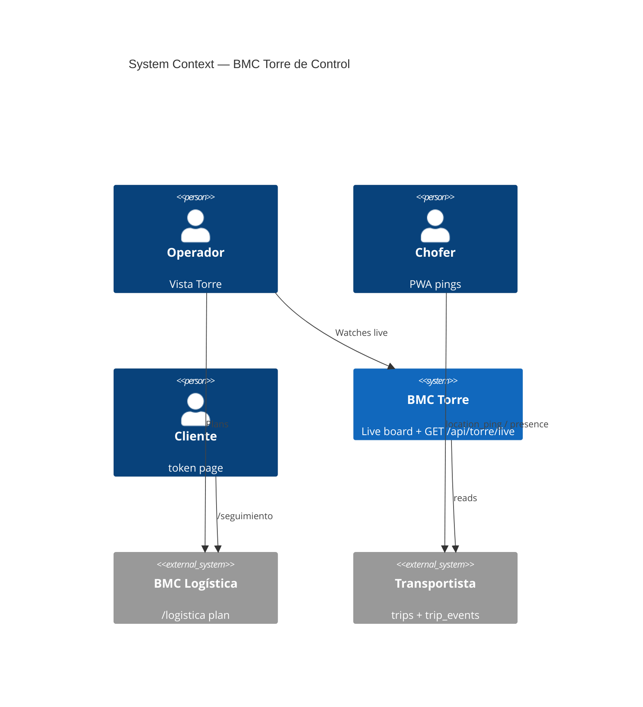
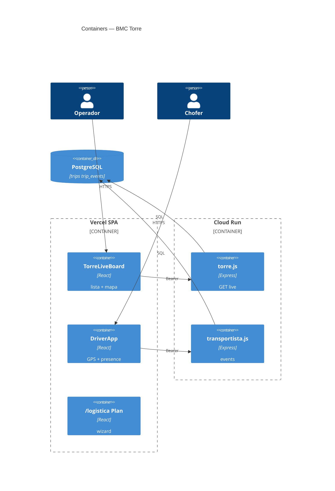
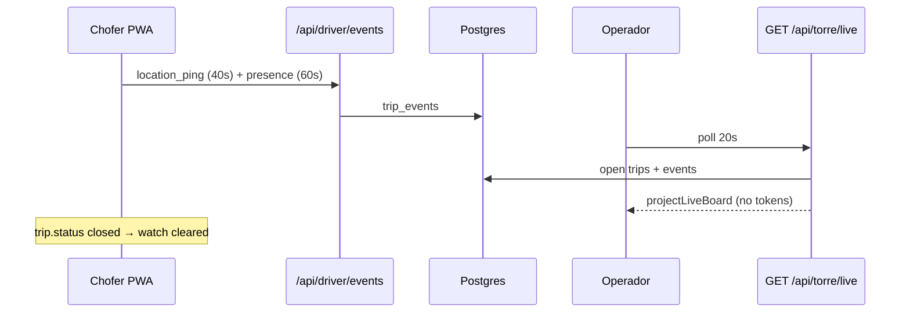

# System Design Document: BMC Torre de Control

Live ops mode of `/logistica`. Not a new Cloud Run service. Coordinations become a fleet board: GPS, presence, evidence. AI “airport tower” is Fase 4 HITL.

## 1. Introduction & Goals

### 1.1 Problem Statement

`/logistica` plans and confirms REPs. After confirm, ops had no live picture: who is logged in, where the truck is, which remitos arrived. Driver GPS pings existed in the PWA but `location_ping` was rejected by the FSM. Customers have a token page, not an Order ID desk. El Transportador helps packing, not live dispatch.

### 1.2 Goals

- **G1**: Confirmed trips appear on Torre (mapa + lista) with last ping and online if &lt; 90s.
- **G2**: Chofer GPS stops when the trip is `closed` (URCDP).
- **G3**: Same SPA/API; `/torre` aliases `?vista=torre`.
- **G4** (later): roster users, assign to app, Order ID, AI Torre HITL.

### 1.3 Stakeholders

| Role | Interest |
|------|----------|
| Operador | Live board without leaving logística |
| Chofer | PWA unchanged except GPS/presence policy |
| Cliente | Unchanged token privacy |
| Ingeniería | Pure projection + one router |

## 2. Context & Scope (C4 L1)

### External interfaces

| Interface | Dir | Protocol |
|-----------|-----|----------|
| `GET /api/torre/live` | ← | Bearer `API_AUTH_TOKEN` |
| `GET /api/torre/health` | ← | public module ping |
| `POST /api/driver/events` `location_ping` \| `presence` | ← | Bearer driver token |

## 3. Constraints

- Same Vite + Express + Postgres. No telematics vendor.
- ENV ≠ REP ≠ trip.
- Phone on the board is **tail 4 digits** only.
- GPS laboral limited to an open trip.
- AI side-effects HITL (Fase 4). Human gates stay.

## 4. Solution Strategy

Modular monolith. Pure projection `torreLiveView.js`. Server loads open trips + events. UI is a tab on the existing ops shell. PWA already sends pings; FSM now accepts them. Presence is a 60s heartbeat, ignored for projection of last_event.

## 5. Container View (C4 L2)

## 6. AI Architecture — Component View

**N/A (Fase 1)** — no LLM in Torre live board. El Transportador remains packing-only on `/logistica` Plan.  
**Evidence:** `rg` of `src/components/logistica/TorreLiveBoard.jsx` has no `callAi` / agent chat.  
**TARGET Fase 4:** identity `LOGISTICA_TOWER_IDENTITY`, tools propose-only, HITL apply. Do not reuse trucker packing tools.

## 7. Data Flow

## 8. Deployment View

| Piece | Host |
|-------|------|
| `/logistica?vista=torre` `/torre` | Vercel SPA |
| `GET /api/torre/live` | Cloud Run `panelin-calc` |
| Local | Vite `:5173` + Express `:3001` · `doppler run -- npm run dev:full` |
| Secrets (names) | `API_AUTH_TOKEN`, `DATABASE_URL`, `FRONTEND_BASE_URL` |

Tests: `node tests/torreLiveView.test.js` (in `test:core`).

## 9. Crosscutting Concepts

### 9.1 Security
Operator Bearer same as envíos. Driver events still session-scoped to one trip. Board strips full phone and tokens.

### 9.2 Reliability
No DB → 503. Closed trips excluded. GPS watch unmounts on `closed`.

### 9.3 Performance
Poll 20s ops / 40s GPS / 60s presence. Cap 80 open trips.

### 9.4 Observability
pino on torre load failure. Health `GET /api/torre/health`.

### 9.5 Cost
OSM tiles, no Google Matrix.

### 9.6 Sustainability
One extra SPA chunk; no native binary.

## 10. Architecture Decisions

### ADR-CT-01: Torre is a mode of `/logistica`

**Status**: Accepted  
**Context**: Ops already live in that shell.  
**Decision**: `?vista=torre` + alias `/torre`.  
**Alternatives**: new Cloud Run (rejected).

### ADR-CT-02: Identity hybrid (TARGET Fase 2)

**Status**: Proposed  
**Decision**: Flota = registered user; tercero = `?t=`. Trip token remains the trip grant.

### ADR-CT-03: Presence = last GPS ping &lt; 90s

**Status**: Accepted  
**Decision**: `TORRE_ONLINE_MS = 90000`. Presence event is extra heartbeat, not a vendor ELD.

### ADR-CT-04: AI Torre ≠ Transportador

**Status**: Accepted  
**Decision**: Fase 4 new identity. Fase 1 is N/A.

### ADR-CT-05: Customer projection unchanged

**Status**: Accepted  
**Decision**: Order ID lookup is Fase 3 alias of hashed token. No second GPS channel.

### ADR-CT-06: Route simulation does not rewrite executed stops

**Status**: Proposed  
**Decision**: `route_version` on apply HITL (Fase 4).

### ADR-CT-07: PWA stays

**Status**: Accepted  
**Decision**: Native only if background GPS becomes a fleet requirement.

## 11. Risks & Technical Debt

| Risk | Impact | Likelihood | Mitigation |
|------|--------|------------|------------|
| PWA kills GPS in background | Stale dots | High | Presence + 90s offline badge |
| `location_ping` was 400 before this change | Empty board | High | FSM allowlist + tests |
| Identity gap | Cannot assign to user | High | Fase 2 |
| AI directives without HITL | Safety / WA ban | Medium | CT-04, no tools until Fase 4 |

## 12. Glossary

| Term | Meaning |
|------|---------|
| Torre | Live ops vista of `/logistica` |
| Online | Last `location_ping` younger than 90s |
| Presence | Chofer heartbeat, not GPS |
| Plan | Packing wizard (not live) |
| Transportador | Packing HITL agent (not Torre) |
