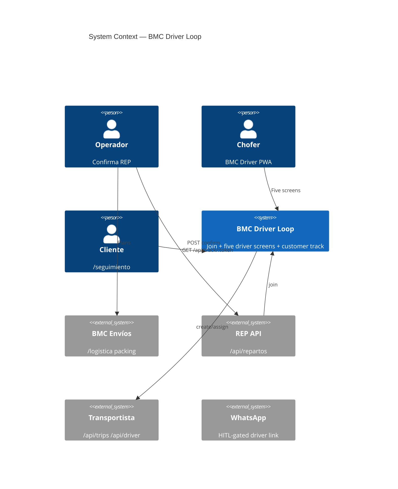
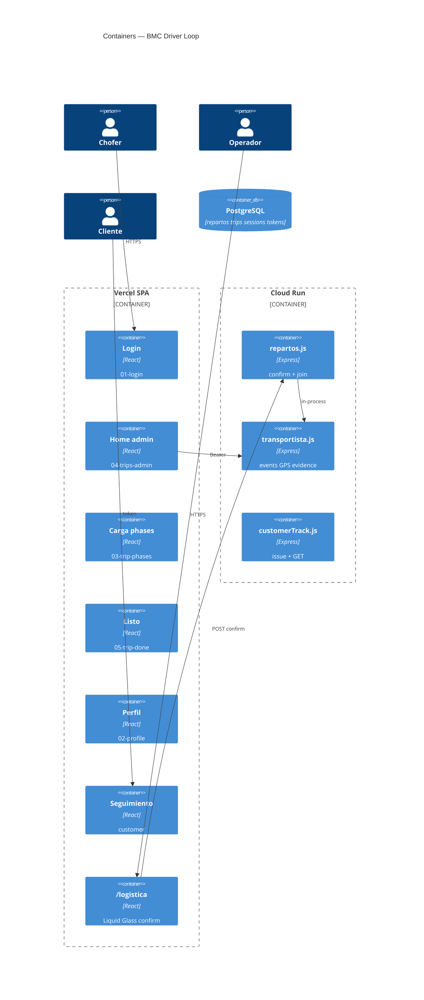
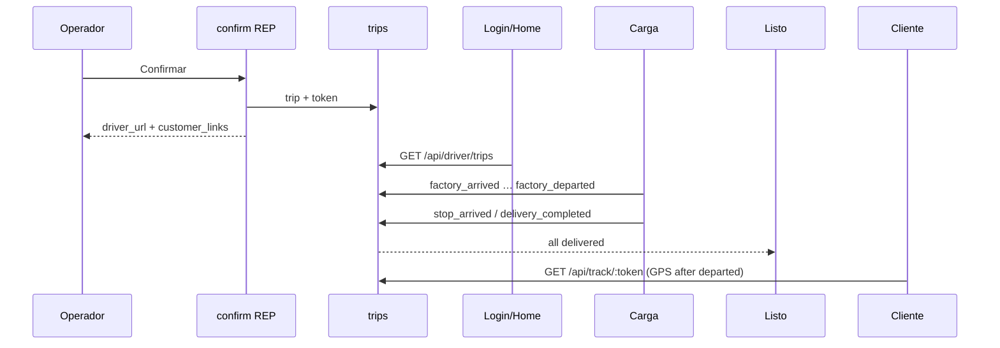

# System Design Document: BMC Driver Loop

Visual specs (login, profile, trip phases, trips admin, trip done) are integrated here and detailed in [`DESIGN-UI.md`](./DESIGN-UI.md).

## 1. Introduction & Goals

### 1.1 Problem Statement

`/logistica` plans REP batches. **As-built:** `POST /api/repartos/:id/confirm` runs `joinRepartoToTrip` and returns `driver_url` on the SPA (`/conductor?t=`). `/conductor` is a PWA island (no operator Shell). Five Outdoor Night screens exist as files; pixel-match vs mockups remains TARGET. Customer `/seguimiento/:token` is public. Sibling **Torre** (`bmc-control-tower`) reads the same `trip_events` for live ops.

### 1.2 Goals

- **G1**: Confirmar coordinación materializes a `trip` and `driver_url` (`/conductor?t=`).
- **G2**: BMC Driver PWA implements the five visual-spec screens, no operator chrome.
- **G3**: Factory/delivery events + GPS append to `trip_events`; REP `coordinado → en_curso → cerrado`.
- **G4**: Per-stop customer `/seguimiento/:token` at confirm.
- **G5**: Do not replace ENV drafts, packing, or ship a native store app.

### 1.3 Stakeholders

| Role | Interest |
|------|----------|
| Operador logística | Confirm → copy driver (and customer) links |
| Chofer | Five-screen PWA |
| Cliente obra | Token page |
| Ingeniería | One join module + tests |

## 2. Context & Scope (C4 L1)

### External interfaces

| Interface | Dir | Protocol |
|-----------|-----|----------|
| `POST /api/repartos/:id/confirm` | ← | Bearer `API_AUTH_TOKEN` |
| `/api/driver/*` | ← | Bearer driver token |
| `GET /api/track/:token` | ← | public, rate-limited |
| SPA `/conductor/*` | ← | PWA |

## 3. Constraints

- Same Vite + Express + Postgres. No new service.
- Three IDs: ENV ≠ REP ≠ trip (`bmc-envios` TARGET forbids replacing trips with drafts).
- Confirm immutable from `en_coordinacion` only.
- Local confirm without API does **not** mint trips.
- `FRONTEND_BASE_URL` for chofer links (SPA), not Cloud Run `PUBLIC_BASE_URL`.
- Auth for chofer is **opaque token**, not Hub Google password (login spec is visual; password field = token paste).

## 4. Solution Strategy

Modular monolith. Join **server-side** on confirm. Phone UI is a **route island** with Outdoor Night tokens. Magic link `?t=` is the real session; login mock is the empty-state chrome. Historical trip list is v1 = current session trip + timeline.

## 5. Container View (C4 L2)

## 6. AI Architecture — Component View

**N/A** — no LLM in Driver Loop.  
**Evidence:** `rg -i 'llm|openai|agent' src/components/driver` is empty. El Transportador / Torre AI stay on `/logistica`.

## 7. Data Flow

## 8. Deployment View

| Piece | Host |
|-------|------|
| `/conductor/*` `/seguimiento/:token` | Vercel SPA |
| `/api/repartos` `/api/driver` `/api/track` | Cloud Run `panelin-calc` |
| Postgres | `DATABASE_URL` |

## 9. Crosscutting Concepts

### 9.1 Security
Hashed driver + customer tokens. Login form does not create Hub users. Strip `?t=` after `localStorage`. Rate-limit public track GET.

### 9.2 Reliability
If trip insert fails after coordinado: `driver_loop: failed` + `POST /api/repartos/:id/driver-link` retry. Offline: IndexedDB outbox (already).

### 9.3 Performance
GPS throttle 40s while `shouldWatchGps(trip)` (not `closed`). Customer poll 20s. Customer GPS max age 30 min (`GPS_MAX_AGE_MS`).

### 9.4 Observability
pino `reparto_no`, `trip_id`, `driver_loop`.

### 9.5 Cost
OSM embed, not Google Matrix.

### 9.6 Sustainability
One SPA chunk for driver island; no native binary.

## 10. Architecture Decisions

### ADR-001: Join at `POST /api/repartos/:id/confirm`

**Status**: Accepted  
**Context**: Wizard already confirms there.  
**Decision**: Server-side `joinRepartoToTrip`.  
**Consequences**: + one gate. − local-only confirm has no chofer URL.

### ADR-002: Three identities ENV / REP / trip

**Status**: Accepted  
**Decision**: `plan_snapshot.reparto_id`; `payload.trip_id`.

### ADR-003: PWA five screens, not native app

**Status**: Accepted  
**Decision**: Implement visual specs as `/conductor/*`. Do not change global `start_url`.

### ADR-004: Driver WA HITL-default

**Status**: Accepted  
**Decision**: Always return `driver_url`. Outbox only if `notify_driver === true`.

### ADR-005: `driver_id` = UUID from phone (v1)

**Status**: Accepted (roster = TARGET Fase 2 Torre)  
**Context**: No driver table in v1.  
**Decision**: Deterministic UUID from E.164. `info.chofer_phone` on Flota.  
**Consequences**: + zero onboarding for terceros. − mock profile (licencia/mail) is chrome.  
**Alternatives**: `identity.users` rol chofer (hybrid, Torre T5); HR roster table.

### ADR-006: Customer tokens per delivery stop at confirm

**Status**: Accepted

### ADR-007: Conductor URL is SPA `/conductor`

**Status**: Accepted  
**Decision:** `conductorPublicUrl(frontendBaseUrl, token)`. Redirect `/calculadora/conductor`.

### ADR-008: REP status from driver events

**Status**: Accepted  
**Decision:** First factory event → `en_curso`. All deliveries done → `cerrado`.

### ADR-009: Outdoor Night visual language (not Liquid Glass)

**Status**: Accepted  
**Context**: Five mockups are dark navy + orange for outdoor/night driving. Operator Envíos is Liquid Glass.  
**Decision**: `--drv-*` tokens only on `/conductor`.  
**Consequences**: + matches specs. − two design systems in one SPA (isolated CSS).

### ADR-010: Login — trip token now; hybrid accounts TARGET

**Status**: Accepted (hybrid Proposed with Torre CT-02)  
**Context**: Mock shows Usuario/Contraseña. v1 security is opaque `?t=` from assign.  
**Decision**: v1 Usuario = display name. Contraseña = paste token. `?t=` auto-login. No password hash store yet.  
**TARGET**: hybrid — flota BMC registered (mail or phone + password + OTP reset); tercero keeps `?t=`. Trip token remains the grant for *that* trip.  
**Alternatives**: Google Hub login (rejected: bad in the yard). Password-only with no magic link (rejected: Saturday third-party).

### ADR-011: Home is the assigned session trip (inbox when registered)

**Status**: Accepted  
**Context**: Mock shows history; v1 API scopes one trip per token.  
**Decision**: v1 home = that trip + timeline. Inbox of assigned trips is TARGET when hybrid identity ships (Torre T6).

## 11. Risks & Technical Debt

| Risk | Impact | Likelihood | Mitigation |
|------|--------|------------|------------|
| Confirm vs trip insert split | No driver link | Medium | retry endpoint |
| Cloud Run URL in WA | Chofer lands on API | High | ADR-007 |
| Stop id not UUID | event insert fails | High | `ensureStopUuid` |
| Spec AR copy in UI | Wrong country | Medium | bind REP stops |
| Password expectation | Support confusion | Medium | helper text under Contraseña |

## 12. Glossary

| Term | Meaning |
|------|---------|
| BMC Driver | Chofer PWA `/conductor` |
| Outdoor Night | Dark navy + orange visual language |
| REP | Immutable coordinación batch |
| trip | Driver session row |
| Visual spec | The five attached mockups in `evidence/screens/` |
