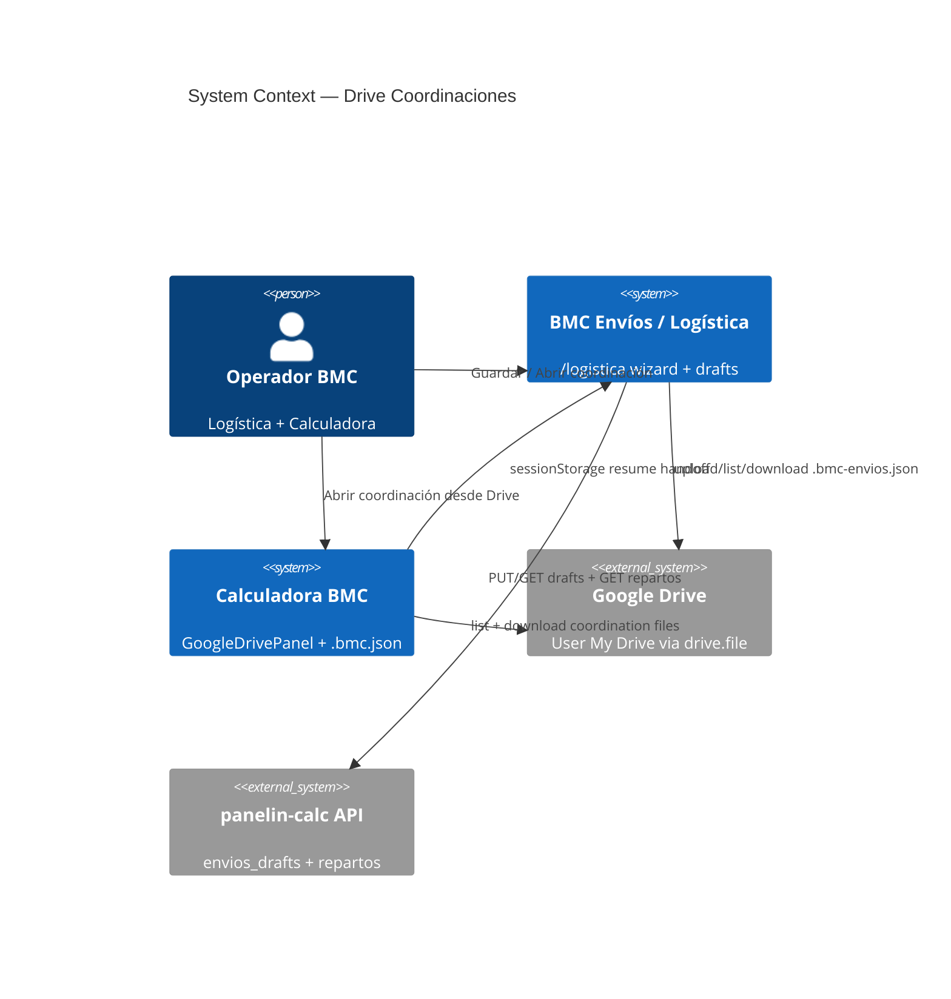
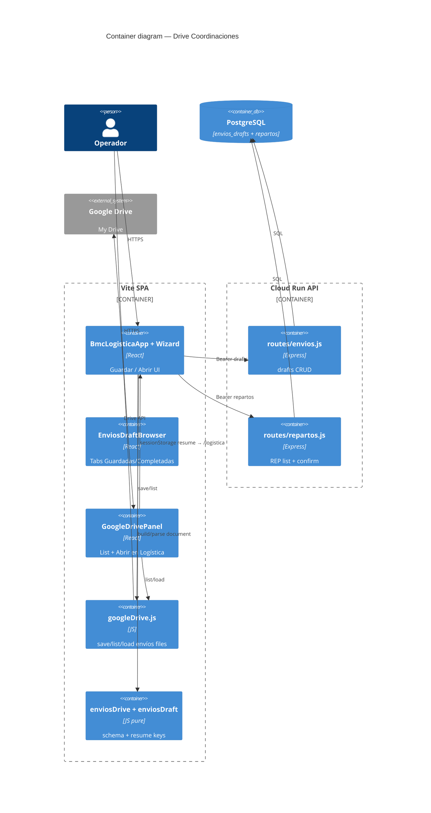
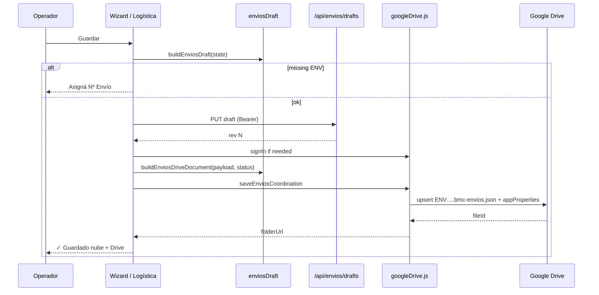
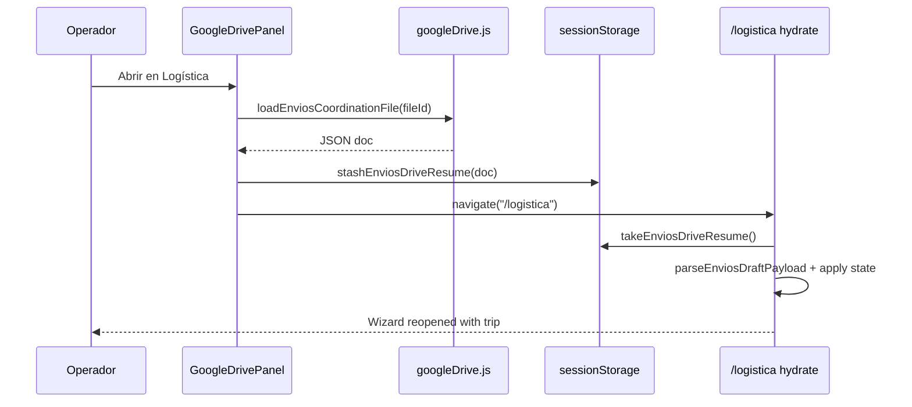

# System Design Document: Drive Coordinaciones

**Agent brief:** Persist `/logistica` trip state as resumable **`.bmc-envios.json`** in the operator’s Google Drive (same GIS client as Calculadora quotations). Open from Logística **or** Calculadora Drive panel → handoff to `/logistica`. Dual-write with Postgres drafts; do **not** invent a second OAuth stack or a courier SaaS.

**Status:** *As-Built* (UI + client Drive I/O + Calculadora open path). Server-side `DRIVE_REPARTOS_FOLDER_ID` tree materialization remains TARGET (see parent REP SDD phase 3).

---

## 1. Introduction & Goals

### 1.1 Problem Statement

Operators interrupt trip setup mid-wizard (pedidos → flota → levantes → ruta → carga). Postgres cloud drafts help multi-device, but operators already live in **Google Drive** for cotizaciones (`.bmc.json`). Without a Drive-backed, Calculadora-visible coordination file, they cannot resume logistics work from the same Drive panel used for quotes, nor keep an offline-shareable snapshot next to quotation folders.

### 1.2 Goals

| ID | Goal | Priority | Status |
|----|------|----------|--------|
| D1 | Explicit **Guardar** from wizard + Detalle Completo | P0 | **DONE** |
| D2 | Selectable open: **Guardadas** vs **Completadas** | P0 | **DONE** |
| D3 | Drive file `ENV-….bmc-envios.json` under canonical folder | P0 | **DONE** |
| D4 | Schema reuses `bmc-envios-draft-v1` (+ `coordination` meta) | P0 | **DONE** |
| D5 | Dual-write: Postgres draft + Drive (best-effort Drive) | P0 | **DONE** |
| D6 | Calculadora Drive panel lists + **Abrir en Logística** | P0 | **DONE** |
| D7 | Confirm coordinación → Drive status `completed` | P0 | **DONE** |
| D8 | Pure helpers + offline unit tests | P1 | **DONE** |
| D9 | Server OAuth archive to `DRIVE_REPARTOS_FOLDER_ID` | P2 | **TARGET** |
| D10 | Deep-link `?openEnvioDrive=<fileId>` like quotes | P2 | **TARGET** |

### 1.3 Stakeholders

| Role | Interest |
|------|----------|
| Operador logística | Save/resume trips without data loss |
| Comercial (Calculadora) | Open coordination from Drive next to quotes |
| Ingeniería BMC | One GIS Drive client; no secret sprawl |
| AI coding agents | Implement/extend from this SDD alone |

---

## 2. Context & Scope (C4 Level 1)



### External interfaces

| Interface | Direction | Protocol | Status |
|-----------|-----------|----------|--------|
| GIS OAuth (`drive.file`) | ↔ | Google Identity Services | CONFIRMED (shared w/ quotes) |
| Drive Files API v3 | ↔ | HTTPS | CONFIRMED `googleDrive.js` |
| `GET/PUT /api/envios/drafts/*` | ↔ | REST Bearer | CONFIRMED |
| `GET /api/repartos?status=` | → | REST Bearer | CONFIRMED |
| sessionStorage `bmc-envios-drive-resume-v1` | ↔ | JSON | CONFIRMED |
| Bridge `bmc-envios-bridge-v1` | ↔ | sessionStorage | CONFIRMED (orthogonal quote→ops) |
| Server `DRIVE_REPARTOS_FOLDER_ID` upload | → | Drive (service/user OAuth) | TARGET (path reserved on confirm) |

**In scope:** Client Drive persistence of full trip draft; Calculadora open→Logística resume; UI chrome on wizard.

**Out of scope:** Replacing `.bmc.json` quote format; company-wide service-account tree for every save; multi-tenant Drive sharing ACLs; PDF remito archive (separate).

---

## 3. Constraints

| Type | Constraint |
|------|------------|
| OAuth scope | `drive.file` only — app can only see files/folders it created |
| Auth UX | Same GIS client as Calculadora (`VITE_GOOGLE_CLIENT_ID`); Chrome for consent |
| Canonical folder | Always `Panelin BMC Cotizaciones / BMC Envíos Coordinaciones` (not per-user quote folder) |
| Identity | ENV number required before save (`draftIdFromEnvNo`) |
| Dual write | Cloud draft may succeed while Drive fails — surface both in toast |
| Secrets | No Drive refresh tokens in frontend; GIS access token in localStorage (existing quote trade-off) |
| Stack lock | ES modules; no new microservice |

---

## 4. Solution Strategy

- **Architecture style:** Modular monolith SPA — pure utils + thin UI wiring; reuse existing Drive client.
- **Key tech:** `googleDrive.js` (GIS + Drive v3), `enviosDrive.js` (schema/handoff), `enviosDraft.js` (payload SoT), Postgres drafts/repartos for multi-device list.
- **AI strategy:** N/A for this subsystem.
- **Trade-offs:**
  - Client Drive (user quota, same as quotes) vs server archive (TARGET D9).
  - Separate `.bmc-envios.json` vs embedding logistics inside `.bmc.json` (rejected — different lifecycle).
  - sessionStorage handoff Calculadora→Logística (same-origin, simple) vs query param deep-link (TARGET D10).

---

## 5. Container View (C4 Level 2)



### Key modules (as-built)

| Module | Path | Role |
|--------|------|------|
| Drive document helpers | `src/utils/logistica/enviosDrive.js` | filename, wrap meta, resume stash/take |
| Draft SoT | `src/utils/logistica/enviosDraft.js` | `bmc-envios-draft-v1` build/parse |
| Drive I/O | `src/utils/googleDrive.js` | `saveEnviosCoordination`, `listEnviosCoordinations`, `loadEnviosCoordinationFile` |
| Ops UI | `src/components/BmcLogisticaApp.jsx` | `saveCoordination`, `openCoordinationSelection`, wizard `headerActions` |
| Browser | `src/components/logistica/EnviosDraftBrowser.jsx` | tabs + cloud + Drive rows |
| Wizard chrome | `src/components/logistica/wizard/EnvioWizardShell.jsx` | `headerActions` slot |
| Calculadora | `PanelinCalculadoraV3_backup.jsx` + `GoogleDrivePanel.jsx` | list + open |

---

## 6. AI Architecture — Component View

**N/A** — No LLM, RAG, or agent runtime in this subsystem.  
**Evidence:** Drive path uses GIS + Drive REST only; no calls into `agentCore` / embeddings.

---

## 7. Data Flow

### 7.1 Save coordination (primary)



### 7.2 Open from Calculadora → Logística



### 7.3 Document shape (Drive)

```json
{
  "schema": "bmc-envios-draft-v1",
  "schemaVersion": 1,
  "savedAt": "ISO-8601",
  "info": { "numero": "ENV-…", "fecha": "YYYY-MM-DD", "transportista": "…" },
  "stops": [ ],
  "truckL": 12,
  "distributionMode": "balanced",
  "cargoLayoutMode": "auto",
  "freePositions": {},
  "ui": { "wizard": { }, "collapsedStopIds": [] },
  "coordination": {
    "status": "saved | completed",
    "statusLabel": "Guardada | Completada",
    "repartoNo": "REP-… | null",
    "label": "ENV-…",
    "savedAt": "ISO-8601",
    "resumableFrom": ["logistica", "calculadora"]
  }
}
```

### 7.4 Drive layout

```
Panelin BMC Cotizaciones/          ← APP_FOLDER_NAME (GIS-created)
  └── BMC Envíos Coordinaciones/   ← ENVIOS_DRIVE_FOLDER
        ├── ENV-260810-001.bmc-envios.json
        └── …
```

**appProperties** (private to OAuth client): `kind=bmc-envios`, `coordinationStatus`, `envNo`, optional `ownerEmail`.

**Status mapping:**

| Operator label | `coordination.status` / appProperties | Sources in browser |
|----------------|----------------------------------------|--------------------|
| Guardadas | `saved` | drafts + `repartos` `en_coordinacion` + Drive saved |
| Completadas | `completed` | `repartos` `coordinado` + Drive completed |

---

## 8. Deployment View

| Environment | Host | Notes |
|-------------|------|-------|
| Frontend | Vercel `calculadora-bmc.vercel.app` | SPA ships Drive client |
| API | Cloud Run `panelin-calc` | Drafts/repartos only; **not** required for Drive bytes |
| Local | Vite `:5173` + API `:3001` | Same GIS client id |
| Secrets (names only) | `VITE_GOOGLE_CLIENT_ID`, `VITE_BMC_API_AUTH_TOKEN` / `API_AUTH_TOKEN`, optional future `DRIVE_REPARTOS_FOLDER_ID` | Doppler `prd` |

**CI:** pure tests `node tests/enviosDrive.test.js` (+ existing `enviosDraft`); no live Drive in CI.

---

## 9. Crosscutting Concepts

### 9.1 Security

- Reuse GIS + `drive.file` (minimal scope).
- Draft/reparto APIs still require Bearer API token.
- Do not put service-account JSON in the browser.
- Resume key is same-origin sessionStorage (cleared on take).

### 9.2 Reliability

- Dual-write: toast when nube OK / Drive fail (and inverse messaging).
- Upsert by filename — re-save overwrites same ENV file.
- Confirm → `saveCoordination({ completed: true })` best-effort (`void`).

### 9.3 Performance

- List capped ~50 Drive files + 25 drafts / 25–30 repartos.
- No PDF generation on coordination save (JSON only).

### 9.4 Observability

- Operator-facing `autoLoadMsg` strings; no dedicated Drive telemetry yet.
- **TARGET:** optional cost/telemetry event `envios.drive.save` (not blocking).

### 9.5 Cost & sustainability

- User Drive quota (same as quotes); JSON payloads small vs PDF bundles.
- Prefer overwrite over proliferating revisions in Drive.

---

## 10. Architecture Decisions (ADRs)

### ADR-D01: Client GIS Drive for coordinations (not only Postgres)

**Status**: Accepted  
**Context**: Operators resume work from Calculadora Drive; PG alone is invisible there.  
**Decision**: Dual-write draft JSON to Drive via existing `googleDrive.js`.  
**Consequences**: + Calculadora visibility; − requires Google sign-in; dual-write failure modes.  
**Alternatives**: PG-only; server-only Drive archive.

### ADR-D02: Separate `.bmc-envios.json` from quotation `.bmc.json`

**Status**: Accepted  
**Context**: Quote project file is calculator state; logistics draft is stops/packing/wizard.  
**Decision**: Distinct extension + `schema: bmc-envios-draft-v1` + `isEnviosDriveDocument` detector.  
**Consequences**: + no pollute deserializeProject; − two file types in Drive UI.  
**Alternatives**: Embed `logistica` blob inside `.bmc.json` (rejected).

### ADR-D03: Canonical folder under APP_FOLDER_NAME (ignore per-user quote root)

**Status**: Accepted  
**Context**: Per-user quote folder diverged list vs save when Logística omitted `rootFolderId`.  
**Decision**: Always `Panelin BMC Cotizaciones/BMC Envíos Coordinaciones` (`rootFolderId: null`).  
**Consequences**: + single list SoT; − not inside custom quote folder.  
**Alternatives**: Mirror into configured quote folder (rejected for v1).

### ADR-D04: Calculadora → Logística via sessionStorage resume

**Status**: Accepted  
**Context**: Same SPA origin; avoid encoding large JSON in URL.  
**Decision**: `bmc-envios-drive-resume-v1` stash/take on navigate `/logistica`.  
**Consequences**: + simple; − lost if new tab without stash; no cross-device.  
**Alternatives**: `?openEnvioDrive=` deep-link (TARGET D10); server draft id only.

### ADR-D05: Soft Drive on REP confirm vs client completed flag

**Status**: Accepted (interim)  
**Context**: `SDD-REPARTO-COORDINACION` phase 3 server tree not wired.  
**Decision**: Client marks Drive file `completed` on confirm; server still stores `drivePlan` path only.  
**Consequences**: + operator-visible completed list; − no `_Repartos/YYYY/…` server folders yet.  
**Alternatives**: Block confirm until server Drive write (rejected).

---

## 11. Risks & Technical Debt

| Risk | Impact | Likelihood | Mitigation |
|------|--------|------------|------------|
| GIS not configured (`VITE_GOOGLE_CLIENT_ID`) | Drive save skipped | Med | Toast; nube still works |
| Partial OAuth scope | list/save 403 | Med | Existing reconnect Drive CTA |
| Dual-write inconsistency | Cloud ≠ Drive | Med | Re-save; LWW by operator |
| APP_FOLDER vs custom quote folder confusion | “Missing” files | Low | Document ADR-D03 in UI copy |
| Large free-drag payloads | Slow Drive upload | Low | Cap / prune TARGET |
| Server REP Drive tree unfinished | Legajo paths empty | High | D9 TARGET; client completed OK |
| Feature on feature branch not main | Prod lag | Med | Ship PR + PROJECT-STATE |

---

## 12. Glossary

| Term | Meaning |
|------|---------|
| `.bmc-envios.json` | Resumable logistics coordination file on Drive |
| `.bmc.json` | Calculadora quotation project file (orthogonal) |
| Guardada / Completada | Operator labels for `saved` / `completed` |
| ENV-… | Envío number; draft & Drive file id stem |
| REP-… | Reparto batch number (coordination confirm) |
| Dual-write | Postgres draft + Drive JSON on Guardar |
| Resume handoff | sessionStorage Calculadora → `/logistica` |
| `drive.file` | Google OAuth scope limited to app-created files |
| APP_FOLDER_NAME | `Panelin BMC Cotizaciones` |

---

## Appendix A — Evidence Index

| ID | Claim | Tag | Evidence |
|----|-------|-----|----------|
| E-D01 | Pure Drive helpers | **CONFIRMED** | `src/utils/logistica/enviosDrive.js` |
| E-D02 | Drive I/O API | **CONFIRMED** | `saveEnviosCoordination` / `list` / `load` in `googleDrive.js` |
| E-D03 | Wizard Guardar/Abrir | **CONFIRMED** | `BmcLogisticaApp` `headerActions` + `saveCoordination` |
| E-D04 | Browser tabs | **CONFIRMED** | `EnviosDraftBrowser.jsx` |
| E-D05 | Calculadora open | **CONFIRMED** | `GoogleDrivePanel` + `handleDriveLoadEnvio` |
| E-D06 | Unit tests | **CONFIRMED** | `tests/enviosDrive.test.js` |
| E-D07 | Confirm → completed | **CONFIRMED** | `confirmRepartoCoordination` → `saveCoordination({ completed: true })` |
| E-D08 | Server REP Drive tree | **TARGET** | `repartos.js` `drivePlan` note phase 3 |

### Verify

```bash
cd ~/calculadora-bmc
node tests/enviosDrive.test.js
node tests/enviosDraft.test.js
rg -n "saveEnviosCoordination|bmc-envios-drive-resume" src/
```

---

## Appendix B — Development checklist (DoD)

- [x] D1–D8 as-built in SPA  
- [ ] Merge/ship to `main` + Vercel if still on feature branch  
- [ ] Manual: Google sign-in → Guardar → see file in Drive folder → Abrir from Calculadora  
- [ ] D9 server `_Repartos/` materialization (optional follow-on)  
- [ ] D10 `?openEnvioDrive=` deep-link  

---

## Changelog

| Ver | Date | Notes |
|-----|------|-------|
| 1.0 | 2026-08-11 | Initial as-built SDD from reverse-engineering of Logística↔Calculadora Drive integration |
