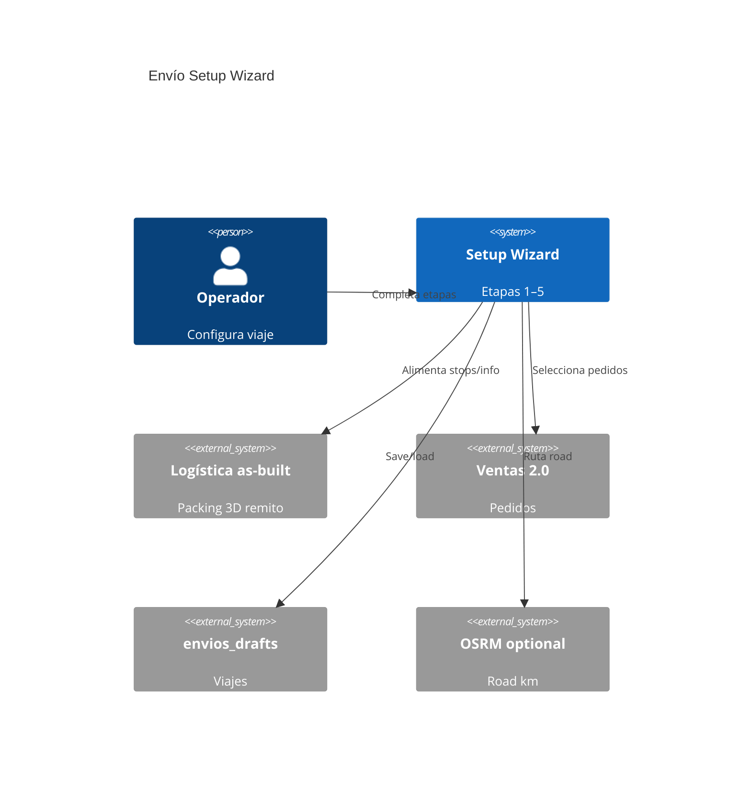

# System Design Document: Envío Setup Wizard

**Agent brief:** Progressive disclosure for **trip configuration** on `/logistica`, calculator-style stages. Reuse Ventas import, packing kernel, remito, Free-Drag 3D, reparto bar. Do **not** invent multi-tenant courier SaaS. Prefer pure modules under `src/utils/logistica/` + `src/components/logistica/wizard/*`. **Zero new business logic in `BmcLogisticaApp.jsx`** beyond mount/wire.

**Status:** *Draft 0.2* — design locked from plan v2 (pre-mortem + strict success criteria). Implementation = phases P1–P6 below.

---

## 1. Introduction & Goals

### 1.1 Problem Statement

`/logistica` as-built mixes pedidos, flota, packing, remito and 3D in one dense scroll. Operators need a **staged flow**: finish a stage → **summary strip** → open the next. Real UY panel logistics: **pickups at supplier yards** (often the same 2–3 places), transportista **departs near their base**, then deliveries. Multi-pickup exists but places are **recurrent**. Work is interrupted → **resume** drafts without silent data loss.

### 1.2 Goals

| ID | Goal | Priority | Status |
|----|------|----------|--------|
| W1 | Accordion: Pedidos → Flota → Levantes → Ruta → Carga | P0 | TARGET |
| W2 | Collapse-on-complete + summary + re-open edit | P0 | TARGET |
| W3 | Per-order pickup confirm; trip-level default levante | P0 | TARGET |
| W4 | Catalogs: pickups + bases + vehicles | P0 | TARGET |
| W5 | Seed Kingspan / Montfrío / Ecopaneles + “+ nuevo” | P0 | TARGET |
| W6 | Route suggest base → pickups → deliveries (+ manual) | P0 | TARGET |
| W7 | Trip storage: resume, list previous, no silent wipe | P0 | TARGET |
| W8 | Trackpad/mobile/tablet pointer interactions | P0 | TARGET |
| W9 | Autocarga + Ventas filters intact in Step Pedidos | P0 | TARGET |
| W10 | Compatible with REP / envios_drafts / free-drag | P1 | TARGET |
| W11 | Pure tests: wizardState + catalog + routeSuggest | P0 | TARGET |
| W12 | Real multi-stop trip faster than classic form | P1 | TARGET |

### 1.3 Stakeholders

| Role | Interest |
|------|----------|
| Operador logística | Clear progressive setup |
| Transportista | Base → first pickup leg clarity |
| Ingeniería BMC | Extracted modules + tests |
| AI agents | Implement from this SDD alone |

### 1.4 Out of scope

Multi-vehicle VRP · live GPS · Google Distance Matrix billing · rewriting packing/remito · microservicio ENV.

---

## 2. Context (C4 L1)



**As-built base (CONFIRMED):** `BmcLogisticaApp`, `envios_drafts`, Ventas filter/autocarga, `geocode`, packing SoT, reparto MVP.

---

## 3. Constraints

| Type | Constraint |
|------|------------|
| Stack | SPA + Express monolith; no new microservice |
| Draft | Additive fields only on `bmc-envios-draft-v1` |
| Catalog | `localStorage` `bmc-envios-catalog-v1` day-1 |
| UX | Spanish; sticky Continuar on mobile |
| DnD | Pointer Events — not HTML5-only |
| App size | No logic growth in `BmcLogisticaApp.jsx` |

---

## 4. Solution strategy

### 4.1 Operator journey

```text
[1 PEDIDOS]  multi-select Ventas → stops + autocarga
     ↓ summary “N pedidos · clientes…”
[2 FLOTA]    transportista + camión + base/salida
     ↓ summary “Nombre · Xm · base …”
[3 LEVANTES] default 1 levante · override · +nuevo
     ↓ summary “Kingspan ×2 …”
[4 RUTA]     base → pickups → deliveries
     ↓ summary “N legs · km/—”
[5 CARGA]    packing / 3D / remito / WA / REP (existing)
```

**UX law:** completed step = **one summary row**; one deep panel open; **Continuar** validates then advances.

**Default:** wizard ON for **new/empty ENV**; dense legacy drafts open **Vista clásica** unless toggled.

### 4.2 Step predicates (pure)

| Step | Complete when |
|------|----------------|
| pedidos | `stops.length ≥ 1` and each has `orderId` or `cliente` |
| flota | `transportista` + `truckL` + `basePointId` |
| levantes | every stop has `pickupPointId` (or default applied) |
| ruta | `route.orderedLegs.length ≥ 2` and all labeled |
| carga | optional (warnings OK) |

Module TARGET: `src/utils/logistica/wizardState.js`.

### 4.3 Catalogs

**Key:** `bmc-envios-catalog-v1`

```ts
type Place = {
  id: string;
  kind: "pickup" | "base";
  label: string;
  mapUrl?: string;
  addressText?: string;
  geo?: { lat: number; lng: number; source: string };
  aliases?: string[];
  transportistaId?: string;
  source: "seed" | "user";
  active: boolean;
  updatedAt: string;
};
```

**Seed (stable ids):**

| id | label | mapUrl |
|----|-------|--------|
| `pickup-kingspan-bromyros` | Kingspan (Bromyros) | https://share.google/hB23bPU3TqKfwWqgj |
| `pickup-montfrio` | Montfrío | https://share.google/PXF4UgHj9JDvvPZ9v |
| `pickup-ecopaneles` | Ecopaneles | https://share.google/mgM01AGG77M6Cgbxr |

**Merge:** `loadCatalog() = seed ∪ stored`; seed fills missing keys only; never delete `source: user`.

**Levantes:** default **Un solo levante para todos** ON; multi opt-in. Always **+ Nuevo punto**.

**Geo:** share.google may lack lat/lng day-1 — store URL + label; geocode/manual pin later; route legs without geo show “Falta geo”.

### 4.4 Route suggestion

```text
legs = [base]
for unique pickupPointId in stop order: legs += pickup
for delivery in deliveryOrder(stops): legs += delivery
```

- Haversine if all geo; else labels only + warn.  
- Manual reorder (Pointer Events).  
- Edit pedidos/levantes after ruta → `routeStale` until Recalcular.  
- OSRM when SDD-GEO-MAPS ready (optional).

Module TARGET: `src/utils/logistica/routeSuggest.js`.

### 4.5 Storage / resume

| Data | Store |
|------|--------|
| Trip | `bmc-logistica-online-v2` + `envios_drafts` |
| Wizard UI | `payload.ui.wizard` |
| Catalogs | `bmc-envios-catalog-v1` (shared across ENV) |

**Never** wipe catalogs on “nuevo envío”. Hydrate gate: never replace non-empty local stops with empty payload.

### 4.6 Components (TARGET)

| Component | Path |
|-----------|------|
| Shell | `src/components/logistica/wizard/EnvioWizardShell.jsx` |
| Steps | `StepPedidos.jsx`, `StepFlota.jsx`, `StepLevantes.jsx`, `StepRuta.jsx` |
| Catalog | `src/utils/logistica/pickupCatalog.js` |
| State | `src/utils/logistica/wizardState.js` |
| Route | `src/utils/logistica/routeSuggest.js` |

Step 5 = existing packing/remito views, not a rewrite.

---

## 5. Draft payload (additive)

```js
ui: {
  collapsedStopIds: [],
  wizard: {
    enabled: true,
    activeStep: "pedidos", // pedidos|flota|levantes|ruta|carga
    done: { pedidos: false, flota: false, levantes: false, ruta: false, carga: false },
    singlePickup: true,
    defaultPickupPointId: "pickup-kingspan-bromyros",
    routeStale: false,
  },
},
stops[].pickupPointId
stops[].pickupConfirmedAt
info.basePointId
info.vehicleId
route: { orderedLegs: [], suggestionSource: "haversine"|"osrm"|"manual", updatedAt }
```

Parse ignores unknown; missing wizard → classic layout.

---

## 6. Failure modes (must prevent)

| ID | Failure | Prevention |
|----|---------|------------|
| F1 | Continuar without data | Gate on predicates + missing chips |
| F2 | Edit step 1 drops pickups | Single draft object; no sibling reset without confirm |
| F3 | Multi-pickup chaos | Default single levante |
| F4 | No base | Flota incomplete without basePointId |
| F5 | share.google no coords | URL+label OK; warn on route |
| F6 | Seed clobbers user | Merge by id |
| F7 | truckL vs vehicle split | truckL + optional vehicleId |
| F8 | Cloud 409 mid-wizard | Existing conflict UI + wizard flags in payload |
| F9 | Classic/wizard split brain | Same state, presentation only |
| F10 | Mobile CTA covered | Sticky footer |
| F11 | Duplicate pedidos | Dedup orderId |
| F12 | REP before levantes | Warn or gate confirm |
| R* | Regress draft wipe / empty toast / HTML5 DnD / packing | Keep guards from prior ships |

---

## 7. ADRs

| ADR | Decision |
|-----|----------|
| **W01** | In-page accordion on `/logistica`, not new routes |
| **W02** | Catalogs in shared localStorage; draft holds refs only |
| **W03** | Default single levante; multi opt-in |
| **W04** | Pure route first; OSRM optional |
| **W05** | Wizard default for empty/new ENV; classic for dense legacy drafts |

---

## 8. Implementation phases

| Phase | Scope | Exit |
|-------|--------|------|
| **S0** | This SDD + TARGET W1–W12 | Done when file accepted |
| **P1** | pickupCatalog seed/merge + tests | Custom place survives reload |
| **P2** | Shell + Pedidos + Flota | Continuar + collapse + classic toggle |
| **P3** | Levantes single/multi + nuevo | Defaults + override |
| **P4** | routeSuggest + StepRuta + stale | Legs order tests |
| **P5** | Draft ui.wizard + Viajes list | Reload restores step |
| **P6** | Sticky CTA + polish + OSRM stub | Mobile/trackpad smoke |

---

## 9. Success criteria

### Automated

- A1 wizardState ≥8 cases  
- A2 catalog seed merge no clobber  
- A3 routeSuggest 1/2 pickups, missing geo  
- A4 draft round-trip keeps wizard + pickupPointId  
- A5 packing/ventasSheetMap/packageDims green  
- A6 no HTML5-only DnD in wizard lists  

### Operator (O1–O12)

New ENV → pedidos → flota → single/multi levante → +nuevo → ruta → reload → classic toggle → trackpad/tablet → remito includes pickup labels.

### Non-regression

`/logistica` 200 · autocarga filters · adjunto-fetch/match-quotes · free-drag · draft 409.

### Outcome targets

≤ ~3 min to “ruta lista” for 2-stop trained trip; 0 mis-assigned pickup in smoke week.

---

## 10. Glossary

| Term | Meaning |
|------|---------|
| **Levante / pickup** | Supplier yard load point (not delivery) |
| **Base / salida** | Transportista departure zone near depot |
| **ENV-…** | Trip/envio number |
| **REP-…** | Coordinated reparto batch (separate SDD) |
| **Vista clásica** | Pre-wizard dense form |

---

## 11. Open assumptions

1. share.google URLs acceptable without geo day-1.  
2. Camión = `truckL` (+ optional patente).  
3. Base last-used per transportista or manual.  
4. No new Doppler secrets for catalogs.  

---

## 12. Next agent prompt

```
Implement SDD-ENVIO-WIZARD.md phases P1 then P2.
Seed Kingspan/Montfrío/Ecopaneles. Pure modules + tests first.
Do not grow BmcLogisticaApp with business logic.
Do not break packing, autocarga, or envios_drafts.
```
