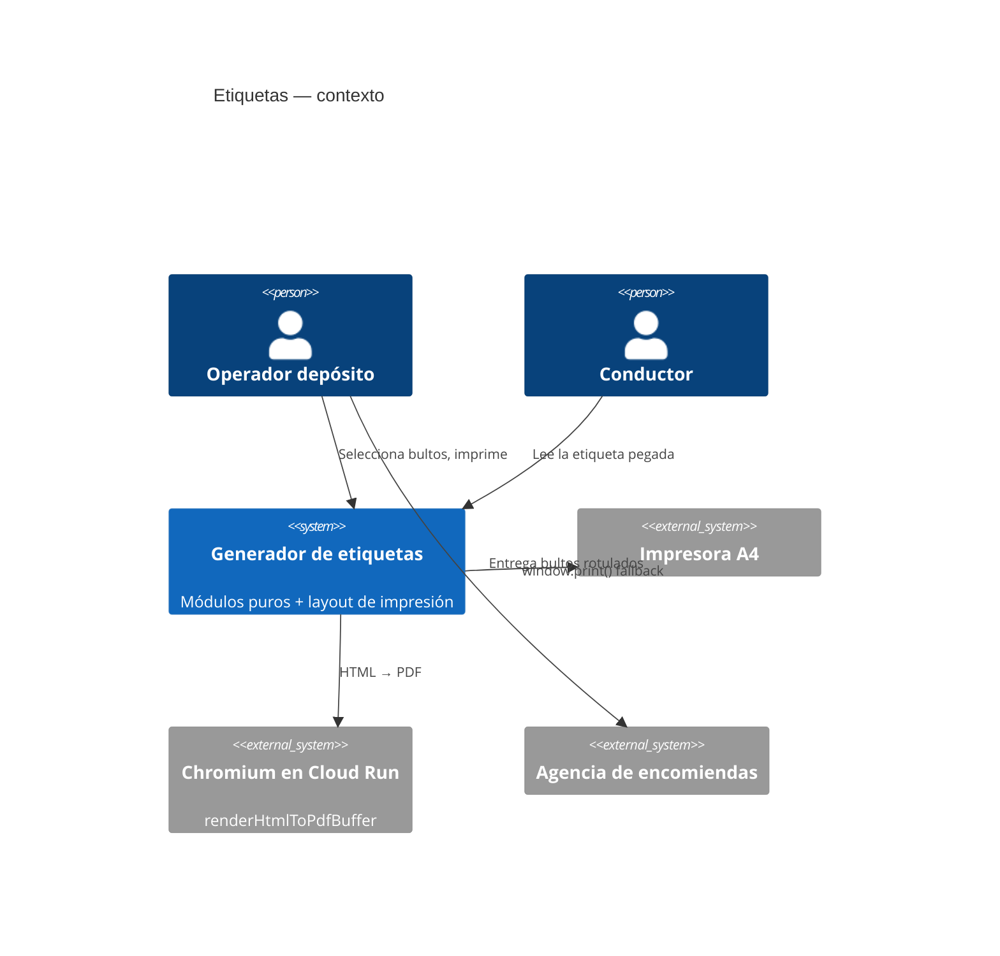

# System Design Document: Etiquetas de bulto y de encomienda

**Agent brief:** **no escribas una segunda numeración de bultos.** `packageBultoCounts()` ya calcula `k/N` por cliente con orden estable — reutilizalo tal cual. Tampoco recalcules dimensiones ni volumen: usá `packageCuboidMetrics()` y `packagePhysicalDims()`. Lo único genuinamente nuevo es el **modelo de etiqueta** y su **layout de impresión**. Los módulos puros van a `src/utils/logistica/`, la UI a `src/components/logistica/`.

**Status:** `TARGET` completo. Nada de este documento está implementado al 2026-08-08.

---

## 1. Introduction & Goals

### 1.1 Problem Statement

Hoy los bultos salen del depósito **sin rótulo**. La consecuencia práctica:

- En una entrega con varias paradas, el conductor identifica los bultos de cada cliente por memoria y por el plan de carga en papel.
- En envíos por agencia, el operador escribe los datos a mano sobre el paquete o pega un papel improvisado. Si el paquete se extravía o se devuelve, no hay datos de remitente legibles.
- No hay forma de saber, mirando un bulto suelto, a qué pedido pertenece ni cuántos bultos lo acompañan.

El sistema ya **sabe** todo eso — lo muestra en el visor 3D como etiqueta flotante — pero nunca lo imprime.

### 1.2 Goals

| ID | Objetivo | Criterio de aceptación |
|---|---|---|
| E1 | Imprimir etiquetas de bulto BMC para un reparto entero | Una hoja A4 con varias etiquetas, cortables |
| E2 | Numerar cada bulto dentro de su pedido | "1 de 3", "2 de 3", "3 de 3" — reutilizando `packageBultoCounts()` |
| E3 | Imprimir etiquetas de encomienda con remitente y destinatario completos | Cumple el rotulado que exigen las agencias uruguayas |
| E4 | Elegir cuántos bultos etiquetar sin depender de la estiba | El operador puede pedir N etiquetas para un pedido que no pasó por el visor |
| E5 | Cero hardware nuevo | Impresora A4 de oficina |
| E6 | Cero dependencias npm nuevas | Code128 en SVG puro |

### 1.3 Stakeholders

| Rol | Interés |
|---|---|
| Operador de depósito | Imprime y pega antes de cargar |
| Conductor | Identifica el bulto de un vistazo |
| Agencia de encomiendas | Necesita remitente y destinatario legibles |
| Cliente | Verifica que recibió todos los bultos |

### 1.4 Out of scope

- Integración por API con agencias (§7 explica por qué).
- Impresora térmica de rollo. La arquitectura la admite (§5.4) pero la primera entrega es A4.
- Códigos QR — fase 2, ver §5.5.
- Trazabilidad por escaneo. Las etiquetas llevan código de barras, pero **no hay lector ni endpoint de escaneo** en esta fase.

---

## 2. Context & Scope (C4 Level 1)



---

## 3. Constraints

| # | Restricción | Origen |
|---|---|---|
| C1 | Hoja A4, impresora común | Decisión de producto 2026-08-08 |
| C2 | Sin dependencias npm nuevas | `CLAUDE.md` — `npm audit fix --force` prohibido; toda dep suma superficie |
| C3 | La numeración `k/N` no se duplica | `packageIdentity.js` es la fuente única |
| C4 | Módulos puros, testeables sin DOM | ADR-012 |
| C5 | La etiqueta de agencia debe llevar datos completos de remitente | Requisito de las agencias: son los datos que se usan si el envío se devuelve |
| C6 | Imprimible sin servidor | `window.print()` debe funcionar aunque Chromium esté caído |

---

## 4. Solution Strategy

1. **Modelo puro → HTML → impresión.** `buildLabelModel()` produce una estructura serializable; `renderLabelSheetHTML()` la convierte en HTML autocontenido; la impresión usa Chromium o el navegador.
2. **Reutilizar la identidad de bulto existente.** `packageBultoCounts()` ya resuelve E2 completo.
3. **Dos plantillas, un mismo motor de hoja.** Etiqueta BMC y etiqueta de encomienda comparten grilla, márgenes y líneas de corte; cambia el contenido.
4. **Cantidad desacoplada de la estiba.** Se puede etiquetar desde `placed[]` (bultos ya estibados) **o** desde una cantidad que tipea el operador. E4 exige lo segundo.
5. **Catálogo de agencias con el patrón ya probado.** `pickupCatalog.js` resuelve exactamente este problema para plantas de levante (seed + custom del usuario en `localStorage`, sin pisar lo del usuario). Se replica.

---

## 5. Component View — diseño

### 5.1 Módulos nuevos (`TARGET`)

| Archivo | Exports | Responsabilidad |
|---|---|---|
| `src/utils/logistica/labelModel.js` | `buildBultoLabels()`, `buildEncomiendaLabels()`, `expandLabelCount()` | Modelo puro de etiqueta |
| `src/utils/logistica/labelSheet.js` | `paginateLabels()`, `LABEL_SHEET_PRESETS` | Paginación en la grilla A4 |
| `src/utils/logistica/barcode128.js` | `code128Svg()` | Code128-B en SVG puro |
| `src/utils/logistica/agencyCatalog.js` | `SEED_AGENCIES`, `mergeAgencies()`, … | Catálogo de agencias |
| `src/components/logistica/LabelSheetView.jsx` | default | UI de selección + previsualización + imprimir |

### 5.2 Modelo de etiqueta

```js
/**
 * @typedef {object} BultoLabel
 * @property {"bmc"|"encomienda"} kind
 * @property {string}  code          // ID legible del bulto, ej "REP-2026-08-08-003-P07"
 * @property {number}  index         // k
 * @property {number}  total         // N
 * @property {string}  repartoNo
 * @property {string}  pedido
 * @property {string}  cliente
 * @property {string}  [contenido]   // "Panel techo 50mm × 6"
 * @property {string}  [dims]        // "6.00 × 1.15 × 0.05 m"
 * @property {number}  [volumenM3]
 * @property {number}  [stopOrden]
 * @property {Remitente}    [remitente]    // solo encomienda
 * @property {Destinatario} [destinatario] // solo encomienda
 * @property {string}  [agencia]
 * @property {string}  [observaciones]
 */
```

`buildBultoLabels({ repartoNo, stops, placed })` — arma las etiquetas desde la estiba:

1. `packageBultoCounts(placed)` → `Map<stableKey, {index, total, groupKey, stopId}>` (`CONFIRMED` `packageIdentity.js:25`).
2. Por cada bulto colocado, resolver su parada y componer `cliente` / `pedido`.
3. Dimensiones y volumen con `packageCuboidMetrics()` (`CONFIRMED` `remitoPackageMetrics.js:14`) y formato con `formatM()` / `formatM3()` (`:42`, `:34`).

`expandLabelCount({ base, count })` — resuelve **E4**: dado un molde y una cantidad N, devuelve N etiquetas con `index` 1..N y `total = N`. Es el camino para un pedido que va por agencia y nunca pasó por el visor 3D. Ejemplo: 3 paquetes → "1 de 3", "2 de 3", "3 de 3".

> **Invariante:** `buildBultoLabels` **no recalcula** `k/N`. Si `packageBultoCounts` no tiene entrada para un bulto, la etiqueta sale sin numeración antes que con una numeración inventada.

### 5.3 Layout A4

```
LABEL_SHEET_PRESETS = {
  "a4-2x4": { cols: 2, rows: 4, w: "95mm",  h: "63mm", page: "A4" },  // default
  "a4-1x2": { cols: 1, rows: 2, w: "190mm", h: "130mm", page: "A4" }, // bultos grandes
}
```

```css
@page { size: A4; margin: 8mm; }
@media print {
  .np { display: none !important; }
  .label-sheet { page-break-after: always; }
  .label { break-inside: avoid; }
}
.label-sheet { display: grid; grid-template-columns: repeat(var(--cols), 1fr); gap: 0; }
.label { border: 0.4pt dashed #94a3b8; padding: 6mm; }
```

El borde punteado es la línea de corte. `paginateLabels(labels, preset)` reparte en hojas de `cols × rows`.

### 5.4 Camino de impresión

Idéntico al que ya usa el remito (`CONFIRMED` `BmcLogisticaApp.jsx:1679`):

1. **Primario** — HTML autocontenido → `renderHtmlToPdfBuffer()` (`CONFIRMED` `server/lib/quotePdf.js:164`). Como `preferCSSPageSize: true` está activo (`:216`), el `@page` de la plantilla se respeta sin tocar nada del servidor. Esto es también lo que dejaría lista la impresora térmica de rollo el día que se quiera: alcanza con un preset con `@page { size: 100mm 150mm }`.
2. **Fallback** — `window.print()` con el mismo CSS. Funciona sin servidor.

> **Advertencia de seguridad `CONFIRMED`:** `POST /api/pdf/generate` (`server/routes/pdf.js:32`) **no tiene auth** y acepta HTML arbitrario. Las etiquetas de encomienda llevan nombre, dirección y teléfono de clientes. Si se usa la ruta HTTP, debe crearse una **ruta dedicada con auth** que importe `renderHtmlToPdfBuffer` directamente — que es además el patrón ya usado por `calc.js:42` y `quoteExport.js:23`. No hacer round-trip por `/api/pdf/generate`.

### 5.5 Código de barras

Se compara honestamente el costo de cada opción:

| Opción | Costo | Veredicto |
|---|---|---|
| **Code128-B en SVG puro** | ~120 LOC, cero dependencias, testeable puro | ✅ **Elegida** (ADR-026) |
| QR con librería (`qrcode`) | Dependencia nueva + bundle | Fase 2 |
| Sin código | Cero costo, cero trazabilidad futura | Rechazada |

`code128Svg(text, { height, moduleWidth })` devuelve un `<svg>` como string, embebible tanto en el HTML de impresión como en el fallback del navegador. Codifica `label.code`.

No hay lector ni endpoint de escaneo en esta fase: el código existe para que la trazabilidad sea posible después sin reimprimir nada.

---

## 6. AI Architecture

**N/A.** El etiquetado es determinístico de punta a punta. No hay modelo, prompt ni inferencia.

---

## 7. Encomiendas — agencias y qué se puede integrar

### 7.1 Qué se investigó

Las agencias habituales para envíos al interior de Uruguay son **DAC / Agencia Central**, **Turil** y **Nossar**.

Hallazgos relevantes para el diseño:

- **Rotulado obligatorio.** Los envíos deben estar correctamente embalados y rotulados con los datos del remitente — nombre completo, dirección y teléfono — porque **son los datos que se usan si el envío se devuelve**. Esto justifica el bloque REMITENTE de §7.3.
- **Flujo de etiqueta de DAC.** El sistema de DAC genera la etiqueta, la envía por correo al remitente, y este la imprime y la pega. O sea: **el modelo de "imprimir y pegar" es el estándar del mercado**, no un workaround nuestro.
- **DAC ofrece etiquetado como servicio tercerizado** (impresión y aplicación de etiquetas con datos del destinatario, códigos de barra y precios) — es un servicio comercial, no una API.
- **No hay API pública.** No existe documentación de desarrollador ni endpoint abierto de generación de etiquetas. Su plataforma dice integrarse con los principales carritos de e-commerce, pero por acuerdo comercial. Los canales publicados son teléfono 1717, `infodac@dac.com.uy` y WhatsApp.

### 7.2 Decisión

**Generamos nuestras propias etiquetas.** No se toma dependencia de ninguna agencia. Nuestra etiqueta acompaña al bulto y contiene todo lo que la agencia necesita para procesarlo y para devolverlo si hace falta.

Queda como **tarea de investigación comercial, no técnica**: contactar a DAC para saber si existe integración disponible para su plataforma de e-commerce y en qué condiciones. Si algún día existe, se suma como emisor alternativo sin tocar el modelo de etiqueta.

### 7.3 Contenido de la etiqueta de encomienda

```
┌────────────────────────────────────────────┐
│  BMC · METALOG SAS            [3 de 5]     │
│  Agencia: DAC — Agencia Central            │
├────────────────────────────────────────────┤
│  REMITENTE                                 │
│  METALOG SAS (BMC Uruguay)                 │
│  <dirección>                               │
│  Tel: <teléfono>   Contacto: <nombre>      │
├────────────────────────────────────────────┤
│  DESTINATARIO                              │
│  <nombre del cliente>                      │
│  <dirección>                               │
│  <localidad>, <departamento>               │
│  Tel: <teléfono>                           │
├────────────────────────────────────────────┤
│  Pedido: <nº>      Reparto: <REP-…>        │
│  Contenido: <descripción>                  │
│  Obs: <observaciones>                      │
│  ‖‖│‖││‖‖│‖ REP-2026-08-08-003-P07         │
└────────────────────────────────────────────┘
```

> **Supuesto declarado.** El pedido original (transcripción de audio) mencionaba «teléfono, contacto de …». Se interpretó como **nombre, teléfono y contacto de quien remite** — el remitente. Coincide con lo que exigen las agencias. Si la intención era el contacto del **destinatario**, ambos bloques ya están en la etiqueta y el cambio es de énfasis visual, no de modelo.

Los datos de BMC como remitente salen de configuración, nunca hardcodeados (`CLAUDE.md`).

### 7.4 Catálogo de agencias

Réplica del patrón de `pickupCatalog.js` (`CONFIRMED`): seed inmutable + entradas del usuario en `localStorage`, con merge que **nunca pisa** lo que agregó el usuario.

```js
export const SEED_AGENCIES = Object.freeze([
  { id: "agencia-dac",     label: "DAC — Agencia Central", aliases: ["dac", "agencia central"], source: "seed", active: true },
  { id: "agencia-turil",   label: "Turil",                 aliases: ["turil"],                  source: "seed", active: true },
  { id: "agencia-nossar",  label: "Nossar",                aliases: ["nossar"],                 source: "seed", active: true },
]);
```

---

## 8. Data model

Las etiquetas son **derivadas**: se recalculan siempre desde `placed[]` + `stops[]`. **No se persisten como filas.**

Lo que sí conviene registrar es el hecho de haberlas emitido, en `reparto_documents` — la tabla que hoy existe y nunca se escribe (`CONFIRMED` `server/lib/enviosDb.js:79`, único SELECT en `repartos.js:203`):

| Columna | Valor |
|---|---|
| `kind` | `"etiquetas"` |
| `name` | `"Etiquetas REP-2026-08-08-003 (12 bultos)"` |
| `stop_id` | `null` si es del reparto entero, o el id de la parada |
| `drive_file_id` / `drive_url` | si se archiva el PDF |

Marcado `TARGET`: el escritor se especifica en `SDD-REMITO-CLIENTE.md` §8, compartido entre ambos documentos.

---

## 9. Crosscutting

| Aspecto | Nota |
|---|---|
| **Seguridad** | Las etiquetas de encomienda contienen datos personales. No usar la ruta PDF sin auth (§5.4) |
| **Confiabilidad** | Fallback `window.print()` si Chromium no está |
| **Performance** | Generación puramente cliente; un reparto típico no pasa de decenas de etiquetas |
| **Accesibilidad** | La etiqueta es un artefacto impreso; la UI de selección sigue el contrato de `DESIGN-UI.md` |
| **Costo** | Cero: sin dependencias, sin servicios externos |

---

## 10. ADRs

Ver **ADR-026** en el SDD padre (`SDD.md` §10).

---

## 11. Riesgos

| Riesgo | Impacto | Mitigación |
|---|---|---|
| Code128 propio con bug de codificación | Alto — código ilegible | Tests con vectores conocidos contra checksum de referencia |
| Márgenes de impresora recortan la etiqueta | Medio | Márgenes generosos de 8 mm y previsualización antes de imprimir |
| Datos de remitente hardcodeados | Medio | Vienen de config (C5 del SDD padre) |
| Etiqueta pegada a un bulto reestibado | Medio | El `code` incluye el reparto; reimprimir si se reestiba |
| Deriva entre `k/N` de la etiqueta y del visor | Alto | **Fuente única**: `packageBultoCounts()` |

---

## 12. Fases de implementación

| Fase | Contenido | DoD |
|---|---|---|
| **F1** | `labelModel.js` + `labelSheet.js` + tests | `buildBultoLabels` y `expandLabelCount` con cobertura; `k/N` idéntico al del visor |
| **F2** | `barcode128.js` + tests con vectores conocidos | SVG válido y checksum correcto |
| **F3** | `LabelSheetView.jsx` + botón "Etiquetas" en `/logistica` | Imprime A4 2×4 desde la estiba |
| **F4** | `agencyCatalog.js` + plantilla de encomienda | Etiqueta con remitente y destinatario completos |
| **F5** | Ruta PDF con auth + registro en `reparto_documents` | Emisión trazable |

---

## 13. Gherkin — criterios de aceptación

```gherkin
Escenario: Tres bultos de un pedido se numeran 1 de 3, 2 de 3, 3 de 3
  Dado un pedido con 3 bultos colocados en el camión
  Cuando el operador imprime etiquetas de bulto
  Entonces cada etiqueta muestra "k de 3" con k de 1 a 3
  Y la numeración coincide exactamente con la del visor 3D

Escenario: Etiquetar sin pasar por la estiba
  Dado un pedido que se envía por agencia y no fue estibado
  Cuando el operador indica "3 paquetes"
  Entonces se generan 3 etiquetas numeradas 1 de 3, 2 de 3 y 3 de 3

Escenario: La etiqueta de encomienda lleva remitente completo
  Dado un envío a Tacuarembó por DAC
  Cuando el operador imprime la etiqueta de encomienda
  Entonces la etiqueta muestra el bloque REMITENTE con razón social, dirección y teléfono de BMC
  Y muestra el bloque DESTINATARIO con nombre, dirección, localidad, departamento y teléfono

Escenario: Impresión sin servidor
  Dado que el renderizador de PDF no está disponible
  Cuando el operador imprime etiquetas
  Entonces el navegador abre el diálogo de impresión con el mismo layout
```

## Changelog

| Versión | Fecha | Cambio |
|---|---|---|
| 0.1 | 2026-08-08 | Diseño inicial: modelo de etiqueta, layout A4, Code128 propio, catálogo de agencias, investigación de encomiendas. |
