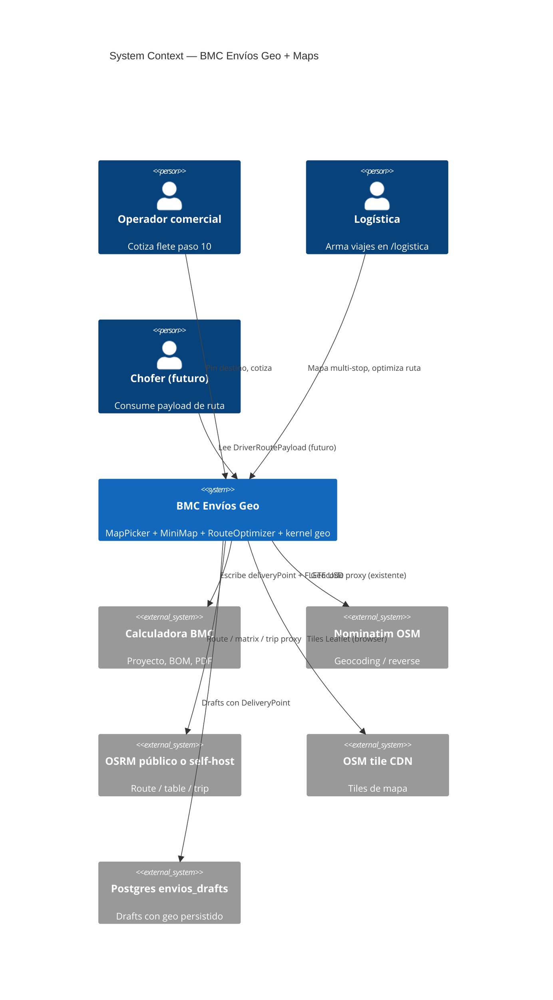
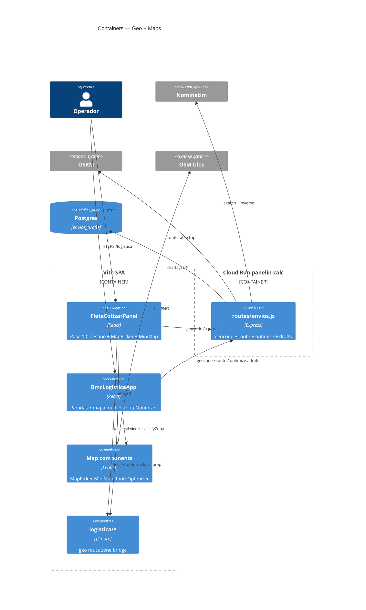
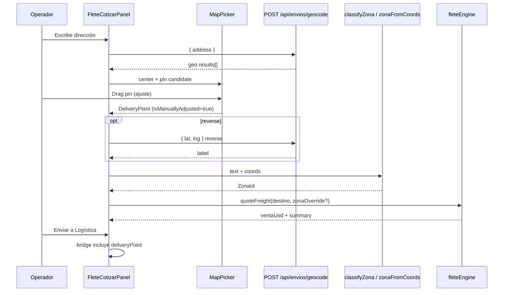
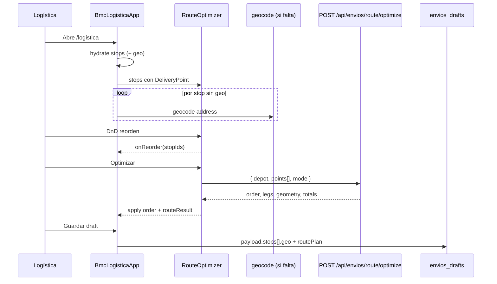

# System Design Document: BMC Envíos — Geolocalización y Mapas

**Agent brief:** Extiende el módulo **BMC Envíos** ya shipped (Flete 10/11 + `/logistica` + `POST /api/envios/geocode`). No inventar un microservicio de courier. Preferir componentes reutilizables (`MapPicker`, `MiniMap`, `RouteOptimizer`) y pure utils en `src/utils/logistica/`. Stack mapas: **Leaflet + OSM tiles + OSRM** (sin billing day-1); Google/Mapbox solo si ya hay clave y ADR explícito.

**Estado as-built (base):**

| Capacidad | Estado | Evidencia |
|-----------|--------|-----------|
| Geocode Nominatim (UY) vía API | **CONFIRMED** | `POST /api/envios/geocode`, `server/routes/envios.js` |
| Pure geo helpers | **CONFIRMED** | `src/utils/logistica/geocode.js` |
| `stop.geo` + `mapLink` + haversine legs | **CONFIRMED** | `toStopGeo`, `tripLegDistances`, `BmcLogisticaApp` |
| Parse lat,lng / Maps URL | **CONFIRMED** | `parseLatLng` |
| Paso 10: solo texto destino | **CONFIRMED** | `FleteCotizarPanel` (sin mapa) |
| Mapa interactivo multi-marker / rutas | **TARGET** | este SDD (P2c + P2b) |
| Distance Matrix / TSP road | **TARGET** | P2b vía OSRM (no Google day-1) |

> **Estado de implementación al 2026-08-08 — verificado.** Nada de las §8–§12 de este documento está implementado. Confirmado por búsqueda en todo el repo: **cero** ocurrencias de `OSRM`, `Distance Matrix`, `Mapbox` u `openrouteservice` en `src/` y `server/`; `routeSuggest.js:4` sigue diciendo *"OSRM hook later (SDD-GEO-MAPS)"*; `RouteMapVisualizer.jsx` dibuja una proyección SVG sin tiles de cartografía. El as-built sigue siendo **Nominatim + haversine**, o sea distancias en línea recta que **subestiman sistemáticamente** el kilometraje real. Inventario completo en [`SDD-LOGISTICA-REVISION-2026-08-08.md`](./SDD-LOGISTICA-REVISION-2026-08-08.md) §7.4.

---

## 0. Resumen ejecutivo

### Problema

Hoy el destino del flete se clasifica por **texto** (`classifyZona`) y en ops el geocode es **MVP** (botón + haversine “km aire”). Falta:

1. **Quote (paso 10):** pin en mapa, ajuste manual, persistencia de lat/lng + link, miniatura en previews, y coordenadas fiables para costos.
2. **Ops (`/logistica`):** mapa con todos los pedidos, reorden de ruta visual, optimización, tiempos/distancias de **camino real**, y payload listo para futura app de choferes.

### Solución en una frase

Unificar un **DeliveryPoint** canónico (address + lat/lng + mapsLink + flags) consumido por el wizard y por ops; renderizar con **Leaflet**; enrutar/optimizar con **OSRM** (proxy backend); reutilizar tres componentes UI.

### Entregables de este documento

1. Arquitectura + data flow  
2. Modelos de datos actualizados  
3. UI/UX (wireframes textuales)  
4. Flujos de usuario  
5. Plan de implementación por fases  
6. Integración con API existente  

---

## 1. Introduction & Goals

### 1.1 Problem Statement

BMC cotiza flete en el wizard (paso **Flete 10/11**) y opera paradas en `/logistica`. El geocode P2 ya resuelve dirección→coords vía Nominatim y guarda `stop.geo`, pero:

- En **cotización**, el operador solo escribe texto; no ve ni corrige el pin; la zona se infiere por regex de texto, no por coordenadas.
- En **ops**, no hay mapa multi-pedido ni ruta optimizada por camino real; solo km aéreos y links externos a Google Maps.
- La futura **app de choferes** necesita un contrato estable de puntos + secuencia de ruta + ETAs.

### 1.2 Goals (SMART)

| ID | Goal | Priority | Métrica |
|----|------|----------|---------|
| **G-GEO-1** | Paso 10: geocode por texto **o** pin en mapa con drag/ajuste | P0 | 100% cotizaciones con destino no-retiro tienen lat/lng o flag “manual pending” |
| **G-GEO-2** | Persistencia canónica: address + lat + lng + mapsLink + isManuallyAdjusted | P0 | Round-trip quote→bridge→ops sin re-geocode |
| **G-GEO-3** | MiniMap en lista previa; click abre MapPicker | P1 | Preview muestra pin en ≤300ms (tile cache) |
| **G-GEO-4** | Costos de flete usan coords (zona por punto + opcional km ruta) | P1 | `classifyZona` + `classifyZonaFromCoords` coherentes; tests golden |
| **G-GEO-5** | Ops: mapa con todos los markers + clustering | P0 | 50 stops fluidos (≥30 fps en laptop ops) |
| **G-GEO-6** | RouteOptimizer: DnD orden + optimización OSRM | P0 | Ruta con distance/duration por leg y total |
| **G-GEO-7** | Contrato `DriverRoutePayload` listo (sin app móvil aún) | P2 | JSON exportable + OpenAPI sketch |

### 1.3 Stakeholders

| Rol | Interés |
|-----|---------|
| Operador comercial | Cotizar flete con pin confiable sin salir del wizard |
| Logística / despacho | Ver todos los pedidos en mapa, armar viaje, tiempos reales |
| Conductor (futuro) | Secuencia + ETA + link navegación |
| Ingeniería BMC | Componentes reutilizables, sin billing forzado, tests puros |
| AI coding agents | Spec ejecutable desde este SDD |

### 1.4 Out of scope (esta ola)

- App nativa de choferes (solo **contrato de datos**)  
- Tracking GPS en vivo / isochrones  
- Sustituir tarifa panel-zona por pricing por km (requiere ADR comercial separado)  
- Google Maps JS SDK / Mapbox billing (salvo ADR futuro)  
- Multi-vehículo VRP completo (solo 1 trip + reorden + nearest/TSP simple vía OSRM)

---

## 2. Context & Scope (C4 Level 1)



### Interfaces externas

| Interface | Dirección | Protocolo | Estado |
|-----------|-----------|-----------|--------|
| `POST /api/envios/geocode` | → Nominatim | HTTPS + auth | **CONFIRMED** (extender reverse) |
| `POST /api/envios/route` | → OSRM | HTTPS + auth | **TARGET** |
| `POST /api/envios/route/optimize` | → OSRM trip/table | HTTPS + auth | **TARGET** |
| OSM tiles | browser → CDN | HTTPS | **TARGET** (client) |
| Bridge `bmc-envios-bridge-v1` | quote → ops | sessionStorage | **CONFIRMED** (extender geo) |
| `envios_drafts.payload` | ↔ PG | JSON | **CONFIRMED** (schema geo) |
| Google Maps link out | → | deep link | **CONFIRMED** (`mapsCoordsUrl`) |

---

## 3. Constraints

| Tipo | Constraint |
|------|------------|
| Stack UI | React 18 + Vite; Leaflet preferido (`react-leaflet` o wrapper propio) |
| Backend | Express en Cloud Run `panelin-calc` — **mismo** router `envios.js` |
| Auth | Geocode/route con `API_AUTH_TOKEN` / `VITE_BMC_API_AUTH_TOKEN` |
| Costo | Sin Google billing day-1; OSRM público tiene límites → rate-limit + cache |
| Dominio | Uruguay; bias `countrycodes=uy`; planta base Colonia Nicolich (configurable) |
| Performance | Clustering a partir de ~20 markers; lazy-load Leaflet |
| Responsive | MapPicker usable en 390px (mobile ops) y desktop |
| No romper | Tarifas panel-zona existentes; haversine queda como fallback labeled “km aire” |
| SoT pure | Lógica de zona/ruta/optimización en `src/utils/logistica/*` testeable offline |

---

## 4. Solution Strategy

| Decisión | Elección | Razón |
|----------|----------|-------|
| Map library | **Leaflet + OSM** | Zero cost, maduro, cluster plugins, ADR-015 compatible |
| Routing | **OSRM** (`/route/v1`, `/table/v1`, `/trip/v1`) | Road distance/duration sin Google; proxy server-side |
| Geocoding | **Nominatim** (ya shipped) + reverse geocode | Consistencia con P2 |
| Optional upgrade | Google Distance Matrix / Places | Solo si billing existe + ADR-017 supersede |
| Architecture | Modular monolith SPA + thin API proxies | No microservicio |
| UI reuse | `MapPicker` · `MiniMap` · `RouteOptimizer` | Quote + Ops + futuro chofer |
| Costos flete | Mantener tarifa zona; **refinar zona por coords** + mostrar km ruta como **info** | No cambiar pricing comercial sin ADR aparte |

### Trade-offs aceptados

| + | − |
|---|---|
| Sin factura Maps | Calidad geocode Nominatim variable en rural UY |
| OSRM open | Endpoint público rate-limited; self-host opcional post-MVP |
| Pin manual | Operador puede poner pin erróneo → flag `isManuallyAdjusted` + checklist |
| Dual distancia | UI debe etiquetar “km ruta” vs “km aire” |

---

## 5. Architecture — Container View (C4 L2)



### Paths canónicos (TARGET)

| Pieza | Path |
|-------|------|
| MapPicker | `src/components/maps/MapPicker.jsx` |
| MiniMap | `src/components/maps/MiniMap.jsx` |
| RouteOptimizer | `src/components/maps/RouteOptimizer.jsx` |
| Map shell (Leaflet bootstrap) | `src/components/maps/BmcMap.jsx` |
| Cluster helper | `src/components/maps/markerCluster.js` |
| Geo pure (extend) | `src/utils/logistica/geocode.js` |
| DeliveryPoint | `src/utils/logistica/deliveryPoint.js` **NEW** |
| Route pure | `src/utils/logistica/routeEngine.js` **NEW** |
| Zona por coords | `src/utils/logistica/zonaFromCoords.js` **NEW** |
| Depot config | `src/utils/logistica/depot.js` **NEW** |
| API | `server/routes/envios.js` (extender) |
| CSS | `src/styles/bmc-maps.css` |
| Tests | `tests/deliveryPoint.test.js`, `routeEngine.test.js`, `zonaFromCoords.test.js` |

---

## 6. Component View (C4 L3)

### 6.1 Componentes UI reutilizables

#### `MapPicker`

| | |
|--|--|
| **Propósito** | Elegir/ajustar un único punto de entrega |
| **Usado en** | Paso 10 (modal o panel expandido); detalle de stop en ops |
| **Props** | ver §2 modelos `MapPickerProps` |
| **Comportamiento** | Search box → geocode; click mapa → set pin; drag pin → `isManuallyAdjusted=true`; reverse geocode opcional al soltar; botones “Centrar Uruguay / Planta / Mi ubicación” |
| **Output** | `DeliveryPoint` vía `onChange` |

#### `MiniMap`

| | |
|--|--|
| **Propósito** | Thumbnail estático/interactivo-lite del pin |
| **Usado en** | Lista de stops; preview wizard; bridge confirmation |
| **Props** | `point`, `size` (sm/md), `onClick` |
| **Comportamiento** | Sin pan/zoom pesado; un marker; click → abre MapPicker o panel |
| **Performance** | Un solo tile zoom fijo o `L.map` con `dragging:false`; compartir instancia tile layer vía cache |

#### `RouteOptimizer`

| | |
|--|--|
| **Propósito** | Mapa multi-marker + lista ordenable + optimización de ruta |
| **Usado en** | `/logistica` tab/panel “Ruta” |
| **Props** | `stops: DeliveryStop[]`, `depot`, `onReorder`, `onOptimize`, `routeResult` |
| **Comportamiento** | Markers numerados por orden; polyline de ruta; panel lateral con legs (km, min, ETA); DnD lista (reusa `stopReorder`); botón “Optimizar orden”; export “Abrir en Google Maps multi-stop” + `DriverRoutePayload` |
| **Clustering** | `leaflet.markercluster` cuando `stops.length >= 20` |

#### `BmcMap` (interno)

Wrapper Leaflet: center UY default `[-32.5, -56]`, zoom 7; attribution OSM; night mode token si `data-appearance=night`.

### 6.2 Kernel pure

| Módulo | Responsabilidad |
|--------|-----------------|
| `deliveryPoint.js` | Normalize, validate, merge, mapsLink, bridge serialize |
| `geocode.js` | Existente + reverse helpers client-side prep |
| `routeEngine.js` | Decode polyline, legs UI model, ETA from duration, optimize client prep, fallback haversine |
| `zonaFromCoords.js` | Polígonos/bboxes bounding boxes UY → `ZonaId` |
| `depot.js` | Planta BMC lat/lng + label (config) |
| `stopReorder.js` | Ya existe — RouteOptimizer lo consume |

---

## 7. Data Flow

### 7.1 Quote — Paso 10: texto → pin → cotizar



### 7.2 Ops — Mapa multi + optimizar ruta



### 7.3 Fallback degradado

| Fallo | Comportamiento |
|-------|----------------|
| Nominatim down | Parse lat,lng de mapLink; pin manual; toast “geocode offline” |
| OSRM down | `tripLegDistances` haversine + label **“km aire (aprox.)”**; sin polyline |
| Sin auth token | MapPicker solo pin local (coords manuales); no geocode server |
| Tile lento | Placeholder gris + coords numéricas siempre visibles |

---

## 8. Modelos de datos actualizados

### 8.1 `DeliveryPoint` (canónico)

```ts
/** Punto de entrega / geolocalización persistible */
type DeliveryPoint = {
  /** Dirección escrita por el operador (fuente de verdad textual) */
  address: string;
  /** WGS84 */
  lat: number;
  lng: number;
  /** Deep link Google Maps (u OSM) para humanos / WA */
  mapsLink: string;
  /** OSM place_id o provider id — opcional */
  placeId?: string | null;
  /** true si el pin se movió a mano o se pegaron coords */
  isManuallyAdjusted: boolean;
  /** display_name del geocoder o reverse */
  label?: string | null;
  /** nominatim | reverse | manual | maps_url | osrm_snap */
  source?: "nominatim" | "reverse" | "manual" | "maps_url" | "osrm_snap" | string;
  /** ISO timestamp última resolución */
  resolvedAt?: string;
  /** accuracy hint en metros si el provider la da */
  accuracyM?: number | null;
};
```

**Reglas de normalización** (`normalizeDeliveryPoint`):

1. `lat`/`lng` finitos y en rango; si no → `null` (punto incompleto).  
2. `address` trim; vacío permitido si hay coords (pin-only).  
3. `mapsLink` = `mapsCoordsUrl(lat,lng,label||address)` si falta.  
4. `isManuallyAdjusted` default `false`; se fuerza `true` en drag pin o source `manual`/`maps_url`.  
5. Inmutabilidad: helpers retornan copias.

### 8.2 Compatibilidad con as-built `stop.geo`

Hoy (**CONFIRMED**):

```js
stop.geo = { lat, lng, label, source, at }
stop.mapLink = "https://www.google.com/maps/..."
stop.direccion = "..."
```

**Migración no destructiva:**

```ts
// stop shape extendido
type Stop = {
  // ...campos existentes
  direccion: string;
  mapLink: string;
  geo: {
    lat: number;
    lng: number;
    label?: string | null;
    source?: string;
    at?: string;
    placeId?: string | null;
    isManuallyAdjusted?: boolean; // NEW
    accuracyM?: number | null;    // NEW
  } | null;
  // opcional denormalizado para query rápida
  deliveryPoint?: DeliveryPoint | null; // TARGET — o computado via toDeliveryPoint(stop)
};
```

Helpers:

```js
toDeliveryPoint(stop) → DeliveryPoint | null
applyDeliveryPointToStop(stop, point) → stop  // set geo + mapLink + direccion + checks.mapaOk
fromLegacyGeo(geo, address, mapLink) → DeliveryPoint
```

`toStopGeo` se mantiene; se extiende para pasar `isManuallyAdjusted` y `placeId`.

### 8.3 Proyecto / wizard (paso 10)

```ts
// proyecto (calculator state) — campos nuevos
proyecto.deliveryPoint?: DeliveryPoint | null;
// legacy sigue:
proyecto.direccion, proyecto.departamento, proyecto.localidad, proyecto.zona
```

Al cotizar:

```js
destinoText = join([deliveryPoint?.address || proyecto.direccion, ...])
zona = zonaFromCoords(lat,lng) ?? classifyZona(destinoText)
```

### 8.4 Bridge quote → ops

Extender `bmc-envios-bridge-v1`:

```ts
type BridgePayloadV1 = {
  v: 1;
  // ...existente panels, destino, quote summary
  destino: string;
  deliveryPoint?: DeliveryPoint | null; // NEW
};
```

`mergeBridgeIntoStops`: si hay `deliveryPoint`, aplicar a stop importado sin re-geocode.

### 8.5 `RoutePlan` (ops + futuro chofer)

```ts
type RouteLeg = {
  fromStopId: string | null; // null = depot
  toStopId: string | null;
  fromLabel: string;
  toLabel: string;
  distanceM: number;
  durationS: number;
  distanceKm: number;   // rounded 0.1
  durationMin: number;  // rounded 1
  etaIso?: string;      // si hay departureAt
  geometry?: string;    // encoded polyline opcional por leg
};

type RoutePlan = {
  version: 1;
  provider: "osrm" | "haversine_fallback";
  mode: "driving";
  depot: { lat: number; lng: number; label: string };
  stopOrder: string[];          // stop ids en orden de visita
  optimized: boolean;           // true si vino de /optimize
  isManualOrder: boolean;       // true si DnD post-optimización
  legs: RouteLeg[];
  totalDistanceM: number;
  totalDurationS: number;
  geometry?: string;            // full polyline
  computedAt: string;
  departureAt?: string | null;  // planificado
  notes?: string;
};

/** Export para futura app choferes */
type DriverRoutePayload = {
  v: 1;
  envNo?: string;
  vehicle?: { plate?: string; label?: string };
  route: RoutePlan;
  stops: Array<{
    id: string;
    order: number;
    cliente: string;
    phone?: string;
    deliveryPoint: DeliveryPoint;
    packagesSummary?: string;
    status?: string;
    notes?: string;
  }>;
  navigationUrl: string; // Google multi-stop or OSM
};
```

Persistir en draft:

```json
{
  "stops": [ /* ... con geo extendido */ ],
  "routePlan": { /* RoutePlan */ },
  "depot": { "lat": -34.77, "lng": -56.02, "label": "Planta BMC · Colonia Nicolich" }
}
```

### 8.6 Depot (planta)

```js
// src/utils/logistica/depot.js
export const BMC_DEPOT = {
  lat: -34.7705,   // TARGET — validar con ops (INFERRED)
  lng: -56.0230,
  label: "BMC Planta · Colonia Nicolich",
  address: "Colonia Nicolich, Canelones, Uruguay",
};
```

> **Acción humana:** confirmar lat/lng exactos de planta antes de ship; hasta entonces configurable vía env `VITE_BMC_DEPOT_LAT/LNG`.

### 8.7 Zona por coordenadas

```ts
// zonaFromCoords.js
type ZonaId =
  | "retiro"
  | "ciudad_costa"
  | "mvd"
  | "canelones"
  | "maldonado_corredor"
  | "especial";

/** Bounding boxes / simple polygons (WGS84) — pure, versioned */
classifyZonaFromCoords(lat, lng): ZonaId | null
// null → caller cae a classifyZona(text)
```

**Política:** coords ganan si caen en bbox confiable; si `null`, texto. Distancia a depot < umbral (ej. 3 km) → `retiro` opcional (config).

### 8.8 API contracts (extensión)

#### Existente — `POST /api/envios/geocode`

```json
// request
{ "address": "Av. Italia 1234, Montevideo" }
// o
{ "lat": -34.9, "lng": -56.1, "label": "..." }

// response
{
  "ok": true,
  "geo": {
    "lat": -34.9,
    "lng": -56.1,
    "label": "...",
    "source": "nominatim",
    "at": "2026-08-07T12:00:00.000Z",
    "placeId": "12345",
    "isManuallyAdjusted": false
  },
  "results": [ /* hasta 5 */ ]
}
```

**Extensión TARGET:**

| Campo body | Efecto |
|------------|--------|
| `reverse: true` + lat/lng | Reverse geocode Nominatim |
| response `placeId` | Mapear `osm_id` / `place_id` Nominatim |

#### Nuevo — `POST /api/envios/route`

```json
// request
{
  "points": [
    { "lat": -34.77, "lng": -56.02 },
    { "lat": -34.90, "lng": -56.15 },
    { "lat": -34.85, "lng": -55.99 }
  ],
  "overview": "full",
  "geometries": "polyline"
}

// response
{
  "ok": true,
  "provider": "osrm",
  "distanceM": 45210,
  "durationS": 3120,
  "geometry": "encoded...",
  "legs": [
    { "distanceM": 12000, "durationS": 900 },
    { "distanceM": 33210, "durationS": 2220 }
  ]
}
```

#### Nuevo — `POST /api/envios/route/optimize`

```json
// request
{
  "depot": { "lat": -34.77, "lng": -56.02 },
  "points": [
    { "id": "s1", "lat": -34.9, "lng": -56.15 },
    { "id": "s2", "lat": -34.85, "lng": -55.99 }
  ],
  "roundtrip": false,
  "source": "first",
  "destination": "any"
}

// response
{
  "ok": true,
  "provider": "osrm",
  "order": ["s2", "s1"],
  "distanceM": 40100,
  "durationS": 2800,
  "geometry": "...",
  "legs": [ /* depot→s2, s2→s1 */ ]
}
```

**Fallback server:** si OSRM falla → `provider: "haversine_fallback"`, order = input order (o nearest-neighbor pure), legs haversine, `durationS` estimado a 50 km/h promedio UY.

#### Health

```json
// GET /api/envios/health
{
  "ok": true,
  "module": "envios",
  "geocode": true,
  "route": true,
  "routeProvider": "osrm",
  "draftsDb": true
}
```

---

## 9. UI/UX detallado (wireframes textuales)

### 9.1 Calculadora — Paso 10 (Flete)

```
┌─ Paso 10/11 · Flete ─────────────────────────────────────────┐
│  ○ Retiro en planta                                          │
│                                                              │
│  Destino / dirección                                         │
│  ┌────────────────────────────────────┐  [Geocodificar]      │
│  │ Ruta 9 km 12, Punta del Este       │                      │
│  └────────────────────────────────────┘                      │
│                                                              │
│  ┌─ MiniMap (click para ajustar) ──────────────────────────┐ │
│  │  [==== mapa 280×140 ====]  📍 pin                       │ │
│  │  -34.95821, -54.94210                                   │ │
│  │  🔗 Abrir en Maps · ✏️ Ajustar en mapa                   │ │
│  │  badge: [Automático] | [Ajustado a mano]                │ │
│  └─────────────────────────────────────────────────────────┘ │
│                                                              │
│  Zona detectada: maldonado_corredor  ·  confiable ✓          │
│  [Cotizar flete]   Flete USD: 280                            │
│  [Enviar a Logística]                                        │
└──────────────────────────────────────────────────────────────┘
```

**Modal MapPicker (click “Ajustar” o MiniMap):**

```
┌─ Ubicar punto de entrega ──────────────────────── [X] ──┐
│  Buscar: [________________________] [Buscar]            │
│  Resultados:                                            │
│   • Punta del Este, Maldonado, UY                       │
│   • …                                                   │
│  ┌────────────────────────────────────────────────────┐ │
│  │                                                    │ │
│  │           Leaflet map · drag 📍                    │ │
│  │                                                    │ │
│  └────────────────────────────────────────────────────┘ │
│  Lat/Lng: [-34.9582] [-54.9421]  [Usar mi ubicación]    │
│  ☐ Forzar pin (no reverse al soltar)                    │
│  [Cancelar]                          [Confirmar punto]  │
└─────────────────────────────────────────────────────────┘
```

### 9.2 Ops — `/logistica` panel Ruta

```
┌─ Logística ── [Paradas] [Carga 3D] [Ruta ★] [Remito] ────────┐
│  Depot: BMC Planta · Colonia Nicolich                        │
│  [Optimizar ruta] [Recalcular] [Export chofer JSON] [Maps↗]  │
│                                                              │
│  ┌─ Lista orden (DnD) ──┐  ┌─ Mapa multi ─────────────────┐ │
│  │ ≡ 1 Cliente A        │  │  🏭 depot                    │ │
│  │   MiniMap · 12.4 km  │  │   ①──②──③ polyline           │ │
│  │ ≡ 2 Cliente B        │  │  markers cluster si >20      │ │
│  │ ≡ 3 Cliente C        │  │                              │ │
│  │                      │  │                              │ │
│  └──────────────────────┘  └──────────────────────────────┘ │
│                                                              │
│  Resumen ruta: 87.3 km ruta · 1 h 42 min · 3 paradas         │
│  Legs:                                                       │
│   Planta → A   28.1 km · 32 min · ETA 09:32                  │
│   A → B        41.0 km · 48 min · ETA 10:20                  │
│   B → C        18.2 km · 22 min · ETA 10:42                  │
│  provider: osrm · optimized: yes · manualOrder: no           │
└──────────────────────────────────────────────────────────────┘
```

### 9.3 Estados visuales

| Estado | UI |
|--------|-----|
| Sin geo | MiniMap placeholder “Sin ubicación” + CTA Geocodificar |
| Geocoding | Spinner en botón; mapa deshabilitado |
| Ajustado a mano | Badge ámbar “Ajustado” |
| Ruta OK | Polyline azul BMC `#003366` |
| Ruta fallback | Polyline punteada + chip “km aire” |
| Stop seleccionado | Marker resaltado + lista scrollIntoView |

### 9.4 Responsive

| Breakpoint | Layout |
|------------|--------|
| ≥1024px | Split lista 360px + mapa flex |
| 768–1023 | Stack: mapa 40vh + lista |
| <768 | Mapa full-width 50vh; lista abajo; MapPicker fullscreen sheet |

### 9.5 Accesibilidad

- Controles de lat/lng numéricos siempre (no solo mapa).  
- Keyboard: confirmar/cancelar en modal.  
- `prefers-reduced-motion`: sin pan animado.  
- Contraste markers sobre tiles (borde blanco).

---

## 10. Flujos de usuario

### F1 — Cotizar con dirección escrita

1. Operador completa datos de proyecto (o escribe en paso 10).  
2. Click **Geocodificar** (o debounce 600 ms tras blur).  
3. Sistema llama API → pin en MiniMap.  
4. Si el pin cae mal → **Ajustar** → drag → `isManuallyAdjusted=true`.  
5. **Cotizar flete** usa zona (coords→zona o texto).  
6. PDF/BOM recibe FLETE USD como hoy.  
7. **Enviar a Logística** incluye `deliveryPoint` en bridge.

### F2 — Cotizar solo con pin (sin dirección clara)

1. Abre MapPicker vacío.  
2. Click en mapa o “Mi ubicación”.  
3. Reverse geocode rellena `address`/`label` si disponible.  
4. Confirma → cotiza.

### F3 — Ops: ver todos los pedidos en mapa

1. Carga draft / Ventas / stops.  
2. Tab **Ruta**: markers de todos los con geo; sin geo → listados en “Pendientes de ubicar”.  
3. Click marker → selecciona stop (panel detalle existente).

### F4 — Reordenar y optimizar

1. DnD en lista cambia orden → `isManualOrder=true`, recalc route (no optimize).  
2. **Optimizar ruta** → API optimize → reordena stops + polyline + ETAs.  
3. Si luego DnD → marca manual; no re-optimiza hasta click explícito.

### F5 — Export chofer (prep)

1. **Export chofer JSON** descarga `DriverRoutePayload`.  
2. **Maps↗** abre Google multi-destination (hasta límite URL) o link por leg.

### F6 — Persistencia

1. Autosave draft (P5b) incluye `geo.isManuallyAdjusted` + `routePlan`.  
2. Reload → pins y orden restaurados sin re-geocode.

---

## 11. Integración con API existente

### 11.1 Qué no tocar

| Pieza | Motivo |
|-------|--------|
| `quoteFreight` tarifas panel-zona | SoT comercial |
| Column packing / filasUsadas | Maldonado 280 paths |
| `envios_drafts` tabla | Solo JSON payload crece |
| Auth Bearer existente | Reusar |

### 11.2 Extensiones mínimas en `envios.js`

```
POST /api/envios/geocode     # + reverse, placeId en toStopGeo
POST /api/envios/route       # NEW proxy OSRM route
POST /api/envios/route/optimize  # NEW proxy OSRM trip/table
GET  /api/envios/health      # + route flags
```

### 11.3 Variables de entorno

| Var | Uso |
|-----|-----|
| `API_AUTH_TOKEN` | Auth (existente) |
| `VITE_BMC_API_AUTH_TOKEN` | Client (existente) |
| `ENVOS_OSRM_BASE_URL` | default `https://router.project-osrm.org` |
| `VITE_BMC_DEPOT_LAT` / `VITE_BMC_DEPOT_LNG` | Planta |
| `ENVOS_OSRM_TIMEOUT_MS` | default 12000 |
| (futuro) `GOOGLE_MAPS_API_KEY` | Solo si ADR-017 |

### 11.4 Rate limits y cortesía

| Upstream | Política server |
|----------|-----------------|
| Nominatim | Ya: ~1 req/1.1s process-level |
| OSRM public | Cache LRU por hash de points (TTL 1h); max 25 puntos/request; 429 → fallback haversine |
| Client | Debounce geocode 600ms; no spamear optimize |

### 11.5 Seguridad

- Nunca exponer OSRM/Nominatim sin auth en rutas `/api/envios/*`.  
- Validar lat/lng y max array length.  
- User-Agent identificable BMC (ya en geocode).  
- No loguear direcciones completas en prod logs (solo hash/stopId) — TARGET soft.

### 11.6 Cómo se conecta al flete (costos)

**Fase A (P0):** zona por coords mejora `classifyZona` sin cambiar tabla de precios.  
**Fase B (P2 product):** UI muestra “87 km ruta / 1h42” como **información operativa**, no como input de tarifa.  
**Fase C (futuro ADR comercial):** si se aprueba pricing por km, `routePlan.totalDistanceM` alimenta `quoteFreight` — **fuera de esta ola**.

```js
// fleteEngine — integración TARGET no-breaking
const zona =
  input.zonaOverride ||
  (input.lat != null && input.lng != null
    ? classifyZonaFromCoords(input.lat, input.lng) ?? classifyZona(destino)
    : classifyZona(destino));
```

---

## 12. Plan de implementación por fases

### Fase 0 — Fundaciones (0.5–1 d)

| # | Tarea | DoD |
|---|-------|-----|
| 0.1 | `deliveryPoint.js` + tests | normalize/apply/fromLegacy |
| 0.2 | Extender `toStopGeo` / `applyGeocodeToStop` con flags | geocode.test.js verde |
| 0.3 | Confirmar depot coords con ops | env vars documentadas |
| 0.4 | Deps: `leaflet`, `react-leaflet` (o wrapper), `leaflet.markercluster`, `@types` si TS | build OK |

### Fase 1 — MapPicker + MiniMap (Quote P2c) (2–3 d)

| # | Tarea | DoD |
|---|-------|-----|
| 1.1 | `BmcMap` + CSS + lazy import | chunk separado |
| 1.2 | `MapPicker` click/drag/search | E2E manual wizard |
| 1.3 | `MiniMap` thumbnail | click abre picker |
| 1.4 | Wire `FleteCotizarPanel` + `proyecto.deliveryPoint` | persist en projectFile si aplica |
| 1.5 | Bridge incluye `deliveryPoint` | bridgePayload tests |
| 1.6 | Reverse geocode en API | body reverse |

### Fase 2 — Zona por coords + costos correctos (1 d)

| # | Tarea | DoD |
|---|-------|-----|
| 2.1 | `zonaFromCoords.js` bboxes UY | golden points por depto |
| 2.2 | `quoteFreight` acepta lat/lng | fleteEngine tests sin regresión Maldonado 280 |
| 2.3 | UI chip zona + fuente (coords\|texto) | |

### Fase 3 — Ops multi-map + RouteOptimizer UI (2–3 d)

| # | Tarea | DoD |
|---|-------|-----|
| 3.1 | Tab/panel Ruta en `BmcLogisticaApp` | no romper carga 3D |
| 3.2 | Markers + selección + MiniMap lista | |
| 3.3 | DnD lista → reorder + recalc | stopReorder reuso |
| 3.4 | Clustering ≥20 | perf smoke 50 stops |
| 3.5 | Persist `routePlan` en draft | load/save round-trip |

### Fase 4 — OSRM proxy + optimización (2 d)

| # | Tarea | DoD |
|---|-------|-----|
| 4.1 | `POST /api/envios/route` | unit mock + manual curl |
| 4.2 | `POST /api/envios/route/optimize` | order + legs |
| 4.3 | `routeEngine.js` pure decode/ETA/fallback | tests offline |
| 4.4 | Polyline en mapa + labels km/min | |
| 4.5 | Health flags | |

### Fase 5 — Driver payload + polish (1 d)

| # | Tarea | DoD |
|---|-------|-----|
| 5.1 | Export `DriverRoutePayload` | JSON schema en docs |
| 5.2 | Navigation multi-stop URL builder | safeExternalUrl |
| 5.3 | Empty/error states + a11y | |
| 5.4 | Actualizar `SDD.md` parent + TARGET + RECREATION | version bump |

### Orden recomendado de ship

```
Fase 0 → 1 (quote value inmediato) → 2 (costos) → 3 (ops mapa) → 4 (ruta real) → 5 (export)
```

PRs sugeridos (atómicos):

1. `feat(envios): deliveryPoint + geocode flags`  
2. `feat(envios): MapPicker MiniMap paso 10`  
3. `feat(envios): zonaFromCoords + quote lat/lng`  
4. `feat(envios): RouteOptimizer map multi-stop`  
5. `feat(envios): OSRM route optimize proxy`  
6. `docs(envios): geo maps SDD as-built + recreation`

### Estimación total

**~8–11 días-persona** con 1 dev full-stack familiar con el repo; menos si se paraleliza FE mapas / BE OSRM.

---

## 13. Crosscutting (Well-Architected)

### 13.1 Security

- Auth en todos los proxies geo/route.  
- Validación de bounds y tamaño de arrays.  
- CSP: permitir tile domains OSM (`*.tile.openstreetmap.org`) en headers si se endurece CSP.  
- No embeber API keys en frontend (OSRM vía backend).

### 13.2 Reliability

- Circuit: 2 fallos OSRM → cooldown 60s + haversine.  
- Geocode cache en memoria stop-level (no re-fetch si address hash igual).  
- Drafts last-write-wins ya existe (P5b).

### 13.3 Performance

| Objetivo | Target |
|----------|--------|
| MapPicker first paint | < 500 ms post-lazy |
| Optimize 10 stops | < 2 s p95 (OSRM) |
| 50 markers clustered | scroll fluido |
| Bundle maps chunk | lazy; no en critical path calculadora pasos 1–9 |

### 13.4 Observability

| Métrica | Dónde |
|---------|-------|
| `envios.geocode.ok|fail` | server log |
| `envios.route.provider` (osrm\|fallback) | server log |
| Client toast + `autoLoadMsg` pattern existente | ops UI |

### 13.5 Cost

| Servicio | Costo esperado |
|----------|----------------|
| Nominatim | $0 (courtesy limits) |
| OSRM public | $0 (limits) → self-host si abuso |
| OSM tiles | $0 (policy-compliant UA) |
| Google (opt) | $ — solo con ADR |

---

## 14. Architecture Decision Records

### ADR-015 (existente): Nominatim + haversine MVP

**Status:** Accepted (mantener como fallback)  
Ver parent `SDD.md`.

### ADR-017: Leaflet + OSM + OSRM en lugar de Google Maps Platform

**Status:** Accepted (esta ola)  
**Context:** P2b diferido por billing; ops necesita mapa y km ruta.  
**Decision:** Leaflet client + OSRM proxy server; deep links Google solo para navegación humana.  
**Consequences:**  
+ Zero billing, control total, reutilizable.  
− Geocode/ruteo open-data variable; rate limits públicos.  
**Alternatives:** Mapbox GL (token $); Google Maps JS (billing).

### ADR-018: DeliveryPoint canónico compartido quote/ops

**Status:** Accepted  
**Context:** `stop.geo` y `proyecto.direccion` divergían.  
**Decision:** Tipo `DeliveryPoint` + adapters legacy.  
**Consequences:** + un contrato; − migración suave en bridge/drafts.

### ADR-019: Optimización de ruta = OSRM trip, no VRP multi-vehicle

**Status:** Accepted  
**Context:** Una herramienta interna de un viaje a la vez.  
**Decision:** `/trip` o nearest + table; un depot, un vehículo.  
**Consequences:** + simple; − no resuelve 3 camiones simultáneos.

### ADR-020: Tarifas de flete no se basan en km (aún)

**Status:** Accepted  
**Context:** Comercial panel-zona es SoT.  
**Decision:** Coords mejoran **zona**; km/ETA son **ops UX**.  
**Consequences:** + no sorpresas de precio; − no “precio por km” hasta ADR comercial.

---

## 15. Riesgos

| Riesgo | Impacto | Prob. | Mitigación |
|--------|---------|-------|------------|
| Nominatim impreciso en obra rural | Pin mal | Alta | MapPicker drag obligatorio fácil |
| OSRM public 429/down | Sin ruta | Media | Haversine + cache + self-host path |
| Leaflet + React 18 double mount StrictMode | Bugs mapa | Media | destroy map on unmount; key stable |
| Bundle size | LCP wizard | Baja | Lazy load maps solo paso 10 / tab Ruta |
| Depot coords incorrectos | Legs mal | Media | Confirmar con ops + env override |
| Operador confunde km aire vs ruta | Malas ETAs | Media | Labels explícitos + provider chip |
| BmcLogisticaApp monstruo | Deuda | Alta | Extraer panel Ruta a componente |

---

## 16. Glossary

| Término | Significado |
|---------|-------------|
| DeliveryPoint | Contrato canónico address+lat+lng+mapsLink+flags |
| MapPicker | UI para elegir/ajustar un pin |
| MiniMap | Thumbnail del pin |
| RouteOptimizer | UI multi-stop + optimize |
| OSRM | Open Source Routing Machine |
| haversine | Distancia gran círculo (aire) |
| km ruta | Distancia OSRM por red vial |
| depot | Planta BMC origen del viaje |
| P2c | Quote map UX (este SDD) |
| P2b | Road route + optimize (este SDD, antes “Matrix/TSP”) |
| DriverRoutePayload | JSON export para app choferes futura |

---

## 17. Gherkin (acceptance)

```gherkin
Feature: Geo maps Envíos

  Scenario: Paso 10 geocode y pin persistente
    Given proyecto con dirección "Maldonado, Uruguay"
    When el operador geocodifica en paso 10
    Then existe DeliveryPoint con lat lng y mapsLink
    And MiniMap muestra el pin

  Scenario: Ajuste manual del pin
    Given un DeliveryPoint geocodificado
    When el operador arrastra el pin 200 m
    Then isManuallyAdjusted es true
    And mapsLink se regenera con las nuevas coords

  Scenario: Bridge lleva geo a logística
    Given cotización con DeliveryPoint
    When Enviar a Logística e import en /logistica
    Then el stop importado tiene el mismo lat lng sin re-geocode

  Scenario: Mapa multi con reorder
    Given 3 stops con geo
    When el operador reordena por DnD
    Then el orden de visita y los números de marker coinciden

  Scenario: Optimizar con OSRM
    Given 5 stops con geo y depot
    When Optimizar ruta
    Then routePlan.provider es osrm o haversine_fallback
    And legs tienen distanceKm y durationMin
    And stopOrder refleja el orden optimizado

  Scenario: Fallback sin OSRM
    Given OSRM no disponible
    When se calcula la ruta
    Then se muestran km aire etiquetados
    And la app no crashea
```

---

## 18. OpenAPI sketch (delta)

| Method | Path | Auth | Body / notes |
|--------|------|------|--------------|
| POST | `/api/envios/geocode` | Bearer | + `reverse`, + `placeId` out |
| POST | `/api/envios/route` | Bearer | points[] → distance/duration/geometry |
| POST | `/api/envios/route/optimize` | Bearer | depot + points[{id,lat,lng}] → order+legs |
| GET | `/api/envios/health` | none | + `route`, `routeProvider` |

---

## 19. Checklist de implementación (agent-ready)

- [ ] Crear `src/utils/logistica/deliveryPoint.js` + tests  
- [ ] Extender `geocode.js` (`placeId`, `isManuallyAdjusted`)  
- [ ] Crear `depot.js`, `zonaFromCoords.js`, `routeEngine.js`  
- [ ] `npm i leaflet react-leaflet leaflet.markercluster` (+ css imports)  
- [ ] Componentes `src/components/maps/*`  
- [ ] Integrar paso 10 en `FleteCotizarPanel.jsx`  
- [ ] Extender `bridgePayload.js`  
- [ ] Panel Ruta en `BmcLogisticaApp.jsx` (extraer, no inflar)  
- [ ] Endpoints route en `server/routes/envios.js`  
- [ ] Actualizar parent `SDD.md` Appendix D: P2b/P2c DONE cuando ship  
- [ ] `node tests/*` + `gate:local`  

---

## 20. Relación con parent SDD

| Parent item | Este SDD |
|-------------|----------|
| P2 Geocode MVP DONE | Base |
| P2b Distance Matrix / TSP DEFERRED | **Implementado como OSRM route/optimize** (no Google) |
| — | **P2c** Quote MapPicker/MiniMap (nuevo id) |
| ADR-015 | Complementado por ADR-017–020 |
| Non-goal “TSP” | Relajado: trip single-vehicle in-scope |

Tras ship, subir parent a v1.8 y marcar P2b/P2c en `TARGET.md`.

---

## Changelog

| Ver | Date | Notes |
|-----|------|-------|
| **0.1** | **2026-08-07** | Draft implementable: arquitectura, modelos, UI, flujos, fases, API integration |

---

*Documento listo para que un agente o dev implemente sin re-descubrir el dominio. Confirmar con humano: coords exactas de planta BMC y si se prefiere OSRM público vs self-host en GCP.*
