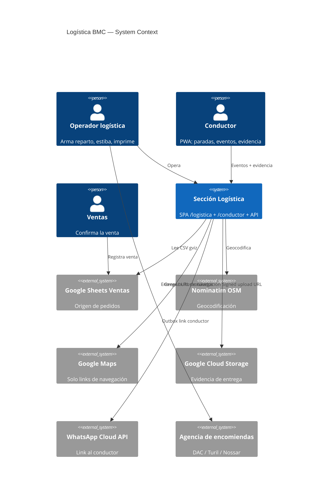

# System Design Document: Logística BMC — revisión completa

**Agent brief:** este documento es el **inventario as-built completo** de la sección logística al 2026-08-08. Reutilizá lo que dice §5 y §7 antes de escribir código nuevo — buena parte de lo que parece faltar ya existe como helper puro. **No inventes** un segundo motor de packing, una segunda numeración de bultos ni un segundo cálculo de volumen: `cargoPacking.js`, `packageIdentity.js` y `remitoPackageMetrics.js` ya los tienen. Los diseños de lo que sí falta viven en `SDD-ETIQUETAS-BULTOS.md` y `SDD-REMITO-CLIENTE.md`.

**Status:** as-built verificado por lectura directa del repo en `main @ d33bf39`. Toda afirmación lleva etiqueta de evidencia y cita de path.

**Política de evidencia:**

| Etiqueta | Significado |
|---|---|
| `CONFIRMED` | Verificado leyendo el archivo citado en este commit. |
| `INFERRED` | Deducido de código o docs, no ejecutado en runtime. |
| `TARGET` | Diseñado pero **no implementado**. |

---

## 1. Introduction & Goals

### 1.1 Problem Statement

BMC Uruguay (METALOG SAS) despacha paneles de aislación en camión propio y por agencia de encomiendas. La sección logística de la Calculadora cubre el tramo que va **desde una venta confirmada hasta la entrega firmada**: armar el reparto, elegir el camión, estibar la carga, ordenar la ruta, imprimir la documentación y registrar la entrega.

La sección creció en oleadas rápidas durante 2026-07 y 2026-08 (Ops UX F1–F11, wizard de envío, visor 3D de estiba, autocarga desde la planilla Ventas, coordinación de repartos). Esta revisión existe porque tres frentes quedaron sin documentar o sin resolver:

1. El **visor del camión BMC** (`TruckVisual`) está fallando y no figura en ningún SDD.
2. **Geo y rutas** entregan distancia en línea recta, mientras el SDD de geo describe un objetivo con ruteo real sin declarar que no está implementado.
3. **Etiquetas de bulto, remito por cliente y etiquetas de encomienda no existen** — cero código.

### 1.2 Goals

| ID | Objetivo | Evidencia |
|----|----------|-----------|
| L1 | Inventariar toda la sección logística sección por sección, con estado real de cada funcionalidad | §5, §7 de este documento |
| L2 | Diagnosticar el fallo del visor `TruckVisual` con hallazgos citables | §11.1 (V1–V8) |
| L3 | Declarar el estado real de geolocalización y generación de rutas, separando as-built de diseño | §7.4 |
| L4 | Especificar etiquetado de bultos y encomiendas | `SDD-ETIQUETAS-BULTOS.md` |
| L5 | Especificar remito de entrega por cliente, firmable | `SDD-REMITO-CLIENTE.md` |
| L6 | Registrar la deuda del modelo de datos que ningún SDD previo nombra | §8.3 |

### 1.3 Stakeholders

| Rol | Interés |
|---|---|
| Operador de logística | Armar reparto, estibar, imprimir remito y etiquetas |
| Conductor | Ver paradas, registrar eventos y evidencia desde la PWA |
| Ventas | Que el pedido vendido llegue al reparto sin recarga manual |
| Administración | Documentación de respaldo de cada entrega |
| Engineering | Mantener `/logistica` sin que crezca la deuda del monolito |

### 1.4 Out of scope

- **e-Remito fiscal (CFE / DGI).** Requiere emisor habilitado y firma electrónica avanzada. Frontera detallada en `SDD-REMITO-CLIENTE.md` §3.
- **Integración por API con agencias de encomienda.** Ninguna publica API abierta. Ver `SDD-ETIQUETAS-BULTOS.md` §7.
- **Tarifación de flete.** Vive en `docs/team/SDD-CALCULADORA-FLETES.md` y `src/utils/fleteEngine.js`.
- **Arreglar el visor.** Esta revisión lo diagnostica; el fix es trabajo aparte.

---

## 2. Context & Scope (C4 Level 1)



### External interfaces

| Interfaz | Dirección | Auth | Estado |
|---|---|---|---|
| Google Sheets `gviz` CSV | salida | ninguna (sheet público) | `CONFIRMED` `server/routes/envios.js:115` |
| Nominatim OSM | salida | ninguna, User-Agent fijo | `CONFIRMED` `server/routes/envios.js:54` |
| Google Maps | salida | ninguna — **solo construcción de URL, no hay llamada a API** | `CONFIRMED` `src/utils/logistica/routeExport.js:166` |
| GCS signed URL | salida | service account | `CONFIRMED` `server/lib/transportistaEvidence.js:9` |
| WhatsApp Cloud API | salida | token, vía outbox | `CONFIRMED` `server/lib/transportistaOutboxWorker.js:36` |
| Agencia de encomiendas | **manual, fuera de banda** | — | `CONFIRMED` — cero código |

---

## 3. Constraints

| # | Restricción | Origen |
|---|---|---|
| C1 | ES modules puros, sin `require()` | `CLAUDE.md` |
| C2 | Precios sin IVA; IVA 22 % una sola vez al total | `CLAUDE.md` |
| C3 | Rutas Sheets: `503` si Sheets no disponible, `200` vacío si no hay datos, **nunca `500`** | `CLAUDE.md` |
| C4 | Nominatim exige ≥1 req/s → rate gate de 1100 ms a nivel proceso | `CONFIRMED` `server/routes/envios.js:196-199` |
| C5 | Secretos solo por `config.*` / `process.env` | `CLAUDE.md` |
| C6 | El operador trabaja mayormente en escritorio; la PWA del conductor es móvil | `INFERRED` |
| C7 | Impresión sobre impresora de oficina A4, sin hardware nuevo | Decisión de producto 2026-08-08 |

---

## 4. Solution Strategy

1. **Kernel puro + UI delgada.** Toda regla de negocio vive en módulos puros bajo `src/utils/logistica/` (35 archivos), testeables sin React ni R3F. La UI los orquesta.
2. **Estado del viaje en JSONB.** Paradas y bultos viajan dentro de `payload` en Postgres, no como tablas. Rápido de iterar, con el costo que documenta §8.3.
3. **Degradación en cadena.** Sin `DATABASE_URL` → 503 del módulo; sin geo → orden manual del operador; sin servidor PDF → `window.print()` del navegador.
4. **Append-only para el conductor.** La PWA solo agrega eventos idempotentes; nunca muta estado directo.
5. **Impresión por HTML + CSS.** Ningún motor de layout propio: HTML autocontenido → Chromium (`preferCSSPageSize`) o `window.print()`.

---

## 5. Container View (C4 Level 2) — inventario sección por sección

### 5.1 Rutas SPA

| Ruta | Componente | LOC | Estado |
|---|---|---|---|
| `/logistica` | `src/components/BmcLogisticaApp.jsx` | 5072 | `CONFIRMED` `src/App.jsx:452` |
| `/conductor` | `src/components/DriverTransportistaApp.jsx` | 294 | `CONFIRMED` `src/App.jsx:462` |
| `/inspector` | `src/components/CalcLogicInspector.jsx` | — | `CONFIRMED` `src/App.jsx:472` — **es del motor de cálculo, no de logística** |

> `/logistica` es un monolito de 5072 líneas. Ya figura como riesgo en `SDD.md` §11 ("`BmcLogisticaApp` size / maintainability = High").

### 5.2 Componentes de logística

`src/components/logistica/` — `CONFIRMED`

| Archivo | LOC | Rol |
|---|---|---|
| `LogisticaCargoScene3d.jsx` | 791 | Escena WebGL de estiba: Canvas, OrbitControls, bultos, free-drag |
| `TruckVisual.jsx` | 388 | **Camión procedural BMC** — cabina, caja, ejes, luces. Visual puro |
| `PackageLayoutList.jsx` | 351 | Lista de bultos con reordenamiento |
| `ViewerChrome.jsx` | 217 | Marco del visor: alto, fullscreen, toolbar |
| `RepartoBar.jsx` | 127 | Barra de estado de coordinación del reparto |
| `EnviosDraftBrowser.jsx` | 113 | Navegador de borradores en la nube |
| `wizard/EnvioWizardShell.jsx` | 240 | Shell del wizard por etapas |
| `wizard/StepPedidos.jsx` | 275 | Etapa 1 — selección de pedidos |
| `wizard/StepRuta.jsx` | 252 | Etapa 4 — ruta |
| `wizard/RouteMapVisualizer.jsx` | 173 | Proyección SVG del recorrido (**sin cartografía**) |
| `wizard/StepLevantes.jsx` | 122 | Etapa 3 — levantes |
| `wizard/StepFlota.jsx` | 122 | Etapa 2 — vehículo |

### 5.3 Kernel puro

`src/utils/logistica/` — 35 módulos, `CONFIRMED`. Agrupados por responsabilidad:

| Grupo | Módulos |
|---|---|
| **Packing / estiba** | `cargoPacking.js`, `cargoFromEncargo.js`, `stackPhysics.js`, `stackConstraints.js`, `loadWarnings.js`, `loadCharacteristics.js`, `yardLayout.js`, `freeDragLayout.js`, `freeDragLongPress.js`, `packageDrop.js` |
| **Identidad de bultos** | `packageIdentity.js`, `packageDims.js`, `packageListDnD.js` |
| **Geo / ruta** | `geocode.js`, `routeSuggest.js`, `routeExport.js`, `stopReorder.js`, `safeExternalUrl.js` |
| **Impresión** | `loadPlanPrintModel.js`, `remitoPackageMetrics.js` |
| **Estado / persistencia** | `enviosDraft.js`, `enviosDraftSync.js`, `wizardState.js`, `stopStatusFsm.js`, `repartoStatus.js`, `repartoNumber.js`, `coordinationStatus.js`, `saleState.js` |
| **Integración Ventas** | `ventasSheetMap.js`, `ventasSearch.js`, `adminQuoteMatch.js`, `bridgePayload.js` |
| **Catálogos / UI** | `pickupCatalog.js`, `btnStyle.js`, `truckAxles.js` |

Total `src/**/logistica*`: **47 archivos, ~9531 LOC** (`CONFIRMED`, conteo directo).

### 5.4 API — routers

Tres routers, todos montados bajo `/api` en `server/index.js:1063-1065` (`CONFIRMED`). **No existe** `logistica.js`, `despacho.js`, `conductor.js` ni `geo.js`.

**`server/routes/transportista.js`** (703 líneas) — viaje y PWA del conductor. Dos regímenes de auth: `requireCrmAuth` (token estático compartido, `:16`) y `requireDriver` (token opaco con hash SHA-256 en `driver_sessions`, `:55`).

| Método | Path | Auth |
|---|---|---|
| GET | `/api/transportista/health` | db |
| POST | `/api/trips` | crm |
| POST | `/api/trips/:id/confirm` | crm — idempotente por `(trip_id, idempotency_key)` |
| POST | `/api/trips/:id/assign` | crm — emite token de conductor + outbox WhatsApp |
| POST | `/api/trips/:id/driver-link/regenerate` | crm |
| GET | `/api/trips/:id/timeline` · `/state` | crm |
| POST | `/api/trips/:id/close` | crm |
| GET | `/api/driver/trips` · `/api/driver/trips/:id` | driver |
| POST | `/api/driver/events` | driver — valida contra FSM, gate de POD estricto |
| POST | `/api/driver/evidence/upload-url` · `/commit` · `/upload-b64` | driver |

**`server/routes/envios.js`** (577 líneas) — borradores, geocodificación, puente con Ventas.

| Método | Path | Nota |
|---|---|---|
| GET | `/api/envios/health` | sin auth |
| GET | `/api/envios/ventas-csv` | proxy gviz, caché 60 s |
| POST | `/api/envios/geocode` | Nominatim, `countrycodes=uy` (`:206`), rate gate 1100 ms (`:196`) |
| GET/PUT/DELETE | `/api/envios/drafts[/:id]` | concurrencia optimista → `409 revision_conflict` |
| POST | `/api/envios/match-quotes` | matcheo puro multi-clave |
| POST | `/api/envios/adjunto-fetch` | con guarda anti-SSRF |

**`server/routes/repartos.js`** (408 líneas) — coordinación del reparto.

| Método | Path | Nota |
|---|---|---|
| GET | `/api/repartos` · `/:id` · `/:id/events` | crm |
| POST | `/api/repartos` | asigna `REP-YYYY-MM-DD-NNN` |
| PUT | `/api/repartos/:id` | `409 immutable` si ya está coordinado/cerrado |
| POST | `/api/repartos/:id/confirm` | gate atómico + snapshot inmutable |

Adyacente, respaldado por Sheets: `GET /api/coordinacion-logistica`, `/api/proximas-entregas`, `POST /api/ventas/logistica-{fecha-entrega,estado,entregado}` en `server/routes/bmcDashboard.js` (`CONFIRMED`).

### 5.5 Impresión

| Pieza | Estado |
|---|---|
| `POST /api/pdf/generate` | `CONFIRMED` `server/routes/pdf.js:32` — recibe **HTML crudo**, devuelve PDF. **Sin auth.** |
| `renderHtmlToPdfBuffer` | `CONFIRMED` `server/lib/quotePdf.js:164` — puppeteer-core + Chromium, `preferCSSPageSize: true` (`:216`), semáforo de 2 renders concurrentes |
| Fallback de navegador | `CONFIRMED` — `window.print()` + `@media print` + clase `.np`, patrón usado por `RemitoView` (`src/components/BmcLogisticaApp.jsx:1679`) |

`preferCSSPageSize: true` implica que **cualquier plantilla puede fijar su propio `@page { size }`** sin tocar la ruta. Es la base técnica de las etiquetas.

---

## 6. AI Architecture — Component View

**N/A para esta sección.** La logística no consume `agentCore`, RAG ni herramientas de agente. La única inteligencia es determinística:

- `cargoFromEncargo.js` — infiere bultos desde el nombre de archivo de un ENCARGO cuando el PDF no aporta texto (`CONFIRMED`).
- `adminQuoteMatch.js` / `ventasSearch.js` — matcheo difuso multi-clave (pedido / nombre / teléfono), sin modelo.
- `suggestRoute()` — heurística por cercanía, sin optimizador.

No hay prompt, ni proveedor LLM, ni telemetría de agente en el camino de logística. Si en el futuro se agrega un asistente, debe pasar por `assistantRegistry` y `requireAssistantEnabled` como el resto de la plataforma (`TARGET`).

---

## 7. Data Flow

### 7.1 Venta → reparto (autocarga)

`CONFIRMED`. Ventas (Google Sheets) → `GET /api/envios/ventas-csv` (proxy gviz con caché 60 s) → `ventasSheetMap.js` mapea columnas → el operador selecciona pedidos → `cargoFromEncargo.js` deriva bultos → paradas en el borrador.

Prioridad de autocarga y modo de operación en `HOW-IT-WORKS-VENTAS-LOGISTICA.md`.

### 7.2 Estiba

`CONFIRMED`. `placeCargo(stops, truckL, distributionMode, opts)` en `cargoPacking.js:499` produce `placed[]` con coordenadas. `stackConstraints.js` y `stackPhysics.js` validan apilado; las violaciones aceptadas por el operador quedan en `loadWarnings.js` y salen impresas en el plan de carga. `yardLayout.js` reparte los bultos en pilas de patio al descargar el camión.

Contrato de coordenadas de la escena (`CONFIRMED` `src/components/logistica/TruckVisual.jsx:5-11`):

```
TRUCK_W = 2.4
Cargo X: [shiftX, shiftX + truckL]
Cargo Z: [0, TRUCK_W], centro = TRUCK_W / 2
Cabina:  X < shiftX
```

### 7.3 Impresión operativa

`CONFIRMED`. Dos documentos, ambos a nivel viaje:

- **Plan de carga** — `buildLoadPlanPrintModel()` (`loadPlanPrintModel.js:70`) + `buildUnloadSteps()` (`:36`), con avisos de estiba.
- **Remito / Hoja de ruta** — `RemitoView` (`BmcLogisticaApp.jsx:1666`), título literal "Remito / Hoja de ruta" (`:1734`), construido por `buildRemitoSimpleModel()` (`remitoPackageMetrics.js:89`).

**Ninguno de los dos se persiste.** Se imprimen y desaparecen.

### 7.4 Geolocalización y generación de rutas — estado real

Este es el punto donde el as-built y el diseño divergen más.

| Capacidad | Estado | Evidencia |
|---|---|---|
| Geocodificar dirección → lat/lng | ✅ `CONFIRMED` | Proxy Nominatim `server/routes/envios.js:170`, sesgo Uruguay `countrycodes=uy` (`:206`), sin API key |
| Pegar coordenadas o link de Google Maps | ✅ `CONFIRMED` | `parseLatLng()` acepta `lat,lng`, `@lat,lng`, `!3d..!4d..`, `?q=`, `?query=` (`geocode.js:40`) |
| Distancia entre paradas | ⚠️ `CONFIRMED` — **línea recta** | `haversineKm()` **duplicado** en `geocode.js:128` y `routeSuggest.js:15` |
| Orden sugerido de ruta | ⚠️ `CONFIRMED` — heurística | `suggestRoute()` ordena base → levantes → entregas por cercanía (`routeSuggest.js:92`), `suggestionSource: "haversine"` |
| Reordenar a mano | ✅ `CONFIRMED` | `stopReorder.js`, `reorderRouteLegs()` |
| Exportar recorrido | ✅ `CONFIRMED` | `googleMapsDirectionsUrl()`, `routeToGeoJson()`, `routeToGpx()`, `routeToShareText()` (`routeExport.js`) |
| Ver el recorrido | ⚠️ `CONFIRMED` — **sin cartografía** | `RouteMapVisualizer` dibuja `projectRouteToSvg()` sobre un degradado. No hay tiles de mapa |
| **Distancia por ruta real (calle)** | ❌ **Ausente** | Sin OSRM, Distance Matrix, Mapbox ni ORS en todo el repo. `routeSuggest.js:4` dice literal *"OSRM hook later (SDD-GEO-MAPS)"* |
| **Optimización TSP / VRP** | ❌ **Ausente** | El orden final lo fija el operador |
| **ETA / ventanas horarias** | ❌ **Ausente** | |
| **Seguimiento en vivo del camión** | ❌ **Ausente** | Hay `geo_lat`/`geo_lng` por evento en `trip_events`, pero ninguna vista los consume |

**Consecuencia operativa:** los kilómetros que muestra la app son **subestimaciones sistemáticas** — en ruta real el recorrido siempre es mayor que la línea recta. Ya está anotado como riesgo en `SDD.md` §11 ("haversine ≠ road km").

**Sobre `SDD-GEO-MAPS.md`:** sus §8–§12 (`DeliveryPoint` canónico, `RoutePlan`, depot, zona por coordenadas, proxy OSRM) son **`TARGET`, 0 % implementado**. El documento es correcto: su `status` es "Draft — listo para implementar" y su tabla de estado ya marca `TARGET` el mapa interactivo y el Distance Matrix / TSP. Es de ayer (2026-08-07), así que la brecha es de diseño reciente, no de deriva documental. Se le agregó una verificación fechada para que quien lo lea sepa que sigue sin implementarse.

### 7.5 Conductor

`CONFIRMED`. Asignación → token opaco (hash SHA-256, TTL configurable) → link por WhatsApp vía `outbox_notifications` con `FOR UPDATE SKIP LOCKED`, backoff exponencial y 12 intentos. El conductor registra eventos append-only validados contra el FSM (`transportistaFsm.js`: 10 tipos, de `stop_arrived` a `incident_reported`) y sube evidencia a GCS por signed URL.

Con `TRANSPORTISTA_STRICT_POD=1`, `delivery_completed` exige evidencia previa para esa parada (`CONFIRMED` `transportistaFsm.js:23`).

---

## 8. Deployment View

### 8.1 Entornos

Hereda la plataforma: SPA en Vercel, API en Cloud Run `panelin-calc` (`us-central1`).

### 8.2 Variables de entorno

`CONFIRMED` `server/config.js:251-256` — la superficie **completa** de logística:

| Variable | Default | Efecto |
|---|---|---|
| `TRANSPORTISTA_GCS_BUCKET` | `""` | Sin ella, `upload-url` responde 503 y solo queda la vía b64 de desarrollo |
| `TRANSPORTISTA_DRIVER_TOKEN_TTL_HOURS` | `24` | Vida del token del conductor |
| `TRANSPORTISTA_OUTBOX_INTERVAL_MS` | `15000` | Frecuencia del worker |
| `TRANSPORTISTA_OUTBOX_DISABLED` | `false` | Apaga el envío por WhatsApp |
| `TRANSPORTISTA_STRICT_POD` | `false` | Exige evidencia antes de completar entrega |

Compartidas: `DATABASE_URL`, `API_AUTH_TOKEN` (**gate duro de los tres routers**), `PUBLIC_BASE_URL`.

**No existe** `GOOGLE_MAPS_API_KEY`, ni clave de geocodificación, ni `OSRM_*`. Nominatim no requiere key.

> **Defecto de configuración `CONFIRMED`:** `server/routes/repartos.js:319` referencia el literal `"DRIVE_REPARTOS_FOLDER_ID"` como `rootEnv`, pero esa variable **nunca se lee de `process.env` ni está definida** en `.env.example`. El árbol de Drive es `TARGET` (fase 3), así que hoy no rompe nada — pero es una promesa colgada.

### 8.3 Modelo de datos y su deuda

**Transportista** (`transportista-cursor-package/migrations/`, aplicadas por `npm run transportista:migrate`):

| Tabla | Rol |
|---|---|
| `trips` | Viaje. `plan_snapshot jsonb`, status `draft→confirmed→assigned→closed` |
| `trip_events` | Log append-only. **Único `(trip_id, idempotency_key)`** — la columna vertebral de la idempotencia |
| `driver_sessions` | Token del conductor, solo hash |
| `outbox_notifications` | Cola de salida WhatsApp con reintentos |
| `trip_state_view` | Proyección `DISTINCT ON (trip_id)` del último evento |

**Envíos / repartos** (`server/migrations/envios/001_envios_drafts.sql` + DDL inline en `server/lib/enviosDb.js`, bootstrap perezoso):

| Tabla | Rol |
|---|---|
| `envios_drafts` | Borrador con `payload jsonb` + `revision` para concurrencia optimista |
| `repartos` | Reparto coordinado, `REP-YYYY-MM-DD-NNN` |
| `reparto_events` | Bitácora del reparto |
| `reparto_documents` | **Tabla de documentos que nunca se escribe** |

#### Deuda estructural — ningún SDD previo la nombra

| Concepto | Persistencia real | Veredicto |
|---|---|---|
| **Pedido** | Google Sheets. En la base solo sobrevive como string `stop.orderId` / `cotizacionId` dentro de JSONB | Sin modelo relacional |
| **Envío** | `envios_drafts` es un **documento borrador**, no una entidad de negocio | Documento, no entidad |
| **Viaje** | `trips` **y** `repartos`: **dos modelos paralelos sin FK entre sí** | Duplicado |
| **Parada** | Array dentro de `payload->'stops'`. `trip_events.stop_id` es un `uuid` **colgante, sin FK ni tabla destino** | Solo JSONB |
| **Cliente** | Nada. Existe `customers` en `supabase/migrations/20260508000001_clientes_360_init.sql` pero **ninguna tabla ni ruta de logística lo referencia** | Desconectado |
| **Bulto** | Nada del lado servidor: se calcula en el navegador y muere ahí | Ausente |
| **Documento** | `reparto_documents` existe con `kind`, `name`, `stop_id`, `drive_file_id`, y **solo se le hace SELECT** (`repartos.js:203`). Cero INSERT en todo el repo | Cascarón vacío |

Que `trips` y `repartos` sean modelos de viaje desunidos es la deuda más cara: un mismo reparto físico puede existir dos veces sin forma de cruzarlos.

`reparto_documents`, en cambio, es una **oportunidad**: es exactamente el lugar donde deben aterrizar remitos y etiquetas, y ya está creada.

### 8.4 Tests

**Cubiertos, en `npm test`** (`CONFIRMED`): `geocode`, `routeSuggest`, `routeExport`, `stopReorder`, `stopStatusFsm`, `remitoPackageMetrics`, `cargoPacking`, `cargoFromEncargo`, `packageDims`, `packageDrop`, `packageIdentity`, `packageListDnD`, `enviosDraft`, `enviosDraftSync`, `enviosAdjuntoFetch`, `enviosEntregadoConcurrentDelete`, `adminQuoteMatch`, `saleState`, `wizardState`, `pickupCatalog`, `fleteEngine`, `truckAxles`.

En `npm run test:api`: `transportistaOutboxWorker`.

**Huérfanos — en disco pero fuera de todo script npm** (`CONFIRMED`, 0 menciones en `package.json`):

- `tests/repartoNumber.test.js`
- `tests/repartoStatus.test.js`
- `tests/repartos-api.integration.test.js`

**Sin cobertura alguna:** todos los endpoints HTTP de `transportista.js` (`/api/trips/*`, `/api/driver/*`), más `/api/envios/geocode`, `/api/envios/ventas-csv` y el nivel HTTP de drafts. Ninguna spec de Playwright toca logística.

---

## 9. Crosscutting Concepts

### 9.1 Seguridad

| Punto | Estado |
|---|---|
| Auth de backoffice | ⚠️ `API_AUTH_TOKEN` **estático y compartido**, sin rol ni grant por usuario. Los tres routers usan el mismo |
| Auth del conductor | ✅ Token opaco, solo hash en base, revocable, con expiración |
| Anti-SSRF | ✅ `adjunto-fetch` con allowlist de host, revalidación de redirect y tope de tamaño |
| XSS | ✅ `safeExternalUrl.js` bloquea `javascript:` en `mapUrl` y en botones de lista (endurecido en 2026-08-07) |
| **PDF sin auth** | ⚠️ `POST /api/pdf/generate` no valida nada y acepta HTML arbitrario (`CONFIRMED` `server/routes/pdf.js:32`). Aceptable para cotizaciones anónimas; **no** para documentos con datos de cliente |

### 9.2 Confiabilidad

Concurrencia optimista con `revision` → `409` explícito en drafts y repartos. Confirmación de reparto con gate atómico (`where status='en_coordinacion'`). Idempotencia de eventos por unique key. El worker de outbox se autodetiene ante schema faltante (`42P01`) con un solo warn.

### 9.3 Performance

Caché de 60 s en el CSV de Ventas. Rate gate de 1100 ms en Nominatim (**serializa las geocodificaciones**: 20 paradas ≈ 22 s). Semáforo de 2 renders PDF concurrentes. `dpr` limitado a 1.75 en el visor.

### 9.4 Observabilidad

`pino` en el servidor. `GET /api/{transportista,envios,repartos}/health`. `GET /api/pdf/metrics` con contadores en memoria. `trip_events` y `reparto_events` son la bitácora auditable. **No hay métricas de negocio** (entregas a tiempo, km recorridos, bultos por reparto).

### 9.5 Costo

Nominatim y OSM son gratis — y por eso mismo el rate gate no es negociable. GCS paga por evidencia almacenada. Chromium en Cloud Run es el renglón más caro por request.

---

## 10. Architecture Decisions

Los ADRs vigentes de logística viven en el SDD padre: **ADR-001** (dos motores de packing), **ADR-011** (`pickColumnRow`), **ADR-012** (helpers puros de Ops UX), **ADR-013** (layout manual por overrides), **ADR-014** (Remito Simple como clon visual de Presupuesto Simple), **ADR-015** (Nominatim + haversine, explícitamente **no** Distance Matrix), **ADR-016** (`envios_drafts`), **ADR-021** (nunca apilar paneles sobre perfiles).

Los de geo, aún `TARGET`, en `SDD-GEO-MAPS.md` §14: **ADR-017** (Leaflet + OSM + OSRM sobre Google Maps Platform), **ADR-018** (`DeliveryPoint` canónico), **ADR-019** (OSRM trip, no VRP multi-vehículo), **ADR-020** (tarifas no por km).

Esta revisión agrega **ADR-026**, **ADR-027** y **ADR-028** al SDD padre.

---

## 11. Risks & Technical Debt

### 11.1 Visor `TruckVisual` — diagnóstico 2026-08-08

`src/components/logistica/TruckVisual.jsx` (388 líneas) aterrizó en `72cba1f` (#937). Se monta en `LogisticaCargoScene3d.jsx:519`, **dentro del mismo `<Canvas>`** que `OrbitControls` (`:548`) y que los bultos con free-drag (`:375`).

Contexto que importa: el handoff del mismo día (`docs/team/HANDOFF-2026-08-07-0827.md`) marca **dos veces** "truck visual" como WIP a no tocar, y `SDD-3D-VISOR.md` v0.2 **no lo menciona** — ni a él ni a `truckAxles.js`.

| # | Hallazgo | Evidencia | Severidad |
|---|---|---|---|
| **V1** | **Captador de clic invisible de volumen completo.** Un `mesh` con `meshBasicMaterial` `opacity={0}` cubre toda la cabina y llama `stopPropagation` + `stopImmediatePropagation` en `onPointerDown`, `onPointerUp` y `onPointerOver`. Sigue siendo raycasteable: ningún puntero sobre la zona de cabina llega a `onPointerMissed` (`:653`) ni a OrbitControls. **Candidato principal al fallo reportado** — orbitar o arrastrar empezando sobre la cabina se traga el evento. | `TruckVisual.jsx:285-300` y `:154-160` | **Alta** |
| **V2** | **`truckL` sin coerción numérica al restaurar borrador.** `if (parsed.truckL) setTruckL(parsed.truckL)` acepta lo que venga en el JSON. La cadena 3D mezcla `*` y `/` (que coercionan a número) con `+` (que **concatena strings**): con `truckL = "8"`, `HeightGuides` evalúa `shiftX + truckL` → `"08"` → coordenada string → NaN en three.js. | `BmcLogisticaApp.jsx:1961`; `LogisticaCargoScene3d.jsx:449` | **Alta** |
| **V3** | **Luces agregadas dinámicamente.** El clic en cabina monta 2 `spotLight` + 2 `pointLight` por 10 s. Cambiar la **cantidad** de luces en three.js fuerza recompilación de shaders de todos los materiales de la escena — congelamiento visible con muchos bultos, cada 10 s. | `TruckVisual.jsx:256-282`, `CAB_LIGHTS_MS` | Media |
| **V4** | **`key` con float.** `rearAxles.map((x) => <Wheel key={x} …/>)`: con `truckL` inválido las dos posiciones colapsan al mismo valor → keys duplicadas. | `TruckVisual.jsx:383-385` | Baja |
| **V5** | **Cursor global mutado.** `document.body.style.cursor` se escribe en `onPointerOver`/`onPointerOut`; si el componente desmonta con el puntero encima, el cursor queda en `pointer` para toda la app. | `TruckVisual.jsx:290-296` | Baja |
| **V6** | **Textura sin caché ni `dispose`.** `new THREE.TextureLoader()` por montaje, nunca liberada. Tiene fallback a silueta emisiva, así que **no crashea**. | `TruckVisual.jsx:79-99` | Baja |
| **V7** | **Sin cobertura de comportamiento.** El único test es un grep estructural que verifica el import y la forma del JSX — no ejecuta nada. | `tests/truckAxles.test.js` | Media |
| **V8** | **Presión de memoria WebGL.** `preserveDrawingBuffer: true` + `shadows` + `dpr [1,1.75]`. Ya hay antecedente registrado de `WebGL context lost (buffer)`. | `LogisticaCargoScene3d.jsx:645-648`; `docs/team/ux-feedback/LIVE-DEVTOOLS-NARRATIVE-REPORT-2026-04-02-localhost-5173.md:52` | Media |

Complemento: `axleCount(length)` (contrato ≤6 m → 2 ejes, >6 m → 3) **no valida su entrada** — `axleCount(undefined)` devuelve 3 en silencio porque `undefined <= 6` es `false` (`CONFIRMED` `src/utils/logistica/truckAxles.js`).

**Orden sugerido para el fix** (trabajo aparte, fuera de esta entrega): V1 → V2 → V7 → V3. V1 y V2 explican solos la mayoría de los síntomas de "el visor no responde" o "el camión se dibuja mal"; V7 es lo que evita que vuelva.

### 11.2 Riesgos generales

| Riesgo | Impacto | Prob. | Mitigación |
|---|---|---|---|
| `BmcLogisticaApp.jsx` 5072 líneas | Alto | Alta | Extraer a `components/logistica/` siguiendo ADR-012 |
| `trips` ↔ `repartos` desunidos | Alto | Media | Decidir un modelo canónico de viaje |
| `reparto_documents` sin escritor | Medio | Alta | Primer escritor definido en `SDD-REMITO-CLIENTE.md` |
| Deriva de columnas de Ventas | Alto | Media | `ventasSheetMap.js` + tests |
| Nominatim caído o limitado | Medio | Media | Degradar a orden manual; permitir pegar coordenadas |
| haversine ≠ km reales | Medio | **Segura** | Declararlo en la UI; OSRM es `TARGET` |
| PDF sin auth con datos de cliente | Medio | Media | Ruta dedicada con auth para remitos y etiquetas |
| Tests de repartos huérfanos | Medio | Alta | Cablearlos a `package.json` |
| Endpoints de transportista sin tests HTTP | Alto | Media | Suite de contrato |

---

## 12. Glossary

| Término | Significado |
|---|---|
| **Bulto** | Unidad física de carga: un paquete de paneles o accesorios |
| **Parada / stop** | Punto de entrega o levante dentro de un reparto |
| **Levante** | Retiro de material en planta de proveedor (Kingspan, Montfrío, Ecopaneles) |
| **Reparto** | Viaje coordinado, `REP-YYYY-MM-DD-NNN` |
| **Estiba** | Disposición física de los bultos sobre la caja del camión |
| **Fila A/B** | Las dos hileras a lo ancho de la caja |
| **Encomienda** | Envío al interior vía agencia de transporte de terceros |
| **Remito (POD)** | Comprobante de entrega **interno**, firmado por el cliente. **No fiscal** |
| **e-Remito (CFE)** | Comprobante Fiscal Electrónico de DGI. **Fuera de alcance** |
| **Remitente** | Quien envía el paquete — BMC. Sus datos son obligatorios en la etiqueta de agencia |
| **POD** | *Proof of Delivery* — evidencia de entrega |
| **k/N** | Numeración de bulto dentro del pedido: "1 de 3", "2 de 3", "3 de 3" |
| **Yard / patio** | Zona fuera del camión donde se apilan los bultos al descargar |

---

## Appendix A — Índice de ausencias verificadas

Búsquedas ejecutadas sobre `src/` y `server/` en este commit, con resultado **cero**:

| Búsqueda | Resultado |
|---|---|
| `etiqueta` como artefacto imprimible de logística | Solo aparece en `RoofPreview.jsx` (cotas del plano de techo) y como etiqueta 3D en la escena |
| `encomienda`, `agencia` | Cero menciones en `src/` |
| `OSRM`, `Distance Matrix`, `Mapbox`, `openrouteservice` | Cero en todo el repo |
| `INSERT INTO reparto_documents` | Cero — solo un SELECT en `repartos.js:203` |
| Remito por parada | Cero — `RemitoView` es por viaje |
| `GOOGLE_MAPS_API_KEY` | Cero en `config.js` y `.env.example` |

## Appendix B — Comandos de reverificación

```bash
# Inventario de la sección
find src -path '*logistica*' -name '*.js*' | wc -l
find src -path '*logistica*' -name '*.js*' -exec wc -l {} + | tail -1

# Routers montados
grep -n "createTransportistaRouter\|createEnviosRouter\|createRepartosRouter" server/index.js

# Confirmar que reparto_documents nunca se escribe
grep -rn "reparto_documents" server/ scripts/ tests/

# Confirmar ausencia de ruteo real
grep -rniE "osrm|distance ?matrix|mapbox|openrouteservice" src/ server/ | grep -v node_modules

# Tests huérfanos
for t in repartoNumber repartoStatus repartos-api.integration; do
  echo "$t: $(grep -c "$t" package.json) menciones en package.json"
done

# Gate
npm run gate:local
```

## Changelog

| Versión | Fecha | Cambio |
|---|---|---|
| 1.0 | 2026-08-08 | Revisión completa inicial. Inventario sección por sección, diagnóstico V1–V8 del visor `TruckVisual`, estado real de geo/rutas, deuda del modelo de datos, índice de ausencias verificadas. |
