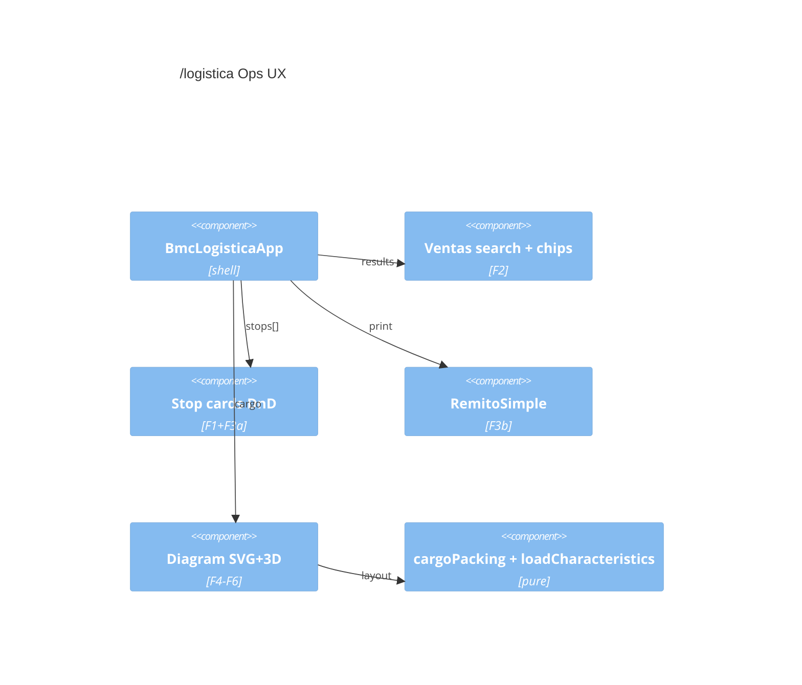

# SDD — BMC Envíos Ops UX Wave (F1–F6)

**Agent brief:** Improve `/logistica` operator UX. Prefer **reuse** (`loadCharacteristics`, `manualPkgOrderKeys`/`rowOverrides`, `sCli`, `@dnd-kit/core`, existing 3D selection panel). Fix Ventas search **root cause** (`r[7]` only). No new microservice.

## 1. Goals

| ID | Goal | P |
|----|------|---|
| F1 | Collapsible stop/section cards | P0 |
| F2 | Ventas search works (haystack) + chips Enviado / Coordinado(+fecha+batch color) / Por coordinar | P0 |
| F3a | Stop list DnD reorder | P0 |
| F3b | Remito estilo Presupuesto Simple + paquetes, contenido, medidas, volumen | P0 |
| F4 | 3D labels cliente + nº pedido; click full info | P0 |
| F5 | Package DnD → existing manual layout overrides | P0 |
| F6 | Printable multi-view load plan + translucent cabin | P1 |

### Non-goals

Server ENV DB, geocode/TSP, tariff rewrite, free 3D physics, full U3 FSM product.

## 2. As-built baseline [CONFIRMED]

| Fact | Path |
|------|------|
| Search filters only `r[7]` | `BmcLogisticaApp.buscarSheet` |
| F = estado text / retiro; G = fecha coordinación | comments + `mapVentasRow` |
| Placed meta `sCli` | `cargoPacking.buildPkgs` |
| Manual layout opts | `cargoLayoutMode`, `manualPkgOrderKeys`, `rowOverrides` |
| Volume est. | `loadCharacteristics.js` |
| 3D select overlay | `LogisticaCargoScene3d.jsx` |
| dnd-kit | `@dnd-kit/core` in package.json |

## 3. Feature contracts

### F2 — pure modules

**`src/utils/logistica/coordinationStatus.js`**

- `classifyVentasCoordination(row)` → `{ status, coordDateIso, batchKey, label }`
  - `enviado` if estado/raw `/enviad/i`
  - else `coordinado` if `fechaEntrega` ISO non-empty (`batchKey = date`)
  - else `por_coordinar`
- `batchColorFromKey(batchKey)` stable HSL

**`src/utils/logistica/ventasSearch.js`**

- `normalizeSearchText(s)` NFD lower
- `mappedRowMatchesQuery(mapped, q)` haystack: nombre, orderId, cotizacionId, pickupId, dir, tel, estadoText, rawSheetText
- `filterMappedVentasRows(mappedRows, query)`

**UI:** chips on result rows; `mapVentasRow` must expose `estadoText`.

```gherkin
Given row with orderId BMC-123 and nombre Acme
When search "BMC-123"
Then Acme is listed
And chip Coordinado when fechaEntrega G is set
```

### F1 / F3a / F3b / F4 / F5 / F6

See plan session: collapse state in localStorage `ui`; `reorderStops`; Remito Simple tokens from `simple.js` + `estimateStopLoadPhysical`; packing `sPed`; SVG DnD → overrides; print model + translucent cab mesh. Full signatures in implementation PRs 2–6.

## 4. C4 (ops wave)



## 5. Data model deltas

| Field | Where | Use |
|-------|--------|-----|
| `estadoText` | mapVentasRow | chips |
| `sPed` | placed packages | 3D label |
| `ui.collapsedStopIds` | localStorage | F1 |
| `coordination` DTO | search results | chip render |

## 6. ADRs

| ID | Decision |
|----|----------|
| O1 | Haystack search not r[7]-only |
| O2 | Chips from F text + G date |
| O3 | Reuse loadCharacteristics for m³ |
| O4 | F5 drives manual packing opts only |
| O5 | SVG DnD before 3D drag |
| O6 | Remito print CSS Simple-clone |
| O7 | Cabin decorative translucent |

## 7. PR plan

| PR | Scope |
|----|--------|
| 1 | F2 search + chips + tests |
| 2 | F1 + F3a |
| 3 | F3b remito |
| 4 | F4 sPed + 3D labels |
| 5 | F5 package DnD |
| 6 | F6 load plan + cabin |

## 8. Glossary

**Enviado** · **Coordinado** (fecha G + batch color) · **Por coordinar** · **batchKey** · **stableKey** · **sPed** · **sCli**

## 9. AI architecture

N/A — no LLM in this wave.
