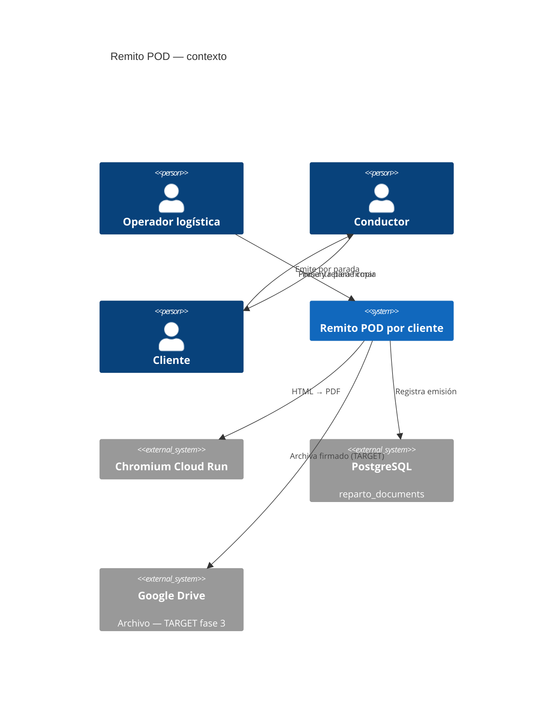

# System Design Document: Remito de entrega por cliente (POD)

**Agent brief:** `buildRemitoPackageRows(stop, placed, codeFn)` **ya es por parada** — es la semilla de este documento, no lo reescribas. Lo nuevo es el modelo de documento por cliente, el layout de dos copias y la persistencia. Reutilizá el lenguaje visual de `RemitoView` (ADR-014). **No** generes un comprobante fiscal: leé §3 antes de escribir una línea.

**Status:** `TARGET` completo. Nada de este documento está implementado al 2026-08-08.

---

## 1. Introduction & Goals

### 1.1 Problem Statement

Hoy la app imprime **un solo remito por viaje**: `RemitoView` genera una "Remito / Hoja de ruta" con todas las paradas del reparto en el mismo papel (`CONFIRMED` `src/components/BmcLogisticaApp.jsx:1666`, título en `:1734`). Sirve al conductor como hoja de ruta, pero no sirve al cliente:

- El cliente no puede quedarse con un comprobante — el papel tiene los datos de todos los demás clientes del reparto.
- No hay dónde firmar la conformidad de recepción.
- Al volver, no queda constancia física por entrega de qué se recibió y en qué estado.
- El documento es **efímero**: se imprime y no se persiste en ningún lado.

Lo que se necesita es tomar el reparto **pedido por pedido** y emitir un comprobante independiente por cliente, que el cliente firme y del que se quede con una copia.

### 1.2 Goals

| ID | Objetivo | Criterio de aceptación |
|---|---|---|
| R1 | Un documento por parada, no por viaje | Cada hoja contiene un solo cliente |
| R2 | Firmable | Bloque de firma, aclaración, C.I. y fecha/hora |
| R3 | El cliente se queda con una copia | Original y duplicado en la misma hoja |
| R4 | Detalle de bultos entregados | Reutiliza `buildRemitoPackageRows()` |
| R5 | Registro de observaciones de recepción | Faltantes, daño, descarga parcial |
| R6 | Trazable | Queda registro de emisión en `reparto_documents` |
| R7 | No fiscal, y que se note | Leyenda explícita en el encabezado |

### 1.3 Stakeholders

| Rol | Interés |
|---|---|
| Cliente | Comprobante de lo que recibió |
| Conductor | Papel donde recoger la firma |
| Administración | Respaldo de entrega, cruce con facturación |
| Contaduría | Que el documento **no** se confunda con un CFE |

### 1.4 Out of scope

- **e-Remito fiscal.** Ver §3.
- **Firma digital en pantalla.** La firma es en papel. Capturarla en la PWA del conductor es evolución futura — la infraestructura de evidencia ya existe (`/api/driver/evidence/*`).
- **Envío automático por email al cliente.**

---

## 2. Context & Scope (C4 Level 1)



---

## 3. Frontera fiscal — leer antes de implementar

En Uruguay, el **e-Remito es un Comprobante Fiscal Electrónico (CFE)** que documenta el traslado de mercadería dentro del territorio nacional, exista o no una venta asociada. Es **obligatorio cuando la mercadería se traslada sin factura simultánea**, y debe acompañar la mercadería durante el transporte. Su emisión exige **firma electrónica avanzada** que garantice autenticidad del emisor e integridad del documento. Desde 2025 la práctica totalidad de los contribuyentes con RUT opera bajo el régimen de CFE.

**Consecuencia directa para este diseño:**

| | Documento fiscal (e-Remito / CFE) | Este documento (POD) |
|---|---|---|
| Emisor | Sistema de facturación electrónica habilitado por DGI | La Calculadora |
| Firma | Electrónica avanzada | Del cliente, en papel |
| Obligatorio | Sí, para trasladar sin factura | No |
| Valor legal | Fiscal | Constancia interna de recepción |

**La Calculadora no emite ni reemplaza el e-Remito.** Este documento es un **comprobante de entrega interno (POD)**: acredita que el cliente recibió los bultos y en qué estado.

Para que ambos papeles se puedan cruzar, el POD lleva un campo **opcional** `eRemitoNro` donde el operador transcribe el número de CFE emitido por el sistema de facturación. Es una referencia, no una emisión.

El encabezado del documento debe decirlo con todas las letras:

> **Comprobante de entrega — documento interno, sin valor fiscal.**

---

## 4. Solution Strategy

1. **Una parada, una hoja.** El modelo se construye por parada y se pagina una por hoja.
2. **Reutilizar lo que ya es por parada.** `buildRemitoPackageRows()` ya devuelve las filas de bultos de una parada (`CONFIRMED` `remitoPackageMetrics.js:54`). Lo nuevo es lo que la envuelve.
3. **Dos copias en la misma hoja A4.** Mitad superior "Original — Cliente", mitad inferior "Duplicado — BMC", con línea de corte.
4. **Mismo lenguaje visual que el remito actual**, por ADR-014.
5. **Persistir la emisión, no el documento.** El PDF se regenera; lo que se registra es que se emitió.

---

## 5. Component View — diseño

### 5.1 Módulos nuevos (`TARGET`)

| Archivo | Exports | Responsabilidad |
|---|---|---|
| `src/utils/logistica/podModel.js` | `buildPodDocument()`, `buildPodBatch()` | Modelo puro por parada |
| `src/components/logistica/PodView.jsx` | default | Render + impresión |

### 5.2 Modelo

```js
/**
 * @typedef {object} PodDocument
 * @property {string} repartoNo
 * @property {string} fecha
 * @property {string} stopId
 * @property {number} orden
 * @property {string} cliente
 * @property {string} [pedido]
 * @property {string} [direccion]
 * @property {string} [telefono]
 * @property {string} [eRemitoNro]     // referencia al CFE, opcional
 * @property {string} [transportista]
 * @property {string} [patente]
 * @property {Array<PackageRow>} rows  // de buildRemitoPackageRows()
 * @property {number} totalBultos
 * @property {number} totalM3
 * @property {string} [observaciones]  // de stop.recepcionDetalle
 */
```

`buildPodDocument({ info, stop, placed })`:

1. `buildRemitoPackageRows(stop, placed, codeFn)` → filas de bultos (`CONFIRMED` `remitoPackageMetrics.js:54`).
2. Totales con `packageCuboidMetrics()` (`:14`) y formato con `formatM3()` (`:34`).
3. Observaciones desde `stop.recepcionDetalle` — **el campo ya existe** (`CONFIRMED` `BmcLogisticaApp.jsx:338` como default, editado en `:1398-1405`).

`buildPodBatch({ info, stops, placed })` → un `PodDocument` por parada. Resuelve **R1**.

> **Invariante:** un `PodDocument` **nunca** contiene datos de otra parada. Es la razón de ser del documento.

### 5.3 Layout — dos copias por hoja

```
┌──────────────────────── A4 ────────────────────────┐
│ COMPROBANTE DE ENTREGA        ORIGINAL — CLIENTE   │
│ Documento interno, sin valor fiscal                │
│ Reparto REP-2026-08-08-003 · 08/08/2026 · Parada 2 │
│ Cliente: …            Pedido: …    e-Remito: …     │
│ Dirección: …          Tel: …                       │
│ ┌────────────────────────────────────────────────┐ │
│ │ ID bulto │ Contenido │ L×A×H │ m³ │ Fila │ Uds │ │
│ └────────────────────────────────────────────────┘ │
│ Total: 3 bultos · 1.240 m³                         │
│ Observaciones de recepción: ______________________ │
│ Firma: ________  Aclaración: ________  C.I: _____  │
│ Fecha/hora de entrega: ____________                │
├ ─ ─ ─ ─ ─ ─ ─ ─ corte ─ ─ ─ ─ ─ ─ ─ ─ ─ ─ ─ ─ ─ ─ ┤
│ COMPROBANTE DE ENTREGA       DUPLICADO — BMC       │
│ (idéntico)                                         │
└────────────────────────────────────────────────────┘
```

```css
@page { size: A4; margin: 10mm; }
@media print {
  .np { display: none !important; }
  .pod-page { page-break-after: always; }
  .pod-copy { break-inside: avoid; }
}
```

Resuelve **R2** y **R3**: el cliente firma ambas, se queda con el original, BMC vuelve con el duplicado.

### 5.4 Camino de impresión

Mismo que etiquetas y remito actual (`CONFIRMED` `BmcLogisticaApp.jsx:1679`):

1. HTML autocontenido → `renderHtmlToPdfBuffer()` (`CONFIRMED` `server/lib/quotePdf.js:164`), con `@page` respetado por `preferCSSPageSize: true` (`:216`).
2. Fallback `window.print()`.

> **Advertencia de seguridad `CONFIRMED`:** igual que en etiquetas — `POST /api/pdf/generate` no tiene auth (`server/routes/pdf.js:32`). Un POD lleva nombre, dirección y teléfono del cliente. Usar una ruta dedicada con auth que importe la lib directo, como ya hacen `calc.js:42` y `quoteExport.js:23`.

### 5.5 UI

Botón **"Remitos por cliente"** junto al remito de viaje actual, y acción por parada dentro de cada tarjeta de parada. Dos modos:

- **Lote** — todas las paradas del reparto, una hoja cada una.
- **Individual** — solo la parada abierta.

---

## 6. AI Architecture

**N/A.** Documento determinístico. Sin modelo ni inferencia.

---

## 7. Data Flow

```
placed[] + stops[]
        ↓ buildPodBatch()
PodDocument[]  (uno por parada)
        ↓ renderPodHTML()
HTML autocontenido
        ↓ renderHtmlToPdfBuffer()  ó  window.print()
PDF / papel
        ↓ (TARGET)
INSERT reparto_documents (kind='remito', stop_id=…)
        ↓ (TARGET fase 3)
Google Drive — remito firmado escaneado
```

Sobre el último tramo: el árbol de Drive ya está diseñado en `SDD-REPARTO-COORDINACION.md` como fase 3 `TARGET`, y `repartos.js:319` ya arma un `drivePlan`. Ojo con la trampa documentada en la revisión: ese plan referencia `DRIVE_REPARTOS_FOLDER_ID`, una variable que **nunca se lee de `process.env` ni existe en `.env.example`** (`CONFIRMED`). Hay que definirla antes de habilitar el archivado.

Existe además una columna en Ventas descrita como destino del remito firmado (`CONFIRMED` `BmcLogisticaApp.jsx:331`, *"Drive folder from Ventas col L (remito firmado target)"*) — el circuito de archivado ya estaba previsto.

---

## 8. Persistencia — el primer escritor de `reparto_documents`

`reparto_documents` existe desde el MVP y **nunca se le hizo un INSERT** (`CONFIRMED`: DDL en `server/lib/enviosDb.js:79`, único SELECT en `server/routes/repartos.js:203`). Es el lugar natural para remitos y etiquetas.

**Contrato propuesto (`TARGET`), compartido con `SDD-ETIQUETAS-BULTOS.md` §8:**

```
POST /api/repartos/:id/documents
  auth: requireCrmAuth
  body: { kind, name, stopId?, driveFileId?, driveUrl? }
  → 201 { ok, document }
```

| Columna | Valor para POD |
|---|---|
| `id` | `doc-{reparto}-{stopId}-remito` |
| `kind` | `"remito"` |
| `name` | `"Remito — Acme SA — parada 2"` |
| `stop_id` | id de la parada |
| `drive_file_id` / `drive_url` | al archivar el firmado |

Sin columnas nuevas: la tabla ya tiene todo lo necesario. Resuelve **R6**.

---

## 9. Crosscutting

| Aspecto | Nota |
|---|---|
| **Seguridad** | Datos personales del cliente → ruta PDF con auth (§5.4) |
| **Confiabilidad** | Fallback `window.print()`; la emisión se registra recién cuando el PDF se generó |
| **Performance** | Un reparto típico son pocas paradas; el lote se genera en el cliente |
| **Cumplimiento** | El encabezado declara que no es fiscal (§3). No negociable |
| **Observabilidad** | Cada emisión deja fila en `reparto_documents` y evento en `reparto_events` |

---

## 10. ADRs

Ver **ADR-027** en el SDD padre (`SDD.md` §10).

---

## 11. Riesgos

| Riesgo | Impacto | Mitigación |
|---|---|---|
| Que se confunda el POD con un e-Remito fiscal | **Alto** — riesgo de cumplimiento | Leyenda explícita en encabezado; §3 en la spec; capacitación del operador |
| Fuga de datos de un cliente en la hoja de otro | Alto | Invariante de §5.2: un `PodDocument` = una parada |
| PDF sin auth expuesto | Medio | Ruta dedicada con auth |
| El firmado en papel se pierde | Medio | Archivado en Drive, fase 3 |
| `DRIVE_REPARTOS_FOLDER_ID` indefinida | Medio | Definirla antes de habilitar archivado (§7) |

---

## 12. Fases de implementación

| Fase | Contenido | DoD |
|---|---|---|
| **F1** | `podModel.js` + tests | `buildPodBatch` emite un doc por parada; ninguno contiene datos de otra |
| **F2** | `PodView.jsx` + layout dos copias | Imprime A4 con original y duplicado |
| **F3** | Botón lote + acción por parada en `/logistica` | Operador emite ambos modos |
| **F4** | `POST /api/repartos/:id/documents` + auth | Emisión registrada en `reparto_documents` |
| **F5** | Archivado en Drive del firmado escaneado | Requiere `DRIVE_REPARTOS_FOLDER_ID` |

---

## 13. Gherkin — criterios de aceptación

```gherkin
Escenario: Un remito por cliente, no uno por viaje
  Dado un reparto con 4 paradas
  Cuando el operador emite remitos por cliente
  Entonces se generan 4 documentos, uno por parada
  Y ninguno contiene datos de otra parada

Escenario: El cliente firma y se queda con una copia
  Dado un remito emitido para una parada
  Cuando se imprime
  Entonces la hoja contiene "ORIGINAL — CLIENTE" y "DUPLICADO — BMC"
  Y cada copia tiene bloque de firma, aclaración, C.I. y fecha/hora

Escenario: El documento declara que no es fiscal
  Dado cualquier remito emitido
  Cuando se imprime
  Entonces el encabezado dice "documento interno, sin valor fiscal"

Escenario: Referencia opcional al CFE
  Dado que la venta ya tiene e-Remito emitido por el sistema de facturación
  Cuando el operador ingresa ese número
  Entonces el remito lo muestra como referencia
  Y el remito sigue declarándose como no fiscal

Escenario: Observaciones de recepción
  Dado que el cliente recibe 2 de 3 bultos
  Cuando el conductor anota la observación
  Entonces el remito la muestra en el recuadro de observaciones de ambas copias
```

## Changelog

| Versión | Fecha | Cambio |
|---|---|---|
| 0.1 | 2026-08-08 | Diseño inicial: POD por parada, dos copias firmables, frontera fiscal e-Remito, primer escritor de `reparto_documents`. |
