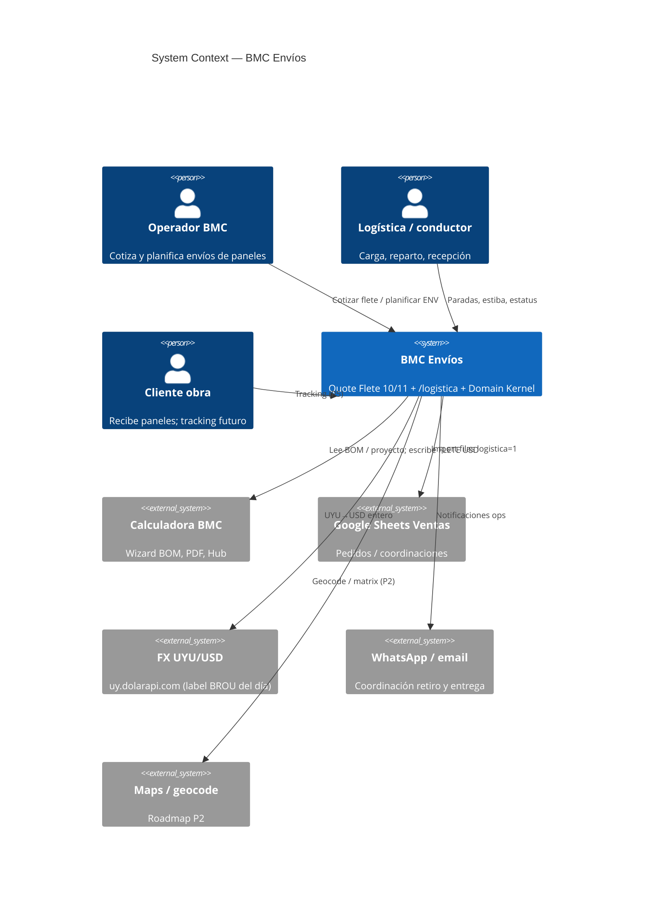
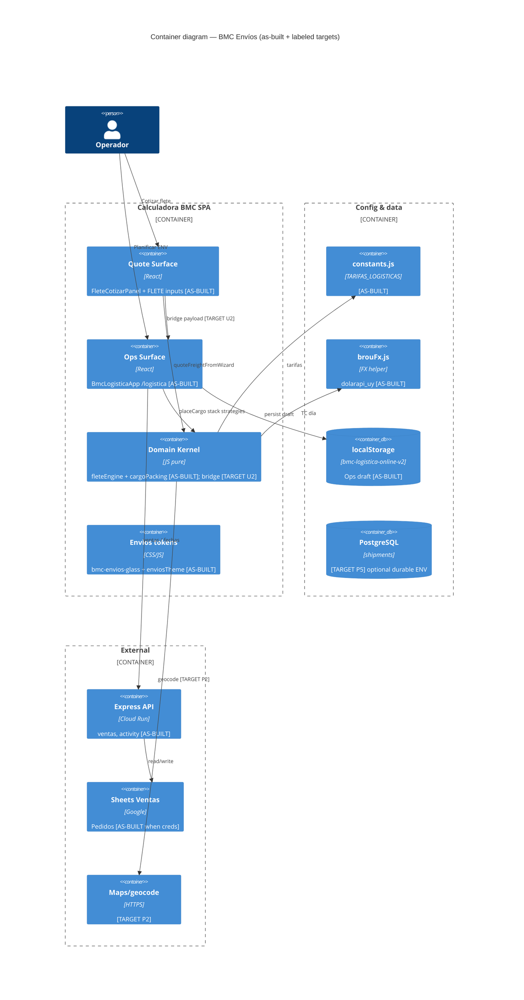
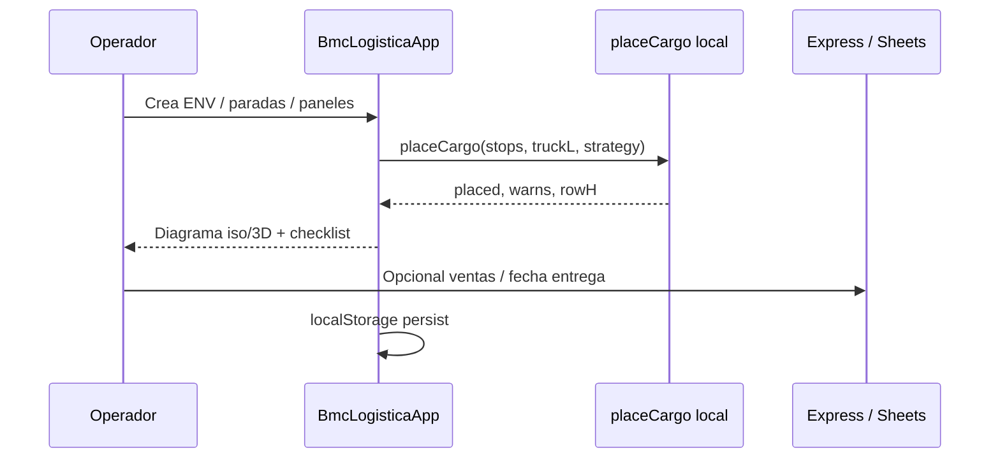
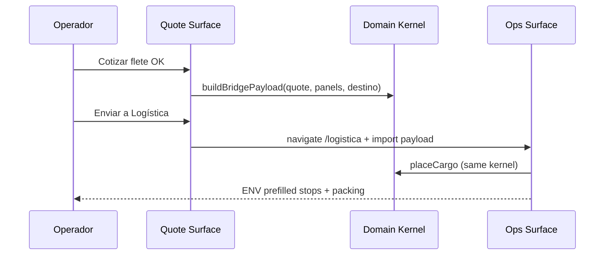
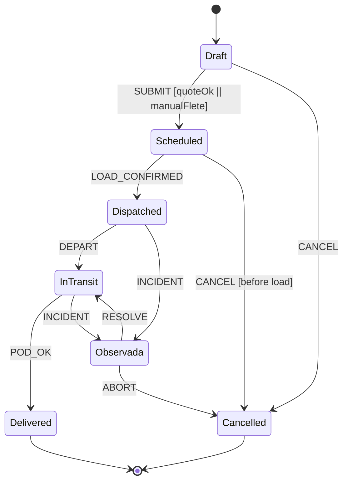

# System Design Document: BMC Envíos

**Agent brief:** One BMC module with **two UI surfaces** sharing one **domain kernel**. Do not design a separate courier SaaS. **U1 packing SoT** and **U2 quote→ops bridge** are **DONE** (shipped). Next product surface work: **Ops UX Wave F1–F6** in [`SDD-OPS-UX-WAVE.md`](./SDD-OPS-UX-WAVE.md).

**Status meaning:** *As-Built Hybrid* = quote engine, ops UI, Liquid Glass chrome, domain kernel, U1/U2 **CONFIRMED** in prod; F1–F6 and residual U3/P2/P3/P5 are **TARGET**.

Canonical target: [`TARGET.md`](./TARGET.md) · Ops UX: [`SDD-OPS-UX-WAVE.md`](./SDD-OPS-UX-WAVE.md) · Recreation: [`RECREATION-CHECKLIST.md`](./RECREATION-CHECKLIST.md) · Evidence: [`evidence/INDEX.md`](./evidence/INDEX.md).

---

## 1. Introduction & Goals

### 1.1 Problem Statement

BMC opera dos caras del mismo negocio logístico de paneles en Uruguay que **hoy no están unificadas**:

1. **Cotizar flete** — paso **Flete 10/11** del wizard de Calculadora BMC: checkbox retiro en planta, destino, botón **Cotizar flete**, resumen (zona / vehículo / filas), campos editables **FLETE (USD)** y costo interno.
2. **Operar el envío** — app **`/logistica`** (prod: `https://calculadora-bmc.vercel.app/logistica`): número `ENV-…`, paradas, estatus, empaque filas A/B, diagrama isométrico/3D, import desde Ventas/Sheets.

El motor de cotización (`fleteEngine`) ya usa `src/utils/logistica/cargoPacking.js`, pero **`BmcLogisticaApp` mantiene un `placeCargo` local** con estrategias de layout propias. Temas visuales, persistencia y modelo de estado también divergen. Resultado: riesgo de drift de empaque, re-carga manual de datos y evolución (FSM, geo, CBM) sin contrato único.

Además, sin destino clasificable el quote cae en **“Cotización especial — cargar flete a mano”** (zona `especial`, filas 0) — correcto como fail-safe, pero la experiencia no guía al operador a completar proyecto/BOM.

### 1.2 Goals

| ID | Goal | Priority |
|----|------|----------|
| G1 | **Unificar** cotización y ops bajo un Domain Kernel compartido (packing, zona, tarifas, shipment) | P0 |
| G2 | Eliminar **doble motor de empaque** (U1) | P0 |
| G3 | Bridge **quote → ENV** sin re-tipear paneles/destino (U2) | P0 |
| G4 | Visibilidad de ciclo de vida **determinista** (FSM map sobre `STOP_STATUS`) | P0 |
| G5 | Mantener reglas comerciales BMC (zonas UY, 8 m / 12–14 m, 2,4 m, retiro = 0) | P0 |
| G6 | Design tokens / patrones UI compartidos entre ambas superficies | P1 |
| G7 | Contratos agent-executable (Gherkin + OpenAPI sketch) | P1 |
| G8 | Roadmap geo/CBM/TSP sin bloquear Core | P2 |

### 1.3 Stakeholders

| Role | Interest |
|------|----------|
| Operador comercial | Cotizar flete rápido, override, PDF solo total |
| Logística / conductor | Paradas, estiba real, estatus, WhatsApp coordinación |
| Ingeniería BMC | Un kernel, tests, sin microservicio |
| AI coding agents | Spec sin ambigüedad para U1–U7 |
| Cliente final | Precio flete en quote; tracking (roadmap) |

### 1.4 Out of scope (Core)

- Courier multi-modal marítimo/aéreo productivo  
- Aduana / cross-border taxes  
- Microservicio dedicado o nueva DB product  
- CBM como reemplazo de tarifa panel-zona (solo ADR + roadmap P3)  
- Multi-agente Coordinator/Verifier en **runtime** (solo proceso de build)

---

## 2. Context & Scope (C4 Level 1)



### External interfaces

| Interface | Direction | Protocol | Description |
|-----------|-----------|----------|-------------|
| Wizard state (proyecto, techo, pared, BOM) | ↔ internal | React state | Destino, paneles, subtotal sin flete |
| `quoteFreight` / `quoteFreightFromWizard` | internal | JS pure | Motor cotización |
| `placeCargo` kernel | internal | JS pure | Empaque SoT target |
| `GET /api/ventas?logistica=1` | → HTTPS | REST | Filas Ventas y Coordinaciones |
| `POST /api/ventas/logistica-fecha-entrega` | → HTTPS | REST | Fecha entrega logística |
| FX `getBrouUsdSellRate` | → HTTPS | REST | `https://uy.dolarapi.com/v1/cotizaciones/usd` |
| PDF cotización | → internal | Quote model | Solo línea `Flete — USD X` |
| localStorage `bmc-logistica-online-v2` | ↔ browser | JSON | Persistencia ops actual |
| Bridge payload (target) | ↔ | JSON schema v1 | Quote → ENV import |

---

## 3. Constraints

| Type | Constraint |
|------|------------|
| **Stack** | React 18 + Vite SPA, Express 5 API, PostgreSQL existente; sin microservicio en Core |
| **Deploy** | Frontend Vercel; API Cloud Run; secrets Doppler `bmc-frontend/prd` / `bmc-backend/prd` |
| **Market** | Uruguay doméstico, road / última milla paneles |
| **Legal packing** | Altura estiba máx. **2,4 m**; carrocería estándar **8 m**; largo **12–14 m** (nominal 13 m) |
| **Money** | Cliente en **USD entero**; costos a menudo **UYU** convertidos |
| **FX** | Implementación actual: `dolarapi_uy` (no API oficial BROU); label de negocio “BROU del día”; cache 1h |
| **UI risk** | No rediseñar todo el wizard; unificar tokens y patrones del paso Flete con look Logística de forma incremental |
| **Auth** | Mismos grants/roles que calculadora (ventas / logística / admin) |
| **Latency** | Quote p95 &lt; 2000 ms (cálculo local + FX en cache) |
| **Platform SoT** | No contradecir `docs/sdd/calculadora-bmc/SDD.md` en auth/deploy/AI platform |

---

## 4. Solution Strategy

### 4.1 Architecture style

**Modular domain kernel inside the monorepo** + two thin UI surfaces:

- **Quote Surface** — paso Flete + `FleteCotizarPanel` (y campos FLETE existentes).
- **Ops Surface** — `BmcLogisticaApp` en `/logistica`.
- **Domain Kernel** — pure JS modules under `src/utils/logistica/` + `fleteEngine.js` + shared shipment types.

No event-driven microservices in Core. Optional Postgres tables for shipments only in P5.

### 4.2 Unification strategy (Core)

1. **Packing SoT:** promote full ops packing (strategies, layout opts) into `cargoPacking.js` (or sibling modules); `BmcLogisticaApp` becomes consumer only.
2. **Shipment model:** shared shape `{ envId, status, destino, zona, quote, stops[], packingSnapshot, meta }`.
3. **Bridge:** serialize from wizard → open `/logistica` with import (query/localStorage/session key) so ops never re-enters panel dims.
4. **FSM:** map research states to existing `STOP_STATUS`; document guards; implement enforcement incrementally.
5. **Design:** extract shared tokens (prefer Logística `T` as visual north star for envíos cards/buttons).
6. **Spec-driven:** tariffs in `TARIFAS_LOGISTICAS`; tests as executable verification; OpenAPI sketch for future HTTP if needed.

### 4.3 Pricing strategy (BMC panels)

**Primary:** zone matrix + vehicle occupancy from packing (not pure CBM).  
**Secondary (roadmap P3):** chargeable weight for non-panel parcels/accesorios if productized.

### 4.4 Key trade-offs

| Trade-off | Choice | Why |
|-----------|--------|-----|
| Shared packing vs independent optimizers | Shared kernel | Avoid price vs load inconsistency |
| Tariffs in code vs admin UI | `constants.js` v1 | Operator-editable via PR; ship speed |
| FX labeled BROU vs real source | Keep label; document `dolarapi_uy` | Existing code; fix ADR honesty |
| Full FSM server vs client status | Client + map first | Match current localStorage ops |
| CBM global research vs panel business | Panel-zone first | Matches revenue rules |

---

## 5. Container View (C4 Level 2)



### Container responsibilities

| Container | Path / entry | Tag | Responsibility |
|-----------|--------------|-----|----------------|
| Quote UI | `src/components/FleteCotizarPanel.jsx` | AS-BUILT | Retiro, destino, Cotizar, glass summary |
| Ops UI | `src/components/BmcLogisticaApp.jsx` | AS-BUILT | ENV, stops, diagram, statuses; **imports shared placeCargo (stack)** |
| Kernel packing | `src/utils/logistica/cargoPacking.js` | AS-BUILT | Stack (ops) + column (freight) engines; single module SoT |
| Bridge | `src/utils/logistica/bridgePayload.js` | AS-BUILT | Quote→ops sessionStorage handoff |
| Kernel quote | `src/utils/fleteEngine.js` | AS-BUILT | Zone classify, tariff, FX conversion |
| Theme | `bmc-envios-glass.css`, `enviosTheme.js` | AS-BUILT | Liquid Glass chrome tokens |
| Export helpers | `src/utils/bmcLogisticaBedView.js` | AS-BUILT | Plan export schema v1 |
| Tarifas | `constants.js` `TARIFAS_LOGISTICAS` | AS-BUILT | Commercial table |
| FX | `brouFx.js` | AS-BUILT | Rate + integer USD |
| Bridge | — | **TARGET U2** | Quote → ENV payload |
| PG shipments | — | **TARGET P5** | Durable ENV |
| Maps | — | **TARGET P2** | Geocode / matrix |

### As-built packing SoT (U1 closed)

| Path | Engine | Call site |
|------|--------|-----------|
| Quote / freight occupancy | `layoutEngine: "column"` | `fleteEngine` → `placeCargo(stops, bed, { maxH })` |
| Ops `/logistica` | `layoutEngine: "stack"` + strategies | `placeCargo(stops, truckL, strategy, layoutOpts)` |

**CONFIRMED:** zero `function placeCargo` in `BmcLogisticaApp.jsx`.

---

## 6. AI Architecture — Component View

**N/A — Core runtime has no LLM, RAG, or agent runtime for freight math or packing.**

Pricing and packing are **deterministic pure functions**. Multi-agent Coordinator / Implementor / Verifier from research apply only to **development workflow** (how agents implement this SDD), not product architecture.

| Optional future | Notes |
|-----------------|-------|
| Zone suggestion from free-text address | Cheap classifier LLM; must not set price without `classifyZona` confirmation |
| Packaging advice when CBM &gt;&gt; dead weight | Roadmap P3 + UI warnings (can be rule-based first) |

**Evidence:** `fleteEngine.js`, `cargoPacking.js` have no AI imports; platform AI lives in other containers (`agentCore`, Panelín) — out of this module’s Core.

---

## 7. Data Flow

### 7.1 Sequence A — Cotizar flete (as-built)

```mermaid
sequenceDiagram
  participant Op as Operador
  participant W as FleteCotizarPanel
  participant F as fleteEngine
  participant P as cargoPacking
  participant C as TARIFAS_LOGISTICAS
  participant FX as brouFx

  Op->>W: Click Cotizar flete
  W->>FX: getBrouUsdSellRate()
  FX-->>W: rate (dolarapi_uy / cache)
  W->>F: quoteFreightFromWizard(proyecto, techo, pared, bom, retiro, fx)
  F->>F: classifyZona(destino) | retiro
  alt zona especial
    F-->>W: ok:false mode especial
    W-->>Op: Resumen especial + error rojo; FLETE editable manual
  else retiro
    F-->>W: ventaUsd 0
  else tabular
    F->>P: placeCargo(stops, 8m|13m)
    P-->>F: filas, largoMax, vehicle
    F->>C: tarifas.zonas[zona]
    F-->>W: ventaUsd, costoUsd?, summary
  end
  W-->>Op: Precarga FLETE + resumen zona/vehículo/filas
```

### 7.2 Sequence B — Planificar carga en `/logistica` (as-built)



### 7.3 Sequence C — Bridge quote → ENV (target Core U2)



### 7.4 FSM — unified lifecycle



#### Status map (ops UI ↔ FSM)

| FSM | `STOP_STATUS` (ops) | Quote surface |
|-----|---------------------|---------------|
| Draft | — / borrador ENV | Paso Flete; quote no confirmada |
| Scheduled | Pendiente, Lista para carga | FLETE aceptado en cotización |
| Dispatched | Cargada | — |
| InTransit | En reparto | — |
| Delivered | Entregada | — |
| Observada | Observada | — |
| Cancelled | (add explicit or map Observada+flag) | Override / anulación quote |

**Guards (minimum):**

| Transition | Guard |
|------------|-------|
| Draft → Scheduled | `isFormValid` AND (`quote.ok` OR `manualFlete &gt; 0` OR retiro) |
| Scheduled → Dispatched | all critical checks / `Lista para carga` |
| * → Cancelled after Dispatched | admin override; no full auto-refund (business rule) |
| Terminal | no mutation of operational amounts without audit |

---

## 8. Deployment View

```mermaid
C4Deployment
  title Deployment — BMC Envíos (inherits platform)

  Deployment_Node(vercel, "Vercel", "SPA") {
    Container(spa, "calculadora-bmc", "Vite React", "routes / /logistica /calculadora")
  }

  Deployment_Node(cr, "Cloud Run", "panelin-calc") {
    Container(api, "Express API", "Node 24", "/api/ventas, activity, …")
  }

  Deployment_Node(data, "Data") {
    ContainerDb(pg, "Cloud SQL Postgres", "platform DB")
    Container(gsm, "GCP Secret Manager", "prod secrets")
  }

  Rel(spa, api, "HTTPS")
  Rel(spa, fxext, "HTTPS dolarapi")
```

| Concern | Detail |
|---------|--------|
| Frontend | Same Vercel project as Calculadora; routes `/logistica`, wizard inside SPA |
| API | Same Cloud Run service; no envíos-only service in Core |
| Secrets | Doppler local; GSM production — **names only** (no values in this doc). See platform SDD. |
| Feature flags | Optional `ENVIO_BRIDGE=1` when shipping U2 (**TARGET**, not set today) |
| CI | `npm run gate:local` should include `fleteEngine` tests; packing golden when U1 lands |
| Platform SoT | Deploy topology, custom domains, Cloud Run service name: `docs/sdd/calculadora-bmc/SDD.md` §8 |

### 8.1 Local verify runbook (Envíos)

```bash
cd ~/calculadora-bmc
doppler run -- npm run dev:full
# Vite http://localhost:5173  ·  API http://localhost:3001
```

| Step | Action | Expect |
|------|--------|--------|
| 1 | Open `http://localhost:5173/logistica` | Page with class `envios-app`; glass header “BMC Uruguay — Logística de Carga”; tabs Formulario / Remito / Diagrama |
| 2 | Open calculator `/` or `/calculadora` | Wizard; advance to **Flete 10/11** |
| 3 | On Flete: set destino e.g. “Maldonado”, click **Cotizar flete** | Summary card (`.envios-summary`); ventaUsd 280 for 1-fila typical; fields editable below |
| 4 | Empty destino + no retiro | Especial / manual path + hint |
| 5 | Hard refresh `Cmd+Shift+R` after CSS pull | Glass styles present |
| 6 | Tests | `npx vitest run tests/fleteEngine.test.js` (or project equivalent) |

**Prod smoke:** `https://calculadora-bmc.vercel.app/logistica` (auth session as platform requires).

**Do not** expect `POST /api/envios/quote` — not deployed (Appendix D sketch only).

---

## 9. Crosscutting Concepts

### 9.1 Security

- **Auth surface:** `/logistica` is mounted under SPA `Shell` **without** `RequireGrant` module gate (**CONFIRMED** `App.jsx:451–458`). Access control = same browser session / identity as rest of SPA (cookie `bmc_sess`, dev `POST /api/auth/dev-browser-login`). Calculator wizard similarly un-gated by module grant.
- **Hub modules** (canales, wa, tareas, …) use `RequireGrant module=…` — **not** applied to Envíos ops today.
- Freight override is operator-trusted; material override audit → P5.
- No new secrets for Core quote (FX is public endpoint).
- PII: addresses/client names in `localStorage` key `bmc-logistica-online-v2` — sensitive; migrate server-side in P5.
- Platform roles (ventas/logística/admin) live in identity/grants model of platform SDD — do not invent a parallel RBAC here.

### 9.2 Reliability

- FX down → `needs_fx` / manual path; never invent rate.
- Zona especial / no cabe → manual; never invent interior prices.
- localStorage loss → ops draft risk (mitigate P5 server).
- Dual packing (today) → reliability risk until U1.

### 9.3 Performance & scalability

- Quote: in-browser pure JS + FX cache 1h → target &lt;2s.
- Ops diagram: SVG default; 3D lazy chunk (`LogisticaCargoScene3d`).
- Scale: operator concurrency low; packing O(panels) fine for BMC loads.

### 9.4 Observability

| Concern | Tool / approach |
|---------|-----------------|
| API | pino on Express (platform) |
| Quote | Dev-only console optional; avoid PII in prod |
| FX | `source` field: injected \| memory_cache \| dolarapi_uy \| stale_cache |
| Future | Quote audit event: zona, vehicle, ventaUsd, fxRate, mode |

### 9.5 Cost optimization

- No LLM in Core.
- FX single public call + cache.
- Maps API only from P2 with quota budget.

### 9.6 Sustainability

- Client-side compute for packing/quote; minimal always-on infra.

---

## 10. Architecture Decisions (ADRs)

### ADR-001: Single packing SoT (`cargoPacking.js`)

**Status**: Accepted (as-built U1)  
**Context**: Quote and ops must share one module; ops needs strategies, quote needs stable occupancy for tariffs.  
**Decision**: One kernel `cargoPacking.js` with `layoutEngine` **stack** (ops geometry + strategies) and **column** (freight height fill). Ops UI imports only.  
**Consequences**: + No dual placeCargo; − Two engines in one module (documented).  
**Alternatives**: Keep dual engines (rejected: drift); force stack for freight (rejected: breaks 2-fila tariffs).

### ADR-002: Zone + occupancy pricing for panels (not pure CBM)

**Status**: Accepted  
**Context**: BMC revenue rules are zone tables + truck fill, not volumetric courier.  
**Decision**: `quoteFreight` uses `classifyZona` + `classifyVehicleOccupancy` + `TARIFAS_LOGISTICAS`.  
**Consequences**: + Matches business; − Research CBM is roadmap only for non-panel.  
**Alternatives**: Pure CBM (rejected for Core panels).

### ADR-003: Tariffs in `TARIFAS_LOGISTICAS` constants

**Status**: Accepted  
**Context**: Operators need a single editable table; no RMS admin UI in v1.  
**Decision**: v1 config in `src/data/constants.js` `TARIFAS_LOGISTICAS`.  
**Consequences**: + Clear PR review for price changes; − Price change = deploy.  
**Alternatives considered**: Google Sheet live tariffs (rejected: offline/ops risk, auth complexity); DB table (deferred until RMS admin).

### ADR-004: Thin Quote UI + editable override

**Status**: Accepted  
**Context**: Wizard Flete already has FLETE USD inputs; trust override is commercial necessity.  
**Decision**: Keep FLETE inputs; Cotizar precarga; operator override always allowed.  
**Consequences**: + Trust; − Manual errors possible (summary must be clear).  
**Alternatives considered**: Lock fields after auto quote (rejected: operators need override); separate quote modal (rejected: UX churn).

### ADR-005: PDF shows only total flete

**Status**: Accepted  
**Context**: Customer PDF should not expose zone/vehicle breakdown.  
**Decision**: Client PDF line `Flete — USD X` without zone breakdown.  
**Consequences**: + Simple customer surface; − Internal summary only in UI.  
**Alternatives considered**: Full breakdown on PDF (rejected: commercial preference).

### ADR-006: FX via dolarapi_uy, integer USD (labeled BROU)

**Status**: Accepted (as-built)  
**Context**: Code fetches `uy.dolarapi.com`; constants say `brou_diario`.  
**Decision**: Document real source; keep integer `uyuToUsdInteger`; retain business language “TC del día”.  
**Consequences**: + Honest ops; − Name mismatch until rename optional.  
**Alternatives considered**: Official BROU scrape (rejected: fragility); fixed TC (rejected: margin error).

### ADR-007: Quote ↔ Ops bridge payload (U2)

**Status**: Accepted (as-built U2)  
**Context**: Operators re-type panel dims between wizard and ops.  
**Decision**: Versioned JSON (`schemaVersion: 1`) via `bridgePayload.js` + `sessionStorage` + CTA “Enviar a Logística”.  
**Consequences**: + Unified workflow without server; − Tab/session scoped.  
**Alternatives considered**: Shared React context only (rejected: refresh loses state); server shipment ID first (deferred P5).

### ADR-008: FSM mapped onto STOP_STATUS

**Status**: Proposed  
**Exit criteria to Accepted:** UI enforces illegal transitions; Cancelled explicit; tests for guards.  
**Context**: Ops already has stop status enum; free text would reintroduce paradoxes.  
**Decision**: Map formal FSM ↔ existing enums; add Cancelled explicitly if missing.  
**Consequences**: + Determinism; − Needs UI copy alignment.  
**Alternatives considered**: New status strings (rejected: migrate existing localStorage); server workflow engine (deferred).

### ADR-009: Shared design tokens for Envíos (Liquid Glass)

**Status**: **Accepted** (as-built 2026-08-04)  
**Context**: Quote used wizard `C` theme; ops used local `T`; product felt split.  
**Decision**: Platform Liquid Glass tokens (`--g-*`) + module layer `bmc-envios-glass.css` + `enviosTheme.js`; glass on chrome only.  
**Consequences**: + Visual unity; − Must keep packing/forms opaque.  
**Alternatives considered**: Full glass on forms (rejected: HIG / BMC jury); separate Tailwind DS (rejected: no new frameworks).

### ADR-010: AI N/A in Core

**Status**: Accepted  
**Context**: Freight math must be deterministic and testable.  
**Decision**: No LLM in freight path.  
**Consequences**: + Deterministic tests; − No soft address parse until optional later.  
**Alternatives considered**: LLM zone classifier in Core (rejected for v1; optional future after rules).

---

## 11. Risks & Technical Debt

| Risk | Impact | Likelihood | Mitigation |
|------|--------|------------|------------|
| Dual packing engines (column vs stack semantics) | Quote occupancy ≠ ops geometry | Medium | Documented; tariffs use column only |
| Bridge only sessionStorage | Lost handoff if cleared | Low | P5 durable ENV |
| Theme split residual | Wizard shell vs envíos chrome | Low | ADR-009 Accepted; residual parent wizard chrome |
| localStorage-only ops | Lost ENV drafts | Medium | P5 Postgres |
| Zona especial overuse | Slow sales | Medium | Better locality map + geocode P2 |
| FX source naming drift | Audit confusion | Medium | ADR-006 honesty |
| Incomplete corridor locality list | Wrong zone | Medium | Expand regex/table + override |
| % of quote includes flete by mistake | Circular price | Low | `cotizacionSinFleteFromGroups` excludes FLETE sku |
| Research scope creep (TSP/air) | Delayed unification | Medium | This SDD Core boundaries |

---

## 12. Glossary

| Term | Definition |
|------|------------|
| BMC Envíos | Unified module = Quote surface + Ops surface + Domain Kernel |
| Cotizar flete | Wizard action computing suggested freight USD |
| `/logistica` | Ops app for ENV, stops, packing visualization |
| Domain Kernel | Shared pure JS: packing, zones, quote, bridge, FSM map |
| Fila A/B | Half truck width (ROW_W 1.2 m); “medio camión” = one row |
| Chargeable weight | max(actual, volumetric) — **roadmap** for non-panel |
| CBM | Cubic / volumetric weight methodology |
| Zona | Tariff region: retiro, mvd, canelones, ciudad_costa, maldonado_corredor, especial |
| Cotización especial | Manual price path when auto rules do not apply |
| ENV-… | Ops shipment number |
| STOP_STATUS | Ops stop lifecycle enum |
| FSM | Finite state machine for shipment lifecycle |
| Bridge payload | JSON moving quote result into ops |
| TARIFAS_LOGISTICAS | Constants block for freight rates |
| placeCargo | Packing function; **must** be single SoT |
| FX | UYU per USD rate for integer conversion |

---

# Appendices

## Appendix A — Domain rules (BMC panels)

### A.1 Retiro

| Condition | Venta | Costo |
|-----------|-------|-------|
| Retiro Colonia Nicolich | USD 0 | 0 |

### A.2 Capacity & packing

| Rule | Value |
|------|-------|
| Standard bed | 8 m |
| Long bed | 12–14 m (engine nominal 13 m) |
| Rows | A and B |
| Max stack height | 2.4 m (hard) |
| Max overhang (ops guide) | 2.0 m warn |
| Delivery order | P1 first unload |
| Load order | reverse of delivery |
| MAX_P by thickness mm | 40→12 … 250→3 (ops table) |
| ISODEC-like pack height | espesor + 2 cm extras (tarifas.apilado) |
| ISOROOF | inverted pairs + nervio 4 cm |

### A.3 Zones

| ZonaId | Coverage | Pricing mode |
|--------|----------|--------------|
| `retiro` | Planta | 0 |
| `ciudad_costa` | Costa corridor | tabular −10% vs Maldonado 1-fila; factor 0.9 on full truck |
| `mvd` | Montevideo | max(150, 10% sin flete) |
| `canelones` | Canelones (not Costa) | max(220, 10% sin flete) |
| `maldonado_corredor` | Maldonado + corridor keywords | 1 fila 280; 2 filas UYU cost+margin; remolque UYU; largo 650 USD |
| `especial` | Interior / unknown | manual |

### A.4 Maldonado corridor tariffs (code SoT)

| Scenario | Sale |
|----------|------|
| ≤8 m, 1 row | USD **280** |
| ≤8 m, 2 rows | (18000+3000) UYU → USD integer via FX; Costa ×0.9 |
| &gt;8 m remolque | venta UYU 28000 → USD integer |
| 12–14 m | USD **650** |

### A.5 Costa 1-fila

USD **252** (= 280 × 0.9).

### A.6 Evidence paths

- Tariffs: `src/data/constants.js` `TARIFAS_LOGISTICAS`  
- Engine: `src/utils/fleteEngine.js`  
- Packing SoT (quote): `src/utils/logistica/cargoPacking.js`  
- Packing **duplicate** (ops): `src/components/BmcLogisticaApp.jsx` ~L802  
- UI quote: `src/components/FleteCotizarPanel.jsx`  
- FX: `src/utils/brouFx.js`  
- Tests: `tests/fleteEngine.test.js`  
- Export: `src/utils/bmcLogisticaBedView.js` `LOGISTICA_PLAN_EXPORT_SCHEMA_VERSION = 1`

---

## Appendix B — Research mapping (shipping SDD literature → BMC)

| Research topic | Core BMC Envíos | Roadmap |
|----------------|-----------------|---------|
| Spec-Driven six axes | This document + Gherkin/OpenAPI | — |
| FSM Draft…Delivered | Map to STOP_STATUS (U3) | Server events P5 |
| Chargeable weight / CBM | Not primary for panels | P3 accessories |
| Dim factors 6000/5000 | Out | If courier product |
| Distance Matrix | Out | P2 |
| Isochrones | Out | P4 |
| TSP | Out | P4 |
| Fuel surcharge | Out | P6 if needed |
| Multi-agent build | Dev process only | — |
| OpenAPI quote | Sketch Appendix D | Optional HTTP |
| Guard Payment_Cleared | Soft: quote accepted / manual flete | Payments integration later |

---

## Appendix C — Gherkin (verification criteria)

```gherkin
Feature: Cotizar flete BMC unificado
  Como operador en el wizard Flete 10/11
  Quiero un precio sugerido determinista por zona y empaque
  Para cargar FLETE USD editable y luego operar en /logistica

  Scenario: Retiro en planta
    Given retiro en planta Colonia Nicolich está marcado
    When el operador pulsa Cotizar flete
    Then ventaUsd es 0 y el resumen indica retiro

  Scenario: Maldonado 1 fila tabular
    Given destino contiene "Maldonado"
    And hay paneles que empaquetan en 1 fila ≤8 m
    When el operador pulsa Cotizar flete
    Then ventaUsd es 280
    And summary.zona es maldonado_corredor

  Scenario: Costa 1 fila
    Given destino "Ciudad de la Costa"
    And empaque 1 fila ≤8 m
    When Cotizar flete
    Then ventaUsd es 252

  Scenario: Destino vacío → especial (as-built pain)
    Given destino vacío y retiro no marcado
    When Cotizar flete
    Then mode es especial
    And el operador puede editar FLETE manualmente
    And el sistema explica que falta destino/clasificación

  Scenario: Montevideo porcentaje
    Given destino "Montevideo"
    And cotizacionSinFlete es 2000
    When Cotizar flete
    Then ventaUsd es max(150, 200) = 200

  Scenario: Bridge a Logística (target U2)
    Given una cotización auto ok con paneles
    When el operador elige Enviar a Logística
    Then /logistica importa stops/paneles/destino/quote
    And placeCargo usa el mismo kernel que el quote
```

---

## Appendix D — OpenAPI sketch (contracts)

> **NOT DEPLOYED.** There is **no** live `POST /api/envios/quote` (or other `/api/envios/*`) route in Express today.  
> **Live as-built path:** pure JS `quoteFreight` / `quoteFreightFromWizard` in the browser; ops may call existing  
> `GET /api/ventas?logistica=1`, `POST /api/ventas/logistica-fecha-entrega`, `POST /api/me/activity` (platform).  
> Treat the YAML below as a **contract sketch** for agents / future HTTPization only (evidence E-19).

```yaml
# Conceptual ONLY — NOT DEPLOYED
# Equivalent pure JS: quoteFreightFromWizard(...) in src/utils/fleteEngine.js
QuoteRequest:
  retiroEnPlanta: boolean
  destino: string
  panels:
    - tipo: string
      espesor: number  # mm
      longitud: number # m
      cantidad: integer
  cotizacionSinFlete: number
  fxRateUyuPerUsd: number | null

QuoteResponse:
  ok: boolean
  mode: auto | especial | needs_fx
  ventaUsd: number | null
  costoUsd: number | null
  summary:
    zona: string
    vehicle: string | null
    filasUsadas: integer
    largoMax: number
    label: string
    warns: string[]

BridgePayload:
  schemaVersion: 1
  source: wizard_flete
  createdAt: string # ISO
  destino: string
  zona: string
  quote: QuoteResponse
  panels: Panel[]
  proyectoRef:
    cliente: string | null
    direccion: string | null
```

Transition commands (target): `SUBMIT`, `LOAD_CONFIRMED`, `DEPART`, `POD_OK`, `CANCEL`, `INCIDENT`, `RESOLVE`.

---

## Appendix E — Evidence index

**Canonical index (path:line + tags):** [`evidence/INDEX.md`](./evidence/INDEX.md) (E-01 … E-23).

Summary (do not diverge — update INDEX.md first):

| ID | Claim | Tag |
|----|-------|-----|
| E-01–E-03 | Quote UI + engine + packing import | CONFIRMED |
| E-04–E-05 | Dual placeCargo (ops local) | CONFIRMED |
| E-06–E-08 | Tariffs + FX dolarapi | CONFIRMED |
| E-09–E-14 | STOP_STATUS, glass CSS, route, no RequireGrant | CONFIRMED |
| E-15–E-17 | Tests, export schema, ENV- | CONFIRMED |
| E-18–E-21 | Bridge, HTTP envios, maps, PG | TARGET / NOT DEPLOYED |

---

## Appendix F — Unification backlog (implementer order)

| ID | Task | Depends | Verify |
|----|------|---------|--------|
| U1 | Move ops packing strategies into kernel; delete local placeCargo | — | **DONE** 2026-08-04 |
| U1b | Align MAX_P / MAX_H / ISOROOF rules single table | U1 | unit tests |
| U2 | `buildBridgePayload` + import in `/logistica` + CTA on quote UI | — | **DONE** 2026-08-04 |
| U3 | Status enum + guards + badges shared component | U2 optional | illegal transitions rejected |
| U4 | Quote empty-state UX: missing destino / missing panels | — | no silent filas 0 without copy |
| U5 | Liquid Glass tokens + FleteCotizarPanel + ops chrome | — | **DONE** 2026-08-04 |
| U6 | Expand tests + optional contract test | U1 | gate:local |
| U7 | Keep this SDD updated on topology change | — | schema 1–12 |

---

## Appendix G — Design tokens (Liquid Glass crystal)

**Canonical UI specs:** [`DESIGN-UI.md`](./DESIGN-UI.md)  
**CSS:** `src/styles/bmc-glass.css` + `src/styles/bmc-envios-glass.css`  
**JS:** `src/utils/enviosTheme.js` (`ENV_T`, `ENV_HEX`)

| Layer | Classes | Material |
|-------|---------|----------|
| Ops shell | `.envios-app` | Page canvas `--g-bg-page` |
| Header / ENV chrome | `.envios-header.envios-chrome` | Liquid Glass Regular |
| View tabs | `.envios-tabbar` / `.envios-tab` | Glass bar + solid active |
| Content cards / diagrams | `.envios-card-solid` / `css.card` | **Opaque** |
| Quote summary | `.envios-summary` | Crystal glass card |
| Quote CTA | `.envios-btn-primary` | Accent fill (not Clear glass) |
| Fields | `.envios-field` | **Solid** (no blur) |

| Token | Value (day) |
|-------|-------------|
| primary / accent | `#0071e3` / `rgb(var(--g-accent))` |
| brand | `#1a3a5c` |
| bg page | `#f5f5f7` |
| surface | `#ffffff` |
| muted | `#6e6e73` |
| radius chrome | `--g-radius-sm` 12px |
| blur chrome | `--g-blur` 14px / nav 20px |

**As-built (2026-08-04):** Quote + Ops chrome unified on Liquid Glass Regular; packing SVG remains solid content.

---

## Changelog

| Ver | Date | Notes |
|-----|------|-------|
| 1.0 | 2026-08-04 | Unified SDD: Cotizar flete + /logistica; kernel target; research as roadmap; kit schema 1–12 |
| 1.1 | 2026-08-04 | Evolution-loop: RECREATION-CHECKLIST, evidence/INDEX, §8 runbook, OpenAPI NOT DEPLOYED, C4 AS-BUILT/TARGET labels, full ADR alternatives, ADR-009 Accepted, status As-Built Hybrid |
| 1.2 | 2026-08-04 | U1 single packing SoT (`cargoPacking` stack+column); U2 bridgePayload + Enviar a Logística; tests cargoPacking/bridgePayload |
