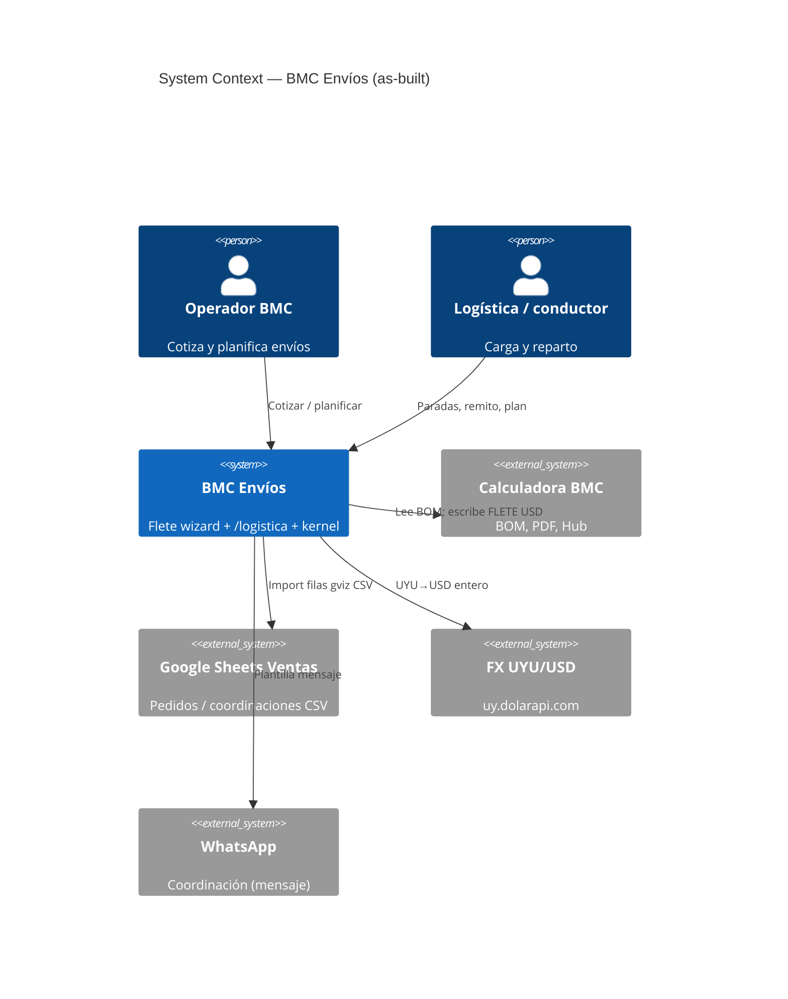
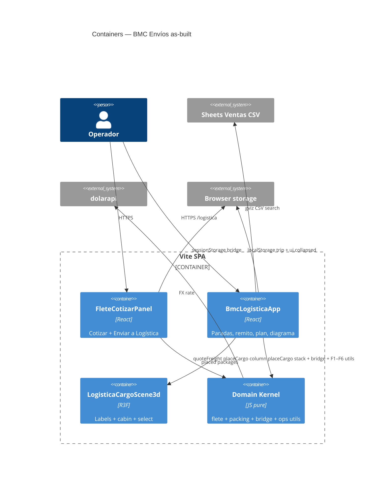
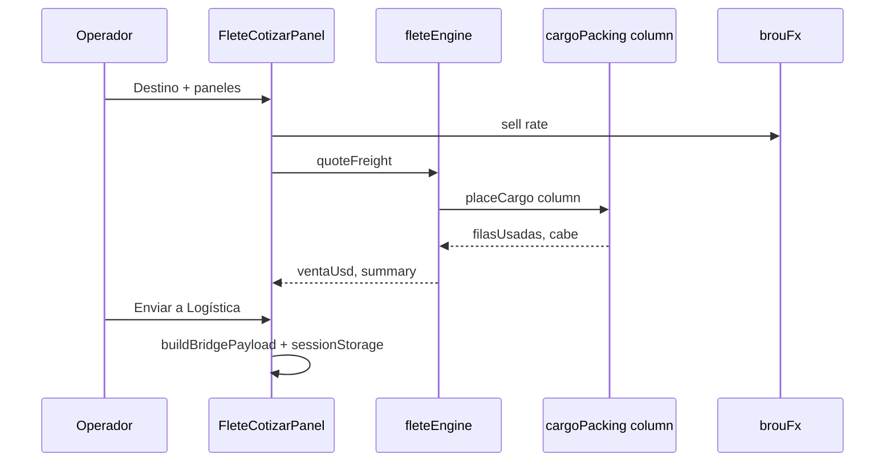
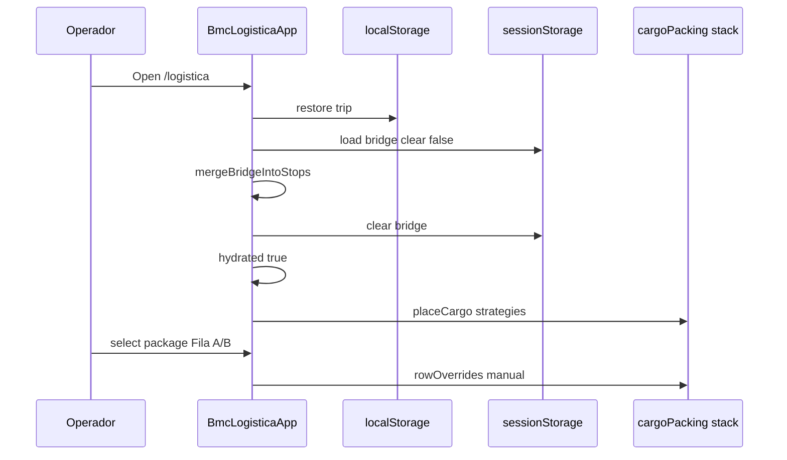

# System Design Document: BMC Envíos

**Agent brief:** One BMC module, **two UI surfaces**, one **domain kernel**. Do not invent a courier SaaS. Prefer pure utils under `src/utils/logistica/` over growing `BmcLogisticaApp.jsx`.

**Status:** *As-Built* — quote engine, dual packing engines (column freight + stack ops), quote→ops bridge, Liquid Glass chrome, Ops UX F1–F6, 1-fila tariff fix, **U3 STOP_STATUS FSM**, plus **P2 geocode MVP** (Nominatim proxy + haversine legs) and **P5 durable drafts MVP** (`envios_drafts` + `/api/envios/drafts/*`). Residual: P3 CBM-as-tariff; P2 road Distance Matrix / TSP; P5 auto-sync / multi-draft browser.

Canonical: [`TARGET.md`](./TARGET.md) · Ops detail: [`SDD-OPS-UX-WAVE.md`](./SDD-OPS-UX-WAVE.md) · Recreation: [`RECREATION-CHECKLIST.md`](./RECREATION-CHECKLIST.md) · Evidence: [`evidence/INDEX.md`](./evidence/INDEX.md).

---

## 1. Introduction & Goals

### 1.1 Problem Statement

BMC cotiza flete de paneles en el wizard de Calculadora y opera la carga en `/logistica`. Sin un kernel compartido, packing y datos se duplican. El producto ya unifica packing y el bridge quote→ops; el wave Ops UX cierra usabilidad de paradas, Ventas, remito, 3D y plan de carga.

### 1.2 Goals

| ID | Goal | Priority | Status |
|----|------|----------|--------|
| G1 | Domain kernel compartido (packing, zona, tarifas, bridge) | P0 | **DONE** |
| G2 | Single packing SoT (no local `placeCargo` in app) | P0 | **DONE** U1 |
| G3 | Bridge quote → `/logistica` without re-key | P0 | **DONE** U2 |
| G4 | Ops UX F1–F6 (collapse, Ventas chips, DnD stops, remito simple, 3D identity, fila override, plan carga) | P0 | **DONE** |
| G5 | Reglas comerciales UY (zonas, 8 m / largo, 2,4 m, retiro = 0, minimize filasUsadas) | P0 | **DONE** |
| G6 | Design tokens Liquid Glass | P1 | **DONE** |
| G7 | Agent-executable contracts + tests in `test:core` | P1 | **DONE** (pure modules) |
| G8 | FSM STOP_STATUS guards | P2 | **DONE** U3 #857 |
| G9 | Geo MVP + durable ENV MVP | P2 | **DONE** P2/P5 MVP · residual P3 + Matrix/TSP |

### 1.3 Stakeholders

| Role | Interest |
|------|----------|
| Operador comercial | Cotizar flete, override USD, PDF total |
| Logística / conductor | Paradas, estiba, remito, plan de carga |
| Ingeniería BMC | Kernel puro, tests, sin microservicio |
| AI coding agents | Spec reconstruible desde este SDD |

### 1.4 Out of scope (Core)

Courier multi-modal · aduana · microservicio ENV · CBM sustituyendo tarifa panel-zona · multi-agente runtime · TSP/isochrones.

---

## 2. Context & Scope (C4 Level 1)



### External interfaces

| Interface | Direction | Protocol | Status |
|-----------|-----------|----------|--------|
| Wizard state (proyecto, paneles) | ↔ | React | CONFIRMED |
| `quoteFreight` / packing column | internal | JS pure | CONFIRMED |
| `placeCargo` stack ops | internal | JS pure | CONFIRMED |
| Bridge `bmc-envios-bridge-v1` | ↔ sessionStorage | JSON v1 | CONFIRMED |
| Ventas gviz CSV | → | HTTPS | CONFIRMED |
| `POST /api/ventas/logistica-fecha-entrega` | → | REST auth | CONFIRMED |
| FX `getBrouUsdSellRate` | → | HTTPS | CONFIRMED |
| localStorage `bmc-logistica-online-v2` | ↔ | JSON | CONFIRMED (offline cache) |
| `POST /api/envios/geocode` | → | REST auth | CONFIRMED P2 MVP (Nominatim) |
| `GET/PUT/DELETE /api/envios/drafts/*` | ↔ | REST auth + PG | CONFIRMED P5 MVP |
| Maps Distance Matrix / TSP | — | — | TARGET P2b |

---

## 3. Constraints

| Type | Constraint |
|------|------------|
| Stack | React 18, Vite, Express 5, Node 24, Postgres platform (not required for ENV draft) |
| Deploy | Frontend Vercel SPA; API Cloud Run `panelin-calc` |
| Secrets | Doppler `prd`; no secrets in SDD |
| Domain | Uruguay road freight panels; tarifa zona + filas + largo |
| Dual packing | **Intentional:** column for freight tariffs; stack for ops geometry |
| Auth | `/logistica` shell without `RequireGrant` (ops convenience) |
| Storage | Trip draft localStorage + optional PG `envios_drafts`; bridge sessionStorage |

---

## 4. Solution Strategy

- **Modular monolith SPA** inside calculadora-bmc.
- **Domain kernel** pure JS under `src/utils/logistica/` + `fleteEngine.js` + `brouFx.js`.
- **Two packing engines in one module** (`cargoPacking.js`): `layoutEngine: "column"` for quote filasUsadas; `"stack"` for ops strategies (`balanced` / `compact` / `doorPriority`) + manual overrides.
- **Bridge U2:** build payload on Cotizar → sessionStorage → import merge on `/logistica` mount (`mergeBridgeIntoStops`, clear only after apply, hydrate gate).
- **Ops UX:** pure helpers for search/chips, stop reorder, remito metrics, package drop, load plan; UI in `BmcLogisticaApp` + `LogisticaCargoScene3d`.
- **Trade-off:** dual engines for tariff stability vs one geometry (ADR-001).

---

## 5. Container View (C4 Level 2)



| Container | Path | Status |
|-----------|------|--------|
| Quote UI | `src/components/FleteCotizarPanel.jsx` | AS-BUILT |
| Ops UI | `src/components/BmcLogisticaApp.jsx` | AS-BUILT |
| 3D scene | `src/components/logistica/LogisticaCargoScene3d.jsx` | AS-BUILT |
| Packing | `src/utils/logistica/cargoPacking.js` | AS-BUILT |
| Bridge | `src/utils/logistica/bridgePayload.js` | AS-BUILT |
| Ventas search/chips | `ventasSearch.js`, `coordinationStatus.js` | AS-BUILT F2 |
| Stop reorder | `stopReorder.js` | AS-BUILT F1/F3a |
| Remito metrics | `remitoPackageMetrics.js` | AS-BUILT F3b |
| Package drop | `packageDrop.js` | AS-BUILT F5 |
| Load plan | `loadPlanPrintModel.js` | AS-BUILT F6 |
| Load physical | `loadCharacteristics.js` | AS-BUILT |
| Geocode pure | `src/utils/logistica/geocode.js` | AS-BUILT P2 |
| Draft pure | `src/utils/logistica/enviosDraft.js` | AS-BUILT P5 |
| Envíos API | `server/routes/envios.js` | AS-BUILT P2/P5 |
| PG drafts | `envios_drafts` | AS-BUILT P5 MVP |
| Maps Matrix/TSP | — | TARGET non-MVP |

### Packing SoT (U1)

- **Freight:** `placeCargoColumn` + `pickColumnRow` minimizes `filasUsadas` (fill used fila before opening B) → stable Maldonado 1-fila USD 280 paths (#840).
- **Ops:** stack strategies + `manualOrderKeys` + `rowOverrides[stableKey]`.
- Meta on packages: `sId`, `sOrd`, `sCol`, `sCli`, **`sPed`** (order/cotización for 3D labels).

### Bridge (U2)

- Schema v1 key `bmc-envios-bridge-v1`.
- Import: restore draft → `loadBridgePayload({ clear: false })` → `mergeBridgeIntoStops` → clear → `hydrated` then persist.

---

## 6. AI Architecture — Component View

**N/A** — No LLM, RAG, or agent runtime inside BMC Envíos.  
**Evidence:** pure packing/quote/ops modules; no `agentCore` import in `src/utils/logistica/*` or `FleteCotizarPanel`. Platform Panelin agent is a separate surface.

---

## 7. Data Flow

### 7.1 Quote freight (as-built)



### 7.2 Ops plan + bridge import (as-built)



### 7.3 Ops UX features (as-built)

| ID | Behavior | Kernel |
|----|----------|--------|
| F1 | Collapsible stops; `ui.collapsedStopIds` | localStorage |
| F2 | Ventas haystack search + chips Enviado/Coordinado/Por coordinar | `ventasSearch` + `coordinationStatus` |
| F3a | Drag handle reorder stops | `stopReorder` |
| F3b | Remito Simple print: dims + cuboid m³ + material m³ | `remitoPackageMetrics` + `loadCharacteristics` |
| F4 | 3D Html labels cliente+#pedido; detail panel; translucent cabin | packing `sPed`/`sCli`; R3F |
| F5 | Select package → force fila A/B | `packageDrop` → `rowOverrides` |
| F6 | Plan carga: unload order + top/side SVG print | `loadPlanPrintModel` |

---

## 8. Deployment View

| Layer | Host | Notes |
|-------|------|-------|
| SPA | Vercel `calculadora-bmc` | SPA rewrites `/logistica` |
| API | Cloud Run `panelin-calc` | Ventas fecha, `/api/envios/*` geocode + drafts |
| CI | GitHub Actions | `gate:local` includes envios pure tests |
| Secrets | Doppler → Vercel/GCP | names only |
| Client storage | Browser | trip v2 + bridge session |

### 8.1 Local runbook

```bash
cd ~/calculadora-bmc
doppler run -- npm run dev:full
# Quote: http://localhost:5173/  → Flete step
# Ops:   http://localhost:5173/logistica
node tests/fleteEngine.test.js
node tests/cargoPacking.test.js
node tests/bridgePayload.test.js
node tests/coordinationStatus.test.js
node tests/ventasSearchFilter.test.js
node tests/stopReorder.test.js
node tests/remitoPackageMetrics.test.js
node tests/packageDrop.test.js
node tests/loadPlanPrintModel.test.js
node tests/geocode.test.js
node tests/enviosDraft.test.js
# API (requires API_AUTH_TOKEN + optional DATABASE_URL):
# curl -H "Authorization: Bearer $API_AUTH_TOKEN" -H 'Content-Type: application/json' \
#   -d '{"address":"Maldonado"}' http://localhost:3001/api/envios/geocode
```

---

## 9. Crosscutting Concepts

### Security

- No grant gate on `/logistica` (conscious ops trade-off).
- Bridge/sessionStorage and localStorage hold customer names/addresses — device local only.
- Sheets write, geocode, and cloud drafts require `API_AUTH_TOKEN` / `VITE_BMC_API_AUTH_TOKEN`.

### Reliability

- Hydrate gate prevents empty stops wiping localStorage.
- Bridge clear only after successful apply.
- Dual packing intentional for tariff stability.

### Performance

- Lazy `LogisticaCargoScene3d`; drei Html labels may clutter dense loads (select still works).
- Quote p95 local dominated by FX fetch (cached when possible).

### Observability

- Client-side only for ENV draft; platform logs on API ventas.

### Cost / sustainability

- No LLM cost; client packing CPU only.

---

## 10. Architecture Decisions (ADRs)

### ADR-001: Dual packing engines in one module

**Status**: Accepted  
**Context**: Pure stack packing changed 40-panel Maldonado tariff vs historical column occupancy.  
**Decision**: Keep **column** for freight `filasUsadas`; **stack** for ops visualization/strategies.  
**Consequences**: + tariff stability; − two mental models.  
**Alternatives**: Single engine only (rejected); two files (worse SoT).

### ADR-007: Quote ↔ Ops bridge sessionStorage

**Status**: Accepted  
**Context**: Operators re-typed panels after quoting.  
**Decision**: Versioned JSON bridge key `bmc-envios-bridge-v1`; merge into draft; clear after apply.  
**Consequences**: + fast handoff; − not multi-device (P5).  
**Alternatives**: Server ENV draft (P5); clipboard JSON.

### ADR-011: Minimize filasUsadas (`pickColumnRow`)

**Status**: Accepted (#840)  
**Context**: Load-balance opened fila B → false 2-fila quotes.  
**Decision**: Prefer already-used rows that fit.  
**Consequences**: + correct 1-fila tariffs; − denser single row stacks.

### ADR-012: Ops UX pure helpers (F1–F6)

**Status**: Accepted  
**Context**: Monolithic app risk.  
**Decision**: Extract search, chips, reorder, remito metrics, package drop, load plan to pure modules + thin UI wiring.  
**Consequences**: + testability; − more files.  
**Alternatives**: All logic in JSX (rejected).

### ADR-013: Manual layout via overrides not free 3D physics

**Status**: Accepted (F5)  
**Context**: Operators need to correct fila placement.  
**Decision**: `rowOverrides` + `cargoLayoutMode: "manual"`; SVG/3D select → Fila A/B buttons (not free-space DnD day-1).  
**Consequences**: + safe vs engine; − no arbitrary x drag.

### ADR-014: Remito Simple visual clone of Presupuesto Simple

**Status**: Accepted (F3b)  
**Context**: Remito must look like BMC quote PDFs.  
**Decision**: Print CSS navy `#003366` + BOM tables; browser print, not full `simple.js` PDF pipeline.  
**Alternatives**: Server PDF render (deferred).

### ADR-015: P2 geocode via Nominatim proxy + haversine (not Distance Matrix)

**Status**: Accepted (MVP)  
**Context**: Operators need coords / map pin without Google billing day-1.  
**Decision**: `POST /api/envios/geocode` proxies Nominatim (`countrycodes=uy`); client stores `stop.geo`; leg distances are **haversine air-km** only.  
**Consequences**: + no Maps API key; − not road distance; rate-limited.  
**Alternatives**: Google Geocoding + Distance Matrix (future, needs key + cost).

### ADR-016: P5 durable drafts in `envios_drafts` (localStorage cache)

**Status**: Accepted (MVP)  
**Context**: Multi-device ops pain; full shipment microservice out of scope.  
**Decision**: Upsert JSON draft by ENV number in Postgres; UI explicit Save/Load; localStorage remains offline cache.  
**Consequences**: + multi-device; − manual sync; last-write-wins.  
**Alternatives**: Auto-sync always-on; reuse transportista `trips` (different lifecycle).

### ADR-021: Never stack panels on profiles (hard constraint)

**Status**: Accepted  
**Context**: Physically impossible to load sandwich panels on top of perfilería/accessory bultos; auto-packer ignored kind.  
**Decision**: `stackConstraints.js` — `canPlaceOnTop` forbids panel on accessory; stack engine filters candidates; post-place `validatePlacedStacks`; manual commits preview+reject; UI hint + PERFIL badge. Profiles may sit on panels, other ACC, other row, or separate longitudinal stack — and may leave their stop’s panels.  
**Consequences**: + physical layouts; − ACC-first manual order may open extra stacks.  
**Alternatives**: Silent auto-repair (rejected — surprises ops); free 3D physics (deferred).

---

### ADR-026: Etiquetas propias A4, sin integración con agencias de encomienda

**Status**: Accepted
**Context**: Los bultos salen sin rótulo. Las agencias uruguayas (DAC/Agencia Central, Turil, Nossar) exigen rotulado con datos completos del remitente porque son los que se usan si el envío se devuelve. Ninguna publica API abierta de generación de etiquetas: el flujo estándar de DAC es que su sistema emite la etiqueta, la manda por mail al remitente, y este la imprime y la pega.
**Decision**: Generar etiquetas propias en HTML/CSS sobre hoja A4 con grilla y líneas de corte, renderizadas por `renderHtmlToPdfBuffer` (que ya honra `@page` vía `preferCSSPageSize`) con fallback `window.print()`. La numeración `k/N` reutiliza `packageBultoCounts()` sin duplicar lógica. Código de barras Code128-B en SVG puro, sin dependencia npm nueva. Catálogo de agencias con el patrón de `pickupCatalog.js` (seed + custom del usuario).
**Consequences**: + cero hardware, cero dependencias, cero acoplamiento a un tercero; + el mismo motor admite rollo térmico con solo cambiar el preset de `@page`; − hay que mantener un Code128 propio; − sin integración, el número de seguimiento de la agencia se carga a mano.
**Alternatives considered**: Integrar API de DAC (no existe pública); librería QR (suma dependencia — diferido a fase 2); impresora térmica day-1 (rechazado: exige hardware).

---

### ADR-027: Remito por cliente es POD interno, no e-Remito fiscal

**Status**: Accepted
**Context**: Se necesita un comprobante por cliente que el cliente firme y retenga. En Uruguay el e-Remito es un CFE que documenta el traslado de mercadería, es obligatorio cuando se traslada sin factura simultánea y exige firma electrónica avanzada de un emisor habilitado por DGI. La Calculadora no es ni puede ser ese emisor.
**Decision**: Emitir un **comprobante de entrega interno (POD)**, uno por parada, con dos copias en la misma hoja A4 (Original — Cliente / Duplicado — BMC), bloque de firma y observaciones de recepción. El encabezado declara explícitamente que no tiene valor fiscal. Campo opcional `eRemitoNro` para referenciar el CFE emitido aparte por el sistema de facturación.
**Consequences**: + resuelve la necesidad operativa sin riesgo de cumplimiento; + se puede emitir sin integrar ningún proveedor; − sigue haciendo falta emitir el e-Remito fiscal por fuera; − riesgo de que un operador confunda ambos papeles, mitigado por la leyenda.
**Alternatives considered**: Integrar un emisor de CFE (alcance mucho mayor, fuera de esta línea de trabajo); no emitir nada y seguir con la hoja de ruta única (rechazado: no sirve al cliente).

---

### ADR-028: `TruckVisual` es visual puro y no debe interceptar punteros

**Status**: Accepted
**Context**: `TruckVisual` (#937) se monta en el mismo `<Canvas>` que OrbitControls y el free-drag de bultos. Su captador de clic invisible cubre todo el volumen de la cabina y llama `stopPropagation` + `stopImmediatePropagation` en `pointerdown`/`pointerup`, con lo que la interacción de cámara y de arrastre puede quedar bloqueada sobre esa zona.
**Decision**: `TruckVisual` es **visual puro**: recibe solo `{ shiftX, truckL }`, no altera packing ni coordenadas de carga, y **no debe consumir eventos de puntero que la escena necesita**. Solo puede interceptar `onClick` (para las luces de cabina); `pointerdown`/`pointerup`/`pointermove` deben propagar. El contrato de coordenadas (`TRUCK_W = 2.4`, cargo X `[shiftX, shiftX+truckL]`, cabina en `X < shiftX`) es vinculante para cualquier componente que se sume a la escena.
**Consequences**: + la cámara y el free-drag siguen funcionando sobre toda la escena; + cualquier decorado futuro tiene una regla clara; − el clic de luces necesita un handler más cuidadoso que un captador de volumen.
**Alternatives considered**: `raycast={null}` en el captador y mover el handler a la carrocería (equivalente, elegible en implementación); quitar las luces de cabina (rechazado: es feedback que el operador ya usa).

---

## 11. Risks & Technical Debt

| Risk | Impact | Likelihood | Mitigation |
|------|--------|------------|------------|
| Ventas column drift | Search/chips wrong | Med | Header map + haystack; evidence dump |
| Dense 3D labels | Clutter | Med | Truncate; detail panel always |
| Dual engines drift | Tariff vs ops mismatch | Low | Shared module + tests |
| localStorage wipe | Data loss | Low | hydrated gate + merge bridge |
| Manual cloud sync only | Ops forgets save | Med | Explicit buttons + later autosave |
| Nominatim rate / outage | No geocode | Low | Parse lat,lng from map link; cache geo on stop |
| Haversine ≠ road km | Misread trip length | Med | Label as “km aire”; Matrix later |
| BmcLogisticaApp size | Maintainability | High | Continue extract pure helpers |
| `TruckVisual` pointer capture (V1) | Cámara / free-drag bloqueados sobre la cabina | High | ADR-028; ver `SDD-3D-VISOR.md` §Diagnóstico |
| `truckL` sin coerción al restaurar draft (V2) | Coordenadas NaN en la escena | Med | Coercionar en el borde + guard en la escena |
| Visor sin cobertura de comportamiento (V7) | Regresiones invisibles | High | El único test es un grep estructural |
| `trips` ↔ `repartos` desunidos | Un mismo reparto existe dos veces sin cruce posible | Med | Decidir modelo canónico de viaje |
| `reparto_documents` sin escritor | Documentos efímeros, sin trazabilidad | High | Primer escritor en `SDD-REMITO-CLIENTE.md` §8 |
| Tests de repartos huérfanos | Falsa sensación de cobertura | High | Cablear a `package.json` |
| Endpoints de transportista sin tests HTTP | Deriva de contrato | Med | Suite de contrato |
| `POST /api/pdf/generate` sin auth | Documentos con datos de cliente | Med | Ruta dedicada con auth para POD y etiquetas |
| `DRIVE_REPARTOS_FOLDER_ID` referenciada pero indefinida | Archivado en Drive no habilitable | Low | Definirla antes de la fase 3 |

---

## 12. Glossary

| Term | Meaning |
|------|---------|
| filasUsadas | Occupied bed rows A/B for tariff |
| column engine | Freight packer height-into-rows |
| stack engine | Ops longitudinal stacks + strategies |
| bridge | Quote→ops sessionStorage handoff |
| sCli / sPed | Package meta cliente / pedido |
| stableKey | Manual layout identity for overrides |
| Enviado / Coordinado / Por coordinar | Ventas coordination chips (F2) |
| batchKey | Coordination date → chip color |
| cuboid m³ | L×ROW_W×H per package |
| material m³ | Panel m²×thickness estimate |
| ENV-… | Ops remito number |

---

## Appendix A — Domain rules (summary)

- Retiro planta → venta USD 0.  
- Zonas: retiro, costa, mvd, canelones, maldonado_corredor, especial.  
- 1 fila vs 2 filas tariffs; remolque / camión largo by length.  
- MAX height ops display 2.5 m; freight column uses freight max H.  
- ROW_W = 1.2 m nominal.

---

## Appendix B — Gherkin (shipped)

```gherkin
Feature: BMC Envíos as-built
  Scenario: Maldonado 1 fila stays 280
    Given 9 to 16 ISODEC 100mm panels length 6m
    When quoteFreight destino Maldonado fx 40
    Then filasUsadas is 1 and ventaUsd is 280

  Scenario: Bridge merges into draft
    Given logistics draft with meaningful stop
    When bridge payload imported
    Then draft stops append not wipe

  Scenario: Ventas search by pedido
    Given mapped row orderId BMC-123
    When search "BMC-123"
    Then row matches

  Scenario: Force package to fila B
    Given package stableKey K
    When applyPackageLayoutChange targetRow 1
    Then rowOverrides[K] is 1 and mode manual
```

---

## Appendix C — OpenAPI sketch (live MVP)

| Method | Path | Auth | Notes |
|--------|------|------|-------|
| GET | `/api/envios/health` | none | geocode flag + db ping |
| POST | `/api/envios/geocode` | Bearer API | body `{ address }` or `{ lat, lng }` |
| GET | `/api/envios/drafts` | Bearer API | recent list |
| GET | `/api/envios/drafts/:id` | Bearer API | full payload |
| PUT | `/api/envios/drafts/:id` | Bearer API | upsert JSON draft |
| DELETE | `/api/envios/drafts/:id` | Bearer API | remove |

Client pure engines remain packing/quote SoT. Transportista `/api/trips/*` is a **separate** driver lifecycle.

---

## Appendix D — Unification + Ops backlog

| ID | Item | Status |
|----|------|--------|
| U1 | Packing SoT | **DONE** |
| U2 | Bridge | **DONE** |
| F1–F6 | Ops UX wave | **DONE** #842–#849 |
| U3 | FSM guards | **DONE** #857 |
| P2 | Geocode MVP | **DONE** Nominatim + haversine |
| P2b | Road Distance Matrix / TSP | **DEFERRED** 2026-Q4 |
| P3 | CBM non-panel | **DEFERRED** 2026-Q4 |
| P5 | Server ENV drafts MVP | **DONE** `envios_drafts` |
| P5b | Autosave / conflict / browser | **DONE** |
| F10b | Package list DnD | **DONE** |

---

## Changelog

| Ver | Date | Notes |
|-----|------|-------|
| 1.0–1.1 | 2026-08-04 | Hybrid as-built + evolution checklist |
| 1.2 | 2026-08-04 | U1 + U2 shipped |
| 1.3 | 2026-08-05 | Linked OPS-UX-WAVE; U1/U2 marked done in brief |
| 1.4 | 2026-08-05 | Full as-built: F1–F6 CONFIRMED, C4/bridge fixed, ADRs 011–014, evidence alignment, glory re-audit |
| 1.5 | 2026-08-05 | P2 geocode MVP + P5 durable drafts MVP; ADR-015/016; `/api/envios/*` live |
| 1.6 | 2026-08-05 | Ops UX Wave 2 F7–F11: onDark buttons, package identity, client group drawer, stack above/below, Ventas proxy |
| 1.7 | 2026-08-06 | P5b autosave+409 conflict+draft browser; F10b package DnD; P2b/P3 DEFERRED 2026-Q4; safeExternalUrl |
| **1.8** | **2026-08-08** | **Revisión completa de logística: ADR-026 (etiquetas A4 propias), ADR-027 (remito POD no fiscal), ADR-028 (`TruckVisual` visual-only); §11 ampliada con V1/V2/V7 del visor, `trips`↔`repartos` desunidos, `reparto_documents` sin escritor, tests huérfanos y PDF sin auth. Nuevos: `SDD-LOGISTICA-REVISION-2026-08-08.md`, `SDD-ETIQUETAS-BULTOS.md`, `SDD-REMITO-CLIENTE.md`** |
