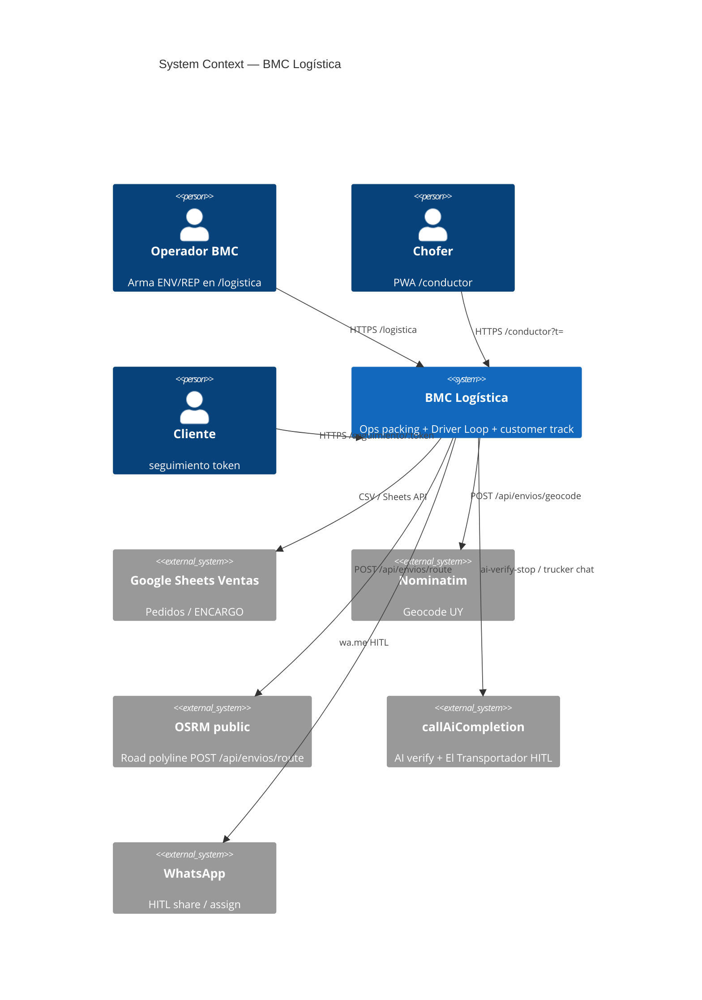
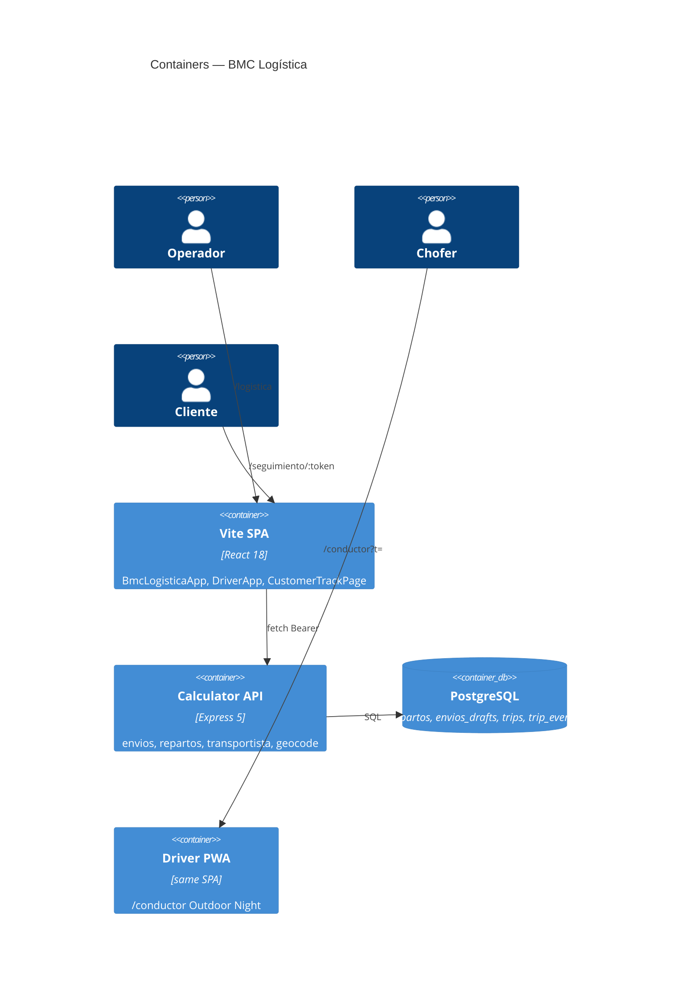

# System Design Document: BMC Logística

**Agent brief:** One product, three humans (operador, chofer, cliente). Recreate join **confirm → `driver_url` `/conductor?t=` → Driver PWA → `/seguimiento/:token`**. Do not invent a courier SaaS or native store app. Prefer cited modules over new APIs.

**Status:** *As-Built Final v1.1* — operator packing + Driver Loop **and** mesa ops (Leaflet/OSRM road map, Tetris load, El Transportador HITL + Grok Voice, Asignar a chofer, yard lanes) **CONFIRMED on `main`** (`src/` + `server/`). Worktree `logistica-mesa-depo` is a local lab only; it is not the production SoT.

Canonical: [`TARGET.md`](./TARGET.md) · Recreation: [`RECREATION-CHECKLIST.md`](./RECREATION-CHECKLIST.md) · Children: envíos SCORECARD 96 · driver-loop TARGET D1–D6.

---

## 1. Introduction & Goals

### 1.1 Problem Statement

BMC Uruguay moves sandwich panels with hired **transportistas**. Operators plan trips in `/logistica` (Ventas rows, packing, remito, road map, 3D load). Drivers need a **phone PWA**, not the operator Shell. Customers need a **single-stop** track page. Confirm emits `driver_url`; Asignar a chofer HITL-shares WhatsApp. El Transportador (text + Grok Voice) never auto-sends WA.

### 1.2 Goals

| ID | Goal | Priority | Status |
|----|------|----------|--------|
| G-OPS | Staged wizard + packing SoT + 3D + drafts | P0 | CONFIRMED `bmc-envios` |
| G-JOIN | Confirm REP → `trips` + `driver_url` `/conductor?t=` (D1) | P0 | CONFIRMED `repartos.js` + `conductorUrl.js` |
| G-PWA | Five Driver screens, no operator chrome (D2–D4) | P0 | CONFIRMED `DriverApp.jsx` |
| G-CUST | Isolated `/seguimiento/:token` (D5) | P1 | CONFIRMED page; GPS policy TARGET-complete |
| G-MESA | Road map + yard lanes + Tetris + assign WA + El Transportador Voice | P1 | CONFIRMED `main` (port 2026-08-27) |
| G-DOC | Recreation SDD ≥90 for ops+driver as one story | P0 | this kit v1.1 |

### 1.3 Stakeholders

| Role | Interest |
|------|----------|
| Operador logística | Plan trip, confirm, one-tap assign chofer |
| Chofer / transportista | Open link, load sequence, GPS in transit |
| Cliente obra | Only own stop ETA |
| Ingeniería BMC | Pure utils, tests, no extra microservice |
| AI agents | Rebuild from this SDD + cited files |

---

## 2. Context & Scope (C4 Level 1)



### External Interfaces

| Interface | Direction | Protocol | Evidence |
|-----------|-----------|----------|----------|
| Browser SPA Vite/Vercel | ← humans | HTTPS | CONFIRMED `App.jsx` routes |
| Express API Cloud Run | ← SPA | REST Bearer | CONFIRMED `server/index.js` |
| `POST /api/repartos/:id/confirm` | ← ops | JSON | CONFIRMED `server/routes/repartos.js` |
| `POST /api/repartos/:id/driver-link` | ← ops | JSON | CONFIRMED retry link |
| `GET/PUT /api/envios/drafts/*` | ↔ ops | JSON | CONFIRMED P5 |
| `POST /api/envios/geocode` | → Nominatim | JSON | CONFIRMED |
| `POST /api/envios/ai-verify-stop` | → LLM | JSON HITL | CONFIRMED |
| `POST /api/envios/route` | → OSRM | JSON | CONFIRMED-in-worktree only |
| Postgres `repartos`, `trips`, `trip_events` | ↔ API | SQL | CONFIRMED |
| WhatsApp `wa.me` | → chofer | HTTPS HITL | CONFIRMED share; assign helper worktree |

---

## 3. Constraints

| Kind | Constraint |
|------|------------|
| Stack | React 18 + Vite 7 + Express 5 + PG; no new microservice |
| Product | Uruguay panels; hired trucks; not SaaS courier |
| Visual | Ops Liquid Glass; Driver Outdoor Night (navy/orange) — two languages, one domain |
| Security | Bearer `API_AUTH_TOKEN`; driver token in query `t`; customer token hashed |
| HITL | Never auto-send WA/mail; never invent lat/lng |
| Git | Mesa dirty worktree must not be documented as `main` |
| Packing | `placeCargo` SoT in `cargoPacking.js`; tariffs panel-zona unchanged |
| Native | No App Store (D6) |

---

## 4. Solution Strategy

- **Modular monolith:** same SPA hosts `/logistica`, `/conductor`, `/seguimiento`; same API hosts envios + repartos + transportista.
- **Join is confirm:** `POST .../confirm` snapshots payload, status `coordinado`, mints trip, returns `driver_url = conductorPublicUrl(spa, token)` — **never** `/calculadora/conductor` as the live chofer URL.
- **Kernel:** `src/utils/logistica/*` pure; Driver UI `src/components/driver/*`.
- **AI:** structured verify on stops (main); conversational El Transportador (worktree) ACTION_JSON HITL, `chatTools=[]` on logística turns.
- **Trade-off:** dual packing engines (column freight vs stack ops) remain ADR from envíos. Road OSRM is additive TARGET.

---

## 5. Container View (C4 Level 2)



**Key modules (CONFIRMED `main` unless noted):**

| Module | Path |
|--------|------|
| Ops app | `src/components/BmcLogisticaApp.jsx` |
| Driver app | `src/components/driver/DriverApp.jsx` |
| Public conductor URL | `src/utils/conductorUrl.js` |
| Confirm join | `server/routes/repartos.js` `POST /:id/confirm` |
| Packing | `src/utils/logistica/cargoPacking.js` |
| Wizard | `src/utils/logistica/wizardState.js` |
| AI verify | `src/utils/logistica/aiVerifyStop.js` |
| Yard (simple) | `src/utils/logistica/yardLayout.js` |
| Leaflet map | worktree `RouteLeafletMap.jsx` |
| Tetris | worktree `tetrisPack.js` |
| Assign WA | worktree `driverAssign.js` |
| Trucker agent | worktree `truckerAgent.js` |

---

## 6. AI Architecture — Component View

**Not N/A.** Two HITL loops exist; packing itself is deterministic (no LLM).

| Component | Role | Where | Evidence |
|-----------|------|-------|----------|
| Stop verify | LLM structured proposal; **Aplicar** human gate | `POST /api/envios/ai-verify-stop`, `enviosAiVerify.js` | CONFIRMED main |
| El Transportador | Chat + visor; ACTION_JSON mutate wizard/fields; no tools | worktree `truckerAgent.js`, `LogisticaTruckerAgent.jsx` | CONFIRMED-in-worktree |
| Tetris / OSRM | Deterministic; **not** LLM | `tetrisPack.js`, `osrmPolyline.js` | worktree |

### LLM Strategy

| Decision | Choice |
|----------|--------|
| Provider | Existing `callAiCompletion` (same as Panelin; logística prompts isolated) |
| Verify | JSON paneles/accesorios/fields; apply only on confirm |
| Transportador | Text ACTION_JSON; HITL; never invent streets |
| Fallback | If no token, operator continues without AI |

### RAG Architecture

**N/A** — no vector index for logística. Evidence packs are assembled in-process from stop fields + adjunto text (`buildAiVerifyEvidencePack`).

### Cost Model

Verify is on-demand per incomplete stop. Transportador is operator-initiated. No batch crawl. Token spend is ops-time, not quote path.

---

## 7. Data Flow

Primary join (D1):

```mermaid
sequenceDiagram
  participant Op as Operador
  participant SPA as /logistica
  participant API as Express
  participant PG as Postgres
  participant Drv as Chofer PWA

  Op->>SPA: Pedidos, flota, ruta, carga
  Op->>SPA: Confirmar coordinación / Asignar a chofer
  SPA->>API: POST /api/repartos/{id}/confirm
  API->>PG: snapshot payload, status coordinado
  API->>PG: insert trip + driver token
  API-->>SPA: driver_url /conductor?t=
  SPA-->>Op: copy link; optional wa.me (HITL)
  Op->>Drv: share URL
  Drv->>API: session from t
  Note over Drv: /conductor /carga /listo /perfil
```

Yard → Tetris (TARGET worktree): Descargar camión → `buildYardDump` lanes → Cargar Tetris → `tetrisPlaceCargo` reverse-route + `fillLedgePockets` → freePositions zone truck.

---

## 8. Deployment View

| Env | Host | Notes |
|-----|------|-------|
| Prod SPA | Vercel `calculadora-bmc.vercel.app` | `/logistica`, `/conductor`, `/seguimiento` |
| Prod API | Cloud Run `panelin-calc` | confirm, geocode, drafts |
| Local main | Vite `:5173` + API `:3001` | `doppler run -- npm run dev` |
| Local mesa | Vite `:5174` + API `:3002` | `BMC_API_PROXY`; CORS must allow 5174 |
| Local driver worktree | Vite `:5175` | login paste-link delta |
| Secrets | Doppler `bmc-frontend/prd`, `bmc-backend/prd` | names only: `API_AUTH_TOKEN`, Sheets, Drive |

CI: GitHub Actions deploy frontend + API. This SDD cycle does **not** require `npm run gate:local` (docs goal). Tests: `node tests/conductorUrl.test.js`, `node tests/wizardState.test.js`, `node tests/aiVerifyStop.test.js`, worktree `tetrisPack.test.js` / `driverAssign.test.js`.

---

## 9. Crosscutting Concepts

### 9.1 Security

- Ops: Bearer + optional `bmc_sess` cookie; CORS allowlist localhost + prod.
- Driver: opaque token in query; HttpOnly session after login.
- Customer: hashed tokens; no other stops’ PII (D5).
- `safeHttpUrl` on Maps links (wizard XSS harden CONFIRMED).
- AI verify does not write Sheets until human Aplicar.

### 9.2 Reliability

- Confirm 409 if already coordinado (immutable snapshot).
- OSRM fail-open to haversine (worktree `attachOsrmToRoute`).
- Drafts: expectedRevision 409 conflict UI (P5).

### 9.3 Performance & Scalability

- Packing CPU in-browser pure; OSRM cache 48/10min worktree.
- Driver PWA 390×844 first.

### 9.4 Observability

| Concern | Tool |
|---------|------|
| API logs | pino-http |
| Ops toasts | `autoLoadMsg` |
| Driver events | `trip_events` |

### 9.5 Cost Optimization

Nominatim/OSRM public; LLM only HITL clicks. No Distance Matrix billing (ADR envíos).

### 9.6 Sustainability

Reuse public OSRM; no extra GPU. N/A green-ops beyond that.

---

## 10. Architecture Decisions (ADRs)

### ADR-L01: One SPA for ops and Driver

**Status**: Accepted (Observed)  
**Context**: Chofer must not see operator Shell.  
**Decision**: Same Vite app, distinct routes `/logistica` vs `/conductor/*` lazy `DriverApp`.  
**Consequences**: + one deploy; − two visual languages in one bundle.  
**Alternatives**: Separate Driver repo — rejected (token + trip already in this API).

### ADR-L02: Confirm is the join, not ENV draft

**Status**: Accepted  
**Context**: ENV drafts persist packing; chofer needs a trip row.  
**Decision**: `POST /api/repartos/:id/confirm` mints trip + `driver_url`.  
**Consequences**: + D1; − cannot drive from unsaved local-only draft without API.  
**Alternatives**: Reuse ENV id as trip — rejected (REP batch identity).

### ADR-L03: conductorPublicUrl never Cloud Run path

**Status**: Accepted  
**Context**: `/calculadora/conductor` is cotizador.  
**Decision**: `conductorPublicUrl(spa, token)` → `{spa}/conductor?t=`.  
**Consequences**: + correct PWA; legacy redirect exists.  
**Alternatives**: API-hosted chofer HTML — rejected.

### ADR-L04: Mesa OSRM/Tetris/agent stay worktree until merge

**Status**: Accepted  
**Context**: Dirty mesa tree is richest ops UX.  
**Decision**: Document as TARGET / CONFIRMED-in-worktree, not main CONFIRMED.  
**Consequences**: + honest evidence; − operators on prod miss Tetris/OSRM.  
**Alternatives**: Silent claim of prod parity — rejected.

### ADR-L05: HITL WhatsApp assign

**Status**: Proposed (worktree)  
**Context**: One-tap assign.  
**Decision**: `openDriverAssign` opens `wa.me` + Driver URL; API `notify_driver` remains optional flag.  
**Consequences**: + no auto-spam; − two popups.  
**Alternatives**: Cloud API send — rejected (ban/HITL).

---

## 11. Risks & Technical Debt

| Risk | Impact | Likelihood | Mitigation |
|------|--------|------------|------------|
| Mesa never merges | High | Medium | This SDD + inventory; merge as later PR |
| Confirm without API | Medium | High local | Local confirm; no driver_url; UI states it |
| GPS privacy | High | Low | D5 hashed tokens; transit window |
| Leaflet XSS labels | Medium | Low | worktree tooltip sanitize on origin tip |
| Dual packing engines | Low | Accepted | envíos ADR-001 |
| Driver login paste vs token | Low | Worktree vs main | `fix/driver-login-paste-link` unique 4 files |

---

## 12. Glossary

| Term | Meaning |
|------|---------|
| ENV | Envío draft (`ENV-…`) packing session |
| REP | Reparto batch confirmed to Drive/PG |
| `driver_url` | Public BMC Driver link `/conductor?t=` |
| Door / puerta | Tail of bed; last-on / first-off |
| Yard / patio | Packages off truck in lanes/stacks |
| Tetris | Compact stack + ledge fill after reverse-route load |
| HITL | Human confirms send/apply |
| Outdoor Night | Driver visual spec navy/orange |
| Liquid Glass | Ops visual spec |
| CONFIRMED-in-worktree | Exists in `logistica-mesa-depo`, not `origin/main` |

---

## Appendix A — Evidence Index

| ID | Claim | Tag | Source |
|----|-------|-----|--------|
| E1 | SPA routes logistica/conductor | CONFIRMED | `src/App.jsx` |
| E2 | confirm returns driver_url | CONFIRMED | `server/routes/repartos.js` |
| E3 | conductorPublicUrl | CONFIRMED | `src/utils/conductorUrl.js` + `tests/conductorUrl.test.js` |
| E4 | DriverApp tabs | CONFIRMED | `DriverApp.jsx` |
| E5 | AI verify | CONFIRMED | `aiVerifyStop.js` |
| E6 | OSRM route POST | CONFIRMED-in-worktree | mesa `server/routes/envios.js` |
| E7 | Tetris | CONFIRMED-in-worktree | `tetrisPack.js` |
| E8 | Assign WA | CONFIRMED-in-worktree | `driverAssign.js` |
| E9 | Yard lanes | CONFIRMED-in-worktree | `yardLayout.js` mesa |
| E10 | Simple yard dump | CONFIRMED main | `yardLayout.js` main |

## Appendix B — Recreation Checklist

See [`RECREATION-CHECKLIST.md`](./RECREATION-CHECKLIST.md).
