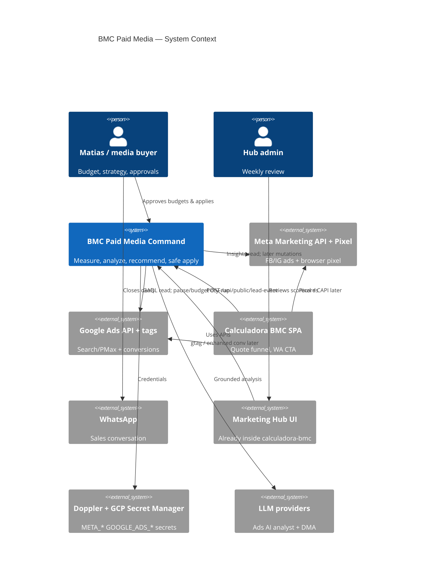
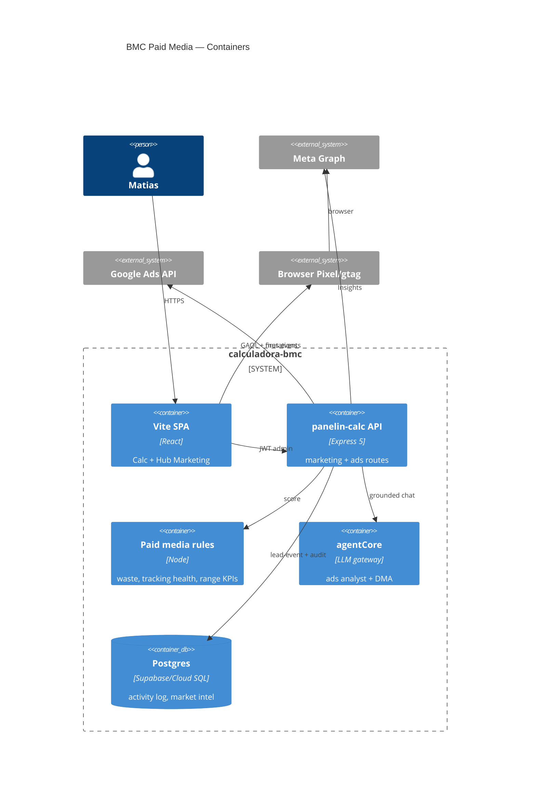
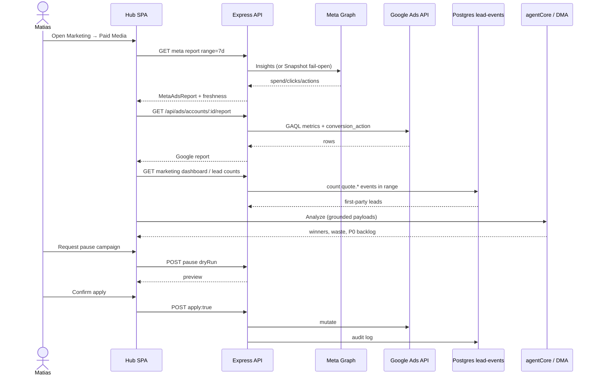
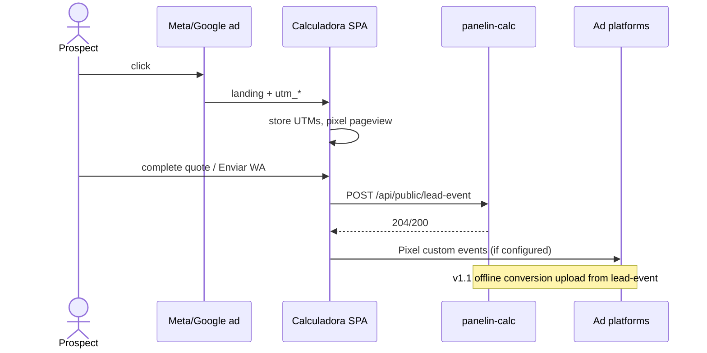
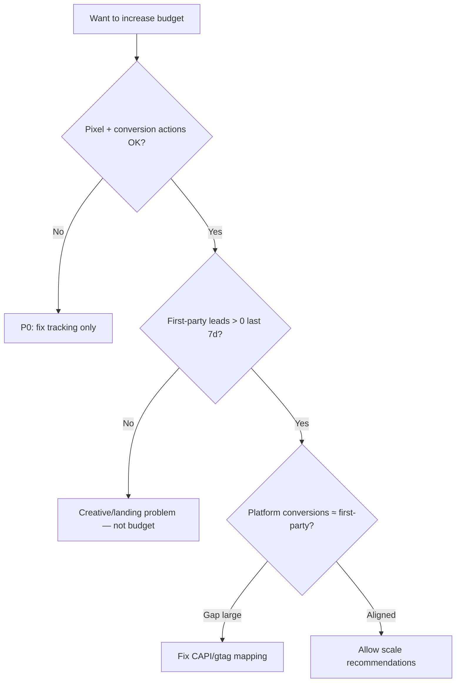

# System Design Document: BMC Paid Media (Meta + Google Ads)

**Purpose:** The single architecture for how Matias / BMC Uruguay **plans, measures, operates, and improves** Meta Ads and Google Ads (AdWords) campaigns — software control plane inside `calculadora-bmc` **plus** the campaign structure and operating model that prevent “spend without signal.”

This is a **target-state** design grounded on code and procedures already in the repo (Meta Live Report PR1–PR3, Google Ads client/routes, public lead beacons, Meta Pixel). It is **not** a substitute for the Meta-only as-built SDD; it **unifies** both channels into one command system.

---

## 1. Introduction & Goals

### 1.1 Problem statement

BMC’s commercial engine depends on paid media, but historically:

1. **Measurement was broken** — large Meta and Google spend with **0 platform conversions** while CTR/CPC looked “healthy,” because calculator/WhatsApp actions were invisible to ads platforms (see PROJECT-STATE 2026-07-13 lead-event + pixel work; Google remediation PDF: ~13k clicks, 0 conversions).
2. **Channel tooling is asymmetric** — Meta has a Hub **Ads · Meta** live/demo/snapshot report + AI analyst; Google has API **read + dry-run mutations** under `/api/ads` but no parity UI report.
3. **Ops is fragmented** — Ads Manager, Google Ads UI, Hub, GA4, WhatsApp, and quote funnel are not one closed loop for “budget → lead → quote → close.”
4. **Mutations are dangerous** — any pause/budget change must stay **human-gated** and audited (existing Google routes already default dry-run).

The system to design is a **Paid Media Command Plane**: truth of spend + conversions, recommended actions, safe apply path, and a **campaign architecture** (how accounts/campaigns should be structured for Uruguay panels).

### 1.2 Goals (SMART)

| ID | Goal | Priority | Success metric |
|----|------|----------|----------------|
| **G1** | **Closed-loop measurement** — every primary conversion (quote WA, quote complete, and optional purchase/lead) is visible in Meta + Google within 24h | P0 | Platform conversion count > 0 when organic leads exist; null ≠ 0 policy |
| **G2** | **Dual-channel weekly scorecard** in Hub — Meta + Google same date range, same freshness badges | P0 | One screen: spend, clicks, CPL/CPA, leads, MER proxy |
| **G3** | **Waste control** — detect zombie campaigns, learning-limited Meta sets, Search terms with 0 conv | P0 | Weekly P0 backlog ≤5 actions with evidence |
| **G4** | **Safe ops** — pause/enable/budget only via dry-run → human confirm → audit log | P0 | 100% mutations audited; no silent apply |
| **G5** | **Campaign architecture v1** — documented taxonomy (Search brand, Search non-brand, PMax/Shopping if catalog, Meta TOF/MOF/BOF) with naming + budgets | P1 | Live structure matches playbook ≥80% |
| **G6** | **Agent-assisted analysis** — digital-marketing-agent + Meta AI analyst use LIVE data when secrets present | P1 | Report freshness LIVE or honest Snapshot |

### 1.3 Stakeholders

| Role | Who | Interest |
|------|-----|----------|
| Owner / media buyer | Matias Portugau | ROAS/CPL, cash control, growth |
| Ops admin | Hub admin users | Weekly review, pause waste |
| Engineering | bmc-dev | Extend Hub + APIs cleanly |
| AI analyst | agentCore / DMA skill | Grounded recommendations |
| Platforms | Meta BM, Google Ads MCC | Compliance, tracking, billing |

### 1.4 Non-goals (v0.1 design)

- Fully autonomous bid robots / always-on auto-apply  
- TikTok / LinkedIn / ML Product Ads (separate SDD later)  
- Replacing Ads Manager for creative upload  
- Paying invoices or Policy Manager appeals (human/financial)  
- Wonderlytics-style multi-store Shopify analytics (different product)

### 1.5 Success metrics (business)

| Metric | Definition | Guardrail |
|--------|------------|-----------|
| **CPL (lead)** | Spend / qualified lead events | Prefer own beacon + platform |
| **Cost per quote WA** | Spend / `quote.send.whatsapp` | Primary BMC action |
| **MER proxy** | Ad spend / attributed sales (if available) | When ERP/Sheets later |
| **Waste rate** | Spend on campaigns with 0 results / total spend | Drive down weekly |
| **Tracking health** | Conversion actions active + pixel firing | Binary go/no-go for scale |

---

## 2. Context & Scope (C4 Level 1)

### 2.1 System context



### 2.2 External interfaces

| Interface | Direction | Protocol | Auth | Notes |
|-----------|-----------|----------|------|-------|
| Meta Graph Insights | ← | HTTPS Graph v21 | System user token | `metaAdsClient.js` |
| Meta Pixel | → browser | JS | Pixel ID | Public SPA |
| Google Ads GAQL | ← | Ads API | OAuth refresh + dev token + MCC | `googleAdsClient.js` |
| Google mutations | → | Ads API | same | dry-run default |
| Lead beacon | → | `POST /api/public/lead-event` | none (allowlisted actions) | First-party truth |
| Hub UI | ↔ | HTTPS SPA | admin JWT | `/hub/marketing` |
| Secrets | ← | Doppler / GSM | platform | Never in git |

### 2.3 Scope boundary

| In | Out |
|----|-----|
| Meta + Google accounts under BMC BM/MCC | Other ad networks |
| Measurement, reporting, waste, safe ops | Creative production studio |
| Campaign taxonomy & budget policy | Full attribution multi-touch warehouse (v2) |
| AI analysis grounded on reports | Unbounded chatbot spend |

---

## 3. Constraints

### 3.1 Technical

| Constraint | Detail |
|------------|--------|
| Monolith home | Lives in `calculadora-bmc` Express + React Hub — not a new deployable |
| Secrets | Meta: `META_ADS_*`; Google: five `GOOGLE_ADS_*` — Doppler `bmc-backend/prd` + GSM `chatbot-bmc-live` |
| Google MCC | Login customer `3971648492`; child accounts `8607757427`, `5831137980`, orphan `4264589825` |
| RBAC | Coarse admin gate today (marketing/ads); fine `ads` module deferred |
| Mutations | Google: dry-run unless `apply: true`; Meta mutations **not** in Meta SDD v1 |
| Fail-open | Missing Meta secrets → Snapshot/Demo, never fake LIVE |
| OAuth Google | Never Playground “Authorize APIs” button (token binds wrong client) |

### 3.2 Organizational

| Constraint | Detail |
|------------|--------|
| Single decision maker | Matias for budget/reactivation |
| Human gates | Billing, policy appeals, Shopify/GTM install, token minting |
| Language | Operator UI/reports Spanish-first |

### 3.3 Regulatory / brand

| Constraint | Detail |
|------------|--------|
| Uruguay | Local landing `bmcuruguay.com.uy` / calculadora; honest claims on construction materials |
| Privacy | Pixel consent / Shopify-like privacy if storefront; public SPA should minimize PII in beacons |
| Shared billing card risk | Google Ads vs GCP same card historically — ops awareness only |

### 3.4 Stack locks (as-built building blocks)

- Node Express API (`panelin-calc` Cloud Run)  
- React Marketing Hub  
- Meta Graph v21 + `MetaAdsReport` DTO  
- `google-ads-api` (Opteo)  
- Postgres / Supabase identity activity log for lead events  
- agentCore for AI  

---

## 4. Solution Strategy

### 4.1 Architecture style

**Modular monolith extension** of Marketing Hub:

1. **Measurement layer** — platform APIs + first-party lead events + (later) offline conversion upload.  
2. **Normalization layer** — common `PaidMediaScorecard` DTO for Meta + Google.  
3. **Intelligence layer** — rules (waste, tracking health) + LLM analyst (grounded).  
4. **Action layer** — recommendation objects → dry-run mutation previews → human apply → audit.  
5. **Campaign architecture layer** — documented taxonomy + naming + budget policy (ops, not only code).

### 4.2 Key technology choices

| Choice | Why |
|--------|-----|
| Reuse Meta Live Report patterns | Already pass-grade as-built; Google report should mirror DTO/freshness |
| First-party `lead-event` as ground truth | Platforms lied when tags broken; own log is arbitration |
| Dry-run mutations for Google | Prevent accidental spend spikes |
| Digital marketing agent skill | Repeatable weekly reviews without reinventing analysis |
| No separate microservices v1 | One Cloud Run, one Hub, lower ops cost |

### 4.3 AI strategy

| Use case | Approach |
|----------|----------|
| Meta insights + ads chat | Existing Meta report AI (grounded on DTO) |
| Weekly dual-channel review | `/digital-marketing-agent` → LIVE APIs when secrets OK |
| Creative/copy suggestions | LLM with product matrix + keyword monitor context |
| Never | Invent spend/CPL when source UNKNOWN |

### 4.4 Key trade-offs

| Decision | + | − |
|----------|---|---|
| Hub-centric command | One place for Matias | Not full Ads Manager |
| Fail-open Snapshot | Always usable | Risk of acting on stale if badge ignored |
| Dry-run default | Safety | Extra click for experts |
| Coarse admin RBAC | Ships faster | Over-privilege until `ads` module |

---

## 5. Container View (C4 Level 2)



### 5.1 Containers

| Container | Responsibility | Key paths |
|-----------|----------------|-----------|
| SPA Hub | Ads · Meta tab; future Ads · Google / Cross tabs | `/hub/marketing` |
| Public SPA calc | Pixel, UTM capture, WA/complete events | `index.html`, lead beacon |
| Express API | Meta report, Google accounts/report/mutations | `/api/marketing/ads/*`, `/api/ads/*` |
| Rules engine | Objective-aware scoring, null≠0, waste flags | Meta rules + new cross rules |
| agentCore | SSE insights/chat | existing ads AI |
| Postgres | `identity.user_activity_log` public lead events; market intel | migrations |

### 5.2 Account topology (Google)

| ID | Role |
|----|------|
| `3971648492` | MCC “BMC Manager” — `LOGIN_CUSTOMER_ID` |
| `8607757427` | BMC Uruguay — primary active |
| `5831137980` | BMC historical (e.g. paused Shopping) |
| `4264589825` | Orphan empty — do not use as login |

Meta: single primary `act_*` via `META_ADS_ACCOUNT_ID` (confirm in BM; fixture IDs are assumptions until listed).

---

## 6. AI Architecture — Component View

| Component | Responsibility | Tech |
|-----------|----------------|------|
| **Report grounder** | Only allow metrics present in MetaAdsReport / Google report JSON | DTO inject |
| **Meta ads chat** | SSE Q&A on Meta report | agentCore + existing tab |
| **DMA orchestrator** | Weekly multi-channel report skill | `digital-marketing-agent` |
| **Recommendation ranker** | P0–P3 backlog with evidence fields | rules + optional LLM |
| **Guardrails** | No invented campaigns; no apply without human phrase | prompts + API dry-run |
| **Cost control** | Token budgets on ads chat | existing provider limits |
| **Prompt registry** | Ads-scoped system prompts | repo prompts / agent config |
| **Eval (later)** | Golden: “null spend must not become $0 lead” | unit + promptfoo |

### 6.1 LLM strategy

| Decision | Choice |
|----------|--------|
| Primary | Same stack as Hub AI (configurable provider) |
| Fallback | Snapshot-only text analysis without LIVE claims |
| Routing | Cheap model for summaries; stronger for strategy |

### 6.2 RAG (optional v1.1)

| Source | Use |
|--------|-----|
| Product matrix / price gaps | Message alignment |
| Keyword monitor SERP | Search term themes |
| Prior DMA reports | Week-over-week narrative |

Not required for v0.1 scorecards.

### 6.3 Cost model (indicative)

| Workload | Est. volume | Notes |
|----------|-------------|-------|
| Weekly DMA | 1–3 runs | Small |
| Meta ads chat | ad-hoc | Cap session tokens |
| Live Graph/Ads API | on refresh | Platform quotas (Meta/Google), not LLM |

---

## 7. Data Flow

### 7.1 Weekly dual-channel review (primary)



### 7.2 Conversion / lead path (measurement spine)



### 7.3 Tracking health gate (before scale spend)



---

## 8. Deployment View

### 8.1 Environments

| Env | App | Secrets |
|-----|-----|---------|
| Local | `doppler run -- npm run dev` | Doppler `bmc-backend/prd` |
| Prod API | Cloud Run `panelin-calc` | GSM mounts |
| Prod SPA | Vercel `calculadora-bmc` | `VITE_META_PIXEL_ID` etc. |

### 8.2 Secret names only

**Meta:** `META_ADS_ACCESS_TOKEN`, `META_ADS_ACCOUNT_ID` (+ pixel public id).  
**Google:** `GOOGLE_ADS_DEVELOPER_TOKEN`, `GOOGLE_ADS_OAUTH_CLIENT_ID`, `GOOGLE_ADS_OAUTH_CLIENT_SECRET`, `GOOGLE_ADS_REFRESH_TOKEN`, `GOOGLE_ADS_LOGIN_CUSTOMER_ID`.

Procedures: `docs/procedimientos/META-ADS-SETUP.md`, `docs/procedimientos/GOOGLE-ADS-SETUP.md`.

### 8.3 CI/CD

Existing repo pipelines; no separate paid-media deployable. Feature flags optional for Cross tab.

### 8.4 Observability hooks

| Signal | Where |
|--------|-------|
| Freshness badge | Meta report meta |
| API errors | pino logs on ads/marketing routes |
| Mutation audit | `userActivityLog` / ads audit helpers |
| Lead volume | activity log queries |

---

## 9. Crosscutting Concepts

### 9.1 Security

- Admin-only marketing/ads routes  
- Public lead-event allowlist only  
- No secret logging  
- Google mutation apply explicit  
- Meta token = system user, not page token  

### 9.2 Reliability

- Fail-open Meta Snapshot  
- Google API errors → 5xx with audit failure, no fake metrics  
- Retry: platform rate limits with backoff (client-level later)

### 9.3 Performance

- Cache live reports short TTL (e.g. 5–15 min) optional  
- Range keys `7d|30d|90d` must recompute (never show 30d $ under 7d label — fixed Meta #767)

### 9.4 Observability

| Concern | Tool |
|---------|------|
| API logs | Cloud Run / pino |
| Ads AI | existing chat cost paths |
| Business KPIs | Hub scorecards + weekly DMA file |

### 9.5 Cost optimization (media + infra)

- **Media:** kill waste before scaling winners; tracking gate before spend  
- **API:** Explorer token quotas; avoid polling storms  
- **LLM:** weekly batch preferred over continuous chat  

### 9.6 Sustainability

Fewer wasted ad impressions; smaller models for routine summaries.

---

## 10. Architecture Decisions (ADRs)

### ADR-001: Unified Paid Media Command inside calculadora-bmc

**Status:** Accepted  
**Context:** Separate ads SaaS would fragment secrets and login.  
**Decision:** Extend Marketing Hub + Express APIs.  
**Consequences:** + one identity; − couples media ops to main app releases.  
**Alternatives:** Standalone Next app; third-party only (Supermetrics).

### ADR-002: First-party lead-event is arbitration source

**Status:** Accepted  
**Context:** Platforms reported 0 conversions while business had WA quotes.  
**Decision:** `POST /api/public/lead-event` + activity log as ground truth; platforms secondary until aligned.  
**Consequences:** + truth; − need offline conversion upload for platform optimization (v1.1).

### ADR-003: Mirror Meta report patterns for Google

**Status:** Proposed  
**Context:** Google has API but weak Hub UX.  
**Decision:** Build Google scorecard with same freshness enum + DTO family.  
**Consequences:** + operator muscle memory; − upfront UI work.

### ADR-004: Dry-run mutations only for Google v1; Meta mutations later

**Status:** Accepted (Google as-built)  
**Context:** Pause/budget mistakes are expensive.  
**Decision:** `apply:true` required; Meta pause via API deferred.  
**Consequences:** + safety; − Meta still UI-only for changes.

### ADR-005: Campaign taxonomy as architecture, not only creative taste

**Status:** Accepted  
**Context:** Ad-hoc campaigns caused unreadable structure and zombie spend.  
**Decision:** Enforce naming + funnel layers in playbook (see §10b).  
**Consequences:** + comparability; − migration effort on live accounts.

### ADR-006: No auto-apply AI recommendations

**Status:** Accepted  
**Context:** AI can misread learning phase or seasonal noise.  
**Decision:** AI proposes; human confirms.  
**Consequences:** + trust; − slower reaction.

### 10b. Campaign architecture (operating design)

#### Google Ads — recommended structure (BMC Uruguay)

| Campaign | Type | Intent | Notes |
|----------|------|--------|-------|
| `UY | Search | Brand` | Search | Brand protection | Exact/phrase brand + domain |
| `UY | Search | NonBrand | Core` | Search | High-intent panels/keywords | From keyword monitor P1 |
| `UY | Search | NonBrand | Explore` | Search | Broader tests | Tight budgets |
| `UY | PMax | Catalog` *if* feed ready | PMax | Feed/shopping | Only after conversion tracking green |
| `UY | Remarketing | Site` | Display/Demand Gen optional | Warm traffic | Separate budget cap |

**Rules:** one primary conversion goal per account phase (Lead/Quote); do not mix pure traffic campaigns into lead ROAS scoring; pause anything with spend and 0 results after tracking is proven healthy.

#### Meta Ads — recommended structure

| Campaign | Objective | Funnel |
|----------|-----------|--------|
| `UY | Meta | TOF | Traffic/Video` | Traffic or Video views | Prospecting — **not** judged on CPL alone |
| `UY | Meta | MOF | Leads/Traffic+Pixel` | Leads or Sales (with pixel events) | Mid |
| `UY | Meta | BOF | Retargeting` | Sales/Leads | Site visitors, engagers, WA openers |
| `UY | Meta | Advantage+` tests | Optional | Isolate experiments |

**Rules:** retargeting ≠ TOF; kill ghost campaigns; creative fatigue checks weekly; never scale TOF on “0 results” without checking event match quality.

#### Budget policy (starting template — tune with LIVE data)

| Bucket | Share of paid media | Condition to raise |
|--------|---------------------|--------------------|
| Google high-intent Search | 40–50% | CPL within target + tracking OK |
| Meta BOF + MOF | 25–35% | Event match + leads |
| Meta/Google learning tests | 10–15% | Time-boxed |
| Brand protection | 5–10% | Always on, small |

**Hard gate:** no share increase if tracking health = red.

#### Naming convention

```
{CC} | {Channel} | {FunnelOrType} | {Theme} | {YYYYMM?}
```

Example: `UY | Google | Search | NonBrand | Paneles | 202608`

---

## 11. Risks & Technical Debt

| ID | Risk | Impact | Likelihood | Mitigation |
|----|------|--------|------------|------------|
| R1 | Tracking regresses silently | High | Medium | Weekly health check in DMA + Hub badge |
| R2 | Meta LIVE secrets missing in prod | Medium | High until bootstrap | Snapshot + procedure META-ADS-SETUP |
| R3 | Google refresh token expiry / wrong client | High | Medium | Production OAuth consent; sanctioned script only |
| R4 | Account identity confusion (860 vs 583) | Medium | Medium | Report both; Matias decides primary |
| R5 | AI invents metrics | High | Medium | Grounding + tests + freshness labels |
| R6 | Shared billing card GCP vs Ads | Medium | Low | Process awareness |
| R7 | Over-privileged admin RBAC | Medium | High | Add `ads` module later |
| R8 | PMax without feed/tracking | High | Medium | Taxonomy forbids until green gate |
| R9 | Dual truth (platform vs beacon) lag | Medium | High | Document reconciliation window 24–72h |
| R10 | Mutation applied by mistake | High | Low | dry-run + audit + confirm phrase |

### 11.1 Implementation roadmap

| Phase | Deliverable | Depends |
|-------|-------------|---------|
| **P0** | Tracking green: pixel events + lead-event volume + Google conversion_action audit | secrets |
| **P0** | Dual weekly scorecard (API-level even if UI minimal) | Google report + Meta report |
| **P1** | Hub **Ads · Google** tab (mirror Meta zones) | ADR-003 |
| **P1** | Cross-channel tab + budget share viz | both LIVE |
| **P1** | Offline conversion upload v1 (beacon → platforms) | mapping table |
| **P2** | Meta mutations dry-run parity | product decision |
| **P2** | `ads` RBAC module | identity migration |
| **P3** | White-label client PDF pack | Meta G6 |

---

## 12. Glossary

| Term | Definition |
|------|------------|
| **MCC** | Google Ads Manager account |
| **GAQL** | Google Ads Query Language |
| **CPL** | Cost per lead |
| **MER** | Marketing efficiency ratio (spend/sales) |
| **TOF/MOF/BOF** | Top/mid/bottom funnel |
| **Freshness** | LIVE / Demo / Snapshot / Stale / Error |
| **Dry-run** | Mutation preview without applying |
| **Lead-event** | First-party public beacon for quote actions |
| **Fail-open** | Degrade to snapshot rather than empty/error-only UI |
| **Waste** | Spend without results under healthy tracking |
| **PMax** | Google Performance Max |
| **System user** | Meta BM non-human token principal |

---

## Appendix A — Mapping to existing artifacts

| Capability | Existing artifact |
|------------|-------------------|
| Meta report UI + AI | `docs/sdd/meta-ads-live-report/SDD.md` |
| Meta client | `server/lib/metaAdsClient.js` |
| Meta setup | `docs/procedimientos/META-ADS-SETUP.md` |
| Google client + routes | `server/lib/googleAdsClient.js`, `server/routes/ads.js` |
| Google setup | `docs/procedimientos/GOOGLE-ADS-SETUP.md` |
| Lead beacon | `server/routes/publicLeadEvent.js` |
| Weekly analyst skill | `~/.grok/skills/digital-marketing-agent/SKILL.md` |
| Keyword/SERP | marketing keywords monitor |

## Appendix B — Operator weekly ritual (best plan cadence)

| Day | Action |
|-----|--------|
| Mon | Pull 7d Meta + Google LIVE; check tracking health |
| Mon | Rank waste; dry-run pauses; Matias approve |
| Wed | Creative/search term refresh on MOF/Search |
| Fri | First-party leads vs platform conversions reconciliation |
| Monthly | Rebalance budget shares; review taxonomy compliance |

## Appendix C — Immediate “best plan” priorities for Matias

1. **Do not scale spend** until conversion tracking health is green on **both** platforms.  
2. **Prove Meta LIVE** secrets in prod (`META-ADS-SETUP` bootstrap).  
3. **Run Google report** on `8607757427` + conversion_action inventory; keep `5831137980` historical context.  
4. **Restructure** into taxonomy §10b (brand / non-brand / Meta TOF-MOF-BOF); quarantine zombies.  
5. **Optimize to first-party WA/quote events** until offline upload ships.  
6. **Weekly DMA** with P0 ≤5 actions, human-gated applies only.
