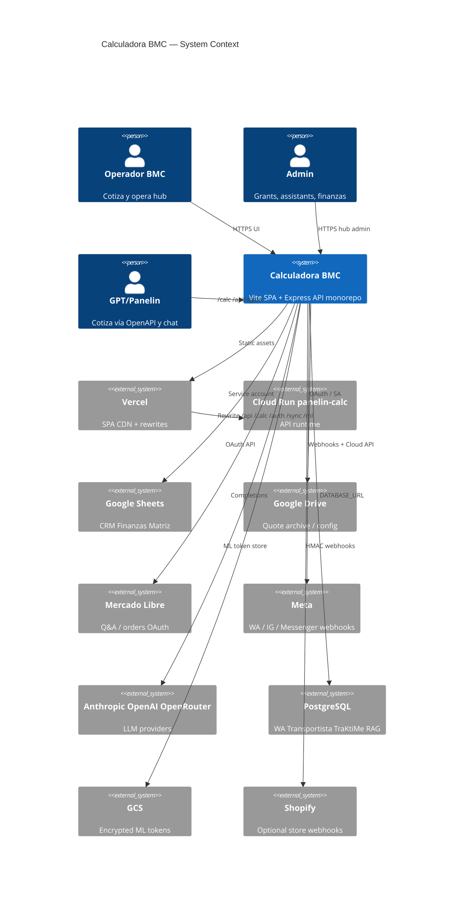
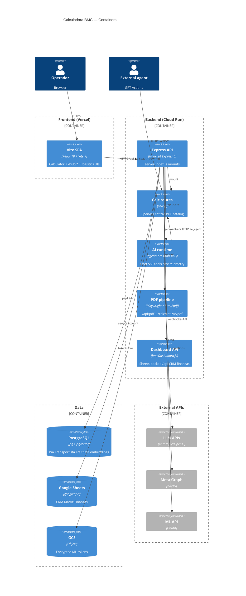
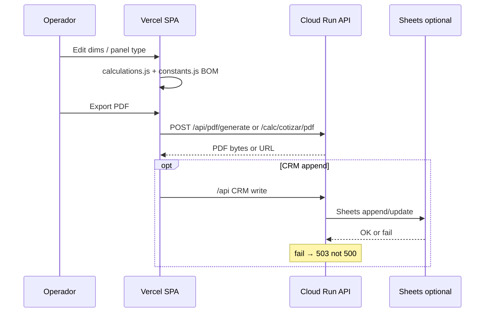
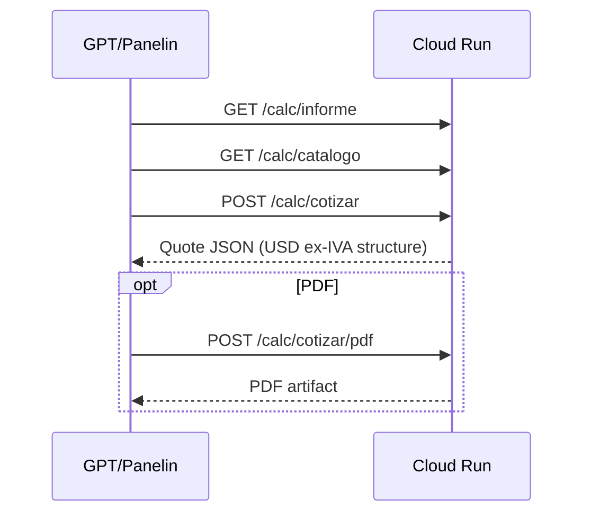
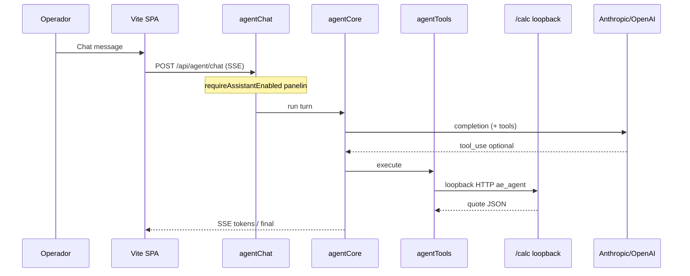

# System Design Document: Calculadora BMC

> **As-built** from repo evidence (code, config, CI, live `/health` + `/capabilities`).  
> Companion: `TARGET.md`, `RECREATION-CHECKLIST.md`, `evidence/*`, `KB/integrations.md`.

## 1. Introduction & Goals

### 1.1 Problem Statement

BMC Uruguay (METALOG SAS) sells insulation panels (techo/pared) and needs a **production quotation system** — BOM, USD pricing ex-IVA, PDF/WhatsApp export, CRM/finance planillas, multi-channel inbox (ML/WA/Omni), and AI assistants (Panelin) — not a disposable spreadsheet calculator.

### 1.2 Goals (SMART / as-built)

| ID | Goal | Measurable evidence |
|----|------|---------------------|
| G1 | Quote panels in **USD** (ex-IVA) with BOM + multi-layout PDF | `src/utils/calculations.js`, `src/data/constants.js`, `src/pdf-templates/` (13 layouts) |
| G2 | Run SPA + API in production with independent scale | Vercel `calculadora-bmc.vercel.app` + Cloud Run `panelin-calc` (`vercel.json` rewrites) |
| G3 | Expose calculator OpenAPI for GPT/agents | `GET /calc/openapi`, `GET /capabilities` (`schema_version: "1"`, build `3.1.5`) |
| G4 | Operate multi-channel surfaces (WA/ML/Omni) with Postgres state | `server/routes/wa.js`, `omni.js`, webhooks, `wa-package/migrations/` |
| G5 | Gate AI generation with human-controlled assistant flags | `requireAssistantEnabled`, `server/lib/assistantRegistry.js` |
| G6 | Keep pre-merge quality bar | `npm run gate:local` (lint + test + test:api); `smoke:prod` for public API |

### 1.3 Stakeholders

| Role | Team / actor | Interest |
|------|--------------|----------|
| Operador / vendedor | BMC Uruguay | Cotizar, PDF, WhatsApp, CRM |
| Admin | BMC | Grants, assistants, analytics, users |
| GPT / Panelin agents | External + in-app | `/calc/*`, chat tools, OpenAPI |
| Engineering | Platform | Deploy split, gates, secrets, Sheets 503 contract |
| Fiscal / ops | Admin | Finanzas views, MATRIZ prices (human-gated unlocks) |

## 2. Context & Scope (C4 Level 1)



### External interfaces

| Interface | Direction | Protocol | Auth | Description |
|-----------|-----------|----------|------|-------------|
| Browser ↔ Vercel | ↔ | HTTPS | Cookie/session UI | SPA + immutable `/assets/*` |
| Vercel ↔ Cloud Run | → | HTTPS rewrite | Same-origin from browser for proxied paths | `vercel.json` lines 6–26 |
| API ↔ Google Sheets | → | HTTPS REST | Service account JSON | CRM/finanzas/MATRIZ |
| API ↔ Google OAuth | ↔ | OAuth 2.0 | Client ID/secret | Login, Drive, Tasks |
| API ↔ Mercado Libre | ↔ | OAuth + REST | Encrypted tokens (GCS prod) | Questions, orders |
| API ↔ Meta | ↔ | Webhooks + Graph | Verify token / app secret | WA/IG/Messenger |
| API ↔ LLM providers | → | HTTPS | API keys | Anthropic primary, OpenAI fallback, OpenRouter optional |
| API ↔ PostgreSQL | → | TCP | `DATABASE_URL` | Channels + RAG |
| GPT Actions ↔ API | → | HTTPS | Per OpenAPI / service token | `/calc/*` public catalog + gated writes |

**In scope (v0.2):** monorepo product surface — calculator, hub modules, API, primary integrations, AI stack, deploy topology.

**Out of scope:** sibling `bmc-control`; deep Sheets column canon (`docs/google-sheets-module/` — cite only); Tauri desktop packaging depth; historical zip archives at repo root.

## 3. Constraints

| Type | Constraint | Evidence |
|------|------------|----------|
| Runtime | Node **24.x**, ES modules only (`"type":"module"`) | `package.json` engines |
| Money | List prices **USD**; 22% IVA applied once at total via `calcTotalesSinIVA()` | `docs/PRICING-ENGINE.md`, `src/data/constants.js` (`LISTA_ACTIVA`, `p()`) |
| Language | Operator UX mostly Spanish; code/commits English-friendly | UI copy, CLAUDE.md |
| Sheets errors | **503** unavailable; **200** empty; never **500** for Sheets-down | AGENTS.md / CLAUDE.md |
| Secrets | Sheet IDs/tokens from env/`server/config.js` only — never hardcode | `server/config.js` |
| Auth human gates | Grants, finanzas unlock, Meta/ML OAuth not “optimized away” | AGENTS.md Do Not |
| Disk | `disk:precheck` on `predev`/`prebuild`; `BMC_DISK_PRECHECK_SKIP=1` escape hatch | package scripts |
| CORS / cookies | Prod CORS restricted; CSP + HSTS on Vercel | `vercel.json` headers |
| PR size | PRs >500 LOC adds → DRAFT | CLAUDE.md conventions |

## 4. Solution Strategy

| Pillar | Choice | Rationale (as-built) |
|--------|--------|----------------------|
| Architecture style | **Modular monolith** — one SPA + one Express process | Shared deploy surface; clear route modules under `server/routes/*` (~54) |
| Pricing engine | Pure JS calc (`calculations.js` + `constants.js`); server `/calc` for agents/PDF | Same business rules for UI and GPT |
| Data plane | Sheets = CRM/finance SoT; Postgres = channel/ops/RAG | Operator familiarity + relational need for WA/trips |
| AI | Provider-agnostic gateway + assistant registry kill-switches + optional pgvector RAG | Cost control + multi-channel tools |
| Deploy | Static Vite on **Vercel**; long-running API + Chromium PDF on **Cloud Run** | CDN for UI; cold-start/CPU for Playwright |
| Quality | Offline tests + live contracts + smoke:prod + harness score | `gate:local`, `test:contracts`, HCS |

**Key trade-off:** Sheets latency/availability vs operational ownership of planillas — mitigated by 503 contract and contract tests (INFERRED ADR-002).

## 5. Container View (C4 Level 2)



### Container → path map

| Container | Key paths | Notes |
|-----------|-----------|-------|
| SPA | `src/App.jsx` (~545 LOC), `src/components/PanelinCalculadoraV3_backup.jsx` (~8144 LOC canonical), `src/utils/calculations.js` (~1497), `src/pdf-templates/` | Thin re-export `src/PanelinCalculadoraV3.jsx` |
| API shell | `server/index.js` (~1387), `server/config.js` (~417) | CSRF, rate limiters, mounts |
| Calc | `server/routes/calc.js` | OpenAPI, cotizar, PDF registry |
| AI | `server/lib/agentCore.js` (~482), `agentTools.js` (~2312), `rag.js`, `assistantRegistry.js`, `costTelemetry.js` | Gated generation |
| Dashboard | `server/routes/bmcDashboard.js` | Sheets 503 contract |
| Channels | `wa.js`, `omni.js`, `transportista.js`, `mlSearch.js`, webhooks | Postgres + Meta/ML |
| PDF | `server/routes/pdf.js`, `src/utils/pdfGenerator.js` | Chromium first, html2pdf fallback |
| Auth | `identityAuth.js`, `authGoogle.js`, `authMfa.js`, `requireGrant.js` | JWT + Google + TOTP + RBAC |

### SPA route inventory (CONFIRMED `src/App.jsx`)

`/`, `/calculadora`, `/hub`, `/hub/ml`, `/hub/ml-manager`, `/hub/wa`, `/hub/canales`, `/hub/tareas`, `/hub/clientes`, `/hub/proyecto`, `/hub/admin`, `/hub/admin/users`, `/hub/admin/analytics`, `/hub/admin/assistants`, `/hub/cotizaciones`, `/hub/admin-ingreso`, `/hub/bugs`, `/hub/planos`, `/mi-espacio`, `/hub/traktime/*`, `/hub/finanzas/*`, `/hub/agent-admin`, `/hub/marketing`, `/logistica`, `/conductor`, `/inspector`, `/especificaciones`, `/presentacion-licitacion`, `/fichas`, `/preview/pdf`, `/panelin/live`, …

## 6. AI Architecture — Component View

**Not N/A** — AI is first-class for Panelin chat, ML suggest, WA suggestions, wolfboard batch, Omni worker, training/auto-learn.

### 6.1 Components

| Component | Role | Path / size | Evidence tag |
|-----------|------|-------------|--------------|
| `agentCore.js` | Shared brain / provider chain | `server/lib/agentCore.js` (~482 LOC) | CONFIRMED |
| `agentTools.js` | Anthropic tool_use catalog; calc via loopback | `server/lib/agentTools.js` (~2312 LOC) | CONFIRMED |
| `calcLoopbackClient.js` | Tools → `127.0.0.1:${port}/calc/*` provenance `ae_agent` | `server/lib/calcLoopbackClient.js` | CONFIRMED |
| `aiProviderConfig` / gateway | Anthropic, OpenAI, OpenRouter routing | `server/lib/aiProviderConfig.js`, `aiGatewayClient.js` | CONFIRMED |
| `rag.js` + embeddings + pgvector | Quote/history retrieval | `server/lib/rag.js`, `migrations/0001_*` | CONFIRMED |
| `trainingKB` / `autoLearnExtractor` | Disk/API KB + extract from chats | lib + agentTraining routes | CONFIRMED |
| `assistantRegistry` | Per-assistant enable + `ASSISTANTS` catalog | `server/lib/assistantRegistry.js` | CONFIRMED |
| `costTelemetry` | Spend observability | `server/lib/costTelemetry.js` + tests | CONFIRMED |
| Omni `aiWorker` | Channel automation | `server/lib/omni/orchestrator/aiWorker.js` | CONFIRMED |
| `chatPrompts` | System prompts for Panelin | `server/lib/chatPrompts.js` | CONFIRMED |

### 6.2 Runtime model

- **In-process LLM calls** for chat/suggestions (no embedded local LLM weights).
- **Host agents** (Claude Code / Cursor / GPT Builder Actions) call Cloud Run `/calc/*` and optional `/api/*`.
- **Loopback calc** keeps tool provenance and avoids duplicating pricing in the LLM layer.

### 6.3 Assistant registry (CONFIRMED `assistantRegistry.js`)

| Key | Generation surfaces (examples) |
|-----|--------------------------------|
| `panelin` | `POST /api/agent/chat` |
| `email` | `POST /api/email-agent/chat` |
| `wa` | WA suggestions/quotes run paths |
| `ml` | `/api/crm/suggest-response` |
| `wolfboard` | `/api/wolfboard/quote-batch` |
| `canales` | Channel orchestration assistant |
| `seam` | Seam / cross-channel assistant |

### 6.4 Guardrails & cost

| Control | Mechanism | Mount evidence |
|---------|-----------|----------------|
| Master / per-assistant gates | `requireAssistantEnabled("<key>")` | `server/index.js` assistant gate block before channel routers |
| Inbound open | Webhooks **not** behind generation gates | Comment in `server/index.js` (gates only on AI-generation paths) |
| Rate limits | `aiGenLimiter` on ML suggest path | `server/index.js` ML suggest mount |
| Identity | JWT ≠ `WA_JWT_SECRET` (must differ) | config / identityAuth |
| Budget tests | `budget.test.js` / cost telemetry | tests |

### 6.5 Primary AI data flow

See §7 “Panelin chat” and `evidence/traces.md` T3.

## 7. Data Flow

### 7.1 Primary: operator quote (SPA → PDF)



### 7.2 Agent OpenAPI cotizar



### 7.3 Panelin chat (SSE)



### 7.4 WhatsApp inbound (summary)

Meta webhook → `POST /webhooks/whatsapp` → WA router + Postgres → optional AI suggestions when assistant `wa` enabled (`evidence/traces.md` T4).

## 8. Deployment View

### 8.1 Environments

| Env | UI | API | Secrets |
|-----|----|-----|---------|
| Local | Vite `:5173` | Express `:3001` | `.env` via `env:ensure` / **Doppler** `bmc-frontend/prd` + `bmc-backend/prd` |
| Prod | `https://calculadora-bmc.vercel.app` | `https://panelin-calc-q74zutv7dq-uc.a.run.app` | Vercel env + **GCP Secret Manager** |

**Local start:** `doppler run -- npm run dev:full` (or `npm run dev:full` with `.env`).

### 8.2 Vercel rewrites (CONFIRMED `vercel.json`)

| Source | Destination |
|--------|-------------|
| `/api/*` | Cloud Run `/api/*` |
| `/calc/*` | Cloud Run `/calc/*` |
| `/auth/*` | Cloud Run `/auth/*` |
| `/sync/*` | Cloud Run `/sync/*` |
| `/ml/*` | Cloud Run `/ml/*` |
| SPA fallback | `/index.html` |

Also: CSP, HSTS, immutable cache for `/assets/*`, CORS allow-origin prod UI on API path headers.

### 8.3 CI/CD (CONFIRMED `.github/workflows/`)

| Workflow | Role |
|----------|------|
| `ci.yml` | lint, tests, build, env-drift, smoke (push main), channels/voice/knowledge jobs |
| `deploy-calc-api.yml` | Cloud Run API deploy |
| `deploy-vercel.yml` | Frontend deploy |
| `smoke-prod-scheduled.yml` | Scheduled prod smoke |
| `matriz-sync.yml` | MATRIZ price sync |
| `codeql.yml`, `dependency-review.yml` | Security scanning |
| Gemini triage/dispatch family | Optional automation |

### 8.4 Alternate packaging

- **Dockerfile:** Node 24 alpine multi-stage → `nginx:1.27` serves SPA on `:8080` (not primary prod UI path).
- **Cloud Build:** `cloudbuild*.yaml` for API/frontend variants.

### 8.5 Live health (capture 2026-07-19, re-probed same day)

```json
{"ok":true,"appEnv":"production","hasTokens":true,"mlTokenStoreOk":true,"hasSheets":true,"missingConfig":[]}
```

`/capabilities`: `schema_version: "1"`, `build.version: "3.1.5"`, calculator canonical URLs under Cloud Run public base.

### 8.6 Quality gates (commands)

| Gate | Command | When |
|------|---------|------|
| Pre-PR | `npm run gate:local` | lint + test + test:api |
| Full local | `npm run gate:local:full` | + production Vite build |
| Pre-release | `npm run pre-release` | + fitness + goldens + harness score |
| Prod smoke | `npm run smoke:prod` | MATRIZ-critical public API |
| Live contracts | `npm run test:contracts` | API must be up |

### 8.7 Day-0 bootstrap sequence (recreation)

Ordered steps for a new engineer (secrets values REDACTED — names only):

1. Clone repo; use Node **24.x**; `npm ci` (or `npm install`).
2. `npm run env:ensure` → copy `.env.example` → `.env`; fill or use `doppler run --project=bmc-backend --config=prd` (+ frontend project as needed).
3. Optional Postgres: set `DATABASE_URL`; run `npm run wa:migrate`, `npm run transportista:migrate`, `npm run traktime:migrate`; apply `migrations/0001_*.sql` for RAG if needed.
4. `doppler run -- npm run dev:full` → Vite `:5173` + API `:3001`.
5. Smoke local: `GET http://127.0.0.1:3001/health`, open calculator UI, run `npm run gate:local`.
6. Prod verification: `npm run smoke:prod` against public Cloud Run; UI at `calculadora-bmc.vercel.app`.

If disk precheck fails spuriously: `BMC_DISK_PRECHECK_SKIP=1` (documented escape hatch only).

## 9. Crosscutting Concepts

### 9.1 Security (Well-Architected security)

- **Identity:** Google OAuth + JWT (`identityAuth.js`); optional TOTP MFA (`authMfa.js`).
- **Authorization:** module grants `requireGrant` (`read`/`write`/`admin`).
- **CSRF:** `createCsrfProtection` early in middleware chain.
- **Webhook integrity:** Meta verify tokens; Shopify `express.raw` + HMAC.
- **Token storage:** ML tokens encrypted; GCS in Cloud Run (`hasTokens` / `mlTokenStoreOk`).
- **Secrets hygiene:** env names only in docs; Doppler local SoT; no commit of `.env`.
- **Edge headers:** CSP, HSTS, X-Frame-Options, nosniff (`vercel.json`).

### 9.2 Reliability

- Sheets **503** convention prevents UI crash loops.
- Assistant kill-switches stop AI spend without blocking webhook ingest.
- Disk precheck reduces ENOSPC mid-build.
- Dual surface deploy allows UI ship without API redeploy (and vice versa).

### 9.3 Performance

- Vite code-split SPA; immutable long-cache for hashed assets.
- RUM: `POST /api/vitals` (Core Web Vitals beacon) registered before broad `/api` mounts.
- PDF: server Chromium preferred over client raster html2pdf.

### 9.4 Observability

- Server: **pino** / pino-http (project rule: no `console.log` in prod paths).
- Public: `/health`, `/capabilities`, `/version`, assistants status router.
- AI: `costTelemetry` + analytics routes.

### 9.5 Cost

- Multi-provider LLM with optional OpenRouter.
- Assistant gates + rate limiters on generation paths.
- Budget-oriented tests in suite.

### 9.6 Sustainability / ops

- Prefer fixing live issues over accumulating backlog (project `/nxt` philosophy).
- Harness Control System docs under `docs/team/harness/` (score ≥90 expert-complete alignment).

## 10. Architecture Decisions (ADRs)

### ADR-001: Split Vercel SPA + Cloud Run API

**Status**: Observed  
**Context**: SPA needs global CDN and instant deploys; API needs long requests, Playwright PDF, durable webhooks, Postgres.  
**Decision**: Host UI on Vercel; API on Cloud Run service `panelin-calc`; bridge with path rewrites.  
**Consequences**: + independent scale and deploy cadence / - two secret surfaces, cookie/CORS care, dual smoke.  
**Alternatives considered**: Single Cloud Run serving SPA+API; SSR Next on Vercel only; Netuy VPS monolith.

### ADR-002: Google Sheets as CRM/finance source of truth

**Status**: Observed  
**Context**: Operators already run CRM_Operativo / MATRIZ planillas.  
**Decision**: Service-account Sheets via `bmcDashboard` + sheet IDs from env; 503 on outage.  
**Consequences**: + zero new CRM migration / - latency, schema drift, contract tests required.  
**Alternatives considered**: Full Postgres CRM; Airtable; ERP-only.

### ADR-003: Canonical calculator component naming

**Status**: Observed  
**Context**: Historical filename already imported everywhere.  
**Decision**: Keep `PanelinCalculadoraV3_backup.jsx` as canonical implementation; thin re-export for stable import path.  
**Consequences**: + avoid mass rename risk / - onboarding confusion (documented in CLAUDE.md).  
**Alternatives considered**: Rename to `PanelinCalculadora.jsx` in a dedicated PR.

### ADR-004: Assistant-gated AI generation

**Status**: Observed  
**Context**: Unbounded LLM spend and unsafe auto-replies.  
**Decision**: `requireAssistantEnabled` only on **generation** paths; webhooks stay open for ingest.  
**Consequences**: + controllable cost and blast radius / - ops must toggle flags for demos.  
**Alternatives considered**: Always-on AI; per-tenant quotas only.

### ADR-005: Postgres for channel modules + optional RAG

**Status**: Observed  
**Context**: WA conversations and transport trips need relational integrity; RAG needs vectors.  
**Decision**: Shared `DATABASE_URL` with package migrations (`wa-package`, `transportista-cursor-package`, `migrations/` pgvector).  
**Consequences**: + unified ops DB / - multi-package migration discipline.  
**Alternatives considered**: Separate DBs per channel; filesystem-only WA store.

### ADR-006: Agent tools call calc via HTTP loopback

**Status**: Observed  
**Context**: Agents must use the same `/calc` contract as GPT Actions (no divergent pricing code).  
**Decision**: `calcLoopbackClient` → `127.0.0.1:${config.port}/calc/*` with provenance `source: "ae_agent"`.  
**Consequences**: + single calc surface / - in-process HTTP hop and port coupling.  
**Alternatives considered**: Direct import of calc handlers; shared package only.

### ADR-007: Prices USD ex-IVA; IVA once at total

**Status**: Observed  
**Context**: Uruguay B2B quoting practices; dual lists venta vs web.  
**Decision**: `LISTA_ACTIVA` + `p(item)`; `calcTotalesSinIVA()` then apply 22% once.  
**Consequences**: + consistent fiscal display / - client/server must never double-apply IVA.  
**Alternatives considered**: Store all prices IVA-included; multi-currency native.

## 11. Risks & Technical Debt

| Risk | Impact | Likelihood | Mitigation / status |
|------|--------|------------|---------------------|
| Sheets schema drift | CRM/UI wrong or empty | Medium | Mapper docs; `test:contracts`; 503 empty semantics |
| Dual secret stores (Doppler vs GCP vs Vercel) | Env mismatch prod/local | Medium | `env:ensure`, smoke:prod, Doppler re-pull runbook |
| Large calculator JSX (~8k LOC) | Hard safe change | High | Specialist skill; `tests/validation.js`; incremental extract |
| AI cost spikes | Budget overrun | Medium | Assistant gates + telemetry + limiters |
| Human OAuth gates incomplete | Channels partial | Medium | HUMAN-GATES playbooks — **UNKNOWN** per session |
| UNKNOWN: Postgres backup schedule | Data loss RPO unclear | Low–Med | Platform ops; track as residual |
| Omni feature flag matrix (`VITE_OMNI_INBOX`) | UI/API parity confusion | Medium | Document flags; parity tests `test:omni:parity` |
| Repo root archives noise | Agent confusion | Low | TARGET out-of-scope; hygiene backlog |
| PR >500 LOC without draft | Review quality drop | Medium | CLAUDE.md rule; split commits |

## 12. Glossary

| Term | Meaning |
|------|---------|
| **Panelin** | BMC AI assistant brand for calc + chat |
| **LISTA_ACTIVA** | Price list selector: `venta` (direct) vs `web` (Shopify/public) |
| **BOM** | Bill of materials for a quote |
| **Wolfboard** | Admin/CRM batch quoting surface |
| **Omni** | Unified multi-channel inbox |
| **MATRIZ** | Cost/sales matrix Google Sheet (pricing source) |
| **ASSISTANTS_ACTIVE** | Master/per-assistant AI enablement registry |
| **gate:local** | `lint` + `test` + `test:api` pre-PR gate |
| **smoke:prod** | Production API smoke (MATRIZ critical check) |
| **ae_agent** | Provenance tag for agent loopback calc calls |
| **HCS** | Harness Control System (`docs/team/harness/`) |
| **METALOG SAS** | Legal entity / BMC Uruguay corporate context |

---

## Appendix A — Evidence Index

| ID | Source | Tag |
|----|--------|-----|
| E1 | `package.json` v3.1.5 Node 24 ESM | CONFIRMED |
| E2 | `vercel.json` rewrites + security headers | CONFIRMED |
| E3 | `GET /health` prod 2026-07-19 | CONFIRMED |
| E4 | `GET /capabilities` calculator + build 3.1.5 | CONFIRMED |
| E5 | `src/App.jsx` SPA routes | CONFIRMED |
| E6 | `server/index.js` mounts + assistant gates | CONFIRMED |
| E7 | `server/routes/calc.js` cotizar/openapi | CONFIRMED |
| E8 | `server/lib/identityAuth.js` JWT | CONFIRMED |
| E9 | `server/lib/agentCore.js` + `agentTools.js` | CONFIRMED |
| E10 | migrations + wa/transportista packages | CONFIRMED |
| E11 | Dockerfile Node24 → nginx | CONFIRMED |
| E12 | CLAUDE.md / AGENTS.md conventions | CONFIRMED |
| E13 | Frontend HTTP 200 Vercel | CONFIRMED |
| E14 | `KB/integrations.md` | CONFIRMED |
| E15 | `evidence/traces.md` T1–T5 | CONFIRMED |
| E16 | `evidence/inventory.md`, `surfaces.md`, `data-model.md` | CONFIRMED |
| E17 | Live re-probe `/health` + `/capabilities` this run | CONFIRMED |

## Appendix B — Recreation Checklist

See `RECREATION-CHECKLIST.md` (R7 pass ≥90% items with evidence).
