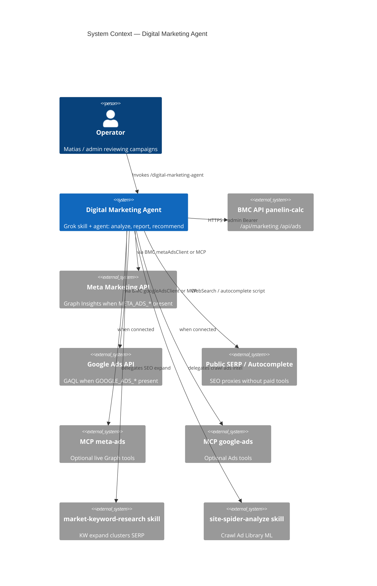
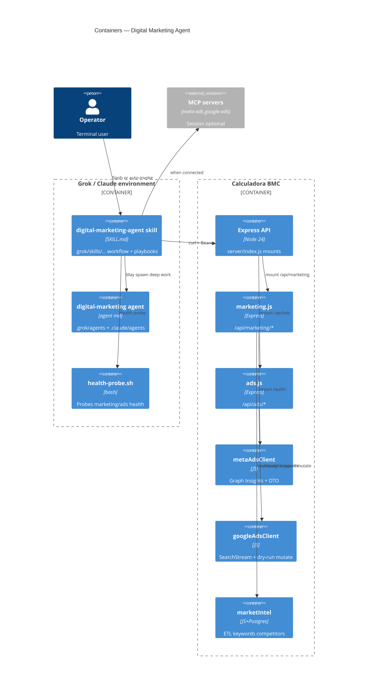
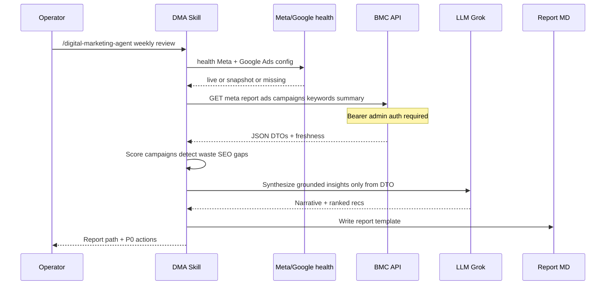

# System Design Document: Digital Marketing Agent

Terminal-native **digital marketing analyst environment** for Grok (primary) and Claude Code (secondary). Responsible for **analyzing, reporting, studying, and suggesting improvements** on Meta Ads, Google Ads (AdWords), SEO, and cross-channel campaigns for BMC Uruguay / METALOG SAS.

> **Implementation status (2026-08-01):** Skill + agents + playbooks + health probe **CONFIRMED on disk** (E-15–E-19). Data plane reuses **CONFIRMED** BMC mounts `/api/marketing` and `/api/ads` (E-01–E-02). LIVE Meta/Google still depend on human secrets (E-12–E-13, setup docs E-20–E-21).

---

## 1. Introduction & Goals

### 1.1 Problem Statement

Paid media and organic discovery drive BMC commercial pipeline (panels, cotizaciones, ML/Shopify). Operators already have partial surfaces:

- Marketing Hub Meta Ads Live Report (`/hub/marketing`, `/api/marketing/ads/meta/*`) — parent SDD `docs/sdd/meta-ads-live-report/` [CONFIRMED E-26]
- Google Ads API routes (`/api/ads/*`) with dry-run mutations [CONFIRMED E-08–E-11]
- Market intel ETL, keyword monitor, competitor deltas [CONFIRMED E-06–E-07]
- Grok skills: `market-keyword-research`, `site-spider-analyze` [CONFIRMED E-23–E-24]

What was missing is a **single terminal operator** that knows all channels, pulls live/offline evidence, produces board-ready reports, and proposes **ranked, grounded** improvements without inventing metrics or applying budget changes without a human gate.

### 1.2 Goals

| ID | Goal | Priority | Measurable |
|----|------|----------|------------|
| **G1** | One Grok skill + agent for Meta / Google Ads / SEO / cross-channel | P0 | `/digital-marketing-agent` invocable; agent `digital-marketing` |
| **G2** | Grounded reports only (source + freshness on every KPI) | P0 | Report template never shows LIVE without API success |
| **G3** | Ranked improvement backlog (P0–P3) with expected lever | P0 | Every rec has evidence path or URL |
| **G4** | Fail-open when secrets/MCP missing (fixture / snapshot / public SEO) | P0 | Useful report without Meta token |
| **G5** | Human gate on any mutate (pause, budget, bid) | P0 | Mutations only after explicit `apply: true` + user confirm |
| **G6** | Reuse BMC routes & sibling skills (no parallel stack) | P1 | Skill references existing paths only |

### 1.3 Stakeholders

| Role | Who | Interest |
|------|-----|----------|
| Owner / commercial | Matias (BMC) | Spend efficiency, CPL, organic demand |
| Operators | Hub admins | Weekly media + SEO review |
| Engineering | bmc-dev | Stable contracts; no secret leakage |
| Grok / Claude agents | Terminal AI | Delegatable specialist with least privilege |

### 1.4 Non-goals (v1)

- Full media-buyer automation (apply budget changes without human gate)
- Replacing Ads Manager / Google Ads UI for day-to-day creative production
- Paid SEO tools (Ahrefs/SEMrush) as hard dependencies
- White-label client PDF product (reuse Meta report DTO later)
- New Cloud Run microservice for DMA (skill-orchestrated only)

---

## 2. Context & Scope (C4 Level 1)



### External interfaces

| Interface | Direction | Protocol | Auth | Evidence |
|-----------|-----------|----------|------|----------|
| `GET/POST /api/marketing/*` | → | HTTPS | Admin JWT/service `requireServiceOrUser` | E-01, E-22 |
| `GET/POST /api/ads/*` | → | HTTPS | Same admin gate | E-02, E-22 |
| Meta Graph Insights | → | HTTPS Graph v21.0 | `META_ADS_ACCESS_TOKEN` + account id | E-12, E-25 |
| Google Ads API | → | google-ads-api SDK | OAuth refresh + developer token + MCC login | E-13, E-14 |
| Google Autocomplete / SERP | → | HTTP | None (public) | E-23 |
| Operator chat | ← | Markdown report | N/A | Report template |

### Key routes (CONFIRMED)

| Method | Path | File:line |
|--------|------|-----------|
| GET | `/api/marketing/ads/meta/health` | `marketing.js:483` |
| GET | `/api/marketing/ads/meta/report` | `marketing.js:467` |
| POST | `/api/marketing/ai/ads-insights` | `marketing.js:494` |
| GET | `/api/marketing/keywords` | `marketing.js:292` |
| GET | `/api/marketing/dashboard/summary` | `marketing.js:59` |
| GET | `/api/ads/accounts` | `ads.js:56` |
| GET | `/api/ads/accounts/:customerId/campaigns` | `ads.js:69` |
| GET | `/api/ads/accounts/:customerId/report` | `ads.js:91` |
| POST | `/api/ads/accounts/.../pause\|enable\|budget\|name` | `ads.js:183–228` dry-run default |

Mounts: `server/index.js:1117` marketing, `:1119` ads.

---

## 3. Constraints

| Type | Constraint |
|------|------------|
| **Technical** | ES modules Node 24 API; Grok skills = SKILL.md + optional scripts |
| **Secrets** | Env/Doppler/GSM only — names in §8; never commit values |
| **Auth** | Marketing/ads routes require admin via `requireServiceOrUser({ role: 'admin' })` [E-22] |
| **Safety** | Ads mutations default dry-run; human confirmation required [E-14] |
| **Evidence** | No invented spend/CPL/impressions; label null ≠ 0 |
| **Locale** | Business Spanish for operators; ad APIs may use account currency |
| **Regulatory** | Uruguay commercial + Meta/Google ad policies; no scraping behind login walls |
| **Scope** | Skill/agent packaging only — no new production service deploy for DMA v1 |

---

## 4. Solution Strategy

| Decision | Choice | Rationale |
|----------|--------|-----------|
| **Architecture style** | Skill-orchestrated agent (not new microservice) | Reuse BMC API + MCP; ship in hours |
| **Primary UX** | Grok terminal skill `/digital-marketing-agent` | User asked for terminal by Grok |
| **Secondary** | Grok agent type `digital-marketing` + Claude `bmc-digital-marketing` | Spawnable specialist |
| **AI pattern** | Plan-and-Execute analyst + report template | Grounded recommendations |
| **Data strategy** | Live API → snapshot/fixture → public SEO | Fail-open honesty (ADR-002) |
| **Trade-off** | Depth per channel vs one orchestration skill | Single skill with channel playbooks |

---

## 5. Container View (C4 Level 2)



### Filesystem layout (CONFIRMED)

| Container | Path |
|-----------|------|
| Skill | `.grok/skills/digital-marketing-agent/` (+ optional `~/.grok/skills/` mirror) |
| Agent (Grok) | `.grok/agents/digital-marketing.md` |
| Agent (Claude) | `.claude/agents/bmc-digital-marketing.md` |
| SDD | `docs/sdd/digital-marketing-agent/` |

---

## 6. AI Architecture — Component View

| Component | Responsibility | Technology / artifact |
|-----------|----------------|------------------------|
| **Orchestrator** | Intake, channel select, phase 0–6 pipeline | `SKILL.md` workflow |
| **Source resolver** | LIVE vs Snapshot/Demo vs PUBLIC vs UNKNOWN | Playbooks + health endpoints |
| **Channel analysts** | Meta / Google Ads / SEO / cross | `references/playbooks/*.md` + API/MCP |
| **Scoring engine** | Priority P0–P3 ≈ impact × confidence / effort | Report template rules |
| **Guardrails** | No invented metrics; mutate human gate; null≠0 | Skill Constraints + ADR-003 |
| **Sibling skills** | KW expand, site crawl, Ad Library | `market-keyword-research`, `site-spider-analyze` |
| **LLM host** | Narrative synthesis only over retrieved DTO | Grok session model (no separate gateway) |
| **Optional server AI** | Hub ads insights/chat | `POST /api/marketing/ai/ads-insights` [E-05] |

### 6.1 Pattern & coordination

- **Pattern:** Plan-and-Execute analyst (not autonomous media buyer).
- **Human-in-the-loop:** any write/mutate; budget reallocation is proposal-only until confirm.
- **Delegation:** SEO depth out of process via sibling skills; paid mutates only via Google routes after dry-run.

### 6.2 Prompt / output contract

- System behavior defined by skill body + playbooks (not a separate prompt registry service).
- Output must follow `references/report-template.md`: freshness table, scorecards, backlog fields (ID, P, channel, action, evidence, lever, effort, risk, human_gate).
- Chat summary: ≤15 lines + report path + blockers.

### 6.3 Failure modes

| Failure | Agent behavior |
|---------|----------------|
| 401/403 API | Mark channel UNKNOWN; continue others; surface auth gap |
| Meta token missing | Fail-open Snapshot/Demo if API returns it; never label LIVE |
| Google config missing | UNKNOWN for Google; list missing env **names** from client assert |
| LLM temptation to invent KPIs | Guardrail: only cite DTO fields; gaps in §8 Open questions |
| MCP disconnected | Fall back BMC routes [E-01–E-02] |

### 6.4 Cost model

| Activity | Est. cost driver | Control |
|----------|------------------|---------|
| Health + report API pulls | Low (few HTTPS) | Prefer aggregates; range 7d default |
| Optional Hub ads-insights LLM | Server provider tokens | Use only if operator asks / deep mode |
| SERP samples | WebSearch count | Cap 10–20 keywords |
| Full site crawl | Sibling skill caps | Do not unbounded spider |

No dedicated DMA token budget service in v1 — session discipline + skill caps.

---

## 7. Data Flow

Primary flow: **weekly performance review**.



Mutation subflow (Google only in v1 API): dry-run POST → show preview → user confirm → POST with `apply: true` [E-11, E-14].

---

## 8. Deployment View

| Environment | How it runs |
|-------------|-------------|
| **Local Grok** | Discover skill from project `.grok/skills/` or user `~/.grok/skills/` |
| **Local Grok agent** | `.grok/agents/digital-marketing.md` or `~/.grok/agents/` |
| **Claude Code** | `.claude/agents/bmc-digital-marketing.md` |
| **API data** | Local `:3001` (`npm run start:api` / `dev:full`) or Cloud Run `panelin-calc` |
| **Secrets** | Doppler `bmc-backend/prd` / GSM — names only below |
| **CI** | No required CI job for DMA v1 |

### Secrets shape (names only) — CONFIRMED `server/config.js`

| Domain | Env names |
|--------|-----------|
| Meta | `META_ADS_ACCESS_TOKEN`, `META_ADS_ACCOUNT_ID` (E-12) |
| Google Ads | `GOOGLE_ADS_DEVELOPER_TOKEN`, `GOOGLE_ADS_OAUTH_CLIENT_ID`, `GOOGLE_ADS_OAUTH_CLIENT_SECRET`, `GOOGLE_ADS_REFRESH_TOKEN`, `GOOGLE_ADS_LOGIN_CUSTOMER_ID` (E-13) |
| Market intel DB | `DATABASE_URL` |
| Probe auth (client) | `BMC_API_TOKEN` or `BMC_SERVICE_TOKEN` (Bearer) for `health-probe.sh` |

Setup: `docs/procedimientos/META-ADS-SETUP.md`, `docs/procedimientos/GOOGLE-ADS-SETUP.md`.

### Auth for agent HTTP

- Server gate: `requireServiceOrUser({ role: 'admin' })` on marketing and ads routers [E-22].
- Client: `Authorization: Bearer <token>` (script supports `BMC_API_TOKEN` / `BMC_SERVICE_TOKEN`).
- Agent **must not** bypass RBAC or embed tokens in reports.

### Health probe

```bash
BMC_API_TOKEN='…' bash .grok/skills/digital-marketing-agent/scripts/health-probe.sh \
  "${BMC_API_BASE:-http://127.0.0.1:3001}"
```

---

## 9. Crosscutting Concepts

### 9.1 Security

- Read-only by default; mutations preview-only until user confirms.
- Never print access tokens; env names only in docs/reports.
- Admin RBAC on API; agent does not bypass auth [E-22].

### 9.2 Reliability

- Fail-open: missing Meta → Snapshot/Demo; missing Google → UNKNOWN; SEO via public tools.
- Health endpoints first (`/ads/meta/health`, `/api/ads/accounts`).

### 9.3 Performance

- Prefer API aggregates over full creative download.
- Cap SERP samples (top 10–20 keywords); crawl max per sibling skill rules.
- Marketing intel routes use rate limiter (`intelLimiter` on keywords/meta/report paths) [INFERRED from `marketing.js` route wiring].

### 9.4 Observability

- Report header: `as_of`, sources, mode per channel.
- Raw pulls optional under `/tmp/dma-raw-*`; health under `/tmp/dma-health-*`.

### 9.5 Cost

- Prefer BMC cached reports over raw Graph/Ads API storms.
- No paid SEO API required for v1.

### 9.6 Sustainability

- Reuse existing ETL/snapshots; avoid duplicate scrapers.
- Dual skill install (user + project) only when needed; project is SoT for team.

---

## 10. Architecture Decisions (ADRs)

### ADR-001: Skill + Agent dual surface (not new service)

**Status**: Accepted  
**Context**: Need terminal analyst quickly; BMC already has APIs.  
**Decision**: Ship Grok skill (procedure) + Grok/Claude agent (spawnable role); call existing HTTP/MCP.  
**Consequences**:  
  + Fast ship, no deploy of new service  
  + Same evidence as Hub UI  
  - Depends on API auth and MCP connectivity  
**Alternatives considered**: Standalone microservice (rejected for v1 cost); Hub-only UI (rejected — user wants terminal).

### ADR-002: Fail-open freshness honesty

**Status**: Accepted  
**Context**: Meta live secrets often absent in local/prod partial configs.  
**Decision**: Mirror Meta Ads Live Report: never label LIVE without successful Graph/API; use Demo/Snapshot/UNKNOWN.  
**Consequences**: Trust preserved; reports still useful offline.

### ADR-003: Mutations human-gated

**Status**: Accepted  
**Context**: Google Ads routes support mutate with `apply: true` [E-11, E-14].  
**Decision**: Agent never sets `apply: true` without explicit user instruction in the same turn; always show dry-run preview first.  
**Consequences**: Safer autonomy; slightly slower execution of changes.

### ADR-004: Sibling skills for SEO crawl/keywords

**Status**: Accepted  
**Context**: `market-keyword-research` and `site-spider-analyze` already exist [E-23–E-24].  
**Decision**: Delegate; do not reimplement keyword expand or site crawl.  
**Consequences**: Single maintenance path for SEO tooling.

### ADR-005: Project + user skill install

**Status**: Accepted  
**Context**: Grok discovers skills from project and `~/.grok/skills`.  
**Decision**: Commit project copies under `.grok/` for team; optional user mirror for global invoke.  
**Consequences**: + Shareable in git; − dual-path sync if both diverge (project wins when CWD is repo).

---

## 11. Risks & Technical Debt

| Risk | Impact | Likelihood | Mitigation |
|------|--------|------------|------------|
| MCP meta-ads auth broken | Medium | High (session observed) | Fall back BMC `/api/marketing/ads/meta/*` |
| Google Ads token expired | Medium | Medium | Health probe; GOOGLE-ADS-SETUP |
| Invented metrics by LLM | High | Medium | Guardrail: only cite DTO fields; flag gaps |
| Over-scrape SERP | Low | Medium | Caps in skill + sibling skills |
| Report drift from Hub UI | Medium | Low | Same API DTOs as Hub |
| Secret leakage in report paste | High | Low | Redact tokens; env names only |
| Skill dual-path drift | Low | Medium | Prefer project SoT; copy carefully |
| No automated eval suite for skill | Medium | High | Manual recreation checklist until evals added |

---

## 12. Glossary

| Term | Definition |
|------|------------|
| **CPL** | Cost per lead |
| **CTR** | Click-through rate |
| **ROAS** | Return on ad spend |
| **Freshness** | LIVE / Snapshot / Demo / PUBLIC / UNKNOWN / Error |
| **Dry-run** | Mutation preview without applying (`apply: false` default) |
| **P0–P3** | Recommendation priority (P0 = act this week) |
| **Channel playbook** | Reference doc for Meta, Google Ads, SEO, or cross |
| **DMA** | Digital Marketing Agent (this system) |
| **MCC** | Google Ads Manager account (`GOOGLE_ADS_LOGIN_CUSTOMER_ID`) |
| **GAQL** | Google Ads Query Language (campaign/report queries) |

---

## Implementation map (v1 artifacts)

| Artifact | Path | Evidence |
|----------|------|----------|
| Skill (project) | `.grok/skills/digital-marketing-agent/` | E-15 |
| Skill (user mirror) | `~/.grok/skills/digital-marketing-agent/` | E-28 |
| Agent (Grok project) | `.grok/agents/digital-marketing.md` | E-16 |
| Agent (Claude) | `.claude/agents/bmc-digital-marketing.md` | E-17 |
| This SDD | `docs/sdd/digital-marketing-agent/SDD.md` | — |
| Target | `docs/sdd/digital-marketing-agent/TARGET.md` | — |
| Recreation | `docs/sdd/digital-marketing-agent/RECREATION-CHECKLIST.md` | — |
| Evidence | `docs/sdd/digital-marketing-agent/evidence/index.md` | E-01… |

---

## Appendix A — Evidence Index

See `evidence/index.md` (E-01–E-28).

## Appendix B — Recreation Checklist Summary

See `RECREATION-CHECKLIST.md`. Acceptance: install skill/agent, probe API, produce report without inventing LIVE metrics in &lt;1 hour.
