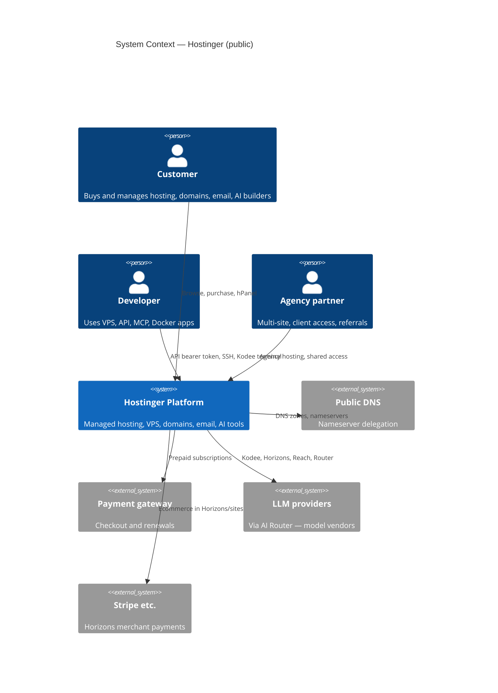
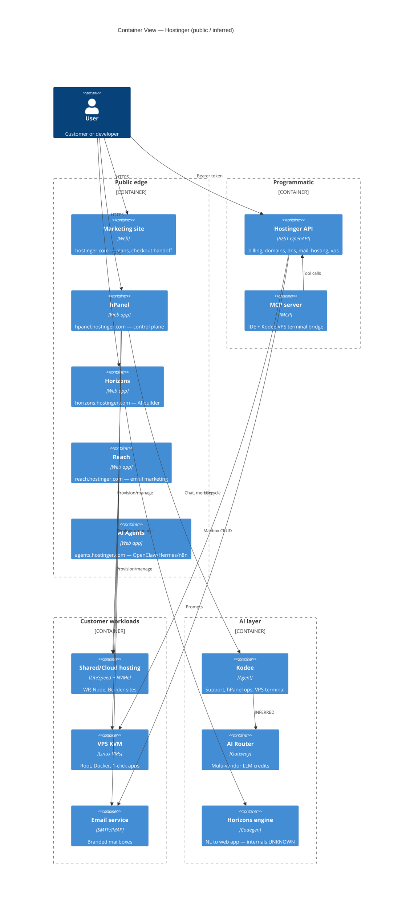

# System Design Document: Hostinger

As-built documentation of **Hostinger** as a public hosting and online-presence platform, reverse-engineered from marketing pages, support docs, and the OpenAPI catalog. Evidence bundle: [`TARGET.md`](TARGET.md), [`evidence/`](evidence/).

**Market capture:** Spain storefront (`/es`), EUR pricing, 2026-08-13.

---

## 1. Introduction & Goals

### 1.1 Problem Statement

Individuals, SMBs, and agencies need affordable, managed infrastructure to register domains, publish websites and web apps, run email, and automate operations—without operating their own datacenters. Hostinger addresses this with tiered **shared**, **cloud**, and **VPS** hosting, bundled **AI builders** (Horizons), **support agents** (Kodee), and a unified **hPanel** control plane plus a public **REST API**.

### 1.2 Goals (observed from product)

| Goal | Description | Priority | Tag |
|------|-------------|----------|-----|
| G1 | Low-friction go-live (builders, 1-click WP, migrations) | High | CONFIRMED |
| G2 | Upsell path shared → cloud → VPS | High | CONFIRMED |
| G3 | AI differentiation (Horizons, Kodee, Reach, Router) | High | CONFIRMED |
| G4 | Self-serve + 24/7 support | High | CONFIRMED |
| G5 | Developer automation (API, MCP, Terraform, Docker) | Medium | CONFIRMED |

### 1.3 Stakeholders

| Role | Interest |
|------|----------|
| End customer | Price, uptime, ease of use, AI tools |
| Developer / DevOps | VPS root, API, Docker, CI integration |
| Agency / freelancer | Multi-site, client access, Cloud/Agency plans |
| Hostinger ops | Margin, fair-use, support load |
| Security researcher | Scoped disclosure program (public host list) |

---

## 2. Context & Scope (C4 Level 1)

### External interfaces

| Interface | Direction | Protocol | Description | Tag |
|-----------|-----------|----------|-------------|-----|
| Marketing / checkout | ←→ | HTTPS | Plan selection, handoff to payments | CONFIRMED |
| hPanel | ←→ | HTTPS | Control plane for all services | CONFIRMED |
| Hostinger API | ←→ | HTTPS REST JSON | Billing, domains, DNS, mail, hosting, VPS | CONFIRMED |
| MCP (API + Connector) | ←→ | MCP | IDE agents, VPS Kodee terminal | CONFIRMED |
| Public DNS | → | DNS | Nameserver delegation | CONFIRMED |
| LLM vendors | → | HTTPS API | AI Router model backends | CONFIRMED |
| Stripe / PayPal / AdSense | ←→ | HTTPS | Merchant features in Horizons/sites | CONFIRMED |
| WhatsApp (Kodee) | ←→ | WhatsApp | +16594444429 | CONFIRMED |

---

## 3. Constraints

| Constraint | Detail | Tag |
|------------|--------|-----|
| Billing | Prepaid; displayed monthly rate = total ÷ term months | CONFIRMED |
| Fair use | “Unlimited” sites/mailboxes bounded by acceptable-use policy | CONFIRMED |
| Data residency | DC selectable (Americas, Europe, Asia, etc.); exact mapping per plan | CONFIRMED |
| VPS vs cloud | Cloud = managed, no root; VPS = self-managed + root | CONFIRMED |
| Horizons | Requires hosting subscription to publish; credits metered | CONFIRMED |
| API auth | Bearer token; user permission scope; rate limits / 429 | CONFIRMED |
| Compliance | GDPR-oriented marketing; WHOIS privacy available | INFERRED |
| Uruguay pricing | Not captured on `/es` | UNKNOWN |

---

## 4. Solution Strategy

- **Architecture style (public):** Multi-tenant managed hosting (shared/cloud) plus single-tenant **KVM VPS**; proprietary **hPanel** instead of cPanel-only (cPanel still offered on VPS).
- **Performance stack:** **LiteSpeed**, **NVMe**, object cache, integrated **CDN** on web/cloud tiers (CONFIRMED).
- **AI strategy:** Platform-wide copilot (**Kodee**), generative builder (**Horizons**), marketing AI (**Reach**), unified **AI Router** for third-party automations, **MCP** for developer agents—not a single monolithic model.
- **Agency / H5G:** New **Agency** plans on **H5G** WordPress infrastructure with site isolation and per-site sharing (CONFIRMED: security disclosure 2026-07).
- **Trade-offs accepted:** Promo pricing complexity; prepaid lock-in; opaque internal AI stack in exchange for bundled credits.

---

## 5. Container View (C4 Level 2)

See also [`diagrams/c4-context.mmd`](diagrams/c4-context.mmd), [`diagrams/c4-container.mmd`](diagrams/c4-container.mmd).

---

## 6. AI Architecture — Component View

AI is a **first-class** platform layer. See [`evidence/ai-surfaces.md`](evidence/ai-surfaces.md).

| Component | Responsibility | Surface | Tag |
|-----------|----------------|-----------|-----|
| **Kodee** | Plan selection, hPanel guidance, VPS command assist | Chat, WhatsApp, hPanel Home, VPS terminal | CONFIRMED |
| **Horizons agent** | NL → UI/code → deploy | horizons.hostinger.com | CONFIRMED |
| **Reach AI** | Campaign copy, brand styling | reach.hostinger.com | CONFIRMED |
| **Backstage AI** | SEO / visibility automation | hPanel / marketing | CONFIRMED |
| **AI Router** | Multi-model gateway, credits, usage metrics | hPanel Dev tools | CONFIRMED |
| **Hostinger Connector** | MCP bridge for external coding agents | IDE + active plan | CONFIRMED |
| **Managed agents** | OpenClaw, Hermes, n8n hosting | agents.hostinger.com | CONFIRMED |
| **WP AI toolkit** | Content, troubleshooting on managed WP | Cloud/shared | CONFIRMED |

### LLM / routing (public)

- **AI Router** exposes models from Anthropic, OpenAI, DeepSeek, xAI, Mistral, Moonshot, MiniMax, StepFun, Z.ai (CONFIRMED: hPanel support article).
- **Horizons** uses monthly **AI credits** for build-time and runtime in-app AI; fractional billing for live app usage (CONFIRMED: horizons pricing FAQ).
- **Kodee on VPS** described as **MCP-powered**; no separate subscription (CONFIRMED: VPS page).

### Guardrails & memory

- hPanel **AI memory** toggle controls what Kodee retains from onboarding and activity (CONFIRMED).
- Prompt-injection / content policy details: **UNKNOWN**.

### Cost model (customer-facing)

| SKU | Unit | Tag |
|-----|------|-----|
| Hosting plans | 5–15 “AI programming” credits | CONFIRMED |
| Horizons | Credits/mo by tier; top-ups | CONFIRMED |
| AI Router | Prepaid credits; token/cache dashboard | CONFIRMED |

Internal inference COGS: **UNKNOWN**.

---

## 7. Data Flow

Primary flows documented in [`evidence/traces.md`](evidence/traces.md).

### Purchase → live website (shared)

Customer selects plan on `hostinger.com/es` → prepaid checkout → hPanel provisioning → optional free domain → website via WordPress, Builder, or Node.js → traffic served via LiteSpeed + CDN.

### Horizons build → deploy

Prompt in Horizons workspace → iterative preview → Deploy attaches to bundled or existing hosting → optional domain/mail in hPanel.

### VPS + API automation

Order KVM → choose datacenter & template → manage via hPanel or `GET/POST /api/vps/v1/*` with bearer token → optional Docker/n8n/OpenClaw 1-click → Kodee in web terminal for NL ops.

---

## 8. Deployment View

### Environments (customer-visible)

| Tier | Isolation | Control | Stack (public) | Tag |
|------|-----------|---------|----------------|-----|
| Shared web | Multi-tenant | hPanel only | LiteSpeed, SSD/NVMe, CDN | CONFIRMED |
| Cloud | Multi-tenant, higher quota | hPanel; dedicated IP | NVMe, 99.9% claim, LiteSpeed | CONFIRMED |
| Agency (H5G) | Per-site isolation | hPanel + sharing | WordPress-optimized | CONFIRMED |
| VPS KVM | VM per customer | Root + hPanel | AMD EPYC, NVMe, 1 Gbps | CONFIRMED |

### Geographic footprint

Datacenters / CDN PoPs: North America, South America, Europe, Asia, Australia, South Africa (CONFIRMED: cloud/VPS pages). US locations include Arizona, Massachusetts, New York (CONFIRMED: cloud page).

### Security stack (public claims)

- Free SSL, malware scanner, WHOIS privacy, IP/country block, DDoS (via Cloudflare nameservers on some features), BitNinja / Monarx on VPS (CONFIRMED / INFERRED from tutorials).

### CI/CD

Customer CI integrates via **API**, **Terraform**, **Ansible**, Git deploy via files API (INFERRED). Hostinger internal release pipeline: **UNKNOWN**.

### Secrets

- API tokens created in hPanel Account; mail-scoped tokens per order (CONFIRMED).
- Values: **REDACTED** in all docs.

---

## 9. Crosscutting Concepts

### 9.1 Security

- Account 2FA, login history, account sharing with collaborators (CONFIRMED).
- Responsible disclosure scope lists public hosts including hPanel, Horizons, Reach, agents (CONFIRMED).
- VPS: firewall API, Monarx malware, snapshots/backups (CONFIRMED).
- Bug bounty tiers for H5G / Agency (CONFIRMED).

### 9.2 Reliability

- Cloud marketing: **99.9% uptime** guarantee (CONFIRMED).
- VPS: weekly backups + manual snapshots (CONFIRMED).
- Shared: weekly (lower) vs daily (upper) backups (CONFIRMED).
- Exact SLA credits: **UNKNOWN** without ToS parse.

### 9.3 Performance

- Cloud: 4× faster vs shared, CDN + object cache (CONFIRMED).
- VPS: NVMe + 1 Gbps port (CONFIRMED).
- PHP workers, inodes, CPU/RAM limits: documented in support KB (pointer CONFIRMED; full matrix not copied).

### 9.4 Observability

- Customer: hPanel resource usage, AI Router usage dashboard, mail logs via API (CONFIRMED).
- API errors include `correlation_id` for support (CONFIRMED).
- Internal SRE tooling: **UNKNOWN**.

### 9.5 Cost optimization

- Long-term prepaid discounts (48-mo web, 12-mo Horizons) (CONFIRMED).
- AI credit top-ups vs plan upgrades (CONFIRMED).
- VPS self-host n8n vs SaaS per-task pricing (CONFIRMED: n8n marketing).

### 9.6 Sustainability

Not materially documented in public pass → **UNKNOWN**.

---

## 10. Architecture Decisions (ADRs)

### ADR-001: Proprietary hPanel control plane

**Status:** Observed  
**Context:** Need unified UX across hosting, domains, mail, VPS, AI products.  
**Decision:** Custom **hPanel** at `hpanel.hostinger.com` as primary plane; cPanel optional on VPS.  
**Consequences:** + Single vendor UX; − Less portability vs raw cPanel-only hosts.

### ADR-002: LiteSpeed + NVMe on managed tiers

**Status:** Observed  
**Context:** Performance marketing vs Apache-only competitors.  
**Decision:** LiteSpeed web server and NVMe on cloud/upper shared (CONFIRMED).  
**Consequences:** + Speed claims; − Stack lock-in for advanced Apache configs.

### ADR-003: KVM VPS with public API + MCP

**Status:** Observed  
**Context:** Developers want automation and AI-assisted ops.  
**Decision:** Full **OpenAPI** for VPS lifecycle; **Kodee** MCP in terminal; official MCP server repo.  
**Consequences:** + DevOps adoption; − Customer responsible for VPS hardening.

### ADR-004: AI credits bundled across product lines

**Status:** Observed  
**Context:** Compete on “AI hosting” narrative.  
**Decision:** Bundle credits in hosting; separate Horizons/Router credit pools; migrate legacy tool credits to Agent credits.  
**Consequences:** + Upsell; − Complexity in renewal and metering.

### ADR-005: H5G Agency isolation

**Status:** Observed  
**Context:** Agencies need multi-tenant safety on WordPress.  
**Decision:** Agency plans on **H5G** with per-site isolation and sharing (CONFIRMED Jul 2026 disclosure).  
**Consequences:** + Security story; − Separate infra line from legacy shared.

---

## 11. Risks & Technical Debt

| Risk | Impact | Likelihood | Mitigation (public) | Tag |
|------|--------|------------|---------------------|-----|
| Promo vs renewal price shock | Medium | High | Document renewal on purchase; 30-day refund | CONFIRMED |
| Fair-use on “unlimited” | Medium | Medium | Policy link; monitor usage in hPanel | CONFIRMED |
| VPS customer misconfiguration | High | Medium | Kodee assist, backups, Monarx | CONFIRMED |
| API rate limit / IP block | Medium | Low | 429 headers, backoff | CONFIRMED |
| AI credit exhaustion | Medium | Medium | Top-ups, usage dashboard | CONFIRMED |
| Vendor LLM outage | Medium | Unknown | Multi-model Router (partial) | INFERRED |
| Internal architecture undocumented | Low (for customers) | High | Use public API only | N/A |

### UNKNOWN gaps (track, do not invent)

- Horizons codegen stack and sandbox boundaries  
- Exact API base URL host in all regions  
- Numeric SLA refund formula  
- Uruguay / LATAM catalog pricing  

---

## 12. Glossary

| Term | Definition |
|------|------------|
| **hPanel** | Hostinger proprietary control panel |
| **H5G** | Hostinger WordPress-optimized infrastructure generation (Agency plans) |
| **Horizons** | AI no-code / vibe-code web app builder |
| **Kodee** | Hostinger AI support and operations agent |
| **Reach** | Hostinger email marketing product |
| **AI Router** | Multi-vendor LLM gateway with prepaid credits |
| **Fair use** | Policy limiting “unlimited” resources |
| **KVM VPS** | Self-managed virtual private server with root access |
| **Cloud hosting** | Managed tier with dedicated IP and higher quotas vs shared |
| **MCP** | Model Context Protocol — tool bridge for AI agents |
| **LiteSpeed** | Web server used on managed hosting |
| **Agent credits** | Unified credit pool for AI Agent marketplace tools |

---

## Appendix A — Evidence Index

| Claim area | Primary sources | Tag density |
|------------|-----------------|-------------|
| Plans/pricing ES | `evidence/pricing-es.md`, `/es` | Mostly CONFIRMED |
| hPanel modules | support/1583483 | CONFIRMED |
| OpenAPI | developers.hostinger.com v1.32.4 | CONFIRMED |
| AI surfaces | `evidence/ai-surfaces.md` | CONFIRMED + UNKNOWN internals |
| Security scope | legal disclosure policy 2026-07-13 | CONFIRMED |

Full inventory: [`evidence/inventory.md`](evidence/inventory.md).

---

## Appendix B — Recreation Checklist Summary

See [`RECREATION-CHECKLIST.md`](RECREATION-CHECKLIST.md). Goal: a new team can **use** Hostinger (select plan, provision, integrate API)—not clone the platform.
