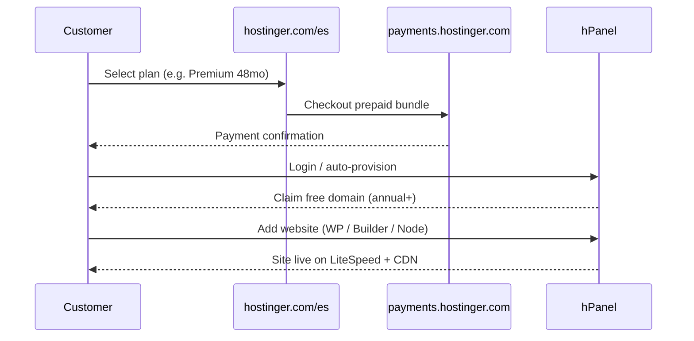
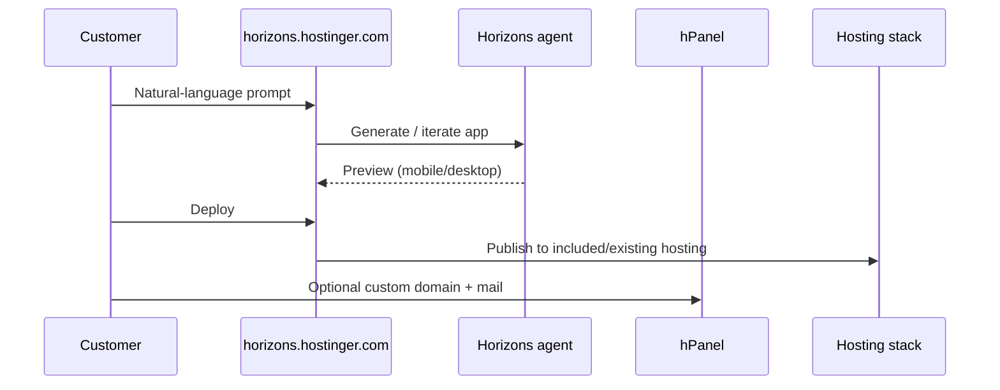
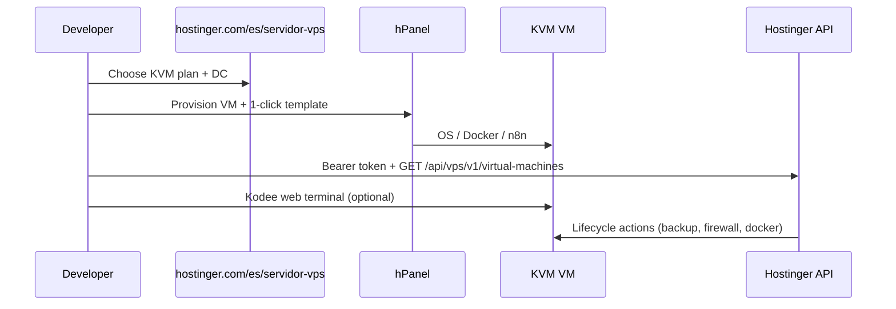
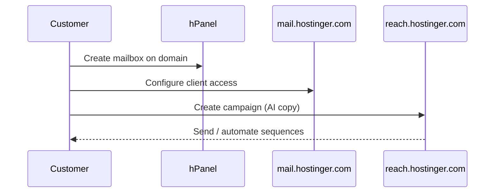
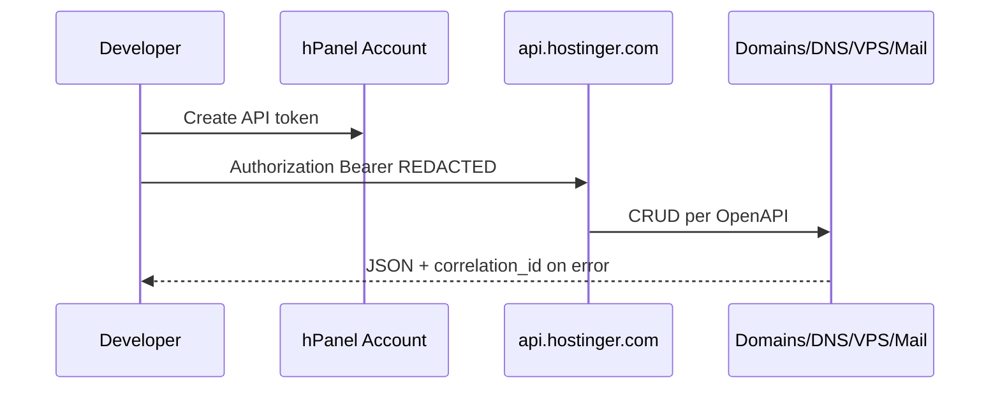

# Evidence — Primary user flows

**Capture date:** 2026-08-13

## Flow 1 — Purchase shared hosting (web)

Tag: CONFIRMED (marketing + web-hosting FAQ + hPanel websites section).

## Flow 2 — Horizons build & deploy

Tag: CONFIRMED (`/es/horizons`, `/es/horizons/pricing`).

## Flow 3 — VPS provision + API automation

Tag: CONFIRMED (VPS page + developers.hostinger.com).

## Flow 4 — Professional email + Reach campaign

Tag: CONFIRMED (home + hPanel Emails / Email Marketing sections).

## Flow 5 — Developer API token usage

Base host for API calls: INFERRED from SDK/docs (exact hostname not verified in this pass — use OpenAPI server URL from downloaded spec). Token creation: CONFIRMED (developers portal).
