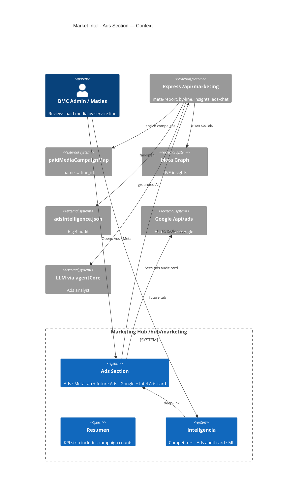
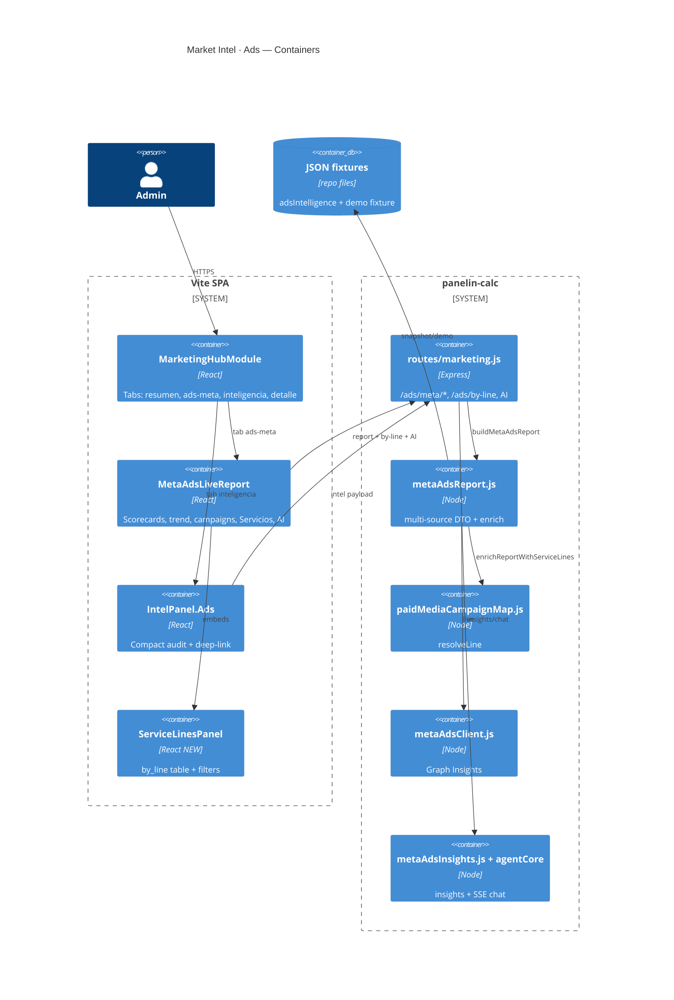
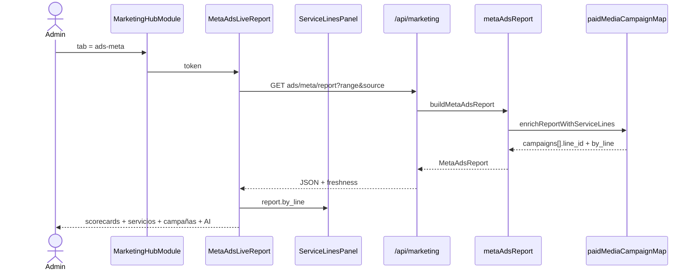
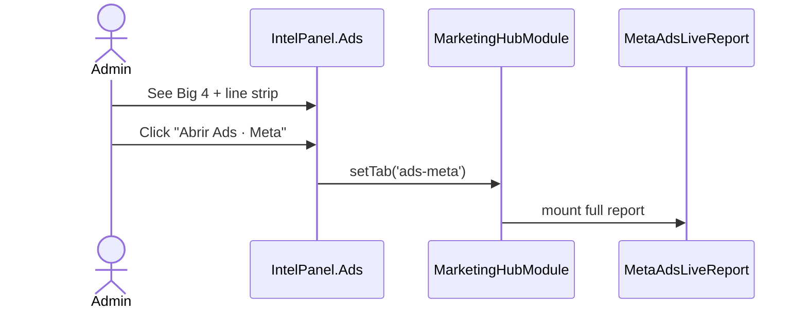

# System Design Document: Market Intel · Ads Section

**Purpose:** Architect how Matias’s **paid media command** (Meta + Google, multi-service lines on **current** campaigns) lives **inside Market Intelligence**, specifically in the **Ads** area of Marketing Hub — not as a separate product.

This SDD is the **UI + product shell** for:

1. Tab **Ads · Meta** (`MetaAdsLiveReport`) — full report + AI analyst  
2. Inteligencia card **Auditoría Meta Ads** — compact entry  
3. New zones: **Servicios / líneas** (`by_line`) wired to current Big 4  
4. Future **Ads · Google** under the same Ads umbrella  

Ops strategy and campaign taxonomy remain in `docs/sdd/bmc-paid-media/`. Meta report plumbing remains in `docs/sdd/meta-ads-live-report/`. **This document owns Hub information architecture and component contracts.**

---

## 1. Introduction & Goals

### 1.1 Problem statement

Market Intel already has an **Ads** foothold:

- Hub tab **Ads · Meta** with Live/Demo/Snapshot report, scorecards, campaigns table, AI insights + chat  
- Inteligencia **Auditoría Meta Ads** (Big 4 tiles + zombies + link into full report)  
- Backend map `paidMediaCampaignMap` + `GET /api/marketing/ads/by-line` tagging current campaigns to service lines  

But Ads is still **Meta-account-centric**, not **BMC-service-centric**. Matias’s real questions are:

- “How is **Pilar 1 Rendimiento** vs **Pilar 2 Instalación** doing?”  
- “Is **Tráfico Web** eating budget without leads (and is that OK)?”  
- “What’s **Remarketing** recovering?”  
- Later: “Same for Google Search/Shopping”

Those answers must appear **inside Market Intel → Ads**, using existing skin (`SkinProvider` / `--ac-*`), auth, and report freshness rules — without inventing a second hub.

### 1.2 Goals

| ID | Goal | Priority | Measurable |
|----|------|----------|------------|
| **G1** | Ads section is the **single Hub home** for paid media review | P0 | All ads UX under `/hub/marketing` Ads tabs |
| **G2** | **Service-line view** on current campaigns (no rename required) | P0 | `by_line` table in Ads · Meta; 4 Big 4 lines mapped |
| **G3** | Preserve honesty: LIVE / Snapshot / Demo badges; null ≠ 0; traffic KPI not scored as lead CPL | P0 | Rules + UI labels |
| **G4** | Inteligencia Ads card **summarizes lines** + deep-links to Ads · Meta | P1 | Card shows line spend strip |
| **G5** | Ads umbrella ready for **Ads · Google** sibling tab | P1 | Tab IA + shared components |
| **G6** | AI analyst can answer “por línea / por pilar” grounded on DTO | P1 | Chat system prompt includes `by_line` |

### 1.3 Stakeholders

| Role | Who | Interest |
|------|-----|----------|
| Media buyer | Matias | Weekly by-line decisions |
| Hub admin | Operators | Same skin/auth as rest of Market Intel |
| Engineering | bmc-dev | Extend MetaAdsLiveReport, not fork |
| AI | agentCore / ads chat | Grounded narrative |

### 1.4 Non-goals

- Leaving Market Intel for a new `/hub/ads` app  
- Forcing campaign renames before UI ships  
- Meta/Google mutations in v0.1 UI (recommend only; Google dry-run stays API)  
- Redesigning Resumen / Detalle tabs  

---

## 2. Context & Scope (C4 Level 1)



### 2.1 External / internal interfaces

| Interface | Direction | Protocol | Auth |
|-----------|-----------|----------|------|
| SPA → `GET /api/marketing/ads/meta/report` | ← | JSON | admin Bearer |
| SPA → `GET /api/marketing/ads/by-line` | ← | JSON | admin Bearer |
| SPA → `POST /api/marketing/ai/ads-insights` | ← | JSON | admin |
| SPA → `POST /api/marketing/ai/ads-chat` | ← | SSE | admin |
| SPA → `GET /api/marketing/intel` | ← | JSON (ads snapshot for card) | admin |
| Future: `/api/ads/...` Google | ← | JSON | admin |

### 2.2 Scope boundary

| In | Out |
|----|-----|
| Hub tabs + Ads UI zones + by-line | Separate deployable |
| Service-line mapping display | Full campaign builder |
| AI grounded on Meta DTO + by_line | Unscoped general chat |
| Entry points from Inteligencia | Replacing competitor map |

---

## 3. Constraints

| Type | Constraint |
|------|------------|
| **Shell** | `MarketingHubModule.jsx` + `SkinProvider` / `.adminCot` / `--ac-*` only |
| **Route** | `/hub/marketing` only (App.jsx lazy MarketingHubModule) |
| **Auth** | Admin JWT (`useBmcAuth` + `requireMarketing`) |
| **Stack** | React 18, no new chart library for by-line v1 (reuse table/KPI patterns) |
| **Data honesty** | Same as Meta SDD: never fake LIVE; Snapshot monthly spend ≠ 7d |
| **Current campaigns** | Big 4 names are canonical aliases until LIVE renames |
| **Zombies** | Diagnostics only; not main by-line rows |

---

## 4. Solution Strategy

### 4.1 Architecture style

**Feature slice inside Market Intel modular monolith:**

1. **IA (information architecture):** Ads as first-class Hub area (tabs), not buried only under Inteligencia.  
2. **Single report pipeline:** MetaAdsReport DTO enriched with `line_id` / `by_line` server-side.  
3. **Progressive disclosure:** Inteligencia card = summary; Ads · Meta = full cockpit.  
4. **Channel expansion:** Same patterns for Ads · Google without changing Resumen.

### 4.2 Key choices

| Choice | Why |
|--------|-----|
| Extend `MetaAdsLiveReport` with **Servicios** zone | Lowest friction; report already loads campaigns |
| Server-side map (not client-only) | AI + rules + Hub share one truth |
| Keep tab id `ads-meta` | Backward compatible deep-links |
| Optional sub-nav under Ads | Prepare Google without cluttering top bar early |

### 4.3 AI strategy

- Ads insights + chat remain Meta-scoped and **DTO-grounded**.  
- Inject `by_line` + `line_id` on campaigns into analyst context so answers can cite Pilar 1 vs 2.  
- Market Intel general chat (`MarketIntelChat` on Resumen) may mention ads at high level but **must not** invent spend; deep ads Q&A stays on Ads · Meta.

### 4.4 Trade-offs

| + | − |
|---|---|
| One place operators already use | Ads · Meta tab gets denser |
| Reuses PR1–PR3 investment | Google still second-class until P1 tab |
| Works on Snapshot today | LIVE still needs Meta secrets |

---

## 5. Container View (C4 Level 2)



### 5.1 Hub information architecture (target)

```
/hub/marketing
├── Resumen          (unchanged; KPI “Campañas activas” may later use LIVE counts)
├── Ads · Meta       ★ primary Ads surface (this SDD)
│   ├── Toolbar: range · source · refresh · freshness badge
│   ├── Scorecards (account)
│   ├── Servicios / líneas   ★ NEW (by_line)
│   ├── Tendencia
│   ├── Campañas (columns + line_id badge)
│   ├── Plataforma / Placement / Creativos
│   ├── Recomendaciones
│   └── Analista AI (sticky)
├── Ads · Google     (P1 — mirror scorecards + map)
├── Inteligencia
│   ├── Competidores
│   ├── Auditoría Meta Ads  ★ enhanced with line strip
│   └── ML pulse
└── Detalle
```

**Tab model options (ADR-002):**

- **A (ship now):** Keep single `ads-meta` tab; add Servicios zone inside.  
- **B (later):** Parent **Ads** with sub-tabs Meta | Google | Cross.  

Default: **A now → B when Google UI starts**.

### 5.2 Component responsibilities

| Component | File (today / target) | Responsibility |
|-----------|----------------------|----------------|
| MarketingHubModule | `MarketingHubModule.jsx` | Tabs, token, intel load |
| MetaAdsLiveReport | `MetaAdsLiveReport.jsx` | Full Meta cockpit |
| ServiceLinesPanel | **NEW** `marketing-hub/meta-ads/ServiceLinesPanel.jsx` | Renders `by_line` |
| Campaigns table | inside MetaAdsLiveReport | Add columns Línea / Funnel / KPI |
| IntelPanel Ads | `IntelPanel.jsx` `Ads()` | Compact Big 4 + line chips + deep-link |
| metaAdsFormat | `meta-ads/metaAdsFormat.js` | money/pct + line badge colors |
| paidMediaCampaignMap | server | resolveLine / by_line |
| marketing routes | `server/routes/marketing.js` | report + by-line + AI |

---

## 6. AI Architecture — Component View

| Component | Role | Tech |
|-----------|------|------|
| MetaAdsInsightsCard | Board narrative from report | POST ads-insights |
| MetaAdsAnalystChat | SSE Q&A on Meta DTO | POST ads-chat |
| Grounding payload | Full MetaAdsReport **including `by_line` + campaign.line_id** | server rebuild, never client spend |
| Guardrails | No invented campaigns; cite only DTO names/lines | existing + prompt update |
| MarketIntelChat (Resumen) | Broad intel; ads only qualitative unless tools pull report | existing |

### 6.1 Prompt additions (target)

System prompt for ads chat must include:

```text
Service lines (line_id): rendimiento, instalacion, generic, shared_bof, orphan.
Traffic KPI campaigns must not be judged as failed lead-gen solely for high CPL null.
Prefer answering by line_id / campaign name as in DTO.
```

### 6.2 Cost

Unchanged vs Meta SDD: insights cached by report_hash; chat rate-limited via `intelLimiter`.

### 6.3 N/A

No separate vector RAG for Ads section v1 — DTO injection is sufficient.

---

## 7. Data Flow

### 7.1 Ads · Meta load (primary)



### 7.2 Inteligencia → Ads deep-link



### 7.3 Optional dedicated by-line fetch

`GET /api/marketing/ads/by-line` — same enrichment; use when UI wants lighter payload than full report (or for external DMA). Full report path remains source of truth for the tab.

---

## 8. Deployment View

| Env | Surface |
|-----|---------|
| Prod SPA | Vercel `calculadora-bmc` → `/hub/marketing` |
| Prod API | Cloud Run `panelin-calc` → `/api/marketing/*` |
| Secrets | Meta LIVE optional; Snapshot always works for Big 4 UX |
| CI | Existing gate: unit tests `paidMediaCampaignMap` + `metaAdsReport` |

No new service. Feature flags optional: `VITE_ADS_BY_LINE=1` if staged.

---

## 9. Crosscutting Concepts

### 9.1 Security

Admin-only; no token leakage in health/report; public lead-event stays outside this tab.

### 9.2 Reliability

Fail-open Snapshot when Graph fails; UI shows freshness badge always.

### 9.3 Performance

One report fetch per range/source change; by_line computed server-side O(n campaigns).

### 9.4 Observability

Existing pino on marketing routes; UI shows report_hash footer.

### 9.5 Cost

Media decisions only; LLM costs on insights/chat.

### 9.6 UX consistency

Same Section/KpiCard/table patterns as MetaAdsLiveReport; Spanish labels for operators.

---

## 10. Architecture Decisions (ADRs)

### ADR-001: Ads lives inside Market Intel Hub, not a new module route

**Status:** Accepted  
**Context:** Operators already open `/hub/marketing` for competitors + ads audit.  
**Decision:** Extend Ads · Meta + Inteligencia Ads card.  
**Consequences:** + discoverability; − denser marketing hub.

### ADR-002: Ship service lines as a zone inside Ads · Meta before Ads parent sub-nav

**Status:** Accepted  
**Context:** Google UI not ready; Big 4 is Meta-first.  
**Decision:** Option A (zone in Meta tab) first; parent Ads sub-nav when Google tab starts.  
**Consequences:** + fast value; − one more section on Meta tab.

### ADR-003: Server-side campaign → line map is source of truth

**Status:** Accepted  
**Context:** Need AI, rules, Hub, and DMA to agree.  
**Decision:** `paidMediaCampaignMap` in report pipeline.  
**Consequences:** + consistency; − map updates needed when Meta renames campaigns (aliases).

### ADR-004: Current Big 4 names are first-class, not temporary hacks

**Status:** Accepted  
**Context:** Matias runs Pilar 1/2, Tráfico, Remarketing.  
**Decision:** Exact-name map + patterns; rename optional later.  
**Consequences:** + ships on Snapshot today; − historical audit spend is monthly.

### ADR-005: Traffic KPI isolation in UI

**Status:** Accepted  
**Context:** Tráfico Web must not look like “failed leads.”  
**Decision:** Badge `kpi: traffic` + hide/soften CPL for those rows; by_line `kpi_scoring: traffic`.  
**Consequences:** + correct decisions; − slightly more UI logic.

### ADR-006: Inteligencia Ads card remains entry, not full cockpit

**Status:** Accepted  
**Decision:** Compact metrics + line chips + deep-link only.  
**Consequences:** + light Inteligencia tab; − two clicks for full AI.

---

## 11. Risks & Technical Debt

| ID | Risk | Impact | Likelihood | Mitigation |
|----|------|--------|------------|------------|
| R1 | Meta renames Big 4 → orphans | Medium | Medium | aliases[] in map; pattern fallback |
| R2 | Snapshot stale vs LIVE | High | High until secrets | Freshness badge; bootstrap META_ADS |
| R3 | Tab density / mobile | Medium | Medium | Responsive stack; collapse zombies |
| R4 | AI ignores by_line | Medium | Medium | Prompt + tests |
| R5 | Google lagging in IA | Medium | High | Explicit “Ads · Google P1” roadmap |
| R6 | Dual endpoints (report vs by-line) drift | Low | Low | by_line always from same enrich |

### 11.1 Implementation roadmap (Hub-focused)

| Phase | Work | Status |
|-------|------|--------|
| **P0a** | Server map + enrich + `/ads/by-line` | **Done** (2026-08-04) |
| **P0b** | `ServiceLinesPanel` in MetaAdsLiveReport | **Next** |
| **P0c** | Campaign table columns: Línea, Funnel, KPI | Next |
| **P0d** | Ads chat prompt includes by_line | Next |
| **P1a** | IntelPanel Ads line strip | Next |
| **P1b** | Ads · Google tab skeleton + map | Later |
| **P2** | Ads parent sub-nav Meta \| Google \| Cross | Later |

### 11.2 Wireframe — Ads · Meta (Servicios zone)

```
┌─────────────────────────────────────────────────────────────┐
│ Meta Ads Live Report     [7d|30d|90d] [Auto|Live|Demo|Snap] │
│ Freshness: Snapshot · hash ab12…                            │
├─────────────────────────────────────────────────────────────┤
│ KPIs: Spend | Results | CPL | CTR | CPM | Activas/Zombies   │
├─────────────────────────────────────────────────────────────┤
│ SERVICIOS / LÍNEAS (current campaigns)                      │
│ ┌──────────────┬────────┬────────┬───────┬────────────────┐ │
│ │ Línea        │ Spend  │ Res    │ CPL   │ KPI mode       │ │
│ │ Rendimiento  │ $4500  │ —      │ —     │ lead           │ │
│ │ Instalación  │ $3000  │ —      │ —     │ lead           │ │
│ │ Tráfico web  │ $2000  │ —      │ n/a   │ traffic ★      │ │
│ │ Remarketing  │ $1500  │ —      │ —     │ lead           │ │
│ └──────────────┴────────┴────────┴───────┴────────────────┘ │
│ expand → campaign names under each line                     │
├──────────────────────────────┬──────────────────────────────┤
│ Trend / Campaigns / …        │ Analista AI                  │
└──────────────────────────────┴──────────────────────────────┘
```

---

## 12. Glossary

| Term | Definition |
|------|------------|
| **Market Intel** | Marketing Hub module at `/hub/marketing` |
| **Ads section** | Ads · Meta tab (+ future Google) + Inteligencia Ads card |
| **Big 4** | Current active Meta campaigns in audit snapshot |
| **line_id** | Service line key: rendimiento, instalacion, generic, shared_bof, orphan |
| **by_line** | Server rollup array on MetaAdsReport |
| **Freshness** | live \| snapshot \| demo \| … |
| **kpi_scoring** | lead \| traffic \| mixed — how UI judges a line |
| **Deep-link** | Inteligencia → setTab('ads-meta') |

---

## Appendix A — File map

| Layer | Path |
|-------|------|
| Hub shell | `src/components/MarketingHubModule.jsx` |
| Meta cockpit | `src/components/marketing-hub/MetaAdsLiveReport.jsx` |
| AI cards | `src/components/marketing-hub/meta-ads/*` |
| Intel Ads card | `src/components/marketing-hub/IntelPanel.jsx` |
| Map | `server/lib/marketIntel/paidMediaCampaignMap.js` |
| Orchestrator | `server/lib/marketIntel/metaAdsReport.js` |
| Routes | `server/routes/marketing.js` |
| Registry | `docs/sdd/bmc-paid-media/KB/service-line-registry.md` |
| Meta as-built | `docs/sdd/meta-ads-live-report/SDD.md` |
| Ops SDD | `docs/sdd/bmc-paid-media/SDD.md` |

## Appendix B — Acceptance criteria (Hub)

- [ ] On Ads · Meta, admin sees **Servicios / líneas** with at least Big 4 when source=snapshot/auto without token  
- [ ] Tráfico Web row shows traffic KPI treatment (CPL not red-failed)  
- [ ] Campaign table shows line badge matching map  
- [ ] Inteligencia Ads card links to Ads · Meta  
- [ ] Freshness never says LIVE without Graph success  
- [ ] Unit tests for map remain green  

## Appendix C — Relation to other SDDs

```
bmc-paid-media          → WHY / campaign ops / multi-channel strategy
meta-ads-live-report    → HOW Meta report DTO + Graph + AI work (as-built)
market-intel-ads (this) → WHERE it lives in Hub UI + component IA
```
