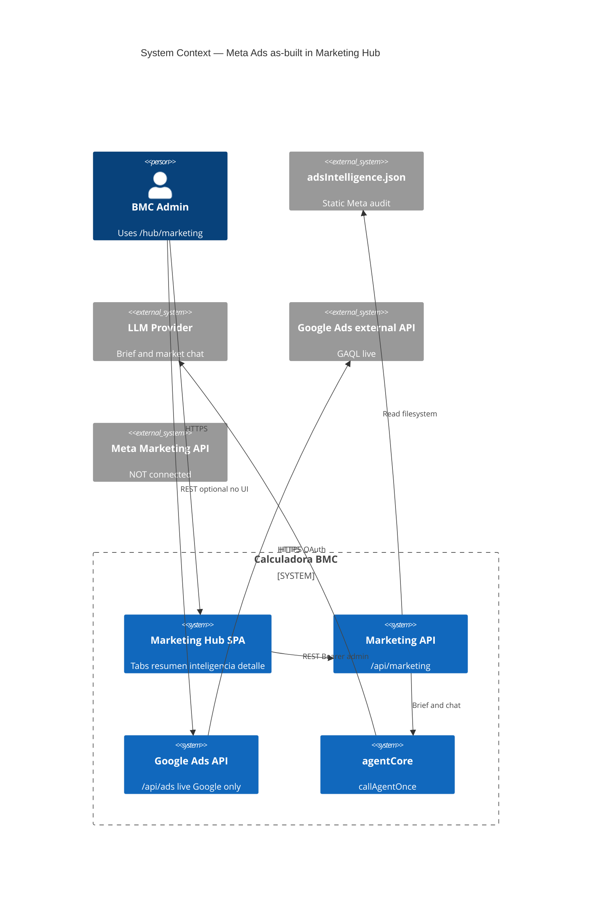
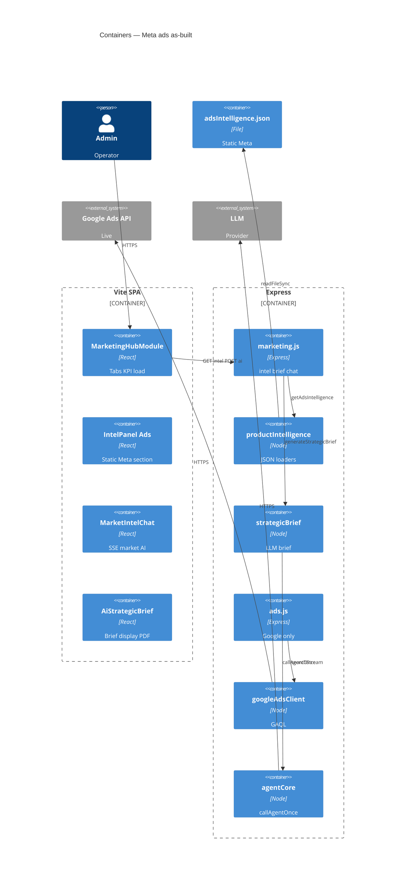
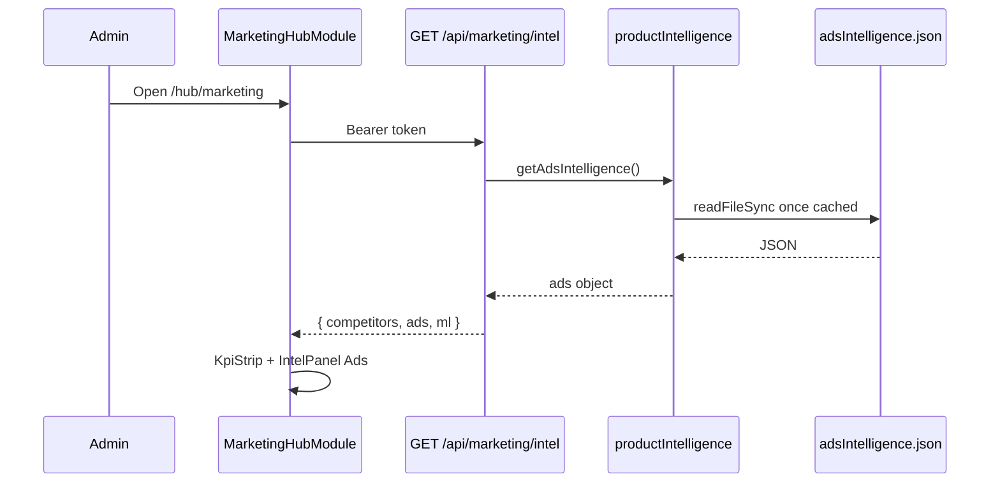
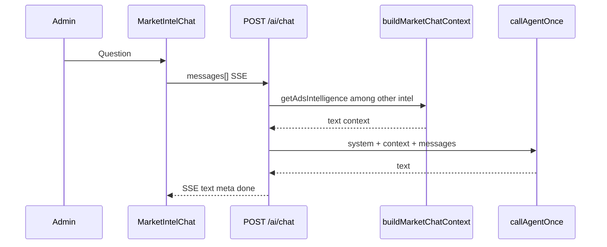

# System Design Document: Marketing Hub Meta Ads Surface (As-Built)

> **SUPERSEDED for the Live Report feature (2026-07-24).**  
> Full as-built of **Ads · Meta** (PR1–PR3 + #767) is **`SDD.md` v0.4**.  
> This file remains as a historical snapshot of the **pre-feature** host (static intel only). Do not treat “no metaAds modules” claims below as current truth.

---

## 1. Introduction & Goals

### 1.1 Problem Statement (as observed)

BMC Marketing Hub exposes competitive and commercial intelligence to admins. For **Meta paid media**, the product only surfaces a **hand-authored static audit** (`adsIntelligence.json`, fecha_audit `2026-06-29`): campaign counts, Big 4 monthly budgets, zombie narrative, and copy angles. There is **no live Meta Marketing API**, no time series, and no dedicated ads report tab. Live paid-media API capability exists only for **Google Ads** under `/api/ads`, with **no Marketing Hub UI**.

### 1.2 Goals (as-built system goals, not design wishlist)

| ID | Observed goal of current code | Evidence |
|----|-------------------------------|----------|
| G1 | Show Meta audit KPIs in Hub Inteligencia + Resumen | `IntelPanel.Ads`, `KpiStrip` |
| G2 | Feed static Meta context into strategic brief + market chat | `formatAdsIntel`, `buildMarketChatContext` |
| G3 | Provide live Google Ads reporting API for operators/API clients | `server/routes/ads.js` |
| G4 | Gate all marketing/ads admin APIs to admin role | `requireMarketing` / `requireAds` |

### 1.3 Stakeholders

| Role | Interest in as-built |
|------|----------------------|
| Admin operator | Reads Meta snapshot + generates AI brief |
| Engineer | Extends hub; knows Google pattern for Meta |
| Owner | Aware data is stale audit, not live ROAS |

### 1.4 Non-scope of this as-built

- Full competitor ETL implementation detail  
- Omni Meta messaging webhooks  
- Proposed Live Report implementation (see design SDD)

---

## 2. Context & Scope (C4 Level 1)

### External Interfaces

| Interface | Direction | Protocol | Auth | Tag |
|-----------|-----------|----------|------|-----|
| Browser → `/api/marketing/*` | ↔ | HTTPS JSON/SSE | Bearer admin JWT or service | CONFIRMED |
| Filesystem → adsIntelligence.json | → | JSON read | N/A | CONFIRMED |
| agentCore → LLM | → | Internal | LLM secrets | CONFIRMED |
| `/api/ads` → Google Ads | → | HTTPS | `GOOGLE_ADS_*` | CONFIRMED |
| Meta Marketing Graph | — | — | — | **NOT PRESENT** |

---

## 3. Constraints

| Constraint | Evidence |
|------------|----------|
| Admin-only marketing + ads routes | `marketing.js:12`, `ads.js:23` |
| Meta ads data is static file, process-cached | `productIntelligence.js:24-34` |
| No META_ADS secrets in config | `config.js` has Google + FB page token only |
| intelLimiter 60/min/IP on intel + ai/chat | `marketing.js:242-247, 253, 398` |
| SPA stack React + SkinProvider `--ac-*` for hub shell | `MarketingHubModule.jsx` |
| Google mutations dry-run unless `apply: true` | `ads.js:10-12` |

---

## 4. Solution Strategy (as built)

| Dimension | Actual approach |
|-----------|-----------------|
| Meta data | Offline JSON audit checked into repo |
| Presentation | Section inside Inteligencia tab + KPI tile on Resumen |
| AI | Shared market brief/chat with ads paragraph injected — **not** ads-only agent |
| Live paid media | **Google only** via separate `/api/ads` router |
| Trade-off accepted | Stale Meta narrative over live Meta complexity (INFERRED from absence of client) |

---

## 5. Container View (C4 Level 2)

### Key files

| Container | Path |
|-----------|------|
| Hub shell | `src/components/MarketingHubModule.jsx` |
| Meta UI | `src/components/marketing-hub/IntelPanel.jsx:89-142` |
| Intel API | `server/routes/marketing.js:253-264` |
| Loader | `server/lib/marketIntel/productIntelligence.js:120-122` |
| Data | `server/lib/marketIntel/data/adsIntelligence.json` |
| Brief ads format | `server/lib/marketIntel/strategicBrief.js:102-117, 280+` |
| Google report | `server/routes/ads.js:91-132` |

---

## 6. AI Architecture — Component View

AI **exists** for market intelligence; Meta is a **context fragment**, not a dedicated ads runtime.

| Component | Responsibility | Technology | Tag |
|-----------|----------------|------------|-----|
| Strategic Brief | JSON brief + deterministic `analisis_ads` from static JSON | `generateStrategicBrief` + `callAgentOnce` maxTokens 8192 | CONFIRMED `strategicBrief.js:137-184` |
| Market Chat | SSE Q&A with market context including ads summary | `POST /ai/chat` + `callAgentOnce` maxTokens 1500 temp 0.4 | CONFIRMED `marketing.js:398-449` |
| Ads formatting | String block of zombies/Big4/spend | `formatAdsIntel` | CONFIRMED |
| Deterministic ads analysis | Non-LLM `buildAnalisisAds` attached to brief | `strategicBrief.js:280+` | CONFIRMED |
| RAG | N/A for ads | — | CONFIRMED no vector ads path |
| Dedicated Meta Ads Analyst | **Absent** | — | CONFIRMED |

### LLM strategy (observed)

| Decision | Choice | Evidence |
|----------|--------|----------|
| Primary | agentCore routing via `callAgentOnce` channel `chat` | brief + chat |
| Meta grounding | Static file fields only | formatAdsIntel |
| Dedicated ads prompts | None | No ads-only system prompt file |

---

## 7. Data Flow

### 7.1 Load Meta audit into Hub

### 7.2 Market chat with ads context

### 7.3 Google live report (no Meta)

Admin/API client → `GET /api/ads/accounts/:customerId/report` → `googleAds.searchStream` LAST_90_DAYS → JSON. **No Hub tab** (CONFIRMED).

---

## 8. Deployment View

| Piece | As-built | Tag |
|-------|----------|-----|
| Frontend | Vercel SPA includes MarketingHubModule | INFERRED parent product |
| API | Cloud Run Express mounts `/api/marketing`, `/api/ads` | CONFIRMED mount; host INFERRED |
| Meta ads deploy artifact | JSON file in container image / repo | CONFIRMED |
| Google secrets | `GOOGLE_ADS_*` env names | CONFIRMED config |
| Meta ads secrets | None | CONFIRMED |
| Local | `doppler run -- npm run dev` | INFERRED AGENTS.md |

**Health:** No dedicated Meta ads health endpoint. Google fails with 502 + message on API errors (`ads.js:62-64`).

---

## 9. Crosscutting Concepts

### 9.1 Security

- Admin RBAC via `requireServiceOrUser({ role: 'admin' })` (CONFIRMED).  
- No fine-grained `ads` module grant yet (`ads.js:6-8` deferred).  
- Static JSON is not secret-bearing (commercial narrative).  
- Google OAuth refresh token in env — names only.

### 9.2 Reliability

- Static ads always available if file ships with deploy.  
- Stale data risk: no TTL on audit (CONFIRMED: only `fecha_audit` field).  
- Google API errors → 502, not crash.  
- JSON load failure → null / 503 on intel.

### 9.3 Performance

- Intel GET is cheap (memory-cached JSON after first read).  
- Brief LLM call up to 8192 tokens — slow path.  
- Chat rate limited 60/min.

### 9.4 Observability

- pino logs on marketing/ads routes.  
- Google activity via `logActivity` audit helper (`ads.js:39-49`).  
- No Meta spend metrics dashboards (CONFIRMED).

### 9.5 Cost

- Meta path: zero Graph cost (static).  
- LLM brief/chat: agentCore usage.  
- Google API: external quota/cost UNKNOWN.

### 9.6 Sustainability

- Static file avoids continuous Graph polling (INFERRED benefit).

---

## 10. Architecture Decisions (as-built / inferred)

### ADR-A01: Static Meta audit JSON instead of live Graph

**Status**: Observed  
**Context**: Need Meta narrative in Hub without Marketing API integration.  
**Decision**: Ship `adsIntelligence.json` and load via `getAdsIntelligence()`.  
**Consequences**: + Simple, offline-safe. − Stale; no CPL/series/placements.  
**Alternatives**: Live Meta API (not chosen — see design SDD).

### ADR-A02: Google Ads live API as separate `/api/ads` router

**Status**: Observed  
**Context**: Need live Google reporting and mutations with dry-run safety.  
**Decision**: `ads.js` + `googleAdsClient`, not nested under marketing intel JSON.  
**Consequences**: + Clear provider boundary. − No Meta parity; no Hub UI.

### ADR-A03: Meta context inside shared market AI, not dedicated ads agent

**Status**: Observed  
**Context**: One brief and one chat for market intelligence.  
**Decision**: Inject `formatAdsIntel` into brief/chat context.  
**Consequences**: + Less surface area. − Ads questions share context with ML/competitors; token dilution.

### ADR-A04: Three-tab Hub without Ads Live tab

**Status**: Observed  
**Context**: 2026-06-30 redesign (PROJECT-STATE).  
**Decision**: Resumen / Inteligencia / Detalle only.  
**Consequences**: Meta buried in Inteligencia section.

---

## 11. Risks & Technical Debt

| Risk | Impact | Likelihood | Mitigation today / gap |
|------|--------|------------|------------------------|
| Operators treat June audit as live | High | High | UI shows `fecha_audit`; design SDD proposes freshness badges |
| No Meta CPL/ROAS for decisions | High | High | Design Live Report PR1–PR3 |
| Google API unused by Hub UI | Medium | High | Build UI or Meta-first tab first |
| Messaging tokens confused with ads | Medium | Medium | Docs: separate secrets (design ADR-008) |
| Process cache never reloads JSON | Medium | Medium | Restart process to pick file updates |
| Zombie account hygiene not automated | Medium | High | AdEvolve external; not wired |

---

## 12. Glossary

| Term | As-built meaning |
|------|------------------|
| adsIntelligence | Static Meta audit JSON in marketIntel/data |
| Big 4 | Four active campaigns listed in snapshot |
| Zombie | Campaign counted inactive in audit |
| intel | GET `/api/marketing/intel` bundle |
| requireMarketing | Admin gate for marketing routes |
| /api/ads | Google Ads live API (not Meta) |
| Market Intel AI | Shared SSE chat, not Meta-only |
| Meta Ads Live Report | **Proposed** feature in SDD.md — not as-built |

---

## Appendix A — Evidence Index

| Claim | Tag | Source |
|-------|-----|--------|
| No Meta Live Report code | CONFIRMED | `rg MetaAds\|ads/meta\|metaAds` empty |
| Hub tabs three only | CONFIRMED | `MarketingHubModule.jsx:140-145` |
| intel returns ads | CONFIRMED | `marketing.js:253-258` |
| getAdsIntelligence loads JSON | CONFIRMED | `productIntelligence.js:120-122, 24-34` |
| Snapshot fields | CONFIRMED | `adsIntelligence.json` |
| IntelPanel Ads UI | CONFIRMED | `IntelPanel.jsx:89-142` |
| Brief formats ads | CONFIRMED | `strategicBrief.js:102-117, 170-171` |
| Chat injects ads | CONFIRMED | `marketing.js:346-348` + context builder |
| SSE events text/meta/done/error | CONFIRMED | `marketing.js:411-449` |
| Google report LAST_90_DAYS | CONFIRMED | `ads.js:91-127` |
| GOOGLE_ADS_* config | CONFIRMED | `config.js:177-181` |
| No META_ADS_* | CONFIRMED | config.js read |
| Mounts marketing + ads | CONFIRMED | `index.js:1112, 1114` |
| Hub does not call /api/ads | CONFIRMED | MarketingHubModule apiFetch paths only marketing |
| Deploy hosts | INFERRED | parent AGENTS.md / product norms |
| Why static chosen | INFERRED | no code comment; absence of client |

Full inventory: `evidence/inventory.md`, `surfaces.md`, `data-model.md`, `KB/integrations.md`.

---

## Appendix B — Gap to design SDD (recreation of Live Report)

| Design capability (SDD.md) | As-built | Gap |
|----------------------------|----------|-----|
| Tab Ads · Meta | Missing | Implement PR1 UI |
| MetaAdsReport DTO | Missing | schema exists in docs only |
| Fixture demo | Missing | design only |
| Live Graph | Missing | PR3 |
| Ads insights + ads chat | Missing | market chat is shared |
| Freshness LIVE/Demo/Snapshot | Missing | only fecha_audit string |
| Rules engine metaAdsRules | Missing | qualitative ASC text in JSON only |

**Implement from:** design `SDD.md` + `RECREATION-CHECKLIST.md` + `schemas/MetaAdsReport.schema.json`.  
**Clone patterns from:** this as-built (SSE, admin auth, Google client shape).

---

## Document control

| Version | Date | Change |
|---------|------|--------|
| 0.1 | 2026-07-23 | Initial as-built reverse-engineer of Marketing Hub Meta/ads surface |
