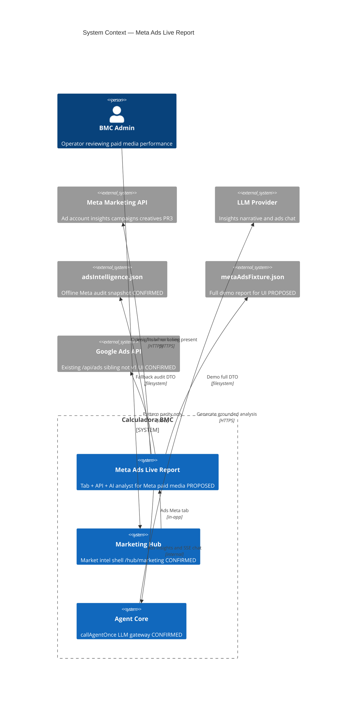
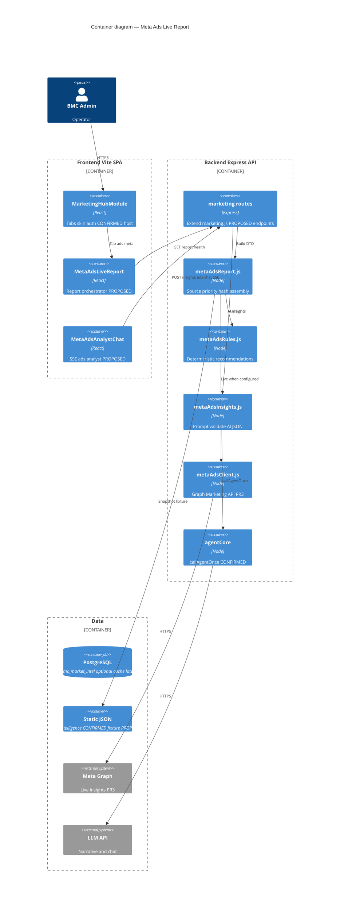
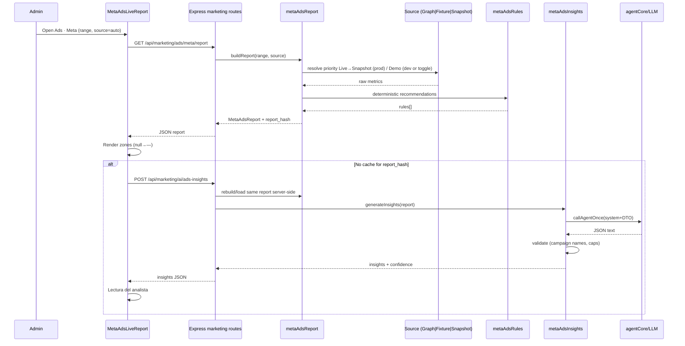
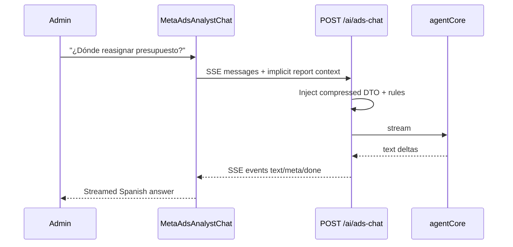

# System Design Document: Meta Ads Live Report

Bounded feature system: a **professional Meta Ads Live Report** tab inside BMC Marketing Hub (`/hub/marketing`), with multi-source data (live / demo fixture / snapshot audit) and a **native AI media analyst**.

> **Implementation status:** **PROPOSED (Draft).** Host Marketing Hub / static Meta audit / Google Ads API are **CONFIRMED**. Endpoints and tab described below are **not yet in code** — see `evidence/index.md`.

---

## 1. Introduction & Goals

### 1.1 Problem Statement

BMC’s commercial engine is paid media, yet Meta Ads intelligence inside the product is a **frozen qualitative audit** (`adsIntelligence.json`, corte 2026-06-29) buried under the Inteligencia tab. Operators cannot see board-ready spend/CPL trends, campaign hierarchy, platform/placement mix, creative rank, or grounded recommendations. Generic Market Intel chat is not specialized for paid media and can pollute context with competitor/ML noise. There is **no live Meta Marketing API client** (Google Ads live API exists separately under `/api/ads` with no Marketing Hub UI).

The Meta Ads Live Report closes that gap: one skinned tab that looks like a professional agency report, always has honest data freshness, and embeds an AI analyst that reasons only over a normalized report DTO.

### 1.2 Goals

| ID | Goal | Priority | Measurable |
|----|------|----------|------------|
| **G1** | Ship **Ads · Meta** tab with full visual report zones (scorecards, trend, campaigns, platform/placement, creatives, recommendations) | P0 | All zones render in Demo mode &lt;3s |
| **G2** | **Never lie about freshness** (LIVE / Demo / Snapshot / Stale / Error) | P0 | Badge never shows LIVE without Graph success |
| **G3** | **Native AI analyst** (insights + SSE chat) grounded in report DTO | P0 | No invented campaigns/metrics in validated output |
| **G4** | Work **without** Meta token (snapshot + fixture), then upgrade to live Graph without UI redesign | P0 | Same `MetaAdsReport` DTO for all sources |
| **G5** | Keep operator trust: null ≠ 0; objective-aware scoring (traffic not punished for 0 leads) | P1 | Unit tests on mapper + rules |
| **G6** | Prepare DTO for future client/annual PDF (Customer Q) without building PDF in v1 | P2 | Export fields documented |

### 1.3 Stakeholders

| Role | Who | Interest |
|------|-----|----------|
| Owner / commercial | Matias (BMC) | Ad efficiency, budget reallocation, ghost-town cleanup |
| Operators (admin) | Hub users with admin grant | Daily/weekly media review |
| Engineering | bmc-dev | Extend Marketing Hub cleanly; mirror Google Ads patterns |
| AI runtime | agentCore / Panelin stack | Ads-scoped prompts, cost control |
| Future client | Customer Q / white-label | Annual pack reuse (later) |

### 1.4 Non-goals (v1)

- Google Ads Live Report UI  
- Meta campaign mutations (pause/budget apply)  
- Multi-ad-account portfolio  
- White-label Customer Q PDF product  
- Replacing external AdEvolve automation  

---

## 2. Context & Scope (C4 Level 1)



### External Interfaces

| Interface | Direction | Protocol | Auth | Tag | Description |
|-----------|-----------|----------|------|-----|-------------|
| Browser → Express | ↔ | HTTPS JSON / SSE | Bearer JWT or service token | PROPOSED routes | Report, health, insights, ads chat |
| Meta Marketing Graph | → | HTTPS REST (Graph ~v21.0) | `META_ADS_ACCESS_TOKEN` | PROPOSED PR3 | Account insights, campaigns, placements |
| LLM via agentCore | → | Internal | Existing LLM secrets | CONFIRMED host | Structured insights + streaming chat |
| Static JSON (repo) | → | Filesystem | N/A | Snapshot CONFIRMED / Fixture PROPOSED | Audit + demo |
| Auth | ← | JWT / service | `requireServiceOrUser({ role: 'admin' })` | CONFIRMED | Same as Marketing Hub |

**Scope boundary:** Feature module inside existing Express + Vite SPA; not a separate deployable.

### Host evidence (CONFIRMED)

| Claim | Evidence |
|-------|----------|
| Hub route `/hub/marketing` | `src/App.jsx:414` |
| Tabs today: resumen / inteligencia / detalle | `MarketingHubModule.jsx:140-145` |
| Static ads in intel payload | `marketing.js:253-258` + `productIntelligence.js:120-122` |
| Admin gate | `marketing.js:12` |
| Mount `/api/marketing` | `server/index.js:1112` |
| SSE chat pattern | `marketing.js:398-449`, `MarketIntelChat.jsx:47-70` |
| Full evidence table | `evidence/index.md` |

---

## 3. Constraints

| Type | Constraint |
|------|------------|
| **Stack lock** | React 18 + Vite SPA, Express 5, existing `SkinProvider` / `--ac-*` tokens — no Tailwind for this tab, no new chart library in v1 |
| **Auth** | Admin-only Marketing Hub grant (`RequireGrant role=admin`) |
| **Secrets** | Meta Marketing tokens **must not** reuse WA/FB page messaging tokens; names only in docs (`META_ADS_ACCESS_TOKEN`, `META_ADS_ACCOUNT_ID`) |
| **Data honesty** | Missing metrics are `null` → UI `—`; never invent CPL/ROAS |
| **Prod Auto source** | Live → Snapshot (**not** Demo). Demo only via explicit `source=demo` or UI toggle |
| **AI grounding** | LLM may only cite DTO numbers; server validates campaign names |
| **Rate / cost** | Insights cached by `report_hash` (~30 min); ads chat rate-limited (`intelLimiter`) |
| **Historical Meta** | Graph history ~37 months max; attribution/iOS noise on YoY |
| **Existing debt** | Snapshot is qualitative (monthly budgets, zombies) — insufficient alone for charts |
| **Graph API version (PR3)** | Target Meta Graph Marketing API **v21.0** (pin in client; bump deliberately) |
| **DTO contract** | Canonical schema: `docs/sdd/meta-ads-live-report/schemas/MetaAdsReport.schema.json` |
| **Rate limit** | Ads intel/AI routes: reuse `intelLimiter` **60 requests / 60s / IP** (`marketing.js:242-247`) |

---

## 4. Solution Strategy

| Dimension | Choice |
|-----------|--------|
| **Architecture style** | Feature slice inside modular monolith (Marketing Hub + marketIntel lib) |
| **UI strategy** | New tab `ads-meta` with local fetch on focus; lazy mount |
| **Data strategy** | Normalized **`MetaAdsReport` DTO** served from Live / Demo / Snapshot |
| **AI strategy** | Dedicated ads insights + SSE chat; rules engine always on; AI appends only |
| **Visual strategy** | Agency-grade scorecards + charts; Applied-AI calm discipline via `--ac-*` |
| **Delivery strategy** | PR1 UI+fixture+snapshot → PR2 AI → PR3 live Graph → PR4 export |
| **Key trade-off** | Ship Demo-quality UX before Meta OAuth rather than empty chrome waiting for tokens |
| **Dependency graph** | PR2 blocked by PR1 (`report_hash` + DTO); PR3 blocked by secrets; PR4 blocked by PR1 export fields |

### Fixture minimum inventory (PR1)

| Element | Minimum for Demo badge |
|---------|------------------------|
| `series` | ≥28 daily points (spend + results) |
| `campaigns` | ≥8 (ACTIVE / ZOMBIE / PAUSED; lead_gen + traffic) |
| `platforms` | facebook + instagram |
| `placements` | ≥4 (feed, reels, stories, other) |
| `creatives` | ≥5 with spend/results/cpl/ctr |
| `kpis` | spend, results, cpl, ctr, cpm, frequency non-null |
| `recommendations` | ≥1 with `source: rules` |

Full implementer list: `RECREATION-CHECKLIST.md`.

---

## 5. Container View (C4 Level 2)



### Integration points (wire-up)

| Step | Where | Action |
|------|-------|--------|
| 1 | `server/routes/marketing.js` | Add `GET /ads/meta/report`, `GET /ads/meta/health`, PR2 AI routes; apply `requireMarketing` + `intelLimiter` |
| 2 | `server/index.js` | **No new mount** if routes live on marketing router (already `app.use("/api/marketing", …)` at line ~1112) |
| 3 | `server/config.js` (PR3) | Read `META_ADS_ACCESS_TOKEN`, `META_ADS_ACCOUNT_ID` (names only) |
| 4 | `src/components/MarketingHubModule.jsx` | Extend `tabs` array; render `MetaAdsLiveReport` when `tab === 'ads-meta'` |
| 5 | `src/components/marketing-hub/IntelPanel.jsx` | Teaser CTA → parent `setTab('ads-meta')` |
| 6 | Doppler / GSM (PR3) | Secrets in `bmc-backend/prd` + Cloud Run env |

**Local run (parent product):** `cd ~/calculadora-bmc && doppler run -- npm run dev` then open `/hub/marketing`.

---

## 6. AI Architecture — Component View

Not a full RAG product. **Grounded report analyst** over structured metrics.

### Component Breakdown

| Component | Responsibility | Technology |
|-----------|----------------|------------|
| **Report Context Builder** | Serialize compact MetaAdsReport for prompts | `metaAdsReport.js` |
| **Insights Generator** | Structured executive narrative + recs | `callAgentOnce` + JSON schema |
| **Ads Chat Orchestrator** | SSE multi-turn analyst | Same transport as MarketIntelChat |
| **Rules Engine** | Deterministic recs (zombies, frequency, ASC) | `metaAdsRules.js` |
| **Output Guard** | Drop unknown campaigns; cap lists; attach confidence | `metaAdsInsights.js` |
| **Hash Cache** | Skip re-gen for same `report_hash` | In-memory / optional PG |
| **Prompt Registry** | Versioned system prompts in repo | Git (`metaAdsInsights.js` / prompts file) |

### LLM Strategy

| Decision | Choice |
|----------|--------|
| Primary | Existing BMC agent stack via `callAgentOnce` (channel chat) — model selected by agentCore routing (**INFERRED**: same as market chat) |
| Fallback | Rules-only recommendations + error flag (no blank page) |
| RAG | **N/A** — metrics DTO is the only knowledge base |
| Tools/agents | No tool-calling in v1 (chat is pure grounded generation) |
| Defaults (align host) | `maxTokens` ≤1500 chat / ≤2000 insights; `temperature` ~0.3–0.4; history last 12; content slice ≤4000 (**CONFIRMED** market chat: `marketing.js:403-439`) |

### Prompt registry (PROPOSED paths)

| Prompt | Location |
|--------|----------|
| Insights system prompt | `server/lib/marketIntel/metaAdsInsights.js` constant `ADS_INSIGHTS_SYSTEM_PROMPT` |
| Chat system prompt | Same module or `ADS_CHAT_SYSTEM_PROMPT` |
| Versioning | Git only in v1 (no DB registry) |

### SSE event schema (parity with Market Intel chat — CONFIRMED host)

| Event `type` | Fields | When |
|--------------|--------|------|
| `text` | `delta: string` | Token/chunk or full answer |
| `meta` | `provider`, `model` | After generation |
| `error` | `message` | Failure (still emit `done`) |
| `done` | — | Stream complete |
| heartbeat | SSE comment `: ping` every 15s | Host pattern `marketing.js:424-427` |

Client must parse `data: {json}\n\n` like `MarketIntelChat.jsx:64-70`.

### Output validation algorithm (insights)

```
1. Parse LLM text as JSON (extract first {...} if needed)
2. If parse fails → return { error, recommendations: rulesOnly, confidence: "low" }
3. For each AI recommendation.action mentioning a campaign name:
     drop if name not in report.campaigns[].name
4. Cap insights ≤5, recommendations ≤5
5. Force data_mode_note from report.meta.freshness + source
6. Cache by report.meta.report_hash for 30 minutes
```

### Prompt & grounding rules

1. Only cite numbers present in injected DTO.  
2. First line states data mode (Demo / Snapshot date / Live range).  
3. Objective-aware: never kill traffic solely for zero conversions.  
4. Spanish (UY), professional, money-first.  
5. Structure: observation → driver → impact → decision → next test.  

### Golden eval questions (promptfoo / manual)

| # | Question | Expected grounded behavior |
|---|----------|----------------------------|
| 1 | ¿Dónde reasignar presupuesto esta semana? | Names only campaigns in DTO; cites spend/CPL; flags freshness |
| 2 | Resumen ejecutivo en 5 bullets | 5 bullets; no invented ROAS if null; Spanish |
| 3 | ¿Hay fatiga creativa? | Uses frequency + creative metrics if present; else says sin dato |

### Cost Model (order-of-magnitude)

| Action | Est. tokens | Frequency control |
|--------|-------------|-------------------|
| Insights gen | 2–6k in + 1–2k out | Once per `report_hash` / 30 min |
| Chat turn | 1–4k in + stream out | `intelLimiter` + 12-turn history cap |
| Auto on tab open | 1 insights call | Debounced; skip if cache hit |

**Optimizations:** hash cache, compressed campaign top-N, no full market-intel blob in ads chat.

### Insights output schema

```json
{
  "executive_summary": "string",
  "data_mode_note": "string",
  "insights": [
    { "type": "win|risk|opportunity", "title": "string", "detail": "string", "metric_refs": ["cpl"] }
  ],
  "recommendations": [
    { "priority": "alta|media|baja", "action": "string", "reason": "string", "next_test": "string" }
  ],
  "client_bullets": ["string"],
  "confidence": "high|medium|low"
}
```

---

## 7. Data Flow

### 7.1 Primary: load report + optional insights



### 7.2 Ads chat turn



### 7.3 Source resolution (prod Auto)

```
if META_ADS token + account configured:
  try live Graph → freshness live (or stale if cache age > TTL)
  on failure → last cache → snapshot
else:
  snapshot (adsIntelligence.json)
# Demo only if source=demo explicitly
```

---

## 8. Deployment View

| Environment | Host | Notes |
|-------------|------|-------|
| **Frontend prod** | Vercel (calculadora-bmc SPA) | Tab ships with SPA deploy |
| **API prod** | Cloud Run (Express) | New routes on existing service |
| **Secrets** | Doppler `bmc-backend/prd` local; GCP Secret Manager prod | `META_ADS_*` names only |
| **CI** | GitHub Actions + `npm run gate:local` | Unit tests for mapper/rules |
| **No new services** | — | Feature reuses API + SPA |

### Secrets shape (names only)

| Name | Purpose |
|------|---------|
| `META_ADS_ACCESS_TOKEN` | Marketing API system user / long-lived token |
| `META_ADS_ACCOUNT_ID` | Ad account id (e.g. `act_…`) |
| Existing agent LLM keys | Unchanged via agentCore |

### Health

`GET /api/marketing/ads/meta/health` → `{ token_configured: bool, last_success_at, cache_age_s, mode }` — **no secret values**.

---

## 9. Crosscutting Concepts

### 9.1 Security

- **AuthN/Z**: Admin JWT or service token via existing `requireMarketing`.  
- **No client-trusted spend**: Server rebuilds report for AI; client cannot forge metrics into insights.  
- **Secret isolation**: Ads tokens ≠ messaging (`FB_PAGE_TOKEN` / WA).  
- **AI**: Prompt injection mitigated by structured DTO injection + output validation (campaign allowlist).  
- **PII**: Ads metrics are commercial; avoid logging full prompts with secrets; no token logging.

### 9.2 Reliability

- Fail-open source chain: Live → cache → Snapshot → Error badge with retry.  
- AI failure never blanks UI: rules recommendations remain.  
- Graph rate limits: in-memory TTL cache (~10 min per account+range).

### 9.3 Performance

| Path | Target |
|------|--------|
| Report (snapshot/fixture) | p95 &lt; 200ms |
| Report (live cold) | p95 &lt; 5s (external Graph) |
| Tab first paint | Skeletons immediately; data progressive |
| Insights | Async after report; cached by hash |

### 9.4 Observability

| Concern | Approach |
|---------|----------|
| Logs | Structured: route, source, freshness, report_hash, latency |
| Metrics | Counts of live vs snapshot vs demo; AI parse failures |
| AI | Provider/model from agentCore meta event; no full prompt dump in prod |
| Rate limit | `intelLimiter`: **60 req / 60s / IP** on intel + ads AI routes |
| Alerts (optional) | Live mode: if `freshness=error` ≥3 times in 1h → log warn; insights parse_fail ratio &gt;20% over 24h → investigate |

### 9.5 Cost Optimization

- Insights once per hash  
- Compressed chat context (top campaigns)  
- Demo/snapshot free of Graph cost  

### 9.6 Sustainability

- Prefer cache over re-fetch Graph  
- Smaller context windows for chat  

---

## 10. Architecture Decisions (ADRs)

### ADR-001: New Marketing Hub tab instead of standalone app

**Status**: Accepted  
**Context**: Operators already use `/hub/marketing`; auth and skin exist.  
**Decision**: Add tab `ads-meta` inside `MarketingHubModule`.  
**Consequences**: + Fast delivery, consistent UX. − Hub complexity grows.  
**Alternatives**: Separate `/hub/ads` app (rejected: auth/skin duplication).

### ADR-002: Normalized MetaAdsReport DTO for all sources

**Status**: Accepted  
**Context**: Snapshot, fixture, and Graph have different shapes.  
**Decision**: One DTO; mappers per source.  
**Consequences**: + UI stable across phases. − Mapper maintenance.  
**Alternatives**: Separate UIs per source (rejected).

### ADR-003: Mandatory demo fixture for full UX

**Status**: Accepted  
**Context**: `adsIntelligence.json` lacks series/CTR/placements.  
**Decision**: Ship `metaAdsFixture.json` with full report; badge **Demo**.  
**Consequences**: + Beautiful demos and UI validation. − Risk of Demo/reality confusion (mitigated by badge + prod Auto skip).  
**Alternatives**: Snapshot-only UI (rejected: sparse).

### ADR-004: Dedicated ads AI endpoints (not Market Intel chat)

**Status**: Accepted  
**Context**: Market chat injects competitors/ML; token budget.  
**Decision**: `POST /ai/ads-insights` + `POST /ai/ads-chat`.  
**Consequences**: + Grounding, specialized prompt. − Another surface to maintain.  
**Alternatives**: Reuse `/ai/chat` with flag (rejected: context pollution).

### ADR-005: Rules engine always on; AI appends

**Status**: Accepted  
**Context**: LLM may fail or hallucinate.  
**Decision**: Deterministic rules always populate recommendations; AI may add.  
**Consequences**: + Safety. − Possible duplicate themes (dedupe by action key later).  
**Alternatives**: AI-only (rejected).

### ADR-006: No chart library in v1

**Status**: Accepted  
**Context**: AnalyticsModule uses inline SVG.  
**Decision**: Zero-dep SVG charts.  
**Consequences**: + No deps. − Limited interactivity.  
**Alternatives**: Recharts (defer to polish if needed).

### ADR-007: Prod Auto excludes Demo

**Status**: Accepted  
**Context**: Operators must not mistake fixture for real spend.  
**Decision**: Prod Auto = Live → Snapshot; Demo only explicit.  
**Consequences**: + Trust. − Prod without token is less visual until Live.  
**Alternatives**: Always Demo in prod (rejected for decision integrity).

### ADR-008: Meta secrets separate from messaging Graph

**Status**: Accepted  
**Context**: WA/IG page tokens lack ads scopes.  
**Decision**: `META_ADS_*` dedicated credentials.  
**Consequences**: + Correct scopes. − Extra secret ops.  
**Alternatives**: Reuse page token (rejected: will fail / wrong app).

---

## 11. Risks & Technical Debt

| Risk | Impact | Likelihood | Mitigation |
|------|--------|------------|------------|
| Operators trust Demo as real | High | Medium | Badge, AI data_mode_note, prod Auto excludes Demo |
| Snapshot age misleads budget decisions | High | High | Stale badge; AI must flag date; push PR3 Live |
| AI invents metrics | High | Medium | Server-side DTO only + campaign allowlist validator |
| Meta token never provisioned | Medium | Medium | Fixture+Snapshot+rules still valuable for narrative ops |
| Graph rate limits / cost | Medium | Medium | 10 min cache; health endpoint |
| Hub LIVE badge conflated with Meta | Medium | High | Separate ads freshness chip only on Ads tab |
| Dual UI styles (brief hex vs ac tokens) | Low | High | This tab uses `--ac-*` only |
| Attribution noise on YoY | Medium | High | Document limits; reconcile CRM later |
| Feature scope creep (Google, mutations) | Medium | Medium | Explicit non-goals; PR gates |

---

## 12. Glossary

| Term | Definition |
|------|------------|
| **MetaAdsReport** | Normalized DTO powering the entire tab and AI context |
| **Freshness** | Enum: live / demo / snapshot / stale / error |
| **Snapshot** | Static audit JSON (`adsIntelligence.json`) |
| **Demo / Fixture** | Full synthetic report for UI and demos |
| **Live** | Meta Marketing API Insights for selected range |
| **CPL** | Cost per lead — primary efficiency KPI for BMC lead gen |
| **Zombie campaign** | Campaign with no spend/results in window (or historically inactive with no budget) |
| **Breakdown effect** | Segment CPA can look worse than average while system optimizes aggregate |
| **report_hash** | Stable hash of report payload for insights cache key |
| **Rules recommendation** | Deterministic rec from `metaAdsRules` (not LLM) |
| **Ads Analyst** | Native SSE chat scoped to Meta report |
| **ASC** | Advantage+ (automated) campaign structure Meta recommends for consolidation |
| **Marketing Hub** | Admin module at `/hub/marketing` |
| **agentCore** | BMC shared LLM invocation layer (`callAgentOnce`) |
| **objective-aware** | Score campaigns by their Meta objective (traffic vs leads) |

---

## Appendix — API surface (**PROPOSED** — not implemented)

Canonical DTO: [`schemas/MetaAdsReport.schema.json`](./schemas/MetaAdsReport.schema.json)

| Method | Path | Notes |
|--------|------|-------|
| GET | `/api/marketing/ads/meta/report?range=&source=` | → MetaAdsReport |
| GET | `/api/marketing/ads/meta/health` | Config/status, no secrets |
| POST | `/api/marketing/ai/ads-insights` | Structured insights JSON |
| POST | `/api/marketing/ai/ads-chat` | SSE analyst |

### Query params

| Param | Values | Default |
|-------|--------|---------|
| `range` | `7d` \| `30d` \| `90d` \| `ytd` \| `year` | `30d` |
| `source` | `auto` \| `live` \| `demo` \| `snapshot` | `auto` |

### Example — success (demo, truncated)

```http
GET /api/marketing/ads/meta/report?range=30d&source=demo
Authorization: Bearer <admin_jwt>
```

```json
{
  "meta": {
    "provider": "meta",
    "account_id": null,
    "currency": "USD",
    "date_start": "2026-06-23",
    "date_stop": "2026-07-22",
    "range_key": "30d",
    "freshness": "demo",
    "fetched_at": "2026-07-23T12:00:00.000Z",
    "source": "fixture",
    "report_hash": "a1b2c3d4e5f67890",
    "notes": ["Demo fixture — not live spend"]
  },
  "kpis": {
    "spend": 11240.5,
    "impressions": 890000,
    "clicks": 12400,
    "reach": 210000,
    "frequency": 2.4,
    "results": 186,
    "result_type": "lead",
    "cpl": 60.43,
    "roas": null,
    "cost_per_result": 60.43,
    "ctr": 1.39,
    "cpm": 12.63,
    "cpc": 0.91,
    "deltas": { "spend_pct": -4.2, "results_pct": 8.1, "cpl_pct": -11.0 }
  },
  "series": [{ "date": "2026-06-23", "spend": 380, "results": 6 }],
  "campaigns": [],
  "platforms": [],
  "placements": [],
  "creatives": [],
  "diagnostics": {
    "total_campaigns": 12,
    "active": 4,
    "zombie": 8,
    "diagnostico": "Demo narrative: high zombie share",
    "frequency_warning": false,
    "notes": []
  },
  "recommendations": [
    {
      "id": "rules-zombie-ratio",
      "priority": "alta",
      "action": "Pausar campañas zombie y consolidar en Advantage+",
      "reason": "zombie/total ≥ 50%",
      "source": "rules"
    }
  ]
}
```

### Error envelopes

| HTTP | Body | When |
|------|------|------|
| 401 | `{ "error": "Unauthorized" }` | Missing/invalid token |
| 400 | `{ "error": "invalid range" }` | Bad query enum |
| 503 | `{ "error": "Market intel data unavailable" }` | Snapshot loader throw (host pattern) |
| 502 | `{ "error": "...", "confidence": "low" }` | Insights LLM failure (PR2; UI keeps rules) |

### Health example

```json
{
  "token_configured": false,
  "account_configured": false,
  "last_success_at": null,
  "cache_age_s": null,
  "mode": "snapshot_or_demo",
  "graph_api_version": "v21.0"
}
```

## Appendix — UI zones

A Scorecards · B AI narrative · C Trend · D Campaigns · E Platform/Placement · F Creatives · G Recommendations · H Analyst dock  

## Appendix — PR map

| PR | Deliverable | Depends |
|----|-------------|---------|
| **PR1** | DTO, snapshot mapper, fixture, rules, report+health API, full tab UI | — |
| **PR2** | Insights + ads chat + validator + hash cache | PR1 `report_hash` |
| **PR3** | metaAdsClient + secrets + LIVE badge + setup doc | Secrets provisioned |
| **PR4** | CSV/PDF export, deltas polish | PR1 |

## Appendix — Graph Insights field map (PR3)

| Meta Insights field | DTO path | Notes |
|---------------------|----------|-------|
| `spend` | `kpis.spend`, series, campaigns | USD account currency |
| `impressions` | `kpis.impressions` | |
| `clicks` | `kpis.clicks` | |
| `reach` | `kpis.reach` | |
| `frequency` | `kpis.frequency` | Warn if ≥3.5 short window |
| `actions` / `action_values` | `kpis.results` | Prefer lead / purchase by objective |
| `cost_per_action_type` | `kpis.cpl` / `cost_per_result` | Map lead type |
| `purchase_roas` | `kpis.roas` | Often null for pure lead gen |
| `ctr` | `kpis.ctr` | Store as percent |
| `cpm` | `kpis.cpm` | |
| `cpc` | `kpis.cpc` | |
| breakdown `publisher_platform` | `platforms[]` | facebook, instagram, … |
| breakdown `platform_position` / placement | `placements[]` | feed, reels, stories |
| campaign object | `campaigns[]` | status → ACTIVE/PAUSED; ZOMBIE if no spend in range |
| ad creative | `creatives[]` | optional `thumbnail_url` |

## Appendix — Related evidence (existing system)

See **`evidence/index.md`** for tagged CONFIRMED/INFERRED/PROPOSED table.

| Path | Relevance | Tag |
|------|-----------|-----|
| `src/components/MarketingHubModule.jsx` | Tab shell | CONFIRMED |
| `src/components/marketing-hub/IntelPanel.jsx` | Current Meta audit UI | CONFIRMED |
| `src/components/marketing-hub/MarketIntelChat.jsx` | SSE pattern to clone | CONFIRMED |
| `server/routes/marketing.js` | Marketing API + AI | CONFIRMED |
| `server/routes/ads.js` | Google live report pattern | CONFIRMED |
| `server/lib/marketIntel/data/adsIntelligence.json` | Snapshot source | CONFIRMED |
| `server/lib/marketIntel/strategicBrief.js` | Existing ads analysis in brief | CONFIRMED |
| `docs/marketing/REVIEW-Y-PLAN-MARKETING-2026-07.md` | Business diagnosis Ghost Town | CONFIRMED |

## Appendix — Companion artifacts

| Artifact | Path |
|----------|------|
| JSON Schema | `schemas/MetaAdsReport.schema.json` |
| Recreation checklist | `RECREATION-CHECKLIST.md` |
| Evidence index | `evidence/index.md` |
| Quality audit | `audit/AUDIT.md`, `SCORECARD.json`, `GAP-PLAN.md` |

---

## Document control

| Version | Date | Change |
|---------|------|--------|
| 0.1 | 2026-07-23 | Initial greenfield SDD from strengthened Live Report plan + Marketing Hub evidence |
| 0.2 | 2026-07-23 | Evolution-loop iter 1: DTO schema, recreation checklist, evidence tags, Mermaid fix, API examples, Graph map, SSE contract, wire-up |
| 0.2 note | 2026-07-23 | As-built reverse-engineer of **current** host surface published as sibling `SDD-AS-BUILT.md` (this file remains **design/proposed**) |
