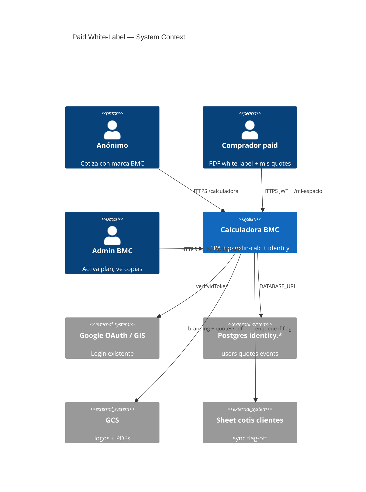
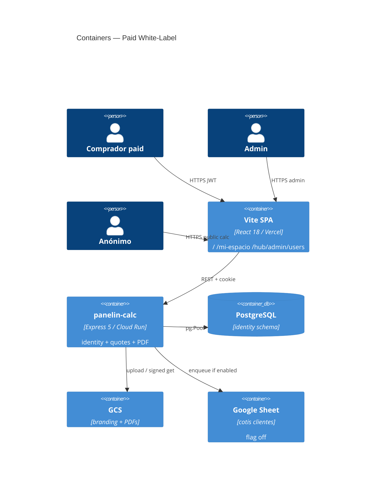

# System Design Document: Paid Comprador + White-Label Presupuestos

**One-liner:** A manually activated paid Comprador generates BMC-priced presupuestos under their own logo; BMC keeps an immutable server-priced copy with margin. Public calculator stays anonymous and BMC-branded.

**How to run after this spec:** implement in a **separate** session with Grok `/goal` reading this file as SoT. Do not treat `docs/master-plans/user-identity-GOLIVE.md` infra status as current.

```text
cd ~/calculadora-bmc
/goal load goal-prompt-paid-white-label-presupuestos-grok.md
```

Claude Code fallback (not preferred): `goal-prompt-paid-users-white-label-presupuestos.md`.

Branch for implementation: `feat/paid-white-label-presupuestos` from `origin/main`. Never continue `feat/panelin-argentina-tts`.

---

## 0. Project Discovery

| Field | Value |
|-------|--------|
| **Name** | Paid Comprador + White-Label Presupuestos (Modality 1) |
| **Slug** | `paid-white-label-presupuestos` |
| **Type** | Feature on the existing Vite + Express 5 + Postgres monolith — not greenfield |
| **AI** | **N/A** — no new LLM, RAG, or Panelin tools |
| **Users** | Paid comprador (instalador/barraca), BMC admin, anonymous lead, operator (unchanged) |
| **Scale (MVP)** | Tens of paid users, not thousands |
| **Environment** | Vercel SPA + Cloud Run `panelin-calc` + Postgres `identity.*` + GCS |
| **Maturity** | Layer on **already-live** Comprador identity (2026-05-20). Identity schema applied. |
| **Readers** | Matias, `/goal` implementer, later ops (Ramiro) |
| **This kit** | `SDD.md` (contract) · `TARGET.md` · `RECREATION-CHECKLIST.md` · `IMPLEMENTATION-GUIDE.md` |

---

## 1. Introduction & Goals

### 1.1 Problem Statement

BMC Uruguay (METALOG SAS) sells sandwich panels through a public calculator whose customer PDFs carry BMC navy, logo, and wordmark. Third parties — installers and lumberyards — want to issue **their** presupuesto to **their** client with **their** logo, while still selling only BMC products at BMC list prices.

If the client PDF is white-label and BMC does not keep a frozen copy, BMC loses price/margin control and audit. If the public `/` calculator is gated behind a paid login, Meta Ads lead flow dies.

Modality 1 is the smallest product that satisfies both sides: paid users brand the **client** document; BMC always holds a **server-canonical** internal copy.

### 1.2 Goals

| ID | Goal | Measurable evidence |
|----|------|---------------------|
| G1 | Paid entitlement on `plan_tier`, **manual** activation | `PATCH /api/admin/users/:id/plan-tier` + User Admin; unpaid branding → 403 |
| G2 | Client PDF/WA has user logo and **no** BMC chrome | `export.pdf?audience=client` has no `bmc-logo.png` / “BMC Uruguay” header |
| G3 | Immutable BMC copy with server prices + margin | `identity.quotes.bmc_snapshot` + `quote_events`; client tamper does not change BMC totals |
| G4 | Anonymous + operator flows unchanged | `/` and `/calculadora` stay public; `simple*` PDFs stay BMC-branded |
| G5 | Sheets sync remains opt-in | `SHEETS_CLIENT_QUOTES_ENABLED` default false; no auto-create tab |

### 1.3 Stakeholders

| Role | Who | Interest |
|------|-----|----------|
| Product owner | Matias | SaaS-lite modality 1, visible margin, no payment gateway in v1 |
| Paid comprador | Instalador / barraca | Own-logo PDF, Mis presupuestos |
| Admin BMC | superadmin | Activate paid, inspect copies + margin |
| Anonymous | Ads lead | Public BMC calculator |
| Operator | Hub BMC | No change to Wolfboard / calc operator path |
| Implementer | `/goal` agent | File-level contract, ADRs binding |

---

## 2. Context & Scope (C4 Level 1)



### External interfaces

| Interface | Dir | Protocol | Description |
|-----------|-----|----------|-------------|
| `POST /auth/google` | ↔ | HTTPS | Existing GIS → JWT + `bmc_sess` |
| Postgres `identity.*` | ↔ | pg | Users, quotes, events, audit |
| GCS | → | HTTPS SA | `identity-branding/{user_id}/`, `quotes/pdf/` |
| Google Sheets | → | Sheets API | Tab `Base de datos cotis de clientes` if flag on |
| Chromium PDF | internal | `quotePdf.js` | Dual audience render |

### In scope

- `plan_tier='paid'` entitlement (not a new role)
- Logo upload + branding
- Dual-audience PDF (client white-label / BMC internal)
- Server re-price + immutable `bmc_snapshot`
- Admin PATCH + User Admin control
- Tests + runbook `docs/team/runbooks/paid-white-label-mvp.md`

### Out of scope

- Stripe / Mercado Pago / any payment gateway
- Multi-tenant catalogs, reseller margins, custom price lists
- Re-applying `20260601000001_identity_init.sql`
- Gating `/` behind login
- New auth stack / cookie / JWT issuer
- Changing master prices / LISTA_ACTIVA / matriz
- Panelin tools, PEA, Envíos
- Merge to `main` or production deploy without human OK

---

## 3. Constraints

- Reuse `server/lib/identityAuth.js` + cookie `bmc_sess`. No second session model.
- Roles stay `comprador | operator | admin | superadmin`. **Do not invent `paid_base`.**
- Today `plan_tier` is `base | plus`. Paid is a **third value `paid`**. `plus` remains CRM Plus (identity master plan).
- Sellable unit prices are resolved server-side from catalog / `p()` / LISTA_ACTIVA. Client payload is display-only.
- Identity schema is already applied (Supabase project `htnwozvopveibwppyjhg`). Migrations must be **additive and idempotent**.
- Secrets via Doppler `bmc-backend/prd` / GCP Secret Manager. Never commit values.
- Canonical calculator UI: `src/components/PanelinCalculadoraV3_backup.jsx`.
- `docs/master-plans/user-identity-GOLIVE.md` “migrations not applied” is **stale**. PROJECT-STATE 2026-05-20 wins.
- AI architecture (skill Phase 3): **N/A** for this feature.

---

## 4. Solution Strategy

- **Architecture style:** Extend the modular monolith. No new Cloud Run service.
- **Entitlement:** `identity.users.plan_tier = 'paid'` + helper `isPaidTier(user)` / `requirePaid`.
- **White-label:** Store branding on the user; `quotePdf.js` inlines the user logo only when `audience=client` **and** user is paid. BMC-internal render always uses BMC chrome + margin block.
- **BMC copy:** **One** `identity.quotes` row (user-owned) + `bmc_snapshot` jsonb written **once** on first `completed` + append-only `quote_events`. Soft-delete must not erase snapshot, events, or a Sheets row.
- **Sheets:** Existing `clientQuotesSheetSync.enqueue`; flag default false; lib does not create the tab.
- **Activation:** Admin UI + emergency SQL. No self-serve checkout.
- **Trade-off accepted:** Manual ops for first users; no payment; public calc remains a lead magnet.

---

## 5. Container View (C4 Level 2)

No new containers. Touched surfaces:



| Container | Change |
|-----------|--------|
| Vite SPA | Branding tab on `/mi-espacio`; plan_tier control on User Admin; PDF preview uses branding |
| Express `panelin-calc` | PATCH plan-tier; GET/POST branding; complete/freeze; `quotePdf` dual audience |
| Postgres `identity` | CHECK on `plan_tier`; branding jsonb; `bmc_snapshot` + timestamp |
| GCS | Prefix `identity-branding/{user_id}/` |
| Sheets | Same mapper; no auto tab create |

---

## 6. Component View (no AI)

This feature does **not** add AI components. Panelin / `agentCore` / RAG stay untouched (ADR-008).

| Component | File(s) | Contract |
|-----------|---------|----------|
| Entitlement | `server/lib/identityAuth.js` — JWT already carries `plan_tier`; add `isPaidTier` + `requirePaid` | unpaid → 403 `{ error: "plan_required" }` |
| Admin plan | `server/routes/identityAdmin.js` `PATCH /api/admin/users/:id/plan-tier` | `{ plan_tier }`; write `identity.audit_log` |
| User Admin UI | `src/components/admin/users/UserAdminModule.jsx` + drawer | select `base` / `paid` / `plus` |
| Branding API | `server/routes/identityMe.js` `GET/POST /api/me/branding` | GET any authed user; POST **paid only**; logo ≤ 1 MB png/jpeg/webp |
| Logo store | Reuse WA-media / quotes GCS helper | private object; short-TTL signed GET |
| Quote upsert | `POST /api/me/quotes` (existing) | still coerces user status to `draft` |
| Complete / freeze | New `POST /api/me/quotes/:id/complete` **if** no server flip exists (P0 must confirm) | re-price; write snapshot once |
| PDF client | `server/lib/quotePdf.js` + `src/pdf-templates/simple*.js` | paid + `audience=client`: user logo, zero BMC chrome |
| PDF BMC-internal | same renderer `audience=bmc` | BMC logo + margin block |
| Sheet sync | `server/lib/clientQuotesSheetSync.js` | enqueue on completed when flag on |
| Mi espacio | `src/components/MySpacePage.jsx` preferencias | upload + preview |

### HTTP contract

| Method | Path | Auth | Notes |
|--------|------|------|-------|
| PATCH | `/api/admin/users/:id/plan-tier` | `requireUser({ role: "admin" })` | `{ plan_tier: "base"\|"paid"\|"plus" }` |
| GET | `/api/me/branding` | `requireUser()` | 200 even if empty `{ branding: null }` |
| POST | `/api/me/branding` | `requirePaid` | multipart `logo` + field `display_name` |
| POST | `/api/me/quotes` | `requireUser()` | unchanged draft coerce |
| POST | `/api/me/quotes/:id/complete` | `requireUser()` | owner only; idempotent if already completed |
| GET | `/api/me/quotes` | `requireUser()` | **strip** `bmc_snapshot` from JSON |
| GET | `/api/me/quotes/:id/export.pdf?audience=client\|bmc` | user: `client` only; admin/operator: both | default `client` |
| GET | `/api/admin/quotes/:id` (extend existing admin quote read if present) | admin | includes snapshot + margin |

---

## 7. Data Flow — paid quote

```mermaid
sequenceDiagram
  participant P as Paid user
  participant SPA as Vite SPA
  participant API as panelin-calc
  participant PG as identity.*
  participant GCS as GCS
  participant PDF as quotePdf

  P->>SPA: Login Google (existing)
  SPA->>API: POST /auth/google
  API-->>SPA: JWT plan_tier=paid
  P->>SPA: Upload logo
  SPA->>API: POST /api/me/branding
  API->>GCS: put identity-branding/uid/logo
  API->>PG: users.branding jsonb
  P->>SPA: Finish wizard
  SPA->>API: POST /api/me/quotes (draft)
  Note over API: Persist payload; do not trust client unit prices
  SPA->>API: POST /api/me/quotes/:id/complete
  API->>API: Re-price from catalog / LISTA_ACTIVA
  API->>PG: status=completed + bmc_snapshot ONCE + quote_events
  API->>PDF: audience=client (user logo)
  API->>PDF: audience=bmc (BMC logo + margin)
  opt SHEETS_CLIENT_QUOTES_ENABLED
    API->>API: clientQuotesSheetSync.enqueue
  end
  P->>SPA: export.pdf audience=client
  Note over P: No BMC brand
```

Anonymous path: no branding, no paid snapshot requirement, BMC-branded PDF as today.

### Complete-path gap (P0)

[CONFIRMED: user `POST /api/me/quotes` coerces status to `draft` only.]  
[INFERRED: a server-side flip to `completed` may be missing or only in calc/admin paths | basis: identityMe comments.]  
P0 of implementation **must** locate the flip. If none exists, add `POST /api/me/quotes/:id/complete` as specified above. Do not let the client POST `status=completed`.

---

## 8. Data Model (additive)

```sql
-- conceptual; real file: supabase/migrations/YYYYMMDDHHMMSS_paid_white_label.sql
ALTER TABLE identity.users
  DROP CONSTRAINT IF EXISTS users_plan_tier_check;
ALTER TABLE identity.users
  ADD CONSTRAINT users_plan_tier_check
  CHECK (plan_tier IN ('base', 'plus', 'paid'));

ALTER TABLE identity.users
  ADD COLUMN IF NOT EXISTS branding jsonb NOT NULL DEFAULT '{}'::jsonb;

ALTER TABLE identity.quotes
  ADD COLUMN IF NOT EXISTS bmc_snapshot jsonb;
ALTER TABLE identity.quotes
  ADD COLUMN IF NOT EXISTS bmc_snapshot_at timestamptz;
```

`users.branding` shape:

```json
{
  "display_name": "Barraca Sur",
  "logo_gcs_uri": "gs://…/identity-branding/{user_id}/logo.png",
  "logo_content_type": "image/png",
  "updated_at": "2026-08-15T12:00:00Z"
}
```

`quotes.bmc_snapshot` shape (written once):

```json
{
  "lista": "venta",
  "currency": "USD",
  "lines": [
    { "sku": "ISODEC_EPS_100", "qty": 10, "unit_price_server": 37.76, "source": "LISTA_ACTIVA" }
  ],
  "subtotal_usd": 0,
  "iva": 0.22,
  "total_usd": 0,
  "margin_usd": 0,
  "margin_pct": 0,
  "client_total_usd": 0,
  "price_drift": false,
  "priced_at": "2026-08-15T12:00:00Z",
  "calculator_data_version": "…"
}
```

**Immutability:** application guard — `UPDATE identity.quotes SET bmc_snapshot = …` is rejected when `bmc_snapshot IS NOT NULL`. Prefer a trigger if cheap; app guard is enough for MVP if tested.

`quote_events.kind = 'completed'` payload is a copy of the snapshot (already append-only).

Soft-delete: `status = 'deleted'`. Snapshot and events remain.

**GET `/api/me/quotes` must omit `bmc_snapshot`** so the paid user cannot read BMC margin.

---

## 9. Crosscutting Concepts

### 9.1 Security

- Paid check is **server-side** (`requirePaid`). UI hide is not authorization.
- Logo: sniff MIME from bytes, max 1 MB, allow `image/png`, `image/jpeg`, `image/webp` only. **No SVG** (XSS).
- Ignore client unit prices when building `bmc_snapshot`.
- `audience=bmc` export only for `admin` / `operator` / `superadmin`.
- Rate-limit `POST /api/me/branding` (storage abuse).
- Do not commit secrets. Doppler config name is `prd`.

### 9.2 Reliability

- Branding/GCS failure must not crash the calculator; PDF falls back to `display_name` text, still no BMC chrome for paid client.
- Sheets failure must not fail `complete` (existing enqueue / reconcile).
- Snapshot write in the **same transaction** as `status = 'completed'`.

### 9.3 Performance

- Inline logo as data URL in print HTML (same pattern as BMC logo in `quotePdf.js`).
- Reuse Chromium semaphore (max 2) in `quotePdf.js`. Two audiences may mean two renders; serialize on the same quote.

### 9.4 Observability

| Concern | Tool | What we track |
|---------|------|----------------|
| Logs | pino | `branding.upload`, `quote.freeze`, `quote.price_drift` |
| Audit | `identity.audit_log` | plan-tier PATCH, branding POST |
| Activity | `identity.user_activity_log` | only if taxonomy add is cheap; else skip |
| Metrics | existing | PDF render errors, branding 403 rate |

### 9.5 Cost

- No extra LLM spend (ADR-008).
- Cost = GCS objects + up to two Chromium renders per complete.
- Chromium semaphore is the blast-radius control.

### 9.6 Sustainability

- One renderer, two audiences — do not fork template trees.
- Overwrite logo object per user (no version pile) unless audit needs old logos (v1: overwrite).

### 9.7 Compliance / fiscal

- Client PDF is **not** a CFE. Do not touch DGI / BPS surfaces.
- BMC snapshot is internal commercial control (list price + margin), not a tax document.

---

## 10. Architecture Decision Records

### ADR-001: `plan_tier='paid'` — not a new role

**Status:** Accepted  
**Context:** Early draft proposed role `paid_base`. Schema already separates `role_grants` from `plan_tier`.  
**Decision:** Entitlement lives on `plan_tier`. Roles stay as they are.  
**Consequences:** + No RBAC explosion. − Need a CHECK-constraint migration.  
**Alternatives:** Reuse `plus` — rejected (`plus` is CRM Personal in the identity master plan).

### ADR-002: Public calculator stays anonymous

**Status:** Accepted  
**Decision:** `/` and `/calculadora` require no login. Paid unlocks branding + persisted “mis presupuestos”, not the calculator itself.  
**Consequences:** + Ads lead magnet intact. − Paid is not a walled garden.  
**Alternatives:** Gate wizard at step 5 — rejected for v1 public funnel.

### ADR-003: One quote row + snapshot — not dual insert

**Status:** Accepted  
**Decision:** `bmc_snapshot` + `quote_events`. Do not insert a second `identity.quotes` row as a “BMC copy”.  
**Consequences:** + One `quote_id`; Sheets idempotency unchanged. − `/api/me/*` must strip snapshot.  
**Alternatives:** Dual rows — rejected (merge/claim/delete become ambiguous).

### ADR-004: Server-canonical prices

**Status:** Accepted  
**Decision:** Re-price on complete from catalog / LISTA_ACTIVA. Persist `price_drift` if client totals differ.  
**Consequences:** + Margin control. − Must implement a real complete path (see §7 gap).  

### ADR-005: Logos in GCS, not the user’s Drive

**Status:** Accepted  
**Decision:** Private prefix `identity-branding/{user_id}/`.  
**Alternatives:** User Drive folder — rejected (user can delete; not BMC SoT).

### ADR-006: No payment gateway in v1

**Status:** Accepted  
**Decision:** Superadmin activates `plan_tier` by UI or SQL.  
**Consequences:** + Shippable without PSP. − Manual ops.

### ADR-007: Dual PDF audience

**Status:** Accepted  
**Decision:** One renderer, `audience=client|bmc`. Paid client PDF is strictly white-label (no BMC wordmark, RUT, or navy logo).  
**Alternatives:** One PDF with both logos — rejected (breaks white-label).

### ADR-008: AI out of scope

**Status:** Accepted  
**Decision:** Skill Phase 3 (LLM/RAG/agents/cost model) is N/A. No new Panelin tools.

---

## 11. Risks & Technical Debt

| Risk | Impact | Likelihood | Mitigation |
|------|--------|------------|------------|
| Stale GOLIVE.md → re-run `identity_init` | High | Medium | This SDD + goal: DO NOT |
| Complete path is print-only (no server flip) | High | Medium | P0 audit; add `/complete` if missing |
| Prod rows already use `plus` as “paid” | Medium | Low | `SELECT plan_tier, count(*)`; document; do not remap silently |
| Sheets tab missing | Low | High | Leave flag off; runbook human create |
| SVG logo XSS | High | Medium | Ban SVG (ADR-007 adjacent) |
| Client price tamper | High | High | ADR-004 |
| Vercel preview cookie domain | Medium | Medium | UAT on `calculadora-bmc.vercel.app` |
| `feat/pdf-customer-brand-identity` drift | Medium | Medium | Inspect; cherry-pick; no blind merge |

---

## 12. Delivery (summary)

See [`IMPLEMENTATION-GUIDE.md`](./IMPLEMENTATION-GUIDE.md) for file-level phases P0–P5.

| Phase | Outcome |
|-------|---------|
| P0 Audit | 10-line gap list (complete path, GCS helper, plus usage) |
| P1 Entitlement | CHECK + PATCH + User Admin |
| P2 Branding + PDF | Upload + dual audience |
| P3 Freeze + snapshot | Complete + strip snapshot on me GET |
| P4 Sheets + runbook | Flag-safe enqueue + `paid-white-label-mvp.md` |
| P5 Tests + PR | Five required tests; PR **not** merged |

---

## 13. Success Criteria

- Branch is `feat/paid-white-label-presupuestos` and contains `origin/main`.
- Unauthenticated `GET /api/me/quotes` → 401.
- `plan_tier=base` `POST /api/me/branding` → 403.
- Paid user client PDF contains user logo and does **not** contain `bmc-logo.png` or header “BMC Uruguay”.
- BMC snapshot `total_usd` matches server catalog math, not a tampered client total.
- Soft-delete does not drop `bmc_snapshot` or `quote_events`.
- Anonymous `/calculadora` still produces a BMC-branded quote without login.
- Admin can set `plan_tier` via UI; runbook has emergency SQL.
- `npm run lint` clean on touched files; new tests pass. Prefer `gate:local`; pre-existing main failures must be named.

---

## 14. Glossary

| Term | Definition |
|------|------------|
| Modality 1 | Paid user sells BMC catalog/prices under their brand; BMC keeps the copy |
| White-label | Client PDF/WA with no BMC chrome |
| `plan_tier` | `base` / `paid` / `plus` — not a role |
| `bmc_snapshot` | Immutable server-price freeze at first complete |
| audience | `client` vs `bmc` render |
| LISTA_ACTIVA | Active venta/web price resolution |
| `requirePaid` | Middleware: `plan_tier === 'paid'` (plus does **not** imply white-label unless a later ADR says so) |
| Comprador | End-user Google identity role (default on open registration) |

---

## 15. Related documents

| Doc | Role |
|-----|------|
| `docs/identity-auth.md` | Live auth flow |
| `docs/master-plans/user-identity-master-plan.md` | Historical A–J (plan tiers base/plus) |
| `docs/master-plans/user-identity-GOLIVE.md` | **Stale infra status** — do not re-golive |
| `docs/sheets-mapper-clientes.md` | Sheet column contract |
| `docs/sdd/calculadora-bmc/SDD.md` | Platform as-built |
| `goal-prompt-paid-users-white-label-presupuestos.md` | `/goal` executor prompt (ADRs here bind) |
