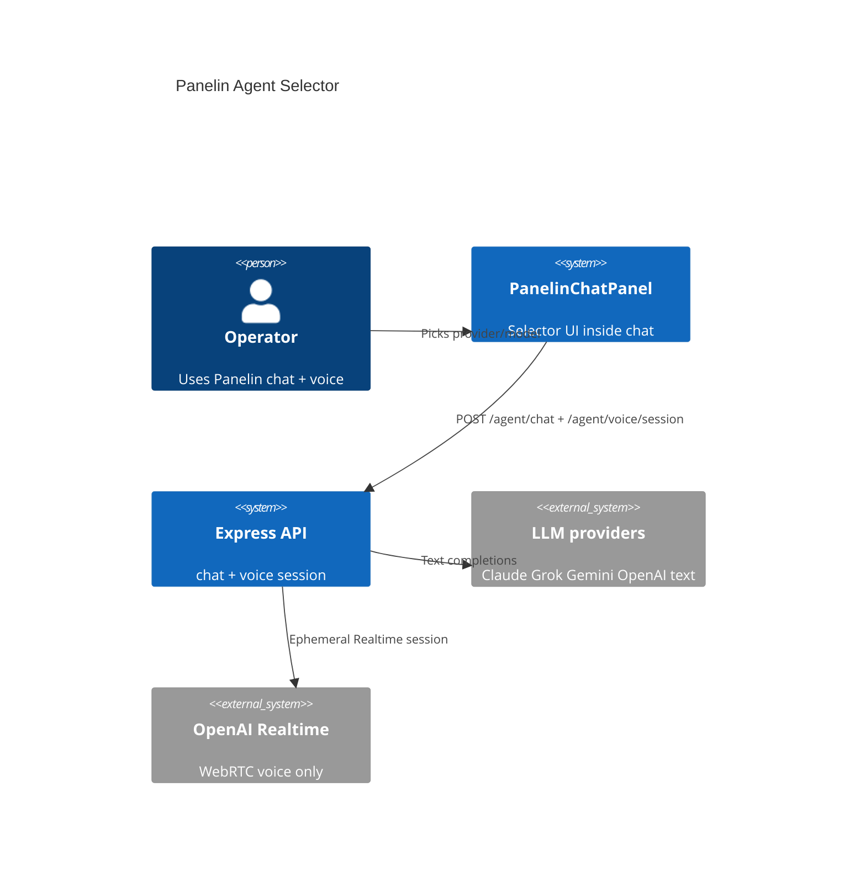
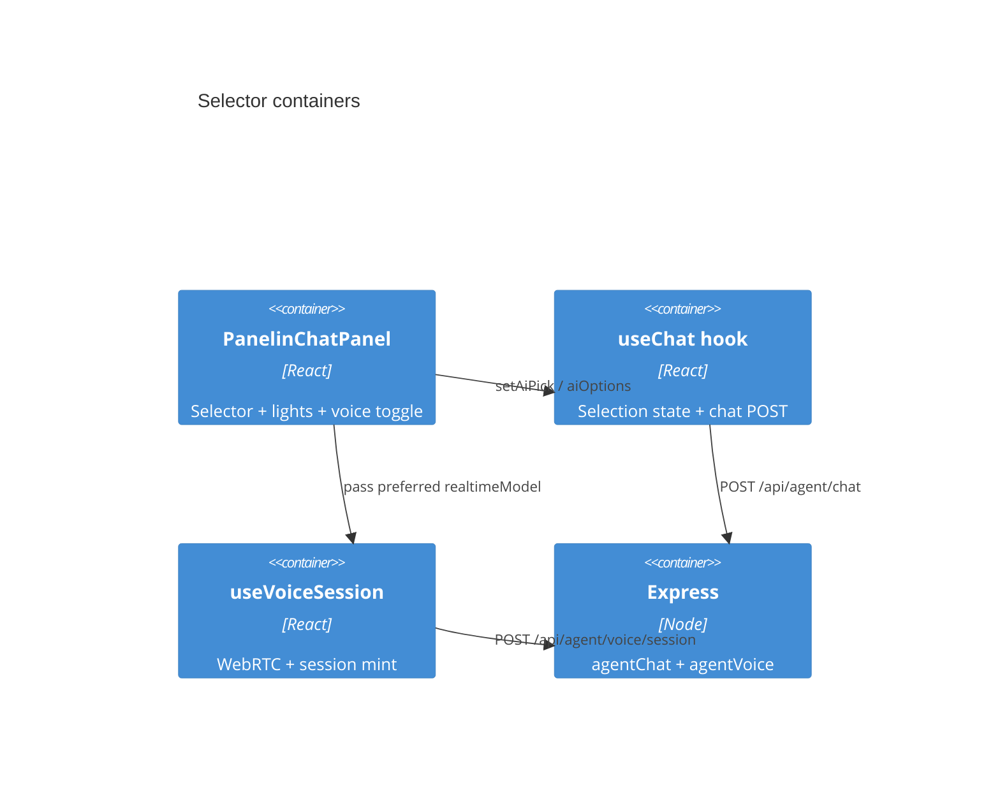
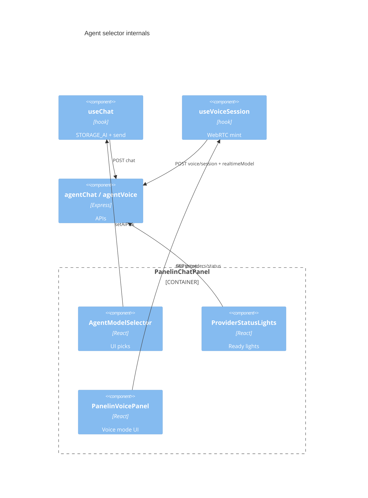
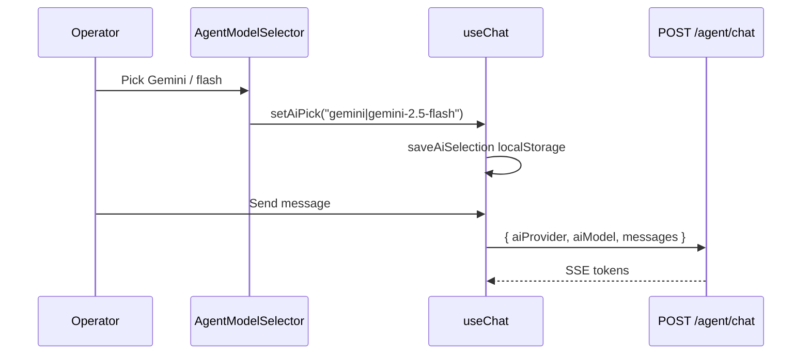
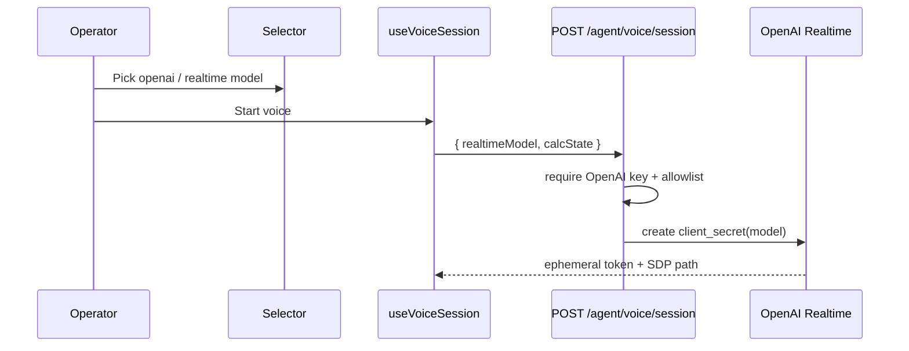

# System Design Document: Panelin In-Chat AI Agent Selector

**Answer first:** **Yes, it is possible** — and most of the **text-chat** plumbing already exists. The gap is **UI inside `PanelinChatPanel`** plus **wiring voice session mint** to respect a shared preference. Voice cannot use Claude/Gemini/Grok as the Realtime WebRTC engine today (OpenAI Realtime only); the selector must handle that honestly.

---

## 1. Introduction & Goals

### 1.1 Problem Statement

Operators need to choose which AI provider/model Panelin uses **from inside the chat drawer**, not from the main calculadora chrome. Selection must apply to **text chat** and influence **voice mode** as far as the stack allows.

Today **[CONFIRMED]**:

| Layer | State |
|-------|--------|
| Text chat API | Accepts `aiProvider` + `aiModel` on `POST /api/agent/chat` (`agentChat.js`) |
| Client state | `useChat` has `aiProvider`, `aiModel`, `setAiPick`, loads `GET /api/agent/ai-options`, persists localStorage |
| Chat UI | **`PanelinChatPanel` has no selector** (only readiness lights) |
| Backup UI | Old select lived in `PanelinCalculadoraV3_backup.jsx` (main app) — wrong place |
| Voice | `POST /api/agent/voice/session` always uses `config.openaiRealtimeModel` + OpenAI key — **no client model override** |

### 1.2 Goals

| # | Goal | Priority | Success metric |
|---|------|----------|----------------|
| G1 | Real provider + model selector **inside** Panelin chat window (header or toolbar) | P0 | Control visible in `PanelinChatPanel` header on all mount modes |
| G2 | Selection drives **text** turns via existing `useChat` → `aiProvider`/`aiModel` | P0 | Next `POST /api/agent/chat` body includes chosen pair |
| G3 | Same selection **affects voice** within platform limits (OpenAI Realtime model allowlist) | P0 | Voice session uses `resolveRealtimeModel(...)` result |
| G4 | Disabled options when readiness is red; show amber warning | P1 | Red providers not selectable when live filter on |
| G5 | Not on main calculadora surface (no calculator toolbar control required) | P0 | No selector outside chat shell |

Acceptance detail: Appendix B.

### 1.3 Non-goals

- Multi-provider **Realtime** voice (Claude/Gemini live voice WebRTC) — different product.
- Secret paste UI.
- Changing default server failover policy for other channels (WA/ML) unless they share the same preference store later.

### 1.4 Stakeholders

| Role | Interest |
|------|----------|
| Operator | Pick model without leaving chat |
| Admin | Prefer cheap Gemini when Claude has no credits |
| Voice users | Clear model when in voice mode |

---

## 2. Context & Scope (C4 Level 1)



### External interfaces

| Interface | Direction | Tag |
|-----------|-----------|-----|
| `GET /api/agent/ai-options` | ← client | **[CONFIRMED]** providers + models + readiness |
| `GET /api/agent/providers/status` | ← client | **[CONFIRMED]** lights |
| `POST /api/agent/chat` body `aiProvider`, `aiModel` | → API | **[CONFIRMED]** |
| `POST /api/agent/voice/session` body `realtimeModel?` | → API | **[PROPOSED]** extend |
| OpenAI Realtime models | env + allowlist | **[CONFIRMED]** `openaiRealtimeModel` |

---

## 3. Constraints

| Type | Constraint |
|------|------------|
| UX placement | Selector **only** in `PanelinChatPanel` (drawer / floating / Co-Work embedded) |
| Text multi-provider | claude, grok, gemini, openai, auto **[CONFIRMED]** |
| Voice transport | OpenAI Realtime WebRTC only **[CONFIRMED]** `useVoiceSession.js`, `agentVoice.js` |
| Readiness | Prefer Ready/amber providers; hide not_ready when `AI_OPTIONS_REQUIRE_LIVE` |
| Persistence | Reuse `useChat` localStorage selection key |
| No secrets in UI | Models/providers only |

---

## 4. Solution Strategy

### 4.1 Shared preference (single source)

**Storage key [CONFIRMED]** `src/hooks/useChat.js:7`:

```js
const STORAGE_AI = "panelin-chat-ai-selection-v1";
// value: JSON { aiProvider: "auto"|"claude"|"openai"|"grok"|"gemini", aiModel: string }
```

Also: `ALLOWED_AI_PROVIDERS` = `claude|openai|grok|gemini` (`useChat.js:9`).

```
localStorage["panelin-chat-ai-selection-v1"]  (saveAiSelection)
        │
        ├─► Text send: aiProvider + aiModel  [CONFIRMED path]
        └─► Voice mint: resolveRealtimeModel(...) → realtimeModel  [PROPOSED]
```

### 4.2 Voice mapping policy (honest + deterministic)

Default Realtime model **[CONFIRMED]** `server/config.js:120`:

```js
openaiRealtimeModel: process.env.OPENAI_REALTIME_MODEL || "gpt-4o-realtime-preview"
```

**Allowlist** (server constant, env default always included):

```
REALTIME_MODEL_ALLOWLIST = [
  config.openaiRealtimeModel,           // always
  "gpt-4o-realtime-preview",
  "gpt-4o-mini-realtime-preview",
]
```

**`resolveRealtimeModel(aiProvider, aiModel, defaultModel, allowlist)`** — pure, order fixed:

```
1. defaultModel := allowlist[0] or config.openaiRealtimeModel
2. if aiProvider is null/undefined/"" or "auto":
     return defaultModel
3. if aiProvider !== "openai":
     return defaultModel          // non-openai chat pick does not change voice engine
4. // aiProvider === "openai"
   if aiModel is non-empty string AND aiModel is in allowlist:
     return aiModel
   return defaultModel            // text-only openai models (e.g. gpt-4o-mini) → default realtime
5. Never invent models outside allowlist; invalid body field → 400 on server
```

| Chat selection | Voice result |
|----------------|--------------|
| `auto` / claude / gemini / grok | `defaultModel`; UI: "Voz: OpenAI Realtime (default)" |
| `openai` + `""` | `defaultModel` |
| `openai` + allowlisted realtime id | that id |
| `openai` + non-realtime text model | `defaultModel` |

**Rationale:** Realtime ≠ Chat Completions. No Claude/Gemini WebRTC without a new stack.

### 4.3 Architecture style

Extend existing SPA + Express; no new service. Small UI component + thin API body field.

---

## 5. Container View (C4 Level 2)



### 5.1 Parent wire map — all `PanelinChatPanel` call sites **[CONFIRMED]**

| Parent | Path | Modes | Selector props to add |
|--------|------|-------|------------------------|
| Co-Work desk | `src/components/PanelinCoWorkPage.jsx:225` | `isOpen` + `embeddedMode` + `detachedMode` | Pass from local `useChat`: `aiProvider`, `aiModel`, `aiOptions`, `aiOptionsError`, `setAiPick` (and optionally `setAiProvider`/`setAiModel`) |
| Backup calculator — sidebar | `src/components/PanelinCalculadoraV3_backup.jsx:7848` | `embeddedMode` via `panelinChatPanelProps` | Extend `panelinChatPanelProps` with same fields from that file’s `useChat` |
| Backup calculator — floating | `…_backup.jsx:7866` | `floatingMode` + spread props | Same spread object |
| Backup calculator — detached window | `…_backup.jsx:7904` | `detachedMode` | Same |
| Voice UI host | `src/components/PanelinVoicePanel.jsx` | child of chat panel | Receive `realtimeModel` from parent panel (not own selector) |

**Primary production path today:** Co-Work + whatever host still mounts backup calculator. Selector must work in **all** modes (embedded / floating / detached) because props are identical.

**Prop contract on `PanelinChatPanel` [PROPOSED]:**

```js
aiProvider, aiModel, aiOptions, aiOptionsError, setAiPick
// optional:
readiness, // or use internal useProviderReadiness (already present)
```

---

## 6. AI Architecture — Component View

### 6.1 Components

| Component | Path | Responsibility |
|-----------|------|----------------|
| **AgentModelSelector** | `src/components/ai/AgentModelSelector.jsx` **[PROPOSED]** | Dropdown: Auto / provider / model; disabled red |
| **resolveRealtimeModel** | `server/lib/resolveRealtimeModel.js` **[PROPOSED]** or shared `src/utils/` pure | Deterministic map §4.2 |
| **PanelinChatPanel** | existing | Host selector under header lights |
| **useChat** | existing | Already owns selection + send payload |
| **useVoiceSession** | existing | Accept `realtimeModel` option; POST body |
| **agentVoice session** | existing | Allowlist + resolve model from body |
| **ai-options / readiness** | existing | Options + lights |

### 6.1b C4 Component (L3)



### 6.2 N/A

No new RAG/agent runtime. Selector only chooses **which** existing provider/model serves the turn.

### 6.3 Voice model allowlist + resolver **[PROPOSED]**

See **§4.2** for full algorithm. Server rejects non-allowlisted `realtimeModel` with **400**.

---

## 7. Data Flow

### 7.1 Text chat (already works once UI calls setAiPick)



### 7.2 Voice mint with shared preference **[PROPOSED]**



### 7.3 UI placement (chat window only)

```
┌─ PanelinChatPanel ─────────────────────┐
│ [avatar] Panelin                       │
│          Asistente BMC                 │
│          ● lights                      │
│          [ Auto ▾ | Gemini ▾ | model ▾ ]  ← NEW
│          [optional: Voz model ▾]         ← if openai
│                            [voice][…]  │
│ messages …                             │
│ compose …                              │
└────────────────────────────────────────┘
```

Not on main calculator toolbar / wizard chrome.

---

## 8. Deployment View

No new deployables. Same SPA (Vercel) + API (Cloud Run / local `:3001`).

| Name | Role | Tag |
|------|------|-----|
| `OPENAI_REALTIME_MODEL` | Default voice model (default `gpt-4o-realtime-preview`) | **[CONFIRMED]** `config.js:120` |
| `ANTHROPIC_API_KEY` … `GEMINI_API_KEY` | Text providers | existing |
| `OPENAI_API_KEY` | Text openai + voice | existing |
| `AI_OPTIONS_REQUIRE_LIVE` | Hide red from picker | readiness SDD |

CI: unit tests for `resolveRealtimeModel` + selector filter; no new infra.

---

## 9. Crosscutting Concepts

### 9.1 Security
- Allowlist realtime models server-side (never trust arbitrary model string).
- Auth for voice session unchanged (`requireServiceOrUser` calc write).

### 9.2 Reliability
- Red providers disabled; if selected provider turns red mid-session, next text turn failovers per existing chain when `auto`.
- Voice: if OpenAI not ready, disable voice start with same reason as lights.

### 9.3 UX / a11y
- Labels: "Proveedor", "Modelo"; not color-only (pair with readiness text).
- Mobile: compact single select `provider|model` (existing `setAiPick` format).

### 9.4 Cost
- Selector does not probe by itself; reuses readiness cache / ai-options.
- Prefer cheap models in `auto` via existing `DEFAULT_PROVIDER_ORDER` / failovers (no extra LLM cost from the control itself).

### 9.5 Observability **[PROPOSED]**

Structured logs (no secrets):

```json
{ "event": "panelin_selector_pick", "aiProvider": "gemini", "aiModel": "gemini-2.5-flash", "surface": "panelin_chat" }
{ "event": "panelin_voice_session", "realtimeModel": "gpt-4o-realtime-preview", "source": "resolveRealtimeModel" }
```

Client may fire pick event once on change; server logs voice mint model always.

### 9.6 Performance
- Selector render: no network; options from already-fetched `ai-options` / readiness poll (60s).
- Target: open chat → selector interactive &lt; 100 ms after ai-options resolve (cached).

### 9.7 Sustainability
- Default `auto` + readiness prefers live cheap fallbacks (e.g. Gemini) over hammering dead Claude — fewer failed paid calls.

---

## 10. Architecture Decisions (ADRs)

### ADR-001: Selector lives only in PanelinChatPanel

**Status:** Accepted  
**Context:** User requires chat window, not main app.  
**Decision:** Implement `AgentModelSelector` inside chat header; wire from parent only via existing chat props if needed.  
**Consequences:** + Correct UX · − Must plumb props into Co-Work/floating if chat object not internal  
**Alternatives considered:** Main calculadora toolbar (rejected); settings page only (rejected).

### ADR-002: Text multi-provider; voice OpenAI Realtime only

**Status:** Accepted  
**Context:** Realtime stack is OpenAI WebRTC.  
**Decision:** Full provider list for text; voice uses OpenAI + allowlisted realtime models; non-openai selection shows voice still uses OpenAI Realtime.  
**Consequences:** + Honest · − Not true multi-provider voice  
**Alternatives considered:** Block voice unless openai selected (too strict); fake multi-provider voice (impossible without new stack).

### ADR-003: Reuse useChat selection store

**Status:** Accepted  
**Context:** Persistence and send path already exist (`STORAGE_AI`).  
**Decision:** UI only calls `setAiPick` / `setAiProvider` / `setAiModel`.  
**Consequences:** + Minimal code · − Voice must read same store or receive props from panel that owns useChat  
**Alternatives considered:**  
- New `panelin-voice-selection` localStorage key — rejected; dual sources of truth.  
- Server-side per-user preference DB — rejected; overkill for v1.  
- React context only (no persist) — rejected; operators re-pick every reload.

### ADR-004: Server allowlist for voice model override

**Status:** Accepted  
**Context:** Client-supplied model must not open arbitrary OpenAI models.  
**Decision:** `realtimeModel` optional body field; validate against allowlist via `resolveRealtimeModel`.  
**Alternatives considered:** Client-only display without server override (rejected — wouldn't affect voice).

---

## 11. Risks & Technical Debt

| Risk | Impact | Mitigation |
|------|--------|------------|
| Users expect Claude voice | Medium | Clear UI copy: "Voz = OpenAI Realtime" |
| OpenAI billing blocks voice | High | Lights red on openai; disable mic with reason |
| Dual selectors (text vs voice) confuse | Medium | One provider row + voice model only when openai/auto |
| Props plumbing across floating/Co-Work | Medium | Prefer selector inside panel with callbacks props `aiProvider`, `setAiPick`, `aiOptions` |

---

## 12. Glossary

| Term | Meaning |
|------|---------|
| **aiProvider** | `auto` \| `claude` \| `gemini` \| `grok` \| `openai` |
| **aiModel** | Provider-specific text model id |
| **Realtime model** | OpenAI WebRTC voice model id |
| **setAiPick** | Encoded `provider\|model` or `auto` |
| **Readiness** | Live green/amber/red from providers/status |

---

## Appendix A — Evidence Index

| Claim | Tag | Source |
|-------|-----|--------|
| Chat accepts aiProvider/aiModel | CONFIRMED | `server/routes/agentChat.js` header + body parse |
| STORAGE_AI key | CONFIRMED | `src/hooks/useChat.js:7` `panelin-chat-ai-selection-v1` |
| useChat setAiPick + localStorage | CONFIRMED | `src/hooks/useChat.js:56–59`, `:284–304` |
| PanelinChatPanel has no setAiPick UI | CONFIRMED | grep no matches in PanelinChatPanel |
| Voice fixed to openaiRealtimeModel | CONFIRMED | `server/routes/agentVoice.js:174`, `:220`, `:240`, `:334` |
| Default realtime model | CONFIRMED | `server/config.js:120` |
| Co-Work mounts PanelinChatPanel | CONFIRMED | `PanelinCoWorkPage.jsx:225` |
| Backup mounts ×3 | CONFIRMED | `PanelinCalculadoraV3_backup.jsx:7848`, `:7866`, `:7904` |
| Selector in backup main app | CONFIRMED | `PanelinCalculadoraV3_backup.jsx:3254` setAiPick |

## Appendix B — Recreation checklist

Full checklist: [`RECREATION-CHECKLIST.md`](./RECREATION-CHECKLIST.md)

## Appendix C — Implementation plan (when building)

### Phase 1 — Chat selector UI (P0)
1. Add `AgentModelSelector.jsx` (auto + providers from `aiOptions`, models nested).
2. Props on `PanelinChatPanel`: `aiProvider`, `aiModel`, `aiOptions`, `setAiPick` (or full chat object).
3. Wire Co-Work + floating + embedded parents that use `useChat`.
4. Disable not_ready providers using readiness/lights.

### Phase 2 — Voice coupling (P0)
1. `POST /agent/voice/session` accepts optional `realtimeModel`.
2. Allowlist in server; default `config.openaiRealtimeModel`.
3. `useVoiceSession({ realtimeModel })` from chat selection mapping.
4. UI note when provider ≠ openai.

### Phase 3 — Polish (P1)
1. Show last used model on `done` SSE in header chip.
2. Unit tests: allowlist resolver; selector filter logic.

### Acceptance criteria
1. Operator can change provider/model **inside chat** without opening main calculadora chrome.
2. Next text message uses that provider/model (network payload inspectable).
3. Starting voice uses OpenAI Realtime with selected realtime model when openai (or default); UI documents constraint for other providers.
4. Red providers not selectable when live filter on.

---

**End of SDD v1.1** — G-01–G-05 closed; feasible; implement Phases 1–2 when ready.
