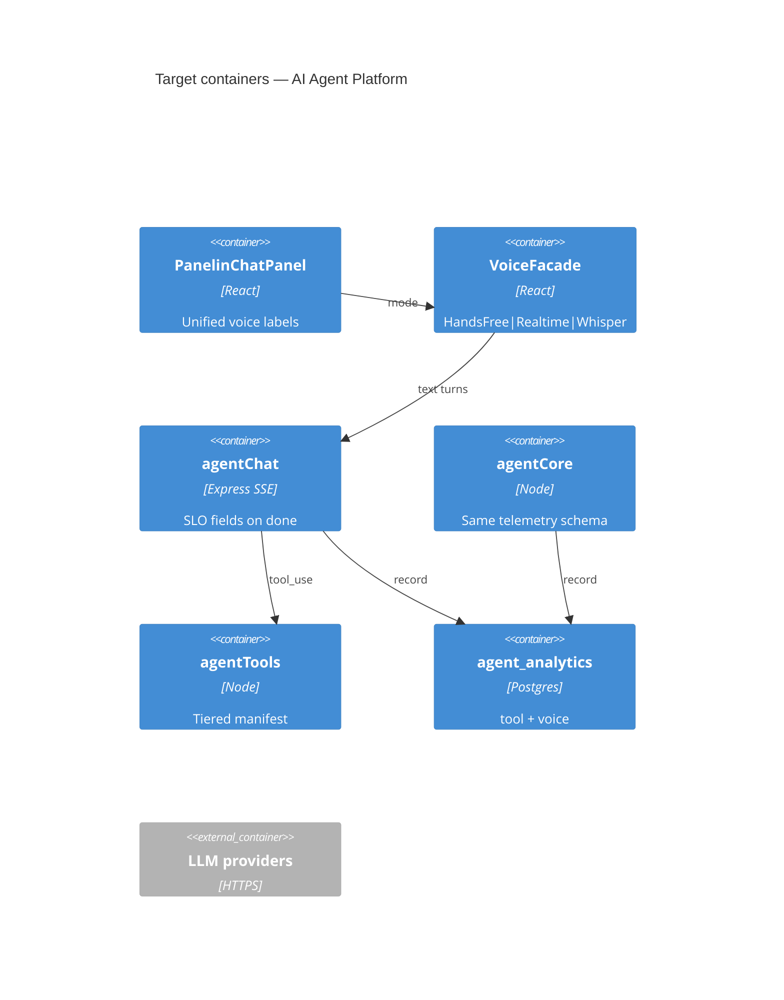
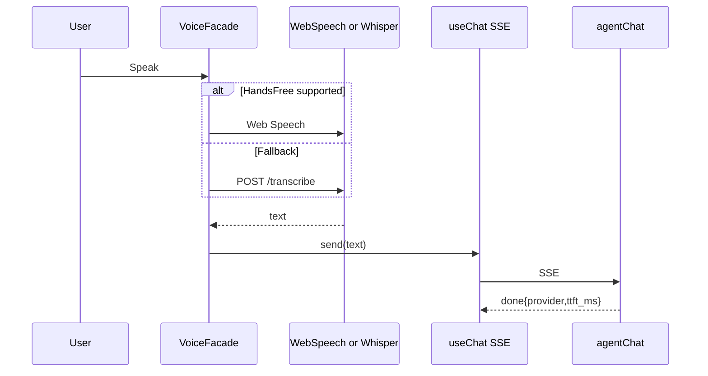

# System Design Document: Panelin AI Agent Platform — Target State (vNext)

> North-star for **finishing** the agent platform at expert level.  
> Does **not** claim undeployed APIs are live. Gaps marked **TARGET**.  
> Execution TODOs: [`IMPLEMENTATION-GUIDE.md`](IMPLEMENTATION-GUIDE.md).

## 1. Introduction & Goals

### 1.1 Problem Statement

Operators need Panelin (and channel assistants) to feel like a senior comercial: fluent Spanish, grounded prices, safe writes, usable voice, measurable quality/cost — with an SDD that keeps human and coding agents from regressing.

### 1.2 Goals (SMART)

| ID | Goal | Measure |
|----|------|---------|
| TG1 | p95 first SSE token &lt; 2.5s on healthy primary | `done.ttft_ms` + logging (IMP-12) |
| TG2 | Hands-free ≥95% success Safari+Chrome; Firefox Whisper path | Voice matrix (IMP-08) |
| TG3 | Zero silent price inventions | Goldens + SuperAgent aligned (IMP-07/11) |
| TG4 | Harness composite ≥90 sustained; goldens required | `pre-release` |
| TG5 | Prod tool count == HEAD; docs cite one manifest | IMP-01 |
| TG6 | Cost answerable within 5 minutes of ops query | IMP-06 |
| TG7 | RAG hybrid retrieve when enabled | IMP-04 + IMP-10 |

### 1.3 Stakeholders

Same as as-built SDD §1.3, plus Harness Control owner for eval gates.

## 2. Context & Scope

As-built actors remain. **TARGET** additions:

| Interface | Notes |
|-----------|-------|
| Whisper STT fallback | Firefox / no-SR browsers |
| Persistent agent analytics | Postgres |
| Voice quality metrics | Wake miss, barge-in, TTS errors |

## 3. Constraints

Inherit as-built. Add:

- No `npm audit fix --force` without approval.
- Voice product copy must match code path (Hands-free ≠ Realtime).
- Human gates never removed to green smokes.
- SDD updates required when tool count or ADRs change.

## 4. Solution Strategy (improved)

| Pillar | As-built | Target |
|--------|----------|--------|
| Brain | SSE + callAgentOnce | Same dual path + **shared turn telemetry schema** |
| Tools | 55 + OpenAPI + MCP | Capability **tiers** + deploy-synced count |
| Voice | Dual path | Hands-free default; Realtime premium; Whisper fallback |
| RAG | Opt-in embeddings | Opt-in + **hybrid KB boost** |
| Quality | **22** goldens | Optional more packs + promptfoo chat |
| Cost | pino events | Documented $/day rollup + optional hub card |
| Docs | Fragmented | This platform SDD is SoT; chat SDD is slice |

## 5. Container View (target deltas)

## 6. AI Architecture (target enhancements)

| Component | Target |
|-----------|--------|
| Orchestrator | `provider_used`, `ttft_ms`, `latency_ms` on `done` |
| Tool runtime | Tier filter on `/tools-manifest?tier=` |
| RAG | Hybrid embeddings + KB keyword |
| VoiceFacade | Single UI entry; capability detect |
| WhisperFallback | PTT → `/api/agent/transcribe` |
| Eval | Channel goldens + voice fixtures |
| Cost | OPS query + optional trends card |
| SuperAgent | Contract-tested vs `/calc` |

## 7. Data Flow (target Hands-free + Whisper)

## 8. Deployment View (target)

Same topology. **TARGET:** deploy checklist item “manifest count == HEAD”; RAG enable steps in OPS; analytics migration applied.

## 9. Crosscutting (target)

- Security: tiered MCP exposure.
- Reliability: circuit breaker + OpenRouter terminal verified in prod.
- Observability: durable analytics + SLO.
- Cost: daily rollup.

## 10. ADRs (target)

### ADR-T01: Shared turn telemetry schema

**Status**: Proposed  
**Decision**: One `logAgentTurn` used by SSE and `callAgentOnce`.

### ADR-T02: Persist agent analytics in Postgres

**Status**: Proposed  
**Decision**: Dual-write tool/voice metrics; memory ring as cache.

### ADR-T03: Tool capability tiers

**Status**: Proposed  
**Decision**: `quote | crm | admin | traktime` tiers on manifest.

## 11. Risks (if target not reached)

| Risk | If stuck as-built |
|------|-------------------|
| Undocumented spend | Budget surprises |
| Stale prod tools | MCP clients break |
| RAG false confidence | Operators think history search works |
| Voice browser gaps | Lost comercial voice usage |

## 12. Glossary

Inherits as-built; adds **VoiceFacade**, **tier**, **ttft_ms**, **hybrid retrieve**.
