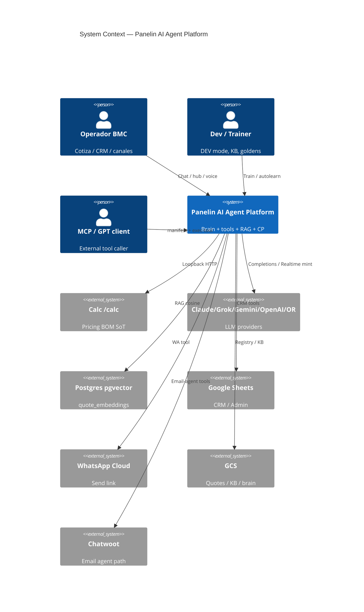
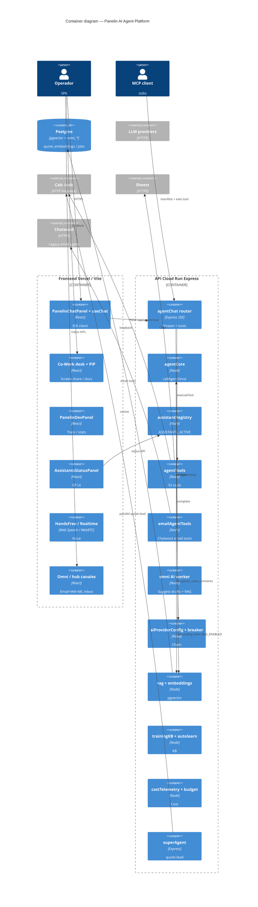
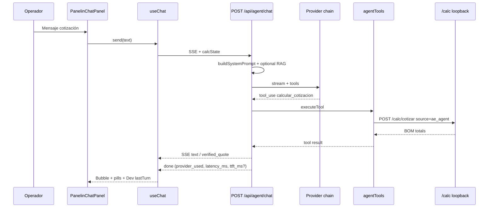

# System Design Document: Panelin AI Agent Platform

> Recreation-grade as-built of the **full AI agent development surface** inside Calculadora BMC.  
> Evidence tags: **CONFIRMED** | **INFERRED** | **UNKNOWN**.  
> Child slice (chat/voice UI): [`../panelin-chat-agent/SDD.md`](../panelin-chat-agent/SDD.md).  
> Actual vs goal + build TODOs: [`evidence/actual-vs-goal.md`](evidence/actual-vs-goal.md), [`IMPLEMENTATION-GUIDE.md`](IMPLEMENTATION-GUIDE.md).

## 1. Introduction & Goals

### 1.1 Problem Statement

BMC Uruguay needs a Spanish-first commercial AI that quotes insulation panels (USD), drives calculator state, consults CRM/Sheets, operates across web chat / WA / ML / email / Omni / MCP, and never invents prices or silently writes CRM. The platform is the shared brain + tools + training/RAG + control plane that makes that possible inside the Calculadora BMC monolith.

### 1.2 Goals (as-built + product)

| ID | Goal | Priority | Status |
|----|------|----------|--------|
| G1 | Tool-grounded quotes via loopback `/calc` with provenance `ae_agent` | High | CONFIRMED done |
| G2 | Multi-provider failover (Claude → Grok → Gemini → OpenAI → OpenRouter) | High | CONFIRMED done |
| G3 | Assistants kill-switch + always-on `seam` | High | CONFIRMED done |
| G4 | Human gates on write tools (confirm + auth) | High | CONFIRMED done |
| G5 | Measurable quality (goldens, eval, cost + SSE latency telemetry) | Medium | PARTIAL (hub $ UI; p95 baseline ops) |
| G6 | Multi-channel reuse of brain | High | PARTIAL (SSE chat separate loop — IMP-02) |
| G7 | Spec-driven evolution from this SDD | High | This bundle (audit **97 PASS**) |

SMART north-star targets live in [`SDD-TARGET.md`](SDD-TARGET.md).

### 1.3 Stakeholders

| Role | Team | Interest |
|------|------|----------|
| Operador / comercial | BMC | Cotizaciones ES-UY, CRM seguro |
| Engineering | Panelin | SSE contracts, tools, providers |
| Security / ops | BMC | Secrets, rate limits, ASSISTANTS_ACTIVE |
| Training / Gym | Panelin | KB, goldens, Dev mode |
| External AI clients | MCP / GPT Actions | tools-manifest + OpenAPI |
| AI coding agents | Cursor/Claude | SDD-driven development |

## 2. Context & Scope (C4 Level 1)

### External interfaces

| Interface | Direction | Protocol | Description |
|-----------|-----------|----------|-------------|
| LLM APIs | → | HTTPS | Chat/completions + embeddings |
| OpenAI Realtime | Browser ↔ | WebRTC + mint HTTPS | `/panelin/live` only |
| `/calc/*` | → | HTTP loopback | Quote math SoT |
| Postgres | ↔ | SQL/pgvector | RAG |
| Sheets | → | HTTPS | CRM/Admin; **503** if down |
| WhatsApp | → | HTTPS | Optional send |
| MCP | ← | stdio→HTTP | External agents |
| Chatwoot | → | HTTPS | Email-agent assistant |

**CONFIRMED mounts:** `server/index.js:1034-1095`.  
**Out of scope:** full BOM engine internals; Cursor team agents; Shopify ETL except tool call sites.

## 3. Constraints

- **Stack lock:** Node 24.x, ES modules only, Express 5, React 18 + Vite 7 — `package.json` / CLAUDE.md.
- **Money:** Prices USD without IVA; IVA 22% once at total — pricing engine rules.
- **Sheets errors:** 503 unavailable; never 500 for Sheets-down — project convention.
- **Secrets:** Doppler / GSM; env **names** only in docs; never commit values.
- **Human gates:** Write tools require confirmation — never removed to green smokes — AGENTS.md.
- **Colocation:** Loopback calc requires tools and `/calc` in same process (Cloud Run) — AE contract.
- **Budget soft:** Optional `BUDGET_*`; Omni `OMNI_AI_DAILY_BUDGET_USD` (default 50) — `config.js`.
- **RAG default off:** `RAG_ENABLED` default false — `config.js:335`.

## 4. Solution Strategy

- **Style:** Modular monolith — AI libs/routes inside `panelin-calc` API; SPA/MCP are thin clients.
- **AI strategy:** Provider chain + circuit breaker; tools for ground truth; optional RAG; training KB for corrections; assistants CP for channel kill-switches.
- **Dual orchestration:**
  1. **SSE chat** (`agentChat.js`) — streaming + tool loop for Panelin UI.
  2. **`callAgentOnce`** (`agentCore.js`) — shared non-SSE brain for ML/WA/Omni/email/wolfboard.
- **Voice strategy:** Hands-free Web Speech in embedded chat; OpenAI Realtime only on `/panelin/live`.
- **Trade-offs:** Two brain entrypaths (complexity vs SSE UX); in-memory stats (ops simplicity vs durability); multi-provider (resilience vs cost/latency).

## 5. Container View (C4 Level 2)

**Dual email surface (CONFIRMED):** Omni inbox tools + worker (`canales` assistant) vs Chatwoot-specific `emailAgentTools` (`email` assistant). Prod allowlist snapshot: see [`evidence/assistants-active.md`](evidence/assistants-active.md).

## 6. AI Architecture — Component View

| Component | Responsibility | Technology | Evidence |
|-----------|----------------|------------|----------|
| **SSE Orchestrator** | Stream turns, tool loop, failover | `agentChat.js` | CONFIRMED |
| **Shared brain** | Non-SSE channel completions | `agentCore.js` | CONFIRMED |
| **LLM Gateway** | Order, models, keys, cost estimate | `aiProviderConfig.js` | CONFIRMED `:110` |
| **Circuit breaker** | Cooldown unhealthy providers | `providerCircuitBreaker.js` | CONFIRMED |
| **Tool runtime** | 55 tools, execute + gates | `agentTools.js:65` | CONFIRMED local+prod count 55 |
| **Co-Work / desk UI** | Screen capture + desk/PiP windows | `PanelinCoWorkPage`, `openDocumentPip` | CONFIRMED SPA prod chunks 2026-07-23 |
| **Tool OpenAPI** | Export schemas | `agentToolsOpenApi.js` | CONFIRMED |
| **Calc loopback** | Price truth | `calcLoopbackClient.js` + AE contract | CONFIRMED |
| **Assistants CP** | Enable/disable channels | `assistantRegistry.js` | CONFIRMED |
| **Prompt registry** | System + channel rules | `chatPrompts.js` | CONFIRMED |
| **RAG** | Similar quotes | `rag.js` + pgvector | CONFIRMED; default OFF |
| **Embeddings** | Provider-agnostic embed | `embeddings.js` | CONFIRMED |
| **Training KB** | Corrections / match | `trainingKB.js` + `agentTraining` | CONFIRMED |
| **Auto-learn** | Extract Q&A pairs | `autoLearnExtractor.js` | CONFIRMED |
| **Cost telemetry** | Structured cost events | `costTelemetry.js` (`logAgentCost`) | CONFIRMED |
| **SuperAgent** | Lead quote extract (parallel) | `superAgent.js` | CONFIRMED; cost via `logAgentCost` (`superagent_ai_call`); calc engine parity tested (IMP-07) |
| **Email toolset** | Chatwoot-specific tools | `emailAgentTools.js` | CONFIRMED (separate from Omni email) |
| **Omni AI worker** | Channel suggest + optional RAG | `server/lib/omni/*` | CONFIRMED; flags default off |
| **Eval / goldens** | Offline quality — **22** cases | `tests/agentGolden/` | CONFIRMED (IMP-11 #746) |
| **MCP bridge** | External tool access | `scripts/mcp-panelin-http.mjs` | CONFIRMED |

### 6.1 LLM strategy

| Role | Default | Env |
|------|---------|-----|
| Primary | `claude-opus-4-7` | `ANTHROPIC_CHAT_MODEL` |
| Fast path | Haiku / flash / mini variants | `preferFast` in config helpers |
| Fallbacks | Grok → Gemini → OpenAI → OpenRouter | `DEFAULT_PROVIDER_ORDER` |
| Realtime voice | `gpt-4o-realtime-preview` | `OPENAI_REALTIME_MODEL` |
| Embeddings | `text-embedding-3-small` or stub | `OPENAI_API_KEY` |

### 6.2 Tools (summary)

Full table: [`evidence/tools-manifest.md`](evidence/tools-manifest.md).

| Group | Count (local) | Examples |
|-------|---------------|----------|
| Calc / catalog | 12 | `calcular_cotizacion`, `generar_pdf`, `presupuesto_libre` |
| Quote registry | 4 | `listar_cotizaciones_recientes`, `cancelar_cotizacion` |
| CRM / WA | 8 | `guardar_en_crm`, `enviar_whatsapp_link` |
| RAG | 1 | `recuperar_casos_similares` |
| Wolfboard | 7 | `wa_lead_to_admin`, `wolfboard_*` |
| Email (Panelin tools) | 6 | `email_*` |
| TraKtiMe | 10 | `traktime_*` |
| Sheets Co-Work | 6 | `sheets_*` |
| Bugs | 1 | `list_bug_reports` |
| **Total local** | **55** | Prod probed **55** (aligned 2026-07-23) |

### 6.3 Cost model (as-built)

- Soft chat budgets optional (`BUDGET_ENABLED` default false) — `config.js`.
- Omni daily USD cap `OMNI_AI_DAILY_BUDGET_USD` — **CONFIRMED prod = 50** (Cloud Run env 2026-07-23).
- **Primary path:** `logAgentCost` → events `agent_core_call` / `ai_completion` — `costTelemetry.js`.
- **SuperAgent path:** `logAgentCost` → event `superagent_ai_call` (`source: superAgent`) — **IMP-07 closed** (#745).
- **SSE `done` (IMP-12, #748):** `provider_used`, `model`, `latency_ms`, optional `ttft_ms` — **CONFIRMED prod** 2026-07-23 (live probe).
- **Operator $/day procedure (docs CLOSED 2026-07-23):** Cloud Logging sum of `estimated_cost_usd` — [`evidence/cost-query.md`](evidence/cost-query.md) + OPS §10. Hub dollar card still **GAP** (product).

### 6.3b RAG enablement (as-built)

- Default **`RAG_ENABLED=false`** — CONFIRMED `config.js`; prod revision **unset** (2026-07-23).
- Enable/disable runbook: [`docs/team/runbooks/omni-ai-orchestrator-rag-enable.md`](../../team/runbooks/omni-ai-orchestrator-rag-enable.md) + OPS §11.
- Seed embeddings required only when turning RAG on; until then seed is **N/A by product default**.

### 6.4 Guardrails

- Prompt hard rule: no prices without calc tools — AE contract + `chatPrompts.js`.
- `requireConfirmedAction` / `user_confirmed` on writes — `agentTools.js`.
- MCP/exec-tool auth set — `agentChat.js:370-379`.
- Origin allowlist for chat — `agentChat.js:398-424`.
- Rate limits 10 / 30 / 60 per 60s — `agentChat.js:434-452`.

## 7. Data Flow

### Primary: text quote turn (Panelin SSE)

**SSE `done` fields (IMP-12, CONFIRMED prod):** `provider_used`, `model`, `latency_ms`, optional `ttft_ms` — see [`evidence/surfaces.md`](evidence/surfaces.md).

### Channel reuse (`callAgentOnce`)

ML suggest / WA / Omni / email-agent → `callAgentOnce` → provider chain → optional tools (channel-dependent) → `costTelemetry` / `logAgentCost` (`agent_core_call`).

More traces: [`evidence/traces.md`](evidence/traces.md).

## 8. Deployment View

| Environment | Frontend | API (AI runtime) | Secrets |
|-------------|----------|------------------|---------|
| Local | Vite `:5173` | Express `:3001` | `.env` / Doppler |
| Production | Vercel `calculadora-bmc.vercel.app` | Cloud Run `panelin-calc` us-central1 | GSM / Doppler `prd` |
| CI | GitHub Actions | lint/test/build/smoke | workflow secrets |
| MCP | Local/CI process | Calls API base | `BMC_API_TOKEN` |

**CONFIRMED prod health 2026-07-23:**  
`https://panelin-calc-q74zutv7dq-uc.a.run.app/health` → `ok:true`, `appEnv:production`, Sheets OK.  
**CONFIRMED:** LLM brain runs **only** on API (Cloud Run), not on Vercel Edge.

### Env names (AI — values REDACTED)

`ANTHROPIC_API_KEY`, `ANTHROPIC_CHAT_MODEL`, `OPENAI_API_KEY`, `OPENAI_CHAT_MODEL`, `OPENAI_REALTIME_MODEL`, `GEMINI_API_KEY`, `GEMINI_CHAT_MODEL`, `GROK_API_KEY`, `GROK_CHAT_MODEL`, `OPENROUTER_API_KEY`, `OPENROUTER_FALLBACK_ENABLED`, `OPENROUTER_MODEL`, `AI_GATEWAY_API_KEY`, `RAG_ENABLED`, `RAG_TOP_K`, `RAG_THRESHOLD`, `ASSISTANTS_ACTIVE`, `BUDGET_*`, `OMNI_AI_*`, `CHAT_LOG_CONVERSATIONS`, `PANELIN_RELAX_DEV_AUTH`, `API_AUTH_TOKEN`, `DATABASE_URL`, `CHATWOOT_*`, `BRAIN_*`, `VITE_FEATURE_BRAIN`, `VITE_FEATURE_EMAIL_AGENT`, `BMC_API_BASE`, `BMC_API_TOKEN`.

Ops detail: `docs/team/runbooks/PANELIN-IA-OPS.md` (review 2026-07-23).

### Assistants allowlist (prod snapshot)

| Key | Prod 2026-07-23 |
|-----|-----------------|
| Env `ASSISTANTS_ACTIVE` | **`canales;ml;panelin`** |
| Always on | `seam` |
| Probe | `GET /api/assistants/status` → 401 without admin/API token (CONFIRMED) |
| Evidence | [`evidence/assistants-active.md`](evidence/assistants-active.md) |

## 9. Crosscutting Concepts

### 9.1 Security

- JWT / grants for admin, TraKtiMe, Omni email tools.
- Ephemeral Realtime tokens — never long-lived OpenAI key in browser.
- Rate limits: chat 10/min public, 30/min dev, exec-tool 60/min.
- Write confirmation + MCP Bearer for gated tools.
- Origin allowlist + `*.vercel.app` previews.

### 9.2 Reliability

- Provider failover + circuit breaker.
- Sheets 503 convention.
- Soft budgets / Omni daily USD cap.
- `seam` assistant always enabled as terminal fallback.

### 9.3 Performance

- SSE first-token streaming.
- Fast model path (`preferFast`) for some channel work.
- Hands-free voice avoids Realtime cost.
- p95 SSE SLO: **not measured** (TARGET).

### 9.4 Observability

- pino + structured `agent_core_call` / `ai_completion` / `agent_tool_call` / SuperAgent `superagent_ai_call` (via `logAgentCost`).
- SSE chat terminal event `done` carries `provider_used` + `latency_ms` (+ optional `ttft_ms`) — IMP-12; Dev panel `devMeta.lastTurn`.
- `toolStats`: in-memory ring + durable `agent_tool_calls` when `DATABASE_URL` (B-05, 2026-07-22).
- Hub Assistants status + optional ai-analytics trends (**not** live LLM $).
- **$/day query path documented** — `evidence/cost-query.md` (ops procedure closed; hub UI still open).
- Gap residual: voice metrics durability (IMP-09); dual-brain field parity (IMP-02).

### 9.5 Cost & sustainability

- Prefer Hands-free vs Realtime; model tiering via chain.
- Omni daily budget env (prod 50 USD/day cap).
- SuperAgent uses `logAgentCost` (`superagent_ai_call`, `source: superAgent`) — IMP-07 closed 2026-07-23.

## 10. Architecture Decisions (ADRs)

### ADR-001: Multi-provider chain with OpenRouter terminal

**Status**: Observed  
**Context**: Single-provider outages block comercial ops.  
**Decision**: `DEFAULT_PROVIDER_ORDER = claude, grok, gemini, openai, openrouter` with key/flag gating.  
**Consequences**: + Resilience; − Complexity and variable quality/cost.  
**Evidence:** `aiProviderConfig.js:110`.

### ADR-002: Tools + calc loopback for price truth

**Status**: Observed  
**Context**: LLMs invent panel prices.  
**Decision**: Quote tools call colocated `/calc` with `source: "ae_agent"`.  
**Consequences**: + Grounded quotes; − Tools must run inside API process.  
**Evidence:** AE-AGENT-CALC-CONTRACT.md, `calcLoopbackClient.js`.

### ADR-003: Dual orchestration (SSE chat vs callAgentOnce)

**Status**: Observed  
**Context**: UI needs streaming tools; channels need simple completions.  
**Decision**: Keep separate SSE loop for Panelin chat; share `agentCore` for other channels.  
**Consequences**: + Fit-for-purpose UX; − Duplicate failover/tool wiring risk.  
**Mitigation:** Shared provider config, prompts, cost telemetry, tools module.

### ADR-004: Assistants control plane + always-on seam

**Status**: Observed  
**Context**: Need per-channel kill-switch without killing all AI.  
**Decision**: `ASSISTANTS_ACTIVE` allowlist; `seam` terminal always on.  
**Consequences**: + Safe prod defaults; − Misconfigured allowlist can hide features.

### ADR-005: Confirm before CRM/WA/Sheets writes

**Status**: Observed  
**Context**: Accidental CRM pollution.  
**Decision**: `user_confirmed` + intent classifier + MCP auth.  
**Consequences**: + Safety; − UX friction.

### ADR-006: RAG opt-in via pgvector

**Status**: Observed  
**Context**: Historical analogs valuable but need DB + embeddings ops.  
**Decision**: Ship schema + code; default `RAG_ENABLED=false`.  
**Consequences**: + Safe rollout; − Feature appears “missing” until ops enable.

### ADR-007: SuperAgent parallel to tool path

**Status**: Accepted (IMP-07 closed 2026-07-23)  
**Context**: Fast lead→quote extract without full tool loop.  
**Decision**: Keep dedicated Haiku route `POST /api/agent/quote-lead` **parallel** to agentTools; prices only from shared `calcTechoCompleto` / `calcParedCompleto` (in-process, not HTTP loopback). Cost via `logAgentCost` (`event: superagent_ai_call`). Quote meta log `ae_agent_quote` with `source: superagent_inprocess`.  
**Consequences**: + Low-latency one-shot quote-lead; + cost in same Cloud Logging sum as agentCore; − Still not quoteRegistry/`ae_agent` loopback provenance (acceptable for this surface).  
**Evidence:** `superAgent.js`, `tests/superAgentCalc.test.js`.

## 11. Risks & Technical Debt

| Risk | Impact | Likelihood | Mitigation |
|------|--------|------------|------------|
| Tool-count doc drift (historical 22/42/48/51) | Medium | Medium | SoT = this SDD + tools-manifest (55/55) |
| Provider credit/quota exhaustion | High | Medium | Failover + OpenRouter terminal |
| RAG assumed on but default off | Medium | High | OPS §11 + omni RAG runbook; default off intentional |
| Voice / other analytics still ephemeral | Low | Medium | Tool calls persist (B-05); IMP-09 for voice |
| SuperAgent cost sink drift | Low | Low | **Closed IMP-07** — `logAgentCost`; fitness test guards |
| Dual brain paths diverge | High | Medium | Shared tests + IMP-02 event parity |
| Docs saying 22/42/48 tools | Medium | High | Point to this SDD |
| Cost $/day no hub UI | Low | Medium | OPS §10 query **done**; hub card optional |
| Firefox Hands-free gap | Medium | High | IMP-08 Whisper UX |
| Email Omni vs Chatwoot dual surface | Medium | Medium | Document cutover in OPS |

## 12. Glossary

| Term | Meaning |
|------|---------|
| Panelin | BMC AI assistant persona / primary chat UI |
| Agent Platform | Full brain + tools + CP + RAG/KB + channels (this SDD) |
| SSE | Server-Sent Events streaming chat |
| `callAgentOnce` | Shared non-SSE completion entry |
| Assistants CP | Enable/disable map for canales/panelin/email/wa/ml/wolfboard |
| `seam` | Always-on terminal assistant |
| Loopback calc | HTTP to local `/calc` from tools |
| `ae_agent` | Provenance for agent-originated quotes |
| verified_quote | Trust UI payload from calc tool |
| Training KB | Operator-corrected knowledge entries |
| Hands-free | Web Speech wake-word voice in chat |
| Realtime | OpenAI WebRTC voice on `/panelin/live` |
| MCP | Model Context Protocol external tool bridge |
| SDDD | Spec / SDD-driven development using this bundle |

---

## Appendix A — Evidence Index

| Claim | Tag | Source |
|-------|-----|--------|
| 55 tools local | CONFIRMED | `node` import `AGENT_TOOLS` 2026-07-23 |
| 55 tools prod | CONFIRMED | prod `tools-manifest` + openapi 2026-07-23 |
| Provider order | CONFIRMED | `aiProviderConfig.js:110` |
| Rate limits 10/30/60 | CONFIRMED | `agentChat.js:434-452` |
| RAG default off | CONFIRMED | `config.js:335` |
| 22 goldens | CONFIRMED | `tests/agentGolden/cases/` + IMP-11 #746 |
| SSE done telemetry | CONFIRMED | prod probe 2026-07-23 · IMP-12 #748 |
| Prod health OK | CONFIRMED | Cloud Run `/health` 2026-07-23 |
| OpenRouter in prod | UNKNOWN | flag/key not probed |
| Brain feature in prod | UNKNOWN | `VITE_FEATURE_BRAIN` default false |
| Exact invoice $/day | UNKNOWN | estimates only; use cost-query procedure |
| Prod ASSISTANTS_ACTIVE | CONFIRMED | `canales;ml;panelin` Cloud Run 2026-07-23 |
| Cost query path | CONFIRMED | `evidence/cost-query.md` + OPS §10 |

Files: `evidence/*`, `KB/integrations.md`, AE contract, PANELIN-IA-OPS.

## Appendix B — Recreation & Implementation

- Checklist: [`RECREATION-CHECKLIST.md`](RECREATION-CHECKLIST.md)
- Goal matrix: [`evidence/actual-vs-goal.md`](evidence/actual-vs-goal.md)
- Step TODOs: [`IMPLEMENTATION-GUIDE.md`](IMPLEMENTATION-GUIDE.md)
- Target-state: [`SDD-TARGET.md`](SDD-TARGET.md)
