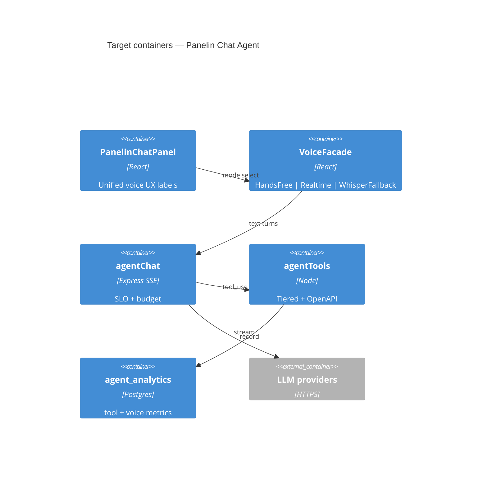
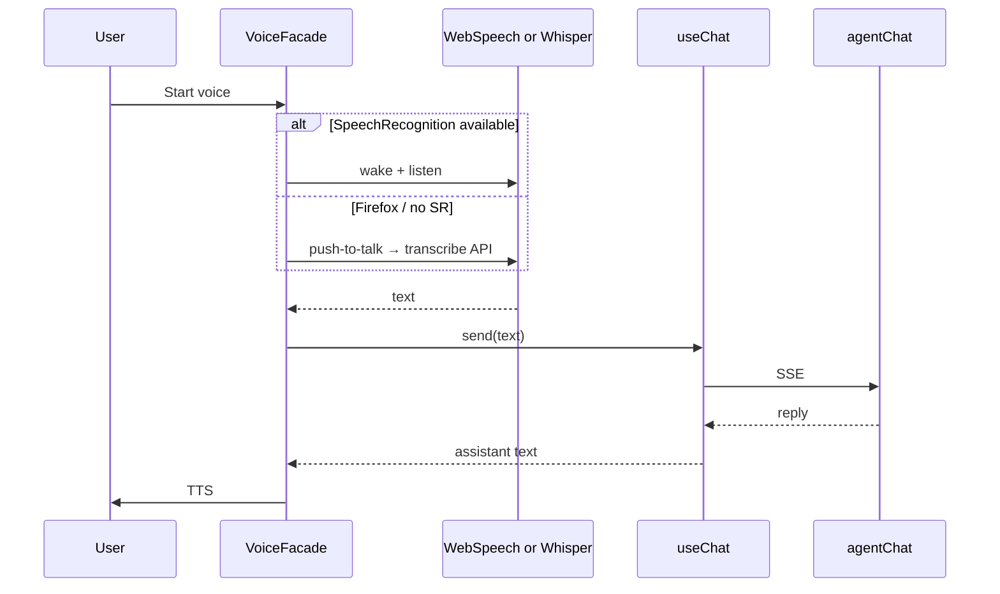

# System Design Document: Panelin Chat Agent — Target State (vNext)

> **Purpose:** North-star architecture to *finish building* the agent at expert level.  
> Does **not** claim undeployed APIs are live. Gaps vs as-built are marked **TARGET**.

## 1. Introduction & Goals

### 1.1 Problem Statement

Operators need Panelin to feel like a senior comercial: fluent Spanish, grounded prices, safe writes, voice that works on Safari/Chrome/Edge, and measurable quality — with docs and harness that keep agents from regressing.

### 1.2 Goals (SMART)

- **G1**: p95 first SSE token &lt; 2.5s on healthy primary provider (TARGET measure via costTelemetry).
- **G2**: Hands-free voice success rate ≥95% on Safari+Chrome (wake→reply); Firefox Whisper fallback (TARGET).
- **G3**: Zero silent price inventions — 100% quote numbers from calc tools / verified_quote.
- **G4**: Harness composite ≥90 sustained; goldens required on release (as-built already).
- **G5**: Single canonical SDD + SEC linked from AGENTS.md (this bundle).

### 1.3 Stakeholders

Same as as-built SDD §1.3, plus **Harness Control** owner for eval gates.

## 2. Context & Scope (C4 L1)

Same actors as as-built. **TARGET** additions:

| Interface | Direction | Notes |
|-----------|-----------|-------|
| Whisper STT fallback | → OpenAI | Firefox / no-SR browsers for Hands-free |
| Persistent tool analytics | → Postgres | Replace cold-start ring buffer |
| Voice quality metrics | → pino/metrics | Wake miss, barge-in, TTS errors |

## 3. Constraints

Inherit as-built. Add:

- **No** `npm audit fix --force` without approval.
- Voice product copy must match code path (Hands-free ≠ Realtime) — enforced in SEC + UI review.
- Human gates never removed to green smokes.

## 4. Solution Strategy (improved)

| Pillar | As-built | Target |
|--------|----------|--------|
| Chat | Multi-provider SSE | Same + explicit SLO dashboards |
| Tools | 48 tools + confirm | Capability tiers (quote / CRM / admin) + OpenAPI export |
| Voice | Dual path | Hands-free default; Realtime premium; Whisper fallback |
| RAG | quote_embeddings | + training KB hybrid retrieve ranking |
| Quality | 15 goldens | Expand to channel-specific packs (WA/ML/email) |
| Docs | Fragmented → this SDD | AGENTS.md pointer + SEC sync |

## 5. Container View (C4 L2)

As-built containers remain. **TARGET** new/changed:

## 6. AI Architecture — Component View (target)

| Component | Target enhancement |
|-----------|-------------------|
| Orchestrator | Emit `provider_used` + latency_ms on `done` event (client-visible) |
| Tool runtime | Export `/api/agent/tools-manifest` as OpenAPI 3.1 fragment |
| RAG | Hybrid: embeddings + KB keyword boost |
| VoiceFacade | Single UI entry; capability detect; no false Realtime Safari banner |
| WhisperFallback | When `!isHandsFreeSupported()`, push-to-talk → `/api/agent/transcribe` |
| Eval | Channel goldens + voice wake-word offline fixtures |
| Cost | Daily rollup query doc in OPS |

## 7. Data Flow (target Hands-free + Whisper)

## 8. Deployment View

| Gate | Target |
|------|--------|
| PR | `gate:local` + agent goldens |
| Prod | Deploy voice Hands-free Safari fix with SPA |
| Ops | Voice health empty errors[] weekly check |

## 9. Crosscutting (target)

- **Security:** Same + CSRF already on mutating routes elsewhere; keep voice mint rate-limited.
- **Reliability:** Circuit-break a provider after N 5xx (config flag).
- **Obs:** Persist toolStats samples; wake-word error counters.
- **Cost:** Budget soft on by default in staging; prod gradual.

## 10. ADRs (target)

### ADR-T01: VoiceFacade over dual UI labels

**Status**: Proposed  
**Decision**: One voice entrypoint; capability router chooses Hands-free / Realtime / Whisper.  
**Consequences**: + Clear UX; − Refactor PanelinVoicePanel.

### ADR-T02: Persist agent analytics

**Status**: Proposed  
**Decision**: Postgres table for tool latency/errors (not only memory).  
**Consequences**: + Ops history; − Migration + retention policy.

### ADR-T03: Expand goldens by channel

**Status**: Proposed  
**Decision**: Packs for `panelin_chat`, `whatsapp`, `mercado_libre`.  
**Consequences**: + Fewer channel regressions.

## 11. Risks & backlog (build-to-max)

| ID | Item | Priority | Owner | Status |
|----|------|----------|-------|--------|
| B-01 | Deploy Safari Hands-free fix to Vercel | P0 | deployment | **In progress** (PR → prod UAT) |
| B-02 | Fix wake-word onend loops (V3) | P1 | panelin-chat | **Done** 2026-07-18 — exponential backoff + max attempts in `useHandsFreeVoice` |
| B-03 | Whisper fallback for Firefox | P1 | panelin-chat | **Done** 2026-07-18 — push-to-talk via `/api/agent/transcribe` in `PanelinVoicePanel` |
| B-04 | OpenAPI tools export | P2 | api-contract | **Deferred** 2026-07-18 — after P0 prod green |
| B-05 | Persist toolStats | P2 | platform | **Deferred** 2026-07-18 — after P0 prod green |
| B-06 | Provider circuit breaker | P2 | agentCore | **Deferred** 2026-07-18 — after P0 prod green |
| B-07 | Channel golden packs | P1 | harness | **Done** 2026-07-18 — cases 16–19 (+ existing 05/12) for chat/WA/ML/email |

## 12. Glossary

Inherits as-built glossary. Add:

| Term | Meaning |
|------|---------|
| VoiceFacade | TARGET unified voice capability router |
| WhisperFallback | STT via `/api/agent/transcribe` when no Web Speech |
| Target State SDD | This document — north star vs as-built |

---

## Build sequence (finish to max)

1. **Ship** as-built voice gate fix (B-01).
2. **Stabilize** Hands-free loops (B-02).
3. **Firefox** Whisper path (B-03).
4. **Harness** channel goldens (B-07).
5. **Platform** analytics + OpenAPI (B-04/05).
6. Keep `SDD.md` (as-built) and this file in sync every release.
