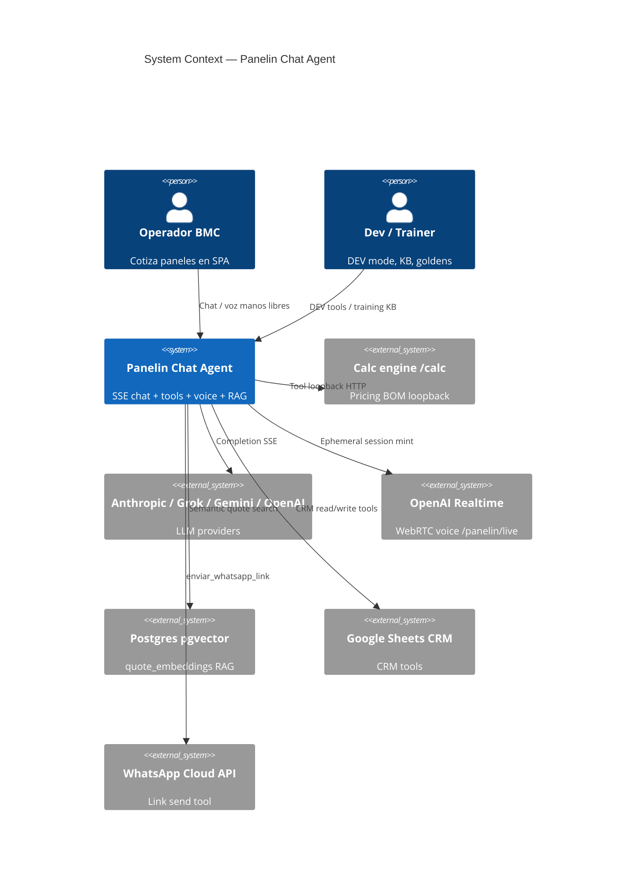
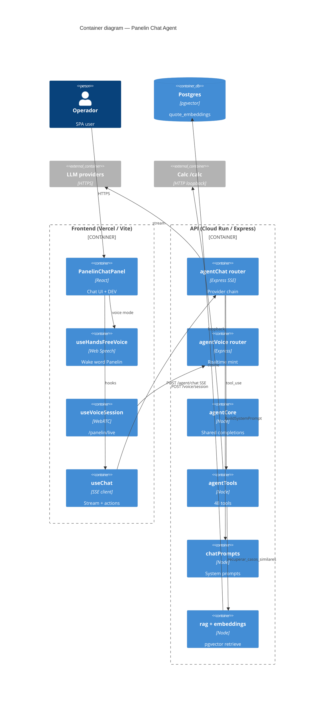
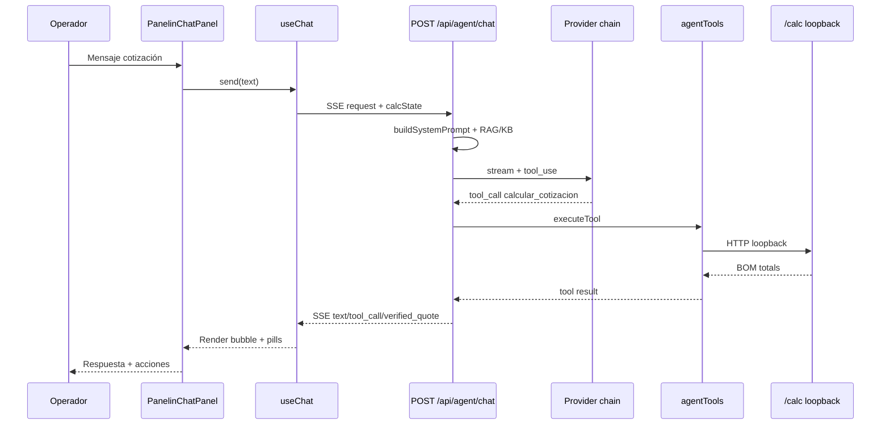

# System Design Document: Panelin Chat Agent

> Bounded as-built of the **AI agent surface** inside Calculadora BMC (not the full monorepo).  
> Evidence tags: **CONFIRMED** | **INFERRED** | **UNKNOWN**.

## 1. Introduction & Goals

### 1.1 Problem Statement

BMC Uruguay operators need a Spanish-first assistant that can quote insulation panels (USD), drive calculator state, consult CRM/Sheets, and optionally speak — without inventing prices or bypassing human confirmation on writes. Panelin Chat Agent is the in-app + multi-channel brain for that job.

### 1.2 Goals

- **G1**: Stream reliable quote assistance via SSE with tool-grounded calc totals (priority: high).
- **G2**: Multi-provider failover so a single LLM outage does not kill chat (priority: high).
- **G3**: Dual voice paths — free Hands-free (Web Speech) in chat; Realtime WebRTC on `/panelin/live` (priority: medium).
- **G4**: Human gates on CRM/WA write tools; never expose long-lived OpenAI keys to the browser (priority: high).
- **G5**: Measurable quality via `test:agent`, goldens, `eval:agent`, cost telemetry (priority: medium).

### 1.3 Stakeholders

| Role | Team | Interest |
|------|------|----------|
| Operator / comercial | BMC | Cotizaciones rápidas, tono ES-UY |
| Engineering | Panelin | SSE contracts, provider chain, voice |
| Security / ops | BMC | Secrets, rate limits, voice health |
| Training | Panelin Gym | KB corrections, goldens |
| AI coding agents | Cursor/Claude | Recreation-grade SDD |

## 2. Context & Scope (C4 Level 1)

### External interfaces

| Interface | Direction | Protocol | Description |
|-----------|-----------|----------|-------------|
| LLM APIs | → | HTTPS | Claude/Grok/Gemini/OpenAI chat |
| OpenAI Realtime mint | → | HTTPS | Ephemeral `client_secret` |
| OpenAI Realtime media | Browser ↔ | WebRTC | `/panelin/live` only |
| `/calc/*` | → | HTTP loopback | Cotización tools |
| Postgres | ↔ | SQL/pgvector | RAG |
| Sheets | → | HTTPS | CRM tools → **503** if down |
| WhatsApp | → | HTTPS | Optional send link |

**CONFIRMED:** mounts `server/index.js:1045-1049`; provider comment `agentChat.js:4`.

## 3. Constraints

- **Stack lock:** Node 24.x, ES modules only, Express 5 API, React 18 + Vite 7 SPA — `package.json` / CLAUDE.md.
- **Money:** List prices USD without IVA; IVA 22% once at total — project pricing rules.
- **Sheets errors:** 503 unavailable; never 500 for Sheets-down — project convention.
- **Secrets:** Doppler / GSM; never commit `.env` values — PANELIN-IA-OPS.
- **Browser:** Embedded voice needs Web Speech; Realtime needs Chrome/Edge — `voiceSupport.js`.
- **Human gates:** Write tools require confirmation (`requireConfirmedAction`) — `agentTools.js:1069`.
- **Budget soft:** Optional `BUDGET_*` caps — `config.js:126-130`.

## 4. Solution Strategy

- **Style:** Modular monolith — agent routes + libs inside `panelin-calc` API; SPA consumes SSE.
- **AI strategy:** Provider chain with auto failover; tools for ground truth; RAG for similar quotes; training KB for corrections.
- **Voice strategy:** Hands-free Web Speech in embedded chat (cost-free); OpenAI Realtime only on dedicated live page (CONFIRMED dual-path; Safari false-gate fixed 2026-07-18).
- **Trade-offs:** In-memory toolStats/voice errors lost on cold start; Realtime cost vs Hands-free quality; multi-provider complexity vs resilience.

## 5. Container View (C4 Level 2)

## 6. AI Architecture — Component View

| Component | Responsibility | Technology | Evidence |
|-----------|----------------|------------|----------|
| **Orchestrator (SSE)** | Stream turns, tool loop, failover | `agentChat.js` | CONFIRMED |
| **Shared brain** | Non-SSE callers (WA, etc.) | `agentCore.js` | CONFIRMED |
| **LLM Gateway** | Provider order + model resolve | chain in `agentChat.js:990+` | CONFIRMED |
| **Tool runtime** | 48 tools, confirm writes | `agentTools.js` | CONFIRMED count 48 |
| **Prompt registry** | System + voice compact | `chatPrompts.js` | CONFIRMED |
| **RAG** | Similar quotes | `rag.js` + pgvector | CONFIRMED |
| **Embeddings** | Provider-agnostic embed | `embeddings.js` | CONFIRMED |
| **Training KB** | Corrections / match | `agentTraining` routes + KB libs | CONFIRMED |
| **Cost telemetry** | Token/cost logs | `costTelemetry.js` via agentCore/aiCompletion | CONFIRMED |
| **Budget soft** | Turn/token caps | `budget.js` + config | CONFIRMED |
| **Hands-free voice** | Wake → STT → chat → TTS | `useHandsFreeVoice.js` | CONFIRMED |
| **Realtime voice** | WebRTC + function calls | `useVoiceSession.js` + `agentVoice.js` | CONFIRMED |
| **Guardrails** | Intent classifier, confirm writes, sanitize prompts | `userIntentClassifier`, `requireConfirmedAction`, `sanitizeForPrompt` | CONFIRMED |
| **Eval / goldens** | Offline quality — **15** cases | `tests/agentGolden/cases/*.json` · `evidence/goldens.md` | CONFIRMED |
| **Tool catalog** | 48 tools snapshot | `evidence/tools-manifest.md` | CONFIRMED |

### 6.1 LLM strategy

| Role | Default model env | Notes |
|------|-------------------|-------|
| Primary | `ANTHROPIC_CHAT_MODEL` → `claude-opus-4-7` | `config.js:122` |
| Fallbacks | Grok / Gemini / OpenAI | chain |
| Vision | Gemini preferred | `agentChat.js` vision path |
| Realtime | `OPENAI_REALTIME_MODEL` → `gpt-4o-realtime-preview` | `config.js:120` |

### 6.2 Cost model (as-built)

- Soft budgets optional (`BUDGET_ENABLED` default false).
- `costTelemetry` logs structured costs; Omni has separate daily USD budget env.
- Exact $/day: **UNKNOWN** without prod telemetry export this session.

## 7. Data Flow

### Primary: text quote turn

### Voice Hands-free (embedded)

Operador → mic → wake "Panelin" → SpeechRecognition → `send(text)` → same SSE → `speechSynthesis` TTS.  
**CONFIRMED:** `useHandsFreeVoice.js`; gate `isHandsFreeSupported()` in `voiceSupport.js`.

### Voice Realtime (`/panelin/live`)

UI → `POST /api/agent/voice/session` → ephemeral secret → WebRTC to OpenAI → function calls → `POST /voice/action`. Safari blocked for this path only.

## 8. Deployment View

| Environment | Frontend | API | Secrets |
|-------------|----------|-----|---------|
| Local | Vite `:5173` | Express `:3001` | `.env` / Doppler |
| Production | Vercel | Cloud Run `panelin-calc` | GSM / Doppler `prd` |
| CI | GitHub Actions | lint/test/build/smoke | workflow secrets |

**CONFIRMED:** CLAUDE.md deploy section; `PANELIN-IA-OPS.md` secret table.  
**Pre-release agent gate:** `npm run pre-release` includes goldens with `GOLDEN_REQUIRED=1` — `package.json`.

## 9. Crosscutting Concepts

### 9.1 Security

- JWT / grants for admin & voice health — `requireAuth` on voice errors/health.
- Ephemeral Realtime tokens — `agentVoice.js:5-6`.
- Rate limits (**CONFIRMED** `agentChat.js:400-412`):
  - Public chat: **10 req / 60s** (`publicLimiter`)
  - Dev mode: **30 req / 60s**
  - Related exec limiter window also 60s (see file for `max`)
- Write tool confirmation — `requireConfirmedAction`.
- No long-lived OpenAI key in browser.
- System prompts live in `server/lib/chatPrompts.js` (file-versioned via git; review in PR).

### 9.2 Reliability

- Provider failover loop — `agentChat.js:1025`.
- Client timeout 120s / 70s with capture — `useChat.js`.
- Sheets 503 convention.
- Soft budget optional.

### 9.3 Performance

- SSE streaming first tokens.
- Token budget estimator — `tokenEstimator` / `CHAT_MAX_TOKENS`.
- Voice Hands-free avoids Realtime $ cost.

### 9.4 Observability

- pino logs; toolStats ring; voiceErrorLog; costTelemetry; optional conversation files.
- Cold-start resets in-memory stats — documented PANELIN-IA-OPS.

### 9.5 Cost & sustainability

- Prefer Hands-free vs Realtime; Gemini for vision when Claude credits empty (PROJECT-STATE 2026-07-18).
- Model tiering via chain.

## 10. Architecture Decisions (ADRs)

### ADR-001: Multi-provider SSE chain

**Status**: Observed  
**Context**: Single-provider outages block comercial chat.  
**Decision**: Auto chain claude → grok → gemini → openai with optional sticky `aiProvider`.  
**Consequences**: + Resilience; − Latency/complexity on failover.  
**Alternatives**: Single provider — rejected for ops risk.

### ADR-002: Tools + calc loopback for price truth

**Status**: Observed  
**Context**: LLMs invent panel prices.  
**Decision**: Tools call `/calc` loopback; verified_quote events for trust UI.  
**Consequences**: + Grounded quotes; − Requires API+calc colocated.  

### ADR-003: Dual voice paths

**Status**: Observed (updated 2026-07-18)  
**Context**: Realtime costly/broken historically; Safari WebRTC weak.  
**Decision**: Hands-free Web Speech in embedded chat; Realtime only `/panelin/live`; gate Safari only on Realtime.  
**Consequences**: + Safari works for Hands-free; − Two codepaths to maintain.  
**Evidence:** `voiceSupport.js`, commit 77e13e5b history, SEC draft.

### ADR-004: Confirm before CRM/WA writes

**Status**: Observed  
**Context**: Accidental CRM pollution.  
**Decision**: `requireConfirmedAction` + intent classifier.  
**Consequences**: + Safety; − Extra UX friction.

### ADR-005: pgvector RAG for similar quotes

**Status**: Observed  
**Context**: Operators want historical analogs.  
**Decision**: `quote_embeddings` cosine search via `rag.js`.  
**Consequences**: + Retrieval; − Needs DATABASE_URL + embeddings keys.

## 11. Risks & Technical Debt

| Risk | Impact | Likelihood | Mitigation |
|------|--------|------------|------------|
| Provider credit/quota exhaustion | High | Medium | Failover + Gemini vision path |
| Wake-word restart loops (V3) | Medium | Medium | Tune Hands-free onend; see SDD-TARGET B-02 |
| In-memory stats lost on cold start | Low | High | Persist analytics (TARGET ADR-T02) |
| Prod SPA lagging local voice Hands-free Safari fix | High | High until deploy | Ship PR (TARGET B-01) |
| Firefox no Web Speech | Medium | High | Whisper fallback (TARGET B-03) |
| Tool surface sprawl (48 tools) | Medium | High | Manifest + OpenAPI export |

## 12. Glossary

| Term | Meaning |
|------|---------|
| Panelin | BMC AI assistant persona / UI |
| SSE | Server-Sent Events chat stream |
| Hands-free | Web Speech wake-word voice in chat |
| Realtime | OpenAI WebRTC voice on `/panelin/live` |
| Loopback calc | HTTP to local `/calc` from tools |
| verified_quote | Trust UI payload from calc tool |
| Training KB | Operator-corrected knowledge entries |
| surface | Channel id (`panelin_chat`, `whatsapp`, …) |
| SEC | Software Engineering Complete draft doc |

---

## Appendix A — Evidence Index

- `evidence/inventory.md`, `surfaces.md`, `data-model.md`
- `KB/integrations.md`
- Prior draft: `docs/team/PANELIN-CHAT-AGENT-SEC.md`
- Ops: `docs/team/runbooks/PANELIN-IA-OPS.md`

## Appendix B — Recreation Checklist

See `RECREATION-CHECKLIST.md`.
