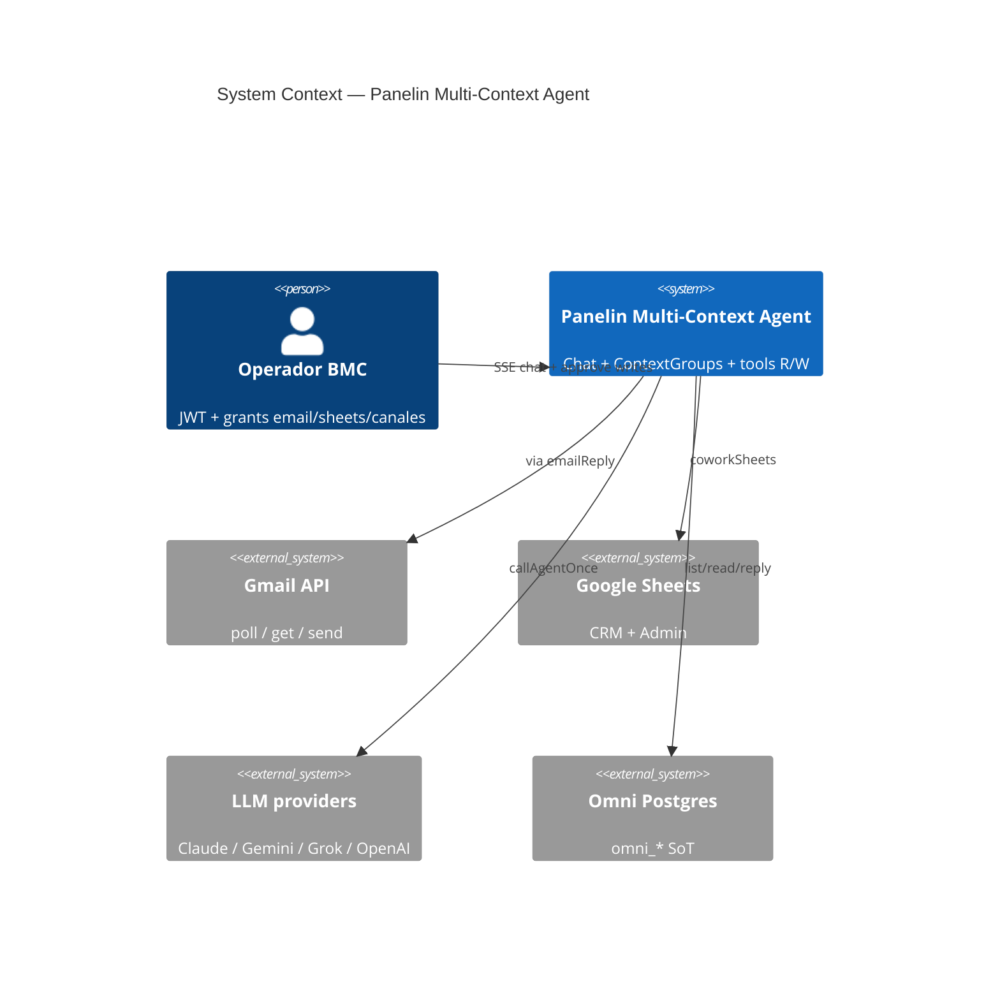
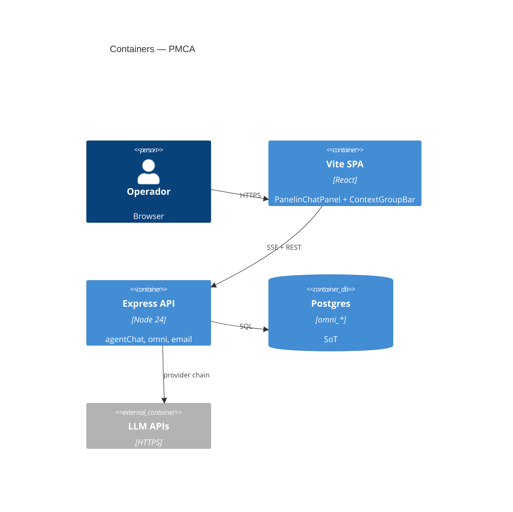

# System Design Document: Panelin Multi-Context Agent (PMCA)

> Capability slice of Panelin Chat Agent: shared multi-tab workspace + agentic email/Admin R/W.  
> Companion: [`../panelin-chat-agent/SDD.md`](../panelin-chat-agent/SDD.md). Blueprint: [`../../team/INBOX-AI-FIRST-BLUEPRINT.md`](../../team/INBOX-AI-FIRST-BLUEPRINT.md).  
> Evidence tags: **CONFIRMED** | **INFERRED** | **UNKNOWN**.

## 1. Introduction & Goals

### 1.1 Problem Statement

BMC operators juggle email, Admin sheets, and the calculator in parallel. Panelin previously saw a single surface/OCR stream and could only draft email (no Omni list/read/send from chat). They need one agent session that shares context across in-app tabs and can read/write with human gates.

### 1.2 Goals

- **G1**: SharedWorkspace per ContextGroup — agent acts on any pinned tab without tab-switch (high).
- **G2**: Email tools — list/read/classify/draft/send (send HITL) via Omni/Gmail API (high).
- **G3**: Detect `consulta_cliente` / `alerta_admin` and route to Admin/CRM paths (medium).
- **G4**: Accessible tablist (keyboard + ARIA) in Panelin chat chrome (medium).
- **G5**: SDD recreation-ready ≥90; no second brain fork (high).

### 1.3 Stakeholders

| Role | Team | Interest |
|------|------|----------|
| Operador | BMC Admin | Email + Admin + calc in one chat |
| Engineering | Panelin | Tools, SSE, a11y strip |
| Security | BMC | JWT/grants, no autonomous send |
| AI agents | Cursor | This SDD + TARGET.md |

## 2. Context & Scope (C4 Level 1)



### External interfaces

| Interface | Direction | Protocol | Description |
|-----------|-----------|----------|-------------|
| `/api/agent/chat` | ← | SSE | Chat + tools |
| `/api/omni/conversations*` | → | HTTPS | List/read/reply email threads |
| `/api/email/*` | → | HTTPS | PANELSIM summary + draft-outbound |
| Gmail API / SMTP | → | HTTPS | Outbound after HITL |
| Sheets | → | HTTPS | Admin/CRM tools |

**CONFIRMED:** EMAIL-SOURCE-MAP; omni routes; agentTools email_* + PMCA tools.

## 3. Constraints

- Node 24, ES modules, Express 5 + Vite React SPA.
- Human gate on every outbound email; never invent send success.
- SoT: Postgres `omni_*`; Sheets = mirror (**CONFIRMED** blueprint).
- No Gmail DOM / Gemini sidebar automation.
- Secrets only via Doppler/env; never log PII bodies/tokens.
- Chatwoot Email Agent remains a separate surface (not runtime-merged).

## 4. Solution Strategy

- **Style:** Capability slice on modular monolith (calculadora-bmc).
- **AI:** ReAct tool-calling via existing `agentCore`; Gemini preferred for cheap classify/summarize.
- **UX:** In-app ContextGroups (Claude metaphor) — not browser extension.
- **Trade-off:** Heuristic `email_clasificar_mensaje` first (sync, cheap); Omni async orchestrator remains flag-gated for backlog depth.

## 5. Container View (C4 Level 2)



## 6. AI Architecture — Component View

| Component | Responsibility | Tech |
|-----------|----------------|------|
| ContextGroupController | Groups/tabs persist | `useContextGroups.js` |
| SharedWorkspace bundler | OC.workspace → prompt | `sharedWorkspace.js` + `coworkFrames` |
| agentCore | LLM + tool loop | existing |
| ToolRouter | email_*/sheets_*/calc | `agentTools.js` |
| WriteGate | Intent classifier + user_confirmed | `userIntentClassifier.js` |
| Classify heuristic | consulta_cliente / alerta_admin | `classifyEmailSignal` |
| OmniOrchestrator | Async classify/suggest (flag) | existing, optional |

### 6.1 LLM strategy

Primary chain unchanged (claude→grok→gemini→openai). Vision/Co-Work prefers Gemini. Classify tool is deterministic heuristic (no LLM) for cost/latency; operator can ask LLM to refine.

### 6.2 Cost

Heuristic classify ≈ $0. Omni suggest jobs budget-capped when enabled. Draft/summary reuse existing email cockpit routes.

## 7. Data Flow

```mermaid
sequenceDiagram
  participant Op as Operador
  participant UI as ContextGroupBar
  participant Chat as useChat
  participant AC as agentCore
  participant Tools as agentTools
  participant Omni as omni API

  Op->>UI: Focus any tab; ask across workspace
  UI->>Chat: messages + operatorContext.workspace
  Chat->>AC: callAgentOnce
  AC->>Tools: email_listar_hilos / email_leer_hilo
  Tools->>Omni: GET conversations/messages
  Tools-->>AC: facts
  AC-->>Op: draft or propose send
  Op->>Chat: confirm phrase
  Chat->>Tools: email_enviar user_confirmed
  Tools->>Omni: POST reply
```

## 8. Deployment View

- Frontend: Vercel `calculadora-bmc.vercel.app`.
- API: Cloud Run `panelin-calc`.
- Flags: `VITE_OMNI_INBOX`, `OMNI_AI_ORCHESTRATOR_ENABLED`, `EMAIL_INGEST_TOKEN`, JWT grants `canales`.
- CI: `gate:local`, smoke prod. Secrets: Doppler `prd` names only in this doc.

## 9. Crosscutting Concepts

| Concern | Approach |
|---------|----------|
| Security | JWT + requireGrant; send intent-gated; no DOM Gmail |
| Reliability | Omni 404 if DB down; Sheets 503 contract; failover LLM |
| Performance | Cap workspace tabs ≤12; truncate summaries |
| Observability | pino + toolStats; SSE tool_call events |
| Cost | Heuristic classify; Gemini cheap path for vision |
| Sustainability | Prefer API over screenshot OCR loops |
| Accessibility | tablist/tab ARIA; arrow keys; focus restore |

## 10. Architecture Decisions (ADRs)

### ADR-PMCA-001: SharedWorkspace per ContextGroup

**Status**: Accepted  
**Context**: Operators switch surfaces constantly; per-tab agent memory causes amnesia.  
**Decision**: One SharedWorkspace + one chat history per group; tools may use any tab ref.  
**Consequences**: + Cross-tab tasks; − Larger prompt; mitigated by truncation.  
**Alternatives**: Per-tab sessions (rejected).

### ADR-PMCA-002: Email tools in agentTools; Chatwoot separate

**Status**: Accepted  
**Context**: `emailAgentTools.js` is Chatwoot-bound; Panelin needs Omni/PANELSIM.  
**Decision**: Add Omni-backed tools to `agentTools.js`; do not naive-merge Chatwoot runtime.  
**Consequences**: + Clear surfaces; − Some duplicate draft concepts.  
**Alternatives**: Full merge (rejected as high risk).

### ADR-PMCA-003: Human gate on send/commit

**Status**: Accepted  
**Context**: Autonomous send is forbidden by company invariants.  
**Decision**: `email_enviar` requires intent phrases + grant; transport via Omni reply.  
**Consequences**: + Safety; − Extra confirm turn.

### ADR-PMCA-004: omni_* SoT; Sheets mirror

**Status**: Accepted (from blueprint)  
**Context**: Dual-write opacity caused drift.  
**Decision**: Operational reads/writes prefer Omni; Sheets via existing CRM/Admin tools.

### ADR-PMCA-005: Accessible in-app tab strip

**Status**: Accepted  
**Context**: Multi-tab must be keyboard usable.  
**Decision**: `role=tablist` + arrow navigation in `ContextGroupBar`.

## 11. Risks & Technical Debt

| Risk | Impact | Likelihood | Mitigation |
|------|--------|------------|------------|
| Omni DB / grant missing → tools 401/503 | Medium | Medium | Honest errors; ask login |
| Heuristic misclassify | Medium | Medium | Low confidence; human confirm before Admin write |
| Prompt bloat from many tabs | Low | Medium | Cap 12 tabs; short summaries |
| Chatwoot / Panelin tool confusion | Medium | Low | Prompts name surfaces explicitly |
| Send without Gmail OAuth | High | Medium | Tool returns not_configured; never fake sent |

## 12. Glossary

| Term | Meaning |
|------|---------|
| PMCA | Panelin Multi-Context Agent |
| ContextGroup | Named set of tabs + one chat history |
| SharedWorkspace | Snapshot of all tabs in the active group |
| Focus tab | UI/OCR priority; not tool isolation |
| HITL | Human-in-the-loop confirmation |
| Omni | Postgres-backed unified inbox (`omni_*`) |
| PANELSIM | Email ops / IMAP summary path |

## Appendix A — Evidence Index

See [`evidence/inventory.md`](./evidence/inventory.md).

## Appendix B — Recreation Checklist

1. Ship `sharedWorkspace.js` + ContextGroup UI + OC.workspace bundling.  
2. Register email_listar/leer/clasificar/enviar in agentTools + AUTH allowlist + intent patterns.  
3. Update chatPrompts shared-workspace rules.  
4. `npm run gate:local`; UAT with JWT.  
5. Score SDD ≥90.
