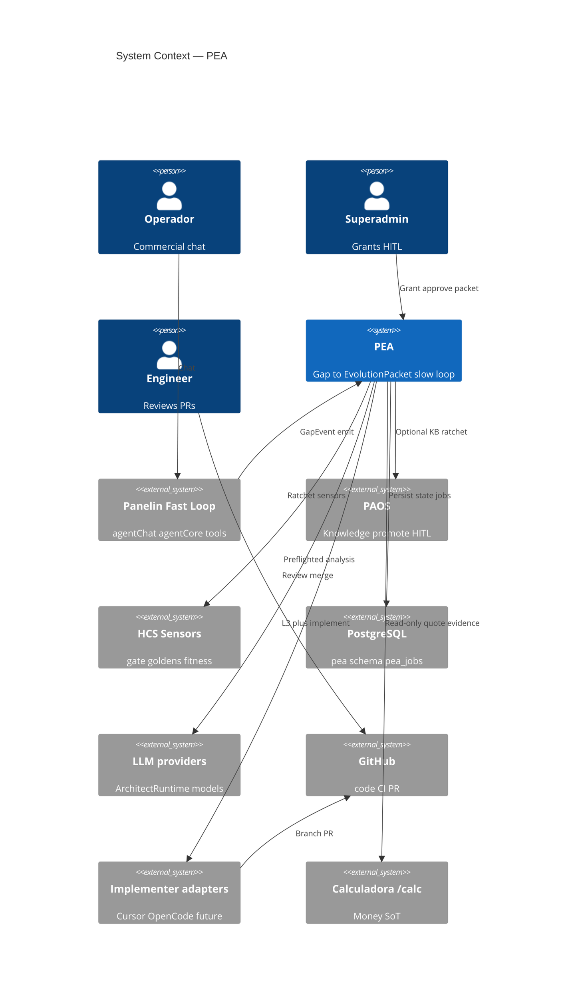
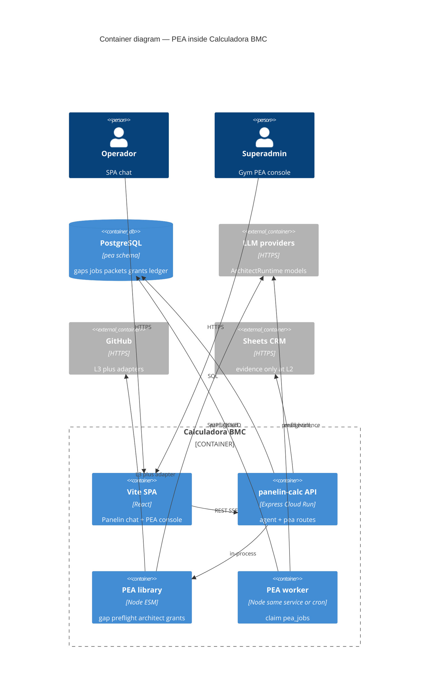
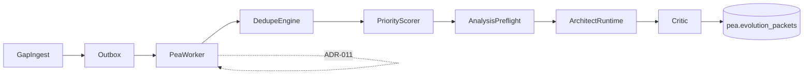
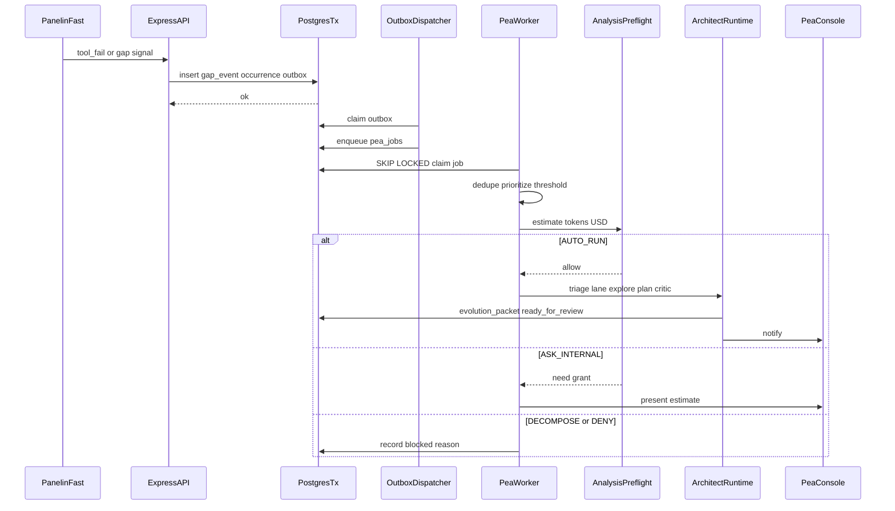

# System Design Document: Panelin Evolution Architect (PEA)

> **PEA** = private evolution brain beside Panelin ops.  
> Tags: **CONFIRMED** (repo evidence) | **TARGET** (this Spec) | **INFERRED** | **UNKNOWN** (live console).  
> Parent: [`../panelin-ai-agent-platform/SDD.md`](../panelin-ai-agent-platform/SDD.md).  
> Sibling (knowledge loop): [`../paos/SDD.md`](../paos/SDD.md) — **do not merge promote semantics**.  
> HCS flywheel: [`../../team/harness/`](../../team/harness/) · [`../../team/SDD-HARNESS-ENGINEERING.md`](../../team/SDD-HARNESS-ENGINEERING.md).  
> Build path: [`SDD-TARGET.md`](SDD-TARGET.md) · [`IMPLEMENTATION-GUIDE.md`](IMPLEMENTATION-GUIDE.md).

**Vocabulary:** One **`ArchitectRuntime`** owns triage→explore→plan→critic (models = phase config; tools = allowlist by autonomy). OpenCode/Cursor are optional **implementer adapters** at L3+ — not “the model” and not a parallel ExecutionRunner service. “Free training” = interaction + replay + datasets + eval — **not** weight fine-tuning (PAOS ADR-001 remains).

### Development contract (binding)

| Rule | Requirement |
|------|-------------|
| Dual-loop | Fast Panelin never mutates org KB or opens PRs mid-turn |
| Autonomy | Default max **L2**; L3–L5 require durable grant (DB), never chat-only |
| Preflight | No model call without **AnalysisPreflight** pass |
| Budget | PEA budget **separate** from Panelin chat / Omni daily budget |
| Dedupe | normalize → fingerprint → aggregate → prioritize → estimate → authorize → analyze |
| Threshold | AUTO_RUN L1–L2 only if `occurrences >= N` (default 3) OR severity high OR human “diagnose now” |
| Lanes | Prefer **H harness → K knowledge (PAOS) → C code**; smallest durable fix first |
| Critic | Packet must pass Critic (Spec/golden citation, money provenance, ratchet) before `ready_for_review` |
| Persist | Canonical state in PostgreSQL `pea.*`; Git only for ADR/tests/approved artifacts |
| Queue | MVP = outbox + `pea_jobs` (SKIP LOCKED); not in-memory `eventBus` |
| AuthZ | Roles from JWT/DB only; undeclared tool/route = **deny**; no role-from-header |
| Staging | L3+ / write replay forbidden until isolated staging verified |
| Money | Architect must not invent prices; calc SoT remains `/calc` |
| Flags | `PEA_*=0` default preserves current prod |

---

## 1. Introduction & Goals

### 1.1 Problem Statement

Panelin is a mature multi-channel commercial agent (tools, SSE, multi-provider failover, PAOS knowledge promote, goldens, HCS sensors). Failures today surface as SSE noise, tool `{ok:false}`, hedges, and logs — **not** as durable, deduplicated **gaps** that drive architectural diagnosis and product evolution.

Operators and Matias need: when Panelin hits a gap, fail, missing capability, or new implementation need — the system **detects**, **investigates deeply** (code/SDD), **explains**, and **designs** a durable evolution; optionally (only with explicit grant) the same **ArchitectRuntime** loads an implementer adapter (native → Cursor → OpenCode later) for branch/PR/review/merge. Without this, failures do not ratchet into permanent sensors/goldens/code.

### 1.2 Goals

| ID | Goal | Priority | Status |
|----|------|----------|--------|
| G1 | Structured GapEvents with mass dedupe + impact count | High | TARGET |
| G2 | AnalysisPreflight: tokens + USD + concurrency before any LLM | High | TARGET |
| G3 | ArchitectRuntime phase models `pea:triage\|explore\|plan\|critic` with fallback + pricing required | High | TARGET |
| G4 | Architect L1–L2 explore→plan → versioned EvolutionPacket | High | TARGET |
| G5 | Explicit autonomy ladder L0–L5 with durable grants | High | TARGET |
| G6 | Panelin can narrate gaps (`pea_explain_gap`) without blocking commerce | Medium | TARGET |
| G7 | PostgreSQL `pea.*` + outbox + `pea_jobs` durable queue | High | TARGET |
| G8 | SideEffectRegistry + Principal authorize() fail-closed (shared platform) | High | TARGET |
| G9 | Staging topology verified before L3+ | High | TARGET |
| G10 | Ratchet on accept: golden/sensor/provenance/KB as applicable | High | TARGET |
| G11 | Implementer adapters pluggable (manual → native → Cursor → OpenCode) behind ArchitectRuntime | Medium | TARGET (phased) |
| G12 | Spec-driven build via this SDD + IMP guide | High | Accepted Spec |

### 1.3 Stakeholders

| Role | Team | Interest |
|------|------|----------|
| Operador BMC | Comercial | Understand why Panelin failed; keep quoting |
| Superadmin / Matias | BMC | Approve grants L3–L5; review packets |
| Engineering | Panelin | Implement PEA modules; keep gates green |
| Security / ops | BMC | AuthZ rewrite; cost caps; no prod writes from PEA |
| Coding agents | Cursor/Claude/OpenCode | Consume Spec + EvolutionPacket as job brief |

---

## 2. Context & Scope (C4 Level 1)



### External interfaces

| Interface | Direction | Protocol | Description |
|-----------|-----------|----------|-------------|
| Panelin Fast Loop | ← GapEvent | in-process / outbox | Emit on tool/provider/calc/feedback signals |
| PostgreSQL | ↔ | SQL | `pea.*`, `pea_jobs`, budget ledger |
| LLM APIs | → | HTTPS | Phases via ArchitectRuntime model config |
| PEA HTTP API | ← | HTTPS REST | Gaps, diagnose, packets, grants (auth) |
| GitHub | → | HTTPS (L3+) | Branch/PR via implementer adapter |
| PAOS | → | Internal | Optional Learning Candidate if knowledge-shaped |
| HCS / CI | → | npm/gh | Ratchet verification |
| `/calc` | → | HTTP loopback | Evidence only; never price invent |

### Out of scope (MVP)

- Fine-tuning / weight updates  
- OpenCode runtime on Cloud Run  
- Pub/Sub  
- Auto-merge without L5 grant  
- Using Vercel Preview as “staging” without isolated API/DB/connectors  

---

## 3. Constraints

| Type | Constraint | Evidence |
|------|------------|----------|
| Stack | Node 24 ESM; Express API on Cloud Run `panelin-calc`; Vite SPA on Vercel | CONFIRMED `package.json`, deploy workflows |
| Repo | Primary: `matiasportugau-ui/Calculadora-BMC` `main` | CONFIRMED |
| Persist hybrid today | Sheets + Postgres + GCS + local files + localStorage | CONFIRMED data model docs |
| Queue | In-memory `omni/eventBus` **unsuitable** for GapEvents; `omni_ai_jobs` SKIP LOCKED pattern **reusable** | CONFIRMED |
| Budget today | Soft chat budget in-memory, often OFF; tokenEstimator char-based; costTelemetry post-hoc | CONFIRMED `budget.js`, `tokenEstimator.js` |
| AuthZ risk | Shared service token + `X-Panelin-Role` / default director / undeclared allow | CONFIRMED audit (TARGET rewrite) |
| Staging | Single prod Cloud Run project path; Preview ≠ staging | CONFIRMED (treat absent) |
| PAOS | Dual-loop + no fine-tune ADRs remain | CONFIRMED |
| Cost | PEA must not consume Omni/Panelin daily budget | TARGET |
| Regulatory | Proprietary METALOG; no customer PII in EvolutionPackets without redaction | TARGET |

---

## 4. Solution Strategy

- **Style:** Modular monolith extension inside Calculadora (`server/lib/pea/`, `server/routes/pea/`, `server/migrations/pea/`) — same repo until ops force a split.  
- **Dual-loop:** Fast = Panelin commerce; Slow = PEA analysis/evolution (async via jobs).  
- **Module 0 locked (A′):** Two runtimes (Panelin + PEA); PEA is **not** always a coding agent — three evolution lanes (ADR-010).  
- **Module 1 locked (1a):** Single **ArchitectRuntime** (not ModelRouter≠ExecutionRunner).  

```text
ArchitectRuntime
├── config.models              # primary + fallbacks per phase
├── tools + permissions        # allowlist by L0–L5
├── laneRouter                 # H | K | C
└── adapters.implementer       # only grant ≥ L3
# EXPORT_SEAL: PEA_ARCHITECT_RUNTIME_V1
```

```text
                    ┌─ Lane H — Harness (prompts, tools, goldens, sensors)
 Gap / failure ──► PEA ─┼─ Lane K — Knowledge (bridge → PAOS candidate)
                    └─ Lane C — Code/product (packet → PR via runner)
# EXPORT_SEAL: PEA_EVOLUTION_LANES_V1
```

- **AI strategy:** Task-keyed models; cheap triage; stronger explore/plan; **Critic** before publish (ADR-009); pricing required or DENY_UNPRICED.  
- **Fix preference:** **H → K → C** (smallest durable fix first).  
- **Cost strategy:** Threshold gate then AnalysisPreflight (fallback sum + 20% safety).  
- **Queue strategy:** Transactional outbox → `pea_jobs` → worker SKIP LOCKED (no Pub/Sub until fan-out proven).  
- **Auth strategy:** Preserve OAuth/JWT/refresh; replace header-role / fail-open with Principal + `authorize()`.  
- **Trade-offs accepted:**  
  - + Safety, cost control, harness-first (Reflexloop/Prime-style), reuse of jobs/registry  
  - − More schema/API surface; lane misclassification risk  
  - − Staging build is a hard gate before coding autonomy (Lane C L3+)  

---

## 5. Container View (C4 Level 2)



### Code layout (TARGET)

```text
server/lib/pea/
  gapEvents.js
  gapFingerprint.js
  analysisPreflight.js
  architectRuntime.js      # unified loop
  laneRouter.js
  critic.js
  evolutionPackets.js
  grants.js
  budgetLedger.js
  outbox.js
  adapters/implementer.js  # L3+ only
server/routes/pea.js
server/migrations/pea/
docs/sdd/panelin-evolution-architect/
```

---

## 6. AI Architecture — Component View

### 6.0 C4Component — slow-loop pipeline

Machine contracts: [`contracts/schemas/`](contracts/schemas/) · [`contracts/openapi-pea.yaml`](contracts/openapi-pea.yaml) · [`server/migrations/pea/001_pea_core.sql`](../../server/migrations/pea/001_pea_core.sql).



| Component | Responsibility | Tech / notes |
|-----------|----------------|--------------|
| **GapIngest** | Normalize signals → GapEvent → outbox | From agentTools / agentChat / feedback |
| **DedupeEngine** | Fingerprint → `pea.gaps` + occurrences | Mass gap = 1 investigation |
| **PriorityScorer** | Impact × severity × recency | Before preflight |
| **EvidenceManifest** | Select logs, SDD slices, files, tests | Retrieval budgeted |
| **AnalysisPreflight** | Tokens/USD/concurrency/sensitivity gate | Mandatory |
| **ArchitectRuntime** | Unified triage→explore→plan→critic; phase model config | Core |
| **LaneRouter** | H / K / C preference | Inside runtime |
| **Architect explore** | Read-only tools: read_file, grep, read_sdd, list_tests | L1 |
| **Architect plan** | Causal analysis → EvolutionPacket | L2 |
| **Critic** | Spec/golden/ratchet gate before ready_for_review | Phase |
| **GrantStore** | Durable autonomy grants L0–L5 | DB, not chat |
| **Implementer adapters** | manual / native / Cursor / OpenCode | L3+ only |
| **RatchetApplier** | Golden/sensor/provenance checklist | On accept/merge |
| **Cost Ledger** | `pea.budget_ledger` reservations + settle | Persistent |
| **SideEffectRegistry** | Platform-wide tool risk (shared with Panelin) | Fail-closed |
| **Principal AuthZ** | `authorize(principal, action, resource)` | Fail-closed |

### 6.1 Autonomy ladder

| Level | Name | Actions | Default |
|-------|------|---------|---------|
| L0 | Observe | Emit/store GapEvent + occurrence | On (`PEA_ENABLED`) |
| L1 | Diagnose | Explore read-only | Auto if preflight AUTO_RUN |
| L2 | Design | EvolutionPacket | Auto if preflight AUTO_RUN |
| L3 | Draft | Branch + draft PR / goal-prompt | Explicit grant |
| L4 | Iterate | Review fixes on that PR | Explicit grant |
| L5 | Merge | Merge after gates | Explicit grant + money/CRM checkbox if needed |

Grant record: `{ maxLevel, scope, expiresAt, grantedBy, gapIds?, packetId? }`. JSON Schema: [`contracts/schemas/grant.schema.json`](contracts/schemas/grant.schema.json). Missing ⇒ hard stop at L2.

### 6.2 ArchitectRuntime — model config

- Phase keys: `pea:triage`, `pea:explore`, `pea:plan`, `pea:critic` (extend Omni registry pattern).  
- Each phase: primary + ordered fallbacks; pricing required or DENY_UNPRICED.  
- Free/local models allowed for triage when registered.  
- Max **3** model calls / iteration; max **2** paid attempts / iteration (env-tunable; Critic counts).  
- Contract: [`contracts/architect-runtime.md`](contracts/architect-runtime.md).

### 6.3 AnalysisPreflight & budget policy

**Seal:** `PEA_ANALYSIS_BUDGET_POLICY_V1` — see [`contracts/analysis-budget-policy.md`](contracts/analysis-budget-policy.md).

| Verdict | Aggregate tokens / iteration | Reserved USD | Behavior |
|---------|------------------------------|--------------|----------|
| AUTO_RUN | ≤ 32_000 | ≤ 0.50 | Investigate + propose |
| ASK_INTERNAL | 32_001–96_000 | 0.51–2.50 | Show estimate; await authorization |
| DECOMPOSE | > 96_000 | > 2.50 | Do not run; split analysis |
| DENY_UNPRICED | any | unknown price | No autorun |

Pilot caps (env):

```text
PEA_AUTO_MAX_TOTAL_TOKENS=32000
PEA_APPROVAL_MAX_TOTAL_TOKENS=96000
PEA_MAX_OUTPUT_TOKENS_PER_CALL=6000
PEA_AUTO_MAX_COST_USD=0.50
PEA_APPROVED_MAX_COST_USD=2.50
PEA_AUTO_DAILY_BUDGET_USD=10.00
PEA_AUTO_MAX_DISTINCT_GAPS_PER_DAY=20
PEA_MAX_MODEL_CALLS_PER_ITERATION=3
PEA_MAX_PAID_ATTEMPTS_PER_ITERATION=2
PEA_MAX_CONCURRENCY=2
PEA_ESTIMATE_SAFETY_FACTOR=1.20
PEA_FALLBACK_RESERVATION_MODE=sum
PEA_REQUIRE_MODEL_PRICING=true
```

Preflight **must** estimate: system prompt, GapEvent, selected logs, retrieved files/SDD/tests, tool schemas, max output, planned tool rounds, retries, **entire fallback chain**, safety margin. Reservation = potential automatic chain cost, not primary-only.

Recalibrate after ~100 real investigations (p50/p90/p95 tokens, cost, quality).

### 6.4 Mass gap dedupe

```text
10_000 occurrences same failure
  → 1 aggregated gap
  → 1 investigation
  → impact = 10_000
# EXPORT_SEAL: PEA_MASS_GAP_DEDUPE_V1
```

Order: **normalize → fingerprint → dedupe → prioritize → threshold → estimate → authorize → analyze**. Never: event → model → then dedupe.

### 6.4b Threshold gate (before AUTO_RUN spend)

AUTO_RUN for L1–L2 only if **any** of:

| Condition | Default |
|-----------|---------|
| `occurrences >= N` | N = 3 (`PEA_AUTO_MIN_OCCURRENCES`) |
| `severity >= high` | config |
| Human “diagnose now” | explicit API/UI |

Otherwise: keep aggregating; no ArchitectRuntime model spend.

### 6.4c Evolution lanes (A′)

| Lane | Target artifacts | Default autonomy | Hand-off |
|------|------------------|------------------|----------|
| **H Harness** | prompts, tool schemas, goldens, HCS sensors, RULE-PROVENANCE | L2 design; L3 PR on harness paths with grant | Prefer first |
| **K Knowledge** | Training KB via PAOS candidate SM | Create PAOS candidate draft; no code PR | When org Q&A tip |
| **C Code** | product/server/src changes | L2 packet; L3–L5 with grant + staging | Last resort |

LaneRouter runs at triage (cheap model or rules). Packet field `primary_lane` + optional `secondary_lanes[]`. Spec-anchored: every packet cites ≥1 SDD section / TARGET id / golden id / fitness sensor / tool_id.

### 6.4d Critic (before `ready_for_review`)

```text
explore → plan → Critic(packet, evidence, goldens/SDD)
                 ├─ pass → ready_for_review
                 └─ fail → revise once or DECOMPOSE
# EXPORT_SEAL: PEA_CRITIC_GATE_V1
```

Critic must verify: Spec/golden citation present; money claims have `/calc` provenance or “no price claim”; blast radius stated; ratchet plan non-empty; lane matches proposed artifacts.

### 6.5 Agent tools (Architect L1–L2)

Allow: `read_file`, `grep_repo`, `read_sdd`, `list_related_tests`, `read_gap_evidence`, `read_tool_registry`.  
Deny: bash write, edit, Sheets/CRM/WA/email/payment writers, git push (until L3+ runner).

### 6.6 Cost model (pilot)

| Item | Cap |
|------|-----|
| Auto daily PEA | USD 10 |
| Distinct auto gaps / day | 20 |
| Concurrent analyses | 2 |
| Active analyses per fingerprint | 1 |
| Packet max output | 6_000 tokens |

---

## 7. Data Flow

### 7.1 Production flow (L0–L2)



**Seal:** `PEA_PRODUCTION_FLOW_V2`

### 7.2 L3+ (explicit grant only)

Admin grants L3 → ArchitectRuntime loads implementer adapter → worktree/branch + draft PR from EvolutionPacket → L4 iterate on CI feedback → L5 merge only with grant + green sensors + extra checkbox if SideEffectRegistry risk ≥ R2.

Staging required for executable replay and any write validation.

---

## 8. Deployment View

| Concern | Spec |
|---------|------|
| Code home | Same repo `Calculadora-BMC` |
| API host | Cloud Run `panelin-calc` / GCP `chatbot-bmc-live` (CONFIRMED) |
| Frontend | Vercel production from `main`; PR previews ≠ staging |
| PEA worker | **Default:** in-process loop in `panelin-calc` (`startPeaWorker`, SKIP LOCKED, `PEA_MAX_CONCURRENCY`). **Deferred:** Cloud Scheduler → `POST /api/pea/worker/tick` (same claim fn). See ADR-011. |
| Secrets | Existing Secret Manager / Doppler — **no new PEA secrets in git** |
| Flags | `PEA_ENABLED`, preflight envs, `PEA_AUTO_*` |
| Migrations | `server/migrations/pea/*.sql` applied with existing migrate path |
| CI | Existing GHA; add `tests/pea*.test.js` to `test:agent` or dedicated `test:pea` |
| Staging TARGET | `panelin-calc-staging` + Postgres staging + sandboxed connectors; `/environment` identity endpoint; CI fail if prod credentials detected |

**Seal:** `PANELIN_STAGING_TOPOLOGY_V1` — see contracts.

---

## 9. Crosscutting Concepts

### 9.1 Security

| Control | Requirement |
|---------|-------------|
| Principal | `subject_id`, `actor_type` (customer\|operator\|service), roles, permissions, tenant, env, auth_strength, session_id |
| authorize() | Central policy; undeclared = deny |
| Roles | From JWT/DB only — **never** request header after shared token |
| PEA API | Auth required; analyze ≠ implement ≠ merge permissions |
| Grants | Durable rows in `pea.grants`; chat text insufficient for L4/L5 |
| PII | Redact phones/emails from packets by default |
| Side effects | Registry risk R0–R3; unregistered tool = deny |

**Seal:** `PANELIN_PRINCIPAL_V1`, `SIDE_EFFECT_REGISTRY_CONTRACT_V1`

### 9.2 Reliability

- Outbox + jobs survive Cloud Run restart (unlike in-memory bus).  
- Idempotent job claim; retry with backoff; dead-letter state.  
- One active analysis per fingerprint.  
- Circuit: preflight DENY on unknown pricing.

### 9.3 Performance

- Selective evidence retrieval (4–8 files typical at AUTO_RUN).  
- Concurrency ≤ 2.  
- Do not fill million-token windows; force DECOMPOSE when needed.

### 9.4 Observability

| Signal | Store |
|--------|-------|
| Gap emit / dedupe | `pea.gap_events`, `pea.gaps`, occurrences |
| Preflight verdict | `pea.analysis_runs` |
| Model cost | `pea.budget_ledger` + settle |
| Packet versions | `pea.evolution_packets` |
| Audit | `pea.audit_events` |
| Metrics | distinct gaps/day, $ PEA/day, time-to-packet, % escalated L3+ |

### 9.5 Cost optimization

- Separate PEA daily budget.  
- Cheap triage model.  
- Dedupe before spend.  
- DECOMPOSE over “buy more context”.

### 9.6 Sustainability

- Prefer smaller models for classification.  
- Cap autorun volume (20 gaps/day).  
- Recalibrate caps from real distributions.

### 9.7 Persistence schema (TARGET canonical)

DDL: [`server/migrations/pea/001_pea_core.sql`](../../server/migrations/pea/001_pea_core.sql). JSON Schemas: [`contracts/schemas/`](contracts/schemas/).

```text
pea.gap_events      → gap-event.schema.json
pea.gaps            → gap.schema.json
pea.gap_occurrences
pea.evidence_packs
pea.analysis_runs   → analysis-run.schema.json
pea.evolution_packets → evolution-packet.schema.json
pea.grants          → grant.schema.json
pea.replay_runs
pea.budget_ledger
pea.outbox
pea.audit_events
pea.jobs            → SKIP LOCKED worker queue (ADR-011)
```

Git may store approved ADR excerpts / golden fixtures; **not** live gap state.

### 9.8 Queue (TARGET)

```text
Business TX → GapEvent + OutboxEvent
  → Outbox Dispatcher → pea_jobs
  → PEA Worker FOR UPDATE SKIP LOCKED
# EXPORT_SEAL: PEA_POSTGRES_QUEUE_V1
```

Share libraries with `omni_ai_jobs` where possible; **do not** mix PEA job states into Omni conversation jobs without an explicit domain migration.

---

## 10. Architecture Decisions (ADRs)

See also [`ADRs/`](ADRs/).

### ADR-001: ArchitectRuntime (unified) — models as config, implementers as adapters

**Status**: Accepted (Module 1 / **1a** — supersedes ModelRouter≠ExecutionRunner)  
**Context**: Dual abstraction felt over-engineered; one agent loop already covers phases.  
**Decision**: Single ArchitectRuntime; OpenCode/Cursor = L3+ adapters only.  
**Consequences**: + Simpler; − Must guard adapters so L2 stays read-only.  
**Alternatives**: Dual ModelRouter+ExecutionRunner (rejected); OpenCode-as-core day 1 (rejected 1b).  
**File:** [`ADRs/ADR-001-hybrid-model-runner.md`](ADRs/ADR-001-hybrid-model-runner.md)

### ADR-002: Autonomy ladder with durable grants

**Status**: Accepted  
**Context**: User requires all levels possible but never autonomous unless explicitly defined/asked.  
**Decision**: L0–L2 default; L3–L5 only via `pea.grants`; chat approval insufficient for L4/L5.  
**Consequences**: + Safety; − Friction for shipping fixes.  
**Alternatives**: Auto-PR always (rejected); recommend-only forever (rejected as ceiling).

### ADR-003: AnalysisPreflight before every model call

**Status**: Accepted  
**Context**: Current estimator/budget insufficient (soft, memory, post-hoc).  
**Decision**: Mandatory preflight with token+USD reservation including fallback sum.  
**Consequences**: + Cost control; − Some gaps wait on ASK_INTERNAL.  
**Alternatives**: Post-hoc cost only (rejected).

### ADR-004: PostgreSQL outbox + pea_jobs (no Pub/Sub MVP)

**Status**: Accepted  
**Context**: In-memory bus loses events; omni_ai_jobs pattern exists.  
**Decision**: Durable PG queue for MVP.  
**Consequences**: + Reliability; − Horizontal fan-out later may need Pub/Sub.  
**Alternatives**: Pub/Sub now (rejected premature); only logs (rejected).

### ADR-005: PEA schema separate from PAOS learning_candidates

**Status**: Accepted  
**Context**: Knowledge promote ≠ code/product evolution.  
**Decision**: Separate tables/SM; optional bridge to PAOS when packet is knowledge-shaped.  
**Consequences**: + Clear semantics; − Two consoles.  
**Alternatives**: Overload learning_candidates (rejected).

### ADR-006: Staging absent until proven; gate L3+

**Status**: Accepted  
**Context**: No verified isolated staging topology in deploy path.  
**Decision**: L0–L2 read-only analysis may run in prod API; L3+/write replay require staging.  
**Consequences**: + No accidental prod writes; − Delays implementer.  
**Alternatives**: Trust Vercel Preview (rejected).

### ADR-007: Principal + SideEffectRegistry fail-closed (platform)

**Status**: Accepted (phased; may land as shared platform IMP before full PEA L3)  
**Context**: Header role / default director / undeclared allow.  
**Decision**: Unified Principal; registry R0–R3; deny unregistered.  
**Consequences**: + Security; − Migration of tools/routes.  
**Alternatives**: Keep fragmented RBAC (rejected for PEA grants).

### ADR-008: Same repo module layout

**Status**: Accepted  
**Context**: Aux GPT repos exist but SoT is Calculadora-BMC.  
**Decision**: `server/lib/pea` in monolith.  
**Consequences**: + One CI; − Monolith growth.  
**Alternatives**: New repo (deferred).

### ADR-009: Critic gate before ready_for_review

**Status**: Accepted  
**Context**: Industry Reflexion / Kitchen Loop; risk of architecture essays without Spec/tests.  
**Decision**: Mandatory Critic step; fail → one revise or DECOMPOSE.  
**Consequences**: + Packet quality; − Extra model call (counts toward max calls / preflight).  
**Alternatives**: Human-only review (rejected as sole gate); no critic (rejected).

### ADR-010: Multi-lane evolution (A′) — H / K / C

**Status**: Accepted (Module 0 Q&A 2026-08-09)  
**Context**: Doubt that PEA should always be a coding brain; external systems evolve harness/knowledge first.  
**Decision**: Two runtimes (Panelin + PEA); three lanes with preference **H → K → C**.  
**Consequences**: + Matches real fix sizes; − Lane misroute risk (mitigate with Critic + rules).  
**Alternatives**: Code-only PEA (A); mega-agent (B); Issue-only (C); Kitchen-only first (E).

### ADR-011: PEA worker topology — in-process default, Scheduler tick deferred

**Status**: Accepted (G-05 Q&A — user **1C**)  
**Context**: Dual worker options blocked recreation clarity; repo already uses in-process SKIP LOCKED workers (Omni, outbox).  
**Decision**: Default in-process `startPeaWorker`; optional Scheduler tick reuses same claim batch — no queue change.  
**Consequences**: + M1 aligns with `omni_ai_jobs`; − idle scale-to-zero may delay drain until wake or Scheduler.  
**File:** [`ADRs/ADR-011-worker-topology.md`](ADRs/ADR-011-worker-topology.md)

---

## 11. Risks & Technical Debt

| Risk | Impact | Likelihood | Mitigation |
|------|--------|------------|------------|
| Lane misclassification (H vs C) | Medium | Medium | Critic + allowlist paths per lane; human override |
| Packet theater (L2 never escalates) | Medium | Medium | Gym UX + weekly metrics; ratchet templates |
| Cost overrun despite preflight | High | Low | Daily USD cap + concurrency + require pricing |
| AuthZ rewrite slips; PEA inherits header-role | High | Medium | IMP order: Principal before L3; PEA API own auth first |
| Preview hits prod API | High | Medium | `/environment` + staging gate CI |
| Evidence retrieval pulls secrets (.env) | High | Medium | Path denylist; permission ruleset on Architect tools |
| Dedupe collisions hide distinct bugs | Medium | Medium | Fingerprint versioning + manual split API |
| Omni job lib coupling | Medium | Low | Shared primitives, separate tables |
| UNKNOWN live flags/DB | Medium | High | Ops probe checklist in IMP-PEA-00 |

### Mini-scorecard (research baseline)

| Area | ~% |
|------|----|
| Interchangeable model routing | 70 |
| Prior token estimate | 30 |
| Persistent cost control | 15 |
| Durable queue pattern | 70 |
| PEA-ready persistence | 55 |
| Identity base | 70 |
| Unified AuthZ | 35 |
| Side-effect inventory | 40 |
| Isolated staging | 10 |
| PEA L0–L2 | 5 |

---

## 12. Glossary

| Term | Meaning |
|------|---------|
| **PEA** | Panelin Evolution Architect |
| **GapEvent** | Normalized failure/capability signal |
| **Fingerprint** | Stable hash for dedupe |
| **EvolutionPacket** | Versioned diagnosis + recommended design + ratchet plan |
| **AnalysisPreflight** | Mandatory cost/token/concurrency gate |
| **ArchitectRuntime** | Unified PEA agent loop (phases + tools + lanes + critic) |
| **Implementer adapter** | L3+ git/PR/tests; OpenCode/Cursor are adapters |
| **Grant** | Durable autonomy authorization row |
| **Ratchet** | Permanent sensor/golden/guide after fix |
| **PAOS** | Knowledge learning loop (sibling, not PEA) |
| **HCS** | Harness Control System (coding agents + sensors) |
| **AUTO_RUN / ASK_INTERNAL / DECOMPOSE / DENY_UNPRICED** | Preflight verdicts |
| **Principal** | Verified actor identity for authorize() |
| **SideEffectRegistry** | Tool risk/effect catalog (R0–R3) |

---

## Appendix A — Evidence index (repo audit)

| Claim | Tag | Source |
|-------|-----|--------|
| Vercel FE + Cloud Run API | CONFIRMED | workflows / PROJECT-STATE |
| `omni_ai_jobs` durable queue | CONFIRMED | migrations + sequenceWorker |
| In-memory eventBus | CONFIRMED | `server/lib/omni/eventBus.js` |
| Soft budget memory/default off | CONFIRMED | `server/lib/budget.js`, agentChat |
| tokenEstimator exists | CONFIRMED | `server/lib/tokenEstimator.js` |
| PAOS dual-loop / no fine-tune | CONFIRMED | paos ADRs |
| No GapEvent today | CONFIRMED | agent exploration 2026-08-09 |
| Staging isolated | UNKNOWN / treat absent | deploy path shows single prod service |
| Live PEA flags | N/A | not shipped |

## Appendix B — Build path

Follow [`IMPLEMENTATION-GUIDE.md`](IMPLEMENTATION-GUIDE.md) IMP-PEA-00 → … without redesigning §1–12 unless ADR supersedes.

## Appendix C — As-Built runtime (2026-08-09)

| Component | Path | Notes |
|-----------|------|-------|
| PEA routes | `server/routes/pea.js`, `environment.js` | Mounted under `/api` |
| Worker | `server/lib/pea/peaWorker.js` | In-process 1C (ADR-011) |
| Gap ingest | `server/lib/pea/gapIngest.js` | tool_fail + agentChat terminal |
| Architect | `server/lib/pea/architectRuntime.js`, `architectLlm.js` | Mock default; LLM when `PEA_ARCHITECT_MOCK=0` |
| Console | `src/components/hub/pea/PeaConsoleModule.jsx` | `/hub/pea` |
| Migrations | `server/migrations/pea/001`–`003` | `scripts/pea-apply-migration.mjs` |
| Tests | `npm run test:pea` | In `gate:local` |
| Staging gate | `server/lib/pea/stagingGuard.js` | `npm run pea:staging-check` |
| L3 adapters | `implementer/manualAdapter.js`, `nativeAdapter.js` | Staging + grant ≥3 |
| PII | `server/lib/pea/piiDenylist.js` | G-10 |

**Prod default:** all `PEA_*` flags false in `server/config.js`. See [`evidence/prod-flag-ladder.md`](evidence/prod-flag-ladder.md).
