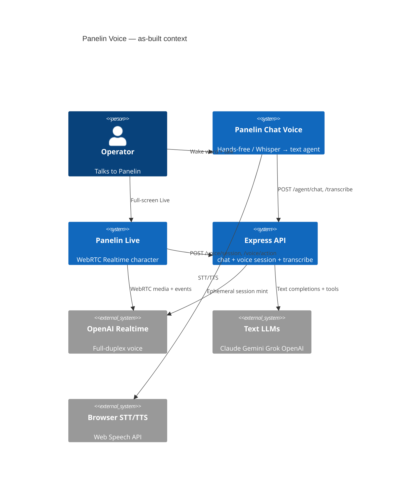
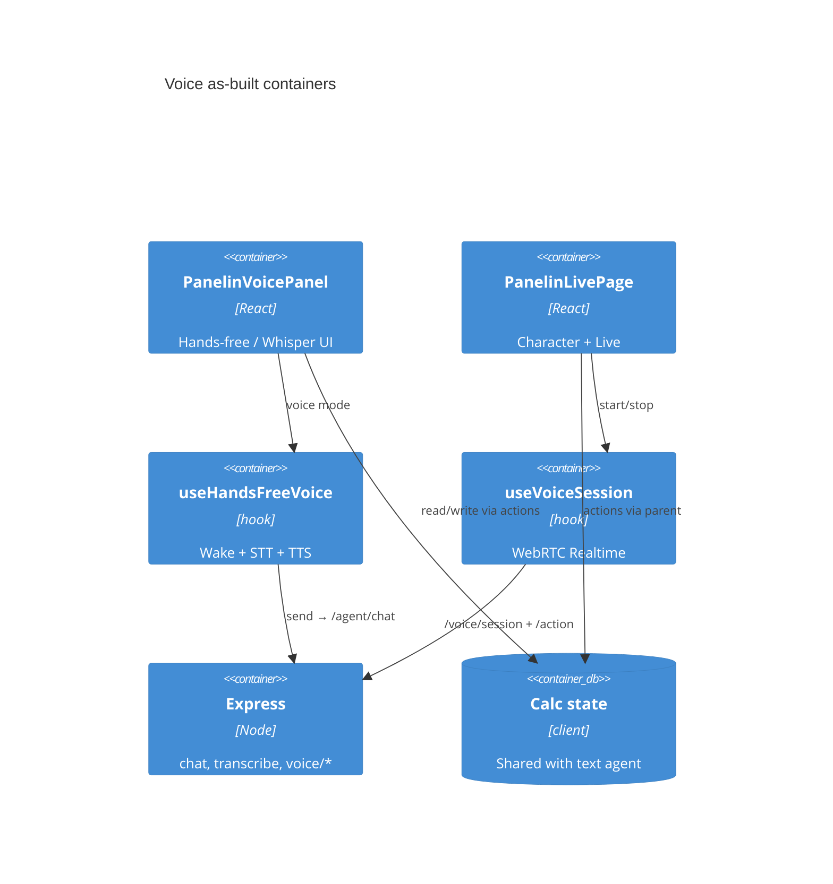
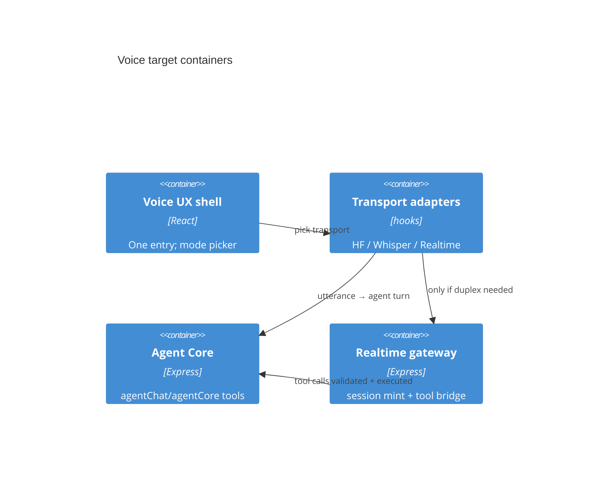
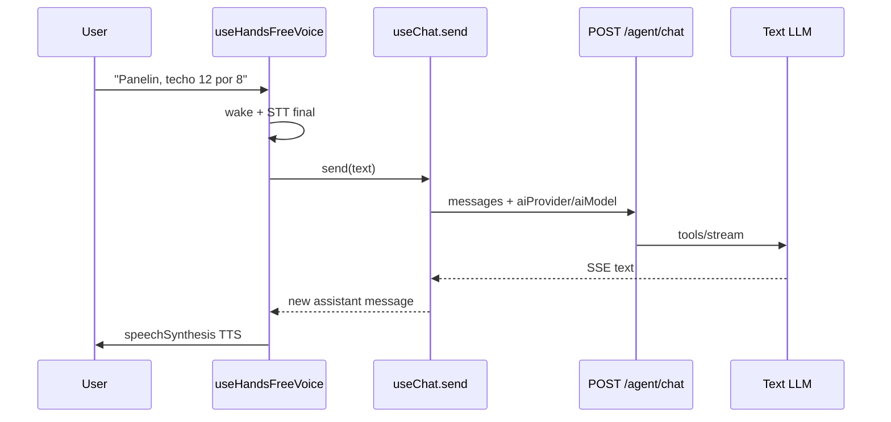
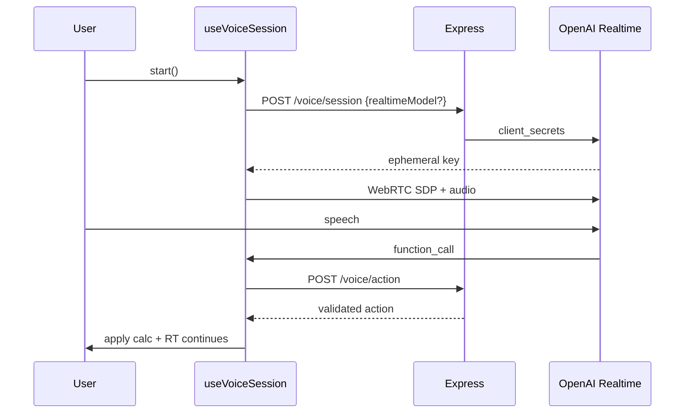
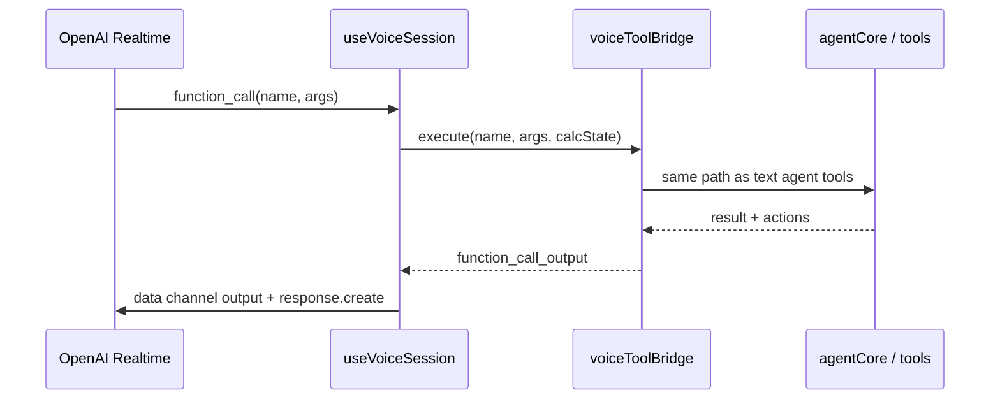

# System Design Document: Panelin Voice Agent

**Review summary:** Panelin has **two voice systems**, not one. That split is the root reason voice feels uneven: chat voice is “speech I/O around the full text agent,” while Live is “OpenAI Realtime with a small tool set.” Becoming the most functional/intelligent voice agent means **unifying intelligence** (one brain) while keeping **two transports** where necessary.

---

## 1. Introduction & Goals

### 1.1 Problem Statement (as-built)

Operators need to talk to Panelin to quote, set roof/wall params, and build quotes without typing. Today:

1. **Inside chat** (`PanelinVoicePanel`): wake word “Panelin” → browser STT → `send()` into **full text agent** → browser TTS of reply. Fallback: Whisper push-to-talk. **[CONFIRMED]** `PanelinVoicePanel.jsx:1–18`, `useHandsFreeVoice.js`.

2. **Full-screen Live** (`/panelin/live`): WebRTC → **OpenAI Realtime** with tools (`setTecho`, `buildQuote`, …) via `useVoiceSession` + `agentVoice.js`. Chrome/Edge only. **[CONFIRMED]** `voiceSupport.js:10–14`, `useVoiceSession.js:1–11`.

Pain: intelligence and tool fidelity differ; model selector affects chat path strongly, Realtime only via allowlist mapping; no shared memory/session between modes; limited barge-in / error recovery / multi-turn tool intelligence on Realtime.

### 1.2 Goals (target)

| # | Goal | Priority | Success metric |
|---|------|----------|----------------|
| G1 | One **shared brain** (same tools, same calc state, same policy) for all voice paths | P0 | Same quote accuracy as text agent on golden voice scripts |
| G2 | Best **latency + barge-in** on supported browsers | P0 | p95 first-audio / first-action under target (see §9) |
| G3 | Graceful degradation (Safari, Firefox, no OpenAI credits) | P0 | Always usable path: Whisper or hands-free → text agent |
| G4 | Selection + readiness integrated (mic disabled when AI not ready) | P1 | Red openai blocks Live; chat path uses selected text model |
| G5 | Operator-clear UX (one “Voz” product story) | P1 | Single mode matrix in UI, not two unexplained products |

### 1.3 Non-goals (v1 improvement)

- Native multi-provider Realtime (Claude/Gemini live voice WebRTC).
- Offline on-device LLM.
- Replacing browser TTS with cloned voice product (optional later).

### 1.4 Stakeholders

| Role | Interest |
|------|----------|
| Vendedor | Hands-free quoting while looking at plans |
| Admin | Reliability, cost, OpenAI billing |
| Engineering | One maintainable stack |

---

## 2. Context & Scope (C4 Level 1)



### External interfaces

| Interface | Direction | Tag |
|-----------|-----------|-----|
| `POST /api/agent/chat` | ← voice hands-free `send()` | **[CONFIRMED]** |
| `POST /api/agent/transcribe` | ← Whisper fallback | **[CONFIRMED]** voiceSupport / dictation |
| `POST /api/agent/voice/session` | ← Live mint | **[CONFIRMED]** `agentVoice.js:65+` |
| `POST /api/agent/voice/action` | ← tool validate | **[CONFIRMED]** `:286+` |
| `GET /api/agent/voice/health` | admin key check | **[CONFIRMED]** `:356+` |
| OpenAI Realtime client_secrets | → out | **[CONFIRMED]** |
| Shared selection `panelin-chat-ai-selection-v1` | client | **[CONFIRMED]** useChat + Live load |

---

## 3. Constraints

| Type | Constraint | Tag |
|------|------------|-----|
| Browser Realtime | Chrome/Edge WebRTC; Safari weak/unsupported | **[CONFIRMED]** `voiceSupport.js`, Live copy |
| Hands-free | Needs `SpeechRecognition` | **[CONFIRMED]** |
| OpenAI key | Required for Realtime + Whisper | **[CONFIRMED]** |
| Text agent keys | Gemini/Claude etc. for chat voice path | readiness SDD |
| Tool surface Realtime | Fixed list in agentVoice (not full AGENT_TOOLS) | **[CONFIRMED]** |
| Cost | Realtime session expensive vs text+STT | **[INFERRED]** |
| Security | Ephemeral client_secret; long key never to browser | **[CONFIRMED]** agentVoice header comment |

---

## 4. Solution Strategy

### 4.1 As-built strategy (what exists)

| Strategy | Implementation |
|----------|----------------|
| Dual stack | Chat = STT→agent→TTS; Live = Realtime duplex |
| Tool safety | Live tools validated server-side (`VALID_ACTION_TYPES`) |
| Ephemeral keys | Mint on server, WebRTC with client_secret |
| Wake word | Local ASR list `panelin` / variants |
| Model coupling | Chat path uses selector; Live uses `resolveRealtimeModel` |

### 4.2 Target strategy (most functional + intelligent)

**Unify the brain; specialize the ear/mouth.**

```
                    ┌─────────────────────────────┐
                    │   Panelin Agent Core        │
                    │   (tools, calc, RAG, chain) │
                    └─────────────▲───────────────┘
                                  │ same tools / state
           ┌──────────────────────┼──────────────────────┐
           │                      │                      │
    Transport H1           Transport H2            Transport H3
    Hands-free STT         Whisper STT             OpenAI Realtime
    + browser TTS          + browser TTS           (duplex audio+tools)
           │                      │                      │
      Chat panel               Chat panel            /panelin/live
```

**Intelligence hierarchy (target):**

1. **Default smart path:** Hands-free or Whisper → **full text agent** (already closest to “intelligent”).
2. **Premium duplex path:** Realtime only when OpenAI ready + Chromium + user chooses “Live”.
3. **Realtime tools expanded** to match text agent tool surface (or Realtime only for NLU, tools always via server agentCore).
4. **Optional hybrid:** Realtime for audio only; function calls always execute through `agentCore` / same tool loop as chat.

### 4.3 Architecture style

Evolve modular monolith (Express + React). Prefer **expanding chat-voice intelligence** first (cheap, multi-provider), then **Realtime parity**, then hybrid.

### 4.4 Key trade-offs

| Accept | Reject |
|--------|--------|
| Two transports long-term | Fake single stack that is Realtime-only (breaks Safari/billing) |
| Hybrid tool loop complexity | Duplicating full agent tools only inside Realtime prompt forever |
| Explicit mode labels in UI | Hiding that Live ≠ chat voice |

---

## 5. Container View (C4 Level 2)

### 5.1 As-built



### 5.2 Target (unified brain)



---

## 6. AI Architecture — Component View

### 6.1 As-built intelligence

| Path | “Brain” | Tools | Memory | Model pick |
|------|---------|-------|--------|------------|
| Hands-free | Full Panelin text agent | Full `AGENT_TOOLS` via chat | Chat history in `useChat` | Selector `aiProvider`/`aiModel` |
| Whisper | Same | Same | Same | Same |
| Live Realtime | OpenAI Realtime model | **Subset** functions in `agentVoice.js` | Realtime session only | `resolveRealtimeModel` + allowlist |

**[CONFIRMED]** Realtime tools are a small fixed list (setScenario, setLP, setTecho, setPared, setCamara, setFlete, setProyecto, buildQuote, …) — not the full agent tool catalog.

### 6.2 Gap analysis (intelligence)

| Capability | Hands-free/Whisper | Live Realtime | Target |
|------------|--------------------|---------------|--------|
| Full calc tools | Strong | Weak (subset) | Strong all paths |
| Multi-provider failover | Strong | OpenAI only | Keep for text path |
| Barge-in | Partial (wake during TTS) | Native duplex | Improve HF barge-in |
| Latency | STT+LLM+TTS (higher) | Lower duplex | Hybrid: Realtime audio + server tools |
| Quote validation | Via chat tools | `validateAndPreviewQuote` on buildQuote | Same validator always |
| Lead context | Partial | URL params Live | Shared context bag |
| Error recovery | User retries | session errors ring buffer | Unified voice error UI |
| Readiness gates | Chat lights | OpenAI key health | Mic disabled if no path ready |

### 6.3 Target AI design (most intelligent)

1. **Utterance pipeline (all transports):**  
   `audio → text (STT or Realtime transcript) → agentCore/chat tools → spoken reply (TTS or Realtime audio)`.

2. **Tool bridge for Realtime:**  
   On `function_call`, always run through the **same** server tool executor used by text agent (not only `VALID_ACTION_TYPES` mirror). Map results back to data channel.

3. **Policy:**  
   Same system prompt layers as chat (calc state, surface, operator context). Live currently uses `buildVoiceSystemPrompt` — align with chat `buildSystemPrompt` where possible.

4. **Proactive agent (later):**  
   After tool result, always speak confirmation + next question (slot-filling for missing measures).

5. **N/A for now:** multi-agent debate, RAG-heavy voice (optional short RAG already in chat path).

### 6.4 Cost model (improvement-aware)

| Mode | Cost drivers |
|------|----------------|
| Hands-free | Free STT/TTS browser + text tokens |
| Whisper | OpenAI audio STT + text tokens |
| Realtime | High continuous audio tokens |

**Policy:** Prefer hands-free when available; escalate to Realtime only for Live character / duplex preference.

---

## 7. Data Flow

### 7.1 As-built: hands-free turn



### 7.2 As-built: Live Realtime turn



### 7.3 Target: hybrid tool bridge



---

## 8. Deployment View

| Env | Voice impact |
|-----|----------------|
| Local `doppler run` API :3001 | All routes; needs OPENAI for Realtime/Whisper |
| Prod Cloud Run | Same; GSM secrets |
| Vercel SPA | Serves chat + `/panelin/live` |

Env names: `OPENAI_API_KEY`, `OPENAI_REALTIME_MODEL`, text provider keys, `API_AUTH_TOKEN` / JWT for session mint.

---

## 9. Crosscutting Concepts

### 9.1 Security
- Ephemeral Realtime secrets; never ship long-lived OpenAI key to browser **[CONFIRMED]**.
- Action allowlist on `/voice/action` (expand carefully).
- Rate limits on session mint **[CONFIRMED]** sessionLimiter.

### 9.2 Reliability
- Dual transport = degradation path.
- Wake-word restart backoff **[CONFIRMED]** `wakeRestartDelayMs`.
- Voice error ring buffer admin APIs.
- Risk: dual stacks drift (tools, prompts).

### 9.3 Performance (targets for improvements)

| Metric | Chat voice (HF) | Live Realtime | Target |
|--------|-----------------|---------------|--------|
| Time-to-first-spoken-reply | STT+LLM+TTS ~3–10s | ~1–3s | HF &lt; 5s p50; RT &lt; 2s p50 |
| Tool apply latency | After full text turn | After function_call | &lt; 500ms validate |

### 9.4 Observability
- Existing: `panelin_voice_session` log, voice error buffer.
- Target events: `voice_transport` (hf|whisper|realtime), `voice_tool_call`, `voice_ttfa_ms`.

### 9.5 Cost / sustainability
- Prefer HF/Whisper+text over continuous Realtime when possible.
- Gate Live behind OpenAI readiness light.

### 9.6 UX product clarity
- Label modes: **“Voz en chat”** vs **“Panelin Live (Realtime)”**.
- Selector already notes Realtime default for non-openai picks.

---

## 10. Architecture Decisions (ADRs)

### ADR-001: Keep two transports, unify tool brain

**Status:** Proposed (target)  
**Context:** Realtime cannot be multi-provider; HF is multi-provider intelligent.  
**Decision:** Do not delete Realtime; expand chat-voice and bridge Realtime tools to agentCore.  
**Alternatives considered:** Realtime-only (rejected: Safari/billing); HF-only (rejected: worse duplex).

### ADR-002: Chat voice remains primary “intelligent” path

**Status:** Accepted (as-built + target)  
**Context:** Full agent tools already on `send()`.  
**Decision:** Invest first in HF quality (ASR lang, barge-in, confirmations).  
**Alternatives considered:** Force all users to Live (rejected).

### ADR-003: Realtime model allowlist + shared selection

**Status:** Accepted (shipped Phase 2 selector)  
**Context:** Need safe model override.  
**Decision:** `resolveRealtimeModel` + allowlist.  
**Alternatives considered:** Arbitrary model string (rejected).

### ADR-004: Expand Realtime tools via server bridge

**Status:** Proposed  
**Context:** Subset tools limit intelligence.  
**Decision:** Bridge function calls to shared executor.  
**Alternatives considered:** Duplicate every tool schema in Realtime only (drift risk).

---

## 11. Risks & Technical Debt

| Risk | Impact | Likelihood | Mitigation |
|------|--------|------------|------------|
| Dual stack drift | High | High | Shared tool bridge + prompt modules |
| OpenAI billing kills Live | High | High | HF fallback always; readiness lights |
| Browser ASR quality (es-UY) | Medium | High | Whisper final pass option; domain phrase hints |
| Wake false positives | Medium | Medium | Stricter wake + confirmation beep |
| Realtime cost explosion | Medium | Medium | Session caps; default HF |
| Tool subset on Live wrong quotes | High | Medium | Same validator as chat; expand tools |
| SERP/keyword noise in API logs | Low | High | Ignore for voice (ops hygiene) |

---

## 12. Glossary

| Term | Meaning |
|------|---------|
| **Hands-free (HF)** | Web Speech STT + wake word + browser TTS |
| **Whisper path** | Mic → `/agent/transcribe` → text agent |
| **Realtime / Live** | OpenAI duplex WebRTC on `/panelin/live` |
| **Tool bridge** | Realtime function_call → server agent tools |
| **Brain** | Text agent / agentCore intelligence |
| **Transport** | How audio enters/leaves |

---

## Appendix A — Evidence Index

| Claim | Tag | Source |
|-------|-----|--------|
| Two stacks documented | CONFIRMED | `PanelinVoicePanel.jsx:1–8`, `voiceSupport.js:5–7` |
| Wake words | CONFIRMED | `useHandsFreeVoice.js:7–16` |
| Realtime mint model | CONFIRMED | `agentVoice.js` session + `config.js:120` |
| Action types limited | CONFIRMED | `agentVoice.js` VALID_ACTION_TYPES + tools array |
| buildQuote validation | CONFIRMED | `agentVoice.js:300–318` |
| Selector storage key | CONFIRMED | `useChat.js:7` |
| Live loads STORAGE_AI | CONFIRMED | `PanelinLivePage.jsx` loadAiSelectionFromStorage |

## Appendix B — Improvement ladder (study → most functional)

Ordered so each step increases **functionality × intelligence** without boiling the ocean.

### Tier 0 — Stabilize (ops)
1. OpenAI key funded + readiness green for Live/Whisper.  
2. Fix Anthropic garbage key if chat path should use Claude.  
3. Document modes in UI (chat voice vs Live).

### Tier 1 — Make chat voice the “smart default” (highest ROI)
1. **Domain STT hints** (isopanel, techo, pared, medidas) in SpeechRecognition / Whisper prompt.  
2. **Confirm-before-send** optional: show transcript chip “Enviar?” for noisy ASR.  
3. **Stronger barge-in** during TTS (already partial).  
4. **Spoken structured replies**: force short spoken format in system when `voiceMode` flag on request.  
5. **Mic disabled** when aggregate readiness red (no usable text provider).  
6. **Session continuity**: pass same conversationId in voice sends.

### Tier 2 — Realtime intelligence parity
1. **Tool bridge** to full agent tools / agentCore.  
2. Align `buildVoiceSystemPrompt` with chat system (catalog, prices, no invent).  
3. Lead context + calcState parity with chat.  
4. Expand allowlist models carefully; keep cost alerts.  
5. Session recovery / reconnect UX.

### Tier 3 — Product unification
1. Single **Voice hub** entry: “Rápida (chat)” vs “Live personaje”.  
2. Shared transcript panel.  
3. Metrics dashboard (ttfa, tool success, transport mix).  
4. Golden **voice scripts** in CI (text stubs + optional Live smoke).

### Tier 4 — Advanced (optional)
1. Hybrid: Realtime audio I/O + server-side NLU via text model (best of both).  
2. Streaming TTS for chat path (reduce HF latency).  
3. Multi-language; operator voice profiles.

### Recommended sequence (next engineering)

| Sprint | Deliverable |
|--------|-------------|
| **S1** | Tier 1.4–1.6 + Tier 0 UI labels (smart HF) |
| **S2** | Tier 2.1–2.2 (Realtime tool bridge + prompt align) |
| **S3** | Tier 3.1–3.3 (unified UX + metrics) |

**Do not** start multi-provider Realtime until S2 solid.

## Appendix C — Recreation / verify checklist

- [ ] Can explain dual stacks from this SDD alone  
- [ ] Can start HF voice in chat and complete a quote via tools  
- [ ] Can start Live only with OpenAI key + Chromium  
- [ ] `resolveRealtimeModel` unit tests green  
- [ ] Know which env vars gate which path  

---

**End of SDD v1.0** — As-built review + ladder to most functional intelligent voice agent.
