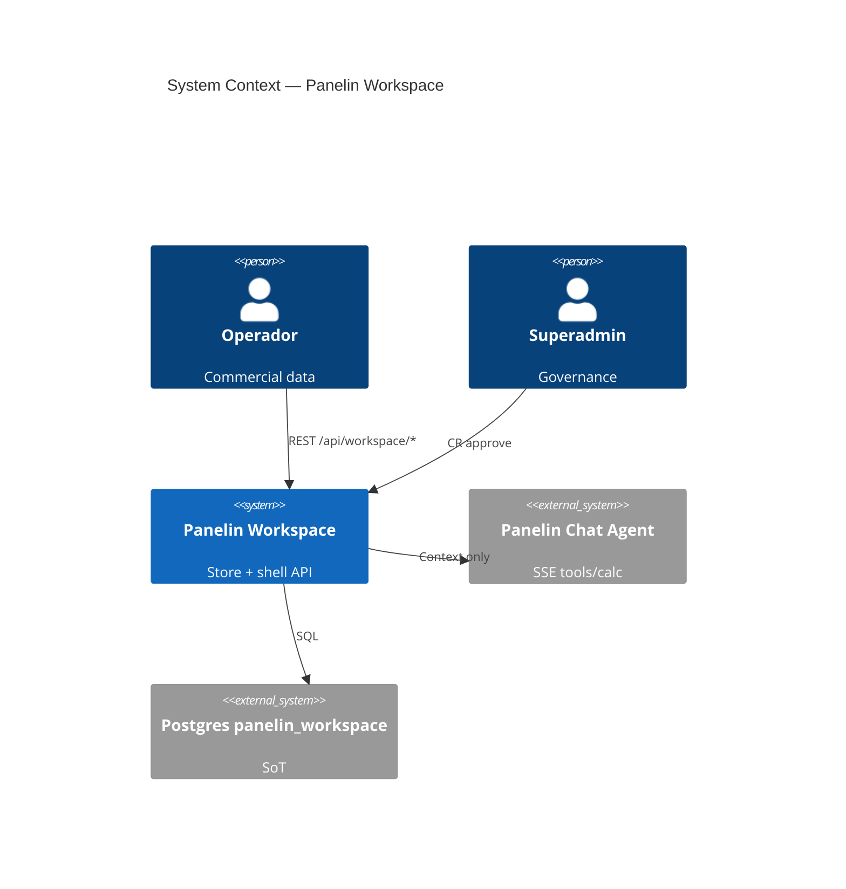
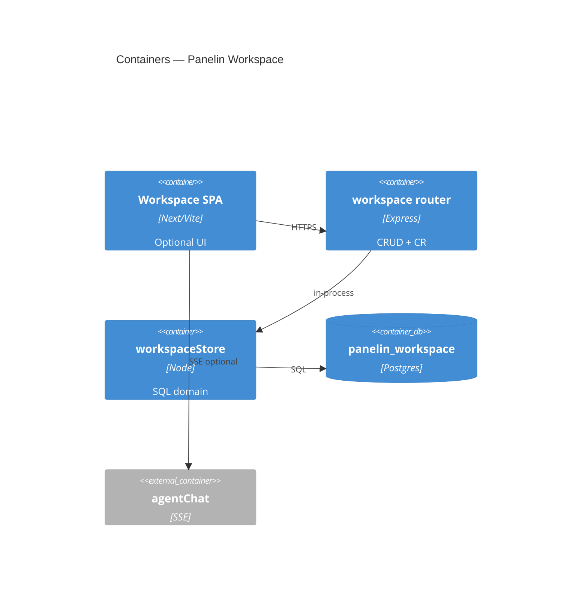
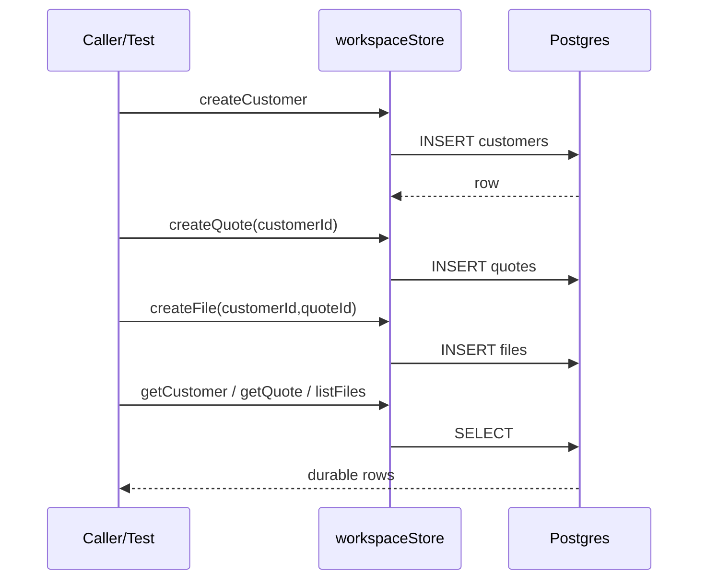

# System Design Document: Panelin Workspace

> **Store-centric commercial workspace** for BMC. Grok mockups are **UX examples only** — not hard-coded “Obra Norte” scope.  
> Evidence: **CONFIRMED** | **INFERRED** | **UNKNOWN**.

## 1. Introduction & Goals

### 1.1 Problem Statement

Operators need one place to **persist** customers, quotes, files, projects, and chat sessions — with Panelin agent assistance and HITL change-review — without inventing prices or forking a second LLM stack.

### 1.2 Goals

| ID | Goal | Priority | Status |
|----|------|----------|--------|
| G1 | First-class store: customers, quotes, files | High | **Implemented** (002 + workspaceStore) |
| G2 | Reuse Panelin agent for chat/pricing | High | Existing agent SSE |
| G3 | HITL CR including quote type | High | Schema allows `quote`; UI partial |
| G4 | Superadmin governance UI | Medium | Schema only |
| G5 | Mockups = examples only | High | Documented |

### 1.3 Stakeholders

| Role | Interest |
|------|----------|
| Operador | CRUD customers/quotes/files |
| Superadmin | CR approve, knowledge |
| Engineering | API + migrations + tests |

## 2. Context & Scope (C4 Level 1)



### External interfaces

| Interface | Dir | Protocol | Description |
|-----------|-----|----------|-------------|
| `/api/workspace/customers` | ↔ | REST | List/create/get customers |
| `/api/workspace/quotes` | ↔ | REST | List/create/get quotes |
| `/api/workspace/files` | ↔ | REST | List/create/get files (+ links) |
| `/api/workspace/projects|sessions` | ↔ | REST | Containers |
| `/api/agent/chat` | → | SSE | Existing brain (not forked) |
| Postgres | ↔ | SQL | `panelin_workspace` schema |

**CONFIRMED mounts:** `server/routes/workspace.js` via `createWorkspaceRouter`.

## 3. Constraints

- Additive schema only (`workspace-package/migrations/`)
- No raw provider keys in browser
- Prices via calc tools / agent, not free-typed totals as truth
- Auth: `requireUser` on mutating routes
- 503 if DB/schema missing

## 4. Solution Strategy

| Pillar | Choice |
|--------|--------|
| Style | Modular monolith API inside panelin-calc |
| Persistence | Pure `workspaceStore.js` + Express router |
| AI | Shell-not-brain: existing agentCore |
| Trade-off | UI SPA lag vs store completeness (store first) |

## 5. Container View (C4 Level 2)



## 6. AI Architecture — Component View

**N/A as new LLM stack.** Workspace **consumes** Panelin Chat Agent.

| Component | Role | Evidence |
|-----------|------|----------|
| agentChat SSE | Quote assistance | Existing |
| workspace context | customerId/quoteId injection (target UI) | Partial |
| CR type quote | HITL on payload diffs | Schema CONFIRMED |

## 7. Data Flow

### Primary store path (implemented)



### Domain model (as-built)

| Entity | Table | Key fields |
|--------|-------|------------|
| Customer | `customers` | name, rut, phone, email, tags, source |
| Quote | `quotes` | customer_id, title, status, totals, payload_json |
| File | `files` | customer_id, quote_id, kind, path, storage_url |
| Project | `projects` | customer_id?, name |
| Session | `sessions` | quote_id?, workflow_step |
| CR | `change_requests` | type includes **quote** |

Mockup “Obra Norte” = **example project name**, not schema.

## 8. Deployment View

| Env | API | Migrate | Secrets |
|-----|-----|---------|---------|
| Local | Express :3001 | `npm run workspace:migrate` | DATABASE_URL |
| Prod | Cloud Run panelin-calc | same migrations in deploy path | GSM |

Health: schema missing → 503 + hint.

## 9. Crosscutting Concepts

### 9.1 Security
- `requireUser` on workspace CRUD routes
- Superadmin for CR approve/reject
- No API keys in client config payloads (masked only)

### 9.2 Reliability
- Soft-fail loadState if customers/quotes tables absent (pre-002)
- Connection errors → 503

### 9.3 Performance
- Indexes on workspace_id, customer_id, quote_id

### 9.4 Observability
- `telemetry_events` table + existing agent costTelemetry

### 9.5 Cost
- No extra LLM cost for pure store CRUD

## 10. Architecture Decisions (ADRs)

### ADR-001: Shell not brain
**Status:** Accepted  
**Decision:** Reuse agent SSE; workspace is domain store + shell.  
**Alternatives:** Separate LLM app — rejected.

### ADR-002: First-class Customer + Quote
**Status:** Accepted  
**Decision:** Dedicated tables (002), not only PDF filenames.  
**Evidence:** `002_customers_quotes_store.sql`, `workspaceStore.js`

### ADR-003: Pure store module
**Status:** Accepted  
**Decision:** `workspaceStore.js` for testable SQL without JWT.  
**Consequences:** + Tests; − Router must stay thin.

### ADR-004: CR type quote
**Status:** Accepted  
**Decision:** Extend CHECK to include `quote` and `file`.

### ADR-005: No client secrets
**Status:** Accepted  
**Decision:** Mock admin key fields are not production behavior.

## 11. Risks & Technical Debt

| Risk | Impact | Likelihood | Mitigation |
|------|--------|------------|------------|
| Dual CRM (Sheets/Omni) | Medium | High | Bridge external_id later |
| SPA not wired to new routes | Medium | High | UI follow-up |
| Binary storage not GCS yet | Low | Medium | path + storage_url fields ready |
| Auth required for HTTP smoke | Low | High | Store tests use pool directly |

## 12. Glossary

| Term | Meaning |
|------|---------|
| Customer | Client master |
| Quote | Cotización business object |
| File | Artifact linked to customer/quote/project/session |
| Store | Durable domain tables + workspaceStore |
| Shell | UI around existing Panelin agent |

## Appendix A — Evidence

| Item | Path |
|------|------|
| Migration 002 | `workspace-package/migrations/002_customers_quotes_store.sql` |
| Store | `server/lib/workspaceStore.js` |
| Router | `server/routes/workspace.js` |
| Tests (store) | `tests/workspace-store.test.js` (4 pass vs real DB) |
| Tests (HTTP API) | `tests/workspace-api-store.test.js` (4 pass, auth + routes) |
| Gate evidence | `evidence/GATE-NOTE.md` + `*.log` |
| Vision assets | `evidence/vision-assets.md` (no binaries) |

## Appendix B — API surface (store)

| Method | Path |
|--------|------|
| GET/POST | `/api/workspace/customers` |
| GET | `/api/workspace/customers/:id` |
| GET/POST | `/api/workspace/quotes` |
| GET | `/api/workspace/quotes/:id` |
| GET/POST | `/api/workspace/files` |
| GET | `/api/workspace/files/:id` |

## Appendix C — Quality gates

```bash
npm run workspace:migrate
node --test tests/workspace-store.test.js
node --test tests/workspace-api-store.test.js
```

Evidence pack: `evidence/workspace-store-test.log`, `evidence/workspace-api-test.log`, `evidence/GATE-NOTE.md` (2026-08-04 closeout).
